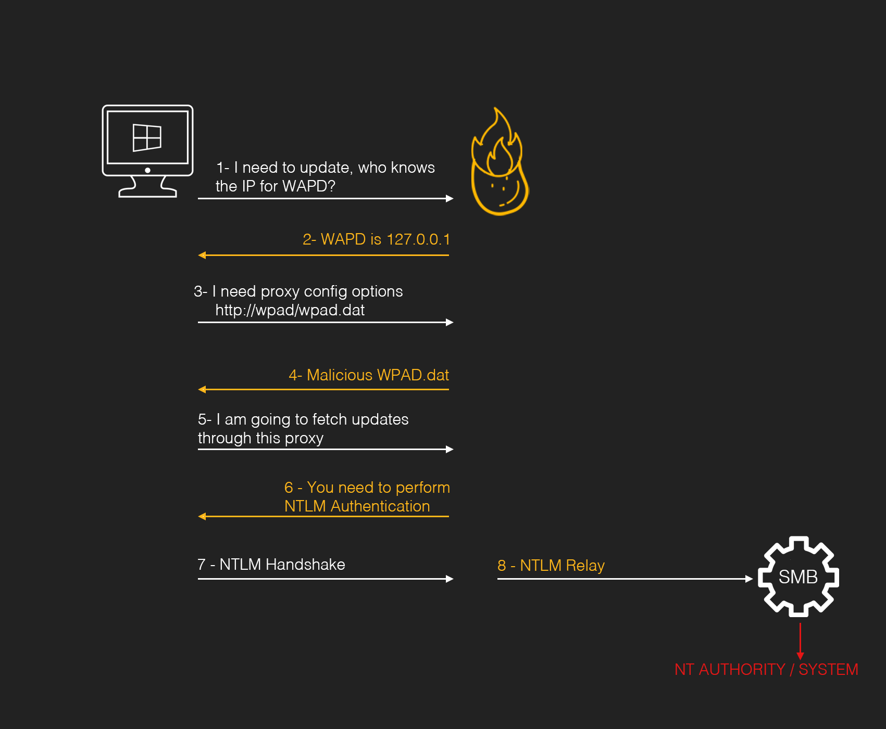

This Page will cover the following Windows Privilege Escalation Techniques in details.
1. Hot Potato
2. Rotten Potato
3. Lonely Potato
4. Juicy Potato
5. Rogue Potato
6. Sweet Potato
7. Generic Potato

## Hot Potato Windows Privilege Escalation
---
#### Background Theory

Hot Potato is a Windows Privilege Escalation Techniques to gain local privilege escalation in default configuration such as NTLM Relay (More specific to HTTP --> SMB Relay) and NBNS Spoofing. Using this technique, we can elevate our low privilege to "NT AUTHORITY\SYSTEM" privilege - The Highest level of privilege on the Windows System. This exploit consist of 3 main parts and all of which can be configurable through the command line switches.

##### Part 1 - Local NBNS (NetBIOS Name Service) Spoofer

NBNS is a broadcast UDP protocol for the name resolution commonly used in Windows. When you perform a DNS lookup, Windows will first check the hosts file. If no entry exist, it will then attempt to perform the DNS Lookup. If the DNS Lookup fails, an NBNS Lookup will be performed. The NBNS Protocol will basically just ask all the host on the local broadcast domain "Who knows the IP address of A.B.C.D?". Any host on the network is free to respond however they wish.

During the penetration testing, we sometimes sniff the network traffic and respond the NBNS queries observed on the local network. We will impersonate all the hosts, replying to every request with our IP address in the hope that the resulting connection will something interesting like trying to authenticate.

For the Privilege Escalation purpose, We can't assume that we are going to sniff the network traffic because that will require local admin access. So how to accomplish NBNS Spoofing?

If we know ahead of time which hostname a target machine will be sending the NBNS query for, we can craft the fake response and flood the target host with NBNS response quickly. In this case, our target is 127.0.0.1 (localhost). One challenging part is that the 2-byte field in the NBNS packet, the TXID. The TXID must match in the NBNS Request and Response. But we can solve this by flooding with NBNS responses quickly and iterating over all 65536 possible values. We can flood quickly because it's UDP. 

What if the network we are targeting has the DNS record present in the host file which we want to spoof? Well, we can overcome this by using UDP Port Exhaustion to force all the DNS Lookup on the system to fail. All we do is bind every single UDP port. This cause DNS to fail because there will be no available UDP source port for the Request. When DNS Lookup Fail, NBNS Lookup will fallback.

##### Part 2 - Fake WPAD Proxy Server

In Windows, Internet Explorer by default will automatically try to detect network proxy setting configuration by accessing the URL “[http://wpad/wpad.dat&#8221](http://wpad/wpad.dat&#8221);. This also surprisingly applies to some Windows services such as Windows Update, but exactly how and under what conditions seems to be version dependent.

Of course the URL “[http://wpad/wpad.dat&#8221](http://wpad/wpad.dat&#8221); wont exist on all networks because the hostname “wpad” won't necessarily exist in the DNS nameserver. However as we saw above, we can spoof host names using NBNS spoofing.

With the ability to spoof NBNS responses, we can target our NBNS spoofer at 127.0.0.1. We flood the target machine (our own machine) with NBNS response packets for the host “WPAD”, or “WPAD.DOMAIN.TLD”, and we say that the WPAD host has IP address 127.0.0.1.

At the same time, we run an HTTP server locally on 127.0.0.1. When it receives a request for “[http://wpad/wpad.dat&#8221](http://wpad/wpad.dat&#8221);, it responds with something like the following:
```
FindProxyForURL(url,host){
if (dnsDomainIs(host, "localhost")) return "DIRECT";
return "PROXY 127.0.0.1:80";}
```
This will cause all HTTP traffic on the target to be redirected through our server running on 127.0.0.1. Interestingly, this attack when performed by even a low privilege user will affect all users of the machine. This includes administrators and system accounts.

##### Part 3 - HTTP --> SMB NTLM Relay

The NTLM protocol is vulnerable to man-in-the-middle (MiTM) attack. If an attacker can trick a user into trying to authenticate using NTLM to his machine, he can relay (Receive and Pass On) that authentication attempt to another machine. The Older version of this attack where the Victim authenticate to the attacker's machine with the NTLM to gain access to SMB then the attacker would use the same credentials back to the Victim's computer to gain remote access using "psexec" like techniques.

Microsoft Patch this vulnerability by disallowing Same Protocol NTLM Authentication. What does this means is that  SMB --> SMB NTLM Relay (Receive and Pass On) to the same host will not work. However, Cross Protocol Attack such as HTTP --> SMB will still work with no issue.

With HTTP traffic following through our own controlled HTTP Server, We can redirect them to somewhere that will request NTLM Authentication.

In the Potato Exploit, All the HTTP requests are redirected with the "302 Redirect" to “[http://localhost/GETHASHESxxxxx&#8221](http://localhost/GETHASHESxxxxx&#8221);, where xxxxx is some unique identifier. Requests to “[http://localhost/GETHASHESxxxxx&#8221](http://localhost/GETHASHESxxxxx&#8221); respond with a 401 (401 - UNAUTHORIZED) request for NTLM authentication. Any NTLM credentials are then relayed (Received and Passed On) to the local SMB listener to create a new system service that runs a user-defined command.

When the HTTP request in question originates from a high privilege account, for example, when it is a request from the Windows Update service, this command will run with “NT AUTHORITY\SYSTEM” privilege!

The following Image demonstrate the above Three Parts


Therefore, the vulnerability uses the following sequence
1. Local NBNS Spoofer : To Impersonate the name resolution and force the system to download a malicious WAPD Configuration.
2. Fake WPAD Proxy Server: Deploy a malicious WPAD configuration to force the system to perform a NTLM authentication.
3. HTTP -> SMB NTLM Relay: Relays the WPAD NTLM token to the SMB service to create an elevated process.

This is an OnGoing notes... I will Add things as i solved more HTB Machines